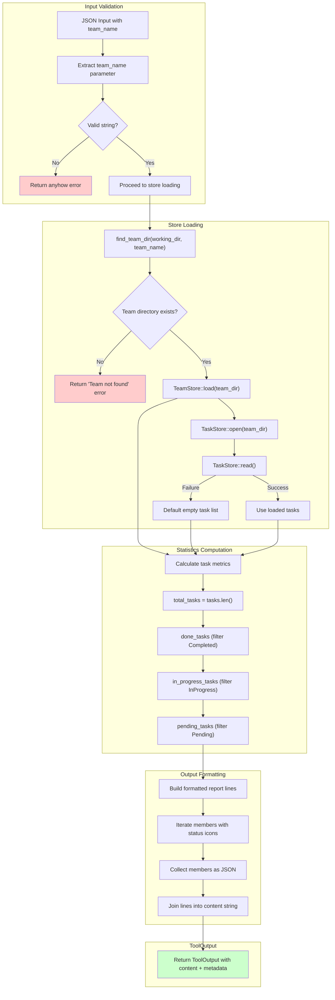

# TeamStatusTool

**Type:** technology

### From: team_status

TeamStatusTool is a concrete implementation of the Tool trait within the ragent-core framework, specifically designed to provide comprehensive visibility into the operational state of multi-agent teams. The struct itself is a zero-sized type (unit struct), following a common Rust pattern for stateless service objects that rely entirely on external context and persistent storage rather than internal mutable state. This design choice enables the tool to be instantiated cheaply and used concurrently across multiple execution contexts without synchronization concerns.

The tool's primary responsibility is aggregating distributed state from two persistence layers: the TeamStore, which contains team configuration metadata including member definitions and team-level status, and the TaskStore, which tracks individual task lifecycle information. By combining these data sources, TeamStatusTool produces a holistic view of system health that neither store could provide in isolation. The implementation demonstrates sophisticated error handling through the use of `anyhow` for contextual error propagation and explicit fallback behaviors—for instance, task store failures result in empty task lists rather than complete execution failure, ensuring diagnostic tools remain available even when portions of the system are degraded.

A distinguishing characteristic of this implementation is its dual-output design philosophy. The tool recognizes that agent system outputs serve multiple consumers: human operators needing immediate situational awareness, and downstream automated systems requiring structured data for decision-making. The formatted string output uses visual encoding (emoji status icons) to maximize information density for human scanning, while the JSON metadata field provides normalized, type-safe data for programmatic consumption. This dual-mode output represents a pragmatic approach to interface design in hybrid human-machine systems.

## Diagram

## External Resources

- [Anyhow crate documentation for flexible error handling in Rust applications](https://docs.rs/anyhow/latest/anyhow/) - Anyhow crate documentation for flexible error handling in Rust applications
- [Serde serialization framework documentation for Rust data structures](https://serde.rs/) - Serde serialization framework documentation for Rust data structures
- [async-trait crate enabling async methods in Rust traits](https://docs.rs/async-trait/latest/async_trait/) - async-trait crate enabling async methods in Rust traits

## Sources

- [team_status](../sources/team-status.md)
