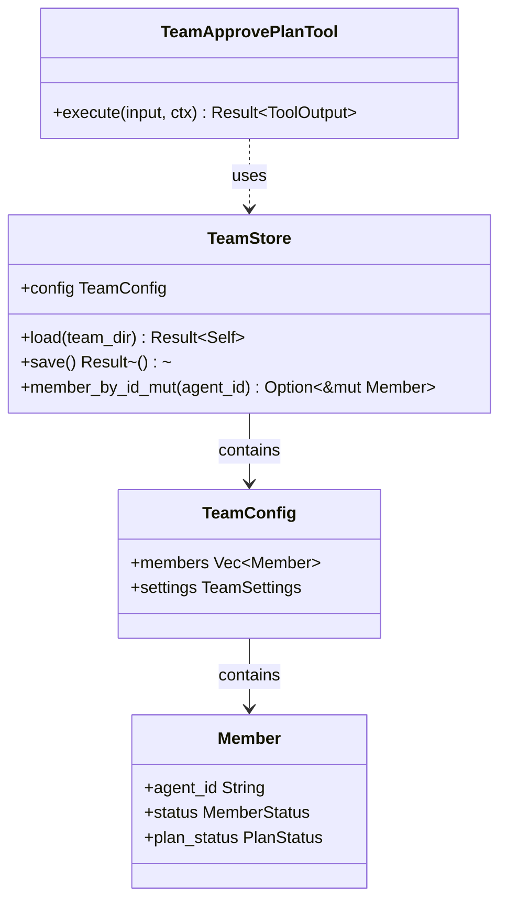

# TeamStore

**Type:** technology

### From: team_approve_plan

TeamStore is a persistent storage abstraction that manages team configuration and member state in the agent coordination system. This entity represents the authoritative source of truth for team composition, member statuses, and plan states. The implementation pattern suggests a file-backed persistence mechanism, with the `load` method reconstructing state from disk and `save` committing changes atomically. The store provides typed access to team members through methods like `member_by_id_mut`, which returns mutable references enabling state updates while maintaining Rust's ownership safety guarantees.

The design of TeamStore follows the Repository pattern, abstracting persistence details from business logic and enabling potential future migrations to different storage backends. The store encapsulates a `config` field containing team structure, suggesting hierarchical organization where teams have configurable properties alongside their member rosters. The mutation methods enforce consistency by requiring mutable access, preventing accidental concurrent modifications that could lead to race conditions in multi-threaded contexts. This careful API design reflects hard-won experience with concurrent state management in distributed systems.

The relationship between TeamStore and TeamApprovePlanTool illustrates dependency inversion principles, where high-level workflow logic depends on abstractions rather than concrete storage implementations. The store's role extends beyond simple CRUD operations to maintaining invariants about valid state transitions—though the actual state machine logic resides in the tool, the store ensures persistence integrity. The directory-based organization implied by `find_team_dir` suggests teams are self-contained units with isolated storage, enabling easy backup, migration, and potential distributed deployment across filesystem boundaries.

## Diagram

## External Resources

- [Rust lifetimes and ownership for safe mutable references](https://doc.rust-lang.org/rust-by-example/scope/lifetime.html) - Rust lifetimes and ownership for safe mutable references
- [Repository pattern by Martin Fowler](https://martinfowler.com/eaaCatalog/repository.html) - Repository pattern by Martin Fowler

## Sources

- [team_approve_plan](../sources/team-approve-plan.md)

### From: team_broadcast

TeamStore serves as the persistence layer for team configuration and state within the ragent-core framework, enabling durable storage of multi-agent team structures across process lifecycles. The implementation likely uses a filesystem-based approach where each team maintains its own directory containing serialized configuration and runtime state. This design choice prioritizes operational simplicity and inspectability, allowing administrators to examine team structures through standard filesystem tools while maintaining ACID properties through careful file operations.

The store's primary responsibility is maintaining the authoritative list of team members and their associated metadata, including operational status indicators that drive communication routing decisions. When `TeamStore::load` is invoked, it deserializes this configuration from persistent storage, making it available for runtime queries and modifications. The struct exposes its internal `config` field directly, suggesting a data-oriented design where the store acts primarily as a loading mechanism rather than an abstraction barrier, with business logic residing in consuming components like `TeamBroadcastTool`.

The relationship between TeamStore and team directories establishes a clear persistence model: teams are named entities with isolated storage, discovered through the `find_team_dir` utility function that likely implements a search strategy across configured workspace paths. This supports multi-tenancy scenarios where different teams may operate with different permissions, resource limits, or operational policies. The loading pattern returning `Result<Self>` ensures that corrupted or missing team data propagates errors appropriately, preventing undefined behavior in downstream components.

### From: team_cleanup

TeamStore represents the persistence abstraction layer for team configurations within the ragent system, providing structured access to on-disk team metadata and state. This entity serves as the authoritative source for team composition, member statuses, and lifecycle states, enabling tools like TeamCleanupTool to make informed decisions about permitted operations. The store pattern encapsulates serialization concerns, likely handling JSON or similar structured format persistence while presenting a typed Rust interface to consumers.

The integration between TeamCleanupTool and TeamStore demonstrates a read-modify-write pattern for state transitions. During validation, the tool loads the store in read-only mode to inspect member configurations without acquiring write locks. When proceeding to disbandment, a second load operation obtains mutable access for status modification. This approach minimizes lock contention while ensuring fresh state reads, critical in concurrent multi-agent environments where member statuses may change rapidly.

The store's design exposes configuration through a public config field containing members and status information, suggesting a deliberately transparent data model that prioritizes operational visibility over strict encapsulation. This architectural choice enables tools to perform complex queries—such as the filter-map-collect chain for active member detection—without requiring specialized query methods on the store itself. The simplicity reduces API surface area while maintaining flexibility for diverse tool implementations.

### From: team_create

The `TeamStore` is a fundamental persistence abstraction within the Ragent framework, providing durable storage and retrieval capabilities for team configurations, task states, and member information. As evidenced by its usage in `team_create.rs`, `TeamStore` serves as the authoritative interface for team lifecycle operations, encapsulating filesystem operations and providing transactional semantics for team mutations. The implementation supports both creation of new team stores and loading of existing ones, with special recovery modes for handling corrupted or partially initialized state.

The `TeamStore::create` method establishes the foundational directory structure for a team, associating it with a specific session identifier and working directory. This session binding ensures that team operations are contextualized within the correct execution environment, preventing cross-contamination between different invocations or projects. The `load_by_name` method enables retrieval of existing teams by their human-readable identifiers, while `initialize_existing_without_config` provides a recovery pathway when configuration files are missing but the team directory structure exists.

Beyond basic CRUD operations, `TeamStore` exposes rich functionality for task and member management. The `next_task_id` method generates unique identifiers for tasks, with fallback timestamp-based generation when the primary mechanism fails. The `add_task` and `remove_task` methods enable dynamic task list manipulation, supporting the hook-based validation pattern demonstrated in the task seeding workflow. Field access to `store.dir` reveals that `TeamStore` maintains awareness of its filesystem location, enabling derived operations like hook execution and file-based persistence. The abstraction effectively isolates the rest of the system from filesystem details while providing the flexibility needed for complex multi-agent coordination scenarios.

### From: team_memory_read

TeamStore represents the persistent configuration and state management system for agent teams in this architecture. This component maintains team definitions, member registries, and associated metadata that enable coordinated multi-agent operations. The store serves as the authoritative source for team membership validation, agent identity resolution, and memory scope configuration, forming a critical dependency for tools like TeamMemoryReadTool that must verify operational permissions before executing filesystem operations.

The TeamStore implementation follows a load-and-query pattern where team directories are identified through filesystem traversal, then deserialized into structured configuration objects. The store encapsulates team-level configuration including the members vector that associates agent identifiers with display names and memory permissions. This design enables dynamic team composition where agents can be added, removed, or reconfigured without requiring system restarts or code changes.

As a centralized coordination point, TeamStore embodies the principle that multi-agent systems require explicit governance mechanisms. The configuration-driven approach separates policy from implementation, allowing teams to define their own operational boundaries while the enforcement remains consistent across all tools. The store's integration with filesystem-based persistence aligns with infrastructure-as-code practices, enabling version-controlled team definitions and reproducible deployment configurations.

### From: team_memory_write

TeamStore represents the persistence layer for team configuration and membership information in the ragent framework. This struct provides the bridge between runtime agent identity and durable team definitions stored on the filesystem. The implementation reveals that TeamStore loads from a team-specific directory and exposes a config field containing team membership information, enabling the memory write tool to validate agent identities and retrieve their configured memory scopes.

The loading pattern demonstrated—TeamStore::load(&team_dir)—suggests a directory-based configuration system where teams are self-contained units with their own storage. This architecture supports dynamic team composition where agents can be added, removed, or reconfigured without system-wide restarts. The store's config.members field is iterated to find matching agent_id values, indicating that team membership is explicitly declared rather than implicitly derived, providing administrators with fine-grained control over which agents may participate in which teams.

The relationship between TeamStore and memory operations creates a dependency chain that enforces organizational boundaries. Before any memory write can occur, the system must: locate the team directory, load its persisted configuration, validate the requesting agent's membership, and retrieve their memory scope settings. This multi-step validation ensures that agents cannot spoof identities or access memory spaces belonging to other teams, even if they possess valid credentials at the session level. The error messages distinguish between "Team not found" and "Agent not found in team" conditions, providing clear diagnostics for different configuration failure modes.

### From: team_message

TeamStore serves as the central configuration and state management repository for teams within the agent framework. The code reveals it as a loader for team configurations from disk, with a `load` method that accepts a team directory path and returns a fully initialized store object. This design pattern—separating construction from the type itself—enables flexible initialization strategies and supports dependency injection for testing purposes, where mock team stores could substitute for filesystem-backed implementations.

The exposed `config` field on `TeamStore` suggests a public data member containing structured configuration, likely deserialized from a `config.json` file within the team directory. The `member_by_name` method shown in usage indicates that team membership information includes mappings between human-readable names and canonical agent identifiers, supporting the name resolution workflow that allows users to reference "alice" rather than requiring "tm-007". This indirection layer is crucial for usability in systems where agent IDs may be opaque or system-generated.

TeamStore's role extends beyond simple configuration loading; it acts as the source of truth for team topology and membership. In production deployments, this might expand to include dynamic team membership, role-based access control lists, or integration with external identity providers. The filesystem-centric design shown here implies a preference for version-controllable, human-readable configuration over database persistence, aligning with infrastructure-as-code practices and enabling team definitions to be stored alongside application code in version control systems.

### From: team_shutdown_ack

TeamStore is a persistent storage abstraction that manages team configuration and member state in the ragent-core multi-agent system. This component serves as the authoritative source of truth for team membership, agent statuses, and task assignments, implementing a file-based persistence strategy that enables state recovery across agent restarts and coordination across distributed agent processes. The store provides transactional-style operations through load and save methods, ensuring that state changes are atomically persisted to durable storage.

The TeamStore's design reflects the challenges of coordinating state in distributed systems without requiring external database dependencies. By using filesystem-based storage with structured serialization, it achieves portability and simplicity while maintaining consistency guarantees. The member_by_id_mut method exemplifies the store's approach to safe concurrent access patterns in Rust, returning mutable references that allow status updates while the store is held in scope, with changes committed through explicit save calls.

This storage layer is particularly significant in graceful shutdown scenarios, as demonstrated by TeamShutdownAckTool's usage pattern. The ability to mark members as Stopped and persist this status immediately ensures that team leads can query accurate membership states even if agents terminate unexpectedly. The store's integration with the find_team_dir utility function enables location-transparent team discovery, supporting flexible deployment topologies where team directories may be organized according to administrative conventions rather than fixed paths.

### From: team_shutdown_teammate

TeamStore serves as the persistent state management layer for team configurations and member statuses within the ragent-core framework, representing a critical infrastructure component for maintaining team consistency across process lifecycles. This entity provides atomic operations for loading team configurations from disk, modifying member states including the ShuttingDown status transition, and persisting changes back to stable storage. The TeamStore's design enables safe concurrent access patterns through its load-modify-save cycle, where the brief mutable borrow shown in TeamShutdownTeammateTool's implementation ensures that state changes are committed before proceeding to message delivery operations.

The persistence model underlying TeamStore likely implements a directory-based structure where each team maintains its own configuration store, enabling isolation between different teams and supporting multi-tenant deployment scenarios. The find_team_dir function used in conjunction with TeamStore suggests a filesystem-backed approach that provides durability guarantees essential for recovery scenarios—if a lead agent crashes after marking a member as ShuttingDown but before delivering the mailbox message, the persistent state enables reconstruction of intended operations upon restart. This durability characteristic distinguishes TeamStore from purely in-memory state management and aligns with production requirements for reliable agent orchestration.

TeamStore's member_by_id_mut method enables precise targeted updates to individual team members without requiring full configuration rewrites, optimizing I/O patterns for large teams. The status field transitions managed through this interface—from operational states through ShuttingDown to eventual termination—form the backbone of the team lifecycle state machine. These transitions are observable by other system components, enabling reactive behaviors such as load balancers ceasing to route work to shutting-down agents, monitoring systems tracking termination progress, and audit systems recording compliance with graceful shutdown policies. The tight integration between TeamStore and the permission system ensures that state modifications respect the 'team:manage' authorization boundary.

### From: team_spawn

The `TeamStore` represents a persistent storage abstraction for team configuration and membership data, referenced in the `TeamSpawnTool` implementation for memory scope persistence operations. This component handles filesystem-based persistence of team metadata, enabling durable configuration across agent sessions and process restarts. The integration pattern shown—`TeamStore::load(&team_dir)` followed by mutation and `save()`—follows a classic active record or repository pattern adapted for Rust's ownership and error handling semantics.

The specific usage in `team_spawn.rs` focuses on member-level memory scope configuration: when a non-default memory scope is specified, the code attempts to locate the team directory, load the store, mutate the specific member's `memory_scope` field through `member_by_id_mut`, and persist changes. This targeted persistence suggests `TeamStore` maintains structured data including per-member attributes beyond simple membership lists. The error handling—using `let Ok(mut store)` binding and silent failure on save through `let _ = store.save()`—indicates opportunistic persistence where the spawn operation succeeds regardless of storage durability outcomes.

The `TeamStore`'s relationship with `find_team_dir` helper function and explicit filesystem paths suggests a workspace-oriented organization where teams correspond to directories with conventional structure. This design supports multiple concurrent teams, project isolation, and potential version control integration. The memory scope persistence feature—coupling ephemeral runtime configuration with durable team structure—enables sophisticated multi-session workflows where teammates maintain context across invocations, a critical capability for long-running collaborative agent scenarios.

### From: team_status

TeamStore serves as the authoritative persistence layer for team configuration and runtime state within the ragent multi-agent framework. This entity encapsulates the complex responsibility of maintaining durable records of team existence, membership composition, and high-level operational status across process restarts and distributed executions. The implementation leverages Rust's type system to ensure that loaded team data maintains referential integrity—members reference valid agent configurations, sessions are properly tracked, and status transitions follow valid state machine rules.

The storage architecture implied by the TeamStatusTool usage suggests a directory-based persistence model where each team occupies a dedicated filesystem location containing structured data files. The `TeamStore::load` method accepts a directory path and reconstructs the complete team state from this persistent representation, handling serialization concerns transparently through what appears to be JSON or similar text-based encoding. This approach enables human inspection and manual repair of team configurations, a crucial operational capability for long-running agent systems where automated recovery may be insufficient.

TeamStore maintains several critical data structures accessed by the status tool: the team `config` containing metadata like `name`, `status`, `lead_session_id`, and the `members` vector. Each member encapsulates runtime binding between logical member names, concrete `agent_id` references, dynamic `status` fields, and optional `current_task_id` associations. This data model supports sophisticated orchestration patterns including dynamic team resizing, leader election, task assignment tracking, and graceful degradation scenarios where members enter states like Blocked or ShuttingDown.

### From: team_task_create

TeamStore serves as the primary interface for team-level state management and coordination operations within the agent framework. Its responsibilities encompass loading team configuration, managing team-scoped task identifiers, and orchestrating task collection operations. The load method establishes a connection to team-specific storage given a directory path, while next_task_id generates unique identifiers for new tasks—critical for preventing collisions in concurrent task creation scenarios.

The store's add_task method integrates individual Task instances into the team's collective work queue, establishing the membership relationship between tasks and their containing teams. This operation likely triggers persistence and potentially indexing for subsequent query operations. The TeamStore abstraction encapsulates the complexity of team state management, providing a transaction-like interface where operations can be composed and errors propagated through the Result type system.

TeamStore's design reflects requirements for multi-tenancy in agent systems, where multiple teams may coexist with isolated state and distinct configurations. The directory-based initialization (via load) suggests support for dynamic team discovery and runtime team creation. By centralizing task ID generation, TeamStore ensures globally unique identifiers within team scope while potentially encoding team identity or creation timestamps in identifier structure. This centralized coordination point is essential for maintaining consistency in distributed scenarios where multiple agents may simultaneously attempt task creation operations.

### From: team_wait

TeamStore represents the persistent state management layer for team configurations and runtime status in this multi-agent system. It functions as the source of truth for team membership, agent states, and organizational metadata, bridging the gap between configuration files on disk and runtime memory representations.

The TeamStore API exposed to TeamWaitTool includes several critical operations: load_by_name for direct team retrieval by identifier, list_teams for discovery of available teams with modification-time sorting, and the standard load for directory-based initialization. These methods abstract the underlying storage mechanism—likely JSON or similar serialization formats on the filesystem—providing type-safe Rust structs through serde deserialization. The working_dir parameter establishes project-scoped isolation, ensuring teams from different projects don't interfere.

The runtime state tracked in TeamStore includes the Config object containing members: Vec<TeamMember>, where each TeamMember maintains fields including agent_id, name, and critically the status: MemberStatus enum. The eight-variant MemberStatus enum captures the complete lifecycle: Idle (ready for work), Working (actively processing), Spawning (initialization in progress), PlanPending (awaiting plan approval), Blocked (dependency waiting), Failed (error terminal state), ShuttingDown (graceful termination), and Stopped (completed terminal state). TeamWaitTool specifically filters for the four active non-terminal states when building its wait set, treating Idle, Failed, and Stopped as completion-equivalent for its purposes.
