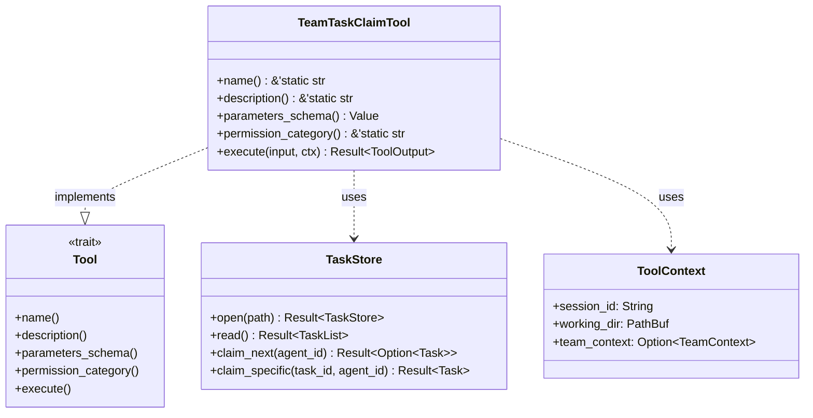

# TeamTaskClaimTool

**Type:** technology

### From: team_task_claim

TeamTaskClaimTool is the core implementation struct exposed in this source file, representing a concrete tool within a larger multi-agent framework. It implements the Tool trait using async_trait, enabling asynchronous execution within Rust's async ecosystem. The struct itself is a zero-sized type (unit struct), serving purely as a marker for behavior implementation rather than carrying state, which aligns with the functional design pattern where state management is delegated to the TaskStore and ToolContext dependencies.

The tool's architecture supports two distinct claim patterns that reflect real-world team coordination needs. The first pattern enables autonomous task acquisition where agents poll for available work, claiming the highest-priority unblocked task. The second pattern supports directed assignment workflows where a team lead pre-assigns specific task IDs to agents, who then claim those exact tasks. This dual-mode design accommodates both pull-based and push-based work distribution models within the same interface, reducing the need for separate tools and simplifying agent instruction sets.

The implementation demonstrates production-grade Rust patterns including comprehensive error propagation through anyhow, structured logging via tracing, and JSON schema generation for tool discovery. The execute method's control flow handles four distinct outcomes: successful specific claim, successful next-available claim, failure due to existing task ownership, and failure due to unavailable or blocked tasks. Each path produces appropriately formatted human-readable content alongside machine-parseable metadata, supporting both LLM consumption and external workflow automation. The dependency-aware error handling with contextual guidance ('Tip: This task has dependencies...') reveals thoughtful UX design for agent systems where automated retry loops might otherwise waste compute resources.

## Diagram

## External Resources

- [async_trait crate documentation for async trait implementation in Rust](https://docs.rs/async-trait/latest/async_trait/) - async_trait crate documentation for async trait implementation in Rust
- [Serde serialization framework documentation for JSON handling](https://serde.rs/) - Serde serialization framework documentation for JSON handling
- [anyhow crate for idiomatic error handling in Rust applications](https://docs.rs/anyhow/latest/anyhow/) - anyhow crate for idiomatic error handling in Rust applications

## Sources

- [team_task_claim](../sources/team-task-claim.md)
