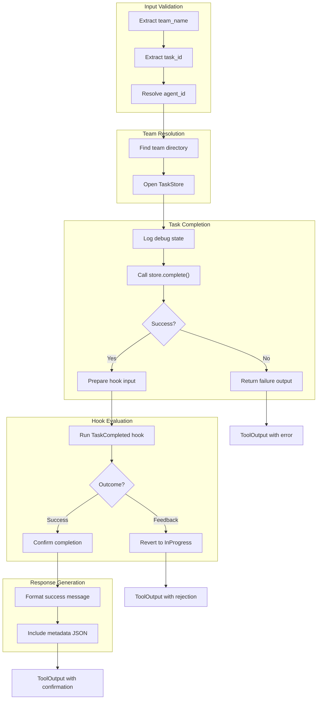

# TeamTaskCompleteTool

**Type:** technology

### From: team_task_complete

TeamTaskCompleteTool is the central struct implemented in this source file, serving as a concrete tool implementation within a larger agent framework. This struct encapsulates the capability for an autonomous agent to mark assigned tasks as completed within a team-based workflow system. Unlike simple task completion utilities, this tool implements a sophisticated lifecycle management system that handles validation, permission checking, dependency unblocking, and extensible hook-based workflows. The tool is designed with zero-cost abstractions in mind—the unit struct contains no fields, with all state managed through the execution context and persistent task store.

The implementation follows the Tool trait pattern common in agent frameworks, requiring methods for identification (`name`), capability description (`description`), parameter validation schema (`parameters_schema`), security classification (`permission_category`), and the actual execution logic. The tool's design emphasizes defensibility and auditability: every completion attempt is logged with contextual information including agent identity, team context, and the full task state at time of execution. This logging strategy enables debugging of complex multi-agent scenarios where race conditions or miscommunications might occur.

A distinctive architectural feature is the integration with the `TaskStore` abstraction, which provides durable persistence of team state. The tool does not assume in-memory state but instead coordinates with a filesystem-backed store that enables recovery and cross-process coordination. This persistence model is essential for production deployments where agents may restart or where multiple agent processes might operate on shared team state. The tool also implements graceful degradation patterns, returning structured output with explanatory messages rather than failing with opaque errors when preconditions are not met.

The hook integration mechanism represents a powerful extension point for domain-specific validation. By invoking `run_team_hook` with the `TaskCompleted` event, the tool enables external scripts or services to participate in the completion decision. This could support use cases like automated quality checks, required artifact verification, or notification to downstream systems. The rollback capability—reverting to `InProgress` if hooks reject completion—provides transactional semantics that protect workflow integrity.

## Diagram

## External Resources

- [anyhow crate documentation for flexible error handling in Rust](https://docs.rs/anyhow/latest/anyhow/) - anyhow crate documentation for flexible error handling in Rust
- [Serde serialization framework for Rust data structures](https://serde.rs/) - Serde serialization framework for Rust data structures
- [Tokio tracing for structured, async-aware logging](https://tokio.rs/tokio/topics/tracing) - Tokio tracing for structured, async-aware logging

## Sources

- [team_task_complete](../sources/team-task-complete.md)
