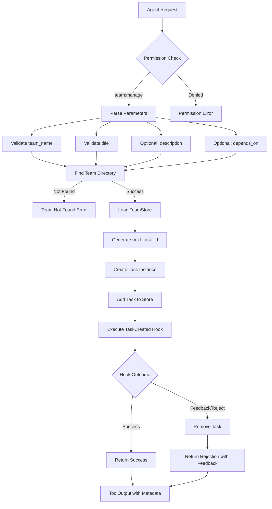

# TeamTaskCreateTool

**Type:** technology

### From: team_task_create

TeamTaskCreateTool is a specialized Rust struct implementing the Tool trait for creating tasks within agent team structures. As a lead-only tool, it enforces hierarchical access control where only designated team leads can inject new work items into the shared task queue, preventing task spam and maintaining organizational coherence in multi-agent systems. The tool's design reflects careful consideration of distributed coordination challenges, providing structured input validation through JSON Schema while supporting rich task metadata including descriptions and dependency chains.

The tool's implementation demonstrates sophisticated lifecycle management for task creation. Upon execution, it validates required parameters (team_name and title), resolves the team's directory location, generates unique task identifiers, and persists task state to durable storage. The optional description field allows detailed work specifications, while the depends_on array enables complex workflow dependency modeling where tasks remain unclaimable until prerequisite tasks complete. This dependency system is crucial for orchestrating multi-step agent workflows where sequential execution order matters.

A distinctive architectural feature is the post-creation hook execution mechanism. After persisting the task, the tool triggers a TaskCreated hook with full task metadata on stdin, enabling external validation or notification systems. If the hook returns feedback (indicating rejection), the tool performs automatic cleanup by removing the created task, demonstrating transactional-like semantics where creation can be atomically rolled back based on policy evaluation. This pattern allows integration with external governance systems without coupling the core tool to specific policy implementations.

The tool integrates with several storage abstractions: TeamStore for team-level operations and task ID generation, and TaskStore for individual task persistence. This layered storage approach separates concerns between team metadata management and task instance operations. The use of filesystem-based storage (evident from directory-based operations) suggests a design prioritizing simplicity, inspectability, and potentially git-compatible versioning for team state. The tool's outputs include both human-readable confirmation messages and structured metadata for programmatic consumption, supporting both interactive and automated usage patterns.

## Diagram

## External Resources

- [anyhow crate for flexible error handling in Rust](https://crates.io/crates/anyhow) - anyhow crate for flexible error handling in Rust
- [Serde serialization framework documentation](https://serde.rs/) - Serde serialization framework documentation
- [async-trait crate for async trait implementations](https://docs.rs/async-trait/latest/async_trait/) - async-trait crate for async trait implementations
- [JSON Schema specification for structured validation](https://json-schema.org/) - JSON Schema specification for structured validation
- [Role-based access control (RBAC) on Wikipedia](https://en.wikipedia.org/wiki/Role-based_access_control) - Role-based access control (RBAC) on Wikipedia

## Sources

- [team_task_create](../sources/team-task-create.md)
