# TeamWaitTool

**Type:** technology

### From: team_wait

TeamWaitTool is a Rust struct implementing the Tool trait that provides blocking synchronization capabilities for multi-agent team coordination. It serves as the definitive mechanism for lead agents to pause execution until teammate agents complete their current work, addressing the classical distributed systems problem of ensuring completion before proceeding.

The tool's architecture centers on event-driven waiting rather than polling, making it significantly more efficient than traditional busy-wait or sleep-poll approaches. When executed, it first resolves the target team through either explicit naming or automatic discovery of the most recently modified team configuration. It then builds a set of agent IDs to monitor, filtering by active states (Working, Spawning, PlanPending, ShuttingDown) and excluding already-terminal states (Idle, Failed, Stopped). The implementation carefully subscribes to the event bus before checking current states to eliminate a classic race condition where a teammate might transition to idle between the status check and event subscription.

The core wait loop leverages Tokio's timeout_at primitive with an async receiver from the event bus subscription. Only TeammateIdle events matching the current session, correct team name, and monitored agent IDs trigger state updates. This precise filtering ensures the tool correctly handles concurrent activity across multiple teams or sessions without crosstalk. Upon completion—whether through successful idle transition, channel closure, or timeout expiration—the tool reloads the team store to capture final states and generates a comprehensive markdown-formatted report with emoji status indicators.

## Diagram

```mermaid
flowchart TD
    subgraph TeamWaitTool["TeamWaitTool Execution Flow"]
        A[Parse Input & Timeout] --> B[Resolve Team Name]
        B --> C[Load TeamStore]
        C --> D[Build waiting_for HashSet]
        D --> E{Subscribe to Event Bus}
        E --> F[Check Already Idle]
        F --> G{waiting_for empty?}
        G -->|Yes| H[Return Immediate Success]
        G -->|No| I[Calculate Deadline]
        I --> J[Enter Wait Loop]
        J --> K{timeout_at recv}
        K -->|TeammateIdle Match| L[Remove from waiting_for]
        K -->|Other Event| J
        K -->|Timeout/Closed| M[Exit Loop]
        L --> N{waiting_for empty?}
        N -->|No| J
        N -->|Yes| M
        M --> O[Reload TeamStore]
        O --> P[Generate Summary]
        P --> Q[Return ToolOutput]
    end
    
    style E fill:#f9f,stroke:#333
    style K fill:#bbf,stroke:#333
```

## External Resources

- [Tokio timeout_at documentation for deadline-based async operations](https://docs.rs/tokio/latest/tokio/time/fn.timeout_at.html) - Tokio timeout_at documentation for deadline-based async operations
- [Tokio graceful shutdown patterns relevant to the channel closure handling](https://tokio.rs/tokio/topics/shutdown) - Tokio graceful shutdown patterns relevant to the channel closure handling
- [Rust HashSet documentation for the efficient membership tracking used in waiting_for](https://doc.rust-lang.org/std/collections/struct.HashSet.html) - Rust HashSet documentation for the efficient membership tracking used in waiting_for

## Sources

- [team_wait](../sources/team-wait.md)
