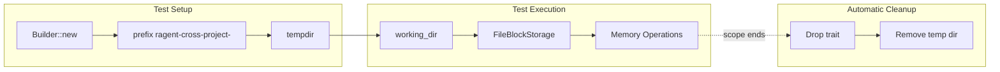

# tempfile

**Type:** technology

### From: cross_project

The tempfile crate is a widely-used Rust library that provides secure, cross-platform temporary file and directory creation. In the context of Ragent's cross-project memory system, tempfile serves as the foundation for isolated test environments, ensuring that unit tests do not interfere with the developer's actual file system or leave artifacts behind. The crate's `Builder` API allows customization of temporary directory prefixes, which this codebase uses to create clearly identifiable test directories with the prefix "ragent-cross-project-". This pattern demonstrates Rust ecosystem best practices for test hygiene and reproducibility.

tempfile's security model is particularly relevant for agent frameworks like Ragent that may eventually handle sensitive code or configuration. The crate ensures that temporary directories are created with restrictive permissions and are automatically cleaned up on drop, preventing information leakage between test runs. The library's platform abstraction handles differences between Unix and Windows temporary directory conventions transparently, supporting Ragent's cross-platform goals. In production contexts, tempfile is also used for atomic file operations and download staging, though this particular module only leverages it for testing. The crate's inclusion in Ragent's dependency tree reflects the project's commitment to reliability and security in file system operations.

## Diagram

## External Resources

- [Official tempfile crate documentation](https://docs.rs/tempfile/latest/tempfile/) - Official tempfile crate documentation
- [tempfile source repository on GitHub](https://github.com/Stebalien/tempfile) - tempfile source repository on GitHub

## Sources

- [cross_project](../sources/cross-project.md)
