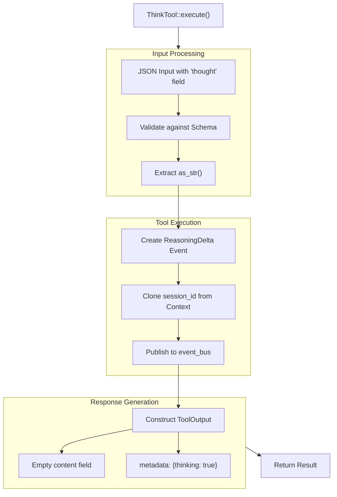

# ThinkTool

**Type:** technology

### From: think

ThinkTool is a specialized Rust struct within the ragent-core framework that implements the Tool trait to provide reasoning note capture capabilities for AI agent sessions. Unlike state-modifying tools that perform file operations, API calls, or database mutations, ThinkTool operates purely as an observability mechanism, recording the agent's internal cognitive process through a structured event system. The struct itself is a zero-sized type (unit struct), containing no fields but providing a complete implementation of the Tool interface through its associated methods. This design emphasizes behavior over state, reflecting a functional programming influence common in Rust systems programming.

The tool's implementation follows established patterns in agent framework design, particularly those seen in systems like LangChain, AutoGPT, and Microsoft's Semantic Kernel. By externalizing reasoning into discrete events, ThinkTool enables downstream consumers—including human operators, logging systems, and debugging tools—to reconstruct the agent's decision-making process. The permission category "think:record" suggests an intent-based access control system where different tool capabilities are grouped under semantic namespaces, allowing administrators to grant or restrict reasoning observation independently from other agent capabilities.

ThinkTool's integration with the event bus represents a decoupled architecture that supports multiple observers without the tool needing awareness of specific consumers. This publish-subscribe pattern is critical for scalable agent systems where reasoning logs might feed into multiple sinks: real-time dashboards, audit trails, model training feedback loops, or compliance monitoring systems. The choice to return empty content while populating metadata demonstrates a clear separation between tool effects (the event publication) and tool outputs (the return value), a distinction that helps prevent accidental state leakage through output channels.

## Diagram

## External Resources

- [async-trait crate enabling asynchronous trait methods in Rust](https://crates.io/crates/async-trait) - async-trait crate enabling asynchronous trait methods in Rust
- [Serde serialization framework for Rust](https://serde.rs/) - Serde serialization framework for Rust
- [Anyhow error handling library for Rust applications](https://github.com/dtolnay/anyhow) - Anyhow error handling library for Rust applications

## Sources

- [think](../sources/think.md)
