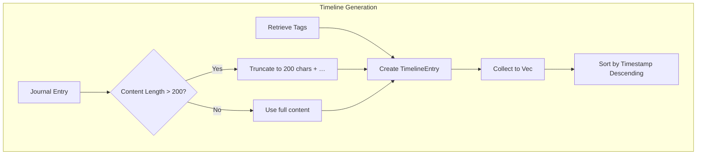

# TimelineEntry

**Type:** technology

### From: visualisation

TimelineEntry represents an individual journal entry prepared for chronological visualisation display, encapsulating the essential metadata and content preview necessary for timeline rendering without full content retrieval. The struct captures ISO 8601 formatted timestamps enabling proper temporal sorting and display, entry titles for identification, truncated content previews capped at 200 characters to manage visual density, and associated tags for categorical filtering. This design embodies a deliberate space-time tradeoff common in visualisation systems: by storing truncated previews rather than full content, the data structure remains lightweight for network transmission and memory-resident processing while still providing sufficient context for user relevance assessment.

The content_preview generation reveals careful attention to Unicode handling and user experience details. The truncation logic in generate_timeline creates previews using character-aware slicing (via Rust's string slicing which operates on byte ranges but respects UTF-8 boundaries when the source is valid UTF-8) followed by ellipsis insertion, producing human-readable text summaries. The 200-character limit represents a heuristic balancing information density against screen real estate constraints in typical terminal or web interfaces. The test_timeline_entry_preview_truncation test case specifically verifies this behavior with 300-character input, confirming the resulting string contains exactly 201 characters (200 preserved plus one ellipsis), demonstrating test-driven verification of display logic.

The tag inclusion enables rich interactive filtering where timeline entries can be dynamically shown or hidden based on topical selection. By capturing tags at generation time rather than requiring subsequent lookups, the struct supports self-contained rendering suitable for stateless API responses. The timestamp field's String type (rather than a dedicated datetime type) reflects practical serialization concerns—ISO 8601 strings serialize trivially to JSON while remaining parseable by JavaScript Date constructors and other language runtimes. This design choice prioritises interoperability over type safety, with temporal validation presumably enforced at data ingestion time.

## Diagram

## External Resources

- [ISO 8601 date and time format standard](https://en.wikipedia.org/wiki/ISO_8601) - ISO 8601 date and time format standard
- [Rust String type documentation and UTF-8 handling](https://doc.rust-lang.org/std/string/struct.String.html) - Rust String type documentation and UTF-8 handling

## Sources

- [visualisation](../sources/visualisation.md)
