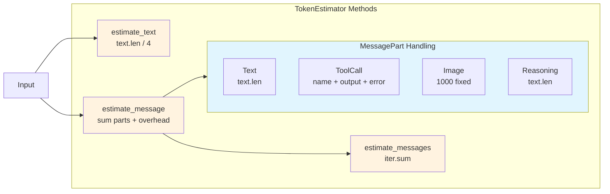

# TokenEstimator

**Type:** technology

### From: cache

The TokenEstimator struct provides fast, approximate token counting for the ragent-core session system, trading precision for performance in hot paths where exact token counts are unnecessary. Recognizing that accurate tokenization (such as through OpenAI's tiktoken library) can be computationally expensive, this implementation uses a simple heuristic of approximately 4 characters per token for English text, with specialized handling for different message content types. This approach reduces token estimation from a potentially expensive tokenization operation to simple arithmetic on string lengths.

The estimator defines two key constants: `CHARS_PER_TOKEN` set to 4 based on average English token density, and `MESSAGE_OVERHEAD` set to 10 tokens to account for message formatting overhead in chat completion APIs. These values represent educated estimates that err on the side of caution for context window management. The `estimate_text()` method performs simple division of character count by the per-token estimate, using saturating arithmetic to prevent overflow on extremely large inputs.

Message estimation handles the complex `MessagePart` enum variants that represent different content types in the ragent message system. Text parts use direct character counting, while tool call parts sum the tool name, output string length, and any error message length. Image parts receive a fixed estimate of 1000 tokens, reflecting typical vision API costs for image processing. Reasoning parts count text length like regular text. The `estimate_messages()` method provides batch processing for message slices. This estimator is specifically designed for the `should_compact()` decision point where approximate thresholds are acceptable, with the understanding that precise token counting can be performed when actually constructing API requests.

## Diagram

## External Resources

- [OpenAI's guide to understanding tokens and tokenization](https://help.openai.com/en/articles/4936856-what-are-tokens-and-how-to-count-them) - OpenAI's guide to understanding tokens and tokenization
- [tiktoken-rs crate for accurate BPE tokenization in Rust](https://docs.rs/tiktoken-rs/latest/tiktoken_rs/) - tiktoken-rs crate for accurate BPE tokenization in Rust
- [Research on efficient tokenization for large language models](https://arxiv.org/abs/2404.08335) - Research on efficient tokenization for large language models

## Sources

- [cache](../sources/cache.md)
