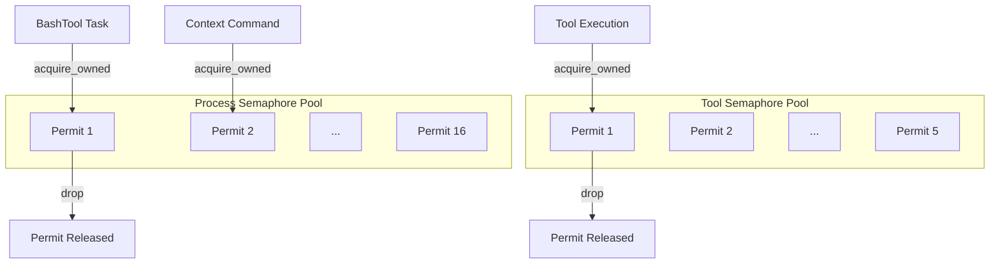

# Tokio Semaphore

**Type:** technology

### From: resource

Tokio's Semaphore is an asynchronous synchronization primitive that controls access to a pool of resources in concurrent Rust applications. Unlike traditional blocking semaphores, Tokio's implementation is designed for async/await patterns, allowing tasks to asynchronously wait for permit availability without blocking OS threads. The semaphore maintains an internal counter representing available permits, which tasks acquire before accessing protected resources and release when finished. In this codebase, the OwnedSemaphorePermit variant is used, which provides owned permits that can be moved between tasks and are automatically released when dropped, preventing resource leaks even in complex control flow scenarios. The Semaphore's cloneable Arc-based design enables shared access across task boundaries while maintaining correct synchronization semantics.

## Diagram

## External Resources

- [Tokio Semaphore API documentation](https://docs.rs/tokio/latest/tokio/sync/struct.Semaphore.html) - Tokio Semaphore API documentation
- [Tokio concurrency primitives tutorial](https://tokio.rs/tokio/tutorial/async#concurrency) - Tokio concurrency primitives tutorial

## Sources

- [resource](../sources/resource.md)
