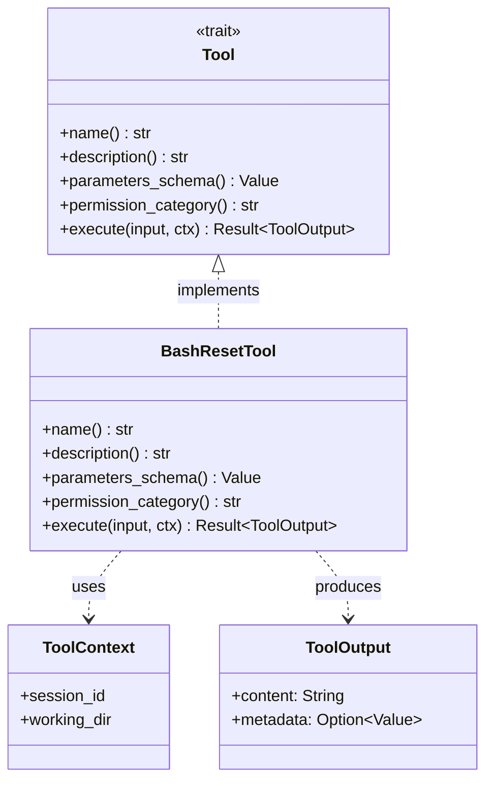

# Tool Trait

**Type:** technology

### From: bash_reset

The `Tool` trait in ragent-core defines the fundamental interface that all agent capabilities must implement, establishing a standardized contract between the agent framework and individual tool implementations. This trait-based architecture enables polymorphic tool collections where the agent runtime can discover, invoke, and manage diverse capabilities through a unified interface. The trait specifies essential metadata methods—`name`, `description`, `parameters_schema`, and `permission_category`—that support introspection and dynamic tool discovery.

The trait's async execution model, enabled by the `async_trait` procedural macro, accommodates both I/O-bound and compute-bound operations within a consistent interface. This design decision reflects the reality that agent tools frequently perform network requests, filesystem operations, or subprocess invocations that benefit from asynchronous execution. The `execute` method signature, accepting structured JSON input and a `ToolContext`, provides flexibility for tool implementations while maintaining type safety through serialization boundaries.

The permission categorization system, evidenced by the `"bash:execute"` category, suggests a capability-based access control model where tools declare their security requirements and the runtime enforces appropriate authorization. This approach enables fine-grained permission models where different agent configurations might grant varying levels of access to filesystem, network, or execution capabilities. The trait's design thus balances flexibility for tool implementers with safety guarantees for agent operators.

## Diagram

## External Resources

- [Rust traits fundamentals, the language feature underlying the Tool interface](https://doc.rust-lang.org/rust-by-example/trait.html) - Rust traits fundamentals, the language feature underlying the Tool interface
- [Capability-based security, the access control model suggested by permission_category](https://en.wikipedia.org/wiki/Capability-based_security) - Capability-based security, the access control model suggested by permission_category

## Sources

- [bash_reset](../sources/bash-reset.md)

### From: list_tasks

The Tool trait in ragent-core defines a fundamental abstraction for extensible agent capabilities, establishing a contract that enables dynamic discovery, invocation, and orchestration of system functionality within AI agent frameworks. As implemented by ListTasksTool, this trait specifies essential lifecycle methods including name for tool identification, description for capability documentation, parameters_schema for structured input validation, permission_category for access control integration, and execute for actual operation invocation. The trait's design using async-trait reflects the inherently asynchronous nature of agent operations, where tool execution may involve network I/O, file system access, or coordination with external services. This abstraction enables a plugin architecture where diverse capabilities—from task management to code execution to external API integration—can be uniformly exposed to language models and agent orchestrators.

The Tool trait's method signatures reveal careful attention to integration requirements for large language model systems. The parameters_schema method returning serde_json::Value enables dynamic JSON Schema generation for structured tool calling protocols, allowing models to understand required and optional parameters, types, and constraints without static compilation dependencies. The permission_category mechanism supports fine-grained authorization policies where tool access can be restricted based on security classifications, enabling multi-tenant deployments and principle-of-least-privilege configurations. The ToolContext parameter to execute provides dependency injection of runtime services including the TaskManager, session identification, and potentially other cross-cutting concerns like logging, metrics, and configuration access.

This trait abstraction represents a convergence of software engineering best practices with the specific requirements of AI agent systems. The separation of schema definition from execution enables ahead-of-time capability advertisement to language models while deferring actual computation to runtime. The Result-based error handling with anyhow provides ergonomic error propagation while preserving stack traces for debugging. The ToolOutput return type with separate content and metadata fields supports dual-interface design for both human-readable presentation and structured data consumption. This architecture facilitates testing through mock Tool implementations, observability through interceptor patterns, and extensibility through new Tool implementations without core system modification. The trait's prevalence in the codebase suggests it serves as the primary integration point for extending agent capabilities.
