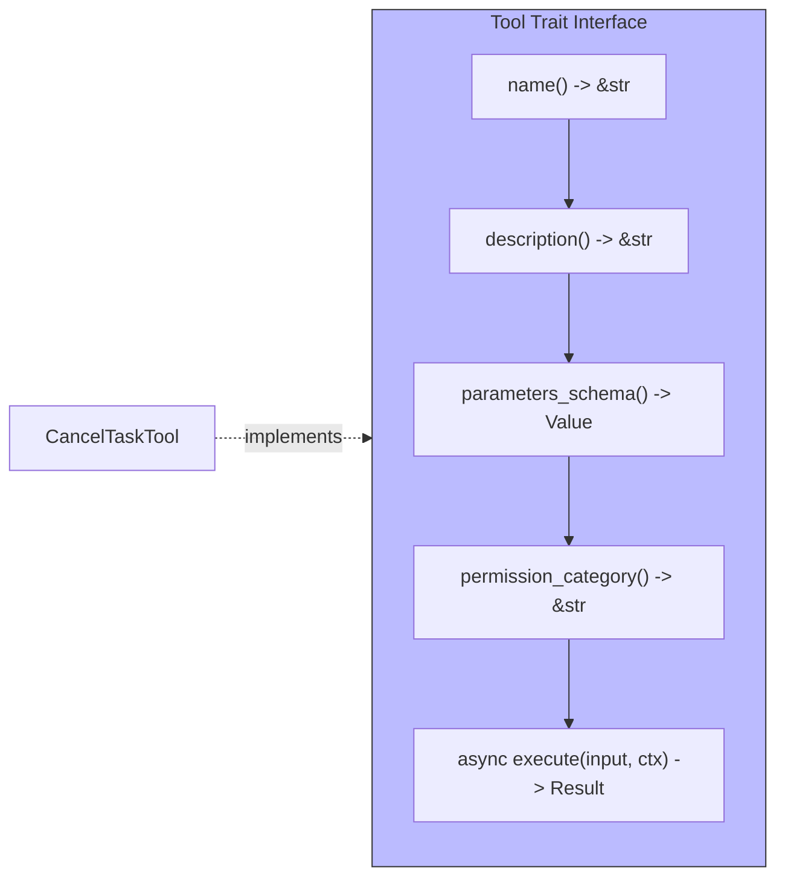

# Tool

**Type:** technology

### From: cancel_task

The `Tool` trait defines the fundamental contract that all capabilities within the ragent framework must implement, establishing a standardized interface for agent-invokable functionality. This trait abstraction enables the framework to treat diverse capabilities—from task cancellation to external API calls—uniformly, supporting dynamic dispatch and plugin registration patterns. The trait requires implementations to provide metadata (name, description, parameters schema) that supports automatic documentation generation and parameter validation, alongside execution logic that operates within a provided context. The use of `async-trait` allows tool implementations to perform asynchronous I/O operations without blocking the executor, critical for maintaining responsiveness in agent systems that may manage hundreds of concurrent sub-tasks. This architectural pattern draws from established plugin systems in software engineering while adapting to Rust's ownership and async constraints.

## Diagram

## External Resources

- [Rust traits and trait objects for polymorphism](https://doc.rust-lang.org/book/ch10-02-traits.html) - Rust traits and trait objects for polymorphism
- [Rust Future trait for asynchronous computation](https://doc.rust-lang.org/std/future/trait.Future.html) - Rust Future trait for asynchronous computation

## Sources

- [cancel_task](../sources/cancel-task.md)
