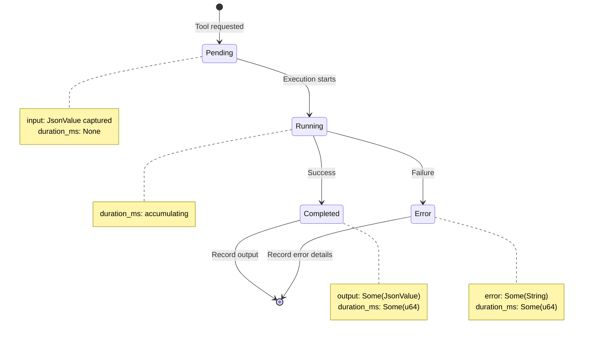

# ToolCallState

**Type:** technology

### From: test_message_types

ToolCallState is a comprehensive structure in the ragent-core library that captures the complete execution lifecycle of a tool invocation within an AI agent system. This struct serves as the authoritative record for computational actions, providing detailed observability into what tool was called, with what parameters, what result was obtained, and how long the execution took. The design reflects production requirements for debugging, auditing, and monitoring of agent behavior in real-world deployments.

The structure tracks multiple dimensions of execution state through carefully typed fields. The status field uses the ToolCallStatus enum to represent the execution phase, distinguishing between pending invocations awaiting execution, actively running operations, successfully completed calls, and error conditions. This state machine pattern enables both synchronous and asynchronous tool execution patterns, with clear transitions between states. The input and output fields use serde_json::Value for flexible structured data capture, accommodating diverse tool signatures without requiring generic type parameters that would complicate the message system.

Error handling receives particular attention in this design, with a dedicated error field separate from the output field. This separation allows the system to distinguish between tools that return error values as valid output versus actual execution failures. The optional duration_ms field supports performance monitoring and optimization, while the overall structure's serialization support enables persistence for debugging and conversation replay. This comprehensive state capture is essential for building trustworthy agent systems where every computational action is auditable and reproducible.

## Diagram

## External Resources

- [serde_json::Value for flexible JSON handling](https://docs.rs/serde_json/latest/serde_json/value/enum.Value.html) - serde_json::Value for flexible JSON handling
- [Rust Option type for optional values](https://doc.rust-lang.org/std/option/enum.Option.html) - Rust Option type for optional values
- [State machine pattern in software design](https://en.wikipedia.org/wiki/State_machine) - State machine pattern in software design

## Sources

- [test_message_types](../sources/test-message-types.md)
