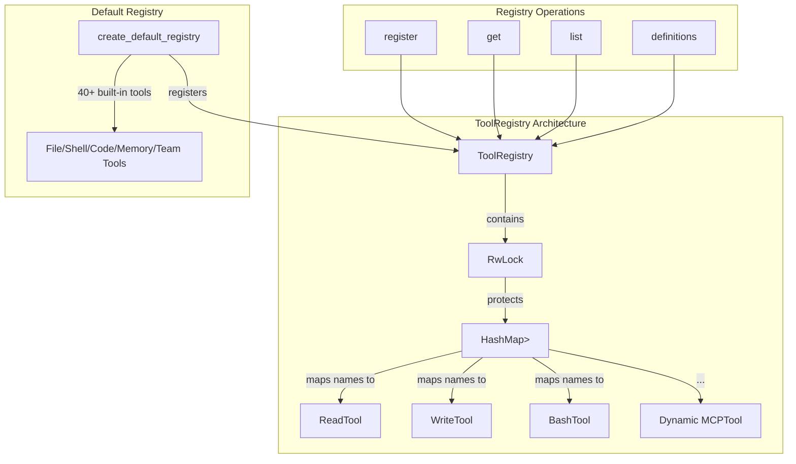

# ToolRegistry

**Type:** technology

### From: mod

The ToolRegistry is the central hub for managing tool implementations in the ragent-core system. It maintains a thread-safe mapping from tool names to their implementations using a `RwLock<HashMap<String, Arc<dyn Tool>>>`, which enables concurrent read access while allowing exclusive write access for dynamic registration. This design pattern is particularly important for supporting Model Context Protocol (MCP) integrations where external tools may be registered after initial system startup.

The registry provides a clean API for tool management: `new()` creates an empty registry, `register()` adds tools keyed by their name, `get()` performs lookup by name returning an `Arc<dyn Tool>`, `list()` returns alphabetically sorted tool names, and `definitions()` exports `ToolDefinition` descriptors suitable for LLM function-calling APIs. The `create_default_registry()` function populates a registry with over 40 built-in tools covering file operations, shell execution, code intelligence, document processing, memory systems, and team coordination.

The implementation demonstrates Rust's ownership and concurrency patterns effectively. The `RwLock` provides interior mutability without requiring `&mut self` on methods, while `Arc` enables shared ownership of trait objects. Error handling uses `expect` with descriptive messages for lock poisoning scenarios, reflecting a design choice to panic on unrecoverable synchronization failures rather than propagate complex error types through all call sites.

## Diagram

## External Resources

- [Rust RwLock documentation for reader-writer lock synchronization](https://doc.rust-lang.org/std/sync/struct.RwLock.html) - Rust RwLock documentation for reader-writer lock synchronization
- [Model Context Protocol specification for external tool integration](https://spec.modelcontextprotocol.io/) - Model Context Protocol specification for external tool integration

## Sources

- [mod](../sources/mod.md)
