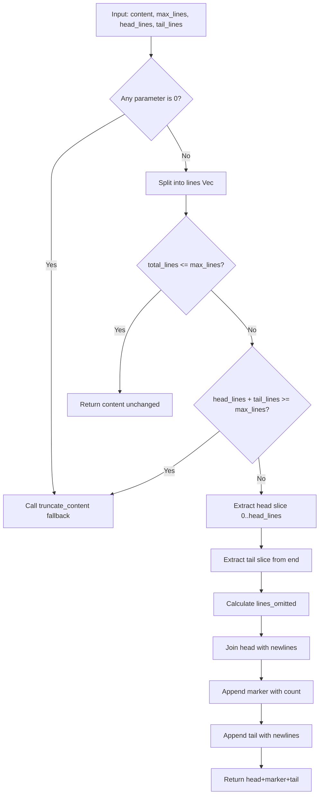

# truncate_content_head_tail

**Type:** technology

### From: truncate

The `truncate_content_head_tail` function implements an advanced truncation strategy that preserves context by showing both the beginning and end of lengthy content while omitting the middle section. This approach proves particularly valuable for displaying file contents around search results, log entries with important headers and footers, or any scenario where the start and end of output carry significant contextual meaning. The function accepts four parameters: the source content, maximum total lines to display, lines to preserve from the head, and lines to preserve from the tail. Its implementation includes sophisticated fallback logic: if any parameter is zero, it delegates to the simpler `truncate_content` function; if the combined head and tail lines would exceed the maximum, it similarly falls back to simple truncation to ensure sensible output. The function carefully calculates slice indices to extract the appropriate head and tail portions, computes the exact count of omitted middle lines, and assembles the final output with the omission marker positioned between the preserved sections. This design pattern reflects common practices in pager utilities like `less` and search tools like `grep` with context flags, adapted for programmatic use in agent toolchains.

## Diagram

## External Resources

- [GNU grep documentation showing context line options (-B, -A, -C)](https://www.gnu.org/software/grep/manual/grep.html) - GNU grep documentation showing context line options (-B, -A, -C)
- [Wikipedia explanation of context preservation in text search](https://en.wikipedia.org/wiki/Context_around_matches) - Wikipedia explanation of context preservation in text search

## Sources

- [truncate](../sources/truncate.md)
