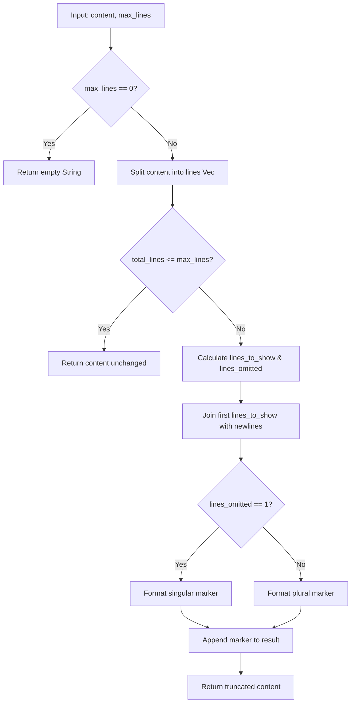

# truncate_content

**Type:** technology

### From: truncate

The `truncate_content` function serves as the primary truncation utility in the ragent-core toolkit, designed to intelligently limit text output to a specified maximum number of lines while preserving readability through informative omission markers. This function accepts any type implementing `AsRef<str>`, providing flexibility for handling string slices, owned strings, and other string-like types without unnecessary cloning. When the input content exceeds the `max_lines` threshold, the function retains the first `max_lines - 1` lines and appends a marker indicating the count of omitted lines, formatted grammatically for both singular and plural cases. The implementation handles edge cases gracefully: when `max_lines` is zero, it returns an empty string; when content fits within the limit, it returns the original unchanged; and when truncation occurs, it constructs the result through efficient vector joining and string concatenation operations. The grammatical precision of the omission marker—distinguishing between "1 line omitted" and "N lines omitted"—demonstrates attention to user experience details that enhance the professionalism of tool output presentation.

## Diagram

## External Resources

- [Rust String documentation for understanding string manipulation methods used](https://doc.rust-lang.org/std/string/struct.String.html) - Rust String documentation for understanding string manipulation methods used
- [AsRef trait documentation explaining the flexible type parameter](https://doc.rust-lang.org/std/str/trait.AsRef.html) - AsRef trait documentation explaining the flexible type parameter

## Sources

- [truncate](../sources/truncate.md)
