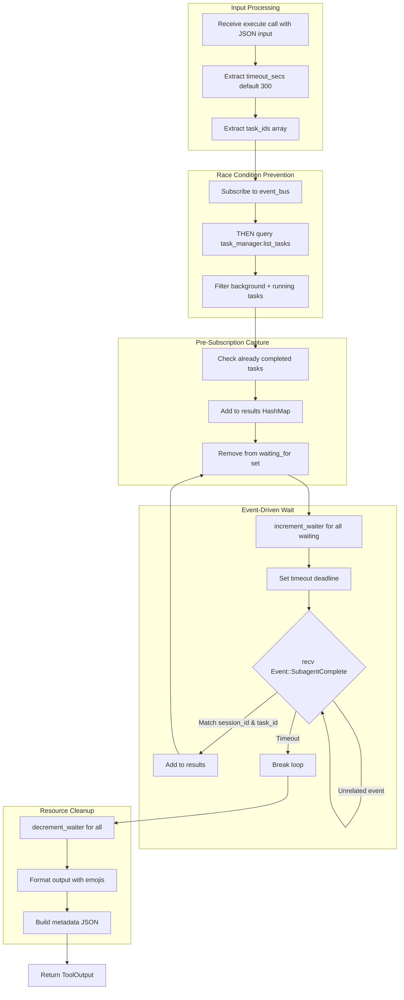

# WaitTasksTool

**Type:** product

### From: wait_tasks

WaitTasksTool is a specialized tool implementation within the ragent-core crate that provides blocking, event-driven waiting for background sub-agent task completion. Unlike simpler polling-based approaches, this tool establishes a subscription to the session's event bus before querying task state, eliminating the classic race condition where a task completes between the status check and event subscription. The tool implements the `Tool` trait using `async_trait`, making it compatible with async/await patterns throughout the agent system.

The tool's architecture reflects careful consideration of distributed systems concerns. It maintains a reference count of waiters through `increment_waiter` and `decrement_waiter` calls, allowing the task manager to optimize notification delivery—tasks with active waiters can use push notifications while those without can be processed lazily. This pattern prevents redundant wakeups and supports efficient resource utilization in systems with many concurrent tasks.

The implementation handles edge cases comprehensively: tasks that completed before subscription are captured from the initial state snapshot, timeout scenarios return partial results with clear indication of which tasks remain running, and broadcast channel closure is handled gracefully. The formatted output includes visual indicators (✅/❌), agent names, and truncated task IDs, while the structured metadata enables rich terminal user interface displays with timing statistics and output metrics.

## Diagram

## External Resources

- [Tokio broadcast channel documentation for event bus implementation](https://docs.rs/tokio/latest/tokio/sync/broadcast/) - Tokio broadcast channel documentation for event bus implementation
- [async-trait crate for async trait methods in Rust](https://docs.rs/async-trait/latest/async_trait/) - async-trait crate for async trait methods in Rust

## Sources

- [wait_tasks](../sources/wait-tasks.md)
