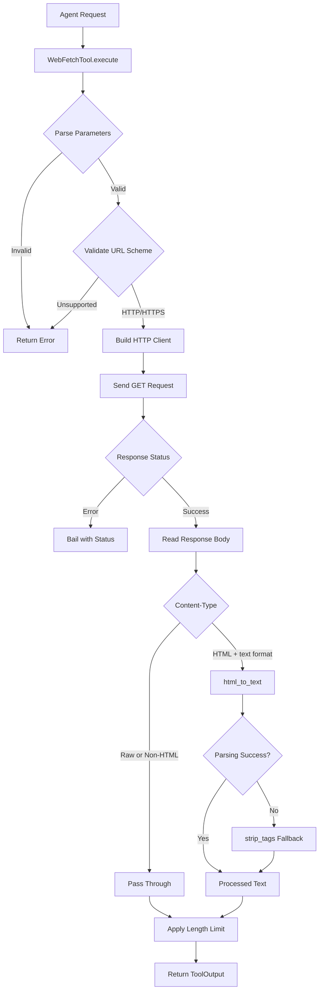

# WebFetchTool

**Type:** technology

### From: webfetch

WebFetchTool is a specialized HTTP client implementation designed as a reusable tool for AI agent systems. It provides structured web content retrieval with automatic HTML-to-plain-text conversion, making web content accessible to language models that process text rather than rendered HTML. The tool is implemented as a struct that implements the `Tool` trait, suggesting integration with a larger agent framework where tools are dynamically discovered and invoked based on their metadata.

The implementation demonstrates several production-quality patterns for HTTP clients in Rust. It uses `reqwest` for asynchronous HTTP requests, with careful configuration of timeouts, redirect policies, and user agent identification. The default timeout of 30 seconds prevents indefinite hangs on slow servers, while the limit of 5 redirects protects against redirect loops. The user agent string identifies the client as "ragent/0.1" with a link to the GitHub repository, which is important for server operators to understand traffic sources and for potential rate limiting or blocking decisions.

A key feature of WebFetchTool is its dual-mode content processing. By default, HTML content is converted to plain text using the `html2text` crate, which attempts to preserve document structure and readability. However, users can request "raw" format to receive unprocessed content, which is useful for accessing APIs or non-HTML resources. The tool also implements intelligent content truncation at character boundaries to respect memory and token limits, appending a clear indicator when truncation occurs. This design acknowledges the context window limitations of language models while maximizing useful information transfer.

## Diagram

## External Resources

- [reqwest HTTP client library documentation](https://docs.rs/reqwest/latest/reqwest/) - reqwest HTTP client library documentation
- [html2text Rust crate for HTML to text conversion](https://docs.rs/html2text/latest/html2text/) - html2text Rust crate for HTML to text conversion
- [anyhow error handling library for Rust](https://docs.rs/anyhow/latest/anyhow/) - anyhow error handling library for Rust

## Sources

- [webfetch](../sources/webfetch.md)
