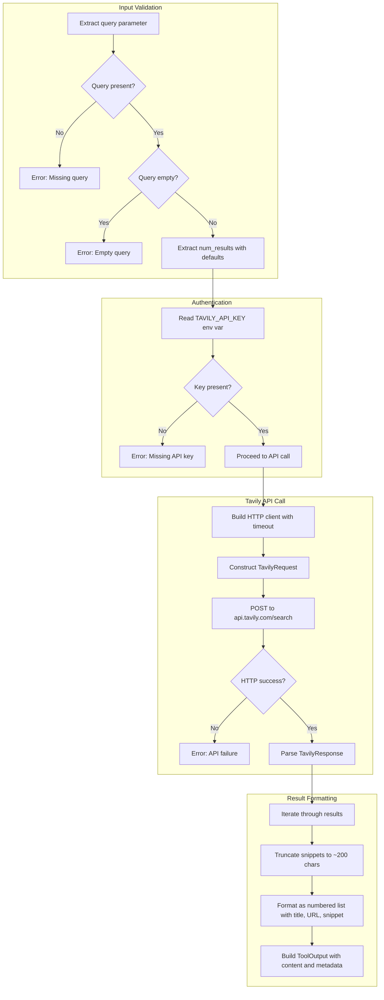

# WebSearchTool

**Type:** technology

### From: websearch

WebSearchTool is the primary public struct in this module, serving as the main interface for web search functionality within the Ragent agent framework. This struct implements the `Tool` trait, which is the foundational abstraction for all capabilities that agents can invoke. The struct itself is a zero-sized type (unit struct), containing no fields, which reflects its stateless nature and emphasizes that all configuration comes from environment variables and runtime parameters rather than instance state.

The implementation of WebSearchTool follows a deliberate design philosophy common in Rust agent frameworks: tools are lightweight, composable, and self-describing. The `name()` method returns "websearch", providing a stable identifier for agent systems to reference this capability. The `description()` method returns a detailed explanation of functionality and requirements, which can be exposed to language models for tool selection decisions. This self-documenting approach enables dynamic tool discovery where agents can understand available capabilities without hardcoded knowledge.

The `execute()` method represents the core business logic, accepting JSON input and returning structured `ToolOutput`. This method handles parameter extraction with proper validation, environment variable retrieval for the Tavily API key, and delegation to the private `tavily_search()` function. Error handling is comprehensive: missing query parameters, empty queries, and missing API credentials all produce clear error messages. The method also implements result formatting, converting structured search results into human-readable text with numbered entries while preserving metadata about the query and result counts.

## Diagram

## External Resources

- [Tavily AI search API platform](https://tavily.com) - Tavily AI search API platform
- [Ragent framework source repository](https://github.com/thawkins/ragent) - Ragent framework source repository

## Sources

- [websearch](../sources/websearch.md)
