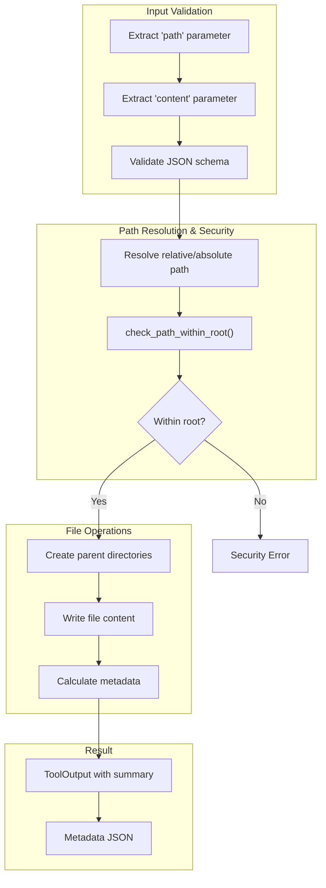

# WriteTool

**Type:** product

### From: write

The `WriteTool` is a core component of the ragent framework's tool system, designed to provide robust and secure file writing capabilities for AI agents and automated systems. This struct implements the `Tool` trait, which establishes a standardized interface for all tools within the framework, enabling consistent behavior and integration across different agent implementations. The tool's primary purpose is to write string content to files while automatically creating any necessary parent directories, abstracting away the complexity of file system operations and allowing agents to focus on higher-level tasks.

The implementation of `WriteTool` demonstrates sophisticated software engineering practices, particularly in its approach to security and error handling. By utilizing the `check_path_within_root` function, the tool enforces a critical security boundary that prevents directory traversal attacks, where malicious input could attempt to write files outside the intended working directory. This security measure is essential in agent-based systems where LLM-generated or user-provided paths could potentially contain harmful patterns like `../` sequences. The tool also provides comprehensive error context through the `anyhow` crate, ensuring that failures at any stage—whether from missing parameters, directory creation failures, or write operations—are reported with clear, actionable information.

Beyond its core functionality, `WriteTool` serves as an example of modern Rust asynchronous programming patterns. It leverages `tokio::fs` for non-blocking file operations, which is crucial for maintaining system responsiveness in concurrent agent environments. The tool also generates rich metadata upon completion, including byte counts, line counts, and file paths, which can be used by calling systems for logging, auditing, or further processing. This metadata-driven approach reflects the broader architectural philosophy of the ragent framework, where tools are not merely black-box operations but transparent, observable components that integrate seamlessly into larger workflows.

## Diagram

## External Resources

- [Tokio asynchronous filesystem API documentation](https://docs.rs/tokio/latest/tokio/fs/) - Tokio asynchronous filesystem API documentation
- [Anyhow flexible error handling crate documentation](https://docs.rs/anyhow/latest/anyhow/) - Anyhow flexible error handling crate documentation
- [Serde serialization framework documentation](https://serde.rs/) - Serde serialization framework documentation

## Sources

- [write](../sources/write.md)
