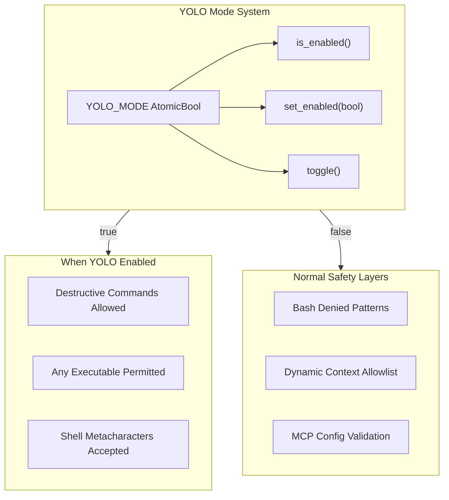

# YOLO Mode

**Type:** technology

### From: yolo

YOLO Mode is a development and emergency override feature implemented in the ragent-core crate that completely disables command validation and tool restriction enforcement. When activated through a global atomic boolean flag, it bypasses three critical safety layers: bash denied pattern matching (which normally prevents destructive filesystem operations), dynamic context allowlisting (which restricts executable permissions in skill bodies), and MCP configuration validation (which sanitizes shell metacharacters and path inputs). The name derives from the internet slang "You Only Live Once," appropriately conveying the dangerous, consequences-be-damned nature of the feature.

The implementation exposes three simple API functions for runtime control: `is_enabled()` for checking current state, `set_enabled(bool)` for explicit activation or deactivation, and `toggle()` for atomic state inversion. These functions use Rust's `std::sync::atomic::AtomicBool` with `Ordering::Relaxed` memory ordering, providing thread-safe access without the overhead of mutex locks. The relaxed ordering is sufficient here because the exact sequencing of updates across threads is less important than eventual visibility—once YOLO mode is enabled, all threads should observe it, but nanosecond-precise synchronization is unnecessary.

Historically, this type of emergency override appears in many agent systems and development tools where normal safety constraints impede rapid iteration or emergency debugging. Similar patterns exist in database systems (emergency write modes), container runtimes (privileged mode), and browser developer tools (disable web security). The key challenge with such features is preventing accidental activation in production environments while remaining accessible for legitimate debugging scenarios. The code explicitly warns users through documentation that YOLO mode is "inherently dangerous" and should only be used with completely trusted inputs or for local development, reflecting lessons learned from previous security incidents in agent systems where overly permissive modes led to unintended destructive actions.

## Diagram

## External Resources

- [Rust AtomicBool documentation - thread-safe boolean operations](https://doc.rust-lang.org/std/sync/atomic/struct.AtomicBool.html) - Rust AtomicBool documentation - thread-safe boolean operations
- [Feature toggle pattern - runtime configuration management](https://en.wikipedia.org/wiki/Feature_toggle) - Feature toggle pattern - runtime configuration management
- [Rust Atomics Cheat Sheet - memory ordering explained](https://cheats.rs/#atomics) - Rust Atomics Cheat Sheet - memory ordering explained

## Sources

- [yolo](../sources/yolo.md)
