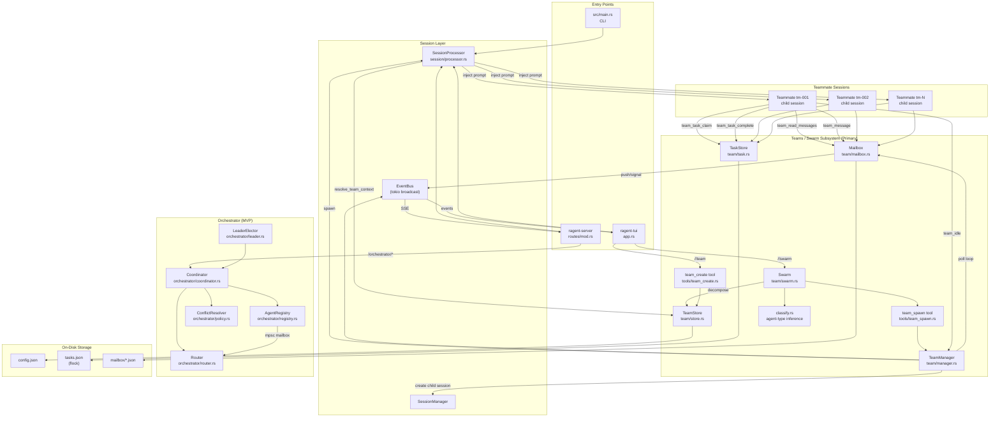

# Agent Communication Architecture — ragent

*Produced by swarm-s1 (task s1) for team swarm-20260621-071205.*

This document maps the agent communication, message passing, orchestration,
and team coordination architecture of the ragent codebase.

---

## 1. High-Level Overview

ragent has **two distinct multi-agent communication subsystems**:

| Subsystem | Crate Location | Purpose | Transport |
|-----------|---------------|---------|-----------|
| **Orchestrator** (MVP) | `crates/ragent-agent/src/orchestrator/` | Capability-based job dispatch, leader election, conflict resolution | In-process mpsc mailboxes + optional HTTP |
| **Teams / Swarm** (primary) | `crates/ragent-team/` + `crates/ragent-agent/src/team/` + `crates/ragent-agent/src/tool/` | Lead–teammate coordination via shared tasks, file-based mailboxes, swarm decomposition | On-disk JSON files + EventBus broadcast |

The **Teams/Swarm** subsystem is the primary, production-used mechanism for
multi-agent work. The **Orchestrator** is an earlier MVP framework that
provides lower-level primitives (registry, router, coordinator) and is exposed
via the HTTP server (`/orchestrator/*` routes) but is not the main path for
agent-to-agent communication.

A third, simpler mechanism — **Sub-agent tasks** (`new_task` tool +
`TaskManager`) — allows a single session to spawn child sessions for focused
work. This is intentionally blocked when a team context is active.

---

## 2. Entry Points

### 2.1 CLI / TUI entry

- **Binary entry**: `src/main.rs` → clap CLI (`run`, `serve`, `session`, etc.)
- **TUI**: `crates/ragent-tui/src/app.rs` — handles `/team`, `/swarm` slash
  commands and lazily initialises `TeamManager`.
- **HTTP server**: `crates/ragent-server/src/routes/mod.rs` — exposes
  `/orchestrator/*` REST endpoints and team/swarm routes.

### 2.2 Team creation flow (primary)

```
User → /team create <name>   (TUI slash command)
      or
LLM → team_create tool call  (crates/ragent-team/src/tools/team_create.rs)
         │
         ▼
   TeamStore::create()         (crates/ragent-team/src/team/store.rs)
      writes config.json + mailbox/ + tasks.json under
      [PROJECT]/.ragent/teams/<name>/  or  ~/.ragent/teams/<name>/
         │
         ▼
   TUI: ensure_team_manager_for_team()
      (crates/ragent-tui/src/app.rs:3228)
      constructs TeamManager and stores it in
      SessionProcessor.team_manager (OnceLock<Arc<TeamManager>>)
```

### 2.3 Swarm entry

```
User → /swarm <prompt>        (TUI slash command, app.rs:7940)
         │
         ▼
   LLM decomposition call     (swarm.rs: DECOMPOSITION_SYSTEM_PROMPT)
         │
         ▼
   parse_decomposition()       → SwarmDecomposition { tasks: [SwarmSubtask] }
         │
         ▼
   execute_swarm_decomposition() (app.rs:13627)
      creates ephemeral team "swarm-<timestamp>"
      spawns one teammate per subtask
```

---

## 3. Key Files, Modules, and Types

### 3.1 Teams crate (`crates/ragent-team/`)

| File | Key Types / Functions | Role |
|------|----------------------|------|
| `src/team/mod.rs` | Re-exports all team submodules | Module root |
| `src/team/config.rs` | `TeamConfig`, `TeamMember`, `TeamStatus`, `MemberStatus`, `PlanStatus`, `MemoryScope`, `HookEntry`, `HookEvent`, `TeamSettings` | Persistent team configuration (serialised to `config.json`) |
| `src/team/store.rs` | `TeamStore`, `find_team_dir`, `find_project_teams_dir`, `global_teams_dir` | On-disk team directory discovery, creation, load/save |
| `src/team/mailbox.rs` | `Mailbox`, `MailboxMessage`, `MessageType`, `register_notifier`, `deregister_notifier` | Per-agent JSON mailbox files with push-notification via `tokio::sync::Notify` |
| `src/team/task.rs` | `Task`, `TaskStatus`, `TaskList`, `TaskStore` | Shared `tasks.json` with file-locking (`fs2` flock) |
| `src/team/manager.rs` | `TeamManager`, `TeammateHandle`, `build_team_prompt_addition`, `run_hook`, `run_team_hook`, `HookOutcome` | Runtime: spawns teammates, runs mailbox poll loops, shutdown, plan approval |
| `src/team/swarm.rs` | `SwarmSubtask`, `SwarmDecomposition`, `SwarmState`, `parse_decomposition`, `build_decomposition_user_prompt`, `DECOMPOSITION_SYSTEM_PROMPT` | LLM-based task decomposition for parallel swarms |
| `src/team/classify.rs` | `resolve_agent_type`, `infer_agent_type`, `KNOWN_AGENT_TYPES`, `DEFAULT_AGENT_TYPE` | Keyword-based agent-type classification for swarm subtasks |
| `src/tool.rs` | `create_default_registry()`, re-exports `TeamManagerInterface` | Compatibility re-exports + team tool registration |
| `src/tools/mod.rs` | `register_team_tools()` | Registers all 20 team tools into the `ToolRegistry` |
| `src/tools/team_*.rs` | 20 individual tool structs implementing `Tool` trait | LLM-callable team operations (spawn, message, task, etc.) |

### 3.2 Agent crate team/orchestration layers (`crates/ragent-agent/`)

| File | Key Types | Role |
|------|-----------|------|
| `src/team/` (mirror) | Copies of `config.rs`, `mailbox.rs`, `manager.rs`, `store.rs`, `swarm.rs`, `task.rs` | Compatibility re-exports for the extracted `ragent-team` crate |
| `src/orchestrator/mod.rs` | Module root + re-exports | Orchestrator framework |
| `src/orchestrator/registry.rs` | `AgentRegistry`, `AgentEntry`, `AgentId`, `Responder`, `OrchestrationRequest` | Capability-based agent registration with mpsc mailboxes |
| `src/orchestrator/router.rs` | `Router` trait, `InProcessRouter` | Delivers `OrchestrationMessage` to agents via mailbox channels |
| `src/orchestrator/coordinator.rs` | `Coordinator`, `JobDescriptor`, `JobEvent`, `OrchestrationMessage`, `MetricsSnapshot` | Job lifecycle: start sync/async, event subscription, result aggregation |
| `src/orchestrator/leader.rs` | `LeaderElector`, `LeaderEvent`, `CoordinatorCluster` | In-process leader election + multi-coordinator cluster |
| `src/orchestrator/transport.rs` | `HttpRouter`, `RouterComposite`, `RemoteAgentDescriptor` | HTTP POST transport for remote agents + composite fallback router |
| `src/orchestrator/policy.rs` | `ConflictPolicy`, `ConflictResolver`, `HumanFallback`, `LoggingFallback` | Conflict resolution strategies (Concat, FirstSuccess, Consensus, HumanReview) |
| `src/tool/mod.rs` | `TeamContext`, `TeamManagerInterface`, `ToolContext`, `Tool`, `ToolRegistry`, `ToolOutput` | Tool trait + execution context carrying team identity |
| `src/task/mod.rs` | `TaskManager`, `TaskEntry`, `TaskStatus` | Sub-agent task tracking (non-team) |
| `src/tool/new_task.rs` | `NewTaskTool` | Spawns sub-agents (blocked when team context active) |
| `src/session/processor.rs` | `SessionProcessor`, `resolve_team_context_for_session` | Agent loop; resolves team context per session, injects team system prompts |
| `src/event/mod.rs` | re-export of `ragent_types::event::{Event, EventBus}` | Event bus bridge |

### 3.3 Shared types (`crates/ragent-types/`)

| File | Key Types | Role |
|------|-----------|------|
| `src/event/mod.rs` | `Event` enum, `EventBus`, `FinishReason` | Process-wide tokio broadcast channel for all session/team lifecycle events |

### 3.4 TUI integration (`crates/ragent-tui/`)

| File | Key Functions | Role |
|------|--------------|------|
| `src/app.rs` | `ensure_team_manager_for_team`, `execute_swarm_decomposition`, `spawn_swarm_teammates`, `poll_swarm_unblock`, `poll_swarm_completion`, `handle_swarm_status`, `handle_swarm_cancel`, `poll_pending_swarm` | TUI-side team/swarm orchestration and lifecycle polling |
| `src/app/state.rs` | `swarm_state`, `swarm_result`, `active_team` fields in app state | UI state tracking for active swarms/teams |
| `src/lib.rs` | Event-loop polling calls (`poll_pending_swarm`, `poll_swarm_unblock`, `poll_swarm_completion`) | Periodic swarm state checks in render loop |

---

## 4. Communication Protocols & Data Structures

### 4.1 Mailbox Messages (file-based)

**Location**: `[team_dir]/mailbox/{agent_id}.json`

Each agent (lead + every teammate) has a dedicated JSON mailbox file.
Messages are appended by senders and drained by recipients.

```rust
// crates/ragent-team/src/team/mailbox.rs

pub enum MessageType {
    Message,          // free-form direct message
    Broadcast,        // lead → all teammates
    PlanRequest,      // teammate submits plan for approval
    PlanApproved,     // lead approves
    PlanRejected,     // lead rejects
    IdleNotify,       // teammate reports idle
    ShutdownRequest,  // lead requests graceful shutdown
    ShutdownAck,      // teammate acknowledges shutdown
}

pub struct MailboxMessage {
    pub message_id: String,       // UUID v4
    pub from: String,             // agent ID or "lead"
    pub to: String,               // agent ID or "lead"
    pub message_type: MessageType,
    pub content: String,          // human-readable text
    pub sent_at: DateTime<Utc>,
    pub read: bool,
}
```

**Push notification**: A process-wide `MailboxNotifierRegistry` maps
`(team_dir, agent_id)` → `Arc<tokio::sync::Notify>`. When `Mailbox::push()`
writes a message, it signals the recipient's notifier, waking the poll loop
instantly instead of waiting for the 500ms fallback interval.

### 4.2 Shared Task List (file-based, file-locked)

**Location**: `[team_dir]/tasks.json`

```rust
// crates/ragent-team/src/team/task.rs

pub enum TaskStatus { Pending, InProgress, Completed, Cancelled }

pub struct Task {
    pub id: String,              // "task-001"
    pub title: String,
    pub description: String,
    pub status: TaskStatus,
    pub assigned_to: Option<String>,  // agent ID
    pub depends_on: Vec<String>,      // task IDs that must complete first
    pub created_at: DateTime<Utc>,
    pub claimed_at: Option<DateTime<Utc>>,
    pub completed_at: Option<DateTime<Utc>>,
}
```

Concurrent writes are serialised via `fs2` exclusive file locks. Key
operations: `claim_next()`, `claim_specific()`, `complete()`, `add_task()`,
`pre_assign_task()`, `update_task()`.

### 4.3 Team Configuration (file-based)

**Location**: `[team_dir]/config.json`

```rust
// crates/ragent-team/src/team/config.rs

pub struct TeamConfig {
    pub name: String,
    pub lead_session_id: String,
    pub members: Vec<TeamMember>,
    pub status: TeamStatus,        // Active, Completed, Disbanded
    pub settings: TeamSettings,
    pub hooks: Vec<HookEntry>,
    // ...
}

pub struct TeamMember {
    pub name: String,
    pub agent_id: String,          // "tm-001", "tm-002", ...
    pub agent_type: String,        // "general", "coder", etc.
    pub status: MemberStatus,      // Spawning, Working, Idle, PlanPending, ...
    pub session_id: Option<String>,
    pub model_override: Option<ModelRef>,
    pub memory_scope: MemoryScope, // None, User, Project
    pub spawn_prompt: Option<String>,
    pub current_task_id: Option<String>,
    pub plan_status: PlanStatus,
    pub last_spawn_error: Option<String>,
}
```

### 4.4 EventBus (in-process broadcast)

```rust
// crates/ragent-types/src/event/mod.rs

pub enum Event {
    // Session lifecycle
    SessionCreated { session_id },
    MessageStart { session_id, message_id },
    TextDelta { session_id, text },
    ToolCallStart { session_id, call_id, tool },
    ToolCallEnd { session_id, call_id, tool, error, duration_ms },
    MessageEnd { session_id, message_id, reason },

    // Sub-agent (non-team)
    SubagentComplete { session_id, task_id, success, result },
    SubagentCancelled { session_id, task_id },

    // Team lifecycle events
    TeammateSpawned { session_id, team_name, teammate_name, agent_id },
    TeammateMessage { session_id, team_name, from, to, preview },
    TeammateP2PMessage { session_id, team_name, from, to, preview },
    TeammateIdle { session_id, team_name, agent_id },
    TeammateFailed { session_id, team_name, agent_id, error },
    TeammateSuspended { session_id, team_name, agent_id },
    TeammateResumed { session_id, team_name, agent_id },
    TeamTaskClaimed { session_id, team_name, agent_id, task_id },
    TeamTaskCompleted { session_id, team_name, agent_id, task_id },
    TeamCleanedUp { session_id, team_name },
    // ...
}

pub struct EventBus {
    // tokio::sync::broadcast channel
}
```

The EventBus is a tokio broadcast channel — any subscriber (TUI, HTTP SSE,
internal components) receives all events. `EventBus::publish()` is called
throughout the team lifecycle.

### 4.5 Orchestrator Messages (in-process, separate from Teams)

```rust
// crates/ragent-agent/src/orchestrator/

pub struct OrchestrationMessage {    // coordinator.rs
    pub job_id: String,
    pub payload: String,
}

pub struct OrchestrationRequest {    // registry.rs
    pub job_id: String,
    pub payload: String,
    pub reply: oneshot::Sender<String>,  // reply channel
}

pub struct JobDescriptor {           // coordinator.rs
    pub id: String,
    pub required_capabilities: Vec<String>,
    pub payload: String,
}

pub enum JobEvent {
    JobStarted { job_id },
    SubtaskAssigned { job_id, agent_id },
    SubtaskCompleted { job_id, agent_id, success },
    JobCompleted { job_id, success },
    JobFailed { job_id, error },
}
```

The orchestrator uses `tokio::sync::mpsc` channels for agent mailboxes and
`oneshot` channels for request/reply. The `Router` trait abstracts delivery;
`InProcessRouter` uses mpsc, `HttpRouter` uses HTTP POST.

### 4.6 TeamContext & ToolContext (in-session identity)

```rust
// crates/ragent-agent/src/tool/mod.rs

pub struct TeamContext {
    pub team_name: String,
    pub agent_id: String,    // "lead" or "tm-NNN"
    pub is_lead: bool,
}

pub struct ToolContext {
    pub session_id: String,
    pub working_dir: PathBuf,
    pub event_bus: Arc<EventBus>,
    pub team_context: Option<Arc<TeamContext>>,
    pub team_manager: Option<Arc<dyn TeamManagerInterface>>,
    pub task_manager: Option<Arc<TaskManager>>,
    // ... storage, code_index, spec_manager, config, etc.
}
```

Every tool invocation receives a `ToolContext`. Team tools check
`team_context` to determine whether the caller is the lead or a teammate,
and use `team_manager` to spawn new sessions.

### 4.7 Swarm Decomposition Schema

```rust
// crates/ragent-team/src/team/swarm.rs

pub struct SwarmSubtask {
    pub id: String,              // "s1", "s2"
    pub title: String,
    pub description: String,
    pub depends_on: Vec<String>,
    pub agent_type: Option<String>,
    pub model: Option<String>,
}

pub struct SwarmDecomposition {
    pub tasks: Vec<SwarmSubtask>,
}

pub struct SwarmState {
    pub team_name: String,
    pub prompt: String,
    pub decomposition: SwarmDecomposition,
    pub spawned: bool,
    pub completed: bool,
    pub default_agent_type: Option<String>,
}
```

---

## 5. Agent Spawning Flow

### 5.1 Teammate spawn (`TeamManager::spawn_teammate_internal`)

```
team_spawn tool (LLM call)
  or
reconcile_spawning_members (blueprint recovery)
         │
         ▼
TeamManager::spawn_teammate_internal()
  1. Validate agent_type → fallback to "general"
  2. Load TeamStore, allocate agent_id ("tm-NNN") via next_agent_id()
  3. Add TeamMember with status=Spawning, save config.json
  4. Create isolated child session via SessionProcessor.session_manager.create_session()
  5. Reload config, set member.session_id + status=Working, save
  6. Build teammate roster (other members' names + IDs)
  7. Resolve agent (resolve_agent_with_customs), set AgentMode::Subagent
  8. Apply model override (teammate model > lead model > agent default)
  9. Inject team context into system prompt via build_team_prompt_addition()
     — template: {{TEAM_NAME}}, {{TEAMMATE_NAME}}, {{AGENT_ID}}, {{TEAMMATE_ROSTER}}
 10. Inject persistent memory block (if memory_scope != None)
 11. Register mailbox notifier (register_notifier)
 12. Store TeammateHandle in handles map
 13. tokio::spawn agent loop:
       - Retry loop (MAX_RETRIES=3, linear backoff)
       - Calls processor.process_message(child_session, prompt, agent, cancel)
       - On success: mark member Idle, publish Event::TeammateIdle
       - On permanent error: mark Failed, publish Event::TeammateFailed
       - Token overflow errors: logged, compression pipeline handles retry
 14. start_poll_loop() — tokio::spawn mailbox polling for this agent
 15. Publish Event::TeammateSpawned
 16. Return agent_id
```

### 5.2 Sub-agent spawn (`new_task` tool → `TaskManager`)

```
new_task tool (LLM call)
  — BLOCKED if team_context is active (returns guidance to use team tools instead)
  — Otherwise:
     TaskManager::spawn()
       creates child session
       runs agent loop (sync or background)
       publishes Event::SubagentComplete on finish
```

### 5.3 Swarm spawn (`/swarm` TUI command)

```
/swarm <prompt>
  1. LLM decomposition: send DECOMPOSITION_SYSTEM_PROMPT + user goal
  2. parse_decomposition() → SwarmDecomposition
  3. execute_swarm_decomposition():
     a. Create ephemeral team "swarm-<timestamp>" via TeamStore::create()
     b. Create tasks from subtasks via TaskStore::add_task()
     c. spawn_swarm_teammates(): for each subtask:
        - resolve agent_type via classify::resolve_agent_type()
        - call team_spawn tool with task_id pre-assignment
     d. Record SwarmState in app state
  4. poll_swarm_unblock() (every 2s): checks if blocked tasks' deps are met
     → spawns teammates for newly-unblocked tasks
  5. poll_swarm_completion() (every 2s): checks if all tasks done
     → finalize_swarm_completion() with summary
```

---

## 6. Message Flow: Lead ↔ Teammates

### 6.1 Lead → Teammate

```
Lead session (LLM)
  calls team_message / team_broadcast / team_assign_task / team_shutdown_teammate tool
         │
         ▼
  Tool reads ToolContext.team_context (agent_id="lead", is_lead=true)
         │
         ▼
  Mailbox::open(team_dir, recipient_agent_id)
  Mailbox::push(MailboxMessage { from: "lead", to: "tm-001", type: Message/Broadcast/ShutdownRequest })
         │
         ▼
  signal_notifier() → wakes recipient's poll loop via tokio::Notify
         │
         ▼
  TeamManager::start_poll_loop (per-teammate tokio task)
    tokio::select! { notify.notified() | sleep(500ms) }
    Mailbox::drain_unread()
    publish_message_event() → EventBus.publish(Event::TeammateMessage / TeammateP2PMessage)
```

### 6.2 Teammate → Lead

```
Teammate session (LLM)
  calls team_read_messages / team_submit_plan / team_idle / team_task_complete / team_shutdown_ack
         │
         ▼
  Tool reads ToolContext.team_context (agent_id="tm-001", is_lead=false)
         │
         ▼
  Mailbox::open(team_dir, "lead")
  Mailbox::push(MailboxMessage { from: "tm-001", to: "lead", type: Message/PlanRequest/IdleNotify/ShutdownAck })
         │
         ▼
  Lead reads via team_read_messages tool → Mailbox::drain_unread()
```

### 6.3 Teammate ↔ Teammate (peer-to-peer)

```
Teammate A calls team_message(to: "tm-002", content: "...")
  → Mailbox::push to tm-002's mailbox
  → signal_notifier wakes tm-002's poll loop
  → EventBus publishes Event::TeammateP2PMessage (so lead/TUI are aware)
```

### 6.4 Task coordination

```
Lead: team_task_create(title, description, depends_on)
  → TaskStore::add_task() writes to tasks.json (flock-protected)

Teammate: team_task_claim() (no task_id) or team_task_claim(task_id)
  → TaskStore::claim_next() / claim_specific()
  → Atomically sets status=InProgress, assigned_to=agent_id
  → EventBus: Event::TeamTaskClaimed

Teammate: team_task_complete(task_id)
  → TaskStore::complete() sets status=Completed
  → Unblocks dependent tasks
  → EventBus: Event::TeamTaskCompleted
```

---

## 7. The 20 Team Tools

All registered via `register_team_tools()` in
`crates/ragent-team/src/tools/mod.rs`:

| Tool | File | Direction | Purpose |
|------|------|-----------|---------|
| `team_create` | `team_create.rs` | Lead | Create team + seed blueprint |
| `team_spawn` | `team_spawn.rs` | Lead | Spawn a named teammate |
| `team_wait` | `team_wait.rs` | Lead | Block until teammates idle |
| `team_status` | `team_status.rs` | Lead | Get team member + task status |
| `team_cleanup` | `team_cleanup.rs` | Lead | Tear down team resources |
| `team_shutdown_teammate` | `team_shutdown_teammate.rs` | Lead | Request graceful shutdown |
| `team_assign_task` | `team_assign_task.rs` | Lead | Assign task to specific teammate |
| `team_approve_plan` | `team_approve_plan.rs` | Lead | Approve/reject teammate plan |
| `team_broadcast` | `team_broadcast.rs` | Lead | Message all teammates |
| `team_task_create` | `team_task_create.rs` | Lead | Add task to shared list |
| `team_task_list` | `team_task_list.rs` | Any | List all tasks |
| `team_message` | `team_message.rs` | Any | Direct message to agent |
| `team_read_messages` | `team_read_messages.rs` | Any | Drain mailbox |
| `team_task_claim` | `team_task_claim.rs` | Teammate | Claim next/specific task |
| `team_task_complete` | `team_task_complete.rs` | Teammate | Mark task done |
| `team_idle` | `team_idle.rs` | Teammate | Signal idle state |
| `team_submit_plan` | `team_submit_plan.rs` | Teammate | Submit plan for approval |
| `team_shutdown_ack` | `team_shutdown_ack.rs` | Teammate | Acknowledge shutdown |
| `team_memory_read` | `team_memory_read.rs` | Any | Read team memory file |
| `team_memory_write` | `team_memory_write.rs` | Any | Write team memory file |

---

## 8. Orchestrator Framework (MVP, separate from Teams)

The orchestrator in `crates/ragent-agent/src/orchestrator/` is a
capability-based dispatch framework:

```
AgentRegistry
  ├─ register(id, capabilities, responder) → creates mpsc mailbox + tokio task
  ├─ match_agents(required_capabilities) → Vec<AgentEntry>
  └─ heartbeat / prune_stale

Router (trait)
  ├─ InProcessRouter  — delivers via mpsc + oneshot reply
  ├─ HttpRouter       — POST to remote endpoint, expects { "result": "..." }
  └─ RouterComposite   — tries routers in order, first success wins

Coordinator
  ├─ start_job_sync(desc)       — dispatch to all matching agents, aggregate
  ├─ start_job_first_success()  — first non-error response wins
  ├─ start_job_async()          — background + event subscription
  └─ with_policy(ConflictResolver)

ConflictResolver (policy.rs)
  ├─ Concat          — join all responses
  ├─ FirstSuccess    — first non-error
  ├─ LastResponse    — last response
  ├─ Consensus{N}    — N agents agree on prefix
  └─ HumanReview     — delegate to HumanFallback trait

LeaderElector + CoordinatorCluster (leader.rs)
  ├─ nominate / withdraw / recount
  └─ delegates job execution to elected leader coordinator
```

Exposed via HTTP: `POST /orchestrator/start`, `GET /orchestrator/metrics`,
`GET /orchestrator/jobs/{id}`.

---

## 9. On-Disk Team Directory Layout

```
[PROJECT]/.ragent/teams/<team-name>/     (project-local, higher priority)
  or
~/.ragent/teams/<team-name>/             (user-global)

├── config.json          — TeamConfig (members, status, hooks, settings)
├── tasks.json           — TaskList (shared, flock-protected)
└── mailbox/
    ├── lead.json        — lead's mailbox
    ├── tm-001.json      — teammate 1's mailbox
    ├── tm-002.json      — teammate 2's mailbox
    └── ...
```

---

## 10. System Prompt Injection

When a session is part of a team, `SessionProcessor` (in
`crates/ragent-agent/src/session/processor.rs`) injects role-specific
guidance into the system prompt:

- **Lead sessions** (`is_lead=true`): "Team Lead — Task Distribution Rules"
  (lines 1058–1100) — mandates one teammate per item, pre-assign task_id,
  call team_wait after spawning.

- **Teammate sessions** (`is_lead=false`): "Teammate — Task Workflow"
  (lines 1101–1121) — mandates team_task_claim → work → team_task_complete →
  team_idle.

The team context block (`build_team_prompt_addition`) is also appended to
each teammate's agent prompt, providing team name, their agent ID, and a
roster of other teammates.

---

## 11. Architecture Diagram (Mermaid)



---

## 12. Communication Flow Summary (Textual)

```
┌─────────────────────────────────────────────────────────────────────┐
│                         LEAD SESSION                                │
│  (LLM agent loop in SessionProcessor)                               │
│                                                                     │
│  System prompt includes:                                            │
│    "Team Lead — Task Distribution Rules"                            │
│    (one teammate per item, pre-assign task_id, team_wait)           │
│                                                                     │
│  Tools available: team_create, team_spawn, team_task_create,        │
│    team_assign_task, team_message, team_broadcast,                  │
│    team_wait, team_status, team_approve_plan,                       │
│    team_shutdown_teammate, team_cleanup                             │
└──────────┬──────────────────────────────────────────────────────────┘
           │
           │ team_spawn(name, agent_type, prompt, task_id?)
           ▼
┌─────────────────────────────────────────────────────────────────────┐
│                    TeamManager                                       │
│  (crates/ragent-team/src/team/manager.rs)                           │
│                                                                     │
│  1. Allocate agent_id (tm-NNN) → config.json                        │
│  2. Create child session → SessionManager                           │
│  3. Build system prompt + team context block                        │
│  4. tokio::spawn agent loop (process_message)                       │
│  5. tokio::spawn mailbox poll loop (Notify-driven)                  │
│  6. Publish Event::TeammateSpawned → EventBus                       │
└──────────┬──────────────────────────────────────────────────────────┘
           │
           │  spawns N child sessions
           ▼
┌─────────────────────────────────────────────────────────────────────┐
│                    TEAMMATE SESSIONS                                 │
│  (each is an isolated agent loop in SessionProcessor)               │
│                                                                     │
│  System prompt includes:                                            │
│    "Teammate — Task Workflow"                                       │
│    (claim → work → complete → idle)                                 │
│    Team context: {{TEAM_NAME}}, {{AGENT_ID}}, roster                │
│                                                                     │
│  Tools available: team_task_claim, team_task_complete,              │
│    team_read_messages, team_message, team_submit_plan,              │
│    team_idle, team_shutdown_ack, team_memory_read/write             │
│                                                                     │
│  new_task is BLOCKED (returns guidance to use team tools)           │
└──────────┬──────────────────────────────────────────────────────────┘
           │
           │ Mailbox messages (JSON files on disk)
           │ Shared task list (tasks.json, flock-protected)
           │ EventBus events (in-process broadcast)
           ▼
┌─────────────────────────────────────────────────────────────────────┐
│              COORDINATION CHANNELS                                  │
│                                                                     │
│  mailbox/lead.json    ← teammates push messages here                │
│  mailbox/tm-001.json  ← lead/peers push messages here               │
│  tasks.json           ← all agents claim/complete tasks             │
│  EventBus (broadcast) ← TeamManager publishes lifecycle events      │
└────────────────────────────────���────────────────────────────────────┘
```

---

## 13. Key Design Decisions

1. **File-based coordination** — Mailboxes and tasks are JSON files on disk,
   not in-memory channels. This survives crashes and allows external
   inspection. File locking (`fs2`) prevents concurrent-write corruption.

2. **Push notifications via `tokio::sync::Notify`** — A process-wide
   registry maps `(team_dir, agent_id)` to `Notify` handles so mailbox
   pushes wake poll loops instantly rather than relying on 500ms polling.

3. **Session isolation** — Each teammate gets its own child session with
   its own conversation history, model, and context window. No shared
   memory between agents.

4. **LLM-driven decomposition** — Swarms use an LLM call with
   `DECOMPOSITION_SYSTEM_PROMPT` to break goals into 2–8 independent
   subtasks with dependency edges, then spawn one teammate per subtask.

5. **Role-based system prompt injection** — The session processor detects
   team membership via `resolve_team_context_for_session()` and injects
   different workflow rules for leads vs teammates.

6. **Sub-agent blocking in team context** — The `new_task` tool explicitly
   refuses to run when `team_context` is active, forcing all delegation
   through the team tool family for visibility.

7. **Retry with backoff** — Teammate agent loops retry up to 3 times with
   linear backoff for transient errors. Permanent API errors (4xx except
   429/408) skip retries. Token-overflow errors are handled by the
   compression pipeline on retry.

8. **Blueprint seeding** — `team_create` can load a blueprint from
   `.ragent/blueprints/teams/<name>` which pre-defines teammates and their
   spawn prompts. `reconcile_spawning_members()` handles the race where
   members are queued before `TeamManager` exists.