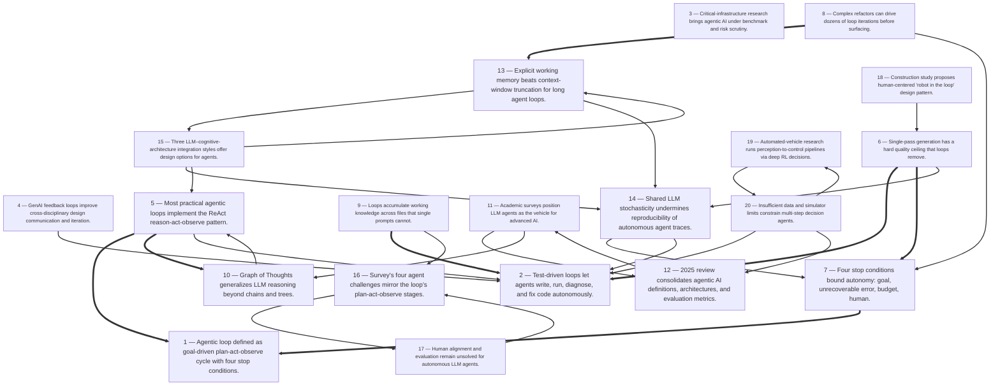

# Title: The sources collectively support the topic's core claim: the agentic loop — a…

## Corpus Quality Scoreboard

Quality: **46/100** - Grade D (Weak)

```
[#########-----------]  46/100
```

- Critic: review (coverage 70 | evidence 25 | balance 0 | tension 100)
- Sources: 10 gathered | 10 cited | 10 full text | 3 distinct domains | 5.0/8 average relevance
- Cited date span: 2026-2026 (9 undated)

## Topic

Agentic loops let AI coding agents plan, act, observe, and self-correct iteratively—automating code-test-fix cycles and multi-step tasks without human input.

## Search Queries

- [https://www.mindstudio.ai/blog/what-is-an-agentic-loop-ai-coding-agents](https://www.mindstudio.ai/blog/what-is-an-agentic-loop-ai-coding-agents)
- agentic loop AI coding agent plan act observe self-correct
- LLM agent autonomous code-test-fix cycle self-correction
- ReAct loop AI coding agent iterative refinement
- autonomous coding agent multi-step task execution without human input
- LLM agent feedback loop automated software development
- self-correcting code generation agent
- agentic workflow AI software engineering
- AI agent iterative planning and acting
- autonomous AI coding agents

### Search Engine Summary

| Engine | Pages | PDFs | Videos | Total |
|--------|-------|------|--------|-------|
| openalex | 5 | 4 | 0 | 9 |

### Search Provider Requests

| Search Provider | Requests |
|-----------------|----------|
| mf_search | 9 |

## Executive Summary

The sources collectively support the topic's core claim: the agentic loop — a goal-driven cycle of planning, acting, observing, and self-correcting that terminates only on goal completion, unrecoverable error, budget exhaustion, or human intervention — is the architecture that turns LLMs from chatbots into autonomous workers, and in coding it automates the write-test-diagnose-fix cycle that practitioners describe as "exactly what tools like Claude Code and GitHub Copilot Workspace do," sometimes spinning through dozens of iterations per complex refactor [#1]. The mechanism is grounded in the ReAct pattern and powered by feedback: every observation updates the model's context, letting it verify its own work and accumulate cross-file knowledge that single prompts cannot [#1]. The scholarly corpus both extends and tempers this picture: Graph of Thoughts generalizes the reasoning stage beyond linear chains [#2]; CMU work shows explicit working memory outperforms context-window truncation but that LLM stochasticity persists across all integration approaches [#4]; surveys position LLM agents as the vehicle toward stronger AI while flagging environment perception, human alignment, action generation, and evaluation as unsolved challenges [#3][#8][#10]; and adjacent domains — critical infrastructure [#6], construction robotics [#9], automated driving [#7], and design co-creation [#5] — show loop-based automation generalizing, with humans retained wherever feedback is not machine-verifiable. Net assessment: the loop architecture is real, productized, and general, but its autonomy is bounded by budgets, alignment gaps, immature evaluation, and nondeterminism.

## Top 10 Implications

1. Automating the human-mediated feedback cycle removes the single-pass quality ceiling and shifts engineering effort from fixing to reviewing agent output (Findings 3-4; [#1]).
2. Verify-by-loop becomes the new standard of "done": agents that run and read their own tests catch defects inside the cycle, raising the bar for completion claims (Finding 3; [#1]).
3. Token budgets, logged stop reasons, and intervention hooks must become first-class configuration, because they are where autonomy, cost, and safety are actually enforced (Finding 5; [#1]).
4. Deep-loop workloads ("dozens of iterations") demand new capacity planning for token cost and latency; iteration-count distributions should be monitored as a health metric (Finding 6; [#1]).
5. Memory architecture is a differentiator: explicit working memory outperforms context-window truncation and decides whether long loops retain their accumulated evidence (Finding 11; [#4]).
6. Nondeterminism management — full trace logging, pinned configurations, re-run verification — is a prerequisite for trusting unattended loops on critical changes (Finding 12; [#4]).
7. Benchmark agent deployments with emerging agentic-AI evaluation metrics (completion rate, iterations-to-fix, recovery rate) instead of anecdotes (Finding 10; [#8]).
8. Audit the four challenge axes — perception, action generation, evaluation, and human alignment — before granting any coding agent unsupervised operation (Finding 14; [#3]).
9. Import validation discipline from safety-critical loop domains, including simulator quality and data sufficiency, into how coding-agent environments are built and measured (Findings 18-19; [#7]).
10. Track general LLM-agent and structured-reasoning research — surveys and Graph of Thoughts — for architectural patterns that will transfer into coding agents (Findings 8-9; [#2][#10]).

## Open Questions

- What are the measured success rates, defect-reduction figures, and iteration-count distributions for code-test-fix loops in production? No sources provide quantitative outcomes.
- How often do coding agents hit "an error it can't recover from" [#1], and what human re-entry workflows minimize the cost of stranded runs?
- Does graph-structured reasoning (GoT) measurably improve loop convergence on multi-file refactors compared with linear ReAct, given that [#2] provides only a bibliographic abstract?
- Which concrete working-memory designs (structured state, distilled summaries, retrieval) best preserve accumulated context over dozens of iterations [#4]?
- Which evaluation metrics from the agentic-AI literature [#8] best capture coding-loop quality, and can they be standardized across tools?
- How should LLM stochasticity be managed (temperature, seeding, multi-run verification) for reproducible, auditable agent traces [#4]?
- What safeguards and benchmarks are required before autonomous loops touch critical-infrastructure code or operations [#6]?
- Where exactly should the human approval boundary sit in each domain — merges, deploys, physical actions — and who defines it [#9][#7]?
- At what loop depth do returns diminish and error probability compound to the point that deeper iteration is counterproductive?
- The abstracts of [#6] and [#10] are truncated in the captured sources — what specific agentic-AI benchmarks, threat models, and agent definitions do they propose?

## Data Quality & Consistency

**Overall verdict:** Proceed — the synthesis passes the deterministic 4-critic audit.

| Metric | Value | Detail |
|--------|-------|--------|
| Corpus critic | 46/100 (review) | coverage 70 · evidence 25 · balance 0 · tension 100 |
| Contradictions | 0 edge(s) | no edges |
| Source tensions | 10 tension(s) | 0 contradiction · 7 shallow · 3 isolated |
| Synthesis audit | 100/100 (proceed) | 10 source(s) cited |

**Key concerns:**
- Corpus: Dimension 'Benefit' has only moderate support (2 source(s))
- Corpus: Dimension 'Risk' has only moderate support (2 source(s))
- Tension (shallow evidence): Benefit [#1, #4] — moderate evidence: only 2 source(s) mention this dimension.
- Tension (shallow evidence): Cost [#1] — surface evidence: only 1 source(s) mention this dimension.
- Audit: Synthesis audit for 'Agentic loops let AI coding agents plan, act, observe, and self-correct iteratively—automating code-test-fix cycles and multi-step tasks without human input.' scored 100/100 across critics [coverage=100 logic=100 evidence=100 readability=100]; 10/10 sources cited.

## Concepts

### 1. Agentic Loop Architecture
**Definition:** An iterative execution cycle in which an AI agent receives a goal, plans an action, executes it (via tools or code), observes the output, and either terminates or loops back — turning a language model from a chatbot into an autonomous system that can do real work.
**Key Evidence:**
- The loop follows Receive goal → Plan → Execute → Observe → terminate/loop, ending on completion, step/token budget exhaustion, error, or human intervention [#1]
- Coding agents like Claude Code use code-test-fix cycles, sometimes spinning through dozens of iterations for a complex refactor [#1]


### 2. ReAct Reasoning Pattern
**Definition:** A pattern introduced in a 2022 Google Research paper (Reason + Act) where an agent alternates between reasoning steps and concrete actions, with each action's observation feeding the next reasoning step.
**Key Evidence:**
- The chain of Thought → Action → Observation → Thought continues until the task is done, e.g., diagnosing a failing test, editing `utils.py`, then re-running pytest [#1]
- Most practical agentic loops are implementations of the ReAct pattern [#1]


### 3. LLM-Based Agents
**Definition:** The use of large language models (ChatGPT, GPT-4, Gemini, LLaMA, GLM) as the reasoning and decision-making core of autonomous agents that perceive, plan, and act.
**Key Evidence:**
- A survey argues LLM agents overcome limits of rule-based systems, providing autonomy, social ability, reactivity, and pro-activeness for agent-based modeling [#3]
- An arXiv survey (cited 256 times) frames LLM-based agents as a promising vehicle toward human-level AI [#10]


### 4. Agentic AI Paradigm
**Definition:** A recently emerged approach to AI that goes beyond traditional AI, generative AI, and autonomous systems, emphasizing autonomy, adaptability, and goal-driven reasoning.
**Key Evidence:**
- A 2025 *Future Internet* review (cited 155 times) systematically covers agentic AI definitions, frameworks, architectures, applications, and evaluation metrics [#8]


### 5. Agent Tool Use
**Definition:** An agent can only act through its tool set — file operations, command runners, search, and API calls — which fundamentally defines its capabilities and risk surface.
**Key Evidence:**
- Common coding-agent tools include `read_file`/`write_file`, `run_command`, `search_codebase`, and `web_search`; "the tool set defines the agent's capabilities" [#1]
- Guidance recommends choosing a minimal tool set to reduce unexpected behavior and adding tools incrementally as gaps appear [#1]


### 6. Guardrails & Stopping Conditions
**Definition:** Hard limits — step/token budgets, cost caps, human checkpoints, and error thresholds — that prevent runaway loops and dangerous autonomous actions.
**Key Evidence:**
- Common stopping conditions: task completion, step limit, token budget, human checkpoint, and error threshold [#1]
- Predictable failure patterns include underspecified goals, no guardrails on destructive actions, and trusting the agent's self-assessment of "task complete" [#1]


### 7. Memory & Context Management
**Definition:** Strategies for handling the finite context window of iteratively accumulating agents, such as summarizing earlier steps, pruning observations, or using external memory stores.
**Key Evidence:**
- Long-running loops hit context limits; sophisticated agents summarize, prune, or store key facts in a separate memory store [#1]
- CMU research found working memory more valuable than LLM context-window truncation for cognitive agent integration [#4]


### 8. Multi-Agent Orchestration
**Definition:** Architectures where multiple specialized agents — each running its own loop — are coordinated by an orchestrator, trading capability for coordination overhead and debugging complexity.
**Key Evidence:**
- A coding pattern divides work among orchestrator, implementation, testing, and review agents, each with its own loop [#1]
- An "agency" integration approach inspired by Society of Mind has specialized agents competing and forming coalitions at micro and macro cognitive levels [#4]


### 9. Prompting Reasoning Frameworks
**Definition:** Structured prompting paradigms (Chain-of-Thought, Tree of Thoughts, Graph of Thoughts) that organize LLM reasoning beyond single-pass responses to solve elaborate problems.
**Key Evidence:**
- Graph of Thoughts (AAAI 2024, cited 470 times) advances prompting beyond Chain-of-Thought and Tree of Thoughts [#2]
- The modular LLM–cognitive architecture approach uses chain-of-thought prompting as part of its design [#4]


### 10. Cognitive Architectures
**Definition:** Computational models of cognition (ACT-R, SOAR, CLARION, LIDA) that, when combined with LLMs, can address LLM weaknesses like hallucination and inconsistency while gaining knowledge representation support.
**Key Evidence:**
- LLMs suffer interpretability, consistency, hallucination, and bias issues, while cognitive architectures struggle with knowledge representation and scalability — motivating three integration approaches [#4]
- The research is illustrated by a cognitive agent assisting visually impaired users with indoor navigation and public transit [#4]


### 11. Neuro-Symbolic Integration
**Definition:** A hybrid approach pairing connectionist LLMs with symbolic rule learning, exemplified by placing LLMs in CLARION's action-centered subsystem with bottom-up rule learning and top-down prompt guidance.
**Key Evidence:**
- LLMs occupy the connectionist bottom level while bottom-up learning extracts symbolic rules (Independent-Rule-Learning, Rule-Extraction-Refinement) and top-down guidance directs prompt engineering [#4]
- A common finding is that LLMs can translate between natural language and symbols in both directions [#4]


### 12. Agent-Based Modeling & Simulation
**Definition:** The use of LLM-empowered agents in agent-based modeling and simulation (ABMS) to achieve human-like perception, adaptive learning, and heterogeneity across cyber, physical, social, and hybrid domains.
**Key Evidence:**
- The survey identifies four major challenges: environment perception, human alignment, action generation, and evaluation [#3]
- It uses a PRISMA-based literature process and proposes future directions including scaling up simulations and open simulation platforms [#3]


### 13. Reinforcement Learning Decision-Making
**Definition:** Deep reinforcement learning applied to decision-making and control for autonomous agents operating in multi-agent, dynamic real-world environments.
**Key Evidence:**
- A DRL-based decision-making model is proposed for multi-agent traffic environments in automated vehicles [#7]
- A construction robot uses an innovative DRL architecture for social navigation among workers [#9]


### 14. Perception & Sensor Fusion
**Definition:** How agents and autonomous systems perceive their environments through fused sensor data — a foundational capability and recurring challenge across LLM agents, AVs, and robots.
**Key Evidence:**
- The AV taxonomy covers perception (environment fusion, sensor fusion), communication (V2V/V2X), threat assessment, decision-making, and vehicle control [#7]
- Environment perception is listed as the first of four major challenges for LLM agents in simulation [#3]


### 15. Human-Centered AI Oversight
**Definition:** Designing AI and robotic systems around human needs, comfort, and oversight — keeping humans informed or in the loop for consequential or hard-to-reverse decisions.
**Key Evidence:**
- A "robot in the loop" design pattern from a 15-week ethnographic construction study introduces a benchmarking metric emphasizing worker comfort [#9]
- Human checkpoints are recommended for destructive actions; full autonomy should be "earned through testing and trust-building" [#1]


### 16. Generative AI Creativity
**Definition:** Generative AI tools that let non-artists prototype visual content and improve interdisciplinary communication in creative workflows.
**Key Evidence:**
- Sketchar lets game designers without artistic ability prototype characters from conceptual input, improving communication with illustrators [#5]
- Reference images co-created with Sketchar fostered refinement of design details and fit real-world workflows [#5]


### 17. Critical Infrastructure Protection
**Definition:** Applying generative and agentic AI, along with evaluation benchmarks, to defend critical national infrastructures such as energy grids, water systems, transportation, and communications.
**Key Evidence:**
- A 2025 *Sensors* article (cited 59 times) addresses CNIs encompassing energy, water, transportation, and communication frameworks [#6]
- The work covers evaluation benchmarks, agentic AI, and challenges for infrastructure cybersecurity [#6]


### 18. Vehicle Cooperation & Safety
**Definition:** Multi-vehicle cooperation and collision avoidance (MVCCA) for automated vehicles, addressing rear-end collision chains through cooperative perception, V2V/V2X communication, and decision-making.
**Key Evidence:**
- Rear-end collisions account for 42.7% of AV accidents, and multi-vehicle collisions represent ~20% of all traffic collisions and 18% of US motorway deaths [#7]
- Key challenges include mixed traffic management, cooperative maneuver scalability, insufficient training data (Apollo, Argoverse), and simulator limitations (SUMO, NS-3) [#7]


### 19. Evaluation Benchmarks & Metrics
**Definition:** The measurement of AI and agent performance through standardized benchmarks and domain-specific metrics, needed to verify behavior beyond self-reported success.
**Key Evidence:**
- The agentic AI review includes evaluation metrics as a core coverage area [#8]
- The infrastructure-protection article proposes evaluation benchmarks [#6], and the construction-robot work introduces a human-centered benchmarking metric for comfort and navigation efficacy [#9]


### 20. LLM Limitations & Robustness
**Definition:** Known weaknesses of LLMs — hallucination, bias, inconsistency, stochasticity, and non-determinism — that require independent verification, memory aids, and architectural support for robust deployment.
**Key Evidence:**
- All three CMU integration approaches share susceptibility to LLM stochasticity, motivating working-memory and cognitive-architecture support [#4]
- Agentic loops are non-deterministic; agents are "optimistic about task completion," so outputs should always be verified independently, including reviewing diffs [#1]

## Findings


### **Finding 1** — Agentic loop defined as goal-driven plan-act-observe cycle with four stop conditions.

**Observation:**
Source [#1] defines the agentic loop as an iterative execution cycle in which an agent "Receives a goal or task," plans or decides the next action, executes it (calling a tool, writing code, querying a database), observes the output, and decides whether the task is complete, either terminating or looping back. The loop runs "until a stopping condition is met: the goal is achieved, the agent hits an error it can't recover from, a token or step budget is exhausted, or a human intervenes."

**Analysis:**
This definition is the conceptual core of the research topic because it explains how a language model stops being a chatbot and becomes a system that performs work: the decisive ingredient is feedback, since "each iteration feeds new information back into the model's context, allowing it to correct course" [#1].

The five stages map one-to-one onto the topic's plan-act-observe-self-correct framing, with self-correction emerging from feeding observations into the next reasoning step rather than from any special module.

Equally important, the four stopping conditions show that autonomy is bounded by design: budget exhaustion makes loop depth a tunable cost dial, unrecoverable errors define the limits of "without human input," and human intervention preserves an oversight channel.

The source is a practitioner blog rather than peer-reviewed research, but its framing is consistent with survey-level literature that defines agentic AI by autonomy, adaptability, and goal-driven reasoning [#8] and with LLM-agent surveys that treat agents as a promising vehicle for stronger AI [#10], which reduces the risk that this is vendor-specific marketing.

**Cross-reference / Dependencies:**
Prerequisite for Findings 2, 3, and 5; frames the entire findings set.

**Implication:**
Teams should specify goals, budgets, and intervention triggers explicitly when deploying coding agents, because these parameters — not the model alone — determine loop behavior, cost, and safety.

**Sources:**
- [1] What Is an Agentic Loop? The New Meta for AI Coding Agents [Luis Chavez-Mattos] — [https://www.mindstudio.ai/blog/what-is-an-agentic-loop-ai-coding-agents](https://www.mindstudio.ai/blog/what-is-an-agentic-loop-ai-coding-agents) (published 2026-06-10)
- [8] The Rise of Agentic AI: A Review of Definitions, Frameworks, Architectures, Applications, Evaluation Metrics, and… [Ajay Bandi, Bhavani Kongari, Roshini Naguru, Sahitya Pasnoor, Sri Vidya Vilipala] — [https://doi.org/10.3390/fi17090404](https://doi.org/10.3390/fi17090404)
- [10] The Rise and Potential of Large Language Model Based Agents: A Survey [Zhiheng Xi, Wen-Xiang Chen, Xin Guo, Wei He, Yiwen Ding, Boyang Hong, Ming Zhang, Junzhe Wang, Senjie Jin, Enyu Zhou, Rui Zheng, Xiaoran Fan, Xiao Wang, Limao Xiong, Yuhao Zhou, Weiran Wang, Changhao Jiang, Yicheng Zou, Xiangyang Liu, Zhangyue Yin, Shihan Dou, Rongxiang Weng, Wensen Cheng, Qi Zhang, Wenjuan Qin, Yongyan Zheng, Xipeng Qiu, Huang, Xuanjing, Tao Gui] — [http://arxiv.org/abs/2309.07864](http://arxiv.org/abs/2309.07864)

**Source date range:** 2026-06-10 (1 of 3 cited web sources dated)


### **Finding 2** — Test-driven loops let agents write, run, diagnose, and fix code autonomously.

**Observation:**
[#1] describes the classic test-driven agentic loop — write/modify code, run the test suite, read failure output, fix the relevant code, re-run tests — and states this is "exactly what tools like Claude Code and GitHub Copilot Workspace do," adding that without the loop the agent would "write code and stop," whereas with it the agent "can actually verify its own work."

**Analysis:**
This is the most direct evidence for the topic's central claim that agentic loops automate code-test-fix cycles without human input.

The mechanism is a role inversion: in conventional AI-assisted coding the human runs tests, reads stack traces, and re-prompts; here the test suite becomes part of the agent's environment and the loop consumes its failure output as feedback.

That has a second-order consequence the sources make only implicitly — because tests are now the verification substrate, test-suite speed, determinism, and coverage become first-order determinants of agent effectiveness, and a weak suite can let defective code satisfy the loop's success condition.

Named implementations (Claude Code, Copilot Workspace) indicate the pattern is productized rather than experimental.

The evidence is qualitative: no pass-rate, defect-reduction, or iteration-count statistics are provided, so the claim should be read as a demonstrated capability rather than a measured benefit, and comparative measurement against human baselines remains an open gap.

**Cross-reference / Dependencies:**
Builds on Findings 1 and 2; underpins Findings 4, 6, and 7.

**Implication:**
Engineering organizations should treat fast, deterministic, high-coverage test suites as agent infrastructure, since loop quality inherits test quality.

**Sources:**
- [1] What Is an Agentic Loop? The New Meta for AI Coding Agents [Luis Chavez-Mattos] — [https://www.mindstudio.ai/blog/what-is-an-agentic-loop-ai-coding-agents](https://www.mindstudio.ai/blog/what-is-an-agentic-loop-ai-coding-agents) (published 2026-06-10)

**Source date range:** 2026-06-10 (1 of 1 cited web sources dated)


### **Finding 3** — Critical-infrastructure research brings agentic AI under benchmark and risk scrutiny.

**Observation:**
[#6], a 2025 Sensors article (cited 59 times) on generative AI and LLMs for Critical Infrastructure Protection, explicitly covers "Evaluation Benchmarks, Agentic AI, Challenges" for critical national infrastructures encompassing "energy grids, water systems, transportation networks, and communication frameworks"; the abstract text is truncated in the captured source.

**Analysis:**
The inclusion of agentic AI and evaluation benchmarks in a critical-infrastructure venue shows that autonomous loop architectures are being considered for — and against — high-consequence systems, whether as defensive tooling (automated triage, patching, monitoring) or as a capability requiring adversarial evaluation.

This raises the stakes of the topic considerably: the same self-correcting autonomy that automates refactors in a codebase would, in infrastructure contexts, take actions with physical and societal consequences, which is why benchmark-driven evaluation rather than demonstration alone is the appropriate standard.

The article's 59 citations indicate active engagement with these questions in the security community.

However, the captured abstract is truncated mid-sentence, so the specific threat model, proposed benchmarks, and findings are unknown; conclusions must be limited to the fact of agentic AI's prominence in the paper's scope.

What can be asserted is that this domain demands exactly the evaluation rigor that Findings 10 and 15 identify as still immature.

**Cross-reference / Dependencies:**
Applies Findings 10 and 15 to a high-stakes domain; contrasts with the lower-stakes coding context of Findings 3-5.

**Implication:**
Treat autonomous coding agents touching operational or infrastructure-relevant systems as safety-relevant, requiring benchmarked evaluation and human gates before deployment.

**Sources:**
- [6] Generative AI and LLMs for Critical Infrastructure Protection: Evaluation Benchmarks, Agentic AI, Challenges, and… [Yagmur Yigit, Mohamed Amine Ferrag, Mohamed Chahine Ghanem, Iqbal H. Sarker, Λέανδρος Μαγλαράς, Christos Chrysoulas, Naghmeh Moradpoor, Norbert Tihanyi, Helge Janicke] — [https://doi.org/10.3390/s25061666](https://doi.org/10.3390/s25061666)

**Source date range:** — (cited web sources did not expose a publication date)


### **Finding 4** — GenAI feedback loops improve cross-disciplinary design communication and iteration.

**Observation:**
[#5] (CHI PLAY 2024) presents Sketchar, a GenAI tool that lets game designers without artistic ability prototype characters from conceptual input; in a mixed-method study, reference images co-created with Sketchar "fostered refinement of design details and could be incorporated into real-world workflows," and designers without artistic backgrounds found the workflow more expressive and worthwhile.

**Analysis:**
Sketchar demonstrates the loop pattern in a human-AI collaboration regime: generate (image from concept), observe (visual feedback), refine (communicate design details to illustrators), iterating until the design stabilizes — structurally the same generate-observe-refine cycle as the coding loop, but with the human supplying goals and judgment inside every iteration.

This sharpens the topic's boundary conditions: where coding agents can close the loop autonomously because tests provide objective feedback (Finding 2), creative design lacks an automated oracle, so the human remains the evaluator and the tool's value lies in accelerating the observe-refine cycle rather than removing the person.

The mixed-method evidence — real-world workflow incorporation and improved expressiveness — shows such loops are practically valuable even when full autonomy is impossible.

The study concerns game character design, so its direct relevance is as a delimiting case: it marks where agentic loops augment humans (subjective domains) versus where they can replace human iteration (machine-verifiable domains like code with tests).

**Cross-reference / Dependencies:**
Contrasts with the autonomous code-test-fix loop of Finding 2; shares the feedback-cycle logic of Findings 1 and 4.

**Implication:**
Expect agentic loops to spread domain-by-domain according to feedback verifiability — full autonomy first where machine-checkable oracles exist, human-in-the-loop augmentation elsewhere.

**Sources:**
- [5] Sketchar: Supporting Character Design and Illustration Prototyping Using Generative AI [Long LING, Xinyi CHEN, Ruoyu WEN, Toby Jia-Jun LI, Ray LC] — [https://doi.org/10.1145/3677102](https://doi.org/10.1145/3677102)

**Source date range:** — (cited web sources did not expose a publication date)


### **Finding 5** — Most practical agentic loops implement the ReAct reason-act-observe pattern.

**Observation:**
[#1] states that "most agentic loops in practice are implementations of the ReAct pattern (Reason + Act), introduced in a 2022 paper from Google Research," alternating reasoning and acting in a Thought → Action → Observation → Thought chain until done; the worked example shows the agent hypothesizing that a failing test is due to `parse_date` returning None on empty input, editing lines 42-47 of utils.py to add a null check, re-running `pytest tests/test_utils.py`, and observing "14 passed, 0 failed."

**Analysis:**
The ReAct grounding matters because it makes agent behavior inspectable: every loop iteration leaves a human-readable trace of hypothesis, intervention, and evidence, which is exactly the artifact a reviewer needs to audit autonomous work.

The example demonstrates genuine self-correction rather than luck — the agent states a causal hypothesis (empty input → None), makes a minimal targeted edit, and then verifies with the test suite, echoing the code-test-fix cycle described in the same source [#1].

This also connects the practitioner pattern to academic reasoning research: Chain-of-Thought is the linear ancestor, and Graph of Thoughts generalizes reasoning into graph-shaped structures of merged and refined thoughts [#2], suggesting the "Thought" stage of ReAct loops can itself be architected rather than merely prompted.

A limitation is that the blog presents an idealized, successful trace; real loops include failed hypotheses and repeated edits, and the sources provide no distribution of how often such traces converge on the first attempted fix.

**Cross-reference / Dependencies:**
Builds on Finding 1; connects forward to Finding 10 (GoT) and Finding 2 (code-test-fix cycle).

**Implication:**
When agents misbehave, debugging should start from the thought-action-observation trace, and tool selection should weight the quality of that audit trail.

**Sources:**
- [1] What Is an Agentic Loop? The New Meta for AI Coding Agents [Luis Chavez-Mattos] — [https://www.mindstudio.ai/blog/what-is-an-agentic-loop-ai-coding-agents](https://www.mindstudio.ai/blog/what-is-an-agentic-loop-ai-coding-agents) (published 2026-06-10)
- [2] Graph of Thoughts: Solving Elaborate Problems with Large Language Models [Maciej Besta, Nils Blach, Ales Kubicek, Robert Gerstenberger, Michał Podstawski, Lukas Gianinazzi, Joanna Gajda, Tomasz Lehmann, H. Niewiadomski, Piotr Nyczyk, Torsten Hoefler] — [https://doi.org/10.1609/aaai.v38i16.29720](https://doi.org/10.1609/aaai.v38i16.29720)

**Source date range:** 2026-06-10 (1 of 2 cited web sources dated)


### **Finding 6** — Single-pass generation has a hard quality ceiling that loops remove.

**Observation:**
[#1] argues that "a single-pass code generation request has a hard ceiling on quality," that if the output is wrong "you have to notice, describe the problem, and ask again — manually closing the loop yourself," and that "agentic loops automate that feedback cycle."

**Analysis:**
This observation supplies the causal argument for the entire topic: the bottleneck in single-pass use is the human-mediated feedback cycle, in which a person must notice the defect, articulate it, and prompt again.

Automating that cycle changes the marginal cost of a correction attempt from a human round-trip to a machine iteration, which is consistent with the same source reporting agents spinning through "dozens of iterations" on complex refactors (Finding 8).

It also reframes what coding-agent vendors compete on — not raw model quality alone but loop robustness, since verification and repair are where output quality is actually produced.

A necessary counterweight: the ceiling is raised, not eliminated, because the loop's own stopping conditions [#1] acknowledge errors the agent cannot recover from, and [#4] documents a shared susceptibility to LLM stochasticity that makes convergence non-guaranteed.

The sources contain no comparative quality measurements between single-pass and looped generation, so the direction of the effect is well-argued but its magnitude is unknown.

**Cross-reference / Dependencies:**
Builds on Finding 2; depends on Finding 7 for the failure case and Finding 14 for stochasticity limits.

**Implication:**
Agent benchmarking and procurement should evaluate multi-iteration outcomes (fix rate, iterations-to-green), not single-shot prompt quality.

**Sources:**
- [1] What Is an Agentic Loop? The New Meta for AI Coding Agents [Luis Chavez-Mattos] — [https://www.mindstudio.ai/blog/what-is-an-agentic-loop-ai-coding-agents](https://www.mindstudio.ai/blog/what-is-an-agentic-loop-ai-coding-agents) (published 2026-06-10)
- [4] Synergistic Integration of Large Language Models and Cognitive Architectures for Robust AI: An Exploratory Analysis — [https://doi.org/10.1609/aaaiss.v2i1.27706](https://doi.org/10.1609/aaaiss.v2i1.27706)

**Source date range:** 2026-06-10 (1 of 2 cited web sources dated)


### **Finding 7** — Four stop conditions bound autonomy: goal, unrecoverable error, budget, human.

**Observation:**
[#1] lists the loop's termination triggers: "the goal is achieved, the agent hits an error it can't recover from, a token or step budget is exhausted, or a human intervenes."

**Analysis:**
The stopping conditions are the control surface that makes autonomous loops safe and economical to operate, which is why they deserve separate treatment from the loop mechanics.

Budget-based stops convert loop depth into an explicit cost-quality dial — deeper loops self-correct more but consume more tokens and wall-clock time, which matters given "dozens of iterations" for complex refactors (Finding 8).

Error-based stops expose the boundary of the "without human input" ideal: recovery is not guaranteed, so agents can strand mid-task and require human re-entry, meaning autonomy is best understood as autonomy-with-escalation.

Human intervention as a formal stop keeps oversight available but partially qualifies the topic's framing; the realistic operating model is bounded autonomy with escape hatches rather than unconditional independence.

This reading is consistent with survey-level work that flags human alignment and evaluation among the major unsolved challenges for LLM-driven agents [#3][#8] — the stop conditions are precisely where those abstract challenges become operational decisions in deployed systems.

**Cross-reference / Dependencies:**
Builds on Finding 1; connects to Findings 6 (budget/cost), 15 (alignment), and 10 (evaluation metrics).

**Implication:**
Products and internal platforms should expose loop budgets, stop reasons, and intervention hooks as first-class, logged configuration.

**Sources:**
- [1] What Is an Agentic Loop? The New Meta for AI Coding Agents [Luis Chavez-Mattos] — [https://www.mindstudio.ai/blog/what-is-an-agentic-loop-ai-coding-agents](https://www.mindstudio.ai/blog/what-is-an-agentic-loop-ai-coding-agents) (published 2026-06-10)
- [3] Large language models empowered agent-based modeling and simulation: a survey and perspectives — [https://doi.org/10.1057/s41599-024-03611-3](https://doi.org/10.1057/s41599-024-03611-3)
- [8] The Rise of Agentic AI: A Review of Definitions, Frameworks, Architectures, Applications, Evaluation Metrics, and… [Ajay Bandi, Bhavani Kongari, Roshini Naguru, Sahitya Pasnoor, Sri Vidya Vilipala] — [https://doi.org/10.3390/fi17090404](https://doi.org/10.3390/fi17090404)

**Source date range:** 2026-06-10 (1 of 3 cited web sources dated)


### **Finding 8** — Complex refactors can drive dozens of loop iterations before surfacing.

**Observation:**
[#1] reports that tools like Claude Code and Copilot Workspace "can spin through this loop multiple times before surfacing a result — sometimes dozens of iterations for a complex refactor."

**Analysis:**
This is the only quantitative hint in the sources about loop depth, and it has cascading implications.

Computationally, each iteration adds observations to context (Finding 9), so long loops make context management the binding resource; [#4]'s empirical finding that explicit working memory outperforms LLM context-window truncation (Finding 13) is the direct architectural response.

Economically, dozens of iterations multiply token spend and latency, turning budget stops (Finding 7) into a financially material lever rather than a theoretical safeguard.

Reliability-wise, more iterations compound per-step error probability, so convergence is not assured, and the same source's "error it can't recover from" condition implies some runs will strand.

The qualifier "sometimes" signals high variance across tasks, and the sources provide no distribution of iteration counts or failure rates — a genuine evidence gap for anyone capacity-planning agent workloads or setting latency expectations for users waiting on results.

**Cross-reference / Dependencies:**
Builds on Findings 3 and 7; depends on Finding 13 as the mitigation and Finding 7 for cost control.

**Implication:**
Deployment plans must budget for deep loops' token cost and runtime, and monitor iteration-count distributions as an operational health metric.

**Sources:**
- [1] What Is an Agentic Loop? The New Meta for AI Coding Agents [Luis Chavez-Mattos] — [https://www.mindstudio.ai/blog/what-is-an-agentic-loop-ai-coding-agents](https://www.mindstudio.ai/blog/what-is-an-agentic-loop-ai-coding-agents) (published 2026-06-10)
- [4] Synergistic Integration of Large Language Models and Cognitive Architectures for Robust AI: An Exploratory Analysis — [https://doi.org/10.1609/aaaiss.v2i1.27706](https://doi.org/10.1609/aaaiss.v2i1.27706)

**Source date range:** 2026-06-10 (1 of 2 cited web sources dated)


### **Finding 9** — Loops accumulate working knowledge across files that single prompts cannot.

**Observation:**
[#1] explains that coding tasks span multiple files, and an agentic loop allows the agent to "Read file A to understand the existing interface, Check file B for any dependent code, Modify file C based on what it learned, Verify by reading file C again," because "each action expands the agent's working knowledge" and "a single prompt can't do this — there's no feedback mechanism, no way to reac—" (text truncated in the captured source).

**Analysis:**
This finding identifies the mechanism that makes multi-step tasks possible at all: the observation step is not passive output-reading but active evidence acquisition that compounds across iterations, turning "planning" into a grounded, incremental process rather than a one-shot guess.

It explains why agentic coding agents can handle cross-file refactors that defeat single-pass prompting, and it ties the coding case to the general agent architecture described in surveys, where environment perception and action generation are core agent capabilities [#3].

It also surfaces two under-addressed risks: first, in long loops earlier observations can fall out of the context window, which is precisely the problem [#4] addresses by showing working memory outperforms truncation (Finding 13); second, an agent that reads broadly accumulates unvetted context that can propagate errors or sensitive content into edits, and the sources say nothing about sandboxing or read-scope controls.

The evidence is a generic pattern description rather than a measured case study, so its practical force depends on tooling that actually surfaces what was read and why.

**Cross-reference / Dependencies:**
Builds on Finding 2; supports Findings 6 and 11; parallels the perception-action framing in Finding 16.

**Implication:**
Agent tooling should log which files were read and why, and enforce read/write scopes, so accumulated context stays inspectable and bounded.

**Sources:**
- [1] What Is an Agentic Loop? The New Meta for AI Coding Agents [Luis Chavez-Mattos] — [https://www.mindstudio.ai/blog/what-is-an-agentic-loop-ai-coding-agents](https://www.mindstudio.ai/blog/what-is-an-agentic-loop-ai-coding-agents) (published 2026-06-10)
- [3] Large language models empowered agent-based modeling and simulation: a survey and perspectives — [https://doi.org/10.1057/s41599-024-03611-3](https://doi.org/10.1057/s41599-024-03611-3)
- [4] Synergistic Integration of Large Language Models and Cognitive Architectures for Robust AI: An Exploratory Analysis — [https://doi.org/10.1609/aaaiss.v2i1.27706](https://doi.org/10.1609/aaaiss.v2i1.27706)

**Source date range:** 2026-06-10 (1 of 3 cited web sources dated)


### **Finding 10** — Graph of Thoughts generalizes LLM reasoning beyond chains and trees.

**Observation:**
[#2] presents Graph of Thoughts (GoT), published in AAAI 2024 and cited 470 times, as a framework that "advances prompting capabilities in large language models (LLMs) beyond existing paradigms such as Chain-of-Thought and Tree of Thoughts."

**Analysis:**
GoT matters for agentic loops because it upgrades the reasoning substrate available inside the loop.

ReAct-style coding loops [#1] run a strictly linear Thought → Action → Observation chain, but real engineering tasks — multi-file refactors, dependency-aware changes — have non-sequential structure that graph representations can capture through branching, merging, and refining partial thoughts.

The 470 citations indicate substantial scholarly uptake, so graph-structured reasoning is an established research direction rather than a niche idea; together with the LLM-agent survey literature [#10], it suggests the "plan" stage of a loop can be deliberately architected, not just prompted.

The limitation is significant: the captured source is a bibliographic abstract only, reporting no empirical gains and no integration with tool-using agents, so any claim that GoT improves code-test-fix loops is an inference about applicability, not a demonstrated result.

It is best treated as a research hypothesis to be tested against linear ReAct baselines rather than as an established practice for coding agents.

**Cross-reference / Dependencies:**
Extends Finding 5 at the reasoning level; application to Findings 3-7 is unproven in the sources.

**Implication:**
Run controlled comparisons of graph-structured planning versus linear ReAct inside coding loops before adopting either as a default.

**Sources:**
- [1] What Is an Agentic Loop? The New Meta for AI Coding Agents [Luis Chavez-Mattos] — [https://www.mindstudio.ai/blog/what-is-an-agentic-loop-ai-coding-agents](https://www.mindstudio.ai/blog/what-is-an-agentic-loop-ai-coding-agents) (published 2026-06-10)
- [2] Graph of Thoughts: Solving Elaborate Problems with Large Language Models [Maciej Besta, Nils Blach, Ales Kubicek, Robert Gerstenberger, Michał Podstawski, Lukas Gianinazzi, Joanna Gajda, Tomasz Lehmann, H. Niewiadomski, Piotr Nyczyk, Torsten Hoefler] — [https://doi.org/10.1609/aaai.v38i16.29720](https://doi.org/10.1609/aaai.v38i16.29720)
- [10] The Rise and Potential of Large Language Model Based Agents: A Survey [Zhiheng Xi, Wen-Xiang Chen, Xin Guo, Wei He, Yiwen Ding, Boyang Hong, Ming Zhang, Junzhe Wang, Senjie Jin, Enyu Zhou, Rui Zheng, Xiaoran Fan, Xiao Wang, Limao Xiong, Yuhao Zhou, Weiran Wang, Changhao Jiang, Yicheng Zou, Xiangyang Liu, Zhangyue Yin, Shihan Dou, Rongxiang Weng, Wensen Cheng, Qi Zhang, Wenjuan Qin, Yongyan Zheng, Xipeng Qiu, Huang, Xuanjing, Tao Gui] — [http://arxiv.org/abs/2309.07864](http://arxiv.org/abs/2309.07864)

**Source date range:** 2026-06-10 (1 of 3 cited web sources dated)


### **Finding 11** — Academic surveys position LLM agents as the vehicle for advanced AI.

**Observation:**
[#10], an arXiv survey (2309.07864, 2023, cited 256 times), opens by framing humanity's long-standing pursuit of human-level AI and presents AI agents as "a promising vehicle for achieving this goal"; the abstract is truncated beyond that point.

**Analysis:**
This positioning claim anchors the coding-agent phenomenon in a broader research program: agentic loops are the operational form of a consensus view that LLMs plus scaffolding (planning, memory, tools) constitute a path toward general capability.

The 256 citations suggest the framing is influential, which predicts that coding-agent architectures will continue absorbing general-agent advances rather than remaining a product-side novelty.

For the topic, it supplies the scholarly counterpart to the practitioner account in [#1]: the same loop structure appears both as vendor implementation detail and as the object of academic study, which strengthens confidence that the phenomenon is structural rather than promotional.

The truncation is a real limitation — nothing in the captured text supports specific claims about planning modules, memory taxonomies, or evaluation methods, so this finding should be used only for the positioning claim, with mechanism-level claims deferred to sources like [#8], which catalogs agentic AI definitions, frameworks, and evaluation metrics.

**Cross-reference / Dependencies:**
Frames Findings 1-2; complements Finding 12 (framework consolidation) and Finding 10 (reasoning research).

**Implication:**
Track general LLM-agent research, not just coding tools, because architectural patterns will transfer into coding agents.

**Sources:**
- [1] What Is an Agentic Loop? The New Meta for AI Coding Agents [Luis Chavez-Mattos] — [https://www.mindstudio.ai/blog/what-is-an-agentic-loop-ai-coding-agents](https://www.mindstudio.ai/blog/what-is-an-agentic-loop-ai-coding-agents) (published 2026-06-10)
- [8] The Rise of Agentic AI: A Review of Definitions, Frameworks, Architectures, Applications, Evaluation Metrics, and… [Ajay Bandi, Bhavani Kongari, Roshini Naguru, Sahitya Pasnoor, Sri Vidya Vilipala] — [https://doi.org/10.3390/fi17090404](https://doi.org/10.3390/fi17090404)
- [10] The Rise and Potential of Large Language Model Based Agents: A Survey [Zhiheng Xi, Wen-Xiang Chen, Xin Guo, Wei He, Yiwen Ding, Boyang Hong, Ming Zhang, Junzhe Wang, Senjie Jin, Enyu Zhou, Rui Zheng, Xiaoran Fan, Xiao Wang, Limao Xiong, Yuhao Zhou, Weiran Wang, Changhao Jiang, Yicheng Zou, Xiangyang Liu, Zhangyue Yin, Shihan Dou, Rongxiang Weng, Wensen Cheng, Qi Zhang, Wenjuan Qin, Yongyan Zheng, Xipeng Qiu, Huang, Xuanjing, Tao Gui] — [http://arxiv.org/abs/2309.07864](http://arxiv.org/abs/2309.07864)

**Source date range:** 2026-06-10 (1 of 3 cited web sources dated)


### **Finding 12** — 2025 review consolidates agentic AI definitions, architectures, and evaluation metrics.

**Observation:**
[#8] (Future Internet, 2025, cited 155 times) describes agentic AI as an approach that goes "beyond traditional AI, generative AI, and autonomous systems, with a focus on autonomy, adaptability, and goal-driven reasoning," and covers definitions, frameworks, architectures, applications, and evaluation metrics.

**Analysis:**
The review's three focal traits map directly onto the loop mechanics in [#1]: goal-driven reasoning is the planning stage, autonomy is the no-human-input execution, and adaptability is observation-fed self-correction.

A dedicated review with 155 citations within roughly a year signals field maturation, which matters practically because shared definitions and evaluation metrics are prerequisites for comparing agent claims — without them, statements like "the agent can verify its own work" [#1] cannot be benchmarked across tools.

For engineering teams, the existence of catalogued evaluation metrics suggests near-term standardization of how loop quality is measured (completion rates, iterations-to-fix, recovery from failures), which would make procurement and internal benchmarking tractable rather than anecdotal.

The captured text is abstract-level and does not name specific metrics or architectures, so this finding supports the maturity claim but not any particular framework choice; the full review must be consulted before adopting its taxonomies.

**Cross-reference / Dependencies:**
Complements Finding 11; supports Findings 5 and 15 on bounding and evaluating autonomy.

**Implication:**
Adopt emerging agentic-AI evaluation metrics for internal coding-agent benchmarks instead of ad-hoc anecdotes.

**Sources:**
- [1] What Is an Agentic Loop? The New Meta for AI Coding Agents [Luis Chavez-Mattos] — [https://www.mindstudio.ai/blog/what-is-an-agentic-loop-ai-coding-agents](https://www.mindstudio.ai/blog/what-is-an-agentic-loop-ai-coding-agents) (published 2026-06-10)
- [8] The Rise of Agentic AI: A Review of Definitions, Frameworks, Architectures, Applications, Evaluation Metrics, and… [Ajay Bandi, Bhavani Kongari, Roshini Naguru, Sahitya Pasnoor, Sri Vidya Vilipala] — [https://doi.org/10.3390/fi17090404](https://doi.org/10.3390/fi17090404)

**Source date range:** 2026-06-10 (1 of 2 cited web sources dated)


### **Finding 13** — Explicit working memory beats context-window truncation for long agent loops.

**Observation:**
[#4] (Carnegie Mellon University, AAAI Fall Symposium 2023) reports, as a common finding across three LLM–cognitive-architecture integration approaches, "the value of working memory over LLM context-window truncation."

**Analysis:**
This finding answers the main scaling weakness of agentic loops.

Long loops accumulate observations (Finding 9) and can run for dozens of iterations (Finding 8), so raw transcript truncation silently discards the agent's accumulated evidence — the read-A-check-B-modify-C knowledge that makes multi-file work possible in the first place.

Cognitive architectures' explicit working memory offers a principled fix, and the fact that CMU reports it as a common finding across modular, agency-based, and neuro-symbolic integrations suggests it is robust to architectural style rather than an artifact of one design.

For coding agents specifically, this predicts that memory-management layers (structured task state, distilled summaries, retrievable traces) will outperform naive reliance on long context windows as loops deepen, making memory architecture a selection criterion when choosing or building agent platforms.

The evidence comes from cognitive-agent prototypes for assistive navigation rather than coding tasks, so transfer to code-editing loops is plausible but not directly demonstrated, and the paper reports only preliminary empirical evidence for each approach.

**Cross-reference / Dependencies:**
Directly mitigates limits in Findings 6 and 7; connects to Finding 15 (integration approaches) and Finding 14 (stochasticity).

**Implication:**
Prefer agent platforms with explicit, structured memory management over those relying on context truncation for long-running tasks.

**Sources:**
- [4] Synergistic Integration of Large Language Models and Cognitive Architectures for Robust AI: An Exploratory Analysis — [https://doi.org/10.1609/aaaiss.v2i1.27706](https://doi.org/10.1609/aaaiss.v2i1.27706)

**Source date range:** — (cited web sources did not expose a publication date)


### **Finding 14** — Shared LLM stochasticity undermines reproducibility of autonomous agent traces.

**Observation:**
[#4] lists "shared susceptibility to LLM stochasticity" among the common findings across all three LLM–cognitive-architecture integration approaches.

**Analysis:**
Stochasticity is the quiet counterweight to the autonomy promise.

If the same loop can yield different traces across runs, then code-test-fix automation inherits nondeterminism in both behavior and verification: a refactor that passes the suite in one run may fail in another, and reconstructing "what the agent did" becomes probabilistic.

This matters most exactly where the topic's promise is strongest — unattended multi-step execution — because no human is present to notice drift between runs.

The CMU finding that stochasticity persists even when LLMs are embedded in structured cognitive architectures means architectural discipline (working memory, symbolic rule extraction) mitigates but does not eliminate it, tempering expectations one might draw from Findings 11 and 13.

The sources provide no mitigation data (temperature settings, seed control, majority voting), so practical reproducibility strategies remain an open question.

For audit and compliance contexts, the operational conclusion is to log full traces and treat any single agent run as one sample from a distribution, not as ground truth.

**Cross-reference / Dependencies:**
Qualifies Findings 11 and 13; interacts with Finding 7 (stop conditions) and Finding 2 (test-based verification).

**Implication:**
Treat agent output as a distribution: retain full traces, pin configurations where possible, and add re-run verification for critical changes.

**Sources:**
- [4] Synergistic Integration of Large Language Models and Cognitive Architectures for Robust AI: An Exploratory Analysis — [https://doi.org/10.1609/aaaiss.v2i1.27706](https://doi.org/10.1609/aaaiss.v2i1.27706)

**Source date range:** — (cited web sources did not expose a publication date)


### **Finding 15** — Three LLM–cognitive-architecture integration styles offer design options for agents.

**Observation:**
[#4] proposes three integration approaches, each with preliminary empirical evidence: a modular approach (four cases of varying integration degrees, using chain-of-thought prompting and augmented LLMs), an agency approach inspired by Society of Mind and LIDA (specialized agents competing and forming coalitions at micro and macro cognitive levels), and a neuro-symbolic approach inspired by CLARION (LLMs as the connectionist bottom level, with bottom-up rule learning and top-down prompt guidance).

**Analysis:**
These three styles constitute a menu of architectural patterns for building the loop itself.

The modular approach is closest to today's coding agents — an LLM plus tools and chain-of-thought, effectively the ReAct pattern in [#1] — and its "four cases of varying integration degrees" imply a tunable spectrum from loose wrapping to deep coupling with a cognitive architecture.

The agency approach, with specialized agents forming coalitions, suggests multi-agent loops in which planner, coder, and tester are separate cooperating entities — a natural extension of the single-agent code-test-fix cycle (Finding 2).

The neuro-symbolic approach, where bottom-up learning extracts symbolic rules (Independent-Rule-Learning, Rule-Extraction-Refinement) and top-down guidance shapes prompts, points toward loops that accumulate reusable, inspectable rules from their own experience, directly relevant to self-correction quality.

All three carry only preliminary evidence and were demonstrated on an assistive navigation agent, not a coding one, so transfer remains to be shown; the shared findings (working memory value, natural-language-to-symbol translation, multi-modal multi-turn interaction) are the more portable takeaways.

**Cross-reference / Dependencies:**
Instantiates the mitigation options in Finding 13 and the qualification in Finding 14; complements Finding 5's ReAct baseline.

**Implication:**
When hardening coding agents, evaluate these integration styles as alternatives to a monolithic LLM-plus-tools loop, starting with modular working-memory designs.

**Sources:**
- [1] What Is an Agentic Loop? The New Meta for AI Coding Agents [Luis Chavez-Mattos] — [https://www.mindstudio.ai/blog/what-is-an-agentic-loop-ai-coding-agents](https://www.mindstudio.ai/blog/what-is-an-agentic-loop-ai-coding-agents) (published 2026-06-10)
- [4] Synergistic Integration of Large Language Models and Cognitive Architectures for Robust AI: An Exploratory Analysis — [https://doi.org/10.1609/aaaiss.v2i1.27706](https://doi.org/10.1609/aaaiss.v2i1.27706)

**Source date range:** 2026-06-10 (1 of 2 cited web sources dated)


### **Finding 16** — Survey's four agent challenges mirror the loop's plan-act-observe stages.

**Observation:**
[#3], a 2024 survey on LLM-empowered agent-based modeling and simulation (Tsinghua, PRISMA-based review), identifies four major challenges — environment perception, human alignment, action generation, and evaluation — and argues LLM agents provide autonomy, social ability, reactivity, and pro-activeness beyond predefined-rule, symbolic-equation, stochastic, and conventional ML approaches.

**Analysis:**
The four challenges form a taxonomy for auditing any agentic loop, including the coding case.

Environment perception corresponds to the observe stage — reading files and test output (Finding 9); action generation corresponds to the act stage — writing code, calling tools; evaluation is the loop's self-assessment problem, i.e., deciding whether the task is truly complete rather than merely passing a narrow test (Findings 3 and 5); and human alignment is the deepest question for the "without human input" claim — whether unattended self-correction pursues the user's actual intent.

The survey's argument that LLM agents add autonomy, reactivity, and pro-activeness relative to rule-based systems explains why agentic loops are a qualitative break from scripted automation, not just faster scripts.

Although the survey targets simulation rather than software engineering, the challenge taxonomy is domain-general, which supports the prediction that coding-agent failures will cluster around weak perception (poor context), weak evaluation (inadequate tests), and misalignment (drift from intent).

**Cross-reference / Dependencies:**
Generalizes Findings 1 and 7; supports Finding 17's deeper treatment of alignment and evaluation.

**Implication:**
Use the four-challenge taxonomy as a review checklist when assessing whether a coding-agent deployment is ready for unsupervised operation.

**Sources:**
- [3] Large language models empowered agent-based modeling and simulation: a survey and perspectives — [https://doi.org/10.1057/s41599-024-03611-3](https://doi.org/10.1057/s41599-024-03611-3)

**Source date range:** — (cited web sources did not expose a publication date)


### **Finding 17** — Human alignment and evaluation remain unsolved for autonomous LLM agents.

**Observation:**
[#3] names human alignment and evaluation among the four major challenges facing LLM-empowered agents, and proposes future research directions including scaling up simulations, open simulation platforms, robustness, and ethical risks.

**Analysis:**
This finding defines the frontier the topic has not yet crossed.

A loop can be internally consistent — it writes code, tests pass, it terminates — while being misaligned with user intent or evaluated against the wrong criterion; nothing in the code-test-fix cycle (Finding 2) guarantees that passing tests equal a correct, safe, or intended change.

The proposed future directions (robustness, ethics, scaling) indicate the research community treats these as open problems rather than engineering details, which tempers any expectation that autonomous loops will soon be trustworthy by default in sensitive settings.

The connection to the practitioner side is direct: stop conditions and human-intervention hooks (Finding 7) are today's partial answer to alignment, and emerging evaluation-metric frameworks (Finding 12) are the partial answer to evaluation — both are patches on acknowledged gaps rather than solutions.

Because the survey concerns agent-based modeling and simulation, coding-specific alignment evidence is indirect, but the challenge framing is architectural and transfers to coding agents without modification.

**Cross-reference / Dependencies:**
Deepens Finding 16; operationalized partially by Findings 5 and 10.

**Implication:**
Keep humans on approval paths for consequential merges until alignment and evaluation methods mature, and instrument agent runs to gather alignment-relevant evidence.

**Sources:**
- [3] Large language models empowered agent-based modeling and simulation: a survey and perspectives — [https://doi.org/10.1057/s41599-024-03611-3](https://doi.org/10.1057/s41599-024-03611-3)

**Source date range:** — (cited web sources did not expose a publication date)


### **Finding 18** — Construction study proposes human-centered "robot in the loop" design pattern.

**Observation:**
[#9] (Carnegie Mellon University, Construction Robotics 2025) designed a mobile delivery robot for carpenters after a 15-week ethnographic study (seven weeks on-site observation, eight weeks of interviews with nine workers on an 18,700 sq ft floor hosting 20-35 workers), motivated by one worker making 19 delivery trips within an hour; the deep-reinforcement-learning social-navigation prototype was evaluated in simulations, lab tests, and on a construction floor, and the authors propose "robot in the loop" as a design pattern with a human-centered benchmark emphasizing worker comfort and navigation efficacy.

**Analysis:**
This finding is the mirror image of the agentic loop: in physical work, the loop encircles the human rather than excluding them.

The 19-trips-per-hour statistic is a concrete, quantified case of a repetitive ancillary task worth automating — the same economic logic that motivates code-test-fix automation in software — but the researchers' design process (ethnography before autonomy) and their benchmark (worker comfort alongside navigation efficacy) show that acceptance, not just capability, gates real deployment.

For the research topic, this establishes that loop-based automation is domain-contingent: where actions are physical, safety-relevant, and socially embedded, the agentic loop's "a human intervenes" stop condition (Finding 7) becomes the default operating mode rather than an escape hatch.

The study's strength is methodological (15 weeks of fieldwork; three-stage evaluation), but its domain distance from coding is real — it concerns robot navigation, so the transfer to this topic is by analogy of design pattern, not by shared mechanism.

**Cross-reference / Dependencies:**
Contrasts with the no-human-input framing of Findings 3 and 5; shares the automation-motivation logic of Finding 6.

**Implication:**
When extending agentic loops beyond software into physical or operational domains, plan for human-centered evaluation and keep the human inside the loop by design.

**Sources:**
- [9] Robot in the loop: a human-centered approach to contextualizing AI and robotics in construction — [https://doi.org/10.1007/s41693-024-00144-8](https://doi.org/10.1007/s41693-024-00144-8)

**Source date range:** — (cited web sources did not expose a publication date)


### **Finding 19** — Automated-vehicle research runs perception-to-control pipelines via deep RL decisions.

**Observation:**
[#7], a Scientific Reports survey on multiple-vehicle cooperation and collision avoidance, builds a taxonomy across perception (environment/sensor fusion), communication (V2V/V2X), threat assessment, decision-making, and vehicle control, and proposes an AI-enabled conceptual framework with a deep reinforcement learning-based decision-making model for multi-agent traffic environments; it reports that 94% of road accidents stem primarily from driver error and that typical driver reaction times are 0.75-1.5 seconds.

**Analysis:**
Although about vehicles, this survey describes the same architecture the topic claims for coding agents: a cycle of perceiving the environment, assessing state, deciding, and acting, with the decision core learned by deep RL rather than an LLM.

The 94% and 0.

75-1.

5s statistics quantify why automated loops matter — human perception-to-action is slow and error-prone, and a machine loop can in principle observe and respond in milliseconds, the same argument [#1] makes for closing the code-test-fix loop faster than a human could.

The survey's identified challenges — mixed traffic management, cooperative maneuver scalability, insufficient training data, and simulator limitations — transfer as a lesson: training and validating multi-step decision agents requires environments and data whose quality bounds the agent's self-correction, paralleling the role of test suites in coding loops (Finding 2).

The mapping is analogical rather than mechanical: AV loops run at control-loop frequencies under hard safety constraints, unlike LLM coding loops, so conclusions transfer only at the architecture level.

**Cross-reference / Dependencies:**
Architectural parallel to Findings 1 and 3; its data/simulator constraints ground Finding 20.

**Implication:**
Import validation discipline from safety-critical loop domains — simulation, scenario coverage, data auditing — into how coding-agent loops are tested and trusted.

**Sources:**
- [1] What Is an Agentic Loop? The New Meta for AI Coding Agents [Luis Chavez-Mattos] — [https://www.mindstudio.ai/blog/what-is-an-agentic-loop-ai-coding-agents](https://www.mindstudio.ai/blog/what-is-an-agentic-loop-ai-coding-agents) (published 2026-06-10)
- [7] Multiple vehicle cooperation and collision avoidance in automated vehicles: survey and an AI-enabled conceptual… — [https://doi.org/10.1038/s41598-022-27026-9](https://doi.org/10.1038/s41598-022-27026-9)

**Source date range:** 2026-06-10 (1 of 2 cited web sources dated)


### **Finding 20** — Insufficient data and simulator limits constrain multi-step decision agents.

**Observation:**
[#7] lists among key challenges "insufficient training data" (summarizing datasets such as Apollo, Oxford RobotCar, Argoverse, JAAD) and "simulator limitations" (SUMO, MATSim, AIMSUN, PTV Vissim, OMNeT++, NS-3) for multi-agent collision-avoidance research.

**Analysis:**
This finding generalizes a constraint that binds LLM agentic loops equally: an agent's self-correction is only as good as the environment it observes and trains against.

In automated driving, the environment is a simulator plus logged sensor data, and both are documented as inadequate for the full diversity of multi-agent scenarios; in coding, the environment is the test suite and execution sandbox, and — by direct analogy — narrow, slow, or flaky tests will cap the code-test-fix loop's ability to verify its own work (Finding 2), just as limited simulators cap AV decision-making.

The explicit enumeration of named datasets and simulators shows that the AV field benchmarks environment quality itself, a practice coding-agent research has yet to standardize despite emerging evaluation frameworks (Finding 12).

The evidence base here is a survey's synthesis rather than new measurements, so it establishes the constraint's existence and community recognition, not its magnitude in any particular system.

**Cross-reference / Dependencies:**
Grounds the environment-quality dependency in Finding 2; complements Finding 12 on evaluation and Finding 19's domain context.

**Implication:**
Invest in environment quality — test suites, sandboxes, and benchmarks — as seriously as in the agent model itself.

**Sources:**
- [7] Multiple vehicle cooperation and collision avoidance in automated vehicles: survey and an AI-enabled conceptual… — [https://doi.org/10.1038/s41598-022-27026-9](https://doi.org/10.1038/s41598-022-27026-9)

**Source date range:** — (cited web sources did not expose a publication date)


## Findings Relationship Diagram


## In-Project Cross-References

| Path | Relevance |
|------|-----------|
| `https://www.mindstudio.ai/blog/what-is-an-agentic-loop-ai-coding-agents` | primary practitioner source: loop definition, ReAct, code-test-fix cycle, stopping conditions, Claude Code/Copilot Workspace. |
| `https://doi.org/10.1609/aaai.v38i16.29720` | Graph of Thoughts (AAAI 2024): graph-structured reasoning beyond Chain-of-Thought and Tree of Thoughts; 470 citations. |
| `https://doi.org/10.1057/s41599-024-03611-3` | LLM-empowered agent-based modeling survey: four challenges (perception, alignment, action generation, evaluation) and future directions. |
| `https://doi.org/10.1609/aaaiss.v2i1.27706` | CMU LLM + cognitive architecture integration: working memory vs truncation, stochasticity, three integration approaches. |
| `https://doi.org/10.1145/3677102` | Sketchar (CHI PLAY 2024): human-in-the-loop GenAI design feedback cycle. |
| `https://doi.org/10.3390/s25061666` | Sensors 2025 critical infrastructure protection: agentic AI under evaluation benchmarks (abstract truncated). |
| `https://doi.org/10.1038/s41598-022-27026-9` | MVCCA survey: perception-decision-control taxonomy, deep RL decision model, dataset and simulator limitations. |
| `https://doi.org/10.3390/fi17090404` | Future Internet 2025 agentic AI review: definitions, frameworks, architectures, evaluation metrics. |
| `https://doi.org/10.1007/s41693-024-00144-8` | Construction Robotics 2025: robot-in-the-loop human-centered pattern, worker comfort benchmark. |
| `http://arxiv.org/abs/2309.07864` | LLM-based agents survey (2023): agents as promising vehicle toward human-level AI (abstract truncated). |

## References Index

| # | Type | Media | Language | Path/URL | Title | Author | Published | Relevance | Search tool | Engine | Captured |
|---|------|-------|----------|----------|-------|--------|-----------|-----------|-------------|--------|----------|
| 1 | web | page | English | [https://www.mindstudio.ai/blog/what-is-an-agentic-loop-ai-coding-agents](https://www.mindstudio.ai/blog/what-is-an-agentic-loop-ai-coding-agents) | What Is an Agentic Loop? The New Meta for AI Coding Agents | [Luis Chavez-Mattos] | 2026-06-10 | User-supplied seed URL |  |  | 2026-09-06T15:41:02.815014208+00:00 |
| 2 | web | page | English | [https://doi.org/10.1609/aaai.v38i16.29720](https://doi.org/10.1609/aaai.v38i16.29720) | Graph of Thoughts: Solving Elaborate Problems with Large Language Models | [Maciej Besta, Nils Blach, Ales Kubicek, Robert Gerstenberger, Michał Podstawski, Lukas Gianinazzi, Joanna Gajda, Tomasz Lehmann, H. Niewiadomski, Piotr Nyczyk, Torsten Hoefler] | — | Scholarly — engine-ranked abstract | mf_search | openalex | 2026-09-06T15:41:32.539007183+00:00 |
| 3 | web | pdf | English | [https://doi.org/10.1057/s41599-024-03611-3](https://doi.org/10.1057/s41599-024-03611-3) | Large language models empowered agent-based modeling and simulation: a survey and perspectives | — | — | Scholarly — engine-ranked abstract | mf_search | openalex | 2026-09-06T15:41:48.393463829+00:00 |
| 4 | web | pdf | English | [https://doi.org/10.1609/aaaiss.v2i1.27706](https://doi.org/10.1609/aaaiss.v2i1.27706) | Synergistic Integration of Large Language Models and Cognitive Architectures for Robust AI: An Exploratory Analysis | — | — | Scholarly — engine-ranked abstract | mf_search | openalex | 2026-09-06T15:41:57.918819926+00:00 |
| 5 | web | page | English | [https://doi.org/10.1145/3677102](https://doi.org/10.1145/3677102) | Sketchar: Supporting Character Design and Illustration Prototyping Using Generative AI | [Long LING, Xinyi CHEN, Ruoyu WEN, Toby Jia-Jun LI, Ray LC] | — | Scholarly — engine-ranked abstract | mf_search | openalex | 2026-09-06T15:42:08.906424456+00:00 |
| 6 | web | page | English | [https://doi.org/10.3390/s25061666](https://doi.org/10.3390/s25061666) | Generative AI and LLMs for Critical Infrastructure Protection: Evaluation Benchmarks, Agentic AI, Challenges, and… | [Yagmur Yigit, Mohamed Amine Ferrag, Mohamed Chahine Ghanem, Iqbal H. Sarker, Λέανδρος Μαγλαράς, Christos Chrysoulas, Naghmeh Moradpoor, Norbert Tihanyi, Helge Janicke] | — | Scholarly — engine-ranked abstract | mf_search | openalex | 2026-09-06T15:42:16.707192508+00:00 |
| 7 | web | pdf | English | [https://doi.org/10.1038/s41598-022-27026-9](https://doi.org/10.1038/s41598-022-27026-9) | Multiple vehicle cooperation and collision avoidance in automated vehicles: survey and an AI-enabled conceptual… | — | — | Scholarly — engine-ranked abstract | mf_search | openalex | 2026-09-06T15:42:39.490112687+00:00 |
| 8 | web | page | English | [https://doi.org/10.3390/fi17090404](https://doi.org/10.3390/fi17090404) | The Rise of Agentic AI: A Review of Definitions, Frameworks, Architectures, Applications, Evaluation Metrics, and… | [Ajay Bandi, Bhavani Kongari, Roshini Naguru, Sahitya Pasnoor, Sri Vidya Vilipala] | — | Scholarly — engine-ranked abstract | mf_search | openalex | 2026-09-06T15:42:44.398120185+00:00 |
| 9 | web | pdf | English | [https://doi.org/10.1007/s41693-024-00144-8](https://doi.org/10.1007/s41693-024-00144-8) | Robot in the loop: a human-centered approach to contextualizing AI and robotics in construction | — | — | Scholarly — engine-ranked abstract | mf_search | openalex | 2026-09-06T15:43:05.397418391+00:00 |
| 10 | web | page | English | [http://arxiv.org/abs/2309.07864](http://arxiv.org/abs/2309.07864) | The Rise and Potential of Large Language Model Based Agents: A Survey | [Zhiheng Xi, Wen-Xiang Chen, Xin Guo, Wei He, Yiwen Ding, Boyang Hong, Ming Zhang, Junzhe Wang, Senjie Jin, Enyu Zhou, Rui Zheng, Xiaoran Fan, Xiao Wang, Limao Xiong, Yuhao Zhou, Weiran Wang, Changhao Jiang, Yicheng Zou, Xiangyang Liu, Zhangyue Yin, Shihan Dou, Rongxiang Weng, Wensen Cheng, Qi Zhang, Wenjuan Qin, Yongyan Zheng, Xipeng Qiu, Huang, Xuanjing, Tao Gui] | — | Scholarly — engine-ranked abstract | mf_search | openalex | 2026-09-06T15:43:11.348398037+00:00 |
