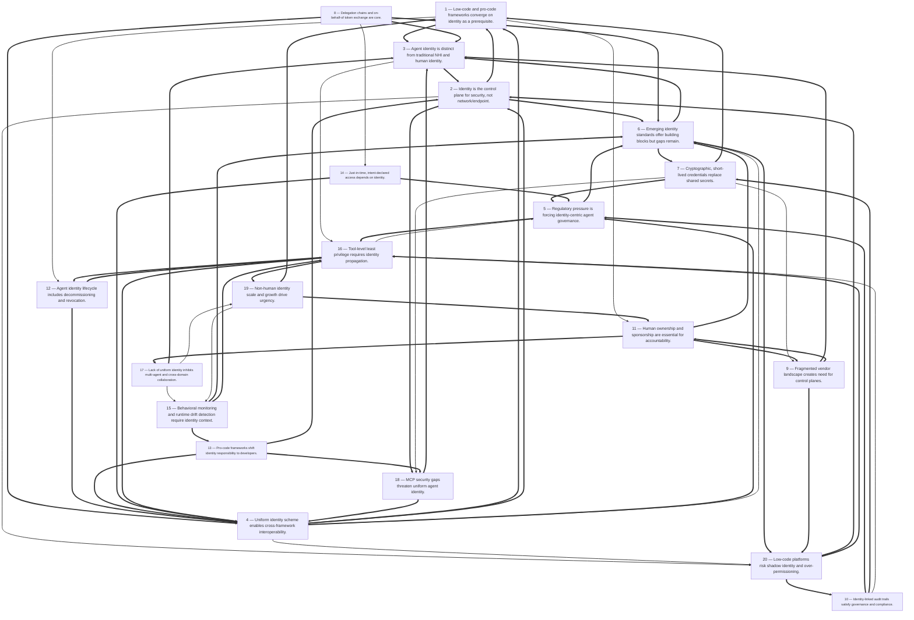

# Title: The sources collectively indicate that agent identity is becoming a…

## Corpus Quality Scoreboard

Quality: **41/100** - Grade D (Weak)

```
[########------------]  41/100
```

- Critic: review (coverage 50 | evidence 32 | balance 50 | tension 40)
- Sources: 49 gathered | 33 cited | 49 full text | 25 distinct domains | 5.8/8 average relevance
- Cited date span: 2025-2026 (18 undated)
- Contradictions: 8 edges (strongest 50/100)

## Topic

review the industry standards for lo-code vs pro-code agent frameworks with respect to the need for agent identity, what identity enables, what capabilities having a uniform identity scheme provides across operational, security and governance requirements

## Search Queries

- low-code vs pro-code AI agent frameworks agent identity standards
- agent identity requirements low-code vs pro-code frameworks
- uniform identity scheme AI agents operational security governance
- AI agent identity management standards
- what does agent identity enable authentication authorization auditability
- agent identity governance compliance requirements
- non-human identity standards AI agents
- agent identity operational security governance capabilities
- industry standards AI agent identity and frameworks
- AI agent identity frameworks standards

### Search Engine Summary

| Engine | Pages | PDFs | Videos | Total |
|--------|-------|------|--------|-------|
| langsearch | 27 | 0 | 0 | 27 |
| serper | 17 | 0 | 0 | 17 |
| wikipedia | 5 | 0 | 0 | 5 |

### Search Provider Requests

| Search Provider | Requests |
|-----------------|----------|
| mf_search | 10 |

## Executive Summary

The sources collectively indicate that agent identity is becoming a foundational requirement for both low-code and pro-code agent frameworks, driven by the explosive growth of non-human identities, high-profile security incidents, and increasing regulatory pressure. Low-code platforms such as Salesforce Agentforce and SAP Joule Studio accelerate agent creation through visual builders and prebuilt components, but they risk embedding agents without explicit identity governance unless identity is built into the platform [#43][#44][#46]. Pro-code frameworks—Google Cloud Agent Identity, SAP Cloud SDK for AI, and custom runtime solutions—offer greater flexibility but place responsibility for cryptographic identity, delegation, and audit on developers [#15][#46][#11]. A uniform identity scheme, whether based on SPIFFE/SPIRE, OAuth 2.0/OIDC, SCIM, A2A, or emerging standards like ERC-8004, enables consistent authentication, authorization, delegation, lifecycle management, audit, and interoperability across operational, security, and governance domains [#1][#15][#34][#37]. However, the evidence also shows significant fragmentation, immature standards, and gaps in lifecycle management, shadow AI governance, and cross-domain trust, with only a minority of organizations having mature agentic AI governance [#21][#23][#29].

## Top 10 Implications

1. Agent identity must be treated as a first-class requirement in both low-code and pro-code frameworks; otherwise agents will operate as unmanaged, over-privileged non-human identities, as seen in the 91% adoption versus 10% strategy gap [#29][#33].
2. A uniform identity scheme—spanning cryptographic credentials, delegation tokens, and audit identifiers—is the only scalable way to enforce least privilege, traceability, and interoperability across heterogeneous agent platforms [#1][#15][#34].
3. Low-code platforms lower the barrier to agent creation but can hide identity risks; governance must be embedded in the platform rather than left to citizen developers [#43][#44][#9].
4. Pro-code frameworks require developers to implement identity primitives correctly; without standardized abstractions, identity debt and inconsistent security postures will accumulate [#46][#11][#18].
5. Delegation-chain visibility and on-behalf-of token exchange are essential for preventing privilege escalation and confused-deputy attacks in multi-agent and multi-tool workflows [#11][#16][#13].
6. Regulatory frameworks (EU AI Act, NIST AI RMF, ISO/IEC 42001) increasingly require identity-linked audit trails, human oversight, and lifecycle controls, making identity a compliance prerequisite [#22][#33][#35].
7. MCP adoption without strong identity—static secrets, low OAuth adoption, high tool-poisoning success—creates a critical gap that uniform agent identity standards must close [#14][#34][#49].
8. Identity enables operational capabilities such as just-in-time access, rapid revocation, kill switches, and decommissioning, which are necessary for safe autonomous operation [#1][#4][#29].
9. Human ownership and sponsorship attribution must be part of the identity record; only 28% of organizations can currently trace agent actions to a human sponsor [#1][#6][#49].
10. Fragmented vendor tooling and emerging standards mean organizations should adopt a central identity control plane and prepare for cross-domain interoperability rather than betting on a single proprietary model [#7][#14][#34].

## Open Questions

- How should low-code platform auto-registration (e.g., SAP Joule) map to enterprise IAM and SCIM provisioning?
- What empirical evidence validates AgentBound’s governance enforcement accuracy and authority composition behavior? [#13]
- How will NIST’s AI Agent Standards Initiative and the OpenID Foundation’s whitepaper converge on recursive delegation and cross-domain trust? [#34][#35][#36]
- What is the minimum viable uniform identity schema for agent identity across MCP, A2A, SPIFFE, and ERC-8004? [#14][#15][#37][#46]
- How do organizations reconcile EU AI Act human-oversight requirements with autonomous agent operation? [#32][#38]
- What are the cost and latency implications of short-lived credentials and just-in-time access at scale? [#1][#15][#47]
- How should ownership and sponsorship be represented in agent identity for shadow AI scenarios? [#23][#29]
- Will low-code platforms expose identity controls sufficiently for regulated industries, or will pro-code be required? [#43][#44][#46]

## Data Quality & Consistency

**Overall verdict:** Proceed — the synthesis passes the deterministic 4-critic audit.

| Metric | Value | Detail |
|--------|-------|--------|
| Corpus critic | 41/100 (review) | coverage 50 · evidence 32 · balance 50 · tension 40 |
| Contradictions | 8 edge(s) | strongest = 50/100 |
| Source tensions | 35 tension(s) | 8 contradiction · 4 shallow · 23 isolated |
| Synthesis audit | 85/100 (proceed) | 33 source(s) cited |

**Key concerns:**
- Corpus: Dimension 'Benefit' has only moderate support (3 source(s))
- Corpus: Dimension 'Adoption' has only surface-level support (1 source(s))
- Contradiction: 6 vs 21 — Source #6 and source #21 make opposing claims about safety.
- Contradiction: 6 vs 28 — Source #6 and source #28 make opposing claims about safety.
- Tension (contradiction): safety [#6, #21] — Source #6 and source #21 make opposing claims about safety.
- Tension (contradiction): safety [#6, #28] — Source #6 and source #28 make opposing claims about safety.
- Audit: Synthesis audit for 'review the industry standards for lo-code vs pro-code agent frameworks with respect to the need for agent identity, what identity enables, what capabilities having a uniform identity scheme provides across operational, security and governance requirements' scored 85/100 across critics [coverage=40 logic=100 evidence=100 readability=100]; 33/49 sources cited.

## Concepts

### 1. Auditability, Attribution & Regulatory/Standards Momentum

**Definition:** Regulation and emerging standards increasingly demand tamper-resistant audit trails that attribute each agent action to a human owner and verifiable policy decision, making provable evidence a compliance obligation.

**Key Evidence:**
- The EU AI Act Articles 12/13/14/15 mandate automatic event logging, transparency, human oversight, and robustness, alongside NIST AI RMF and ISO/IEC 42001—"if you cannot show evidence, you cannot prove control" [#22]; Okta cites Articles 12/14 for high-risk compliance [#33].
- NIST launched its AI Agent Standards Initiative on Feb. 17, 2026 with three pillars and an 81% red-teaming attack success rate, urging enterprises not to wait for final guidance [#35][#36]; the OpenID Foundation whitepaper calls for new standards for recursive delegation and cross-domain trust [#34].
- AgentBound introduces cryptographically verifiable governance receipts for replayable, non-repudiable audit [#13]; WorkOS provides audit logs filterable by agent registration ID and Log Streams to SIEM/S3/Snowflake [#18]; ERC-8004 gives agents persistent onchain identity and verifiable reputation across platforms [#37].

### 2. Non-Human Identity Explosion & Agents as First-Class Identities

**Definition:** Enterprises face a surge of non-human identities—AI agents, service accounts, API keys, and bots—that vastly outnumber humans and must be governed as distinct, first-class identities rather than shared machine accounts.

**Key Evidence:**
- Non-human identities outnumber humans over 90:1 (up to 144:1) and grew 44% from 2024–2025; five agent identity types are defined (copilot, autonomous, orchestrator, ephemeral sub-agent, agent-as-a-service) [#1]; the same 144:1 ratio and 3M+ agents globally appear elsewhere [#14].
- Okta found 91% of organizations already deploy AI agents, but only 10% have a roadmap for managing non-human identities [#29]; SailPoint reports only 44% have formal AI-agent governance frameworks [#9].
- AI agents are not standalone identities but are built on top of NHIs, forming two distinct threat surfaces requiring distinct controls [#27]; SailPoint claims leadership governing human, non-employee, machine, and AI agent identities in one platform [#6].

### 3. Least Privilege, Just-in-Time Access & Scoped Delegation

**Definition:** Agent access should be intent-declared, time-bound, and scope-limited, using per-agent or per-session short-lived credentials with explicit permission-narrowing across delegation chains.

**Key Evidence:**
- CSA's AIGF centers on a just-in-time access model using intent-declared, time-bound, scope-limited grants, with delegation-chain audit trails as a proposed extension [#1].
- Cockroach Labs recommends per-session/per-agent short-lived scoped credentials from a token service and explicit permission-narrowing across delegation chains to prevent confused-deputy escalation [#11]; CSA likewise calls for zero standing privilege/JIT access [#23].
- Google Cloud issues each agent a SPIFFE-based identity that is non-shared, non-impersonable, with 24-hour X.509-bound tokens using mTLS and DPoP [#15]; Okta's On-Behalf-Of Token Exchange and WorkOS's `act` claim (RFC 8693) implement delegated scoped credentials [#16][#18].

### 4. Legacy IAM Failure & Identity as the Control Plane

**Definition:** Traditional IAM built for humans and static machine accounts cannot handle autonomous, machine-speed agents, so identity—not network or endpoint tooling—is positioned as the central control plane for agent security.

**Key Evidence:**
- 92% of organizations lack confidence in legacy IAM for AI/NHI risks, 78% lack documented AI identity lifecycle policies, and only 28% can trace agent actions to a human sponsor [#1].
- Traditional IAM breaks because agents run under shared service accounts with broad privileges and no per-agent audit trail, e.g., 40 API calls in 30 seconds or 500 customer records accessed for one task [#11].
- Okta reports 85% of leaders rank IAM as the most critical component of their AI strategy, asserting "identity is the control plane" [#30]; Microsoft Entra Workload ID similarly targets NHIs with credential-free auth and least privilege [#24].

### 5. Runtime Enforcement, Behavioral Monitoring & Revocation

**Definition:** Because authentication alone is insufficient, agent governance requires continuous runtime oversight—deviation detection, behavioral analytics, drift checks, and instant revocation or kill switches.

**Key Evidence:**
- Saviynt's Agent Access Gateway adds design-time intent analysis and deviation detection, plus a "delete switch" that immediately deletes an agent, revokes its access across gateways, and preserves configuration for audit [#4].
- Omada adds four dimensions beyond NHI governance: defined authority, delegation chain visibility, continuous runtime-drift checks, and decision evidence [#7]; identity governance can't stop prompt injection but can stop the ensuing unauthorized action chain [#7].
- AgentBound enforces behavioral oversight between authorization and execution, with the invariant "scope permitted it, constitution stopped it, and the receipt proves it" [#13]; SSH's PAM approach brokers agent-to-machine access with short-lived certs, JIT scoped access, UEBA, and SIEM-streamed session recording [#47].

## Findings


### **Finding 1** — Low-code and pro-code frameworks converge on identity as a prerequisite.

**Observation:**
Salesforce low-code AI agent development uses visual builders, configuration tools, and prebuilt models; Agentforce 360 supports pro-code, low-code, and vibe coding, and stresses lifecycle governance including data masking, role-based access, continuous testing, monitoring, and audit logging [#43][#44][#45]. SAP BTP supports low-code agents in Joule Studio/SAP Build with automatic Joule registration, and pro-code agents using SAP Cloud SDK for AI with frameworks such as LangGraph, AG2, CrewAI, Smolagents, Google ADK, and Pydantic AI, with manual A2A “Bring Your Own Agent” registration [#46]. Google Cloud Agent Identity provides SPIFFE-based identity for agents to authenticate to MCP servers, cloud resources, endpoints, and other agents [#15]. Saviynt provides Agent Access Gateway, Identity Management, and Posture Management across Microsoft Foundry, N8N, Snowflake Cortex, and other AI platforms [#4].

**Analysis:**
Both low-code and pro-code frameworks require identity, but they differ in where identity is created and governed.

Low-code platforms often auto-register agents (e.g., SAP Joule automatic registration) and embed identity in the platform, which can accelerate adoption but risks shadow identity if not federated with enterprise IAM [#46][#43].

Pro-code frameworks require developers to call identity APIs, manage credentials, and implement delegation, as seen in SAP’s manual A2A registration and Google Cloud’s auth manager for API keys, OAuth clients, and tokens [#46][#15].

The sources show convergence on common requirements: unique agent identities, scoped credentials, lifecycle management, and audit trails [#1][#6][#9].

However, the evidence also reveals a gap: low-code platforms may not expose identity controls to business users, while pro-code frameworks may lack built-in governance, pushing responsibility to developers [#43][#11].

This convergence suggests a uniform identity scheme is needed regardless of abstraction level.

**Cross-reference / Dependencies:**
Builds on Finding 1; prerequisite to Finding 3, Finding 11, and Finding 12.

**Implication:**
Organizations should require both low-code and pro-code platforms to integrate with a central identity control plane.

**Sources:**
- [1] Agent Identity Governance Framework — `hxxps://labs[.]cloudsecurityalliance[.]org/agentic/agentic-identity-governance-framework-v1` (published 2026-04-02)
- [4] New AI Agent Governance Capabilities Across Identity Security for AI | Saviynt [Vibhuti Sinha, Chief Product Officer and Nupur Goyal, Vice President Product Marketing] — `hxxps://saviynt[.]com/blog/identity-security-for-ai-agent-access-gateway-identity-management-posture-management` (published 2026-06-15)
- [6] Agent Identity Security - Datasheet — `hxxps://www[.]sailpoint[.]com/identity-library/agent-identity-security`
- [9] Securing and Governing AI Agents: A Must for Enterprises — `hxxps://www[.]sailpoint[.]com/identity-library/securing-ai-agents-enterprise`
- [11] AI Agent Identity Security | CockroachDB [Quentin Packard] — `hxxps://www[.]cockroachlabs[.]com/blog/ai-agent-identity-security`
- [15] Agent Identity overview &nbsp;|&nbsp; Identity and Access Management (IAM) &nbsp;|&nbsp; Google Cloud Documentation — `hxxps://docs[.]cloud[.]google[.]com/iam/docs/agent-identity-overview`
- [43] Low-Code AI Agent Development — `hxxps://www[.]salesforce[.]com/ca/platform/low-code-development-platform/what-is-low-code/ai-agent-development`
- [44] Low-Code AI Agent Development — `hxxps://www[.]salesforce[.]com/eu/platform/low-code-development-platform/what-is-low-code/ai-agent-development`
- [45] Low-Code AI Agent Development — `hxxps://www[.]salesforce[.]com/au/platform/low-code-development-platform/what-is-low-code/ai-agent-development`
- [46] Build AI Agents on SAP BTP | SAP Architecture Center — `hxxps://architecture[.]learning[.]sap[.]com/docs/golden-path/ai-golden-path/build-and-deliver/build-ai-agents`

**Source date range:** 2026-04-02..2026-06-15 (2 of 10 cited web sources dated)


### **Finding 2** — Identity is the control plane for security, not network/endpoint.

**Observation:**
Okta argues that network and endpoint tools cannot determine which agent acted, on whose behalf, or with what scope; identity is the control plane, and 85% of leaders rank IAM as the most critical component of their AI strategy [#29][#30][#31]. The Blockchain Council argues that agentic AI shifts governance from model-centric to agent-centric and identity-centric [#22]. Omada proposes a centralized control plane and an escalation path [#7]. KuppingerCole requires Zero Trust approaches including credential management, behavioral monitoring, and continuous verification [#49].

**Analysis:**
The sources converge on identity as the central control plane for agent security.

Network and endpoint security tools lack the context to identify which agent performed an action, under what delegation, and with what authority [#29].

Identity provides that context, enabling policy enforcement, least privilege, and audit.

This is a significant shift from traditional security architectures, where perimeter and endpoint controls were primary.

The evidence shows that identity-first approaches are being adopted by major vendors (Okta, Saviynt, SailPoint) and recommended by standards bodies [#4][#6][#30].

However, identity as a control plane requires integration across runtime, tool, and data layers; identity alone cannot stop prompt injection or model misalignment [#13][#14].

The practical implication is that security teams must invest in identity governance as a foundational capability for agent deployments, regardless of low-code or pro-code.

**Cross-reference / Dependencies:**
Builds on Finding 1 and Finding 6; prerequisite to Finding 18 and Finding 20.

**Implication:**
Make identity the primary control plane for agent security and governance.

**Sources:**
- [4] New AI Agent Governance Capabilities Across Identity Security for AI | Saviynt [Vibhuti Sinha, Chief Product Officer and Nupur Goyal, Vice President Product Marketing] — `hxxps://saviynt[.]com/blog/identity-security-for-ai-agent-access-gateway-identity-management-posture-management` (published 2026-06-15)
- [6] Agent Identity Security - Datasheet — `hxxps://www[.]sailpoint[.]com/identity-library/agent-identity-security`
- [7] AI Agent Governance: Identity Controls for Autonomous AI [Veselina Korshunova, @OmadaIdentity] — `hxxps://omadaidentity[.]com/resources/blog/identity-governance-for-ai-agents`
- [13] AgentBound: Verifiable Behavioral Governance for Autonomous AI Agents — `hxxps://arxiv[.]org/html/2606[.]30970v1`
- [14] Runtime Security for AI Agents: An Identity Governance Perspective [SACR] — `hxxps://softwareanalyst[.]substack[.]com/p/runtime-security-for-ai-agents-an` (published 2026-03-18)
- [22] Governance and Compliance for Agentic AI [Suyash Raizada] — `hxxps://www[.]blockchain-council[.]org/agentic-ai/governance-and-compliance-for-agentic-ai-auditability-logging-policies`
- [29] What CISOs typically miss about AI agent security [Linda Gong] — `hxxps://www[.]okta[.]com/en-nl/blog/ai/ai-governance-gap-ciso-security` (published 2026-05-19)
- [30] What CISOs typically miss about AI agent security [Linda Gong] — `hxxps://www[.]okta[.]com/en-gb/blog/ai/ai-governance-gap-ciso-security` (published 2026-05-19)
- [31] What CISOs typically miss about AI agent security [Linda Gong] — `hxxps://www[.]okta[.]com/en-sg/blog/ai/ai-governance-gap-ciso-security` (published 2026-05-19)
- [49] Whitepaper: B2B CIAM in the Era of Agentic AI and NHI [John Tolbert] — `hxxps://www[.]kuppingercole[.]com/research/wp81286/$%7Bitem[.]url%7D` (published 2025-09-25)

**Source date range:** 2025-09-25..2026-06-15 (6 of 10 cited web sources dated)


### **Finding 3** — Agent identity is distinct from traditional NHI and human identity.

**Observation:**
Sources distinguish AI agents from non-human identities: NHIs are machine/workload identities for APIs, service accounts, containers, and IoT devices, while AI agents are LLM-powered, autonomous, goal-directed systems built on top of NHIs, requiring behavior monitoring, guardrails, intent restriction, verification, and observability [#27]. Okta defines AI agent identity as a unique, cryptographically verifiable digital identity tied to scoped credentials, contextual authorization, behavioral validation, delegation chains, and lifecycle governance [#32][#38]. SC World describes agentic identity governance as managing autonomous agents that can make decisions, escalate privileges, and initiate actions without human oversight [#19].

**Analysis:**
This distinction matters because treating agents as ordinary NHIs leads to inadequate controls.

NHI threats include exposed API keys and unused service accounts; AI agent threats include autonomous overreach, prompt injection, and misuse—two distinct threat surfaces needing distinct controls [#27].

Agents require dynamic, multi-step decisions and machine-speed autonomy, so static NHI controls like credential rotation alone are insufficient [#32][#38].

The sources show a conceptual shift from model-centric to agent-centric and identity-centric governance [#22][#20].

However, the boundary is blurry: AI agents are built on NHIs, so identity schemes must handle both layers [#27][#49].

The lack of a single definition across sources—CSA’s five agent identity types versus Okta’s broad definition—indicates standards are still maturing [#1][#32].

This finding is foundational for low-code versus pro-code: low-code platforms may abstract away the distinction, while pro-code frameworks may expose it explicitly.

**Cross-reference / Dependencies:**
Prerequisite to Finding 2, Finding 3, and Finding 16.

**Implication:**
Any agent identity scheme must explicitly model autonomy, intent, and delegation, not just machine credentials.

**Sources:**
- [1] Agent Identity Governance Framework — `hxxps://labs[.]cloudsecurityalliance[.]org/agentic/agentic-identity-governance-framework-v1` (published 2026-04-02)
- [19] What Is Agentic Identity and AI Identity Governance? [SC Editorial Intelligence , expert reviewed] — `hxxps://www[.]scworld[.]com/tech-explainer/what-is-agentic-identity-and-ai-identity-governance` (published 2026-06-04)
- [20] Compliance and Risk Management for Agentic AI [Kundan Singh, @LoginRadius] — `hxxps://www[.]loginradius[.]com/blog/engineering/compliance-and-risk-management-for-agentic-ai-systems` (published 2026-03-02)
- [22] Governance and Compliance for Agentic AI [Suyash Raizada] — `hxxps://www[.]blockchain-council[.]org/agentic-ai/governance-and-compliance-for-agentic-ai-auditability-logging-policies`
- [27] What’s the difference between NHI and AI agents—and why it matters - Silverfort — `hxxps://www[.]silverfort[.]com/blog/whats-the-difference-between-nhi-and-ai-agents-and-why-it-matters`
- [32] What is AI agent identity? Securing autonomous systems [Okta] — `hxxps://www[.]okta[.]com/identity-101/what-is-ai-agent-identity`
- [38] What is AI agent identity? Securing autonomous systems [Okta] — `hxxps://www[.]okta[.]com/fr-fr/identity-101/what-is-ai-agent-identity` (published 2025-10-29)
- [49] Whitepaper: B2B CIAM in the Era of Agentic AI and NHI [John Tolbert] — `hxxps://www[.]kuppingercole[.]com/research/wp81286/$%7Bitem[.]url%7D` (published 2025-09-25)

**Source date range:** 2025-09-25..2026-06-04 (5 of 8 cited web sources dated)


### **Finding 4** — Uniform identity scheme enables cross-framework interoperability.

**Observation:**
The OpenID Foundation whitepaper says current standards, SSO/user-management infrastructure, and MCP can secure simple agents within single trust domains, but autonomous agents that spawn sub-agents, cross organizational boundaries, and make thousands of daily decisions will require new interoperable standards for recursive delegation, cross-domain trust, lifecycle management, and governance [#34]. SAP adopts A2A as its preferred standard for multi-agent and vendor collaboration and MCP for standardized external tool interaction [#46]. BNB Chain has implemented ERC-8004 for persistent onchain identities and verifiable reputation across platforms and sessions [#37]. Google Cloud uses SPIFFE-based identity formatted as `spiffe://TRUST_DOMAIN/resources/SERVICE/RESOURCE_PATH` [#15].

**Analysis:**
A uniform identity scheme provides a common language for authentication, authorization, and audit across low-code and pro-code frameworks.

Without it, agents built in Salesforce, SAP, Google Cloud, or custom code cannot be trusted across domains, and delegation chains break at organizational boundaries [#34][#46].

The sources show multiple competing standards: SPIFFE/SPIRE for cryptographic workload identity [#15][#47], OAuth 2.

0/OIDC for delegated authorization [#1][#16], SCIM for lifecycle provisioning [#1], A2A for agent-to-agent collaboration [#46], and ERC-8004 for onchain reputation [#37].

This fragmentation creates interoperability gaps, especially for recursive delegation and cross-domain trust [#34].

A uniform scheme would enable consistent policy enforcement, audit correlation, and lifecycle management.

However, no single standard covers all requirements; sources suggest a composition of standards rather than one winner [#1][#34][#49].

**Cross-reference / Dependencies:**
Builds on Finding 1 and Finding 2; prerequisite to Finding 5, Finding 6, and Finding 20.

**Implication:**
Enterprises should adopt a composable identity stack and participate in standards efforts to avoid proprietary lock-in.

**Sources:**
- [1] Agent Identity Governance Framework — `hxxps://labs[.]cloudsecurityalliance[.]org/agentic/agentic-identity-governance-framework-v1` (published 2026-04-02)
- [15] Agent Identity overview &nbsp;|&nbsp; Identity and Access Management (IAM) &nbsp;|&nbsp; Google Cloud Documentation — `hxxps://docs[.]cloud[.]google[.]com/iam/docs/agent-identity-overview`
- [16] Auth0 gives developers the identity layer to securely ship agentic apps — `hxxps://www[.]okta[.]com/en-in/newsroom/articles/auth0-may-2026-product-innovations`
- [34] New whitepaper tackles AI agent identity challenges [Serj Hallam, @openid] — `hxxps://openid[.]net/new-whitepaper-tackles-ai-agent-identity-challenges` (published 2025-10-07)
- [37] BNB Chain Adopts ERC-8004 Identity Standard for Autonomous AI Agents - Blockonomi [Brenda Mary, @blockonomi] — `hxxps://blockonomi[.]com/bnb-chain-adopts-erc-8004-identity-standard-for-autonomous-ai-agents` (published 2026-02-10)
- [46] Build AI Agents on SAP BTP | SAP Architecture Center — `hxxps://architecture[.]learning[.]sap[.]com/docs/golden-path/ai-golden-path/build-and-deliver/build-ai-agents`
- [47] PAM &amp; AI Agents | SSH [Miikka Sainio] — `hxxps://www[.]ssh[.]com/blog/pam-ai-agents-ssh` (published 2026-04-30)
- [49] Whitepaper: B2B CIAM in the Era of Agentic AI and NHI [John Tolbert] — `hxxps://www[.]kuppingercole[.]com/research/wp81286/$%7Bitem[.]url%7D` (published 2025-09-25)

**Source date range:** 2025-09-25..2026-04-30 (5 of 8 cited web sources dated)


### **Finding 5** — Regulatory pressure is forcing identity-centric agent governance.

**Observation:**
The Blockchain Council cites EU AI Act Regulation (EU) 2024/1689 Articles 12 (automatic event logging), 13 (transparency), 14 (human oversight/interruption), and 15 (accuracy, robustness, cybersecurity), plus NIST AI RMF and ISO/IEC 42001 [#22]. CSA reports that NIST’s AI Agent Standards Initiative launched on Feb. 17, 2026, with pillars including research on agent security and identity, and COSAiS SP 800-53 overlays for AC, IA, AU, and SR control families [#35]. LoginRadius cites NIS2, DORA, and the EU AI Act as mandates [#20][#21]. Okta cites HIPAA, GDPR/CCPA, SOC 2, and EU AI Act high-risk requirements Articles 12 and 14 [#33].

**Analysis:**
Regulatory frameworks increasingly treat agent identity as a compliance prerequisite.

The EU AI Act requires automatic event logging, transparency, human oversight, and cybersecurity, all of which depend on knowing which agent acted, on whose behalf, and with what authority [#22][#33].

NIST’s AI Agent Standards Initiative and NCCoE concept paper on AI agent identity and authorization signal federal attention [#35][#36].

The sources also show that voluntary standards become de facto compliance obligations: NIST plans sector guidance by end-2026 and regulatory incorporation in 2027 [#36].

However, compliance is complicated by the EU AI Act’s human-oversight requirement potentially conflicting with autonomous operation [#32][#38].

This finding implies that low-code and pro-code frameworks must generate compliance-ready identity and audit data by design, not as an afterthought.

**Cross-reference / Dependencies:**
Builds on Finding 6; prerequisite to Finding 16.

**Implication:**
Build identity and audit capabilities to map to EU AI Act, NIST, and sectoral regulations.

**Sources:**
- [20] Compliance and Risk Management for Agentic AI [Kundan Singh, @LoginRadius] — `hxxps://www[.]loginradius[.]com/blog/engineering/compliance-and-risk-management-for-agentic-ai-systems` (published 2026-03-02)
- [21] Why AI Agents Require Identity Governance | Saviynt [Mudit Sharma - Director-Partner Solutions, Saviynt & Amit Agarwal - Global IAM CTO, IBM Consulting] — `hxxps://saviynt[.]com/blog/ai-agent-identity-governance`
- [22] Governance and Compliance for Agentic AI [Suyash Raizada] — `hxxps://www[.]blockchain-council[.]org/agentic-ai/governance-and-compliance-for-agentic-ai-auditability-logging-policies`
- [32] What is AI agent identity? Securing autonomous systems [Okta] — `hxxps://www[.]okta[.]com/identity-101/what-is-ai-agent-identity`
- [33] Strategies to improve AI agent data privacy and security [Okta] — `hxxps://www[.]okta[.]com/identity-101/improve-ai-agent-data-privacy-and-security`
- [35] NIST AI Agent Standards: What It Means for Enterprise Security — `hxxps://labs[.]cloudsecurityalliance[.]org/research/csa-research-note-nist-ai-agent-standards-initiative-2026040` (published 2026-04-02)
- [36] NIST&#039;s AI Agent Standards Initiative: Why Autonomous AI Just Became Washington&#039;s Problem [Andrew R. Lee] — `hxxps://natlawreview[.]com/article/nists-ai-agent-standards-initiative-why-autonomous-ai-just-became-washingtons`
- [38] What is AI agent identity? Securing autonomous systems [Okta] — `hxxps://www[.]okta[.]com/fr-fr/identity-101/what-is-ai-agent-identity` (published 2025-10-29)

**Source date range:** 2025-10-29..2026-04-02 (3 of 8 cited web sources dated)


### **Finding 6** — Emerging identity standards offer building blocks but gaps remain.

**Observation:**
The CSA AIGF assesses OAuth 2.0/OIDC, SPIFFE/SPIRE, and SCIM for reuse and gaps, and proposes extensions such as delegation-chain audit trails and a SCIM agent schema [#1]. Google Cloud uses SPIFFE-based identity [#15]. WorkOS uses RFC 9207 issuer identification, DPoP, RFC 9728 discovery, and RFC 8693 token exchange [#18]. SAP adopts A2A 0.3.0 and MCP [#46]. BNB Chain adopts ERC-8004 for persistent onchain identities and verifiable reputation [#37]. The OpenID Foundation says new standards are needed for recursive delegation, cross-domain trust, lifecycle management, and governance [#34]. NIST’s AI Agent Standards Initiative has three pillars: industry-led standards, open-source protocol interoperability, and research on AI agent security and identity [#35][#36].

**Analysis:**
The sources identify a patchwork of standards that can be composed into an agent identity scheme, but no single standard covers all requirements.

OAuth 2.

0/OIDC provides delegated authorization; SPIFFE/SPIRE provides cryptographic workload identity; SCIM provides lifecycle provisioning; A2A provides agent-to-agent collaboration; MCP provides tool interaction; ERC-8004 provides onchain reputation [#1][#15][#18][#46][#37].

However, gaps remain in recursive delegation, cross-domain trust, lifecycle management, and governance [#34].

The OpenID Foundation urges developers, standards organizations, and enterprises to act now to avoid fragmented proprietary solutions [#34].

NIST’s initiative signals that standards are still in development, with sector guidance expected by end-2026 and regulatory incorporation in 2027 [#36].

This finding implies that organizations should adopt available standards now while preparing for evolution, and that low-code and pro-code frameworks should expose identity in standards-compatible ways.

**Cross-reference / Dependencies:**
Builds on Finding 3 and Finding 7; prerequisite to Finding 20.

**Implication:**
Adopt composable standards (OAuth, SPIFFE, SCIM, A2A) and monitor NIST/OpenID developments.

**Sources:**
- [1] Agent Identity Governance Framework — `hxxps://labs[.]cloudsecurityalliance[.]org/agentic/agentic-identity-governance-framework-v1` (published 2026-04-02)
- [15] Agent Identity overview &nbsp;|&nbsp; Identity and Access Management (IAM) &nbsp;|&nbsp; Google Cloud Documentation — `hxxps://docs[.]cloud[.]google[.]com/iam/docs/agent-identity-overview`
- [18] Agents need identity, authorization, and audit in the same place — WorkOS [WorkOS] — `hxxps://workos[.]com/blog/agent-identity-authorization-audit` (published 2026-09-01)
- [34] New whitepaper tackles AI agent identity challenges [Serj Hallam, @openid] — `hxxps://openid[.]net/new-whitepaper-tackles-ai-agent-identity-challenges` (published 2025-10-07)
- [35] NIST AI Agent Standards: What It Means for Enterprise Security — `hxxps://labs[.]cloudsecurityalliance[.]org/research/csa-research-note-nist-ai-agent-standards-initiative-2026040` (published 2026-04-02)
- [36] NIST&#039;s AI Agent Standards Initiative: Why Autonomous AI Just Became Washington&#039;s Problem [Andrew R. Lee] — `hxxps://natlawreview[.]com/article/nists-ai-agent-standards-initiative-why-autonomous-ai-just-became-washingtons`
- [37] BNB Chain Adopts ERC-8004 Identity Standard for Autonomous AI Agents - Blockonomi [Brenda Mary, @blockonomi] — `hxxps://blockonomi[.]com/bnb-chain-adopts-erc-8004-identity-standard-for-autonomous-ai-agents` (published 2026-02-10)
- [46] Build AI Agents on SAP BTP | SAP Architecture Center — `hxxps://architecture[.]learning[.]sap[.]com/docs/golden-path/ai-golden-path/build-and-deliver/build-ai-agents`

**Source date range:** 2025-10-07..2026-09-01 (5 of 8 cited web sources dated)


### **Finding 7** — Cryptographic, short-lived credentials replace shared secrets.

**Observation:**
Google Cloud Agent Identity provides strongly attested SPIFFE-based cryptographic identity, not shared by default, cannot be impersonated, and does not allow long-lived service-account keys; access tokens are bound to auto-provisioned X.509 certificates valid for 24 hours, using mTLS for Google Cloud APIs and DPoP across Agent Gateway [#15]. WorkOS issues short-lived scoped credentials carrying `sub` (agent registration ID) and `act` (delegated user, per RFC 8693) [#18]. CockroachDB recommends per-session and per-agent short-lived scoped credentials from a token service [#11]. SSH recommends ephemeral and attestable non-human identities, such as SPIFFE/SPIRE, with PAM-mediated authentication [#47].

**Analysis:**
The sources consistently identify shared service accounts, long-lived credentials, and hardcoded secrets as major risks.

CSA reports 28.

65 million hardcoded secrets added to public GitHub in 2025, including over 1.

27 million AI-related secrets (+81% year over year), with 53% of public MCP servers using static secrets and only 8.

5% implementing OAuth [#23][#14].

Short-lived, cryptographically bound credentials mitigate these risks by limiting blast radius, enabling automatic rotation, and preventing credential replay [#11][#15].

They also enable identity to be used as a runtime control: tokens can be scoped to specific tools, sessions, or tasks, and revoked quickly [#4][#18].

However, adoption requires infrastructure: token services, certificate authorities, and integration with existing IAM.

Pro-code frameworks may have to implement this, while low-code platforms may abstract it.

The evidence suggests short-lived credentials are a necessary but not sufficient component of agent identity.

**Cross-reference / Dependencies:**
Builds on Finding 1; prerequisite to Finding 5, Finding 9, and Finding 18.

**Implication:**
Replace static secrets and shared service accounts with per-agent, short-lived, scoped credentials as a baseline.

**Sources:**
- [4] New AI Agent Governance Capabilities Across Identity Security for AI | Saviynt [Vibhuti Sinha, Chief Product Officer and Nupur Goyal, Vice President Product Marketing] — `hxxps://saviynt[.]com/blog/identity-security-for-ai-agent-access-gateway-identity-management-posture-management` (published 2026-06-15)
- [11] AI Agent Identity Security | CockroachDB [Quentin Packard] — `hxxps://www[.]cockroachlabs[.]com/blog/ai-agent-identity-security`
- [14] Runtime Security for AI Agents: An Identity Governance Perspective [SACR] — `hxxps://softwareanalyst[.]substack[.]com/p/runtime-security-for-ai-agents-an` (published 2026-03-18)
- [15] Agent Identity overview &nbsp;|&nbsp; Identity and Access Management (IAM) &nbsp;|&nbsp; Google Cloud Documentation — `hxxps://docs[.]cloud[.]google[.]com/iam/docs/agent-identity-overview`
- [18] Agents need identity, authorization, and audit in the same place — WorkOS [WorkOS] — `hxxps://workos[.]com/blog/agent-identity-authorization-audit` (published 2026-09-01)
- [23] The Non-Human Identity Governance Vacuum — `hxxps://labs[.]cloudsecurityalliance[.]org/research/csa-whitepaper-nonhuman-identity-agentic-ai-governance-v1-cs`
- [47] PAM &amp; AI Agents | SSH [Miikka Sainio] — `hxxps://www[.]ssh[.]com/blog/pam-ai-agents-ssh` (published 2026-04-30)

**Source date range:** 2026-03-18..2026-09-01 (4 of 7 cited web sources dated)


### **Finding 8** — Delegation chains and on-behalf-of token exchange are core.

**Observation:**
Okta Auth0 offers On-Behalf-Of Token Exchange, Agent as Principal, and Auth for MCP [#16]. WorkOS uses an `act` claim for the delegated user per RFC 8693 and a `sub` claim for the agent registration ID [#18]. AgentBound composes delegated authorization, owner-signed behavioral constitutions, and site action contracts via a conservative decision algebra, with a standing delegation model and per-execution policy refreshing [#13]. CockroachDB warns that delegation enables privilege escalation and confused-deputy attacks, and recommends explicit permission-narrowing across delegation chains [#11]. SC World lists scope definition and delegation controls as a core capability [#19].

**Analysis:**
Delegation is how agents act on behalf of users, other agents, or services while preserving accountability.

Without a uniform identity scheme, delegation chains become opaque, making it impossible to know which agent acted, for whom, and with what scope [#11][#18].

The sources show emerging mechanisms: OAuth token exchange (RFC 8693), `act` claims, and delegation-chain audit trails [#16][#18][#1].

AgentBound goes further by separating delegated authorization from behavioral constitutions, producing cryptographically verifiable governance receipts [#13].

However, delegation also introduces risks: confused deputy, privilege escalation, and recursive delegation across domains [#11][#34].

The OpenID Foundation warns that current standards cannot handle recursive delegation and cross-domain trust [#34].

This finding is critical for low-code versus pro-code: low-code platforms may hide delegation complexity, while pro-code frameworks may require explicit chain construction.

**Cross-reference / Dependencies:**
Builds on Finding 3 and Finding 4; prerequisite to Finding 6 and Finding 14.

**Implication:**
Require delegation-chain visibility and permission-narrowing in any agent identity scheme.

**Sources:**
- [1] Agent Identity Governance Framework — `hxxps://labs[.]cloudsecurityalliance[.]org/agentic/agentic-identity-governance-framework-v1` (published 2026-04-02)
- [11] AI Agent Identity Security | CockroachDB [Quentin Packard] — `hxxps://www[.]cockroachlabs[.]com/blog/ai-agent-identity-security`
- [13] AgentBound: Verifiable Behavioral Governance for Autonomous AI Agents — `hxxps://arxiv[.]org/html/2606[.]30970v1`
- [16] Auth0 gives developers the identity layer to securely ship agentic apps — `hxxps://www[.]okta[.]com/en-in/newsroom/articles/auth0-may-2026-product-innovations`
- [18] Agents need identity, authorization, and audit in the same place — WorkOS [WorkOS] — `hxxps://workos[.]com/blog/agent-identity-authorization-audit` (published 2026-09-01)
- [19] What Is Agentic Identity and AI Identity Governance? [SC Editorial Intelligence , expert reviewed] — `hxxps://www[.]scworld[.]com/tech-explainer/what-is-agentic-identity-and-ai-identity-governance` (published 2026-06-04)
- [34] New whitepaper tackles AI agent identity challenges [Serj Hallam, @openid] — `hxxps://openid[.]net/new-whitepaper-tackles-ai-agent-identity-challenges` (published 2025-10-07)

**Source date range:** 2025-10-07..2026-09-01 (4 of 7 cited web sources dated)


### **Finding 9** — Fragmented vendor landscape creates need for control planes.

**Observation:**
Omada notes fragmented platform models including Microsoft Entra Agent ID (preview), Salesforce Agentforce, ServiceNow AI Agent Studio, Amazon Bedrock, and Google Gemini Enterprise Agent Platform [#7]. The Runtime Security report profiles 15 vendor partners including Aembit (secretless NHI runtime access) and Apono (intent-based access) and says no single vendor fully solves runtime security [#14]. Okta for AI Agents federates with existing IdPs via OIDC/SAML and spans Azure, AWS, Google Cloud, Salesforce Agentforce, Amazon Bedrock, and ServiceNow AI [#30][#31]. Saviynt expanded native coverage with Microsoft Foundry, N8N, Snowflake Cortex, and additional AI platforms [#4]. KuppingerCole says CIAM platforms must add automated credential discovery, ownership assignment, risk evaluation, dynamic client registration, pushed authorization requests, fraud-detection integration, agent-specific consent, and privacy-first token strategies [#49].

**Analysis:**
The agent identity market is fragmented across cloud providers, SaaS platforms, and security vendors.

This fragmentation creates operational complexity: organizations must manage identities and policies across multiple control planes, increasing the risk of inconsistent enforcement and blind spots [#7][#14].

A uniform identity scheme and a central control plane can abstract over these differences, providing a single source of truth for agent identities, entitlements, and audit [#7][#30].

The sources show vendors moving in this direction: Okta for AI Agents is vendor-neutral and federates with existing IdPs [#30], Saviynt provides an AI identity control plane with Agent Access Gateway [#4], and WorkOS offers hosted agent registration and audit [#18].

However, the evidence also warns of tradeoffs: WorkOS is a hosted dependency, and if unreachable, agents cannot register or rotate credentials [#18].

This finding suggests that a uniform identity scheme is both a technical standard and a market consolidator.

**Cross-reference / Dependencies:**
Builds on Finding 3 and Finding 11; prerequisite to Finding 20.

**Implication:**
Adopt a central identity control plane that federates with platform-specific agent identity models.

**Sources:**
- [4] New AI Agent Governance Capabilities Across Identity Security for AI | Saviynt [Vibhuti Sinha, Chief Product Officer and Nupur Goyal, Vice President Product Marketing] — `hxxps://saviynt[.]com/blog/identity-security-for-ai-agent-access-gateway-identity-management-posture-management` (published 2026-06-15)
- [7] AI Agent Governance: Identity Controls for Autonomous AI [Veselina Korshunova, @OmadaIdentity] — `hxxps://omadaidentity[.]com/resources/blog/identity-governance-for-ai-agents`
- [14] Runtime Security for AI Agents: An Identity Governance Perspective [SACR] — `hxxps://softwareanalyst[.]substack[.]com/p/runtime-security-for-ai-agents-an` (published 2026-03-18)
- [18] Agents need identity, authorization, and audit in the same place — WorkOS [WorkOS] — `hxxps://workos[.]com/blog/agent-identity-authorization-audit` (published 2026-09-01)
- [30] What CISOs typically miss about AI agent security [Linda Gong] — `hxxps://www[.]okta[.]com/en-gb/blog/ai/ai-governance-gap-ciso-security` (published 2026-05-19)
- [31] What CISOs typically miss about AI agent security [Linda Gong] — `hxxps://www[.]okta[.]com/en-sg/blog/ai/ai-governance-gap-ciso-security` (published 2026-05-19)
- [49] Whitepaper: B2B CIAM in the Era of Agentic AI and NHI [John Tolbert] — `hxxps://www[.]kuppingercole[.]com/research/wp81286/$%7Bitem[.]url%7D` (published 2025-09-25)

**Source date range:** 2025-09-25..2026-09-01 (6 of 7 cited web sources dated)


### **Finding 10** — Identity-linked audit trails satisfy governance and compliance.

**Observation:**
SailPoint provides comprehensive audit trails for compliance, user review, and prevention of over-permissioning [#6]. WorkOS Audit Logs are filterable by agent registration ID and support Log Streams to Datadog, Splunk, AWS S3, Google Cloud Storage, Microsoft Sentinel, Snowflake, or generic HTTPS [#18]. The Blockchain Council recommends layered, correlated logging using agent, session, request, tool-call, and policy-decision IDs, covering model/tool registry, perception events, plan and policy traces, tool-call execution, identity/access, human oversight, and outcome attribution [#22]. AgentBound introduces cryptographically verifiable governance receipts for replayable, non-repudiable audit [#13].

**Analysis:**
Governance and compliance require evidence that agent actions can be attributed, reconstructed, and audited.

The sources show that identity is the linking key: agent ID, session ID, request ID, tool-call ID, and policy-decision ID enable correlation across systems [#22][#18].

Without identity-linked logs, organizations cannot prove control, satisfy EU AI Act Articles 12–15, NIST AI RMF, or ISO/IEC 42001, or investigate incidents [#22][#33].

SailPoint and WorkOS provide commercial capabilities, but the evidence also shows gaps: FusionAuth’s logs cover only events inside FusionAuth, requiring application-level joining [#18].

CSA notes that only 28% of organizations can trace agent actions to a human sponsor [#1].

This finding connects operational monitoring to governance: audit trails are not just forensic but also enable continuous compliance and human oversight.

**Cross-reference / Dependencies:**
Builds on Finding 5; prerequisite to Finding 7 and Finding 16.

**Implication:**
Mandate identity-linked, tamper-resistant audit logs with correlation IDs across agent frameworks.

**Sources:**
- [1] Agent Identity Governance Framework — `hxxps://labs[.]cloudsecurityalliance[.]org/agentic/agentic-identity-governance-framework-v1` (published 2026-04-02)
- [6] Agent Identity Security - Datasheet — `hxxps://www[.]sailpoint[.]com/identity-library/agent-identity-security`
- [13] AgentBound: Verifiable Behavioral Governance for Autonomous AI Agents — `hxxps://arxiv[.]org/html/2606[.]30970v1`
- [18] Agents need identity, authorization, and audit in the same place — WorkOS [WorkOS] — `hxxps://workos[.]com/blog/agent-identity-authorization-audit` (published 2026-09-01)
- [22] Governance and Compliance for Agentic AI [Suyash Raizada] — `hxxps://www[.]blockchain-council[.]org/agentic-ai/governance-and-compliance-for-agentic-ai-auditability-logging-policies`
- [33] Strategies to improve AI agent data privacy and security [Okta] — `hxxps://www[.]okta[.]com/identity-101/improve-ai-agent-data-privacy-and-security`

**Source date range:** 2026-04-02..2026-09-01 (2 of 6 cited web sources dated)


### **Finding 11** — Human ownership and sponsorship are essential for accountability.

**Observation:**
The CSA AIGF reports that only 28% of organizations can trace agent actions to a human sponsor, and 78% lack documented AI identity lifecycle policies [#1]. SailPoint assigns ownership, certifies, and governs agents within a single platform [#6]. Okta requires a verifiable human owner for each autonomous agent [#33]. KuppingerCole says CIAM platforms must add ownership assignment [#49]. The CSA NHI whitepaper identifies blind spots in ownership, lifecycle, privilege, inventory, compliance, and shadow AI [#23].

**Analysis:**
Accountability for autonomous agents requires a clear link to a human or organizational owner.

Without ownership, agents can become orphaned, over-privileged, or abandoned, and incident response cannot identify who is responsible [#1][#23].

The sources show that ownership assignment is a core capability of agent identity governance, alongside certification and access reviews [#6][#49].

Okta explicitly recommends a verifiable human owner as part of agent identity [#33].

However, the evidence indicates that most organizations lack this capability: only 28% can trace agent actions to a human sponsor, and 78% lack documented lifecycle policies [#1].

This gap is exacerbated by shadow AI, where agents are created outside centralized governance [#29].

A uniform identity scheme should include ownership attributes, sponsorship metadata, and lifecycle accountability.

Low-code platforms may capture business ownership automatically; pro-code frameworks may require explicit registration of ownership.

**Cross-reference / Dependencies:**
Builds on Finding 6 and Finding 9; prerequisite to Finding 17.

**Implication:**
Require every agent identity to have a named human owner and documented lifecycle policy.

**Sources:**
- [1] Agent Identity Governance Framework — `hxxps://labs[.]cloudsecurityalliance[.]org/agentic/agentic-identity-governance-framework-v1` (published 2026-04-02)
- [6] Agent Identity Security - Datasheet — `hxxps://www[.]sailpoint[.]com/identity-library/agent-identity-security`
- [23] The Non-Human Identity Governance Vacuum — `hxxps://labs[.]cloudsecurityalliance[.]org/research/csa-whitepaper-nonhuman-identity-agentic-ai-governance-v1-cs`
- [29] What CISOs typically miss about AI agent security [Linda Gong] — `hxxps://www[.]okta[.]com/en-nl/blog/ai/ai-governance-gap-ciso-security` (published 2026-05-19)
- [33] Strategies to improve AI agent data privacy and security [Okta] — `hxxps://www[.]okta[.]com/identity-101/improve-ai-agent-data-privacy-and-security`
- [49] Whitepaper: B2B CIAM in the Era of Agentic AI and NHI [John Tolbert] — `hxxps://www[.]kuppingercole[.]com/research/wp81286/$%7Bitem[.]url%7D` (published 2025-09-25)

**Source date range:** 2025-09-25..2026-05-19 (3 of 6 cited web sources dated)


### **Finding 12** — Agent identity lifecycle includes decommissioning and revocation.

**Observation:**
Saviynt Posture Management provides a “delete switch” that immediately deletes an agent and revokes its access across connected gateways while preserving prior access configuration for audit [#4]. Google Cloud warns that deleting an agent does not remove IAM bindings for its principal; a replacement agent gets a new resource ID and principal, and legacy Cloud Storage bucket roles cannot be granted to agent identities [#15]. The CSA AIGF defines five agent identity types, each requiring distinct credential, privilege, monitoring, and decommissioning controls [#1]. The Blockchain Council lists lifecycle and decommissioning as one of six policy domains [#22].

**Analysis:**
Lifecycle management is a blind spot in many agent deployments.

The sources show that decommissioning is not just deleting an agent; it requires revoking credentials, removing IAM bindings, preserving audit records, and preventing orphaned identities [#4][#15].

Google Cloud’s warning that deleting an agent does not remove IAM bindings illustrates a concrete operational risk: stale permissions can be inherited by replacement agents or left exploitable [#15].

CSA reports that 47% of non-human identities are unchanged for over a year and only 20% have formal API key offboarding [#23].

A uniform identity scheme enables lifecycle automation by providing unique, persistent identifiers and standardized provisioning/deprovisioning APIs such as SCIM.

Without it, low-code platforms may create agents that are never properly retired, and pro-code frameworks may leave credentials active after code deletion.

**Cross-reference / Dependencies:**
Builds on Finding 4; prerequisite to Finding 16.

**Implication:**
Implement agent decommissioning that revokes credentials, removes bindings, and preserves audit evidence.

**Sources:**
- [1] Agent Identity Governance Framework — `hxxps://labs[.]cloudsecurityalliance[.]org/agentic/agentic-identity-governance-framework-v1` (published 2026-04-02)
- [4] New AI Agent Governance Capabilities Across Identity Security for AI | Saviynt [Vibhuti Sinha, Chief Product Officer and Nupur Goyal, Vice President Product Marketing] — `hxxps://saviynt[.]com/blog/identity-security-for-ai-agent-access-gateway-identity-management-posture-management` (published 2026-06-15)
- [15] Agent Identity overview &nbsp;|&nbsp; Identity and Access Management (IAM) &nbsp;|&nbsp; Google Cloud Documentation — `hxxps://docs[.]cloud[.]google[.]com/iam/docs/agent-identity-overview`
- [22] Governance and Compliance for Agentic AI [Suyash Raizada] — `hxxps://www[.]blockchain-council[.]org/agentic-ai/governance-and-compliance-for-agentic-ai-auditability-logging-policies`
- [23] The Non-Human Identity Governance Vacuum — `hxxps://labs[.]cloudsecurityalliance[.]org/research/csa-whitepaper-nonhuman-identity-agentic-ai-governance-v1-cs`

**Source date range:** 2026-04-02..2026-06-15 (2 of 5 cited web sources dated)


### **Finding 13** — Pro-code frameworks shift identity responsibility to developers.

**Observation:**
SAP BTP pro-code agents use SAP Cloud SDK for AI (Java, Python, TypeScript/JavaScript) with frameworks such as LangGraph, AG2, CrewAI, Smolagents, Google ADK, and Pydantic AI; Joule integration is manual via A2A “Bring Your Own Agent,” with a synchronous 60-second response window, asynchronous callbacks, and multi-turn conversations; inbound exposure via Agent Gateway is not yet GA and currently supports unidirectional outbound communication, A2A 0.3.0 HTTP+JSON, and IAS App2App tokens [#46]. Google Cloud Agent Identity auth manager manages API keys, OAuth client IDs/secrets, and delegated end-user OAuth tokens, and supports 3-legged OAuth, 2-legged OAuth, API key, the agent’s own cloud identity, and HTTP basic (not recommended) [#15]. CockroachDB recommends per-session and per-agent credentials, least-privilege agent roles, database-layer RBAC and row-level security, and explicit permission-narrowing across delegation chains [#11].

**Analysis:**
Pro-code frameworks give developers flexibility to build sophisticated agents but require them to implement identity correctly.

The sources show that developers must choose among multiple authentication methods, manage credentials, implement delegation, and integrate with identity providers [#46][#15].

This creates opportunities for inconsistent or insecure implementations, especially when developers prioritize functionality over governance.

CockroachDB’s four production failure patterns—shared service accounts, credentials passed through context windows, delegation that enables privilege escalation, and audit logs that cannot capture structured execution records—illustrate the risks [#11].

A uniform identity scheme could provide standardized primitives and reduce developer burden, but the evidence shows standards are still emerging [#34][#49].

Pro-code frameworks also need to support interoperability with low-code platforms, which may use different identity models [#46].

This finding suggests that developer education and SDK-level identity defaults are critical.

**Cross-reference / Dependencies:**
Builds on Finding 2 and Finding 4; prerequisite to Finding 18.

**Implication:**
Embed identity primitives and secure defaults in pro-code SDKs and frameworks.

**Sources:**
- [11] AI Agent Identity Security | CockroachDB [Quentin Packard] — `hxxps://www[.]cockroachlabs[.]com/blog/ai-agent-identity-security`
- [15] Agent Identity overview &nbsp;|&nbsp; Identity and Access Management (IAM) &nbsp;|&nbsp; Google Cloud Documentation — `hxxps://docs[.]cloud[.]google[.]com/iam/docs/agent-identity-overview`
- [34] New whitepaper tackles AI agent identity challenges [Serj Hallam, @openid] — `hxxps://openid[.]net/new-whitepaper-tackles-ai-agent-identity-challenges` (published 2025-10-07)
- [46] Build AI Agents on SAP BTP | SAP Architecture Center — `hxxps://architecture[.]learning[.]sap[.]com/docs/golden-path/ai-golden-path/build-and-deliver/build-ai-agents`
- [49] Whitepaper: B2B CIAM in the Era of Agentic AI and NHI [John Tolbert] — `hxxps://www[.]kuppingercole[.]com/research/wp81286/$%7Bitem[.]url%7D` (published 2025-09-25)

**Source date range:** 2025-09-25..2025-10-07 (2 of 5 cited web sources dated)


### **Finding 14** — Just-in-time, intent-declared access depends on identity.

**Observation:**
The CSA AIGF centers on a just-in-time access model using intent-declared, time-bound, scope-limited grants [#1]. Saviynt Agent Access Gateway adds design-time intent analysis during agent registration, deviation detection and control, policy-driven onboarding, and SDK-based enforcement [#4]. Omada describes defined authority, delegation chain visibility, continuous runtime-drift checks, and decision evidence [#7]. Okta recommends just-in-time access, scoped permissions, and continuous monitoring [#33].

**Analysis:**
Just-in-time (JIT) access is a key operational capability enabled by agent identity.

Unlike static permissions, JIT access grants are time-bound and scope-limited, reducing standing privileges and blast radius [#1][#33].

Intent-declared access requires the agent to state its purpose, which is then evaluated against policy—this depends on a trusted identity that can carry intent and context [#4][#7].

However, JIT access is only as good as the identity behind it: if agent identities can be spoofed or shared, intent declarations are meaningless [#15].

The sources show that JIT models are being implemented in commercial products (Saviynt, Okta) and standards (CSA AIGF), but they require integration with runtime enforcement points and continuous monitoring [#4][#33].

For low-code platforms, JIT may be abstracted into workflow approvals; for pro-code, developers must implement token scoping and policy checks.

**Cross-reference / Dependencies:**
Builds on Finding 4 and Finding 5; prerequisite to Finding 14.

**Implication:**
Adopt JIT, time-bound, scope-limited access grants tied to verified agent identity.

**Sources:**
- [1] Agent Identity Governance Framework — `hxxps://labs[.]cloudsecurityalliance[.]org/agentic/agentic-identity-governance-framework-v1` (published 2026-04-02)
- [4] New AI Agent Governance Capabilities Across Identity Security for AI | Saviynt [Vibhuti Sinha, Chief Product Officer and Nupur Goyal, Vice President Product Marketing] — `hxxps://saviynt[.]com/blog/identity-security-for-ai-agent-access-gateway-identity-management-posture-management` (published 2026-06-15)
- [7] AI Agent Governance: Identity Controls for Autonomous AI [Veselina Korshunova, @OmadaIdentity] — `hxxps://omadaidentity[.]com/resources/blog/identity-governance-for-ai-agents`
- [15] Agent Identity overview &nbsp;|&nbsp; Identity and Access Management (IAM) &nbsp;|&nbsp; Google Cloud Documentation — `hxxps://docs[.]cloud[.]google[.]com/iam/docs/agent-identity-overview`
- [33] Strategies to improve AI agent data privacy and security [Okta] — `hxxps://www[.]okta[.]com/identity-101/improve-ai-agent-data-privacy-and-security`

**Source date range:** 2026-04-02..2026-06-15 (2 of 5 cited web sources dated)


### **Finding 15** — Behavioral monitoring and runtime drift detection require identity context.

**Observation:**
Omada argues that identity governance can stop an unauthorized action chain after prompt injection, citing the August 2025 Brave demonstration in which an AI agent in Perplexity’s Comet browser was hijacked via indirect prompt injection; the post adds continuous runtime-drift checks and decision evidence [#7]. The Blockchain Council recommends real-time monitoring and behavioral analysis as a core capability [#19]. SSH recommends UEBA, session recording, and audit logs streamed to SIEM [#47]. The Runtime Security report describes three layers: deterministic governance, non-deterministic behavioral analysis, and non-deterministic governance [#14].

**Analysis:**
Behavioral monitoring and runtime drift detection are essential for detecting when an agent acts outside its intended authority, especially after prompt injection or model misalignment.

These capabilities depend on identity context: without a stable agent identity, it is impossible to baseline behavior, correlate anomalies, or attribute deviations [#7][#19].

The sources show that identity governance can stop the action chain even if it cannot prevent the injection itself [#7].

However, the evidence also highlights limitations: AgentBound explicitly excludes prompt injection and model-alignment failures from its scope, and the Runtime Security report notes that no single vendor fully solves runtime security [#13][#14].

A uniform identity scheme provides the identifiers needed for behavioral baselines and SIEM correlation, but it must be paired with continuous monitoring and policy enforcement.

Low-code platforms may offer built-in monitoring; pro-code frameworks may require integration with observability tools.

**Cross-reference / Dependencies:**
Builds on Finding 6 and Finding 13; prerequisite to Finding 16.

**Implication:**
Combine identity-linked behavioral analytics with runtime policy enforcement.

**Sources:**
- [7] AI Agent Governance: Identity Controls for Autonomous AI [Veselina Korshunova, @OmadaIdentity] — `hxxps://omadaidentity[.]com/resources/blog/identity-governance-for-ai-agents`
- [13] AgentBound: Verifiable Behavioral Governance for Autonomous AI Agents — `hxxps://arxiv[.]org/html/2606[.]30970v1`
- [14] Runtime Security for AI Agents: An Identity Governance Perspective [SACR] — `hxxps://softwareanalyst[.]substack[.]com/p/runtime-security-for-ai-agents-an` (published 2026-03-18)
- [19] What Is Agentic Identity and AI Identity Governance? [SC Editorial Intelligence , expert reviewed] — `hxxps://www[.]scworld[.]com/tech-explainer/what-is-agentic-identity-and-ai-identity-governance` (published 2026-06-04)
- [47] PAM &amp; AI Agents | SSH [Miikka Sainio] — `hxxps://www[.]ssh[.]com/blog/pam-ai-agents-ssh` (published 2026-04-30)

**Source date range:** 2026-03-18..2026-06-04 (3 of 5 cited web sources dated)


### **Finding 16** — Tool-level least privilege requires identity propagation.

**Observation:**
LoginRadius requires tool-level least-privilege authorization, scoped/time-bound/revocable delegation, and observable audit trails [#20]. SSH recommends fine-grained authorization (ABAC/PBAC) at the API endpoint and method level, scoped delegation, DLP, and UEBA [#47]. CockroachDB recommends database-layer RBAC and row-level security, and explicit permission-narrowing across delegation chains [#11]. Okta recommends fine-grained authorization (FGA), scoped permissions, and least-privilege tokens [#33][#16].

**Analysis:**
Agents interact with tools, APIs, and data stores, often chaining multiple calls.

Least privilege must be enforced at the tool and API level, not just at the agent boundary.

This requires identity propagation: the agent’s identity and delegation context must be carried through to each tool invocation, so that policy decisions can be made with full context [#20][#47].

The sources show technologies: OAuth scoped tokens, ABAC/PBAC, database RBAC/RLS, and FGA [#16][#47][#11].

Without identity propagation, tools may rely on static credentials or shared service accounts, leading to over-permissioning and lack of audit [#11].

A uniform identity scheme enables consistent policy enforcement across tools and data layers.

This is especially important for low-code platforms, which may abstract tool access, and pro-code frameworks, which may leave propagation to developers.

**Cross-reference / Dependencies:**
Builds on Finding 4, Finding 5, and Finding 12; prerequisite to Finding 19.

**Implication:**
Enforce least privilege at the tool/API level using propagated agent identity and delegation context.

**Sources:**
- [11] AI Agent Identity Security | CockroachDB [Quentin Packard] — `hxxps://www[.]cockroachlabs[.]com/blog/ai-agent-identity-security`
- [16] Auth0 gives developers the identity layer to securely ship agentic apps — `hxxps://www[.]okta[.]com/en-in/newsroom/articles/auth0-may-2026-product-innovations`
- [20] Compliance and Risk Management for Agentic AI [Kundan Singh, @LoginRadius] — `hxxps://www[.]loginradius[.]com/blog/engineering/compliance-and-risk-management-for-agentic-ai-systems` (published 2026-03-02)
- [33] Strategies to improve AI agent data privacy and security [Okta] — `hxxps://www[.]okta[.]com/identity-101/improve-ai-agent-data-privacy-and-security`
- [47] PAM &amp; AI Agents | SSH [Miikka Sainio] — `hxxps://www[.]ssh[.]com/blog/pam-ai-agents-ssh` (published 2026-04-30)

**Source date range:** 2026-03-02..2026-04-30 (2 of 5 cited web sources dated)


### **Finding 17** — Lack of uniform identity inhibits multi-agent and cross-domain collaboration.

**Observation:**
The OpenID Foundation states that autonomous agents that spawn sub-agents, cross organizational boundaries, and make thousands of daily decisions will require new interoperable standards for recursive delegation, cross-domain trust, lifecycle management, and governance [#34]. SAP adopts A2A as its preferred standard for multi-agent and vendor collaboration, prioritizing A2A over direct MCP exposure for external vendor interoperability; inbound exposure via Agent Gateway is not yet GA and currently supports unidirectional outbound communication [#46]. BNB Chain’s ERC-8004 gives autonomous AI agents persistent onchain identities and verifiable reputation and history across platforms and sessions [#37]. AgentBound composes three independent authorities—delegated authorization, owner-signed behavioral constitutions, and site action contracts—via a conservative decision algebra [#13]. SSH notes MCP-layer governance as a remaining gap [#47].

**Analysis:**
Multi-agent and cross-domain collaboration requires agents from different frameworks and organizations to trust each other.

This is impossible without a uniform identity scheme that can authenticate agents, verify delegation, and evaluate reputation across boundaries [#34][#37].

The sources show early efforts: A2A for agent-to-agent communication, ERC-8004 for onchain identity and reputation, and AgentBound for composing authorities [#46][#37][#13].

However, current standards are incomplete: SAP’s inbound Agent Gateway is not GA, and OpenID warns that current standards cannot handle recursive delegation or cross-domain trust [#46][#34].

This gap limits the vision of an open agent economy, where agents can discover and transact with each other.

For low-code and pro-code frameworks, the implication is that proprietary identity models will become barriers to collaboration; interoperability should be a design goal.

**Cross-reference / Dependencies:**
Builds on Finding 3, Finding 15, and Finding 19; no further dependencies.

**Implication:**
Design agent identity for cross-domain interoperability and monitor A2A and ERC-8004 maturation.

**Sources:**
- [13] AgentBound: Verifiable Behavioral Governance for Autonomous AI Agents — `hxxps://arxiv[.]org/html/2606[.]30970v1`
- [34] New whitepaper tackles AI agent identity challenges [Serj Hallam, @openid] — `hxxps://openid[.]net/new-whitepaper-tackles-ai-agent-identity-challenges` (published 2025-10-07)
- [37] BNB Chain Adopts ERC-8004 Identity Standard for Autonomous AI Agents - Blockonomi [Brenda Mary, @blockonomi] — `hxxps://blockonomi[.]com/bnb-chain-adopts-erc-8004-identity-standard-for-autonomous-ai-agents` (published 2026-02-10)
- [46] Build AI Agents on SAP BTP | SAP Architecture Center — `hxxps://architecture[.]learning[.]sap[.]com/docs/golden-path/ai-golden-path/build-and-deliver/build-ai-agents`
- [47] PAM &amp; AI Agents | SSH [Miikka Sainio] — `hxxps://www[.]ssh[.]com/blog/pam-ai-agents-ssh` (published 2026-04-30)

**Source date range:** 2025-10-07..2026-04-30 (3 of 5 cited web sources dated)


### **Finding 18** — MCP security gaps threaten uniform agent identity.

**Observation:**
The Runtime Security report states that 53% of public MCP servers use static secrets, only 8.5% implement OAuth, and tool poisoning attacks succeed at a 72.8% rate in benchmarks [#14]. SAP prioritizes A2A over direct MCP exposure for external vendor interoperability, while using MCP for standardized external tool interaction [#46]. The OpenID Foundation notes that MCP can secure simple agents within single trust domains but not autonomous cross-domain agents [#34]. KuppingerCole notes that MCP highlights the need for identity-centric governance in AI-native ecosystems [#49].

**Analysis:**
MCP has become a common protocol for agent-tool interaction, but its security model is immature.

The high rate of static secrets and low OAuth adoption create systemic identity risks: compromised MCP servers can expose credentials or manipulate agents [#14].

Tool poisoning attacks exploit trust in tool descriptions, bypassing traditional authorization [#14].

A uniform agent identity scheme could mitigate these risks by requiring authenticated, scoped, and auditable tool invocations.

However, MCP itself lacks a complete identity layer; sources suggest complementing it with OAuth, SPIFFE, or gateway-based enforcement [#14][#46][#49].

The tension between MCP’s ease of adoption and its security gaps illustrates why identity cannot be bolted on later.

Both low-code and pro-code frameworks that rely on MCP need to enforce identity at the gateway or tool level.

**Cross-reference / Dependencies:**
Builds on Finding 3 and Finding 4; prerequisite to Finding 18.

**Implication:**
Treat MCP security as distinct and enforce identity at tool and gateway layers.

**Sources:**
- [14] Runtime Security for AI Agents: An Identity Governance Perspective [SACR] — `hxxps://softwareanalyst[.]substack[.]com/p/runtime-security-for-ai-agents-an` (published 2026-03-18)
- [34] New whitepaper tackles AI agent identity challenges [Serj Hallam, @openid] — `hxxps://openid[.]net/new-whitepaper-tackles-ai-agent-identity-challenges` (published 2025-10-07)
- [46] Build AI Agents on SAP BTP | SAP Architecture Center — `hxxps://architecture[.]learning[.]sap[.]com/docs/golden-path/ai-golden-path/build-and-deliver/build-ai-agents`
- [49] Whitepaper: B2B CIAM in the Era of Agentic AI and NHI [John Tolbert] — `hxxps://www[.]kuppingercole[.]com/research/wp81286/$%7Bitem[.]url%7D` (published 2025-09-25)

**Source date range:** 2025-09-25..2026-03-18 (3 of 4 cited web sources dated)


### **Finding 19** — Non-human identity scale and growth drive urgency.

**Observation:**
The CSA AIGF reports that non-human identities outnumber humans by over 90:1 (up to 144:1), grew 44% from 2024–2025, and that 92% of organizations lack confidence in legacy IAM for AI/NHI risks, 78% lack documented AI identity lifecycle policies, and only 28% can trace agent actions to a human sponsor [#1]. The Runtime Security report cites over 3 million agents globally and a 144:1 machine-to-human identity ratio [#14]. Saviynt and IBM report a 1:82 human-to-non-human identity ratio, 97% of AI breaches lacking proper access controls, 63% of breached organizations lacking operational AI governance, and only 24% of GenAI projects secured [#21]. The CSA NHI whitepaper reports a 45:1 average ratio, 144:1 in cloud-native environments, 44% NHI growth, 28.65 million hardcoded secrets added to public GitHub in 2025, over 1.27 million AI-related secrets (+81% YoY), 47% of NHIs unchanged for over a year, and 1 in 20 with full admin privileges [#23].

**Analysis:**
The scale of non-human identities makes manual governance impossible and amplifies the need for automated, uniform identity schemes.

With ratios ranging from 45:1 to 144:1, and rapid growth, organizations cannot rely on human review for agent access decisions [#1][#23].

The high percentage of AI breaches lacking proper access controls (97%) and lack of governance (63%) indicate that identity gaps directly correlate with security incidents [#21].

The growth of AI-related secrets (+81% YoY) shows that agents are being deployed without proper credential management [#23].

These data points justify treating agent identity as an urgent operational and security requirement, not a future concern.

Both low-code and pro-code frameworks contribute to this growth; low-code may accelerate it further by enabling broader participation.

**Cross-reference / Dependencies:**
Builds on Finding 1; prerequisite to Finding 11 and Finding 15.

**Implication:**
Prioritize automated identity lifecycle and access governance to handle scale.

**Sources:**
- [1] Agent Identity Governance Framework — `hxxps://labs[.]cloudsecurityalliance[.]org/agentic/agentic-identity-governance-framework-v1` (published 2026-04-02)
- [14] Runtime Security for AI Agents: An Identity Governance Perspective [SACR] — `hxxps://softwareanalyst[.]substack[.]com/p/runtime-security-for-ai-agents-an` (published 2026-03-18)
- [21] Why AI Agents Require Identity Governance | Saviynt [Mudit Sharma - Director-Partner Solutions, Saviynt & Amit Agarwal - Global IAM CTO, IBM Consulting] — `hxxps://saviynt[.]com/blog/ai-agent-identity-governance`
- [23] The Non-Human Identity Governance Vacuum — `hxxps://labs[.]cloudsecurityalliance[.]org/research/csa-whitepaper-nonhuman-identity-agentic-ai-governance-v1-cs`

**Source date range:** 2026-03-18..2026-04-02 (2 of 4 cited web sources dated)


### **Finding 20** — Low-code platforms risk shadow identity and over-permissioning.

**Observation:**
Salesforce low-code AI agent development lowers technical barriers, enables faster iteration, broader business and IT participation, lower maintenance, and incremental deployment; it stresses lifecycle security including data masking, role-based access controls, continuous testing, monitoring, and audit logging [#43][#44][#45]. Okta reports that 91% of organizations deploy AI agents but only 10% have a well-developed strategy or roadmap for managing non-human identities, and that shadow AI from employee OAuth grants—such as Cursor to GitHub, Claude to Google Workspace, and AI notetakers to calendars—creates over-privileged non-human identities [#29][#31]. SailPoint found that over 80% of organizations using AI agents experienced unintended behavior, including unauthorized system access, accidental data disclosures, and agents manipulated into exposing credentials or executing restricted tasks; only 44% have formal AI-agent governance frameworks [#9].

**Analysis:**
Low-code platforms democratize agent creation, but they can also democratize identity risk.

When business users build agents through visual builders, they may not understand or configure identity, delegation, and least privilege, leading to shadow identities and over-permissioning [#43][#29].

The evidence shows that shadow AI often enters through employee OAuth grants to third-party tools, creating unmanaged non-human identities [#29][#31].

Low-code platforms can mitigate this by embedding governance—data masking, RBAC, monitoring, and audit logging—as Salesforce claims [#43][#44], and by integrating with enterprise identity providers.

However, the sources also show that platform-level controls may not cover cross-platform agents or application-level events [#18].

The risk is that low-code platforms create agents faster than governance can keep up, as indicated by the 91% deployment versus 10% strategy gap [#29].

**Cross-reference / Dependencies:**
Builds on Finding 2 and Finding 10; prerequisite to Finding 16.

**Implication:**
Low-code platforms must enforce identity and governance by default, with central visibility.

**Sources:**
- [9] Securing and Governing AI Agents: A Must for Enterprises — `hxxps://www[.]sailpoint[.]com/identity-library/securing-ai-agents-enterprise`
- [18] Agents need identity, authorization, and audit in the same place — WorkOS [WorkOS] — `hxxps://workos[.]com/blog/agent-identity-authorization-audit` (published 2026-09-01)
- [29] What CISOs typically miss about AI agent security [Linda Gong] — `hxxps://www[.]okta[.]com/en-nl/blog/ai/ai-governance-gap-ciso-security` (published 2026-05-19)
- [31] What CISOs typically miss about AI agent security [Linda Gong] — `hxxps://www[.]okta[.]com/en-sg/blog/ai/ai-governance-gap-ciso-security` (published 2026-05-19)
- [43] Low-Code AI Agent Development — `hxxps://www[.]salesforce[.]com/ca/platform/low-code-development-platform/what-is-low-code/ai-agent-development`
- [44] Low-Code AI Agent Development — `hxxps://www[.]salesforce[.]com/eu/platform/low-code-development-platform/what-is-low-code/ai-agent-development`
- [45] Low-Code AI Agent Development — `hxxps://www[.]salesforce[.]com/au/platform/low-code-development-platform/what-is-low-code/ai-agent-development`

**Source date range:** 2026-05-19..2026-09-01 (3 of 7 cited web sources dated)


## Findings Relationship Diagram


## In-Project Cross-References

| Path | Relevance |
|------|-----------|
| `None` | the sources are external web references and do not cite local project files. |

## References Index

| # | Type | Media | Language | Path/URL | Title | Author | Published | Relevance | Search tool | Engine | Captured |
|---|------|-------|----------|----------|-------|--------|-----------|-----------|-------------|--------|----------|
| 1 | web | page | English | `hxxps://labs[.]cloudsecurityalliance[.]org/agentic/agentic-identity-governance-framework-v1` | Agent Identity Governance Framework | — | 2026-04-02 | Medium — multiple title terms match query | mf_search | serper | 2026-09-16T21:44:21.239417249+00:00 |
| 2 | web | page | English | `hxxps://en[.]wikipedia[.]org/wiki/Ministry_of_State_Security_(China)` | Ministry of State Security (China) | — | — | Encyclopedia — engine-ranked summary | mf_search | wikipedia | 2026-09-16T21:43:54.915999444+00:00 |
| 3 | web | page | English | `hxxps://en[.]wikipedia[.]org/wiki/MI6` | MI6 | — | — | Encyclopedia — engine-ranked summary | mf_search | wikipedia | 2026-09-16T21:43:58.092554772+00:00 |
| 4 | web | page | English | `hxxps://saviynt[.]com/blog/identity-security-for-ai-agent-access-gateway-identity-management-posture-management` | New AI Agent Governance Capabilities Across Identity Security for AI \| Saviynt | [Vibhuti Sinha, Chief Product Officer and Nupur Goyal, Vice President Product Marketing] | 2026-06-15 | Medium — multiple title terms match query | mf_search | serper | 2026-09-16T21:44:17.015316097+00:00 |
| 5 | web | page | English | `hxxps://en[.]wikipedia[.]org/wiki/IRS_Criminal_Investigation` | IRS Criminal Investigation | — | — | Encyclopedia — engine-ranked summary | mf_search | wikipedia | 2026-09-16T21:44:03.696261421+00:00 |
| 6 | web | page | English | `hxxps://www[.]sailpoint[.]com/identity-library/agent-identity-security` | Agent Identity Security - Datasheet | — | — | Medium — multiple title terms match query | mf_search | langsearch | 2026-09-16T21:44:29.540056095+00:00 |
| 7 | web | page | English | `hxxps://omadaidentity[.]com/resources/blog/identity-governance-for-ai-agents` | AI Agent Governance: Identity Controls for Autonomous AI | [Veselina Korshunova, @OmadaIdentity] | — | Medium — multiple title terms match query | mf_search | serper | 2026-09-16T21:44:10.207140139+00:00 |
| 8 | web | page | English | `hxxps://en[.]wikipedia[.]org/wiki/Indian_Army` | Indian Army | — | — | Encyclopedia — engine-ranked summary | mf_search | wikipedia | 2026-09-16T21:44:05.649635965+00:00 |
| 9 | web | page | English | `hxxps://www[.]sailpoint[.]com/identity-library/securing-ai-agents-enterprise` | Securing and Governing AI Agents: A Must for Enterprises | — | — | Medium — multiple title terms match query | mf_search | langsearch | 2026-09-16T21:44:31.766240852+00:00 |
| 10 | web | page | English | `hxxps://en[.]wikipedia[.]org/wiki/National_Security_Agency` | National Security Agency | — | — | Encyclopedia — engine-ranked summary | mf_search | wikipedia | 2026-09-16T21:44:07.858906420+00:00 |
| 11 | web | page | English | `hxxps://www[.]cockroachlabs[.]com/blog/ai-agent-identity-security` | AI Agent Identity Security \| CockroachDB | [Quentin Packard] | — | Medium — multiple title terms match query | mf_search | serper | 2026-09-16T21:44:34.358943676+00:00 |
| 12 | web | page | English | `hxxps://thehackernews[.]com/2024/10/the-value-of-ai-powered-identity[.]html` | The Value of AI-Powered Identity | [[https://www.facebook.com/thehackernews](https://www.facebook.com/thehackernews)] | — | Medium — multiple title terms match query | mf_search | langsearch | 2026-09-16T21:44:51.876319646+00:00 |
| 13 | web | page | English | `hxxps://arxiv[.]org/html/2606[.]30970v1` | AgentBound: Verifiable Behavioral Governance for Autonomous AI Agents | — | — | Medium — multiple title terms match query | mf_search | serper | 2026-09-16T21:44:47.013949664+00:00 |
| 14 | web | page | English | `hxxps://softwareanalyst[.]substack[.]com/p/runtime-security-for-ai-agents-an` | Runtime Security for AI Agents: An Identity Governance Perspective | [SACR] | 2026-03-18 | Medium — multiple title terms match query | mf_search | langsearch | 2026-09-16T21:44:41.238545543+00:00 |
| 15 | web | page | English | `hxxps://docs[.]cloud[.]google[.]com/iam/docs/agent-identity-overview` | Agent Identity overview &nbsp;\|&nbsp; Identity and Access Management (IAM) &nbsp;\|&nbsp; Google Cloud Documentation | — | — | Medium — multiple title terms match query | mf_search | serper | 2026-09-16T21:44:57.685134050+00:00 |
| 16 | web | page | English | `hxxps://www[.]okta[.]com/en-in/newsroom/articles/auth0-may-2026-product-innovations` | Auth0 gives developers the identity layer to securely ship agentic apps | — | — | Medium — multiple title terms match query | mf_search | langsearch | 2026-09-16T21:45:35.470192812+00:00 |
| 17 | web | page | English | `hxxps://www[.]ibm[.]com/solutions/agentic-ai-identity-management` | Agentic AI Identity Management \| IBM | — | 2026-04-17 | Medium — multiple title terms match query | mf_search | serper | 2026-09-16T21:45:05.015401106+00:00 |
| 18 | web | page | English | `hxxps://workos[.]com/blog/agent-identity-authorization-audit` | Agents need identity, authorization, and audit in the same place — WorkOS | [WorkOS] | 2026-09-01 | Medium — multiple title terms match query | mf_search | serper | 2026-09-16T21:45:17.961495976+00:00 |
| 19 | web | page | English | `hxxps://www[.]scworld[.]com/tech-explainer/what-is-agentic-identity-and-ai-identity-governance` | What Is Agentic Identity and AI Identity Governance? | [SC Editorial Intelligence , expert reviewed] | 2026-06-04 | High — title + snippet match query | mf_search | langsearch | 2026-09-16T21:45:08.113641172+00:00 |
| 20 | web | page | English | `hxxps://www[.]loginradius[.]com/blog/engineering/compliance-and-risk-management-for-agentic-ai-systems` | Compliance and Risk Management for Agentic AI | [Kundan Singh, @LoginRadius] | 2026-03-02 | Medium — multiple title terms match query | mf_search | langsearch | 2026-09-16T21:45:13.564477339+00:00 |
| 21 | web | page | English | `hxxps://saviynt[.]com/blog/ai-agent-identity-governance` | Why AI Agents Require Identity Governance \| Saviynt | [Mudit Sharma - Director-Partner Solutions, Saviynt & Amit Agarwal - Global IAM CTO, IBM Consulting] | — | Medium — multiple title terms match query | mf_search | serper | 2026-09-16T21:45:48.701023818+00:00 |
| 22 | web | page | English | `hxxps://www[.]blockchain-council[.]org/agentic-ai/governance-and-compliance-for-agentic-ai-auditability-logging-policies` | Governance and Compliance for Agentic AI | [Suyash Raizada] | — | High — title matches query | mf_search | langsearch | 2026-09-16T21:45:44.228750717+00:00 |
| 23 | web | page | English | `hxxps://labs[.]cloudsecurityalliance[.]org/research/csa-whitepaper-nonhuman-identity-agentic-ai-governance-v1-cs` | The Non-Human Identity Governance Vacuum | — | — | High — title matches query | mf_search | serper | 2026-09-16T21:46:03.738097953+00:00 |
| 24 | web | page | English | `hxxps://www[.]microsoft[.]com/en-us/security/business/security-101/what-are-non-human-identities` | What Are Non-human Identities? \| Microsoft Security | — | — | High — title matches query | mf_search | serper | 2026-09-16T21:46:00.357755250+00:00 |
| 25 | web | page | English | `hxxps://omadaidentity[.]com/resources/blog/non-human-identity-iga` | Non-Human Identities: Identity Governance for AI Agents | [Elias Jensen, @OmadaIdentity] | — | High — title matches query | mf_search | serper | 2026-09-16T21:46:14.248787252+00:00 |
| 26 | web | page | English | `hxxps://www[.]ibm[.]com/think/topics/non-human-identity` | What is Nonhuman Identity? \| IBM | [Matthew  Kosinski] | 2025-12-30 | High — title matches query | mf_search | serper | 2026-09-16T21:46:24.329157217+00:00 |
| 27 | web | page | English | `hxxps://www[.]silverfort[.]com/blog/whats-the-difference-between-nhi-and-ai-agents-and-why-it-matters` | What’s the difference between NHI and AI agents—and why it matters - Silverfort | — | — | High — title + snippet match query | mf_search | serper | 2026-09-16T21:46:43.946982028+00:00 |
| 28 | web | page | English | `hxxps://www[.]scworld[.]com/perspective/6-ways-to-identify-non-human-identities-nhis` | 6 ways to identify non-human identities (NHIs) | [Roy  Katmor] | 2026-06-16 | High — title + snippet match query | mf_search | langsearch | 2026-09-16T21:46:19.387036858+00:00 |
| 29 | web | page | English | `hxxps://www[.]okta[.]com/en-nl/blog/ai/ai-governance-gap-ciso-security` | What CISOs typically miss about AI agent security | [Linda Gong] | 2026-05-19 | Medium — partial query match | mf_search | langsearch | 2026-09-16T21:46:33.265363243+00:00 |
| 30 | web | page | English | `hxxps://www[.]okta[.]com/en-gb/blog/ai/ai-governance-gap-ciso-security` | What CISOs typically miss about AI agent security | [Linda Gong] | 2026-05-19 | Medium — partial query match | mf_search | langsearch | 2026-09-16T21:46:28.207546452+00:00 |
| 31 | web | page | English | `hxxps://www[.]okta[.]com/en-sg/blog/ai/ai-governance-gap-ciso-security` | What CISOs typically miss about AI agent security | [Linda Gong] | 2026-05-19 | Medium — partial query match | mf_search | langsearch | 2026-09-16T21:46:37.898780180+00:00 |
| 32 | web | page | English | `hxxps://www[.]okta[.]com/identity-101/what-is-ai-agent-identity` | What is AI agent identity? Securing autonomous systems | [Okta] | — | Medium — multiple title terms match query | mf_search | serper | 2026-09-16T21:46:50.734036577+00:00 |
| 33 | web | page | English | `hxxps://www[.]okta[.]com/identity-101/improve-ai-agent-data-privacy-and-security` | Strategies to improve AI agent data privacy and security | [Okta] | — | High — title + snippet match query | mf_search | langsearch | 2026-09-16T21:47:00.932764017+00:00 |
| 34 | web | page | English | `hxxps://openid[.]net/new-whitepaper-tackles-ai-agent-identity-challenges` | New whitepaper tackles AI agent identity challenges | [Serj Hallam, @openid] | 2025-10-07 | Medium — multiple title terms match query | mf_search | serper | 2026-09-16T21:46:55.388448773+00:00 |
| 35 | web | page | English | `hxxps://labs[.]cloudsecurityalliance[.]org/research/csa-research-note-nist-ai-agent-standards-initiative-2026040` | NIST AI Agent Standards: What It Means for Enterprise Security | — | 2026-04-02 | Medium — partial query match | mf_search | serper | 2026-09-16T21:47:25.683909358+00:00 |
| 36 | web | page | English | `hxxps://natlawreview[.]com/article/nists-ai-agent-standards-initiative-why-autonomous-ai-just-became-washingtons` | NIST&#039;s AI Agent Standards Initiative: Why Autonomous AI Just Became Washington&#039;s Problem | [Andrew R. Lee] | — | High — title + snippet match query | mf_search | langsearch | 2026-09-16T21:47:09.316946236+00:00 |
| 37 | web | page | English | `hxxps://blockonomi[.]com/bnb-chain-adopts-erc-8004-identity-standard-for-autonomous-ai-agents` | BNB Chain Adopts ERC-8004 Identity Standard for Autonomous AI Agents - Blockonomi | [Brenda Mary, @blockonomi] | 2026-02-10 | High — title + snippet match query | mf_search | langsearch | 2026-09-16T21:47:14.342999343+00:00 |
| 38 | web | page | English | `hxxps://www[.]okta[.]com/fr-fr/identity-101/what-is-ai-agent-identity` | What is AI agent identity? Securing autonomous systems | [Okta] | 2025-10-29 | High — title + snippet match query | mf_search | langsearch | 2026-09-16T21:47:16.917741091+00:00 |
| 39 | web | page | English | `hxxps://www[.]okta[.]com/de-de/identity-101/what-is-ai-agent-identity` | What is AI agent identity? Securing autonomous systems | [Okta] | — | High — title + snippet match query | mf_search | langsearch | 2026-09-16T21:47:38.568687922+00:00 |
| 40 | web | page | English | `hxxps://www[.]okta[.]com/en-se/identity-101/what-is-ai-agent-identity` | What is AI agent identity? Securing autonomous systems | [Okta] | — | High — title + snippet match query | mf_search | langsearch | 2026-09-16T21:47:44.020160117+00:00 |
| 41 | web | page | English | `hxxps://www[.]okta[.]com/en-nl/identity-101/what-is-ai-agent-identity` | What is AI agent identity? Securing autonomous systems | [Okta] | — | High — title + snippet match query | mf_search | langsearch | 2026-09-16T21:47:48.777308875+00:00 |
| 42 | web | page | English | `hxxps://www[.]okta[.]com/en-gb/identity-101/what-is-ai-agent-identity` | What is AI agent identity? Securing autonomous systems | [Okta] | — | High — title + snippet match query | mf_search | langsearch | 2026-09-16T21:47:31.837453971+00:00 |
| 43 | web | page | English | `hxxps://www[.]salesforce[.]com/ca/platform/low-code-development-platform/what-is-low-code/ai-agent-development` | Low-Code AI Agent Development | — | — | Medium — partial query match | mf_search | langsearch | 2026-09-16T21:48:00.463591370+00:00 |
| 44 | web | page | English | `hxxps://www[.]salesforce[.]com/eu/platform/low-code-development-platform/what-is-low-code/ai-agent-development` | Low-Code AI Agent Development | — | — | Medium — partial query match | mf_search | langsearch | 2026-09-16T21:48:10.673166333+00:00 |
| 45 | web | page | English | `hxxps://www[.]salesforce[.]com/au/platform/low-code-development-platform/what-is-low-code/ai-agent-development` | Low-Code AI Agent Development | — | — | Medium — partial query match | mf_search | langsearch | 2026-09-16T21:48:05.418375042+00:00 |
| 46 | web | page | English | `hxxps://architecture[.]learning[.]sap[.]com/docs/golden-path/ai-golden-path/build-and-deliver/build-ai-agents` | Build AI Agents on SAP BTP \| SAP Architecture Center | — | — | High — title matches query | mf_search | langsearch | 2026-09-16T21:47:54.108828300+00:00 |
| 47 | web | page | English | `hxxps://www[.]ssh[.]com/blog/pam-ai-agents-ssh` | PAM &amp; AI Agents \| SSH | [Miikka Sainio] | 2026-04-30 | High — title + snippet match query | mf_search | langsearch | 2026-09-16T21:48:24.619047824+00:00 |
| 48 | web | page | English | `hxxps://en[.]wikipedia[.]org/wiki/Association_for_the_Advancement_of_Artificial_Intelligence` | Association for the Advancement of Artificial Intelligence - Wikipedia | [Contributors to Wikimedia projects] | — | Medium — partial query match | mf_search | langsearch | 2026-09-16T21:48:18.143647436+00:00 |
| 49 | web | page | English | `hxxps://www[.]kuppingercole[.]com/research/wp81286/$%7Bitem[.]url%7D` | Whitepaper: B2B CIAM in the Era of Agentic AI and NHI | [John Tolbert] | 2025-09-25 | High — title + snippet match query | mf_search | langsearch | 2026-09-16T21:48:29.010696241+00:00 |
