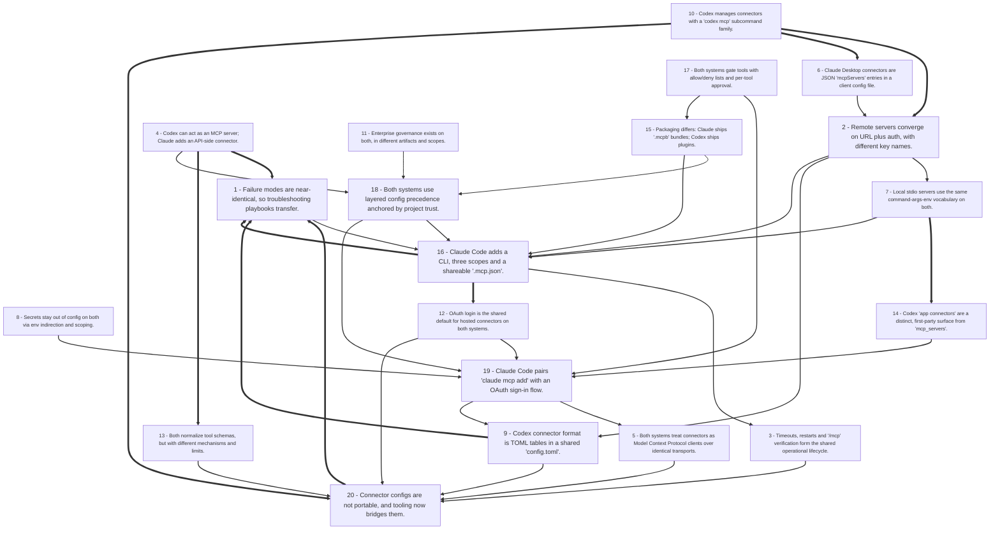

# Title: Across 279 captured sources, Codex and Claude both implement "connectors" as...

## Corpus Quality Scoreboard

Quality: **65/100** - Grade B (Good)

```
[#############-------]  65/100
```

- Critic: review (coverage 100 | evidence 70 | balance 39 | tension 40)
- Sources: 279 gathered | 92 cited | 279 full text | 177 distinct domains | 5.8/8 average relevance
- Cited date span: 2025-2026 (52 undated)
- Contradictions: 14 edges (strongest 50/100)

## Topic

research the format of connectors on both codex and claude, determine what are the common elements between the two systems --no-papers

## Search Queries

- Codex CLI MCP connector configuration format
- Claude Desktop connector MCP configuration format
- Codex connectors JSON schema
- Claude connectors JSON schema
- MCP server config format Codex vs Claude
- Common elements Codex Claude connectors
- OpenAI Codex MCP server config
- Anthropic Claude MCP connector config
- Codex and Claude connector format comparison
- MCP connector specification documentation
- AI coding assistant connector configuration schema
- Codex Claude MCP interoperability
- connector format for AI assistants
- OpenAI Codex and Claude connectors documentation
- MCP server configuration common elements

### Search Engine Summary

| Engine | Pages | PDFs | Videos | Total |
|--------|-------|------|--------|-------|
| exa | 204 | 0 | 0 | 204 |
| langsearch | 25 | 0 | 0 | 25 |
| serper | 26 | 0 | 0 | 26 |
| tavily | 51 | 0 | 0 | 51 |
| wikipedia | 10 | 0 | 0 | 10 |

### Search Provider Requests

| Search Provider | Requests |
|-----------------|----------|
| mf_search | 15 |

## Executive Summary

Across 279 captured sources, Codex and Claude both implement "connectors" as Model Context Protocol (MCP) clients that speak the same JSON-RPC 2.0 protocol over the same two transports — local STDIO child processes and remote Streamable HTTP (with SSE deprecated or unsupported on both sides) — but they express that identical protocol in materially different configuration surfaces: Codex uses TOML tables (`[mcp_servers.<name>]` in `~/.codex/config.toml` or a trusted project's `.codex/config.toml`, managed by `codex mcp add/list/get/remove/login/logout`), while Claude uses JSON (`mcpServers` in `claude_desktop_config.json` for Desktop, `~/.claude.json` / project `.mcp.json` plus `claude mcp add` for Claude Code, and an API-level `mcp_servers` + `mcp_toolset` array for the Messages API) [#1][#21][#26][#50][#124][#160]. The common elements are therefore conceptual rather than syntactic: a named server entry, a transport choice, a stdio command/args/env triple or an HTTP URL plus auth, JSON Schema-described tools that can be allow/deny-listed, per-tool approval semantics, configurable timeouts, scope/precedence rules, OAuth login flows, `/mcp` verification, and enterprise allow-lists [#5][#10][#44][#46][#136][#151]. The most consequential divergence is that Claude additionally supports packaged one-click `.mcpb` Desktop Extensions and API-hosted connectors, whereas Codex bundles servers inside its plugin/marketplace system and wires its own first-party "app connectors" through a ChatGPT backend endpoint [#29][#3][#21][#25][#72]; consequently, portable connector work means porting field vocabulary and auth, not copying files — a gap already being filled by translation tools such as `mcp-sync` [#126][#134].

## Top 10 Implications

1. A single MCP server can serve both Codex and Claude, but its configuration file cannot: teams should treat TOML↔JSON translation, not copy-paste, as the porting step, since the formats are structurally different [#124][#126].
2. The durable common denominator is the field vocabulary (server name, transport, `command`/`args`/`env`, or `url`/headers/auth, plus tool gating), so building against those fields maximizes cross-client reuse [#21][#44][#136].
3. OAuth has become the primary authentication path for hosted connectors on both platforms, with bearer-token or environment-variable indirection as the fallback for headless and stdio cases [#5][#51][#14].
4. Per-tool allow/deny lists plus approval modes are the practical security control on both systems and should be configured deliberately rather than left at defaults [#5][#46][#28].
5. Connector configuration is scope- and precedence-sensitive on both sides, so project-level sharing (Claude's `.mcp.json` versus Codex's project `config.toml` under a trust gate) is where team workflows will diverge most [#50][#128][#15].
6. Because each connected server's tool schemas consume model context, both ecosystems are converging on tool gating and fewer servers (3–5 practical, Codex compacting schemas over 4,000 bytes, Claude offering Tool Search) [#68][#40][#138][#146].
7. Distribution strategy differs: Claude connectors can ship as one-click `.mcpb` extensions or API-side connector entries, while Codex connectors ship as plugin/marketplace artifacts, so a vendor targeting both needs two packaging pipelines [#29][#3][#21].
8. `/mcp` is the shared verification surface on both Codex and Claude Code, making it the one operational command an integrator can rely on across both harnesses [#1][#41][#51].
9. Enterprise governance exists on both but in different artifacts (Codex `requirements.toml` allow-lists versus Claude managed policies and org-level connector enablement), so regulated deployments need parallel policy work rather than one control plane [#5][#136][#97].
10. Failure modes are near-identical in kind — malformed config syntax, PATH/absolute-executable problems, missing env vars, un-restarted clients, headless OAuth failures — so a single troubleshooting playbook transfers between the two systems [#1][#34][#53][#124].

## Open Questions

- There is no normative, field-by-field schema for `[mcp_servers.<name>]` in the sources; what are the exact accepted keys, types, and defaults, and where is the authoritative reference?
- Sources disagree on Codex HTTP support — detailed references document Streamable HTTP [#10][#21] while one comparison claims Codex needs a proxy for HTTP MCP [#123]. Which is current, and from which version?
- Is there a Codex equivalent to Claude Code's project-shareable `.mcp.json` with team-visible, version-controlled connector definitions, or does project-scoped `config.toml` serve the same role under a trust gate only?
- Are Codex `approval_mode` values (`auto`, `prompt`, `approve`) semantically equivalent to Claude's Always allow / Ask / Never, including behavior for destructive tools and in non-interactive runs?
- Where exactly are Claude Code OAuth access and refresh tokens stored on disk? One source explicitly notes this is not confirmed in official docs [#51].
- How do Claude's API-level connector (`mcp_servers` + `mcp_toolset`) and Codex's `config.toml` server list relate — is there any shared registry format, or must vendors maintain two definitions?
- Can `.mcpb` bundles be installed into Codex, or ported, given that Codex packaging is plugin/marketplace-based [#29][#21]?
- What is the real overlap between Codex "app connectors" (`codex_apps`, ChatGPT backend) and user-configured `mcp_servers`, and can an app connector be reused by Claude?
- No source quantifies the token cost of connectors on Codex the way Claude sources do (3–5 servers practical; Tool Search reducing ~72,000 to ~8,700 tokens [#146]); what is Codex's equivalent context overhead per server?
- The Windows MSIX bug that makes Claude Desktop silently ignore configs [#162] has no documented Codex analogue; are there equivalent silent-failure classes on Codex desktop or IDE surfaces?
- Do any sources independently validate round-trip fidelity of third-party config translation tools such as `mcp-sync` [#126] or the Bring Your AI migration CLI [#134]?
- How stable are these formats over time — given `.dxt` → `.mcpb` migration [#29] and Codex's "experimental" `codex mcp add` [#10] — and what is the deprecation policy for connector config keys?

## Data Quality & Consistency

**Overall verdict:** Proceed - the synthesis passes the deterministic 4-critic audit.

| Metric | Value | Detail |
|--------|-------|--------|
| Corpus critic | 65/100 (review) | coverage 100 * evidence 70 * balance 39 * tension 40 |
| Contradictions | 14 edge(s) | strongest = 50/100 |
| Source tensions | 61 tension(s) | 14 contradiction * 6 shallow * 41 isolated |
| Cross-locus reconcile | 1 pair(s) | 2 conflicting edge(s) |
| Synthesis audit | 85/100 (proceed) | 92 source(s) cited |

**Key concerns:**
- Corpus: Dimension 'Adoption' has only moderate support (3 source(s))
- Corpus: Dimension 'Quality' has only moderate support (3 source(s))
- Contradiction: 187 vs 230 - Source #187 and source #230 make opposing claims about performance.
- Contradiction: 123 vs 230 - Source #123 and source #230 make opposing claims about performance.
- Tension (contradiction): performance [#123, #230] - Source #123 and source #230 make opposing claims about performance.
- Tension (contradiction): performance [#142, #230] - Source #142 and source #230 make opposing claims about performance.
- Reconcile: Cost <-> Safety - 2 conflicting edge(s)
- Audit: Synthesis audit for 'research the format of connectors on both codex and claude, determine what are the common elements between the two systems --no-papers' scored 85/100 across critics [coverage=40 logic=100 evidence=100 readability=100]; 92/279 sources cited.

## Concepts

### 1. Cross-Client MCP Configuration and Interoperability
**Definition:** MCP is portable, but client configuration is not: each AI host uses different config files, scopes, commands, and transport fields, so successful use depends on translating among Codex TOML, Claude JSON, Gemini/Qwen variants, and other client-specific setups. Core differences include local versus remote transports, config precedence, and whether servers are shared at user, project, or local scope.

**Key Evidence:**
- Codex uses `~/.codex/config.toml` or trusted project `.codex/config.toml` with `[mcp_servers.<name>]` tables and commands such as `codex mcp add`, `codex mcp list`, and `codex mcp login` [#1][#5][#6][#151].
- Claude Desktop reads `claude_desktop_config.json` with an `mcpServers` object, while Claude Code uses `~/.claude.json`, project `.mcp.json`, and local/project/user scopes [#44][#47][#50][#136].
- Transports are generally stdio for local servers and Streamable HTTP for remote servers, with SSE deprecated; field names differ across clients, such as Codex `url` versus Gemini/Qwen `httpUrl` [#35][#124][#136].

### 2. MCP as Universal Integration Standard
**Definition:** Model Context Protocol is an open client-server standard that connects AI hosts and clients to external servers exposing tools, resources, and prompts, reducing custom M×N integrations to a reusable M+N pattern. It is now widely adopted across Claude, Codex, ChatGPT, Cursor, VS Code, and other MCP-capable clients, with governance moving to the Linux Foundation’s Agentic AI Foundation.

**Key Evidence:**
- MCP was open-sourced by Anthropic in late 2024 and donated to the Linux Foundation’s Agentic AI Foundation in December 2025; OpenAI adopted it in March 2025 and Google in April 2025 [#53][#245][#266].
- Codex supports MCP servers in CLI and IDE via STDIO and Streamable HTTP, with bearer-token or OAuth authentication and shared CLI/IDE configuration [#5][#10][#24].
- Claude Desktop is described as MCP’s first AI host and reference implementation, while Claude Code can act as an MCP client for external tools and databases [#44][#47][#188].

### 3. MCP Server/Connector Ecosystem and Cross-Agent Orchestration
**Definition:** A broad ecosystem of local and remote MCP servers, connectors, and bridges exposes domain-specific tools to AI clients and also lets agents call other agents or CLIs for delegation, review, and handoff. This turns MCP into both an external-tool integration layer and a multi-agent coordination layer.

**Key Evidence:**
- Hosted and remote MCP services include PostEverywhere’s 38-tool social media server [#2], Codex examples such as GitHub, Notion, Linear, Sentry, and Vercel [#1], and Claude connectors such as Slack, Google Drive, GitHub, Linear/Jira, Supabase, and Figma [#97].
- Bridges and plugins enable cross-provider workflows: Codex Bridge exposes `consult_codex` tools to Claude Code, Cursor, and VS Code [#17]; OpenAI released an official Codex plugin for Claude Code [#197][#204]; handoffs use `HANDOFF.md` because Claude Code and Codex keep separate transcript stores [#232].

### 4. Schema-Governed Tool and Output Contracts
**Definition:** JSON Schema and structured-output mechanisms define tool inputs, constrain model outputs, and enable validation, automation, and interoperability across agent workflows. MCP tools themselves expose schemas, while Codex and Claude use schema-constrained generation to reduce malformed or unpredictable responses.

**Key Evidence:**
- Codex `exec --output-schema` reads a JSON Schema file and constrains the final assistant message to a predictable object, as shown by a `status`/`summary`/`next_action` example validated with `jq` [#62]; Codex also compacts unusually large tool schemas using a 4,000-byte budget and depth limit [#68].
- Anthropic structured outputs use constrained decoding through `output_config.format` and `strict: true`, supporting basic types, enums, and `$ref` while rejecting recursive schemas and external references [#100][#103]; strict tool use compiles `input_schema` into grammars to guarantee tool inputs match the schema [#93].
- MCP/agent tool schemas are treated as enforceable fixtures, such as JSON schema policy coverage for Google Calendar, Google Drive, Outlook, and Notion [#74].

### 5. Tool Governance, Permissions, and Security
**Definition:** Because MCP servers run with host or user privileges and may expose sensitive data or write actions, safe deployments require allow/deny lists, approval modes, sandboxing, least-privilege credentials, OAuth, audit logging, and trusted-server vetting. Governance is a configuration-layer and policy-layer concern, not just a model behavior concern.

**Key Evidence:**
- Codex tool governance includes `enabled_tools` allow-lists, `disabled_tools` deny-lists, `default_tools_approval_mode`, and per-tool approval modes; managed environments can enforce a strict MCP allow-list via `requirements.toml` [#5].
- MCP servers execute with the same permissions as the local process, so guidance recommends read-only or development databases, source review, filesystem limits, and environment-variable secrets rather than hardcoded credentials [#143][#148].
- Per-server environment scoping isolates credentials so a compromised server sees only its own minimal env block, while gateways such as PolicyLayer can cap calls, gate tools by arguments, and audit grant/tool/decision records [#34][#131].

## Findings


### **Finding 1** - Failure modes are near-identical, so troubleshooting playbooks transfer.

**Observation:**
Documented failures on both sides include malformed config syntax (TOML section typos silently ignored [#151]; JSON trailing commas and syntax errors [#38][#54]), PATH and absolute-executable problems [#44][#6][#124], missing environment variables or bearer tokens [#1][#46], clients that must be fully restarted [#34][#44], and headless OAuth problems [#1][#51].

**Analysis:**
The symmetry of failure modes is the most practically useful common element, because it means diagnostic intuition transfers even when configuration syntax does not.

Both ecosystems report the same top causes in nearly the same order: syntax validity, executable resolution, credentials, restart, and authorization.

Quantitative evidence supports the scale of the problem — one guide reports that 73% of first-time MCP users hit at least one connection error, most commonly from JSON syntax errors, relative paths, missing `npx`, or missing tokens [#53] — and the same four categories appear on the Codex side as TOML syntax errors, `uvx`/`npx` resolution failures requiring absolute paths, and missing bearer-token env vars [#151][#6][#1].

Both also exhibit "silent" failure classes that are more dangerous than loud ones: Claude Desktop "silently skipped" servers that fail to start [#44], and Codex sections ignored due to typos [#151]; additionally, a known Windows MSIX bug causes Claude Desktop to silently ignore configs written to the expected `%APPDATA%\Claude\` path because the app reads a virtualized location [#162].

Platform-specific hazards also rhyme: Windows path and credential issues patched in Codex v0.

158 [#16] parallel the Windows `${APPDATA}`/ENOENT Claude Desktop issue [#162].

One asymmetry is diagnosis surface: Claude offers dedicated `mcp.log` and per-server log files [#34][#56], while Codex surfaces state through `/mcp`, `codex mcp get --json`, and startup errors [#13][#10].

A layered diagnostic method documented for both clients — client config, server reachability, service authentication, authorization, task validity, changing one layer at a time [#242] — is directly transferable.

**Cross-reference / Dependencies:**
Builds on Findings 2, 3, 7, 8, 11 and 14; complements Finding 16 on portability.

**Implication:**
Adopt a single layered troubleshooting runbook for both clients, prioritize loud failures (validate config, use absolute paths, verify env vars) and explicitly test for silent-skip scenarios such as Windows path virtualization.

**Sources:**
- [1] Codex CLI MCP: Tool Connectivity [Rui Dai] - [https://www.verdent.ai/guides/codex-cli-mcp-setup-guide](https://www.verdent.ai/guides/codex-cli-mcp-setup-guide) (published 2026-05-15)
- [6] Codex CLI - [https://zitniklab.hms.harvard.edu/ToolUniverse/guide/building_ai_scientists/codex_cli.html](https://zitniklab.hms.harvard.edu/ToolUniverse/guide/building_ai_scientists/codex_cli.html)
- [10] MCP integration — wiring tools into Codex · Claw Planet [Sush (Susanth Sutheesh)] - [https://claw.aguidetocloud.com/openai/codex-cli/mcp](https://claw.aguidetocloud.com/openai/codex-cli/mcp) (published 2026-05-15)
- [13] How to add the Docker MCP server to Codex - [https://www.simplified.guide/codex/docker-mcp-server-add](https://www.simplified.guide/codex/docker-mcp-server-add)
- [16] Codex CLI v0.158: MCP OAuth client secrets and approval for elevated commands [@] - [https://dev.to/aicoding-guide/codex-cli-v0158-mcp-oauth-client-secrets-and-approval-for-elevated-commands-52o7](https://dev.to/aicoding-guide/codex-cli-v0158-mcp-oauth-client-secrets-and-approval-for-elevated-commands-52o7) (published 2026-09-30)
- [34] How to Add MCP Servers to Claude Desktop: Config Guide [PolicyLayer, @PolicyLayer] - [https://policylayer.com/integrations/claude-desktop](https://policylayer.com/integrations/claude-desktop)
- [38] How to Set Up MCP Servers - MCPpedia [@MCPpedia] - [https://mcppedia.org/setup](https://mcppedia.org/setup)
- [44] Connect MCP to Claude Desktop | Setup Guide | RapidDev [RapidDev Engineering Team] - [https://www.rapidevelopers.com/mcp-tutorial/how-to-connect-mcp-to-claude-desktop](https://www.rapidevelopers.com/mcp-tutorial/how-to-connect-mcp-to-claude-desktop) (published 2026-03-28)
- [46] MCP Connectors Setup Guide - [https://handsonai.info/builder-setup/mcp-connectors-setup](https://handsonai.info/builder-setup/mcp-connectors-setup)
- [51] to a remote MCP server in Claude Code: /mcp and claude mcp login [@] - [https://dev.to/aicoding-guide/sign-in-to-a-remote-mcp-server-in-claude-code-mcp-and-claude-mcp-login-43i7](https://dev.to/aicoding-guide/sign-in-to-a-remote-mcp-server-in-claude-code-mcp-and-claude-mcp-login-43i7) (published 2026-09-27)
- [53] Claude MCP Setup Guide: Connect Any Tool in 10 Minutes (2026) [Satvik Paramkusam, @buildfastwithai] - [https://blog.buildfastwithai.com/claude-mcp-setup-guide-2026](https://blog.buildfastwithai.com/claude-mcp-setup-guide-2026) (published 2026-05-11)
- [54] Connect MCP Servers to Claude Desktop &amp; Claude Code [MCPgee Team] - [https://www.mcpgee.com/tutorials/claude-integration](https://www.mcpgee.com/tutorials/claude-integration) (published 2026-10-01)
- [56] Connect with Claude (Desktop/web) [Aembit] - [https://docs.aembit.io/user-guide/mcp-server/connect/claude-desktop](https://docs.aembit.io/user-guide/mcp-server/connect/claude-desktop)
- [124] How to Add an MCP Server to Any AI Coding CLI (Claude Code, Codex, Gemini, Qwen, Oh My Pi) [Sean] - [https://inventivehq.com/blog/add-mcp-server-to-ai-coding-cli](https://inventivehq.com/blog/add-mcp-server-to-ai-coding-cli) (published 2026-06-10)
- [151] OpenAI Codex MCP Setup: config.toml Configuration Guide [PolicyLayer, @PolicyLayer] - [https://policylayer.com/integrations/codex](https://policylayer.com/integrations/codex)
- [162] How to Configure MCP Servers in Claude Desktop | MESA Blog - [https://www.getmesa.com/blog/configure-mcp-servers-claude-desktop](https://www.getmesa.com/blog/configure-mcp-servers-claude-desktop) (published 2026-08-21)
- [242] Fix Claude Code or Codex WordPress Access - [https://wpagentcontrol.com/ai-wordpress/troubleshooting/troubleshoot-claude-code-codex-wordpress-access](https://wpagentcontrol.com/ai-wordpress/troubleshooting/troubleshoot-claude-code-codex-wordpress-access) (published 2026-09-10)

**Source date range:** 2026-03-28..2026-10-01 (10 of 17 cited web sources dated)


### **Finding 2** - Remote servers converge on URL plus auth, with different key names.

**Observation:**
Codex remote servers use `url` with `bearer_token_env_var`, `http_headers`, and `env_http_headers` [#1][#21][#151]; Claude Code uses `url` plus `headers` and OAuth fields [#141][#136], while other clients in the same family use `httpUrl` instead of `url` [#124].

**Analysis:**
The HTTP configuration path shows both convergence and a naming trap.

Functionally, `codex mcp add squirrelscan --url https://mcp.squirrelscan.com/mcp` and `claude mcp add --transport http hubspot https://mcp.hubspot.com/anthropic` express the same intent — bind a named remote MCP endpoint — and both support adding an authorization header or bearer token from an environment variable so the secret never lands in the config file [#9][#168][#151].

The documented divergence is in field names and structure: Codex separates the secret *source* (`bearer_token_env_var`) from literal headers (`http_headers`), whereas Claude Code merges headers and adds an `oauth` block; and a widely cited cross-CLI reference warns that "the HTTP field is `url` in Claude Code/Codex/OMP but `httpUrl` in Gemini/Qwen, a common copy-paste error" [#124].

Claude Desktop historically could not take a remote URL directly in the config and needed `mcp-remote` as a bridge [#26][#39], though newer Custom Connectors remove that need [#43][#46].

There is also an explicit "mixed transport" failure mode on Codex where a stdio command combined with a URL produces a "not supported for stdio" error [#151].

Taken together, remote connector portability requires translating three things: the key name (`url` vs `httpUrl`), the auth representation (env-var name vs header vs OAuth block), and the reachability assumption (whether the client connects from the user's machine or from a vendor cloud, as with Claude's custom connectors that "connect from Anthropic's cloud" and therefore require public reachability) [#41][#165].

**Cross-reference / Dependencies:**
Parallels Finding 7 for stdio; feeds Finding 9 on OAuth and Finding 16 on portability.

**Implication:**
Standardize on `url` plus an environment-referenced bearer token for maximum cross-client compatibility, and treat Claude's cloud-originated custom connectors as requiring public, non-firewalled endpoints.

**Sources:**
- [1] Codex CLI MCP: Tool Connectivity [Rui Dai] - [https://www.verdent.ai/guides/codex-cli-mcp-setup-guide](https://www.verdent.ai/guides/codex-cli-mcp-setup-guide) (published 2026-05-15)
- [9] Let Codex CLI audit and fix your website [squirrelscan, @squirrelscan_] - [https://squirrelscan.com/for/codex](https://squirrelscan.com/for/codex) (published 2026-01-01)
- [21] mcp.md — Spybara - [https://spybara.com/openai/codex/history/docs/en/2026-06-19-2357..2026-06-20-0358/mcp](https://spybara.com/openai/codex/history/docs/en/2026-06-19-2357..2026-06-20-0358/mcp)
- [26] Claude Desktop MCP Configuration Guide | Cequence AI Gateway - [https://docs.aigateway.cequence.ai/docs/client-config/claude-desktop](https://docs.aigateway.cequence.ai/docs/client-config/claude-desktop) (published 2026-03-12)
- [39] Claude Desktop Setup - Hyperstack Docs - [https://docs.hyperstack.cloud/docs/libraries/mcp-server/claude-desktop-setup](https://docs.hyperstack.cloud/docs/libraries/mcp-server/claude-desktop-setup)
- [41] How to Connect &amp; Use MCP with Claude: 4 Ways to Add Connectors [Using Claude Editorial Team] - [https://usingclaude.com/en/claude-code/mcp/how-to-connect-mcp](https://usingclaude.com/en/claude-code/mcp/how-to-connect-mcp) (published 2026-06-02)
- [43] How to Set Up MCP in Claude Desktop (Complete 2026 Guide) [Nikhil Tiwari] - [https://mcpplaygroundonline.com/blog/how-to-setup-mcp-claude-desktop](https://mcpplaygroundonline.com/blog/how-to-setup-mcp-claude-desktop) (published 2026-01-12)
- [46] MCP Connectors Setup Guide - [https://handsonai.info/builder-setup/mcp-connectors-setup](https://handsonai.info/builder-setup/mcp-connectors-setup)
- [124] How to Add an MCP Server to Any AI Coding CLI (Claude Code, Codex, Gemini, Qwen, Oh My Pi) [Sean] - [https://inventivehq.com/blog/add-mcp-server-to-ai-coding-cli](https://inventivehq.com/blog/add-mcp-server-to-ai-coding-cli) (published 2026-06-10)
- [136] Model Context Protocol | Claude Code Guide [[https://patrykgolabek.dev/about/](https://patrykgolabek.dev/about/)] - [https://patrykgolabek.dev/guides/claude-code/mcp](https://patrykgolabek.dev/guides/claude-code/mcp) (published 2026-03-15)
- [141] Six ${VAR} forms, five .mcp.json fields, two tiny servers: what Claude Code MCP expansion actually produced [@] - [https://dev.to/rulestack/six-var-forms-five-mcpjson-fields-two-tiny-servers-what-claude-code-mcp-expansion-actually-5a1f](https://dev.to/rulestack/six-var-forms-five-mcpjson-fields-two-tiny-servers-what-claude-code-mcp-expansion-actually-5a1f)
- [151] OpenAI Codex MCP Setup: config.toml Configuration Guide [PolicyLayer, @PolicyLayer] - [https://policylayer.com/integrations/codex](https://policylayer.com/integrations/codex)
- [165] Anthropic MCP Connector: How Claude Authenticates to Remote Tools Without Local MCP Setup - Marketing Scoop - [https://www.marketingscoop.com/ai/anthropic-mcp-connector-how-claude-authenticates-to-remote-tools-without-local-mcp-setup](https://www.marketingscoop.com/ai/anthropic-mcp-connector-how-claude-authenticates-to-remote-tools-without-local-mcp-setup) (published 2026-05-03)
- [168] HubSpot MCP Server — MCP server config &amp; setup - [https://mcptrove.com/server/hubspot-mcp](https://mcptrove.com/server/hubspot-mcp)

**Source date range:** 2026-01-01..2026-06-10 (8 of 14 cited web sources dated)


### **Finding 3** - Timeouts, restarts and `/mcp` verification form the shared operational lifecycle.

**Observation:**
Codex defaults to 10-second startup and 60-second per-tool timeouts, overridable via `startup_timeout_sec` and `tool_timeout_sec` [#1][#21][#24], while Claude Desktop reads config only at startup and requires a full quit/relaunch [#34][#44]; both expose `/mcp` to list active servers, tools, and startup errors [#1][#6][#41][#51].

**Analysis:**
The operational surface is where the two systems feel most interchangeable to a daily user, and where the shared vocabulary is most actionable. `/mcp` appears identically in Codex TUI documentation ("shows active servers, tools, and startup errors" [#10]; "run `/mcp` in Codex to confirm the server is listed" [#6]) and in Claude Code guidance ("`/mcp` for 401/403 errors" [#41]; authenticate via `/mcp` → Authenticate [#51]), making it the one command a cross-platform integrator can rely on across both harnesses.

Timeout handling is less symmetric: Codex publishes explicit numeric defaults and named override keys, including the practical note that slow `npx` cold starts are fixed by raising `startup_timeout_sec` [#151], whereas Claude's documented equivalent is the `MCP_TIMEOUT` setting surfaced in Claude Code guidance along with `MAX_MCP_OUTPUT_TOKENS` and a 10,000-token warning with a 25,000-token default output cap [#161][#136].

Claude Desktop compensates with logs rather than timeouts — `mcp.log` and per-server `mcp-server-NAME.log` files under `~/Library/Logs/Claude/` or `%APPDATA%\Claude\logs\` [#34][#56] — while Codex surfaces startup errors in `/mcp` and via `codex mcp get --json` [#13].

The asymmetry means cross-platform debugging checklists must branch: timeout tuning on Codex, log inspection and full restarts on Claude.

**Cross-reference / Dependencies:**
Depends on Findings 2, 3 and 5; overlaps Finding 20.

**Implication:**
Bake `/mcp` into onboarding runbooks for both clients, pre-emptively raise Codex startup timeouts for `npx`/`uvx` servers, and set explicit output-token caps on the Claude side to prevent context blowups.

**Sources:**
- [1] Codex CLI MCP: Tool Connectivity [Rui Dai] - [https://www.verdent.ai/guides/codex-cli-mcp-setup-guide](https://www.verdent.ai/guides/codex-cli-mcp-setup-guide) (published 2026-05-15)
- [6] Codex CLI - [https://zitniklab.hms.harvard.edu/ToolUniverse/guide/building_ai_scientists/codex_cli.html](https://zitniklab.hms.harvard.edu/ToolUniverse/guide/building_ai_scientists/codex_cli.html)
- [10] MCP integration — wiring tools into Codex · Claw Planet [Sush (Susanth Sutheesh)] - [https://claw.aguidetocloud.com/openai/codex-cli/mcp](https://claw.aguidetocloud.com/openai/codex-cli/mcp) (published 2026-05-15)
- [13] How to add the Docker MCP server to Codex - [https://www.simplified.guide/codex/docker-mcp-server-add](https://www.simplified.guide/codex/docker-mcp-server-add)
- [21] mcp.md — Spybara - [https://spybara.com/openai/codex/history/docs/en/2026-06-19-2357..2026-06-20-0358/mcp](https://spybara.com/openai/codex/history/docs/en/2026-06-19-2357..2026-06-20-0358/mcp)
- [24] Model Context Protocol - [https://dev-docs.moodybeard.com/en/codex/mcp](https://dev-docs.moodybeard.com/en/codex/mcp)
- [34] How to Add MCP Servers to Claude Desktop: Config Guide [PolicyLayer, @PolicyLayer] - [https://policylayer.com/integrations/claude-desktop](https://policylayer.com/integrations/claude-desktop)
- [41] How to Connect &amp; Use MCP with Claude: 4 Ways to Add Connectors [Using Claude Editorial Team] - [https://usingclaude.com/en/claude-code/mcp/how-to-connect-mcp](https://usingclaude.com/en/claude-code/mcp/how-to-connect-mcp) (published 2026-06-02)
- [44] Connect MCP to Claude Desktop | Setup Guide | RapidDev [RapidDev Engineering Team] - [https://www.rapidevelopers.com/mcp-tutorial/how-to-connect-mcp-to-claude-desktop](https://www.rapidevelopers.com/mcp-tutorial/how-to-connect-mcp-to-claude-desktop) (published 2026-03-28)
- [51] to a remote MCP server in Claude Code: /mcp and claude mcp login [@] - [https://dev.to/aicoding-guide/sign-in-to-a-remote-mcp-server-in-claude-code-mcp-and-claude-mcp-login-43i7](https://dev.to/aicoding-guide/sign-in-to-a-remote-mcp-server-in-claude-code-mcp-and-claude-mcp-login-43i7) (published 2026-09-27)
- [56] Connect with Claude (Desktop/web) [Aembit] - [https://docs.aembit.io/user-guide/mcp-server/connect/claude-desktop](https://docs.aembit.io/user-guide/mcp-server/connect/claude-desktop)
- [136] Model Context Protocol | Claude Code Guide [[https://patrykgolabek.dev/about/](https://patrykgolabek.dev/about/)] - [https://patrykgolabek.dev/guides/claude-code/mcp](https://patrykgolabek.dev/guides/claude-code/mcp) (published 2026-03-15)
- [151] OpenAI Codex MCP Setup: config.toml Configuration Guide [PolicyLayer, @PolicyLayer] - [https://policylayer.com/integrations/codex](https://policylayer.com/integrations/codex)
- [161] How to Use MCP with Claude Code, Desktop & claude.ai — Scalar - [https://scalar.com/learn/mcp/connect-mcp-server-to-claude](https://scalar.com/learn/mcp/connect-mcp-server-to-claude)

**Source date range:** 2026-03-15..2026-09-27 (6 of 14 cited web sources dated)


### **Finding 4** - Codex can act as an MCP server; Claude adds an API-side connector.

**Observation:**
Codex exposes itself as a server via `codex mcp-server`, presenting `codex` and `codex-reply` tools and using `structuredContent.threadId` for multi-turn continuation [#5][#10], while community servers wrap the Codex CLI for other clients [#121][#198]; Anthropic's MCP connector instead lets the Messages API connect directly to remote MCP servers using an `mcp_servers` array plus one `MCPToolset` per server, with no separate client [#33][#160].

**Analysis:**
Both ecosystems have inverted the client/server relationship in ways that broaden what "connector" means, but they chose different inversion points.

Codex's inversion is bidirectional and same-tool: the same binary that consumes MCP servers can publish itself as one, so Claude Code or Cursor can delegate work to Codex through MCP wrappers such as `@cexll/codex-mcp-server`, `@nayagamez/codex-cli-mcp`, and `tuannvm/codex-mcp-server`, each exposing tools like `ask-codex`, `codex`, `review`, and `brainstorm` with `threadId` continuation [#121][#145][#152][#198].

Claude's inversion is platform-level: the API itself becomes the MCP client, with `mcp_servers` declaring URL and auth and `mcp_toolset` declaring which tools are enabled, plus documented response block types `mcp_tool_use` and `mcp_tool_result` [#33][#160][#164].

The consequences differ.

Codex-as-server gives teams a cross-provider delegation path — several sources describe Claude writing and Codex reviewing, or vice versa, via MCP [#197][#204][#235] — but requires an authenticated local Codex CLI and adds latency (reported ~6–12 seconds for Codex versus ~4 seconds for Claude Code in one harness benchmark) [#102].

Claude's API connector removes the local client entirely but restricts servers to publicly reachable HTTPS Streamable HTTP or SSE endpoints, excludes local STDIO, and is explicitly not ZDR-eligible [#160][#164][#165].

So the two systems converge on "MCP in both directions" while diverging on which direction is productized.

**Cross-reference / Dependencies:**
Builds on Finding 1; relates to Finding 13 on packaging and Finding 18 on app connectors.

**Implication:**
Teams wanting cross-provider delegation should standardize on `threadId`-based Codex wrapper servers, while teams wanting serverless connector use should evaluate Claude's API connector and accept its public-endpoint and retention constraints.

**Sources:**
- [5] MCP in Codex: Client, Server &amp; Tool Governance [Hussam Ahmed] - [https://hussamahmed.com/ai/codex/codex-mcp](https://hussamahmed.com/ai/codex/codex-mcp) (published 2026-06-13)
- [10] MCP integration — wiring tools into Codex · Claw Planet [Sush (Susanth Sutheesh)] - [https://claw.aguidetocloud.com/openai/codex-cli/mcp](https://claw.aguidetocloud.com/openai/codex-cli/mcp) (published 2026-05-15)
- [33] MCP connector - [https://platform.claude.com/docs/en/agents-and-tools/mcp-connector](https://platform.claude.com/docs/en/agents-and-tools/mcp-connector)
- [102] GitHub - Arcanada-one/model-connector - [https://github.com/Arcanada-one/model-connector](https://github.com/Arcanada-one/model-connector)
- [121] GitHub - cexll/codex-mcp-server: Codex Mcp Server - [https://github.com/cexll/codex-mcp-server](https://github.com/cexll/codex-mcp-server)
- [145] GitHub - etheaven/codex-mcp-server: Codex Mcp Server - [https://github.com/etheaven/codex-mcp-server](https://github.com/etheaven/codex-mcp-server)
- [152] codex-cli-mcp by nayagamez - [https://glama.ai/mcp/servers/nayagamez/codex-cli-mcp](https://glama.ai/mcp/servers/nayagamez/codex-cli-mcp)
- [160] The Claude API MCP connector — MCP Step by Step [MCP Step by Step] - [https://mcpstepbystep.com/learn/claude-api-mcp-connector](https://mcpstepbystep.com/learn/claude-api-mcp-connector)
- [164] MCP connector — Claude API Docs - [https://doc.jarvisuni.com/claude/api/en/agents-and-tools/mcp-connector.html](https://doc.jarvisuni.com/claude/api/en/agents-and-tools/mcp-connector.html)
- [165] Anthropic MCP Connector: How Claude Authenticates to Remote Tools Without Local MCP Setup - Marketing Scoop - [https://www.marketingscoop.com/ai/anthropic-mcp-connector-how-claude-authenticates-to-remote-tools-without-local-mcp-setup](https://www.marketingscoop.com/ai/anthropic-mcp-connector-how-claude-authenticates-to-remote-tools-without-local-mcp-setup) (published 2026-05-03)
- [197] What Is the OpenAI Codex Plugin for Claude Code? How Cross-Provider AI Review Works [Luis Chavez-Mattos] - [https://www.mindstudio.ai/blog/openai-codex-plugin-claude-code-cross-provider-review](https://www.mindstudio.ai/blog/openai-codex-plugin-claude-code-cross-provider-review) (published 2026-04-01)
- [198] GitHub - tuannvm/codex-mcp-server: MCP server wrapper for OpenAI Codex CLI that enables Claude Code to leverage... - [https://github.com/tuannvm/codex-mcp-server](https://github.com/tuannvm/codex-mcp-server)
- [204] OpenAI Codex Now Works Inside Claude Code [Sabaoon, @Sab_gfx] - [https://www.sabaoon.dev/blog/openai-codex-inside-claude-code](https://www.sabaoon.dev/blog/openai-codex-inside-claude-code) (published 2026-04-23)
- [235] GitHub - Kenmege/codex-claude-companion: Codex-native Claude review plugin for read-only, evidence-cited Opus review... - [https://github.com/Kenmege/codex-claude-companion](https://github.com/Kenmege/codex-claude-companion)

**Source date range:** 2026-04-01..2026-06-13 (5 of 14 cited web sources dated)


### **Finding 5** - Both systems treat connectors as Model Context Protocol clients over identical transports.

**Observation:**
Codex supports MCP servers in CLI and IDE via STDIO (local child process) and Streamable HTTP, explicitly *not* the older HTTP+SSE transport [#5][#10][#21]. Claude Desktop supports local stdio servers plus remote Streamable HTTP Custom Connectors, and sources state it lacks native SSE support, requiring an `mcp-remote` bridge [#40][#41]; Claude Code supports stdio and HTTP with SSE deprecated as of April 2026 [##53][#136].

**Analysis:**
The protocol layer is the true common element between the two connector ecosystems, and it is a strong one: both expose the same primitives (tools, resources, prompts), the same message format (JSON-RPC 2.

0), and the same two sanctioned transports, with SSE being actively retired on both sides [#124][#53][#245].

That means a server built once for one harness is functionally reachable from the other, and sources confirm real-world cross-vendor reuse — Codex documentation itself notes "cross-vendor reuse is possible across Claude Code, Cursor, and VS Code GitHub Copilot" [#10], while numerous connectors publish Codex, Claude Code, and Claude Desktop setup side by side [#139][#125][#220].

What does *not* transfer is the client-side configuration, which is where all the divergence documented in later findings lives.

The practical consequence is that interoperability claims should be scoped precisely: protocol-level portability is well evidenced (multiple independent connector vendors document both clients), whereas configuration-level portability is not, and one source even claims Codex "supports stdio-based MCPs but lacks direct HTTP MCP support, requiring a proxy" [#123], which contradicts the more detailed Codex transport documentation [#10][#21] and likely reflects staleness or client confusion rather than fact.

This contradiction is itself a useful signal: because both platforms evolve quickly, transport claims in third-party comparison content are less reliable than the first-party-derived config references.

**Cross-reference / Dependencies:**
Prerequisite for Findings 2, 3, 7, 8 and 20; partially contradicted by evidence cited in Finding 20.

**Implication:**
Treat MCP as the portability layer and the config file as the porting cost; validate transport support against each client's own current config reference rather than comparison blog posts.

**Sources:**
- [5] MCP in Codex: Client, Server &amp; Tool Governance [Hussam Ahmed] - [https://hussamahmed.com/ai/codex/codex-mcp](https://hussamahmed.com/ai/codex/codex-mcp) (published 2026-06-13)
- [10] MCP integration — wiring tools into Codex · Claw Planet [Sush (Susanth Sutheesh)] - [https://claw.aguidetocloud.com/openai/codex-cli/mcp](https://claw.aguidetocloud.com/openai/codex-cli/mcp) (published 2026-05-15)
- [21] mcp.md — Spybara - [https://spybara.com/openai/codex/history/docs/en/2026-06-19-2357..2026-06-20-0358/mcp](https://spybara.com/openai/codex/history/docs/en/2026-06-19-2357..2026-06-20-0358/mcp)
- [40] Claude Desktop MCP: Transport Support, Extensions, Limits (2026) - [https://mcpverdict.com/mcp/clients/claude-desktop](https://mcpverdict.com/mcp/clients/claude-desktop) (published 2026-06-28)
- [41] How to Connect &amp; Use MCP with Claude: 4 Ways to Add Connectors [Using Claude Editorial Team] - [https://usingclaude.com/en/claude-code/mcp/how-to-connect-mcp](https://usingclaude.com/en/claude-code/mcp/how-to-connect-mcp) (published 2026-06-02)
- [53] Claude MCP Setup Guide: Connect Any Tool in 10 Minutes (2026) [Satvik Paramkusam, @buildfastwithai] - [https://blog.buildfastwithai.com/claude-mcp-setup-guide-2026](https://blog.buildfastwithai.com/claude-mcp-setup-guide-2026) (published 2026-05-11)
- [123] Claude Code vs Codex: Dev Workflow Comparison [@RohittCodes] - [https://dev.to/composiodev/claude-code-vs-codex-dev-workflow-comparison-4jjf](https://dev.to/composiodev/claude-code-vs-codex-dev-workflow-comparison-4jjf) (published 2025-09-15)
- [124] How to Add an MCP Server to Any AI Coding CLI (Claude Code, Codex, Gemini, Qwen, Oh My Pi) [Sean] - [https://inventivehq.com/blog/add-mcp-server-to-ai-coding-cli](https://inventivehq.com/blog/add-mcp-server-to-ai-coding-cli) (published 2026-06-10)
- [125] GitHub - alchemyplatform/alchemy-mcp-server: Alchemy&#39;s official MCP Server. Allow AI agents to interact with... - [https://github.com/alchemyplatform/alchemy-mcp-server](https://github.com/alchemyplatform/alchemy-mcp-server)
- [136] Model Context Protocol | Claude Code Guide [[https://patrykgolabek.dev/about/](https://patrykgolabek.dev/about/)] - [https://patrykgolabek.dev/guides/claude-code/mcp](https://patrykgolabek.dev/guides/claude-code/mcp) (published 2026-03-15)
- [139] Add Notion MCP Locally: Three Steps for Claude Code, Codex, and Antigravity [Wells] - [https://wellstsai.com/en/post/add-local-mcp-notion](https://wellstsai.com/en/post/add-local-mcp-notion) (published 2026-09-14)
- [220] How to Monitor Websites from Claude Code (and Codex) [Eric Do Couto] - [https://visualping.io/blog/monitor-websites-from-claude-code-and-codex](https://visualping.io/blog/monitor-websites-from-claude-code-and-codex) (published 2026-05-27)
- [245] What Is the Model Context Protocol (MCP) and How It Works - [https://www.descope.com/learn/post/mcp](https://www.descope.com/learn/post/mcp)

**Source date range:** 2025-09-15..2026-09-14 (10 of 13 cited web sources dated)


### **Finding 6** - Claude Desktop connectors are JSON `mcpServers` entries in a client config file.

**Observation:**
Claude Desktop is configured by editing `claude_desktop_config.json` — at `~/Library/Application Support/Claude/` on macOS, `%APPDATA%\Claude\` on Windows, and `~/.config/Claude/` on Linux — using an `mcpServers` map whose entries specify `command`, `args`, and optional `env`, or `url` for remote Streamable HTTP servers [#26][#43][#44][#48].

**Analysis:**
Claude Desktop's format is the older, narrower counterpart to Codex's TOML: a JSON object rooted at `mcpServers`, whose entries are almost entirely about process launch (`command`, `args`, `env`) or a remote `url` [#54][#138][#275].

This produces three characteristic behaviors documented across sources.

The client reads config only at startup, so edits require a full quit and relaunch rather than a window close [#34][#45][#162].

Servers that fail to start are "silently skipped" [#44], which combined with minimal PATH inheritance means absolute executable paths and `.env` handling become the dominant troubleshooting topics, alongside JSON syntax errors [#44][#54][#6].

And because the file is a per-user, per-machine artifact, remote servers cannot be placed there directly in some configurations and require `mcp-remote` as a stdio-to-HTTP bridge [#26][#39][#162].

Compared with Codex, the Claude Desktop schema is more constrained (no documented per-tool gating keys in the file itself; those live in the UI as Always allow/Ask/Never [#46]) and lacks documented timeout overrides, with operators instead restarting and inspecting `mcp.log` files [#34][#162].

The evidence limitation is that Anthropic has layered newer mechanisms — Custom Connectors, Desktop Extensions, org settings — above this file, so its importance is declining even as its format remains the lowest common denominator.

**Cross-reference / Dependencies:**
Contrasts with Finding 2; superseded in part by Findings 4, 13 and 18.

**Implication:**
For Claude Desktop, budget for a restart cycle per config change and prefer Custom Connectors or `.mcpb` extensions over hand-edited JSON where the server is publicly reachable or already packaged.

**Sources:**
- [6] Codex CLI - [https://zitniklab.hms.harvard.edu/ToolUniverse/guide/building_ai_scientists/codex_cli.html](https://zitniklab.hms.harvard.edu/ToolUniverse/guide/building_ai_scientists/codex_cli.html)
- [26] Claude Desktop MCP Configuration Guide | Cequence AI Gateway - [https://docs.aigateway.cequence.ai/docs/client-config/claude-desktop](https://docs.aigateway.cequence.ai/docs/client-config/claude-desktop) (published 2026-03-12)
- [34] How to Add MCP Servers to Claude Desktop: Config Guide [PolicyLayer, @PolicyLayer] - [https://policylayer.com/integrations/claude-desktop](https://policylayer.com/integrations/claude-desktop)
- [39] Claude Desktop Setup - Hyperstack Docs - [https://docs.hyperstack.cloud/docs/libraries/mcp-server/claude-desktop-setup](https://docs.hyperstack.cloud/docs/libraries/mcp-server/claude-desktop-setup)
- [43] How to Set Up MCP in Claude Desktop (Complete 2026 Guide) [Nikhil Tiwari] - [https://mcpplaygroundonline.com/blog/how-to-setup-mcp-claude-desktop](https://mcpplaygroundonline.com/blog/how-to-setup-mcp-claude-desktop) (published 2026-01-12)
- [44] Connect MCP to Claude Desktop | Setup Guide | RapidDev [RapidDev Engineering Team] - [https://www.rapidevelopers.com/mcp-tutorial/how-to-connect-mcp-to-claude-desktop](https://www.rapidevelopers.com/mcp-tutorial/how-to-connect-mcp-to-claude-desktop) (published 2026-03-28)
- [45] Claude Desktop MCP Setup: Connectors and the Config File [@tryamie] - [https://amie.so/mcp/claude-desktop](https://amie.so/mcp/claude-desktop)
- [46] MCP Connectors Setup Guide - [https://handsonai.info/builder-setup/mcp-connectors-setup](https://handsonai.info/builder-setup/mcp-connectors-setup)
- [48] Octave | How to Set Up MCP Servers in Claude Desktop (Complete Guide) [Guest] - [https://www.octavehq.com/post/how-to-set-up-mcp-servers-in-claude-desktop-complete-guide](https://www.octavehq.com/post/how-to-set-up-mcp-servers-in-claude-desktop-complete-guide) (published 2026-02-25)
- [54] Connect MCP Servers to Claude Desktop &amp; Claude Code [MCPgee Team] - [https://www.mcpgee.com/tutorials/claude-integration](https://www.mcpgee.com/tutorials/claude-integration) (published 2026-10-01)
- [138] Claude Code MCP Servers: The Complete Setup Guide for 2026 — The Prompt Shelf [The Prompt Shelf] - [https://thepromptshelf.dev/blog/claude-code-mcp-setup-guide](https://thepromptshelf.dev/blog/claude-code-mcp-setup-guide)
- [162] How to Configure MCP Servers in Claude Desktop | MESA Blog - [https://www.getmesa.com/blog/configure-mcp-servers-claude-desktop](https://www.getmesa.com/blog/configure-mcp-servers-claude-desktop) (published 2026-08-21)
- [275] Config Schema - MetaMCP - [https://metamcp.org/reference/config-schema](https://metamcp.org/reference/config-schema)

**Source date range:** 2026-01-12..2026-10-01 (6 of 13 cited web sources dated)


### **Finding 7** - Local stdio servers use the same command-args-env vocabulary on both.

**Observation:**
Codex `[mcp_servers.<name>]` accepts `command`, `args`, `env`, `env_vars`, and `cwd` [#21][#24], while Claude entries use `command`, `args`, and `env` in `claude_desktop_config.json` and the equivalent `--env`/JSON fields in Claude Code [#44][#54][#131].

**Analysis:**
This is the most directly portable configuration fragment between the two systems and the reason cross-client connectors are feasible at all: a command such as `npx -y @modelcontextprotocol/server-filesystem` or `uvx mcp-obsidian` can appear nearly verbatim in a Codex TOML table and a Claude JSON object [#43][#274][#6].

The residual differences are meaningful rather than cosmetic.

Codex documents `env_vars` in addition to `env`, plus per-server environment targeting emphasized in later CLI releases [#21][#177], whereas Claude Code documents environment expansion in `.mcp.json` with the constraint that "`env` values are literal strings with no shell expansion" in some configurations [#137] and, elsewhere, that `${VAR}` and `${VAR:-default}` expand across all five documented fields while bare `$VAR` never does and nested defaults resolve only in headers [#141].

Claude Desktop, by contrast, has been described as requiring the OS environment or literal values and hit `${APPDATA}`/ENOENT problems on Windows [#162].

Per-server credential isolation — spawning each server with a minimal env block — exists on both, with Claude Code's `.mcp.json`/`claude mcp add --env` and Codex's `mcp_servers..env` both cited as supported knobs [#131].

The shared lesson is that the launch triple is portable but secret plumbing is not, and the difference between "expands the variable" and "passes the literal string" is the single most common silent misconfiguration.

**Cross-reference / Dependencies:**
Depends on Findings 1, 2 and 3; prerequisite to Finding 14 on secrets and Finding 16 on portability.

**Implication:**
When porting a stdio server, re-verify environment expansion semantics per client rather than assuming `${VAR}` behaves identically, and prefer explicit per-server env blocks over inherited process environments.

**Sources:**
- [6] Codex CLI - [https://zitniklab.hms.harvard.edu/ToolUniverse/guide/building_ai_scientists/codex_cli.html](https://zitniklab.hms.harvard.edu/ToolUniverse/guide/building_ai_scientists/codex_cli.html)
- [21] mcp.md — Spybara - [https://spybara.com/openai/codex/history/docs/en/2026-06-19-2357..2026-06-20-0358/mcp](https://spybara.com/openai/codex/history/docs/en/2026-06-19-2357..2026-06-20-0358/mcp)
- [24] Model Context Protocol - [https://dev-docs.moodybeard.com/en/codex/mcp](https://dev-docs.moodybeard.com/en/codex/mcp)
- [43] How to Set Up MCP in Claude Desktop (Complete 2026 Guide) [Nikhil Tiwari] - [https://mcpplaygroundonline.com/blog/how-to-setup-mcp-claude-desktop](https://mcpplaygroundonline.com/blog/how-to-setup-mcp-claude-desktop) (published 2026-01-12)
- [44] Connect MCP to Claude Desktop | Setup Guide | RapidDev [RapidDev Engineering Team] - [https://www.rapidevelopers.com/mcp-tutorial/how-to-connect-mcp-to-claude-desktop](https://www.rapidevelopers.com/mcp-tutorial/how-to-connect-mcp-to-claude-desktop) (published 2026-03-28)
- [54] Connect MCP Servers to Claude Desktop &amp; Claude Code [MCPgee Team] - [https://www.mcpgee.com/tutorials/claude-integration](https://www.mcpgee.com/tutorials/claude-integration) (published 2026-10-01)
- [131] Per-Server MCP Environment Scoping for Credential Isolation — AgentPatterns.ai - [https://www.agentpatterns.ai/security/mcp-server-credential-isolation](https://www.agentpatterns.ai/security/mcp-server-credential-isolation) (published 2026-10-02)
- [137] Claude Code MCP Configuration (2026) [Michael Lip, @Michael Lip] - [https://claudecodeguides.com/claude-code-mcp-configuration-guide](https://claudecodeguides.com/claude-code-mcp-configuration-guide) (published 2026-04-20)
- [141] Six ${VAR} forms, five .mcp.json fields, two tiny servers: what Claude Code MCP expansion actually produced [@] - [https://dev.to/rulestack/six-var-forms-five-mcpjson-fields-two-tiny-servers-what-claude-code-mcp-expansion-actually-5a1f](https://dev.to/rulestack/six-var-forms-five-mcpjson-fields-two-tiny-servers-what-claude-code-mcp-expansion-actually-5a1f)
- [162] How to Configure MCP Servers in Claude Desktop | MESA Blog - [https://www.getmesa.com/blog/configure-mcp-servers-claude-desktop](https://www.getmesa.com/blog/configure-mcp-servers-claude-desktop) (published 2026-08-21)
- [177] Claude Code vs OpenAI Codex CLI: Agent Runtime Governance in 2026 [Context Studios, @_contextstudios] - [https://www.contextstudios.ai/comparisons/claude-code-vs-openai-codex-cli](https://www.contextstudios.ai/comparisons/claude-code-vs-openai-codex-cli) (published 2026-02-13)
- [274] mcp-obsidian MCP Server [Matvey Kukuy, Ildar Iskhakov, Joey Orlando] - [https://archestra.ai/mcp-catalog/markuspfundstein__mcp-obsidian](https://archestra.ai/mcp-catalog/markuspfundstein__mcp-obsidian)

**Source date range:** 2026-01-12..2026-10-02 (7 of 12 cited web sources dated)


### **Finding 8** - Secrets stay out of config on both via env indirection and scoping.

**Observation:**
Codex remote servers reference secrets indirectly through `bearer_token_env_var` [#1][#151], and Codex supports per-server `env` blocks for stdio servers [#131]; Claude Code supports `${VAR}` and `${VAR:-default}` expansion across `command`, `args`, `env`, `url`, and `headers` in `.mcp.json` [#141][#149], with per-server environment scoping documented for both clients [#131].

**Analysis:**
Credential handling is a genuine common element at the design level and a genuine divergence in mechanics, and the details matter because misconfiguration here is silent.

Both systems' documented best practice is identical: never hardcode tokens in the config, reference environment variables or a secrets manager, and scope each server to only the credentials it needs so a compromised server's blast radius is bounded [#131][#244][#129].

The implementation details differ sharply.

Claude Code's expansion behavior is unusually well characterized by a lab test: `${VAR}` and `${VAR:-default}` expand correctly in all five documented fields, bare `$VAR` never expands, an unset `${VAR}` is passed through as the literal `${VAR}` text, nested defaults resolve only in double-expanded headers, and credential variables such as `NPM_TOKEN` are deliberately read as empty strings for remote `url`/`headers` [#141].

A separate source adds that a missing required variable without a default causes config parsing to fail [#149], which is a fail-loud behavior worth having.

Codex instead names the secret's *environment variable* in the config and resolves it at runtime, which sidesteps expansion ambiguity but pushes the naming convention into documentation, and it supports per-server environment targeting in recent releases [#21][#177].

Claude Desktop sits at the weakest end, described as storing credentials in plaintext in the config and hitting OS environment problems such as `${APPDATA}`/ENOENT on Windows [#162].

The layered guidance — config-level scoping, plus gateway/proxy patterns for policy — appears on both sides [#34][#151], suggesting the mature answer is the same: keep the harness config credential-light and put enforcement in a proxy.

**Cross-reference / Dependencies:**
Depends on Findings 7 and 8; feeds Finding 19 on governance.

**Implication:**
Prefer env-referenced secrets plus per-server env scoping in both clients, test expansion semantics explicitly when porting, and consider a gateway/proxy for production so tokens never live in client config at all.

**Sources:**
- [1] Codex CLI MCP: Tool Connectivity [Rui Dai] - [https://www.verdent.ai/guides/codex-cli-mcp-setup-guide](https://www.verdent.ai/guides/codex-cli-mcp-setup-guide) (published 2026-05-15)
- [21] mcp.md — Spybara - [https://spybara.com/openai/codex/history/docs/en/2026-06-19-2357..2026-06-20-0358/mcp](https://spybara.com/openai/codex/history/docs/en/2026-06-19-2357..2026-06-20-0358/mcp)
- [34] How to Add MCP Servers to Claude Desktop: Config Guide [PolicyLayer, @PolicyLayer] - [https://policylayer.com/integrations/claude-desktop](https://policylayer.com/integrations/claude-desktop)
- [129] Navigating Claude Code: MCP Servers Worth Adding | HackerNoon [Oleg Efimov] - [https://hackernoon.com/navigating-claude-code-mcp-servers-worth-adding](https://hackernoon.com/navigating-claude-code-mcp-servers-worth-adding) (published 2026-05-24)
- [131] Per-Server MCP Environment Scoping for Credential Isolation — AgentPatterns.ai - [https://www.agentpatterns.ai/security/mcp-server-credential-isolation](https://www.agentpatterns.ai/security/mcp-server-credential-isolation) (published 2026-10-02)
- [141] Six ${VAR} forms, five .mcp.json fields, two tiny servers: what Claude Code MCP expansion actually produced [@] - [https://dev.to/rulestack/six-var-forms-five-mcpjson-fields-two-tiny-servers-what-claude-code-mcp-expansion-actually-5a1f](https://dev.to/rulestack/six-var-forms-five-mcpjson-fields-two-tiny-servers-what-claude-code-mcp-expansion-actually-5a1f)
- [149] Claude Code MCP Configuration: Scopes, Commands, and Verification - [https://www.mcpradars.com/en/guides/claude-code-mcp-config](https://www.mcpradars.com/en/guides/claude-code-mcp-config) (published 2026-07-23)
- [151] OpenAI Codex MCP Setup: config.toml Configuration Guide [PolicyLayer, @PolicyLayer] - [https://policylayer.com/integrations/codex](https://policylayer.com/integrations/codex)
- [162] How to Configure MCP Servers in Claude Desktop | MESA Blog - [https://www.getmesa.com/blog/configure-mcp-servers-claude-desktop](https://www.getmesa.com/blog/configure-mcp-servers-claude-desktop) (published 2026-08-21)
- [177] Claude Code vs OpenAI Codex CLI: Agent Runtime Governance in 2026 [Context Studios, @_contextstudios] - [https://www.contextstudios.ai/comparisons/claude-code-vs-openai-codex-cli](https://www.contextstudios.ai/comparisons/claude-code-vs-openai-codex-cli) (published 2026-02-13)
- [244] MCP server configuration patterns | ConnectorZone - [https://connector.zone/guides/mcp-server-configuration-patterns](https://connector.zone/guides/mcp-server-configuration-patterns) (published 2026-08-06)

**Source date range:** 2026-02-13..2026-10-02 (7 of 11 cited web sources dated)


### **Finding 9** - Codex connector format is TOML tables in a shared `config.toml`.

**Observation:**
Codex reads MCP servers from `~/.codex/config.toml` or a trusted project's `.codex/config.toml` (project config taking precedence) as `[mcp_servers.<name>]` tables with snake_case keys such as `command`, `args`, `env`, `url`, `bearer_token_env_var`, `startup_timeout_sec`, and `tool_timeout_sec` [#1][#6][#21][#151].

**Analysis:**
This single-file, table-per-server structure is the backbone of Codex connector configuration and explains several downstream behaviors.

First, because the same file holds models, approval policy, sandbox mode, features, and apps configuration, MCP servers inherit the file's five-layer precedence model — CLI overrides, profiles, project, user, system/built-ins [#15] — with a documented order of CLI > project > profile > user [#128].

Second, the TOML syntax introduces failure modes absent from JSON clients: sources call out "silently ignored section-name typos," "TOML inline-table/string syntax errors," and mixed-transport mistakes producing "not supported for stdio" [#151].

Third, the file is shared across Codex CLI, IDE extension, and desktop surfaces, so one edit propagates everywhere [#6][#11][#12], and `CODEX_HOME` can relocate the whole directory [#151].

The evidence here is unusually consistent across independent guides (Verdent, ToolUniverse, Claw Planet, Spybara, PolicyLayer, MCP Galaxy), which raises confidence that the `[mcp_servers.]` schema is stable.

The main limitation is that no source provides a normative schema; the closest is SchemaStore-style tooling for other formats [#61] and the observation that the `--oauth-client-secret` flag was missing from the official configuration reference as of September 30, 2026 [#16], implying docs lag implementation.

**Cross-reference / Dependencies:**
Builds on Finding 1; contrasts with Findings 3, 4 and 16; constrained by Finding 20's failure modes.

**Implication:**
Teams should treat `~/.codex/config.toml` as the single source of truth for Codex connectors and add schema validation or linting to catch TOML typos that Codex otherwise ignores silently.

**Sources:**
- [1] Codex CLI MCP: Tool Connectivity [Rui Dai] - [https://www.verdent.ai/guides/codex-cli-mcp-setup-guide](https://www.verdent.ai/guides/codex-cli-mcp-setup-guide) (published 2026-05-15)
- [6] Codex CLI - [https://zitniklab.hms.harvard.edu/ToolUniverse/guide/building_ai_scientists/codex_cli.html](https://zitniklab.hms.harvard.edu/ToolUniverse/guide/building_ai_scientists/codex_cli.html)
- [11] Codex (ChatGPT) Setup — Docs | Tempreon™ [@tempreonai] - [https://tempreon.com/support/docs/bridges/codex](https://tempreon.com/support/docs/bridges/codex)
- [12] Codex CLI - [https://docs.slatebuilder.io/mcp-connector/codex-cli](https://docs.slatebuilder.io/mcp-connector/codex-cli)
- [15] Codex CLI Deep Dive: Setup, Sandbox Modes, and 20+ Tips [Bruce] - [https://www.heyuan110.com/posts/ai/2026-03-10-codex-cli-deep-dive](https://www.heyuan110.com/posts/ai/2026-03-10-codex-cli-deep-dive) (published 2026-03-07)
- [16] Codex CLI v0.158: MCP OAuth client secrets and approval for elevated commands [@] - [https://dev.to/aicoding-guide/codex-cli-v0158-mcp-oauth-client-secrets-and-approval-for-elevated-commands-52o7](https://dev.to/aicoding-guide/codex-cli-v0158-mcp-oauth-client-secrets-and-approval-for-elevated-commands-52o7) (published 2026-09-30)
- [21] mcp.md — Spybara - [https://spybara.com/openai/codex/history/docs/en/2026-06-19-2357..2026-06-20-0358/mcp](https://spybara.com/openai/codex/history/docs/en/2026-06-19-2357..2026-06-20-0358/mcp)
- [61] SchemaStore | JSON Schema Catalog for Editors and Tools [SchemaStore contributors] - [https://www.schemastore.org/](https://www.schemastore.org/)
- [128] Configuring MCP Servers · MCP Galaxy - [https://www.mcp-galaxy.com/guides/mcp-server-configuration.html](https://www.mcp-galaxy.com/guides/mcp-server-configuration.html)
- [151] OpenAI Codex MCP Setup: config.toml Configuration Guide [PolicyLayer, @PolicyLayer] - [https://policylayer.com/integrations/codex](https://policylayer.com/integrations/codex)

**Source date range:** 2026-03-07..2026-09-30 (3 of 10 cited web sources dated)


### **Finding 10** - Codex manages connectors with a `codex mcp` subcommand family.

**Observation:**
Codex exposes MCP management through `codex mcp add` (stdio after `--` or HTTP via `--url` / `--bearer-token-env-var`), plus `codex mcp list`, `get`, `remove`, `login`, and `logout`, with OAuth credential storage selectable via `auto`, `keyring`, or `file` [#1][#5][#9][#151].

**Analysis:**
The CLI is the practical interface to the TOML file, and its flags encode the same field vocabulary — transport, command, URL, bearer-token environment variable, OAuth client ID/secret, resource, and callback handling [#14][#23][#16].

This matters because it defines what is scriptable: a platform team can provision servers idempotently across machines through commands rather than by templating TOML, and can inspect state with `codex mcp get MCP_DOCKER --json` for machine-readable verification [#13].

The `login`/`logout` split also signals that Codex treats hosted connectors as authenticated resources with revocable grants, mirroring Claude's `/mcp` authenticate flow [#5][#51].

Two caveats recur.

First, several guides label `codex mcp add` "experimental" while the `config.toml` path is described as "stable" [#10], which suggests command surfaces may churn.

Second, version-specific gaps exist: `codex mcp add --oauth-client-secret` shipped in v0.

158.

0 but was absent from the official configuration reference as of September 30, 2026 [#16].

Independent evidence for the command set is broad (Squirrelscan uses two commands to connect a hosted server [#9]; Docker's toolkit uses `docker mcp client connect --global codex` and then verifies with `codex mcp get` [#13]), so confidence in the shape of the surface is high even if individual flags drift.

**Cross-reference / Dependencies:**
Depends on Finding 2; parallels Finding 6; supports Finding 20.

**Implication:**
Automate Codex connector provisioning through `codex mcp` commands with a `--json` verification step, and pin expectations to a tested CLI version because flags and reference docs are out of sync across releases.

**Sources:**
- [1] Codex CLI MCP: Tool Connectivity [Rui Dai] - [https://www.verdent.ai/guides/codex-cli-mcp-setup-guide](https://www.verdent.ai/guides/codex-cli-mcp-setup-guide) (published 2026-05-15)
- [5] MCP in Codex: Client, Server &amp; Tool Governance [Hussam Ahmed] - [https://hussamahmed.com/ai/codex/codex-mcp](https://hussamahmed.com/ai/codex/codex-mcp) (published 2026-06-13)
- [9] Let Codex CLI audit and fix your website [squirrelscan, @squirrelscan_] - [https://squirrelscan.com/for/codex](https://squirrelscan.com/for/codex) (published 2026-01-01)
- [10] MCP integration — wiring tools into Codex · Claw Planet [Sush (Susanth Sutheesh)] - [https://claw.aguidetocloud.com/openai/codex-cli/mcp](https://claw.aguidetocloud.com/openai/codex-cli/mcp) (published 2026-05-15)
- [13] How to add the Docker MCP server to Codex - [https://www.simplified.guide/codex/docker-mcp-server-add](https://www.simplified.guide/codex/docker-mcp-server-add)
- [14] Connect MCP - [https://falconer.com/docs/mcp-and-cli/connect](https://falconer.com/docs/mcp-and-cli/connect)
- [16] Codex CLI v0.158: MCP OAuth client secrets and approval for elevated commands [@] - [https://dev.to/aicoding-guide/codex-cli-v0158-mcp-oauth-client-secrets-and-approval-for-elevated-commands-52o7](https://dev.to/aicoding-guide/codex-cli-v0158-mcp-oauth-client-secrets-and-approval-for-elevated-commands-52o7) (published 2026-09-30)
- [23] Quickstart with MCP - [https://falconer.com/docs/mcp-and-cli/quickstart](https://falconer.com/docs/mcp-and-cli/quickstart)
- [51] to a remote MCP server in Claude Code: /mcp and claude mcp login [@] - [https://dev.to/aicoding-guide/sign-in-to-a-remote-mcp-server-in-claude-code-mcp-and-claude-mcp-login-43i7](https://dev.to/aicoding-guide/sign-in-to-a-remote-mcp-server-in-claude-code-mcp-and-claude-mcp-login-43i7) (published 2026-09-27)
- [151] OpenAI Codex MCP Setup: config.toml Configuration Guide [PolicyLayer, @PolicyLayer] - [https://policylayer.com/integrations/codex](https://policylayer.com/integrations/codex)

**Source date range:** 2026-01-01..2026-09-30 (6 of 10 cited web sources dated)


### **Finding 11** - Enterprise governance exists on both, in different artifacts and scopes.

**Observation:**
Codex supports a managed `requirements.toml` at `/etc/codex/requirements.toml` (Linux/macOS) or `%ProgramData%\OpenAI\Codex\requirements.toml` (Windows) acting as a strict MCP allow-list keyed by command or URL, where an empty table disables all MCP servers [#5]; Claude Code supports managed MCP policies (`allowedMcpServers`/`deniedMcpServers`) [#136], with Team/Enterprise owners enabling connectors in Admin settings and org-wide provisioning via Okta [#46][#97].

**Analysis:**
Governance is the area where the two systems look most similar in concept and most divergent in implementation, and the divergence has real compliance weight.

Both provide an administrative allow-list that overrides user configuration: Codex's is a file placed in OS-level managed locations and keyed by the connector's command or URL, with an empty table as a kill switch [#5]; Claude's is expressed as managed policy keys plus org-level connector enablement in Admin settings, with the added nuance that org owners must enable integrations before members can connect and that members still connect their own identities [#46][#49][#97].

Both also rely on per-tool permissioning as the fine-grained control (Finding 10), and both delegate part of enforcement to a gateway pattern: PolicyLayer's approach of minting a grant and pointing the client at `https://proxy.policylayer.com/mcp/<server-uuid>/` is documented for *both* Claude Desktop and Codex, using a bearer token in a header instead of the upstream secret [#34][#151], and Claude's managed-agents surface adds `permission_policy` per toolset with a default of `always_ask` [#169].

The most significant asymmetry is auditability: Claude's gateway examples record "grant, tool, argument keys, and deciding rule" [#34], and Anthropic documents data-access terms and destructive-operation toggles at the connector level [#28], while Codex's managed story is primarily a static allow-list in a system path.

Neither source set provides a full compliance mapping for both clients, which is a genuine evidence gap for regulated adopters.

**Cross-reference / Dependencies:**
Builds on Findings 10, 12 and 14; relates to Finding 18 on directory governance.

**Implication:**
Regulated teams should implement the client-side allow-list on both (`requirements.toml` for Codex, managed policies for Claude) and add an MCP gateway so tool-level policy, rate limits, and audit records are enforced uniformly.

**Sources:**
- [5] MCP in Codex: Client, Server &amp; Tool Governance [Hussam Ahmed] - [https://hussamahmed.com/ai/codex/codex-mcp](https://hussamahmed.com/ai/codex/codex-mcp) (published 2026-06-13)
- [28] Kiteworks MCP in Claude Desktop - [https://developer.kiteworks.com/configure-mcp-connector-claude.html](https://developer.kiteworks.com/configure-mcp-connector-claude.html)
- [34] How to Add MCP Servers to Claude Desktop: Config Guide [PolicyLayer, @PolicyLayer] - [https://policylayer.com/integrations/claude-desktop](https://policylayer.com/integrations/claude-desktop)
- [46] MCP Connectors Setup Guide - [https://handsonai.info/builder-setup/mcp-connectors-setup](https://handsonai.info/builder-setup/mcp-connectors-setup)
- [49] How to Set Up MCP in Claude: Current Guide | ITECS [ITECS Team] - [https://itecsonline.com/post/how-to-set-up-model-context-protocol-mcp-in-claude](https://itecsonline.com/post/how-to-set-up-model-context-protocol-mcp-in-claude) (published 2026-08-05)
- [97] Claude Connectors: Extend Claude with MCP Integrations (2026 Guide) – MindStick [MindStick, @_MindStick_] - [https://www.mindstick.com/blog/306996/claude-connectors-extend-claude-with-mcp-integrations-2026-guide](https://www.mindstick.com/blog/306996/claude-connectors-extend-claude-with-mcp-integrations-2026-guide) (published 2026-06-26)
- [136] Model Context Protocol | Claude Code Guide [[https://patrykgolabek.dev/about/](https://patrykgolabek.dev/about/)] - [https://patrykgolabek.dev/guides/claude-code/mcp](https://patrykgolabek.dev/guides/claude-code/mcp) (published 2026-03-15)
- [151] OpenAI Codex MCP Setup: config.toml Configuration Guide [PolicyLayer, @PolicyLayer] - [https://policylayer.com/integrations/codex](https://policylayer.com/integrations/codex)
- [169] MCP connector — Claude API Docs - [https://doc.jarvisuni.com/claude/api/en/managed-agents/mcp-connector.html](https://doc.jarvisuni.com/claude/api/en/managed-agents/mcp-connector.html)

**Source date range:** 2026-03-15..2026-08-05 (4 of 9 cited web sources dated)


### **Finding 12** - OAuth login is the shared default for hosted connectors on both systems.

**Observation:**
Codex performs streamable-HTTP OAuth login through `codex mcp login <server>` with configurable callback port/URL and credentials stored via `auto`, `keyring`, or `file` [#5][#10][#21]; Claude Code authenticates hosted servers through `/mcp` or `claude mcp login`, with automatic token refresh and revocation commands [#51].

**Analysis:**
OAuth is where the two systems look most alike in intent and least alike in documented detail, and the gap has practical consequences.

Both treat a connector as a per-user authorization grant to a remote service, both store credentials outside the plain config, both surface an explicit unauthenticated state, and both provide a logout/clear path [#5][#51].

Codex additionally supports pre-registered OAuth client secrets via `codex mcp add --oauth-client-secret` (v0.

158.

0) [#16] and per-server OAuth configuration surfaced in the configuration reference [#21], and vendors document supplying client IDs and resources on the command line, for example `--oauth-client-id falconer-codex-cli --oauth-resource https://falconer.com/api/mcp` [#23] and Claude Code's `--client-id falconer-claude-code --callback-port 49152` [#14][#23].

That vendors publish *different client IDs and callback ports per harness* is strong evidence that OAuth client identity is per-client, not per-server, which means a connector vendor must register and maintain at least two OAuth applications.

Both also fail similarly in constrained environments: "OAuth not working headless" for Codex [#1] and the need for `--no-browser` plus an interactive terminal for Claude Code [#51], with Claude Code further noting that a manually supplied `Authorization` header will not trigger an OAuth fallback on 401/403 [#51].

The evidence base is skewed toward Claude's OAuth documentation being far more granular, so Codex-side parity should be treated as unverified rather than absent.

**Cross-reference / Dependencies:**
Builds on Findings 5, 6 and 8; feeds Finding 19 on governance and Finding 20 on failure modes.

**Implication:**
Connector vendors must plan for two OAuth registrations (per-harness client IDs and callback ports), document a headless sign-in path, and test token refresh and scope-denial scenarios on both clients.

**Sources:**
- [1] Codex CLI MCP: Tool Connectivity [Rui Dai] - [https://www.verdent.ai/guides/codex-cli-mcp-setup-guide](https://www.verdent.ai/guides/codex-cli-mcp-setup-guide) (published 2026-05-15)
- [5] MCP in Codex: Client, Server &amp; Tool Governance [Hussam Ahmed] - [https://hussamahmed.com/ai/codex/codex-mcp](https://hussamahmed.com/ai/codex/codex-mcp) (published 2026-06-13)
- [10] MCP integration — wiring tools into Codex · Claw Planet [Sush (Susanth Sutheesh)] - [https://claw.aguidetocloud.com/openai/codex-cli/mcp](https://claw.aguidetocloud.com/openai/codex-cli/mcp) (published 2026-05-15)
- [14] Connect MCP - [https://falconer.com/docs/mcp-and-cli/connect](https://falconer.com/docs/mcp-and-cli/connect)
- [16] Codex CLI v0.158: MCP OAuth client secrets and approval for elevated commands [@] - [https://dev.to/aicoding-guide/codex-cli-v0158-mcp-oauth-client-secrets-and-approval-for-elevated-commands-52o7](https://dev.to/aicoding-guide/codex-cli-v0158-mcp-oauth-client-secrets-and-approval-for-elevated-commands-52o7) (published 2026-09-30)
- [21] mcp.md — Spybara - [https://spybara.com/openai/codex/history/docs/en/2026-06-19-2357..2026-06-20-0358/mcp](https://spybara.com/openai/codex/history/docs/en/2026-06-19-2357..2026-06-20-0358/mcp)
- [23] Quickstart with MCP - [https://falconer.com/docs/mcp-and-cli/quickstart](https://falconer.com/docs/mcp-and-cli/quickstart)
- [51] to a remote MCP server in Claude Code: /mcp and claude mcp login [@] - [https://dev.to/aicoding-guide/sign-in-to-a-remote-mcp-server-in-claude-code-mcp-and-claude-mcp-login-43i7](https://dev.to/aicoding-guide/sign-in-to-a-remote-mcp-server-in-claude-code-mcp-and-claude-mcp-login-43i7) (published 2026-09-27)

**Source date range:** 2026-05-15..2026-09-30 (5 of 8 cited web sources dated)


### **Finding 13** - Both normalize tool schemas, but with different mechanisms and limits.

**Observation:**
Codex compacts unusually large tool input schemas with a 4,000-byte budget and depth limit of 2, applying `strip_schema_descriptions` then `collapse_deep_schema_objects_from_root` while preserving the top-level argument surface [#68]; Claude offers structured outputs and `strict: true` tool use that compiles JSON Schema into grammars, with documented schema feature limits and 100,000-character MCP tool output caps in Managed Agents [#93][#100][#157].

**Analysis:**
Because connectors are defined by JSON Schema tool descriptions, how each platform treats those schemas directly determines which servers work well and how much context they consume.

Codex's approach is defensive compaction: rather than rejecting an oversized schema, it prunes unreachable definitions, rewrites local `$ref`s, strips descriptions, and collapses deep objects at depth ≥2, with the 4,000-byte check described as "a cheap local proxy for a 1k-token limit" [#68].

Claude's approach is constrained decoding for the *model's* outputs — `output_config.format` for JSON outputs and `strict: true` for tool inputs — which rejects unsupported constructs such as recursive schemas, external `$ref`, most numerical and string constraints, and `additionalProperties` other than `false` [#100][#103].

The two mechanisms solve adjacent problems: Codex bounds input-schema size, Claude guarantees output validity.

Both also impose runtime output limits — Claude Managed Agents write MCP tool outputs over 100,000 characters to a sandbox file with only a truncated preview returned [#157], and Claude Code exposes `MAX_MCP_OUTPUT_TOKENS` with a 25,000-token default cap and a 10,000-token warning threshold [#161].

Real-world schema friction is documented on both sides: Codex maintains per-connector fixtures with `expected_dropped_fields` for Google Calendar and Google Drive, showing which schema features get pruned in practice [#74], while Claude's structured-output failures include 400 "Schema is too complex," a 180-second compilation timeout, and dynamic-key grammar thrashing that caused intermittent errors under 32 concurrent calls until keys were made positional [#94][#103].

The clear shared takeaway is that connector authors should keep schemas shallow, fixed-keyed, and description-light.

**Cross-reference / Dependencies:**
Depends on Findings 1 and 10; connects to Finding 13 (packaged connectors) and Finding 20.

**Implication:**
Connector authors should design flat, small, fixed-key JSON Schemas to avoid Codex compaction loss and Claude grammar-compilation failures, and should test with high concurrency to catch grammar thrashing.

**Sources:**
- [68] feat: best-effort compact large tool schemas (#23904) · openai/codex@464ab40 - [https://github.com/openai/codex/commit/464ab40dfa1fd5058ea52512c29f38d2e4f6b204](https://github.com/openai/codex/commit/464ab40dfa1fd5058ea52512c29f38d2e4f6b204)
- [74] chore: add JSON schema policy fixture coverage (#24152) · openai/codex@10ac278 - [https://github.com/openai/codex/commit/10ac2781eb7d83d6900686138242dfde12451453](https://github.com/openai/codex/commit/10ac2781eb7d83d6900686138242dfde12451453)
- [93] Strict tool use - [https://platform.claude.com/docs/en/agents-and-tools/tool-use/strict-tool-use](https://platform.claude.com/docs/en/agents-and-tools/tool-use/strict-tool-use)
- [94] Anthropic Claude API concurrent call issues with dynamic JSON schema keys | Schaun Wheeler posted on the topic |... [Schaun Wheeler] - [https://www.linkedin.com/posts/schaunwheeler_im-posting-this-in-case-it-can-help-anyone-activity-7429134169789644800-Tnfd](https://www.linkedin.com/posts/schaunwheeler_im-posting-this-in-case-it-can-help-anyone-activity-7429134169789644800-Tnfd) (published 2026-02-16)
- [100] Structured outputs - [https://console.anthropic.com/docs/en/build-with-claude/structured-outputs](https://console.anthropic.com/docs/en/build-with-claude/structured-outputs)
- [103] Structured outputs - [https://platform.claude.com/docs/en/build-with-claude/structured-outputs?f80ce999_sort_date=desc](https://platform.claude.com/docs/en/build-with-claude/structured-outputs?f80ce999_sort_date=desc)
- [157] MCP connector - [https://platform.claude.com/docs/en/managed-agents/mcp-connector](https://platform.claude.com/docs/en/managed-agents/mcp-connector)
- [161] How to Use MCP with Claude Code, Desktop & claude.ai — Scalar - [https://scalar.com/learn/mcp/connect-mcp-server-to-claude](https://scalar.com/learn/mcp/connect-mcp-server-to-claude)

**Source date range:** 2026-02-16 (1 of 8 cited web sources dated)


### **Finding 14** - Codex "app connectors" are a distinct, first-party surface from `mcp_servers`.

**Observation:**
Codex has a built-in `codex_apps` MCP layer that handshakes with a remote ChatGPT endpoint at `https://chatgpt.com/backend-api/ps/mcp` and can be disabled with `[apps._default] enabled = false` in `config.toml` [#25]; the codebase carries dedicated connector types (`AppInfo`, `AppBranding`, `AppReview`, `AppScreenshot`), `icon_assets`/`icon_dark_assets` metadata, `app/list` and `app/list/updated` notifications, and logic to detect connectors used in imported external-agent sessions [#72][#84][#65][#210].

**Analysis:**
This is a terminological trap that any cross-system connector research must resolve: in Codex, "connector" can mean either a user-configured MCP server table in `config.toml` or a first-party app connector mediated by OpenAI's backend.

The evidence for the latter is code-level and therefore unusually concrete — an explicit `app_info_to_api` conversion layer mapping connector-domain types into app-server protocol types, with `first_party_requires_install` and `show_in_composer_when_unlinked` fields [#72], optional light/dark icon asset maps added to `AppInfo` with a `256_square` example URL [#84], and detection logic that parses `attributionMcpServer` IDs from imported Claude Code session JSONL files and Cursor plugin caches to produce `DetectedConnectorCandidate` records [#210][#65].

Claude's analogue is product-level rather than code-level: an official Connectors Directory listing 887 connectors with trending entries, a directory launched July 2025 with 200+ integrations, and org-level provisioning via Okta since June 2026 [#98][#155][#97].

Both systems therefore have two connector classes — user-supplied MCP servers and curated first-party directory entries — but Codex's first-party class is entangled with the ChatGPT backend and its auth state, which explains the distinct `codex_apps` startup failure mode requiring `curl` diagnostics against the ChatGPT endpoint and `codex logout && codex login` [#25].

No source documents a Claude desktop equivalent of the `codex_apps` handshake failure, suggesting the internal architectures differ even when the user-facing concept matches.

**Cross-reference / Dependencies:**
Contrasts with Findings 2, 3 and 13; feeds Finding 19 on governance.

**Implication:**
Disambiguate "connector" in any migration or support documentation, and treat `codex_apps` connectivity failures as an auth/network problem with OpenAI's backend rather than a `config.toml` problem.

**Sources:**
- [25] Codex Apps MCP Failed to Start: Why It Happens and How to Fix It - [https://aiidelist.com/blog/codex-apps-mcp-failed-to-start](https://aiidelist.com/blog/codex-apps-mcp-failed-to-start)
- [65] Expose connector candidates in external agent detection (#36218) · openai/codex@e6cfd40 - [https://github.com/openai/codex/commit/e6cfd40c3f444aadd6017c9eeab01db70f48961a](https://github.com/openai/codex/commit/e6cfd40c3f444aadd6017c9eeab01db70f48961a)
- [72] connectors: own app metadata types (#29723) · openai/codex@e639e8c - [https://github.com/openai/codex/commit/e639e8c4bd9b6a65cc5170fe3e236558637d55f8](https://github.com/openai/codex/commit/e639e8c4bd9b6a65cc5170fe3e236558637d55f8)
- [84] [apps] Thread structured icon assets through app list (#29889) · openai/codex@a33ad93 - [https://github.com/openai/codex/commit/a33ad93996522315d1d774b9a029d5a1cc8532fa](https://github.com/openai/codex/commit/a33ad93996522315d1d774b9a029d5a1cc8532fa)
- [97] Claude Connectors: Extend Claude with MCP Integrations (2026 Guide) – MindStick [MindStick, @_MindStick_] - [https://www.mindstick.com/blog/306996/claude-connectors-extend-claude-with-mcp-integrations-2026-guide](https://www.mindstick.com/blog/306996/claude-connectors-extend-claude-with-mcp-integrations-2026-guide) (published 2026-06-26)
- [98] Connectors and plugins | Claude Marketplace [@claudeai] - [https://claude.com/connectors](https://claude.com/connectors)
- [155] Claude Connectors Explained: How to Give Claude Access to Your Tools [@] - [https://dev.to/arshtechpro/claude-connectors-explained-how-to-give-claude-access-to-your-tools-471k](https://dev.to/arshtechpro/claude-connectors-explained-how-to-give-claude-access-to-your-tools-471k)
- [210] Detect connectors used in external agent sessions (#36336) · openai/codex@448118f - [https://github.com/openai/codex/commit/448118f544abb7e2c67c8bc57bcb26e9e75a9b21](https://github.com/openai/codex/commit/448118f544abb7e2c67c8bc57bcb26e9e75a9b21)

**Source date range:** 2026-06-26 (1 of 8 cited web sources dated)


### **Finding 15** - Packaging differs: Claude ships `.mcpb` bundles; Codex ships plugins.

**Observation:**
Claude Desktop Extensions package a local MCP server and its dependencies into a single `.mcpb` zip with a `manifest.json` for one-click installation, replacing the earlier `.dxt` format [#29][#30][#43]; Codex bundles MCP servers inside plugins, with installed plugins controlling servers under `plugins.<plugin>.mcp_servers.<server>` and installed through a marketplace [#21][#3].

**Analysis:**
Packaging is where the two ecosystems diverge most from a distribution standpoint, even though the runtime payload is identical.

Anthropic's model is deliberately consumer-friendly: no terminals, no JSON editing, a built-in Node.js runtime, automatic updates, OS-keychain secret storage, support for Node/Python/classic binaries, and enterprise controls such as Group Policy/MDM support, pre-installation, blocklists, and private extension directories [#29].

Codex's model is developer-oriented: a plugin marketplace (`codex plugin marketplace add nowledge-co/community`, `codex plugin add nowledge-mem@nowledge-community`) with configuration flags such as `plugins = true` and `hooks = true` in `config.toml` [#3], plus role-specific plugin repositories that bundle skills, connector bindings, and starter configurations with `.codex-plugin/plugin.json`, `.app.json`, and `.mcp.json` artifacts [#20].

The consequence for a connector vendor is a two-track release process: one artifact for Claude Desktop's extension directory and one for Codex's plugin marketplace, with a shared MCP server binary underneath.

Two caveats limit confidence.

Codex's plugin-bundled-server path is documented in fewer sources and appears newer, and at least one Codex plugin is explicitly fixture-only and cannot connect to a live service, showing the marketplace tolerates non-functional bundles [#77].

Meanwhile Claude's extension format has already changed once (`.dxt` → `.mcpb`) [#29], signaling ongoing churn.

**Cross-reference / Dependencies:**
Builds on Findings 2, 3 and 4; relates to Finding 18 on app connectors and Finding 16 on portability.

**Implication:**
Vendors should implement the MCP server once and invest in two packaging pipelines — `.mcpb` for Claude Desktop and a Codex plugin/marketplace bundle — while tracking format churn in both.

**Sources:**
- [3] Codex [Nowledge Labs, @nowledgemem] - [https://mem.nowledge.co/docs/integrations/codex-cli](https://mem.nowledge.co/docs/integrations/codex-cli)
- [20] Role-Specific Plugins for Codex CLI: Templates for Domain-Specific Agents - [https://dudarik.com/en/blog/role-specific-plugins](https://dudarik.com/en/blog/role-specific-plugins) (published 2026-08-17)
- [21] mcp.md — Spybara - [https://spybara.com/openai/codex/history/docs/en/2026-06-19-2357..2026-06-20-0358/mcp](https://spybara.com/openai/codex/history/docs/en/2026-06-19-2357..2026-06-20-0358/mcp)
- [29] Claude Desktop Extensions: One-click MCP server installation for Claude Desktop [@AnthropicAI] - [https://www.anthropic.com/engineering/desktop-extensions](https://www.anthropic.com/engineering/desktop-extensions) (published 2025-06-26)
- [30] How to Set Up Claude Desktop with MCP Servers (2026 Guide) [@] - [https://dev.to/dennis-ddev/how-to-set-up-claude-desktop-with-mcp-servers-2026-guide-2fc7](https://dev.to/dennis-ddev/how-to-set-up-claude-desktop-with-mcp-servers-2026-guide-2fc7) (published 2026-06-13)
- [43] How to Set Up MCP in Claude Desktop (Complete 2026 Guide) [Nikhil Tiwari] - [https://mcpplaygroundonline.com/blog/how-to-setup-mcp-claude-desktop](https://mcpplaygroundonline.com/blog/how-to-setup-mcp-claude-desktop) (published 2026-01-12)
- [77] GitHub - bidule995/dext-codex-connector: Unofficial, tenant-safe MCP connector for Dext Data Health and Codex - [https://github.com/bidule995/dext-codex-connector](https://github.com/bidule995/dext-codex-connector)

**Source date range:** 2025-06-26..2026-08-17 (4 of 7 cited web sources dated)


### **Finding 16** - Claude Code adds a CLI, three scopes and a shareable `.mcp.json`.

**Observation:**
Claude Code configures servers through `claude mcp add` with three scopes — local (this project, only you), project (`--scope project`, writing `.mcp.json` at the repo root for version control), and user (`--scope user`, all projects) — with local and user both stored in `~/.claude.json` [#50][#128][#136].

**Analysis:**
This is the most structurally distinct element on the Claude side and the closest analogue to Codex's project-scoped `config.toml`.

The parallels are striking: both systems offer a private/personal layer and a shared/committed layer, both define a precedence order (Claude: local > project > user, with plugin-provided and claude.ai connectors ranked below [#50]; Codex: CLI > project > profile > user [#128]), and both attach a trust gate to the shared layer — Claude Code prompts interactively for project-scoped servers from `.mcp.json`, resettable with `claude mcp reset-project-choices`, and can be blocked via `disabledMcpjsonServers`, `--setting-sources`, or `--strict-mcp-config` [#50]; Codex requires the project directory to be trusted before `.codex/config.toml` applies [#1][#11].

Differences matter operationally: Claude Code's duplicate-name resolution "connects once using the highest-precedence source… without merging fields" [#50], and its project servers "load without prompting in `claude -p`, Agent SDK/cloud sessions, or bypassPermissions mode," which is a governance-relevant edge case [#50].

One documented weakness is that `claude mcp list` "does not prove safety" and a project-scoped stdio config can be created successfully yet remain unverified within an observation window [#149].

Taken together, Claude Code's scope model is more explicitly team-oriented than Codex's, but it also has more precedence corner cases to reason about.

**Cross-reference / Dependencies:**
Complements Finding 3 and parallels Finding 12; depends on Finding 1; feeds Finding 16 on portability.

**Implication:**
For team deployments, standardize on Claude Code project scope (`.mcp.json`) and Codex project `config.toml`, and document the precedence and trust prompts so contributors are not surprised by which server wins.

**Sources:**
- [1] Codex CLI MCP: Tool Connectivity [Rui Dai] - [https://www.verdent.ai/guides/codex-cli-mcp-setup-guide](https://www.verdent.ai/guides/codex-cli-mcp-setup-guide) (published 2026-05-15)
- [11] Codex (ChatGPT) Setup — Docs | Tempreon™ [@tempreonai] - [https://tempreon.com/support/docs/bridges/codex](https://tempreon.com/support/docs/bridges/codex)
- [50] claude mcp add --scope: local vs project vs user, and which to pick [@] - [https://dev.to/aicoding-guide/claude-mcp-add-scope-local-vs-project-vs-user-and-which-to-pick-4ajm](https://dev.to/aicoding-guide/claude-mcp-add-scope-local-vs-project-vs-user-and-which-to-pick-4ajm) (published 2026-09-24)
- [128] Configuring MCP Servers · MCP Galaxy - [https://www.mcp-galaxy.com/guides/mcp-server-configuration.html](https://www.mcp-galaxy.com/guides/mcp-server-configuration.html)
- [136] Model Context Protocol | Claude Code Guide [[https://patrykgolabek.dev/about/](https://patrykgolabek.dev/about/)] - [https://patrykgolabek.dev/guides/claude-code/mcp](https://patrykgolabek.dev/guides/claude-code/mcp) (published 2026-03-15)
- [149] Claude Code MCP Configuration: Scopes, Commands, and Verification - [https://www.mcpradars.com/en/guides/claude-code-mcp-config](https://www.mcpradars.com/en/guides/claude-code-mcp-config) (published 2026-07-23)

**Source date range:** 2026-03-15..2026-09-24 (4 of 6 cited web sources dated)


### **Finding 17** - Both systems gate tools with allow/deny lists and per-tool approval.

**Observation:**
Codex supports `enabled_tools` (allow-list) and `disabled_tools` (deny-list applied after), plus `default_tools_approval_mode` and per-tool `approval_mode` values `auto`, `prompt`, and `approve` [#5][#21]; Claude exposes per-tool permissions of Always allow, Ask each time, or Never, with connector-level tool toggling in the UI [#46][#28].

**Analysis:**
This is the clearest functional common element after the protocol itself: both systems refuse to treat "connected" as "all tools enabled," and both provide a coarse default plus per-tool overrides.

The semantics line up almost one-to-one — Codex `auto` ≈ Claude "Always allow," Codex `prompt` ≈ Claude "Ask each time," Codex's deny-list ≈ Claude "Never" (or "Blocked" in Kiteworks-flavored implementations) [#5][#46][#28].

The recommended practice is also identical across sources: allow read-only tools by default and require approval for write/delete operations, illustrated by Kiteworks grouping GET operations as read-only versus POST/PUT/DELETE as write/delete [#28] and by Notion tool guidance where `notion-fetch`/`notion-search` are allowed but `notion-create-pages`/`notion-move-pages` are set to Ask [#46].

Codex adds one refinement Claude's UI descriptions do not emphasize: the interaction between allow-list and deny-list, with the deny-list "applied after" the allow-list [#5], which matters when composing policies across teams.

A documented limitation on both sides is that gating is only as good as the tool metadata: unknown tool names in Claude's API toolset configuration "only log a backend warning" rather than erroring [#33][#160], and Codex similarly relies on correct server-side tool naming.

The evidence for Claude's desktop behavior is consistent across many guides, while Codex's `approval_mode` values come from a smaller number of detailed references, so the mapping should be treated as functionally sound but not field-identical.

**Cross-reference / Dependencies:**
Depends on Findings 1 and 7; feeds Finding 19 on governance and Finding 15 on schema handling.

**Implication:**
Encode a shared policy — read tools allowed, write tools requiring approval — as the default posture in both clients, and verify that deny-lists are applied after allow-lists when composing Codex configurations.

**Sources:**
- [5] MCP in Codex: Client, Server &amp; Tool Governance [Hussam Ahmed] - [https://hussamahmed.com/ai/codex/codex-mcp](https://hussamahmed.com/ai/codex/codex-mcp) (published 2026-06-13)
- [21] mcp.md — Spybara - [https://spybara.com/openai/codex/history/docs/en/2026-06-19-2357..2026-06-20-0358/mcp](https://spybara.com/openai/codex/history/docs/en/2026-06-19-2357..2026-06-20-0358/mcp)
- [28] Kiteworks MCP in Claude Desktop - [https://developer.kiteworks.com/configure-mcp-connector-claude.html](https://developer.kiteworks.com/configure-mcp-connector-claude.html)
- [33] MCP connector - [https://platform.claude.com/docs/en/agents-and-tools/mcp-connector](https://platform.claude.com/docs/en/agents-and-tools/mcp-connector)
- [46] MCP Connectors Setup Guide - [https://handsonai.info/builder-setup/mcp-connectors-setup](https://handsonai.info/builder-setup/mcp-connectors-setup)
- [160] The Claude API MCP connector — MCP Step by Step [MCP Step by Step] - [https://mcpstepbystep.com/learn/claude-api-mcp-connector](https://mcpstepbystep.com/learn/claude-api-mcp-connector)

**Source date range:** 2026-06-13 (1 of 6 cited web sources dated)


### **Finding 18** - Both systems use layered config precedence anchored by project trust.

**Observation:**
Claude Code resolves duplicate server names by connecting once from the highest-precedence source — local, project, user, plugin-provided servers, then claude.ai connectors — without merging fields [#50]; Codex layers CLI > project > profile > user and requires trusting a project before `.codex/config.toml` applies [#128][#11].

**Analysis:**
Precedence is the mechanism that makes shared connector configuration viable in teams, and both systems implement it with the same intent but different vocabularies and side effects.

Claude Code's model is explicitly enumerated in documentation, including the notable behaviors that project servers trigger an interactive approval prompt for human sessions, that the prompt is skipped in `claude -p`, Agent SDK/cloud, and bypassPermissions mode, that choices are resettable with `claude mcp reset-project-choices`, and that servers can be suppressed with `disabledMcpjsonServers`, `--setting-sources`, or `--strict-mcp-config` [#50].

Codex's model is described in a five-layer configuration system (CLI overrides, profiles, project, user, system/built-ins) [#15] and summarized by an independent cross-client guide as CLI > project > profile > user with a project-trust requirement [#128].

Two asymmetries stand out.

First, Codex has a *profile* dimension with no obvious Claude Code analogue, used for policy selection in later releases [#177].

Second, duplicate-name behavior differs subtly: Claude Code connects once from the highest-precedence source and warns in `claude mcp list` and `/mcp` [#50], whereas Codex's project-over-user override is described as precedence rather than name-based deduplication [#1][#128].

There is also a trust-gate risk on both sides — Claude Code's `skipDangerousModePermissionPrompt` and Codex's trusted-directory requirement both determine whether shared configuration takes effect at all [#50][#1].

The evidence is strong for Claude Code (multiple independent guides agree) and adequate for Codex, though no source provides a single side-by-side precedence matrix.

**Cross-reference / Dependencies:**
Complements Findings 4 and 5; feeds Finding 16 on portability and Finding 19 on governance.

**Implication:**
Document per-repository precedence for both clients, decide deliberately whether project-level connector config is auto-trusted, and audit which source wins when the same server name appears in multiple layers.

**Sources:**
- [1] Codex CLI MCP: Tool Connectivity [Rui Dai] - [https://www.verdent.ai/guides/codex-cli-mcp-setup-guide](https://www.verdent.ai/guides/codex-cli-mcp-setup-guide) (published 2026-05-15)
- [11] Codex (ChatGPT) Setup — Docs | Tempreon™ [@tempreonai] - [https://tempreon.com/support/docs/bridges/codex](https://tempreon.com/support/docs/bridges/codex)
- [15] Codex CLI Deep Dive: Setup, Sandbox Modes, and 20+ Tips [Bruce] - [https://www.heyuan110.com/posts/ai/2026-03-10-codex-cli-deep-dive](https://www.heyuan110.com/posts/ai/2026-03-10-codex-cli-deep-dive) (published 2026-03-07)
- [50] claude mcp add --scope: local vs project vs user, and which to pick [@] - [https://dev.to/aicoding-guide/claude-mcp-add-scope-local-vs-project-vs-user-and-which-to-pick-4ajm](https://dev.to/aicoding-guide/claude-mcp-add-scope-local-vs-project-vs-user-and-which-to-pick-4ajm) (published 2026-09-24)
- [128] Configuring MCP Servers · MCP Galaxy - [https://www.mcp-galaxy.com/guides/mcp-server-configuration.html](https://www.mcp-galaxy.com/guides/mcp-server-configuration.html)
- [177] Claude Code vs OpenAI Codex CLI: Agent Runtime Governance in 2026 [Context Studios, @_contextstudios] - [https://www.contextstudios.ai/comparisons/claude-code-vs-openai-codex-cli](https://www.contextstudios.ai/comparisons/claude-code-vs-openai-codex-cli) (published 2026-02-13)

**Source date range:** 2026-02-13..2026-09-24 (4 of 6 cited web sources dated)


### **Finding 19** - Claude Code pairs `claude mcp add` with an OAuth sign-in flow.

**Observation:**
Claude Code requires browser-based OAuth for hosted servers; after `claude mcp add --transport http <name> <url>`, `claude mcp list` shows "! Needs authentication" until the user authenticates via `/mcp` → Authenticate or `claude mcp login <name>`, with revoke via `claude mcp logout` or "Clear authentication" [#51].

**Analysis:**
This flow reveals how closely the two systems converge on hosted-connector semantics while diverging on mechanics.

Both expose add/list/login/remove style commands, both surface an unauthenticated state that the user must resolve, both store tokens in a secure store rather than in the config file, and both handle the headless case explicitly — Claude via `claude mcp login --no-browser` returning an authorization URL to paste back (requiring an interactive terminal such as `ssh -t`) [#51], Codex via documented OAuth callback port/URL options and the noted failure mode that "OAuth not working headless" [#1][#21].

Claude Code adds a level of OAuth detail Codex sources do not match: `--client-id`, `--callback-port`, `--client-secret`/`MCP_CLIENT_SECRET`, an `oauth` JSON block with `clientId`, `callbackPort`, `scopes` and `authServerMetadataUrl`, the precedence of `scopes` over metadata discovery, the automatic append of `offline_access` when advertised, 401-triggered refresh/reconnect/retry, and the `403 insufficient_scope` remedy of adding a scope then re-authenticating [#51].

Notably, the client secret "can only be set at add time," so changing it requires remove-and-re-add with the same scope [#51], and the on-disk location of OAuth tokens is not confirmed in official docs [#51].

The asymmetry suggests Codex's OAuth surface is simpler but less documented, which is a real integration risk for multi-tenant connector vendors.

**Cross-reference / Dependencies:**
Parallels Finding 5; feeds Finding 9 on OAuth convergence and Finding 19 on governance.

**Implication:**
Connector vendors serving both clients should ship OAuth dynamic client registration support where possible, and document remove-and-re-add procedures for Codex client secrets and Claude Code scope changes.

**Sources:**
- [1] Codex CLI MCP: Tool Connectivity [Rui Dai] - [https://www.verdent.ai/guides/codex-cli-mcp-setup-guide](https://www.verdent.ai/guides/codex-cli-mcp-setup-guide) (published 2026-05-15)
- [21] mcp.md — Spybara - [https://spybara.com/openai/codex/history/docs/en/2026-06-19-2357..2026-06-20-0358/mcp](https://spybara.com/openai/codex/history/docs/en/2026-06-19-2357..2026-06-20-0358/mcp)
- [51] to a remote MCP server in Claude Code: /mcp and claude mcp login [@] - [https://dev.to/aicoding-guide/sign-in-to-a-remote-mcp-server-in-claude-code-mcp-and-claude-mcp-login-43i7](https://dev.to/aicoding-guide/sign-in-to-a-remote-mcp-server-in-claude-code-mcp-and-claude-mcp-login-43i7) (published 2026-09-27)

**Source date range:** 2026-05-15..2026-09-27 (2 of 3 cited web sources dated)


### **Finding 20** - Connector configs are not portable, and tooling now bridges them.

**Observation:**
A cross-CLI reference states plainly that "MCP is portable but CLI configuration is not," with four clients using JSON under `mcpServers` while Codex uses TOML `[mcp_servers.<name>]` [#124]; `mcp-sync` bidirectionally syncs configs between Claude Code (`~/.claude.json`, `~/.claude/.mcp.json`, project `.mcp.json`) and Codex CLI (`~/.codex/config.toml`), normalizing and translating between JSON and TOML with dry-run and conflict detection [#126].

**Analysis:**
This finding is the crux of the research question, because it quantifies how much of the connector format is shared.

The answer from the sources is: the *semantics* are shared, the *serialization* is not. `mcp-sync` exists precisely because a server entry that works in Claude Code will not work in Codex without translation — it reads both config surfaces, normalizes them, diffs additions/matches/conflicts, preserves existing settings with `.bak` backups, and is explicit about transport awareness for stdio and HTTP with auth headers [#126].

A second tool, Bring Your AI's migration CLI, frames the same problem as a harness audit and warns that "helper commands, env references, absolute paths, and local wrappers are hidden in the config," so copying literal secrets or source-only paths can make the target "look valid while breaking the first real tool call" [#134].

The specificity of these warnings — env references, absolute paths, wrapper commands — maps exactly onto the field-level divergences identified in Findings 7 and 8, which strengthens the overall analysis: portability failures cluster around environment expansion, path assumptions, and auth representation rather than around the core command/URL fields.

A limitation of the evidence is that both sync tools are third-party and none of the sources report a large-scale validation of round-trip fidelity, so translation should still be followed by a real tool-call test on the target client.

**Cross-reference / Dependencies:**
Synthesizes Findings 2, 3, 4, 7 and 8; depends on Finding 1.

**Implication:**
Use a translation tool plus an actual tool-invocation test as the porting procedure, and never hand-copy a connector config between the two systems without re-validating env references, paths, and credentials.

**Sources:**
- [124] How to Add an MCP Server to Any AI Coding CLI (Claude Code, Codex, Gemini, Qwen, Oh My Pi) [Sean] - [https://inventivehq.com/blog/add-mcp-server-to-ai-coding-cli](https://inventivehq.com/blog/add-mcp-server-to-ai-coding-cli) (published 2026-06-10)
- [126] GitHub - zweiklang/mcp-sync: Sync MCP server configs between Claude Code and Codex CLI - [https://github.com/zweiklang/mcp-sync](https://github.com/zweiklang/mcp-sync)
- [134] MCP config migration from Claude Code to Codex [Bring Your AI] - [https://bringyour.ai/mcp-config-migration](https://bringyour.ai/mcp-config-migration) (published 2026-05-02)

**Source date range:** 2026-05-02..2026-06-10 (2 of 3 cited web sources dated)


## Findings Relationship Diagram


## In-Project Cross-References

| Path | Relevance |
|------|-----------|
| `~/.codex/config.toml` | primary Codex connector config; `[mcp_servers.<name>]` tables share the file with models, apps, plugins, hooks and features [#1][#3][#21]. |
| `.codex/config.toml` | project-scoped Codex config, applied only in trusted projects and taking precedence over user config [#1][#6][#11]. |
| `/etc/codex/requirements.toml` | Linux/macOS managed Codex MCP allow-list keyed by command or URL [#5]. |
| `%ProgramData%\OpenAI\Codex\requirements.toml` | Windows managed Codex MCP allow-list [#5]. |
| `~/.codex/auth.json` | Codex local trust/credential file; must be protected and is required for delegated workflows [#22][#63]. |
| `~/.codex/sessions/` | Codex session transcripts (JSONL), used as a handoff and connector-detection surface [#8][#232][#233]. |
| `~/.claude.json` | Claude Code local and user scope store for MCP servers [#50][#128][#149]. |
| `.mcp.json` | Claude Code project-scoped, version-controllable connector config with an approval prompt on load [#50][#136]. |
| `claude_desktop_config.json` | Claude Desktop connector config with the `mcpServers` map [#26][#43][#44]. |
| `~/Library/Application Support/Claude/`, `%APPDATA%\Claude\`, `~/.config/Claude/` | platform-specific Claude Desktop config directories [#47][#48][#54]. |
| `~/.claude/settings.json`, `.claude/settings.json` | Claude Code settings files used for scoped configuration and hooks [#54][#109][#137]. |
| `~/.claude/projects/` | Claude Code transcript directory, contrasted with Codex sessions for handoffs [#232][#233]. |
| `~/.mcp-auth` | Claude-side OAuth credential cache that may need clearing on auth failures [#38]. |
| `manifest.json` | Packaging manifest for `.mcpb` Desktop Extensions and for other connector contracts [#29][#196]. |
| `.claude-plugin/marketplace.json`, `plugin.json` | Claude plugin/marketplace manifests with published JSON Schemas [#87][#114]. |
| `.codex-plugin/plugin.json`, `.app.json`, `.mcp.json` | Codex role-specific plugin layout bundling skills, connector bindings and MCP servers [#20]. |
| `AGENTS.md`, `CLAUDE.md` | Instruction files read by Codex and Claude Code respectively; a common cross-client bridge [#120][#171][#232]. |
| `changes.log`, `HANDOFF.md` | Shared handoff artifacts used to pass work between Claude Code and Codex [#171][#232]. |
| `SKILL.md`, `.claude/skills/`, `.agents/skills/` | Skill packaging that complements connectors, with differing invocation and locations per harness [#173][#219]. |
| `.cursor/mcp.json`, `.vscode/mcp.json`, `~/.gemini/settings.json`, `~/.codeium/windsurf/mcp_config.json` | Adjacent client configs cited when discussing cross-client field differences such as `url` versus `httpUrl` [#124][#243][#263]. |

## References Index

| # | Type | Media | Language | Path/URL | Title | Author | Published | Relevance | Search tool | Engine | Captured |
|---|------|-------|----------|----------|-------|--------|-----------|-----------|-------------|--------|----------|
| 1 | web | page | English | [https://www.verdent.ai/guides/codex-cli-mcp-setup-guide](https://www.verdent.ai/guides/codex-cli-mcp-setup-guide) | Codex CLI MCP: Tool Connectivity | [Rui Dai] | 2026-05-15 | High - title matches query | mf_search | exa, serper, tavily | 2026-10-02T13:26:49.169651600+00:00 |
| 2 | web | page | English | [https://posteverywhere.ai/connectors/codex-cli](https://posteverywhere.ai/connectors/codex-cli) | Connect ChatGPT, Claude or Any AI Agent to Social Media: MCP, API &amp; Webhooks | [PostEverywhere] | - | High - title matches query | mf_search | exa, tavily | 2026-10-02T13:26:31.058780433+00:00 |
| 3 | web | page | English | [https://mem.nowledge.co/docs/integrations/codex-cli](https://mem.nowledge.co/docs/integrations/codex-cli) | Codex | [Nowledge Labs, @nowledgemem] | - | High - title matches query | mf_search | tavily | 2026-10-02T13:26:42.827407876+00:00 |
| 4 | web | page | English | [https://dev.to/themesberg/build-apps-for-chatgpt-claude-and-gemini-using-mcp-ui-components-from-flowbite-316b](https://dev.to/themesberg/build-apps-for-chatgpt-claude-and-gemini-using-mcp-ui-components-from-flowbite-316b) | Build apps for ChatGPT, Claude, and Gemini using MCP UI components from Flowbite | [@themesberg] | 2026-02-06 | High - title + snippet match query | mf_search | langsearch | 2026-10-02T13:26:36.742232741+00:00 |
| 5 | web | page | English | [https://hussamahmed.com/ai/codex/codex-mcp](https://hussamahmed.com/ai/codex/codex-mcp) | MCP in Codex: Client, Server &amp; Tool Governance | [Hussam Ahmed] | 2026-06-13 | Medium - multiple title terms match query | mf_search | exa | 2026-10-02T13:26:58.099069799+00:00 |
| 6 | web | page | English | [https://zitniklab.hms.harvard.edu/ToolUniverse/guide/building_ai_scientists/codex_cli.html](https://zitniklab.hms.harvard.edu/ToolUniverse/guide/building_ai_scientists/codex_cli.html) | Codex CLI | - | - | Medium - multiple title terms match query | mf_search | tavily | 2026-10-02T13:26:54.725449640+00:00 |
| 7 | web | page | English | [https://learn.arm.com/install-guides/codex-cli](https://learn.arm.com/install-guides/codex-cli) | Codex CLI: Install Guide | [Joe Stech, @ArmSoftwareDev] | - | High - title matches query | mf_search | tavily | 2026-10-02T13:27:02.806387457+00:00 |
| 8 | web | page | English | [https://amanhimself.dev/blog/first-few-days-with-codex-cli](https://amanhimself.dev/blog/first-few-days-with-codex-cli) | First few days with Codex CLI \| amanhimself.dev | [Aman Mittal] | 2026-01-04 | Medium - multiple title terms match query | mf_search | tavily | 2026-10-02T13:27:16.049484747+00:00 |
| 9 | web | page | English | [https://squirrelscan.com/for/codex](https://squirrelscan.com/for/codex) | Let Codex CLI audit and fix your website | [squirrelscan, @squirrelscan_] | 2026-01-01 | Medium - multiple title terms match query | mf_search | tavily | 2026-10-02T13:27:13.610337791+00:00 |
| 10 | web | page | English | [https://claw.aguidetocloud.com/openai/codex-cli/mcp](https://claw.aguidetocloud.com/openai/codex-cli/mcp) | MCP integration — wiring tools into Codex · Claw Planet | [Sush (Susanth Sutheesh)] | 2026-05-15 | Medium - multiple title terms match query | mf_search | exa | 2026-10-02T13:27:08.628839751+00:00 |
| 11 | web | page | English | [https://tempreon.com/support/docs/bridges/codex](https://tempreon.com/support/docs/bridges/codex) | Codex (ChatGPT) Setup — Docs \| Tempreon™ | [@tempreonai] | - | High - title matches query | mf_search | exa | 2026-10-02T13:27:22.623186287+00:00 |
| 12 | web | page | English | [https://docs.slatebuilder.io/mcp-connector/codex-cli](https://docs.slatebuilder.io/mcp-connector/codex-cli) | Codex CLI | - | - | High - title + snippet match query | mf_search | exa | 2026-10-02T13:27:30.538976138+00:00 |
| 13 | web | page | English | [https://www.simplified.guide/codex/docker-mcp-server-add](https://www.simplified.guide/codex/docker-mcp-server-add) | How to add the Docker MCP server to Codex | - | - | Medium - multiple title terms match query | mf_search | exa | 2026-10-02T13:27:33.133152895+00:00 |
| 14 | web | page | English | [https://falconer.com/docs/mcp-and-cli/connect](https://falconer.com/docs/mcp-and-cli/connect) | Connect MCP | - | - | High - title matches query | mf_search | exa | 2026-10-02T13:27:36.529915339+00:00 |
| 15 | web | page | English | [https://www.heyuan110.com/posts/ai/2026-03-10-codex-cli-deep-dive](https://www.heyuan110.com/posts/ai/2026-03-10-codex-cli-deep-dive) | Codex CLI Deep Dive: Setup, Sandbox Modes, and 20+ Tips | [Bruce] | 2026-03-07 | Medium - multiple title terms match query | mf_search | exa | 2026-10-02T13:27:46.338382051+00:00 |
| 16 | web | page | English | [https://dev.to/aicoding-guide/codex-cli-v0158-mcp-oauth-client-secrets-and-approval-for-elevated-commands-52o7](https://dev.to/aicoding-guide/codex-cli-v0158-mcp-oauth-client-secrets-and-approval-for-elevated-commands-52o7) | Codex CLI v0.158: MCP OAuth client secrets and approval for elevated commands | [@] | 2026-09-30 | Medium - multiple title terms match query | mf_search | exa | 2026-10-02T13:27:50.886946411+00:00 |
| 17 | web | page | English | [https://glama.ai/mcp/servers/eLyiN/codex-bridge](https://glama.ai/mcp/servers/eLyiN/codex-bridge) | Codex Bridge by eLyiN | - | - | Medium - partial query match | mf_search | exa | 2026-10-02T13:28:14.162644715+00:00 |
| 18 | web | page | English | [https://dev.to/cloudeval-ai/give-cursor-claude-code-or-codex-your-azure-architecture-over-mcp-1b31](https://dev.to/cloudeval-ai/give-cursor-claude-code-or-codex-your-azure-architecture-over-mcp-1b31) | Give Cursor, Claude Code or Codex your Azure architecture over MCP | [@] | 2026-10-02 | Medium - multiple title terms match query | mf_search | exa | 2026-10-02T13:27:41.102804338+00:00 |
| 19 | web | page | English | [https://libraries.io/npm/@tpxipsterliu%2Fmcp-connect](https://libraries.io/npm/@tpxipsterliu%2Fmcp-connect) | @tpxipsterliu/mcp-connect on NPM | - | 2026-07-28 | Medium - partial query match | mf_search | exa | 2026-10-02T13:27:55.547183457+00:00 |
| 20 | web | page | English | [https://dudarik.com/en/blog/role-specific-plugins](https://dudarik.com/en/blog/role-specific-plugins) | Role-Specific Plugins for Codex CLI: Templates for Domain-Specific Agents | - | 2026-08-17 | Medium - multiple title terms match query | mf_search | exa | 2026-10-02T13:28:00.673882620+00:00 |
| 21 | web | page | English | [https://spybara.com/openai/codex/history/docs/en/2026-06-19-2357..2026-06-20-0358/mcp](https://spybara.com/openai/codex/history/docs/en/2026-06-19-2357..2026-06-20-0358/mcp) | mcp.md — Spybara | - | - | Medium - partial query match | mf_search | exa | 2026-10-02T13:28:17.349226491+00:00 |
| 22 | web | page | English | [https://glama.ai/mcp/servers/jonwadsworth/codex-bridge](https://glama.ai/mcp/servers/jonwadsworth/codex-bridge) | Codex Bridge by jonwadsworth | - | - | High - title matches query | mf_search | exa | 2026-10-02T13:28:09.969834454+00:00 |
| 23 | web | page | English | [https://falconer.com/docs/mcp-and-cli/quickstart](https://falconer.com/docs/mcp-and-cli/quickstart) | Quickstart with MCP | - | - | High - title matches query | mf_search | exa | 2026-10-02T13:28:06.368997592+00:00 |
| 24 | web | page | English | [https://dev-docs.moodybeard.com/en/codex/mcp](https://dev-docs.moodybeard.com/en/codex/mcp) | Model Context Protocol | - | - | Medium - partial query match | mf_search | exa | 2026-10-02T13:28:21.010827784+00:00 |
| 25 | web | page | English | [https://aiidelist.com/blog/codex-apps-mcp-failed-to-start](https://aiidelist.com/blog/codex-apps-mcp-failed-to-start) | Codex Apps MCP Failed to Start: Why It Happens and How to Fix It | - | - | Medium - multiple title terms match query | mf_search | exa | 2026-10-02T13:28:25.274247020+00:00 |
| 26 | web | page | English | [https://docs.aigateway.cequence.ai/docs/client-config/claude-desktop](https://docs.aigateway.cequence.ai/docs/client-config/claude-desktop) | Claude Desktop MCP Configuration Guide \| Cequence AI Gateway | - | 2026-03-12 | High - title matches query | mf_search | exa, serper, tavily | 2026-10-02T13:28:30.038781600+00:00 |
| 27 | web | page | English | [https://dev.to/danishashko/connect-claude-desktop-to-local-mcp-servers-2ia8](https://dev.to/danishashko/connect-claude-desktop-to-local-mcp-servers-2ia8) | Connect Claude Desktop to Local MCP Servers | [@] | 2025-11-03 | Medium - multiple title terms match query | mf_search | exa, serper, tavily | 2026-10-02T13:28:32.550289802+00:00 |
| 28 | web | page | English | [https://developer.kiteworks.com/configure-mcp-connector-claude.html](https://developer.kiteworks.com/configure-mcp-connector-claude.html) | Kiteworks MCP in Claude Desktop | - | - | High - title + snippet match query | mf_search | exa, serper, tavily | 2026-10-02T13:28:36.762524456+00:00 |
| 29 | web | page | English | [https://www.anthropic.com/engineering/desktop-extensions](https://www.anthropic.com/engineering/desktop-extensions) | Claude Desktop Extensions: One-click MCP server installation for Claude Desktop | [@AnthropicAI] | 2025-06-26 | Medium - multiple title terms match query | mf_search | exa, tavily | 2026-10-02T13:28:40.541713045+00:00 |
| 30 | web | page | English | [https://dev.to/dennis-ddev/how-to-set-up-claude-desktop-with-mcp-servers-2026-guide-2fc7](https://dev.to/dennis-ddev/how-to-set-up-claude-desktop-with-mcp-servers-2026-guide-2fc7) | How to Set Up Claude Desktop with MCP Servers (2026 Guide) | [@] | 2026-06-13 | High - title matches query | mf_search | langsearch | 2026-10-02T13:28:43.266722637+00:00 |
| 31 | web | page | English | [https://hyperleap.ai/blog/connect-hyperleap-claude-desktop-mcp](https://hyperleap.ai/blog/connect-hyperleap-claude-desktop-mcp) | Connect Hyperleap to Claude Desktop in 5 Minutes (MCP Setup Tutorial) | [Gopi Krishna Lakkepuram] | 2026-05-05 | High - title matches query | mf_search | tavily | 2026-10-02T13:28:49.253265791+00:00 |
| 32 | web | page | English | [https://fgmedia.readme.io/reference/integrating-mcp-with-claude-desktop](https://fgmedia.readme.io/reference/integrating-mcp-with-claude-desktop) | Integrating MCP with Claude Desktop | - | - | High - title matches query | mf_search | langsearch | 2026-10-02T13:28:52.864659589+00:00 |
| 33 | web | page | English | [https://platform.claude.com/docs/en/agents-and-tools/mcp-connector](https://platform.claude.com/docs/en/agents-and-tools/mcp-connector) | MCP connector | - | - | High - title matches query | mf_search | exa | 2026-10-02T13:29:15.955743151+00:00 |
| 34 | web | page | English | [https://policylayer.com/integrations/claude-desktop](https://policylayer.com/integrations/claude-desktop) | How to Add MCP Servers to Claude Desktop: Config Guide | [PolicyLayer, @PolicyLayer] | - | Medium - multiple title terms match query | mf_search | exa | 2026-10-02T13:29:04.412905152+00:00 |
| 35 | web | page | English | [https://buildtolaunch.ai/p/mcp-server-types-installation-guide-claude-cursor](https://buildtolaunch.ai/p/mcp-server-types-installation-guide-claude-cursor) | How to Install MCP Servers in Claude Code &amp; Desktop (2026 Guide) | [Jenny Ouyang] | 2026-03-22 | Medium - multiple title terms match query | mf_search | exa | 2026-10-02T13:29:19.251120335+00:00 |
| 36 | web | page | English | [https://claude-manual.com/en/advanced/mcp/guide](https://claude-manual.com/en/advanced/mcp/guide) | Claude Manual | - | - | High - title matches query | mf_search | exa | 2026-10-02T13:29:23.317340868+00:00 |
| 37 | web | page | English | [https://claude-desktop-config.readthedocs.io/en/latest/index.html](https://claude-desktop-config.readthedocs.io/en/latest/index.html) | claude_desktop_config 0.2.1 documentation | - | - | High - title matches query | mf_search | exa | 2026-10-02T13:29:13.069755221+00:00 |
| 38 | web | page | English | [https://mcppedia.org/setup](https://mcppedia.org/setup) | How to Set Up MCP Servers - MCPpedia | [@MCPpedia] | - | High - title matches query | mf_search | exa | 2026-10-02T13:29:32.655533630+00:00 |
| 39 | web | page | English | [https://docs.hyperstack.cloud/docs/libraries/mcp-server/claude-desktop-setup](https://docs.hyperstack.cloud/docs/libraries/mcp-server/claude-desktop-setup) | Claude Desktop Setup - Hyperstack Docs | - | - | Medium - multiple title terms match query | mf_search | exa | 2026-10-02T13:29:27.499508897+00:00 |
| 40 | web | page | English | [https://mcpverdict.com/mcp/clients/claude-desktop](https://mcpverdict.com/mcp/clients/claude-desktop) | Claude Desktop MCP: Transport Support, Extensions, Limits (2026) | - | 2026-06-28 | High - title + snippet match query | mf_search | exa | 2026-10-02T13:29:35.763252726+00:00 |
| 41 | web | page | English | [https://usingclaude.com/en/claude-code/mcp/how-to-connect-mcp](https://usingclaude.com/en/claude-code/mcp/how-to-connect-mcp) | How to Connect &amp; Use MCP with Claude: 4 Ways to Add Connectors | [Using Claude Editorial Team] | 2026-06-02 | High - title matches query | mf_search | exa | 2026-10-02T13:29:41.925477442+00:00 |
| 42 | web | page | English | [https://docs.aembit-eng.com/user-guide/mcp-server/connect/claude-desktop](https://docs.aembit-eng.com/user-guide/mcp-server/connect/claude-desktop) | Connect with Claude (Desktop/web) | [Aembit] | - | High - title matches query | mf_search | exa | 2026-10-02T13:29:52.443442725+00:00 |
| 43 | web | page | English | [https://mcpplaygroundonline.com/blog/how-to-setup-mcp-claude-desktop](https://mcpplaygroundonline.com/blog/how-to-setup-mcp-claude-desktop) | How to Set Up MCP in Claude Desktop (Complete 2026 Guide) | [Nikhil Tiwari] | 2026-01-12 | Medium - multiple title terms match query | mf_search | exa | 2026-10-02T13:29:56.950651626+00:00 |
| 44 | web | page | English | [https://www.rapidevelopers.com/mcp-tutorial/how-to-connect-mcp-to-claude-desktop](https://www.rapidevelopers.com/mcp-tutorial/how-to-connect-mcp-to-claude-desktop) | Connect MCP to Claude Desktop \| Setup Guide \| RapidDev | [RapidDev Engineering Team] | 2026-03-28 | Medium - multiple title terms match query | mf_search | exa | 2026-10-02T13:29:47.482897666+00:00 |
| 45 | web | page | English | [https://amie.so/mcp/claude-desktop](https://amie.so/mcp/claude-desktop) | Claude Desktop MCP Setup: Connectors and the Config File | [@tryamie] | - | High - title matches query | mf_search | exa | 2026-10-02T13:30:01.041068614+00:00 |
| 46 | web | page | English | [https://handsonai.info/builder-setup/mcp-connectors-setup](https://handsonai.info/builder-setup/mcp-connectors-setup) | MCP Connectors Setup Guide | - | - | High - title matches query | mf_search | exa | 2026-10-02T13:30:03.663004841+00:00 |
| 47 | web | page | English | [https://www.grizzlypeaksoftware.com/library/integrating-mcp-with-claude-desktop-ipczfkci](https://www.grizzlypeaksoftware.com/library/integrating-mcp-with-claude-desktop-ipczfkci) | Integrating MCP with Claude Desktop - Library - Grizzly Peak Software | [Shane Larson, @PeakGrizzly] | - | Medium - multiple title terms match query | mf_search | exa | 2026-10-02T13:30:09.331147573+00:00 |
| 48 | web | page | English | [https://www.octavehq.com/post/how-to-set-up-mcp-servers-in-claude-desktop-complete-guide](https://www.octavehq.com/post/how-to-set-up-mcp-servers-in-claude-desktop-complete-guide) | Octave \| How to Set Up MCP Servers in Claude Desktop (Complete Guide) | [Guest] | 2026-02-25 | High - title matches query | mf_search | exa | 2026-10-02T13:30:22.526765176+00:00 |
| 49 | web | page | English | [https://itecsonline.com/post/how-to-set-up-model-context-protocol-mcp-in-claude](https://itecsonline.com/post/how-to-set-up-model-context-protocol-mcp-in-claude) | How to Set Up MCP in Claude: Current Guide \| ITECS | [ITECS Team] | 2026-08-05 | High - title matches query | mf_search | exa | 2026-10-02T13:30:18.902959743+00:00 |
| 50 | web | page | English | [https://dev.to/aicoding-guide/claude-mcp-add-scope-local-vs-project-vs-user-and-which-to-pick-4ajm](https://dev.to/aicoding-guide/claude-mcp-add-scope-local-vs-project-vs-user-and-which-to-pick-4ajm) | claude mcp add --scope: local vs project vs user, and which to pick | [@] | 2026-09-24 | Medium - multiple title terms match query | mf_search | exa | 2026-10-02T13:30:15.054935868+00:00 |
| 51 | web | page | English | [https://dev.to/aicoding-guide/sign-in-to-a-remote-mcp-server-in-claude-code-mcp-and-claude-mcp-login-43i7](https://dev.to/aicoding-guide/sign-in-to-a-remote-mcp-server-in-claude-code-mcp-and-claude-mcp-login-43i7) | to a remote MCP server in Claude Code: /mcp and claude mcp login | [@] | 2026-09-27 | Medium - multiple title terms match query | mf_search | exa | 2026-10-02T13:30:26.967474654+00:00 |
| 52 | web | page | English | [https://mcpbridge.org/config/amazonaws-com-appflow/claude-desktop](https://mcpbridge.org/config/amazonaws-com-appflow/claude-desktop) | MCP-Bridge | - | - | High - title matches query | mf_search | exa | 2026-10-02T13:30:39.760944214+00:00 |
| 53 | web | page | English | [https://blog.buildfastwithai.com/claude-mcp-setup-guide-2026](https://blog.buildfastwithai.com/claude-mcp-setup-guide-2026) | Claude MCP Setup Guide: Connect Any Tool in 10 Minutes (2026) | [Satvik Paramkusam, @buildfastwithai] | 2026-05-11 | High - title matches query | mf_search | exa | 2026-10-02T13:30:42.680367419+00:00 |
| 54 | web | page | English | [https://www.mcpgee.com/tutorials/claude-integration](https://www.mcpgee.com/tutorials/claude-integration) | Connect MCP Servers to Claude Desktop &amp; Claude Code | [MCPgee Team] | 2026-10-01 | High - title matches query | mf_search | exa | 2026-10-02T13:31:01.543099654+00:00 |
| 55 | web | page | English | [https://github.com/Gowindude/claude-desktop-code-bridge](https://github.com/Gowindude/claude-desktop-code-bridge) | GitHub - Gowindude/claude-desktop-code-bridge: Bidirectional MCP bridge between Claude Desktop and Claude Code (two... | - | - | Medium - multiple title terms match query | mf_search | exa | 2026-10-02T13:30:51.390857776+00:00 |
| 56 | web | page | English | [https://docs.aembit.io/user-guide/mcp-server/connect/claude-desktop](https://docs.aembit.io/user-guide/mcp-server/connect/claude-desktop) | Connect with Claude (Desktop/web) | [Aembit] | - | High - title matches query | mf_search | exa | 2026-10-02T13:30:55.264734802+00:00 |
| 57 | web | page | English | [https://github.com/akeyless-community/claude-akeyless-connector](https://github.com/akeyless-community/claude-akeyless-connector) | GitHub - akeyless-community/claude-akeyless-connector: a connector for akeyless and claude | - | - | High - title + snippet match query | mf_search | exa | 2026-10-02T13:30:47.192095918+00:00 |
| 58 | web | page | English | [https://learning.cyverse.org/ai/mcp/claude_desktop](https://learning.cyverse.org/ai/mcp/claude_desktop) | Claude Desktop Configuration for AI Verde Data Store MCP Server - CyVerse Learning Materials | [CyVerse Science Team] | - | High - title + snippet match query | mf_search | exa | 2026-10-02T13:31:19.651397475+00:00 |
| 59 | web | page | English | [https://learn.chatgpt.com/docs/app-server](https://learn.chatgpt.com/docs/app-server) | Codex App Server \| ChatGPT Learn | - | - | Medium - partial query match | mf_search | exa, serper, tavily | 2026-10-02T13:31:10.210871499+00:00 |
| 60 | web | page | English | [https://i2group.github.io/analyze-connect/content/schemas/connector-schema.html](https://i2group.github.io/analyze-connect/content/schemas/connector-schema.html) | Connector schemas | - | - | Medium - multiple title terms match query | mf_search | langsearch | 2026-10-02T13:31:08.087788582+00:00 |
| 61 | web | page | English | [https://www.schemastore.org/](https://www.schemastore.org/) | SchemaStore \| JSON Schema Catalog for Editors and Tools | [SchemaStore contributors] | - | Medium - multiple title terms match query | mf_search | exa, serper, tavily | 2026-10-02T13:31:05.608817528+00:00 |
| 62 | web | page | English | [https://www.simplified.guide/codex/output-schema-use](https://www.simplified.guide/codex/output-schema-use) | How to use an output schema in Codex | - | - | High - title + snippet match query | mf_search | tavily | 2026-10-02T13:31:16.251058710+00:00 |
| 63 | web | page | English | [https://note.com/masa_wunder/n/n53f45b621510?hl=en](https://note.com/masa_wunder/n/n53f45b621510?hl=en) | [Must-Read for Developers] A Thorough Explanation of the Codex app-server! The Difference from the Codex SDK and a... | - | 2026-05-06 | Medium - partial query match | mf_search | exa, serper, tavily | 2026-10-02T13:31:29.952847576+00:00 |
| 64 | web | page | English | [https://www.linkedin.com/posts/martin-monperrus-369300a4_most-coding-agents-describe-tools-with-json-activity-7495020448573857792-3cfT](https://www.linkedin.com/posts/martin-monperrus-369300a4_most-coding-agents-describe-tools-with-json-activity-7495020448573857792-3cfT) | Most coding agents describe tools with JSON Schema. The Lark agent takes an alternative route: every tool call is... | [Martin Monperrus] | 2026-08-17 | High - title + snippet match query | mf_search | serper, tavily | 2026-10-02T13:31:45.484507374+00:00 |
| 65 | web | page | English | [https://github.com/openai/codex/commit/e6cfd40c3f444aadd6017c9eeab01db70f48961a](https://github.com/openai/codex/commit/e6cfd40c3f444aadd6017c9eeab01db70f48961a) | Expose connector candidates in external agent detection (#36218) · openai/codex@e6cfd40 | - | - | Medium - multiple title terms match query | mf_search | exa | 2026-10-02T13:31:22.754534339+00:00 |
| 66 | web | page | English | [https://github.com/openai/codex/pull/24152](https://github.com/openai/codex/pull/24152) | chore: add JSON schema policy fixture coverage by celia-oai · Pull Request #24152 · openai/codex | - | - | High - title + snippet match query | mf_search | exa | 2026-10-02T13:31:37.085231143+00:00 |
| 67 | web | page | English | [https://forum.confluent.io/t/json-with-schema-registry/10261](https://forum.confluent.io/t/json-with-schema-registry/10261) | Json with schema registry | - | 2024-02-26 | High - title + snippet match query | mf_search | langsearch | 2026-10-02T13:31:42.851853449+00:00 |
| 68 | web | page | English | [https://github.com/openai/codex/commit/464ab40dfa1fd5058ea52512c29f38d2e4f6b204](https://github.com/openai/codex/commit/464ab40dfa1fd5058ea52512c29f38d2e4f6b204) | feat: best-effort compact large tool schemas (#23904) · openai/codex@464ab40 | - | - | High - title + snippet match query | mf_search | exa | 2026-10-02T13:31:38.574262544+00:00 |
| 69 | web | page | English | [https://seatunnel.apache.org/docs/2.3.7/connector-v2/source/OneSignal](https://seatunnel.apache.org/docs/2.3.7/connector-v2/source/OneSignal) | OneSignal \| Apache SeaTunnel | - | - | Medium-high - snippet matches query | mf_search | langsearch | 2026-10-02T13:31:48.065207742+00:00 |
| 70 | web | page | English | [https://seatunnel.incubator.apache.org/docs/2.3.12/connector-v2/source/ObsFile](https://seatunnel.incubator.apache.org/docs/2.3.12/connector-v2/source/ObsFile) | ObsFile \| Apache SeaTunnel | - | - | Medium-high - snippet matches query | mf_search | langsearch | 2026-10-02T13:31:59.631630130+00:00 |
| 71 | web | page | English | [https://www.promptfoo.dev/docs/providers/openai-codex-app-server](https://www.promptfoo.dev/docs/providers/openai-codex-app-server) | OpenAI Codex App Server \| Promptfoo | - | - | Medium - partial query match | mf_search | tavily | 2026-10-02T13:32:06.378901261+00:00 |
| 72 | web | page | English | [https://github.com/openai/codex/commit/e639e8c4bd9b6a65cc5170fe3e236558637d55f8](https://github.com/openai/codex/commit/e639e8c4bd9b6a65cc5170fe3e236558637d55f8) | connectors: own app metadata types (#29723) · openai/codex@e639e8c | - | - | Medium - multiple title terms match query | mf_search | exa | 2026-10-02T13:31:56.845491439+00:00 |
| 73 | web | page | English | [https://softwaretoolbox.com/opc-router/json-schema-integration](https://softwaretoolbox.com/opc-router/json-schema-integration) | JSON Schema Integration: Use Standards Instead of Manual Configuration | [Software Toolbox, LLC] | - | Medium - multiple title terms match query | mf_search | tavily | 2026-10-02T13:32:04.343094997+00:00 |
| 74 | web | page | English | [https://github.com/openai/codex/commit/10ac2781eb7d83d6900686138242dfde12451453](https://github.com/openai/codex/commit/10ac2781eb7d83d6900686138242dfde12451453) | chore: add JSON schema policy fixture coverage (#24152) · openai/codex@10ac278 | - | - | High - title + snippet match query | mf_search | exa | 2026-10-02T13:31:51.077270813+00:00 |
| 75 | web | page | English | [https://thestacc.com/blog/schema-markup-for-blog-posts](https://thestacc.com/blog/schema-markup-for-blog-posts) | Schema Markup for Blog Posts: Complete Guide (2026) | [Akshay VR] | 2026-07-10 | Medium - partial query match | mf_search | tavily | 2026-10-02T13:32:22.974721885+00:00 |
| 76 | web | page | English | [https://github.com/openai/codex/issues/24152](https://github.com/openai/codex/issues/24152) | chore: add JSON schema policy fixture coverage by celia-oai · Pull Request #24152 · openai/codex | - | - | High - title + snippet match query | mf_search | exa | 2026-10-02T13:32:20.793477022+00:00 |
| 77 | web | page | English | [https://github.com/bidule995/dext-codex-connector](https://github.com/bidule995/dext-codex-connector) | GitHub - bidule995/dext-codex-connector: Unofficial, tenant-safe MCP connector for Dext Data Health and Codex | - | - | Medium - multiple title terms match query | mf_search | exa | 2026-10-02T13:32:09.945867921+00:00 |
| 78 | web | page | English | [https://syndesis.io/docs/connectors/connector-schema](https://syndesis.io/docs/connectors/connector-schema) | Connector Schema | - | - | High - title + snippet match query | mf_search | exa | 2026-10-02T13:32:11.941985033+00:00 |
| 79 | web | page | English | [https://docs.rs/codewandler-connector-spec/latest/src/connector_spec/ir.rs.html](https://docs.rs/codewandler-connector-spec/latest/src/connector_spec/ir.rs.html) | ir.rs - source | - | - | Medium-high - snippet matches query | mf_search | exa | 2026-10-02T13:32:29.537746427+00:00 |
| 80 | web | page | English | [https://docs.rs/codewandler-connector-spec/latest/connector_spec/provider/constant.PROVIDER_TOML_JSON_SCHEMA.html](https://docs.rs/codewandler-connector-spec/latest/connector_spec/provider/constant.PROVIDER_TOML_JSON_SCHEMA.html) | PROVIDER_TOML_JSON_SCHEMA in connector_spec::provider - Rust | - | - | High - title matches query | mf_search | exa | 2026-10-02T13:32:36.585152489+00:00 |
| 81 | web | page | English | [https://github.com/Arcanada-one/model-connector/commit/212449cd26b0952b66b533a69700b7b9649dcb61](https://github.com/Arcanada-one/model-connector/commit/212449cd26b0952b66b533a69700b7b9649dcb61) | CONN-0046: surface stderr on empty stdout + classify malformed --outp… · Arcanada-one/model-connector@212449c | - | - | Medium - partial query match | mf_search | exa | 2026-10-02T13:32:33.554212338+00:00 |
| 82 | web | page | English | [https://note.com/kawaidesign/n/nfb9e9d0d13c3?hl=en](https://note.com/kawaidesign/n/nfb9e9d0d13c3?hl=en) | [Definitive Edition] Complete Guide to note Automation with Codex: Prompts and Skills to Create Body Text, Header... | - | 2026-09-23 | Medium - partial query match | mf_search | exa | 2026-10-02T13:32:43.051177962+00:00 |
| 83 | web | page | English | [https://fivetran.com/docs/connector-sdk/connector-sdk-concepts/schema-management](https://fivetran.com/docs/connector-sdk/connector-sdk-concepts/schema-management) | Connector SDK Concepts \| Schema Management | - | - | Medium - multiple title terms match query | mf_search | exa | 2026-10-02T13:33:06.910150722+00:00 |
| 84 | web | page | English | [https://github.com/openai/codex/commit/a33ad93996522315d1d774b9a029d5a1cc8532fa](https://github.com/openai/codex/commit/a33ad93996522315d1d774b9a029d5a1cc8532fa) | [apps] Thread structured icon assets through app list (#29889) · openai/codex@a33ad93 | - | - | High - title + snippet match query | mf_search | exa | 2026-10-02T13:32:48.537874323+00:00 |
| 85 | web | page | English | [https://github.com/gety-ai/gety-codex-connector](https://github.com/gety-ai/gety-codex-connector) | GitHub - gety-ai/gety-codex-connector: Indexes local Codex session JSONL logs as searchable markdown documents. | - | - | High - title + snippet match query | mf_search | exa | 2026-10-02T13:32:59.081339862+00:00 |
| 86 | web | page | English | [https://skillsmp.com/creators/airbytehq/airbyte-agent-sdk/codex-skills-discovering-connectors](https://skillsmp.com/creators/airbytehq/airbyte-agent-sdk/codex-skills-discovering-connectors) | discovering-connectors Agent Skill \| airby/airbyte-a~0uyehwu | [airbytehq] | 2026-04-21 | High - title + snippet match query | mf_search | exa | 2026-10-02T13:33:10.325893395+00:00 |
| 87 | web | page | English | [https://github.com/hesreallyhim/claude-code-json-schema](https://github.com/hesreallyhim/claude-code-json-schema) | GitHub - hesreallyhim/claude-code-json-schema: Unofficial JSON Schema definitions for Claude Code, including plugins... | - | - | High - title + snippet match query | mf_search | serper, tavily | 2026-10-02T13:33:03.895926241+00:00 |
| 88 | web | page | English | [https://arrows-to.webflow.io/resources/every-sales-tool-that-connects-to-claude-2026](https://arrows-to.webflow.io/resources/every-sales-tool-that-connects-to-claude-2026) | Claude connectors for sales: every tool that connects to Claude (2026) – Arrows | - | - | Medium - multiple title terms match query | mf_search | langsearch | 2026-10-02T13:33:15.715478300+00:00 |
| 89 | web | page | English | [https://mcpmarket.com/tools/skills/json-schema-generator](https://mcpmarket.com/tools/skills/json-schema-generator) | JSON Schema Generator - Claude Code Skill for AI Coding | [beshkenadze] | - | High - title + snippet match query | mf_search | serper | 2026-10-02T13:33:13.298725331+00:00 |
| 90 | web | page | English | [https://docs.anthropic.com/en/docs/build-with-claude/tool-use/implement-tool-use](https://docs.anthropic.com/en/docs/build-with-claude/tool-use/implement-tool-use) | Define tools | - | - | Medium - partial query match | mf_search | exa | 2026-10-02T13:33:29.096895401+00:00 |
| 91 | web | page | English | [https://mcpmarket.com/tools/skills/json-schema-checker](https://mcpmarket.com/tools/skills/json-schema-checker) | JSON Schema Checker \| Claude Code Skill for JSON Validation | [Mearman] | - | High - title + snippet match query | mf_search | tavily | 2026-10-02T13:33:20.282476433+00:00 |
| 92 | web | page | English | [https://blog.coupler.io/how-to-connect-json-to-claude](https://blog.coupler.io/how-to-connect-json-to-claude) | How to Upload JSON to Claude: Methods, Tips, and More | [Zakhar Yung] | 2026-07-13 | Medium - multiple title terms match query | mf_search | exa, serper | 2026-10-02T13:33:32.230625409+00:00 |
| 93 | web | page | English | [https://platform.claude.com/docs/en/agents-and-tools/tool-use/strict-tool-use](https://platform.claude.com/docs/en/agents-and-tools/tool-use/strict-tool-use) | Strict tool use | - | - | Medium-high - snippet matches query | mf_search | exa | 2026-10-02T13:33:22.487605688+00:00 |
| 94 | web | page | English | [https://www.linkedin.com/posts/schaunwheeler_im-posting-this-in-case-it-can-help-anyone-activity-7429134169789644800-Tnfd](https://www.linkedin.com/posts/schaunwheeler_im-posting-this-in-case-it-can-help-anyone-activity-7429134169789644800-Tnfd) | Anthropic Claude API concurrent call issues with dynamic JSON schema keys \| Schaun Wheeler posted on the topic \|... | [Schaun Wheeler] | 2026-02-16 | High - title + snippet match query | mf_search | serper | 2026-10-02T13:33:24.751077752+00:00 |
| 95 | web | page | English | [https://thomas-wiegold.com/blog/claude-api-structured-output](https://thomas-wiegold.com/blog/claude-api-structured-output) | Claude API Structured Output: Complete Guide to Schema-Guaranteed Responses | [Thomas Wiegold] | 2025-11-15 | High - title + snippet match query | mf_search | serper | 2026-10-02T13:33:37.912495894+00:00 |
| 96 | web | page | English | [https://www.aimcp.info/en/skills/d3a93145-2d9f-4a13-a410-2b4424a05bfa](https://www.aimcp.info/en/skills/d3a93145-2d9f-4a13-a410-2b4424a05bfa) | json-schema-lookup - Claude Skill | [sammcj] | - | High - title + snippet match query | mf_search | serper | 2026-10-02T13:33:47.206297270+00:00 |
| 97 | web | page | English | [https://www.mindstick.com/blog/306996/claude-connectors-extend-claude-with-mcp-integrations-2026-guide](https://www.mindstick.com/blog/306996/claude-connectors-extend-claude-with-mcp-integrations-2026-guide) | Claude Connectors: Extend Claude with MCP Integrations (2026 Guide) – MindStick | [MindStick, @_MindStick_] | 2026-06-26 | Medium - multiple title terms match query | mf_search | langsearch | 2026-10-02T13:33:42.107991309+00:00 |
| 98 | web | page | English | [https://claude.com/connectors](https://claude.com/connectors) | Connectors and plugins \| Claude Marketplace | [@claudeai] | - | Medium - multiple title terms match query | mf_search | exa | 2026-10-02T13:33:49.522947345+00:00 |
| 99 | web | page | English | [https://claude.com/connectors/unstructured-transform](https://claude.com/connectors/unstructured-transform) | Unstructured Transform connector for Claude | [@claudeai] | - | Medium - multiple title terms match query | mf_search | exa | 2026-10-02T13:33:54.780685035+00:00 |
| 100 | web | page | English | [https://console.anthropic.com/docs/en/build-with-claude/structured-outputs](https://console.anthropic.com/docs/en/build-with-claude/structured-outputs) | Structured outputs | - | - | Medium - partial query match | mf_search | exa | 2026-10-02T13:34:01.433739246+00:00 |
| 101 | web | page | English | [https://claude.com/marketplace/connectors/unstructured-transform](https://claude.com/marketplace/connectors/unstructured-transform) | Unstructured Transform connector for Claude | [@claudeai] | - | Medium - multiple title terms match query | mf_search | exa | 2026-10-02T13:33:58.531474133+00:00 |
| 102 | web | page | English | [https://github.com/Arcanada-one/model-connector](https://github.com/Arcanada-one/model-connector) | GitHub - Arcanada-one/model-connector | - | - | Medium - partial query match | mf_search | exa | 2026-10-02T13:34:17.926041659+00:00 |
| 103 | web | page | English | [https://platform.claude.com/docs/en/build-with-claude/structured-outputs?f80ce999_sort_date=desc](https://platform.claude.com/docs/en/build-with-claude/structured-outputs?f80ce999_sort_date=desc) | Structured outputs | - | - | Medium - partial query match | mf_search | exa | 2026-10-02T13:34:26.515818773+00:00 |
| 104 | web | page | English | [https://mcpmarket.com/tools/skills/json-schema-api-contract-design](https://mcpmarket.com/tools/skills/json-schema-api-contract-design) | JSON Schema &amp; API Design Claude Code Skill \| AI Validation | [a5c-ai] | - | High - title + snippet match query | mf_search | exa | 2026-10-02T13:34:15.842272372+00:00 |
| 105 | web | page | English | [https://www.skillsdirectory.com/skills/paulasilvatech-power-platform-mcp-connector-suite-df973517](https://www.skillsdirectory.com/skills/paulasilvatech-power-platform-mcp-connector-suite-df973517) | Power Platform Mcp Connector Suite (Grade A) - Claude Skill | [Skills Directory] | 2026-09-04 | High - title + snippet match query | mf_search | exa | 2026-10-02T13:34:37.494275672+00:00 |
| 106 | web | page | English | [https://codewithphp.com/series/claude-php-developers/chapters/15-structured-outputs](https://codewithphp.com/series/claude-php-developers/chapters/15-structured-outputs) | 15: Structured Outputs with JSON | - | - | Medium - partial query match | mf_search | exa | 2026-10-02T13:34:43.093756941+00:00 |
| 107 | web | page | English | [https://help.claris.com/en/connect-help/content/custom-connector-examples.html](https://help.claris.com/en/connect-help/content/custom-connector-examples.html) | Custom connector examples | - | - | High - title + snippet match query | mf_search | exa | 2026-10-02T13:34:34.586805987+00:00 |
| 108 | web | page | English | [https://forum.bubble.io/t/json-response-in-claude-ai-openai-gemini/329061](https://forum.bubble.io/t/json-response-in-claude-ai-openai-gemini/329061) | JSON Response in Claude.AI , OpenAI, Gemini | - | 2024-06-30 | Medium - multiple title terms match query | mf_search | exa | 2026-10-02T13:34:57.992970444+00:00 |
| 109 | web | page | English | [https://dev.to/tobi-braun/claude-code-hooks-safety-through-invariants-52nl](https://dev.to/tobi-braun/claude-code-hooks-safety-through-invariants-52nl) | Claude Code Hooks – Safety Through Invariants | [@] | - | Medium - partial query match | mf_search | exa | 2026-10-02T13:35:08.928140034+00:00 |
| 110 | web | page | English | [https://dev.to/reporails/progressive-disclosure-claude-code-hooks-events-and-telemetry-1fh8](https://dev.to/reporails/progressive-disclosure-claude-code-hooks-events-and-telemetry-1fh8) | Progressive Disclosure: Claude Code Hooks, Events and Telemetry | [@_cleverHoods] | 2026-09-30 | Medium - partial query match | mf_search | exa | 2026-10-02T13:34:59.708472040+00:00 |
| 111 | web | page | English | [https://www.skillsdirectory.com/skills/paulasilvatech-mcp-copilot-studio-server-generator-4f40df17](https://www.skillsdirectory.com/skills/paulasilvatech-mcp-copilot-studio-server-generator-4f40df17) | Mcp Copilot Studio Server Generator (Grade A) - Claude Skill | [Skills Directory] | 2026-09-04 | High - title + snippet match query | mf_search | exa | 2026-10-02T13:34:55.805119947+00:00 |
| 112 | web | page | English | [https://claude.yourdocs.dev/docs/agent-sdk/structured-outputs](https://claude.yourdocs.dev/docs/agent-sdk/structured-outputs) | Agent Sdk Structured Outputs — Claude | [Claude] | - | High - title + snippet match query | mf_search | exa | 2026-10-02T13:34:49.007765714+00:00 |
| 113 | web | page | English | [https://www.skillsdirectory.com/skills/paulasilvatech-mcp-copilot-studio-server-generator-awesome-harness-primitives](https://www.skillsdirectory.com/skills/paulasilvatech-mcp-copilot-studio-server-generator-awesome-harness-primitives) | Mcp Copilot Studio Server Generator (Grade A) - Claude Skill | [Skills Directory] | 2026-09-04 | High - title + snippet match query | mf_search | exa | 2026-10-02T13:34:52.188360443+00:00 |
| 114 | web | page | English | [https://github.com/GRCEngClub/claude-grc-engineering/commit/9b568ca3d34f127411058edd67dfbf5cbad372bc](https://github.com/GRCEngClub/claude-grc-engineering/commit/9b568ca3d34f127411058edd67dfbf5cbad372bc) | ci(plugins): validate manifests against JSON Schema on every PR (#71) · GRCEngClub/claude-grc-engineering@9b568ca | - | - | High - title + snippet match query | mf_search | exa | 2026-10-02T13:35:18.416288562+00:00 |
| 115 | web | page | English | [https://claudexia.tech/blog/claude-json-structured-outputs](https://claudexia.tech/blog/claude-json-structured-outputs) | Structured JSON Outputs with Claude in 2026: tool_use... | [Claudexia Team] | - | High - title + snippet match query | mf_search | exa | 2026-10-02T13:35:42.850199486+00:00 |
| 116 | web | page | English | [https://docs.cotal.ai/connect-claude](https://docs.cotal.ai/connect-claude) | Connect Claude | - | - | Medium - partial query match | mf_search | exa | 2026-10-02T13:35:27.606689315+00:00 |
| 117 | web | page | English | [https://www.skillsdirectory.com/skills/paulasilvatech-power-platform-mcp-connector-suite](https://www.skillsdirectory.com/skills/paulasilvatech-power-platform-mcp-connector-suite) | Power Platform Mcp Connector Suite (Grade A) - Claude Skill | [Skills Directory] | 2026-09-04 | High - title + snippet match query | mf_search | exa | 2026-10-02T13:35:13.389480128+00:00 |
| 118 | web | page | English | [https://www.skillsdirectory.com/skills/paulasilvatech-power-platform-mcp-connector-suite-awesome-harness-primitives](https://www.skillsdirectory.com/skills/paulasilvatech-power-platform-mcp-connector-suite-awesome-harness-primitives) | Power Platform Mcp Connector Suite (Grade A) - Claude Skill | [Skills Directory] | 2026-09-04 | High - title + snippet match query | mf_search | exa | 2026-10-02T13:35:24.482666742+00:00 |
| 119 | web | page | English | [https://github.com/dankelleher/n8n-nodes-anthropic-structured](https://github.com/dankelleher/n8n-nodes-anthropic-structured) | GitHub - dankelleher/n8n-nodes-anthropic-structured: n8n community chat-model node for Anthropic Claude with... | - | - | High - title + snippet match query | mf_search | exa | 2026-10-02T13:35:37.869725726+00:00 |
| 120 | web | page | English | [https://genaiunplugged.substack.com/p/claude-code-vs-codex-comparison](https://genaiunplugged.substack.com/p/claude-code-vs-codex-comparison) | Claude Code vs Codex: Stop Picking One. Build a Bridge Instead. | [Dheeraj Sharma] | - | Medium - multiple title terms match query | mf_search | exa, serper, tavily | 2026-10-02T13:35:48.055135423+00:00 |
| 121 | web | page | English | [https://github.com/cexll/codex-mcp-server](https://github.com/cexll/codex-mcp-server) | GitHub - cexll/codex-mcp-server: Codex Mcp Server | - | - | High - title matches query | mf_search | langsearch | 2026-10-02T13:36:00.105941700+00:00 |
| 122 | web | page | English | [https://github.com/yalcin/freqtrade-mcp](https://github.com/yalcin/freqtrade-mcp) | GitHub - yalcin/freqtrade-mcp: Read-only MCP server for Freqtrade codebase introspection. Helps LLMs write better... | - | - | High - title matches query | mf_search | langsearch | 2026-10-02T13:35:54.927596951+00:00 |
| 123 | web | page | English | [https://dev.to/composiodev/claude-code-vs-codex-dev-workflow-comparison-4jjf](https://dev.to/composiodev/claude-code-vs-codex-dev-workflow-comparison-4jjf) | Claude Code vs Codex: Dev Workflow Comparison | [@RohittCodes] | 2025-09-15 | Medium - multiple title terms match query | mf_search | tavily | 2026-10-02T13:35:51.486341139+00:00 |
| 124 | web | page | English | [https://inventivehq.com/blog/add-mcp-server-to-ai-coding-cli](https://inventivehq.com/blog/add-mcp-server-to-ai-coding-cli) | How to Add an MCP Server to Any AI Coding CLI (Claude Code, Codex, Gemini, Qwen, Oh My Pi) | [Sean] | 2026-06-10 | High - title matches query | mf_search | exa | 2026-10-02T13:36:14.946725434+00:00 |
| 125 | web | page | English | [https://github.com/alchemyplatform/alchemy-mcp-server](https://github.com/alchemyplatform/alchemy-mcp-server) | GitHub - alchemyplatform/alchemy-mcp-server: Alchemy&#39;s official MCP Server. Allow AI agents to interact with... | - | - | High - title + snippet match query | mf_search | langsearch | 2026-10-02T13:36:08.563861049+00:00 |
| 126 | web | page | English | [https://github.com/zweiklang/mcp-sync](https://github.com/zweiklang/mcp-sync) | GitHub - zweiklang/mcp-sync: Sync MCP server configs between Claude Code and Codex CLI | - | - | High - title matches query | mf_search | exa | 2026-10-02T13:36:10.757141777+00:00 |
| 127 | web | page | English | [https://github.com/cocaxcode/logbook-mcp](https://github.com/cocaxcode/logbook-mcp) | GitHub - cocaxcode/logbook-mcp: MCP server — developer logbook. Notes, TODOs, and code TODOs without leaving your AI. | - | - | Medium - multiple title terms match query | mf_search | tavily | 2026-10-02T13:36:18.956763489+00:00 |
| 128 | web | page | English | [https://www.mcp-galaxy.com/guides/mcp-server-configuration.html](https://www.mcp-galaxy.com/guides/mcp-server-configuration.html) | Configuring MCP Servers · MCP Galaxy | - | - | Medium - multiple title terms match query | mf_search | exa | 2026-10-02T13:36:29.189999186+00:00 |
| 129 | web | page | English | [https://hackernoon.com/navigating-claude-code-mcp-servers-worth-adding](https://hackernoon.com/navigating-claude-code-mcp-servers-worth-adding) | Navigating Claude Code: MCP Servers Worth Adding \| HackerNoon | [Oleg Efimov] | 2026-05-24 | Medium - multiple title terms match query | mf_search | tavily | 2026-10-02T13:36:34.310883563+00:00 |
| 130 | web | page | English | [https://mcpmarket.com/tools/skills/codex-review-integration-1](https://mcpmarket.com/tools/skills/codex-review-integration-1) | Codex Review Integration - Claude Code Skill | [Chachamaru127] | - | Medium - multiple title terms match query | mf_search | tavily | 2026-10-02T13:36:26.910095430+00:00 |
| 131 | web | page | English | [https://www.agentpatterns.ai/security/mcp-server-credential-isolation](https://www.agentpatterns.ai/security/mcp-server-credential-isolation) | Per-Server MCP Environment Scoping for Credential Isolation — AgentPatterns.ai | - | 2026-10-02 | Medium - multiple title terms match query | mf_search | exa | 2026-10-02T13:36:40.576858047+00:00 |
| 132 | web | page | English | [https://github.com/AgenticAdvertising/adside-mcp](https://github.com/AgenticAdvertising/adside-mcp) | GitHub - AgenticAdvertising/adside-mcp: Adside MCP server — AI agents that manage paid ads on Meta, LinkedIn &amp;... | - | - | Medium - multiple title terms match query | mf_search | tavily | 2026-10-02T13:36:25.574631250+00:00 |
| 133 | web | page | English | [https://www.gamut.so/blog/stripe-mcp-server-guide](https://www.gamut.so/blog/stripe-mcp-server-guide) | Stripe MCP: Connect AI Agents to Stripe (2026 Guide) | [Iddo Gino] | 2026-06-08 | Medium - partial query match | mf_search | tavily | 2026-10-02T13:36:52.579074894+00:00 |
| 134 | web | page | English | [https://bringyour.ai/mcp-config-migration](https://bringyour.ai/mcp-config-migration) | MCP config migration from Claude Code to Codex | [Bring Your AI] | 2026-05-02 | High - title matches query | mf_search | exa | 2026-10-02T13:36:47.948440686+00:00 |
| 135 | web | page | English | [https://www.firecrawl.dev/blog/best-mcp-servers-claude-code-codex](https://www.firecrawl.dev/blog/best-mcp-servers-claude-code-codex) | Best MCP Servers for Claude Code and Codex in 2026 (Tried and Tested) | [Rhys Hanak, @firecrawl] | 2026-09-02 | High - title matches query | mf_search | exa | 2026-10-02T13:37:04.488646847+00:00 |
| 136 | web | page | English | [https://patrykgolabek.dev/guides/claude-code/mcp](https://patrykgolabek.dev/guides/claude-code/mcp) | Model Context Protocol \| Claude Code Guide | [[https://patrykgolabek.dev/about/](https://patrykgolabek.dev/about/)] | 2026-03-15 | Medium - partial query match | mf_search | exa | 2026-10-02T13:37:06.879733486+00:00 |
| 137 | web | page | English | [https://claudecodeguides.com/claude-code-mcp-configuration-guide](https://claudecodeguides.com/claude-code-mcp-configuration-guide) | Claude Code MCP Configuration (2026) | [Michael Lip, @Michael Lip] | 2026-04-20 | Medium - multiple title terms match query | mf_search | exa | 2026-10-02T13:37:13.156737313+00:00 |
| 138 | web | page | English | [https://thepromptshelf.dev/blog/claude-code-mcp-setup-guide](https://thepromptshelf.dev/blog/claude-code-mcp-setup-guide) | Claude Code MCP Servers: The Complete Setup Guide for 2026 — The Prompt Shelf | [The Prompt Shelf] | - | Medium - multiple title terms match query | mf_search | exa | 2026-10-02T13:37:41.213743021+00:00 |
| 139 | web | page | English | [https://wellstsai.com/en/post/add-local-mcp-notion](https://wellstsai.com/en/post/add-local-mcp-notion) | Add Notion MCP Locally: Three Steps for Claude Code, Codex, and Antigravity | [Wells] | 2026-09-14 | Medium - multiple title terms match query | mf_search | exa | 2026-10-02T13:37:32.286546221+00:00 |
| 140 | web | page | English | [https://glama.ai/mcp/servers/kts982/acli-helper](https://glama.ai/mcp/servers/kts982/acli-helper) | acli-helper by kts982 | - | - | Medium-high - snippet matches query | mf_search | exa | 2026-10-02T13:37:36.302021255+00:00 |
| 141 | web | page | English | [https://dev.to/rulestack/six-var-forms-five-mcpjson-fields-two-tiny-servers-what-claude-code-mcp-expansion-actually-5a1f](https://dev.to/rulestack/six-var-forms-five-mcpjson-fields-two-tiny-servers-what-claude-code-mcp-expansion-actually-5a1f) | Six ${VAR} forms, five .mcp.json fields, two tiny servers: what Claude Code MCP expansion actually produced | [@] | - | Medium - multiple title terms match query | mf_search | exa | 2026-10-02T13:37:27.037203406+00:00 |
| 142 | web | page | English | [https://www.builder.io/blog/codex-vs-claude-code](https://www.builder.io/blog/codex-vs-claude-code) | Codex vs Claude Code: which is the better AI coding agent? | [@builderio] | 2025-09-28 | Medium - multiple title terms match query | mf_search | exa | 2026-10-02T13:37:19.048673665+00:00 |
| 143 | web | page | English | [https://codecook.dev/claude/ecosystem/mcp-servers](https://codecook.dev/claude/ecosystem/mcp-servers) | MCP Server Catalog | [Claude Code Cook] | - | Medium - multiple title terms match query | mf_search | exa | 2026-10-02T13:37:47.107502123+00:00 |
| 144 | web | page | English | [https://www.kinetk.ai/mcp/easy-start-guide](https://www.kinetk.ai/mcp/easy-start-guide) | MCP Easy Start Guide \| KINETK | [KINETK, Inc.] | - | Medium - partial query match | mf_search | exa | 2026-10-02T13:37:56.498832539+00:00 |
| 145 | web | page | English | [https://github.com/etheaven/codex-mcp-server](https://github.com/etheaven/codex-mcp-server) | GitHub - etheaven/codex-mcp-server: Codex Mcp Server | - | - | High - title matches query | mf_search | exa | 2026-10-02T13:38:04.266171387+00:00 |
| 146 | web | page | English | [https://www.builder.io/blog/claude-code-mcp-servers](https://www.builder.io/blog/claude-code-mcp-servers) | Claude Code MCP Servers: How to Connect, Configure, and Use Them | [@builderio] | 2026-03-04 | Medium - multiple title terms match query | mf_search | exa | 2026-10-02T13:37:50.363125605+00:00 |
| 147 | web | page | English | [https://mcp.directory/tools](https://mcp.directory/tools) | Free MCP &amp; Claude Code Tools (2026) | - | - | High - title + snippet match query | mf_search | exa | 2026-10-02T13:38:15.708217943+00:00 |
| 148 | web | page | English | [https://claudecodeguides.com/mcp-servers-claude-code-complete-setup-2026](https://claudecodeguides.com/mcp-servers-claude-code-complete-setup-2026) | MCP Servers for Claude Code (2026) | [Michael Lip, @Michael Lip] | 2026-04-20 | Medium - multiple title terms match query | mf_search | exa | 2026-10-02T13:37:59.499772678+00:00 |
| 149 | web | page | English | [https://www.mcpradars.com/en/guides/claude-code-mcp-config](https://www.mcpradars.com/en/guides/claude-code-mcp-config) | Claude Code MCP Configuration: Scopes, Commands, and Verification | - | 2026-07-23 | Medium - multiple title terms match query | mf_search | exa | 2026-10-02T13:38:21.061705203+00:00 |
| 150 | web | page | English | [https://dev.to/gaurav101/build-a-tiny-mcp-server-in-javascript-claude-codex-friendly-pbh](https://dev.to/gaurav101/build-a-tiny-mcp-server-in-javascript-claude-codex-friendly-pbh) | Build a tiny MCP server in JavaScript -Claude, Codex friendly | [@gauravkrsingh1] | 2026-06-12 | Medium - multiple title terms match query | mf_search | tavily | 2026-10-02T13:38:17.787990846+00:00 |
| 151 | web | page | English | [https://policylayer.com/integrations/codex](https://policylayer.com/integrations/codex) | OpenAI Codex MCP Setup: config.toml Configuration Guide | [PolicyLayer, @PolicyLayer] | - | Medium - partial query match | mf_search | exa | 2026-10-02T13:38:08.203391536+00:00 |
| 152 | web | page | English | [https://glama.ai/mcp/servers/nayagamez/codex-cli-mcp](https://glama.ai/mcp/servers/nayagamez/codex-cli-mcp) | codex-cli-mcp by nayagamez | - | - | Medium - partial query match | mf_search | exa | 2026-10-02T13:38:30.101872647+00:00 |
| 153 | web | page | English | [https://help.make.com/make-now-a-built-in-connector-on-anthropic-claude](https://help.make.com/make-now-a-built-in-connector-on-anthropic-claude) | Make now a built-in connector on Anthropic Claude - Help Center | - | - | Medium - partial query match | mf_search | serper, tavily | 2026-10-02T13:38:37.445889718+00:00 |
| 154 | web | page | English | [https://www.mindstudio.ai/blog/what-is-claude-mcp-connectors-blender-adobe](https://www.mindstudio.ai/blog/what-is-claude-mcp-connectors-blender-adobe) | What Is Claude MCP? How Anthropic's Connectors Work with Blender, Adobe, and More | [Luis Chavez-Mattos] | 2026-05-06 | Medium - partial query match | mf_search | serper, tavily | 2026-10-02T13:38:25.242087942+00:00 |
| 155 | web | page | English | [https://dev.to/arshtechpro/claude-connectors-explained-how-to-give-claude-access-to-your-tools-471k](https://dev.to/arshtechpro/claude-connectors-explained-how-to-give-claude-access-to-your-tools-471k) | Claude Connectors Explained: How to Give Claude Access to Your Tools | [@] | - | Medium - partial query match | mf_search | langsearch | 2026-10-02T13:38:42.812020863+00:00 |
| 156 | web | page | English | [https://www.docusign.com/blog/developers/claude-docusign-mcp-connector-guide](https://www.docusign.com/blog/developers/claude-docusign-mcp-connector-guide) | Build agreement workflows: Docusign MCP &amp; Claude | - | 2026-02-24 | Medium - partial query match | mf_search | langsearch | 2026-10-02T13:38:49.592904539+00:00 |
| 157 | web | page | English | [https://platform.claude.com/docs/en/managed-agents/mcp-connector](https://platform.claude.com/docs/en/managed-agents/mcp-connector) | MCP connector | - | - | Medium - partial query match | mf_search | exa | 2026-10-02T13:38:39.611207524+00:00 |
| 158 | web | page | English | [https://dev.to/curatedmcp/anthropic-claude-mcp-run-claude-as-a-sub-agent-inside-claude-5aa6](https://dev.to/curatedmcp/anthropic-claude-mcp-run-claude-as-a-sub-agent-inside-claude-5aa6) | Anthropic Claude MCP: Run Claude as a Sub-Agent Inside Claude | [@] | 2026-06-07 | High - title matches query | mf_search | langsearch | 2026-10-02T13:38:46.477155566+00:00 |
| 159 | web | page | English | [https://gpt-trainer.com/blog/anthropic+model+context+protocol+mcp](https://gpt-trainer.com/blog/anthropic+model+context+protocol+mcp) | Anthropic&#x27;s Model Context Protocol (MCP): A Universal Connector for AI \| GPT-trainer | [Hunter Zhao] | - | High - title matches query | mf_search | tavily | 2026-10-02T13:39:03.234301133+00:00 |
| 160 | web | page | English | [https://mcpstepbystep.com/learn/claude-api-mcp-connector](https://mcpstepbystep.com/learn/claude-api-mcp-connector) | The Claude API MCP connector — MCP Step by Step | [MCP Step by Step] | - | Medium - partial query match | mf_search | exa | 2026-10-02T13:38:53.901786957+00:00 |
| 161 | web | page | English | [https://scalar.com/learn/mcp/connect-mcp-server-to-claude](https://scalar.com/learn/mcp/connect-mcp-server-to-claude) | How to Use MCP with Claude Code, Desktop & claude.ai — Scalar | - | - | Medium - partial query match | mf_search | exa | 2026-10-02T13:39:17.777306351+00:00 |
| 162 | web | page | English | [https://www.getmesa.com/blog/configure-mcp-servers-claude-desktop](https://www.getmesa.com/blog/configure-mcp-servers-claude-desktop) | How to Configure MCP Servers in Claude Desktop \| MESA Blog | - | 2026-08-21 | High - title matches query | mf_search | exa | 2026-10-02T13:39:10.036352717+00:00 |
| 163 | web | page | English | [https://thetoolshelf.dev/mcp/servers/mcp-connector](https://thetoolshelf.dev/mcp/servers/mcp-connector) | Anthropic MCP Connector — Setup, Review &#38; Compatibility \| ToolShelf | - | 2026-02-22 | Medium - partial query match | mf_search | exa | 2026-10-02T13:39:26.365703517+00:00 |
| 164 | web | page | English | [https://doc.jarvisuni.com/claude/api/en/agents-and-tools/mcp-connector.html](https://doc.jarvisuni.com/claude/api/en/agents-and-tools/mcp-connector.html) | MCP connector — Claude API Docs | - | - | Medium - partial query match | mf_search | exa | 2026-10-02T13:39:30.786147229+00:00 |
| 165 | web | page | English | [https://www.marketingscoop.com/ai/anthropic-mcp-connector-how-claude-authenticates-to-remote-tools-without-local-mcp-setup](https://www.marketingscoop.com/ai/anthropic-mcp-connector-how-claude-authenticates-to-remote-tools-without-local-mcp-setup) | Anthropic MCP Connector: How Claude Authenticates to Remote Tools Without Local MCP Setup - Marketing Scoop | - | 2026-05-03 | Medium - partial query match | mf_search | exa | 2026-10-02T13:39:41.087274708+00:00 |
| 166 | web | page | English | [https://glama.ai/mcp/servers/kitimark/claudeai-mcp-bridge](https://glama.ai/mcp/servers/kitimark/claudeai-mcp-bridge) | claudeai-mcp-bridge by kitimark | - | - | Medium - partial query match | mf_search | exa | 2026-10-02T13:39:37.270642271+00:00 |
| 167 | web | page | English | [https://dev.to/keysersoft/run-an-sap-hana-mcp-server-for-claude-in-10-minutes-2lo8](https://dev.to/keysersoft/run-an-sap-hana-mcp-server-for-claude-in-10-minutes-2lo8) | Run an SAP HANA MCP server for Claude in 10 minutes | [@] | 2026-09-30 | Medium - multiple title terms match query | mf_search | exa | 2026-10-02T13:39:34.015938635+00:00 |
| 168 | web | page | English | [https://mcptrove.com/server/hubspot-mcp](https://mcptrove.com/server/hubspot-mcp) | HubSpot MCP Server — MCP server config &amp; setup | - | - | High - title matches query | mf_search | exa | 2026-10-02T13:39:44.898635556+00:00 |
| 169 | web | page | English | [https://doc.jarvisuni.com/claude/api/en/managed-agents/mcp-connector.html](https://doc.jarvisuni.com/claude/api/en/managed-agents/mcp-connector.html) | MCP connector — Claude API Docs | - | - | Medium - partial query match | mf_search | exa | 2026-10-02T13:39:51.514653685+00:00 |
| 170 | web | page | English | [https://gixo.ai/docs/claude-api-mcp](https://gixo.ai/docs/claude-api-mcp) | Use Gixo via the Claude API MCP Connector | - | - | Medium - partial query match | mf_search | exa | 2026-10-02T13:40:03.697712222+00:00 |
| 171 | web | page | English | [https://aimaker.substack.com/p/claude-code-vs-codex](https://aimaker.substack.com/p/claude-code-vs-codex) | I Used Claude Code And Codex Together, Here’s What Surprised Me | [Wyndo] | 2026-06-14 | High - title matches query | mf_search | exa, serper, tavily | 2026-10-02T13:39:57.742094603+00:00 |
| 172 | web | page | English | [https://teamorouter.com/blogs/claude-code-vs-codex-comparison-2026](https://teamorouter.com/blogs/claude-code-vs-codex-comparison-2026) | Claude Code vs Codex Comparison 2026: Features, Pricing, and Real-World Performance | - | 2026-07-06 | Medium - partial query match | mf_search | exa, tavily | 2026-10-02T13:40:08.140075896+00:00 |
| 173 | web | page | English | [https://storiesonboard.com/blog/mcp-skills-claude-codex](https://storiesonboard.com/blog/mcp-skills-claude-codex) | MCP Skills in Claude and Codex: A Practical Comparison | [Gergo Matyas] | - | Medium - multiple title terms match query | mf_search | exa | 2026-10-02T13:40:31.281143713+00:00 |
| 174 | web | page | English | [https://hashnode.com/blog/codex-vs-claude-code-2026](https://hashnode.com/blog/codex-vs-claude-code-2026) | Codex vs Claude Code 2026: which coding agent to run | - | 2026-07-25 | High - title matches query | mf_search | exa, langsearch | 2026-10-02T13:40:17.279125158+00:00 |
| 175 | web | page | English | [https://tipsmake.com/the-codex-or-claude-code-is-ai-keoiw](https://tipsmake.com/the-codex-or-claude-code-is-ai-keoiw) | Codex vs. Claude Code: How to Choose an AI Coding Agent | - | - | Medium - partial query match | mf_search | langsearch | 2026-10-02T13:40:22.070684847+00:00 |
| 176 | web | page | English | [https://devtoolpicks.com/blog/claude-skills-vs-mcp-connectors-vs-plugins-2026](https://devtoolpicks.com/blog/claude-skills-vs-mcp-connectors-vs-plugins-2026) | Claude Skills vs MCP Connectors vs Plugins: What Is the Difference and Which Should You Use? | [DevToolPicks] | 2026-04-16 | High - title + snippet match query | mf_search | exa | 2026-10-02T13:40:13.097176121+00:00 |
| 177 | web | page | English | [https://www.contextstudios.ai/comparisons/claude-code-vs-openai-codex-cli](https://www.contextstudios.ai/comparisons/claude-code-vs-openai-codex-cli) | Claude Code vs OpenAI Codex CLI: Agent Runtime Governance in 2026 | [Context Studios, @_contextstudios] | 2026-02-13 | Medium - partial query match | mf_search | exa | 2026-10-02T13:40:24.308614994+00:00 |
| 178 | web | page | English | [https://aidenapp.org/claude-code-vs-codex](https://aidenapp.org/claude-code-vs-codex) | Claude Code vs Codex (2026): From a Team Running Both | [Kylian Migot] | 2025-01-01 | Medium - partial query match | mf_search | exa | 2026-10-02T13:40:36.219951161+00:00 |
| 179 | web | page | English | [https://cube.dev/articles/best-bi-tools-for-claude-and-codex-2026](https://cube.dev/articles/best-bi-tools-for-claude-and-codex-2026) | Best BI Tools for Claude and Codex (2026) \| Cube | [@the_cube_dev] | 2026-08-28 | High - title matches query | mf_search | exa | 2026-10-02T13:40:51.224181014+00:00 |
| 180 | web | page | English | [https://openagents.org/blog/posts/2026-09-28-codex-vs-claude-code](https://openagents.org/blog/posts/2026-09-28-codex-vs-claude-code) | Codex vs Claude Code (2026): Which Terminal Coding Agent Should You Use? | [@OpenAgentsAI] | 2026-09-28 | Medium - partial query match | mf_search | exa | 2026-10-02T13:40:42.195148406+00:00 |
| 181 | web | page | English | [https://pandanpc.com/best-practices/claude-code-vs-codex](https://pandanpc.com/best-practices/claude-code-vs-codex) | Codex vs Claude Code: Which Should You Use? (2026) | - | - | Medium - partial query match | mf_search | exa | 2026-10-02T13:40:56.961570598+00:00 |
| 182 | web | page | English | [https://cnext.ch/en/blog/vertical-agents-vs-code-first-when-code-wins](https://cnext.ch/en/blog/vertical-agents-vs-code-first-when-code-wins) | Vertical Agents or Code-First: When Codex, Claude Code, Cursor and Replit Fit – CNEXT Blog | [Collaboration NEXT GmbH] | 2026-08-28 | Medium - partial query match | mf_search | exa | 2026-10-02T13:41:04.053061399+00:00 |
| 183 | web | page | English | [https://shortlisted.tools/guides/codex-vs-claude-code](https://shortlisted.tools/guides/codex-vs-claude-code) | Codex vs Claude Code (2026): Price, Limits and Which to Pick | [Shortlisted Tools] | 2026-09-02 | Medium - partial query match | mf_search | exa | 2026-10-02T13:41:26.065638878+00:00 |
| 184 | web | page | English | [https://www.besthub.dev/articles/deep-dive-into-loop-engineering-from-prompt-engineering-to-system-design-8e3f1317c6ca](https://www.besthub.dev/articles/deep-dive-into-loop-engineering-from-prompt-engineering-to-system-design-8e3f1317c6ca) | Deep Dive into Loop Engineering: From Prompt Engineeri… \| BestHub | [Linyb Geek Road] | 2026-09-15 | Medium - partial query match | mf_search | exa | 2026-10-02T13:41:16.952956793+00:00 |
| 185 | web | page | English | [https://agent-connector.ai/docs/guides/host-hooks](https://agent-connector.ai/docs/guides/host-hooks) | Host hooks by CLI — agent-connector docs | - | - | Medium - partial query match | mf_search | exa | 2026-10-02T13:41:13.357079357+00:00 |
| 186 | web | page | English | [https://docs.mulesoft.com/mcp-connector/latest](https://docs.mulesoft.com/mcp-connector/latest) | MCP Connector 1.7 \| MuleSoft Documentation | - | - | Medium - partial query match | mf_search | exa, serper, tavily | 2026-10-02T13:41:35.541940143+00:00 |
| 187 | web | page | English | [https://www.truefoundry.com/glossary/mcp-connectors](https://www.truefoundry.com/glossary/mcp-connectors) | What Are MCP Connectors: AI Integration Made Simple | [Ashish Dubey] | 2026-04-22 | Medium - partial query match | mf_search | serper, tavily | 2026-10-02T13:41:08.203352729+00:00 |
| 188 | web | page | English | [https://ampliflow.ai/blog/what-is-mcp-model-context-protocol-uk-2026](https://ampliflow.ai/blog/what-is-mcp-model-context-protocol-uk-2026) | What Is MCP (Model Context Protocol)? The New Standard Connecting Claude to Everything | [[https://ampliflow.ai](https://ampliflow.ai)] | 2026-05-23 | Medium - partial query match | mf_search | exa | 2026-10-02T13:41:32.289806022+00:00 |
| 189 | web | page | English | [https://software-dl.ti.com/ccs/esd/documents/users_guide_ccs_20.5.1/ccs_ai.html](https://software-dl.ti.com/ccs/esd/documents/users_guide_ccs_20.5.1/ccs_ai.html) | 5.1. AI Coding Assistants &mdash; Code Composer Studio 20.5.1 Documentation | - | - | High - title + snippet match query | mf_search | langsearch | 2026-10-02T13:41:56.987041602+00:00 |
| 190 | web | page | English | [https://software-dl.ti.com/ccs/esd/documents/users_guide_ccs_20.5.0/ccs_ai.html](https://software-dl.ti.com/ccs/esd/documents/users_guide_ccs_20.5.0/ccs_ai.html) | 5.1. AI Coding Assistants &mdash; Code Composer Studio 20.5.0 Documentation | - | - | High - title + snippet match query | mf_search | langsearch | 2026-10-02T13:41:49.100329593+00:00 |
| 191 | web | page | English | [https://cloud.google.com/developer-connect/docs/configure-connectors](https://cloud.google.com/developer-connect/docs/configure-connectors) | Configure account connectors &nbsp;\|&nbsp; Developer Connect &nbsp;\|&nbsp; Google Cloud Documentation | - | - | Medium - multiple title terms match query | mf_search | exa | 2026-10-02T13:41:44.382738879+00:00 |
| 192 | web | page | English | [https://glama.ai/mcp/servers/simplifier-ag/simplifier-mcp/tools/connector-update](https://glama.ai/mcp/servers/simplifier-ag/simplifier-mcp/tools/connector-update) | connector-update - simplifier-mcp | - | 2025-11-11 | Medium - multiple title terms match query | mf_search | exa | 2026-10-02T13:41:39.746098742+00:00 |
| 193 | web | page | English | [https://docs.cloud.google.com/integration-connectors/docs/reference/rest](https://docs.cloud.google.com/integration-connectors/docs/reference/rest) | Connectors API &nbsp;\|&nbsp; Integration Connectors &nbsp;\|&nbsp; Google Cloud Documentation | - | - | Medium - multiple title terms match query | mf_search | exa | 2026-10-02T13:42:05.527695937+00:00 |
| 194 | web | page | English | [https://learn.microsoft.com/en-us/microsoft-365/extensibility/schema/root-agent-connectors?view=m365-app-1.30](https://learn.microsoft.com/en-us/microsoft-365/extensibility/schema/root-agent-connectors?view=m365-app-1.30) | root.agentConnectors object | [vikasalmal0201] | - | Medium - partial query match | mf_search | exa | 2026-10-02T13:42:18.012972572+00:00 |
| 195 | web | page | English | [https://glama.ai/mcp/servers/livemau5/fivetran-mcp/schema](https://glama.ai/mcp/servers/livemau5/fivetran-mcp/schema) | Schema \| fivetran-mcp | - | 2026-09-09 | Medium - partial query match | mf_search | exa | 2026-10-02T13:42:14.230197758+00:00 |
| 196 | web | page | English | [https://docs.gety.ai/connector-reference](https://docs.gety.ai/connector-reference) | Connector reference \| Gety.ai Docs | - | 2026-09-01 | Medium - partial query match | mf_search | exa | 2026-10-02T13:42:08.631421492+00:00 |
| 197 | web | page | English | [https://www.mindstudio.ai/blog/openai-codex-plugin-claude-code-cross-provider-review](https://www.mindstudio.ai/blog/openai-codex-plugin-claude-code-cross-provider-review) | What Is the OpenAI Codex Plugin for Claude Code? How Cross-Provider AI Review Works | [Luis Chavez-Mattos] | 2026-04-01 | Medium - multiple title terms match query | mf_search | exa, tavily | 2026-10-02T13:42:23.597993533+00:00 |
| 198 | web | page | English | [https://github.com/tuannvm/codex-mcp-server](https://github.com/tuannvm/codex-mcp-server) | GitHub - tuannvm/codex-mcp-server: MCP server wrapper for OpenAI Codex CLI that enables Claude Code to leverage... | - | - | Medium - multiple title terms match query | mf_search | tavily | 2026-10-02T13:42:31.264999435+00:00 |
| 199 | web | page | English | [https://classicdba.com/generative-ai/2026-06-20/mcp-servers-explained-build-one-and-connect-it-to-codex-or-claude](https://classicdba.com/generative-ai/2026-06-20/mcp-servers-explained-build-one-and-connect-it-to-codex-or-claude) | MCP Servers Explained: Build One and Connect It to Codex or Claude | [Prakash Subramaniam / Srinivas] | 2026-06-20 | Medium - multiple title terms match query | mf_search | serper | 2026-10-02T13:42:48.579552987+00:00 |
| 200 | web | page | Vietnamese | [https://viblo.asia/p/codex-claude-mcp-va-laicai-flow-tao-draft-android-automation-can-review-truoc-khi-chay-R5JRQyZd4Gv](https://viblo.asia/p/codex-claude-mcp-va-laicai-flow-tao-draft-android-automation-can-review-truoc-khi-chay-R5JRQyZd4Gv) | Codex, Claude MCP và LaiCai Flow: tạo draft Android automation cần review trước khi chạy | [[https://viblo.asia/u/laicaiapp](https://viblo.asia/u/laicaiapp)] | - | Medium - multiple title terms match query | mf_search | langsearch | 2026-10-02T13:42:53.393740938+00:00 |
| 201 | web | page | English | [https://dev.to/raxxostudios/best-mcp-servers-for-claude-code-in-2026-5e6k](https://dev.to/raxxostudios/best-mcp-servers-for-claude-code-in-2026-5e6k) | Best MCP Servers for Claude Code in 2026 | [@raxxoofficial] | 2026-03-28 | High - title matches query | mf_search | langsearch | 2026-10-02T13:43:00.445317706+00:00 |
| 202 | web | page | English | [https://mcpservers.org/servers/teabranch/agentic-developer-mcp](https://mcpservers.org/servers/teabranch/agentic-developer-mcp) | Codex Wrapper MCP Server \| Awesome MCP Servers | - | - | Medium - partial query match | mf_search | tavily | 2026-10-02T13:42:36.984644758+00:00 |
| 203 | web | page | English | [https://github.com/SNComrade/Rail-Connector-MCP](https://github.com/SNComrade/Rail-Connector-MCP) | GitHub - SNComrade/Rail-Connector-MCP: Local MCP bridge for operating Claude Code Remote Control from Codex. | - | - | Medium - multiple title terms match query | mf_search | exa | 2026-10-02T13:42:38.910143465+00:00 |
| 204 | web | page | English | [https://www.sabaoon.dev/blog/openai-codex-inside-claude-code](https://www.sabaoon.dev/blog/openai-codex-inside-claude-code) | OpenAI Codex Now Works Inside Claude Code | [Sabaoon, @Sab_gfx] | 2026-04-23 | Medium - multiple title terms match query | mf_search | exa | 2026-10-02T13:42:58.066692195+00:00 |
| 205 | web | page | English | [https://dev.to/aftabkh4n/i-got-tired-of-re-explaining-my-codebase-to-claude-every-morning-so-i-built-this-5eo5](https://dev.to/aftabkh4n/i-got-tired-of-re-explaining-my-codebase-to-claude-every-morning-so-i-built-this-5eo5) | I got tired of re-explaining my codebase to Claude every morning, so I built this | [@] | 2026-09-24 | Medium - multiple title terms match query | mf_search | exa | 2026-10-02T13:43:04.211928700+00:00 |
| 206 | web | page | English | [https://www.benchmarkemail.com/blog/ai-email-connector](https://www.benchmarkemail.com/blog/ai-email-connector) | What Is an AI Email Connector? (Claude, ChatGPT &amp; MCP, Explained) | [Allie Wolff, @benchmarkemail] | 2026-08-25 | Medium - multiple title terms match query | mf_search | exa, serper, tavily | 2026-10-02T13:43:28.894016428+00:00 |
| 207 | web | page | English | [https://dev.to/therabbithole/extending-claudes-capabilities-a-guide-to-integrating-external-tools-1ona](https://dev.to/therabbithole/extending-claudes-capabilities-a-guide-to-integrating-external-tools-1ona) | Extending Claude&#39;s Capabilities: A Guide to Integrating External Tools | [@] | 2025-12-29 | Medium - partial query match | mf_search | langsearch | 2026-10-02T13:43:36.992554542+00:00 |
| 208 | web | page | English | [https://beta.ldraw.org/parts/2156](https://beta.ldraw.org/parts/2156) | File Detail parts/23714.dat | - | - | Medium - partial query match | mf_search | langsearch | 2026-10-02T13:43:33.449221171+00:00 |
| 209 | web | page | English | [https://tailor.au/connect](https://tailor.au/connect) | Connect Tailor to any AI runtime | - | - | Medium - partial query match | mf_search | exa | 2026-10-02T13:44:00.586014447+00:00 |
| 210 | web | page | English | [https://github.com/openai/codex/commit/448118f544abb7e2c67c8bc57bcb26e9e75a9b21](https://github.com/openai/codex/commit/448118f544abb7e2c67c8bc57bcb26e9e75a9b21) | Detect connectors used in external agent sessions (#36336) · openai/codex@448118f | - | - | Medium - multiple title terms match query | mf_search | exa | 2026-10-02T13:43:53.576174755+00:00 |
| 211 | web | page | English | [https://ogx-ai.github.io/docs/building_applications/claude_code_integration](https://ogx-ai.github.io/docs/building_applications/claude_code_integration) | Claude Code Integration \| OGX | - | - | Medium - partial query match | mf_search | exa | 2026-10-02T13:43:40.311319401+00:00 |
| 212 | web | page | English | [https://en.wikipedia.org/wiki/Large_language_model](https://en.wikipedia.org/wiki/Large_language_model) | Large language model | - | - | Encyclopedia - engine-ranked summary | mf_search | wikipedia | 2026-10-02T13:43:49.416272418+00:00 |
| 213 | web | page | English | [https://en.wikipedia.org/wiki/Databricks](https://en.wikipedia.org/wiki/Databricks) | Databricks | - | - | Encyclopedia - engine-ranked summary | mf_search | wikipedia | 2026-10-02T13:44:05.139474410+00:00 |
| 214 | web | page | English | [https://en.wikipedia.org/wiki/Gold](https://en.wikipedia.org/wiki/Gold) | Gold | - | - | Encyclopedia - engine-ranked summary | mf_search | wikipedia | 2026-10-02T13:44:07.295734688+00:00 |
| 215 | web | page | English | [https://en.wikipedia.org/wiki/Philistines](https://en.wikipedia.org/wiki/Philistines) | Philistines | - | - | Encyclopedia - engine-ranked summary | mf_search | wikipedia | 2026-10-02T13:44:09.833352726+00:00 |
| 216 | web | page | English | [https://github.com/fcakyon/claude-codex-settings](https://github.com/fcakyon/claude-codex-settings) | GitHub - fcakyon/claude-codex-settings: Battle-tested Claude Code, OpenAI Codex, Cursor configs, plugins, hooks and... | - | - | High - title matches query | mf_search | serper, tavily | 2026-10-02T13:44:25.764182885+00:00 |
| 217 | web | page | English | [https://en.wikipedia.org/wiki/Ritual](https://en.wikipedia.org/wiki/Ritual) | Ritual | - | - | Encyclopedia - engine-ranked summary | mf_search | wikipedia | 2026-10-02T13:44:11.533746104+00:00 |
| 218 | web | page | English | [https://en.wikipedia.org/wiki/Philippines](https://en.wikipedia.org/wiki/Philippines) | Philippines | - | - | Encyclopedia - engine-ranked summary | mf_search | wikipedia | 2026-10-02T13:44:14.802068193+00:00 |
| 219 | web | page | English | [https://nvidia.github.io/elements/docs/skills](https://nvidia.github.io/elements/docs/skills) | NVIDIA Elements Skills \| NVIDIA Elements | [NVIDIA Elements Team] | - | Medium - partial query match | mf_search | langsearch | 2026-10-02T13:44:28.288439146+00:00 |
| 220 | web | page | English | [https://visualping.io/blog/monitor-websites-from-claude-code-and-codex](https://visualping.io/blog/monitor-websites-from-claude-code-and-codex) | How to Monitor Websites from Claude Code (and Codex) | [Eric Do Couto] | 2026-05-27 | High - title matches query | mf_search | tavily | 2026-10-02T13:44:38.637464019+00:00 |
| 221 | web | page | English | [https://en.wikipedia.org/wiki/Pluto_(god)](https://en.wikipedia.org/wiki/Pluto_(god)) | Pluto (god) | - | - | Encyclopedia - engine-ranked summary | mf_search | wikipedia | 2026-10-02T13:44:16.513903495+00:00 |
| 222 | web | page | English | [https://claude.com/connectors/common-room](https://claude.com/connectors/common-room) | Common Room connector for Claude | [@claudeai] | - | Medium - multiple title terms match query | mf_search | exa | 2026-10-02T13:44:47.753300473+00:00 |
| 223 | web | page | English | [https://type.com/integrations/googleslides](https://type.com/integrations/googleslides) | Google Slides integration for Claude and Codex \| Type | - | - | Medium - multiple title terms match query | mf_search | exa | 2026-10-02T13:44:34.256811719+00:00 |
| 224 | web | page | English | [https://en.wikipedia.org/wiki/Isis](https://en.wikipedia.org/wiki/Isis) | Isis | - | - | Encyclopedia - engine-ranked summary | mf_search | wikipedia | 2026-10-02T13:44:19.400712859+00:00 |
| 225 | web | page | Latin | [https://en.wikipedia.org/wiki/Tetrabiblos](https://en.wikipedia.org/wiki/Tetrabiblos) | Tetrabiblos | - | - | Encyclopedia - engine-ranked summary | mf_search | wikipedia | 2026-10-02T13:44:21.808956194+00:00 |
| 226 | web | page | English | [https://usingclaude.com/en/library/mcps/claude-connectors-mcp-catalog](https://usingclaude.com/en/library/mcps/claude-connectors-mcp-catalog) | Claude Connectors &amp; MCP by Category: The Full Catalog (2026) | [Using Claude Editorial Team] | - | Medium - multiple title terms match query | mf_search | exa | 2026-10-02T13:44:54.107150207+00:00 |
| 227 | web | page | English | [https://en.wikipedia.org/wiki/January%E2%80%93March_2023_in_science](https://en.wikipedia.org/wiki/January%E2%80%93March_2023_in_science) | January–March 2023 in science | - | - | Encyclopedia - engine-ranked summary | mf_search | wikipedia | 2026-10-02T13:44:24.208501950+00:00 |
| 228 | web | page | English | [https://www.aicodex.to/articles/how-to-write-precise-connector-instructions](https://www.aicodex.to/articles/how-to-write-precise-connector-instructions) | How to give Claude precise instructions when using connectors | [AI Codex] | 2026-04-10 | High - title matches query | mf_search | exa | 2026-10-02T13:44:50.709219882+00:00 |
| 229 | web | page | English | [https://type.com/integrations/beamer](https://type.com/integrations/beamer) | Beamer integration for Claude and Codex \| Type | - | - | Medium - multiple title terms match query | mf_search | exa | 2026-10-02T13:45:06.180300601+00:00 |
| 230 | web | page | English | [https://www.aicodex.to/articles/connectors-best-practices](https://www.aicodex.to/articles/connectors-best-practices) | Connectors: which to enable, which to disable, and why it matters | [AI Codex] | 2026-04-10 | High - title matches query | mf_search | exa | 2026-10-02T13:45:08.951990977+00:00 |
| 231 | web | page | English | [https://neoncodex.io/docs/web-app/connectors](https://neoncodex.io/docs/web-app/connectors) | Connectors in tasks · NeonCodex Docs | [NeonCodex AI, @neoncodexai] | - | Medium - multiple title terms match query | mf_search | exa | 2026-10-02T13:45:28.975219740+00:00 |
| 232 | web | page | English | [https://dev.to/heylittlepan/how-to-hand-off-a-task-from-claude-code-to-codex-and-back-54ne](https://dev.to/heylittlepan/how-to-hand-off-a-task-from-claude-code-to-codex-and-back-54ne) | How to hand off a task from Claude Code to Codex (and back) | [@heylittlepan] | 2026-09-29 | Medium - multiple title terms match query | mf_search | exa | 2026-10-02T13:45:17.333700066+00:00 |
| 233 | web | page | English | [https://docs.rs/crate/drift-connectors/0.1.1](https://docs.rs/crate/drift-connectors/0.1.1) | drift-connectors 0.1.1 - Docs.rs | - | - | High - title matches query | mf_search | exa | 2026-10-02T13:45:14.525817803+00:00 |
| 234 | web | page | English | [https://www.aicodex.to/articles/wiring-internal-systems-to-agents](https://www.aicodex.to/articles/wiring-internal-systems-to-agents) | Wiring your internal systems to Claude — what&#x27;s actually possible without an engineer | [AI Codex] | 2026-05-14 | Medium - partial query match | mf_search | exa | 2026-10-02T13:45:23.126425388+00:00 |
| 235 | web | page | English | [https://github.com/Kenmege/codex-claude-companion](https://github.com/Kenmege/codex-claude-companion) | GitHub - Kenmege/codex-claude-companion: Codex-native Claude review plugin for read-only, evidence-cited Opus review... | - | - | Medium - multiple title terms match query | mf_search | exa | 2026-10-02T13:45:54.227888614+00:00 |
| 236 | web | page | English | [https://claude-codex.fr/en/advanced/hooks](https://claude-codex.fr/en/advanced/hooks) | Hooks system \| The Claude Codex | - | 2026-03-11 | Medium - multiple title terms match query | mf_search | exa | 2026-10-02T13:45:44.236091245+00:00 |
| 237 | web | page | English | [https://www.promptarmor.com/connectors/adobe-for-creativity](https://www.promptarmor.com/connectors/adobe-for-creativity) | Adobe for creativity Connector Risk \| PromptArmor | - | - | High - title + snippet match query | mf_search | exa | 2026-10-02T13:45:39.823316397+00:00 |
| 238 | web | page | English | [https://claude-codex.fr/en/agents/orchestration-patterns](https://claude-codex.fr/en/agents/orchestration-patterns) | Orchestration patterns: Command, Agent, and Skill \| The Claude Codex | - | 2026-04-26 | Medium - multiple title terms match query | mf_search | exa | 2026-10-02T13:45:49.654359087+00:00 |
| 239 | web | page | English | [https://www.blogarama.com/technology-blogs/1425041-chatgpt-hub-blog/80764764-codex-0158-prompts-for-platform-engineering-sandbox-diagnostics-mcp-oauth-websocket-auth-approval-review-release-evidence](https://www.blogarama.com/technology-blogs/1425041-chatgpt-hub-blog/80764764-codex-0158-prompts-for-platform-engineering-sandbox-diagnostics-mcp-oauth-websocket-auth-approval-review-release-evidence) | 25 Codex 0.158 Prompts for Platform Engineering: Sandbox Diagnostics, MCP OAuth, WebSocket Auth, Approval Review,... | - | - | Medium - partial query match | mf_search | exa | 2026-10-02T13:46:09.728812933+00:00 |
| 240 | web | page | English | [https://node8.ai/ai-connectors/developer-tools/vercel](https://node8.ai/ai-connectors/developer-tools/vercel) | Vercel — AI Connector \| Node8 | - | - | Medium - partial query match | mf_search | exa | 2026-10-02T13:46:04.104717131+00:00 |
| 241 | web | page | English | [https://claudeskills.info/skills/openai/skills/figma-code-connect-components](https://claudeskills.info/skills/openai/skills/figma-code-connect-components) | figma-code-connect-components Skill by openai | - | - | Medium - partial query match | mf_search | exa | 2026-10-02T13:46:15.055418479+00:00 |
| 242 | web | page | English | [https://wpagentcontrol.com/ai-wordpress/troubleshooting/troubleshoot-claude-code-codex-wordpress-access](https://wpagentcontrol.com/ai-wordpress/troubleshooting/troubleshoot-claude-code-codex-wordpress-access) | Fix Claude Code or Codex WordPress Access | - | 2026-09-10 | Medium - multiple title terms match query | mf_search | exa | 2026-10-02T13:46:20.440478963+00:00 |
| 243 | web | page | English | [https://www.stainless.com/mcp/mcp-server-configuration-best-practices](https://www.stainless.com/mcp/mcp-server-configuration-best-practices) | MCP Server Configuration Best Practices - Stainless MCP Portal | - | - | High - title matches query | mf_search | exa, serper, tavily | 2026-10-02T13:46:22.932479881+00:00 |
| 244 | web | page | English | [https://connector.zone/guides/mcp-server-configuration-patterns](https://connector.zone/guides/mcp-server-configuration-patterns) | MCP server configuration patterns \| ConnectorZone | - | 2026-08-06 | High - title matches query | mf_search | exa | 2026-10-02T13:46:31.196639015+00:00 |
| 245 | web | page | English | [https://www.descope.com/learn/post/mcp](https://www.descope.com/learn/post/mcp) | What Is the Model Context Protocol (MCP) and How It Works | - | - | High - title matches query | mf_search | exa, serper | 2026-10-02T13:46:37.716427179+00:00 |
| 246 | web | page | English | [https://elements.heroku.com/mcp-servers/dsouza-anush/exa-mcp-server-heroku](https://elements.heroku.com/mcp-servers/dsouza-anush/exa-mcp-server-heroku) | dsouza-anush/exa-mcp-server-heroku - MCP Servers - Heroku Elements | - | - | High - title matches query | mf_search | tavily | 2026-10-02T13:46:48.484791636+00:00 |
| 247 | web | page | English | [https://www.libhunt.com/l/c/topic/mcp-server](https://www.libhunt.com/l/c/topic/mcp-server) | Top 8 C mcp-server Projects \| LibHunt | - | - | Medium - multiple title terms match query | mf_search | langsearch | 2026-10-02T13:46:51.617209671+00:00 |
| 248 | web | page | English | [https://community.intersystems.com/post/introduction-ai-hub-part-2-custom-mcp-servers](https://community.intersystems.com/post/introduction-ai-hub-part-2-custom-mcp-servers) | An Introduction to AI Hub, Part 2: Custom MCP Servers | - | - | High - title matches query | mf_search | serper | 2026-10-02T13:47:07.659145198+00:00 |
| 249 | web | page | English | [https://docs.sdelements.com/release/latest/sysadmin/docs/container/configuration/mcp.html](https://docs.sdelements.com/release/latest/sysadmin/docs/container/configuration/mcp.html) | MCP Server · SD Elements Systems Admin Guide | - | - | High - title + snippet match query | mf_search | tavily | 2026-10-02T13:47:00.098694146+00:00 |
| 250 | web | page | English | [https://agen.co/learning-center/mcp-server-guide](https://agen.co/learning-center/mcp-server-guide) | MCP Servers: The Complete Guide | [Agen.co] | - | Medium - multiple title terms match query | mf_search | exa | 2026-10-02T13:47:15.084370849+00:00 |
| 251 | web | page | English | [https://promptkit.altairalabs.ai/sdk/how-to/tools/configure-mcp](https://promptkit.altairalabs.ai/sdk/how-to/tools/configure-mcp) | Configure MCP Servers | - | - | High - title matches query | mf_search | exa | 2026-10-02T13:47:20.317534302+00:00 |
| 252 | web | page | English | [https://mcp.so/server/mcp-server/nkmrrrr](https://mcp.so/server/mcp-server/nkmrrrr) | MCP Server Setup and Configuration \| MCP Server | [nkmrrrr] | - | High - title matches query | mf_search | tavily | 2026-10-02T13:47:24.203514368+00:00 |
| 253 | web | page | English | [https://www.ai-elements-vue.com/overview/mcp-server](https://www.ai-elements-vue.com/overview/mcp-server) | MCP Server | - | - | High - title matches query | mf_search | tavily | 2026-10-02T13:47:35.366551625+00:00 |
| 254 | web | page | English | [https://www.mongodb.com/docs/mcp-server/local-mcp/configuration/options](https://www.mongodb.com/docs/mcp-server/local-mcp/configuration/options) | MongoDB MCP Server Configuration Options - MongoDB MCP Server - MongoDB Docs | - | - | High - title matches query | mf_search | exa | 2026-10-02T13:47:38.702030017+00:00 |
| 255 | web | page | English | [https://github.com/bencounsell/elements-mcp-server](https://github.com/bencounsell/elements-mcp-server) | GitHub - bencounsell/elements-mcp-server: MCP server providing AI agents with access to RapidWeaver Elements... | - | - | High - title matches query | mf_search | tavily | 2026-10-02T13:47:28.843248569+00:00 |
| 256 | web | page | English | [https://testcollab.com/blog/introducing-testcollab-mcp-server](https://testcollab.com/blog/introducing-testcollab-mcp-server) | Introducing TestCollab MCP Server | [Abhimanyu Grover] | 2026-01-26 | Medium - multiple title terms match query | mf_search | tavily | 2026-10-02T13:47:33.528287632+00:00 |
| 257 | web | page | English | [https://aws.amazon.com/about-aws/whats-new/2026/06/aws-mcp-server](https://aws.amazon.com/about-aws/whats-new/2026/06/aws-mcp-server) | The AWS MCP Server now supports cross-account and cross-role access - AWS | [Amazon Web Services] | - | Medium - multiple title terms match query | mf_search | tavily | 2026-10-02T13:47:54.849682158+00:00 |
| 258 | web | page | English | [https://docs.wingman.actor/configure/mcp](https://docs.wingman.actor/configure/mcp) | MCP Servers | - | - | High - title matches query | mf_search | exa | 2026-10-02T13:47:48.874030229+00:00 |
| 259 | web | page | English | [https://connector.zone/guides/adding-mcp-servers-in-zed](https://connector.zone/guides/adding-mcp-servers-in-zed) | Adding MCP servers in Zed \| ConnectorZone | - | 2026-08-06 | Medium - multiple title terms match query | mf_search | exa | 2026-10-02T13:47:59.606679513+00:00 |
| 260 | web | page | English | [https://mcp.guide/reference/mcp-server-api](https://mcp.guide/reference/mcp-server-api) | MCPServer Class API Reference | - | 2026-04-01 | High - title matches query | mf_search | exa | 2026-10-02T13:47:51.129704463+00:00 |
| 261 | web | page | English | [https://www.celigo.com/blog/mcp-architecture](https://www.celigo.com/blog/mcp-architecture) | MCP architecture explained: Structure and key components | [Adam Peña] | 2026-06-12 | Medium - partial query match | mf_search | exa | 2026-10-02T13:48:14.279133456+00:00 |
| 262 | web | page | English | [https://www.truefoundry.com/blog/mcp-server](https://www.truefoundry.com/blog/mcp-server) | What Is An MCP Server? Key Features &amp; Benefits | [Abhishek Choudhary] | - | Medium - multiple title terms match query | mf_search | exa | 2026-10-02T13:48:06.177072164+00:00 |
| 263 | web | page | English | [https://www.lowcode.agency/blog/windsurf-mcp-servers](https://www.lowcode.agency/blog/windsurf-mcp-servers) | MCP Servers in Windsurf: Setup &amp; FAQs for 2026 \| LOW/CODE | - | 2026-09-30 | High - title matches query | mf_search | exa | 2026-10-02T13:48:21.468807130+00:00 |
| 264 | web | page | English | [https://dev.to/quietdesk_studio_83466628/a-minimal-production-ready-mcp-server-walkthrough-auth-sessions-error-recovery-40aj](https://dev.to/quietdesk_studio_83466628/a-minimal-production-ready-mcp-server-walkthrough-auth-sessions-error-recovery-40aj) | A Minimal Production-Ready MCP Server Walkthrough (Auth, Sessions, Error Recovery) | [@] | 2026-09-25 | Medium - multiple title terms match query | mf_search | exa | 2026-10-02T13:48:18.061603126+00:00 |
| 265 | web | page | English | [https://archestra.ai/mcp-catalog/mladensu__cli-mcp-server](https://archestra.ai/mcp-catalog/mladensu__cli-mcp-server) | cli-mcp-server MCP Server | [Matvey Kukuy, Ildar Iskhakov, Joey Orlando] | - | High - title matches query | mf_search | exa | 2026-10-02T13:48:27.030081881+00:00 |
| 266 | web | page | English | [https://lws.academy/blog/what-is-model-context-protocol-mcp](https://lws.academy/blog/what-is-model-context-protocol-mcp) | What Is MCP (Model Context Protocol)? A Complete Guide | - | 2026-03-13 | Medium - partial query match | mf_search | exa | 2026-10-02T13:48:33.106245258+00:00 |
| 267 | web | page | English | [https://archestra.ai/mcp-catalog/sonirico__mcp-shell](https://archestra.ai/mcp-catalog/sonirico__mcp-shell) | mcp-shell MCP Server | [Matvey Kukuy, Ildar Iskhakov, Joey Orlando] | - | High - title matches query | mf_search | exa | 2026-10-02T13:48:37.795578767+00:00 |
| 268 | web | page | English | [https://archestra.ai/mcp-catalog/modelcontextprotocol__servers__src__fetch](https://archestra.ai/mcp-catalog/modelcontextprotocol__servers__src__fetch) | fetch MCP Server | [Matvey Kukuy, Ildar Iskhakov, Joey Orlando] | - | High - title matches query | mf_search | exa | 2026-10-02T13:48:31.233339405+00:00 |
| 269 | web | page | English | [https://archestra.ai/mcp-catalog/bytedance__ui-tars-desktop__packages__agent-infra__mcp-servers__browser](https://archestra.ai/mcp-catalog/bytedance__ui-tars-desktop__packages__agent-infra__mcp-servers__browser) | browser MCP Server | [Matvey Kukuy, Ildar Iskhakov, Joey Orlando] | - | High - title matches query | mf_search | exa | 2026-10-02T13:48:58.830810973+00:00 |
| 270 | web | page | English | [https://archestra.ai/mcp-catalog/ckreiling__mcp-server-docker](https://archestra.ai/mcp-catalog/ckreiling__mcp-server-docker) | mcp-server-docker MCP Server | [Matvey Kukuy, Ildar Iskhakov, Joey Orlando] | - | High - title matches query | mf_search | exa | 2026-10-02T13:48:50.715083582+00:00 |
| 271 | web | page | English | [https://r33drichards.github.io/mcp-js/reference/config-file](https://r33drichards.github.io/mcp-js/reference/config-file) | Configuration file - mcp-v8 | - | - | High - title matches query | mf_search | exa | 2026-10-02T13:48:45.887323900+00:00 |
| 272 | web | page | English | [https://archestra.ai/mcp-catalog/juehang__vscode-mcp-server](https://archestra.ai/mcp-catalog/juehang__vscode-mcp-server) | vscode-mcp-server MCP Server | [Matvey Kukuy, Ildar Iskhakov, Joey Orlando] | - | High - title matches query | mf_search | exa | 2026-10-02T13:48:54.955203587+00:00 |
| 273 | web | page | English | [https://www.lowcode.agency/blog/best-mcp-servers-claude-code](https://www.lowcode.agency/blog/best-mcp-servers-claude-code) | Best MCP Servers for Claude Code 2026 \| LOW/CODE | - | 2026-09-30 | High - title matches query | mf_search | exa | 2026-10-02T13:48:41.176711973+00:00 |
| 274 | web | page | English | [https://archestra.ai/mcp-catalog/markuspfundstein__mcp-obsidian](https://archestra.ai/mcp-catalog/markuspfundstein__mcp-obsidian) | mcp-obsidian MCP Server | [Matvey Kukuy, Ildar Iskhakov, Joey Orlando] | - | High - title matches query | mf_search | exa | 2026-10-02T13:49:02.948209234+00:00 |
| 275 | web | page | English | [https://metamcp.org/reference/config-schema](https://metamcp.org/reference/config-schema) | Config Schema - MetaMCP | - | - | Medium - partial query match | mf_search | exa | 2026-10-02T13:49:06.429760654+00:00 |
| 276 | web | page | English | [https://archestra.ai/mcp-catalog/automateyournetwork__pyats_mcp](https://archestra.ai/mcp-catalog/automateyournetwork__pyats_mcp) | pyATS_MCP MCP Server | [Matvey Kukuy, Ildar Iskhakov, Joey Orlando] | - | High - title matches query | mf_search | exa | 2026-10-02T13:49:10.339667470+00:00 |
| 277 | web | page | English | [https://rhel-lightspeed.github.io/linux-mcp-server/config-reference](https://rhel-lightspeed.github.io/linux-mcp-server/config-reference) | Configuration Reference - Linux MCP Server | - | - | High - title matches query | mf_search | exa | 2026-10-02T13:49:15.489416125+00:00 |
| 278 | web | page | English | [https://aibuilders.academy/build-ai-agent-google-cloud](https://aibuilders.academy/build-ai-agent-google-cloud) | How to Build an AI Agent with MCP, ADK, and A2A on Google Cloud - AiBuilders.academy | [aibuilder] | 2025-12-03 | High - title matches query | mf_search | exa | 2026-10-02T13:49:23.131666401+00:00 |
| 279 | web | page | English | [https://data-everything.github.io/mcp-server-templates/server-templates/demo](https://data-everything.github.io/mcp-server-templates/server-templates/demo) | Demo Hello MCP Server - MCP Server Templates | [Data Everything] | - | Medium - multiple title terms match query | mf_search | exa | 2026-10-02T13:49:18.800970892+00:00 |
