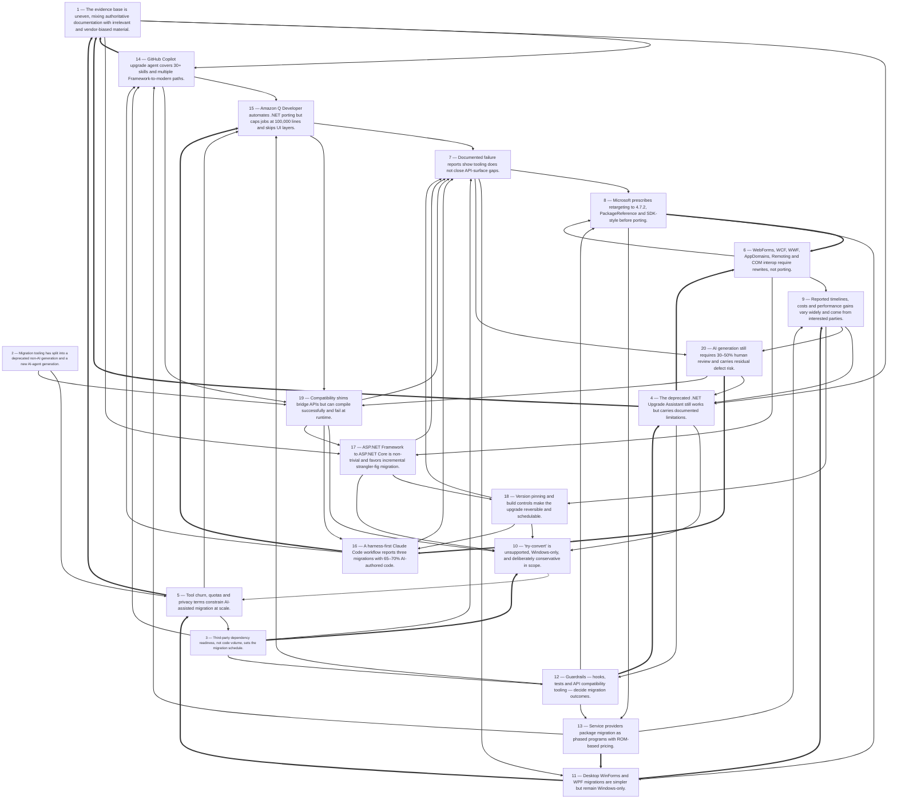

# Title: The captured sources describe a migration tooling landscape in transition: the…

## Corpus Quality Scoreboard

Quality: **55/100** - Grade C (Adequate)

```
[###########---------]  55/100
```

- Critic: review (coverage 90 | evidence 37 | balance 0 | tension 100)
- Sources: 52 gathered | 52 cited | 52 full text | 28 distinct domains | 6.0/8 average relevance
- Cited date span: 2021-2026 (40 undated)

## Topic

research all the mechanisms that are available to migrate codebases from dotnet 4.8 to dotnet 8.x or 9.x, inclde both AI based and non-ai based tooling, effectivness of each tool, limitations or problems

## Search Queries

- .NET Upgrade Assistant limitations
- Porting Assistant for .NET effectiveness
- AI code migration .NET Framework to .NET Core
- Amazon Q Code Transformation .NET migration
- GitHub Copilot .NET Framework migration
- try-convert tool limitations
- .NET Framework 4.8 to .NET 8 migration tools
- .NET Upgrade Assistant vs Porting Assistant
- automated .NET Framework to .NET Core migration
- .NET Framework 4.8 to .NET 8 migration guide
- .NET Framework to .NET 9 migration path
- challenges migrating .NET Framework 4.8 to .NET 8
- .NET Framework compatibility .NET 8
- third-party tools .NET Framework migration
- .NET migration AI vs non-AI comparison
- .NET Framework to modern .NET migration
- .NET Framework to .NET 8 migration case study
- .NET Framework 4.8 to .NET 9 upgrade
- .NET migration tool API compatibility issues
- .NET Framework to .NET migration

### Search Engine Summary

| Engine | Pages | PDFs | Videos | Total |
|--------|-------|------|--------|-------|
| langsearch | 28 | 0 | 0 | 28 |
| serper | 17 | 0 | 0 | 17 |
| wikipedia | 8 | 0 | 0 | 8 |

### Search Provider Requests

| Search Provider | Requests |
|-----------------|----------|
| mf_search | 20 |

## Executive Summary

The captured sources describe a migration tooling landscape in transition: the traditional, non-AI mechanisms for moving .NET Framework 4.8 code to .NET 8/9/10 — the .NET Upgrade Assistant, `try-convert`, API Port, the Windows Compatibility Pack, and manual `TargetFramework` retargeting — remain documented and partly functional, but Microsoft has formally deprecated the Upgrade Assistant and API Port in favor of the GitHub Copilot modernization/upgrade agent shipped with Visual Studio 2026 and VS 2022 17.14.16+ [#12][#14][#16][#30][#31][#49], while AI-powered alternatives from AWS (Amazon Q Developer transformation, capped at 100,000 lines of code per job with one concurrent job per user and two per account, and explicitly unable to transform Razor/WebForms UI layers) [#1][#5] and third-party agentic workflows such as a harness-first Claude Code process reporting three migrations of 85k–220k lines in 4–11 weeks with roughly 65–70% AI-authored code and 98.5% test pass rates on the largest case [#19] compete for the same work. Across every source, the hard blockers are consistent and are not tooling problems at all: ASP.NET WebForms, WCF, Windows Workflow Foundation, .NET Remoting, AppDomains, CAS, System.EnterpriseServices, machine-wide COM interop, and closed-vendor third-party binaries must be rewritten rather than ported [#22][#27][#38][#43][#46][#50], and the practical gating factor is the readiness of the third-party dependency graph, evidenced by DevExpress dropping .NET 6/7 and .NET Framework ≤4.6.1 in v24.2 [#48], Revit 2025 being .NET 8-only and forcing add-in recompiles [#25], and NuGet compatibility matrices showing which packages already multi-target net8.0/net9.0/netstandard2.0 [#26][#28][#36][#39][#40]. Even the AI tools are presented as assistants rather than replacements — one guide budgets 30–50% of project time for human review and reports 50–70% AI-generated changes [#19], another warns that AI-generated code carries bug and security risk requiring senior-engineer review [#43], and a widely viewed Microsoft Q&A thread documents a developer who could not migrate multiple ASP.NET, WinForms and WPF projects at all because the Upgrade Assistant and Windows Compatibility Pack "did not solve the problem" [#38] — so the realistic conclusion is that migration is a phased, dependency-ordered engineering program (multi-target to net48;net8.0, retarget to 4.7.2 while still building, convert to SDK-style and PackageReference, migrate bottom-up or inside-out, keep a green test baseline) [#10][#12][#22][#50][#52] in which AI tooling compresses mechanical conversion and planning effort but does not eliminate the app-model rewrites, third-party dependency waits, or verification burden.

## Top 10 Implications

1. Microsoft's own guidance now points to AI agents first: the .NET Upgrade Assistant and API Port are deprecated in favor of the GitHub Copilot modernization chat agent in Visual Studio 2026 / VS 2022 17.14.16+, so any migration plan written against older documentation must be re-baselined [#12][#14][#49].
2. Do not assume AI tooling resolves the hard blockers — WebForms, WCF, WWF, Remoting, AppDomains, CAS and closed-vendor DLLs must be rewritten regardless of tool choice, and these items, not code volume, will drive the schedule [#22][#38][#43][#46].
3. Third-party dependency readiness is the real critical path: vendors such as DevExpress now require .NET 8 minimum, Revit 2025 is .NET 8-only, and packages that still target only .NET Framework cannot be carried forward mechanically [#25][#48][#11].
4. Pre-migration hygiene (retarget to .NET Framework 4.7.2 while the app still builds, convert to PackageReference, convert to SDK-style projects, update dependencies to .NET Standard where possible) is prerequisite work, not optional cleanup, because it establishes the buildable baseline every later tool depends on [#12][#22][#52].
5. Plan for 50–70% AI-generated code at best, with 30–50% of project time budgeted for human review; treat percentage claims from vendor case studies as directional, not guaranteed [#19][#43].
6. Amazon Q Developer is quota-constrained (100,000 LOC per job and per month, one concurrent job per user, two per account) and does not transform UI layers such as Razor views or WebForms ASPX, which limits it for large or UI-heavy ASP.NET Framework applications [#1][#5].
7. Keep a green test baseline and verification tooling before starting: the reported 98.5% test pass rate depends on having a suite, SYSLIB warnings should be treated as errors, and API compatibility tooling should be used for published libraries [#19][#51][#52].
8. Adopt version-pinning mechanisms (`global.json`, `rollForward`, `packages.lock.json`, `Directory.Packages.props`, `AnalysisLevel`, container `FROM` changes) to make the upgrade schedulable and reversible rather than an uncontrolled leap [#47].
9. Choose the migration strategy deliberately — big-bang, incremental, or Strangler Fig — because ASP.NET Framework to ASP.NET Core is explicitly "non-trivial" due to `System.Web`/`HttpContext` coupling and cross-cutting concerns, and incremental extraction is the recommended default for production-continuous systems [#34][#50][#27].
10. Budget for the possibility of partial failure: at least one documented case shows teams unable to migrate at all with then-current tooling, and the tool ecosystem itself deprecates and changes shape, so retain rollback capability and consider multi-targeting as a holding position [#15][#38][#52].

## Open Questions

- What is the measured accuracy and defect rate of the GitHub Copilot upgrade/modernization agent on Framework-to-.NET-8+ migrations? No source in the corpus provides independent or vendor-published outcome data, only capability descriptions and telemetry scope [#11][#13].
- Does the Copilot WebForms-to-Blazor scenario actually deliver production-viable results, given that Amazon Q explicitly excludes WebForms ASPX and Razor views from transformation [#5][#11]? This direct contradiction between two AI vendors is unresolved.
- What are the current, primary-source end-of-support dates and servicing terms for .NET Framework 4.8/4.8.1 and for modern .NET releases, given that the captured servicing-update page contained no article content [#20] and the dates in the corpus come from secondary sources [#35][#48]?
- How much do the effectiveness percentages change when measured independently — specifically the 65–70% AI-authored code and 98.5% test pass [#19], the 40–50% faster delivery [#19], the 18% cloud hosting reduction [#44], and the 8,000 to 18,000–22,000 req/s API improvement [#46]?
- What is the throughput ceiling of AI-assisted migration once 30–50% human review time, Amazon Q's 100,000-LOC per-job/per-month quota and one-concurrent-job-per-user limit are all accounted for on a codebase above 200,000 lines [#1][#19]?
- How should teams handle closed-vendor third-party DLLs that have no modern .NET build, given that compatibility mode is temporary and runtime-risky and no supported long-term mechanism is described [#22][#23][#38]?
- What is the total cost and duration of the dual-running period in a Strangler Fig migration, and how many strangler migrations complete versus stall? No source reports duration or completion rates for the pattern it recommends [#34][#43][#50].
- How can test coverage be retrofitted into untested legacy .NET Framework applications, given that a green baseline build/test is a stated precondition for both AI-assisted and manual migration workflows [#19][#35]?
- Are the privacy and telemetry terms of the AI tools sufficient for regulated codebases — specifically, are derived artifacts (plans, assessments, dashboards) retained or transmitted, and what governs their residency [#11][#13][#19]?
- Which migration path should be taken for applications already on .NET Core 3.1 or .NET 6, which are past end of support: direct upgrade to .NET 8/10, or a staged upgrade through intermediate versions to reduce breaking-change surface [#35][#46]?
- Does the reported XAML limitation of the Upgrade Assistant (namespace-only transformations) apply equally to the Copilot agent's WPF/WinForms scenarios, and if so, what automated help exists for XAML-heavy desktop applications [#14][#30][#11]?
- What is the practical cost of the pre-migration retargeting to .NET Framework 4.7.2 if that change must ship to production, including regression risk and on-premises runtime availability for the eventual target framework [#12][#52]?

## Data Quality & Consistency

**Overall verdict:** Proceed — the synthesis passes the deterministic 4-critic audit.

| Metric | Value | Detail |
|--------|-------|--------|
| Corpus critic | 55/100 (review) | coverage 90 · evidence 37 · balance 0 · tension 100 |
| Contradictions | 0 edge(s) | no edges |
| Source tensions | 14 tension(s) | 0 contradiction · 8 shallow · 6 isolated |
| Cross-locus reconcile | 1 pair(s) | 0 conflicting edge(s) |
| Synthesis audit | 94/100 (proceed) | 52 source(s) cited |

**Key concerns:**
- Corpus: Dimension 'Risk' has only moderate support (3 source(s))
- Corpus: Dimension 'Benefit' has only moderate support (2 source(s))
- Tension (shallow evidence): Benefit [#42, #45] — moderate evidence: only 2 source(s) mention this dimension.
- Tension (shallow evidence): Cost [#17, #44] — moderate evidence: only 2 source(s) mention this dimension.
- Audit: Synthesis audit for 'research all the mechanisms that are available to migrate codebases from dotnet 4.8 to dotnet 8.x or 9.x, inclde both AI based and non-ai based tooling, effectivness of each tool, limitations or problems' scored 94/100 across critics [coverage=77 logic=100 evidence=100 readability=100]; 52/52 sources cited.

## Concepts

### 1. AI-Assisted Modernization
**Definition:** Generative AI agents and chat/CLI workflows are used to assess, plan, and execute .NET upgrades, migrations, and Azure modernization, often replacing older Microsoft tools.

**Key Evidence:**
- Amazon Q Developer uses a generative AI refactoring workflow to port Windows-based .NET apps to Linux-compatible .NET and upgrade cross-platform .NET apps, with Transformation Hub, diff review, and Linux readiness reports [#1][#5].
- GitHub Copilot upgrade/modernization agents run assessment, planning, and execution for .NET and Azure scenarios [#11][#13], while .NET Upgrade Assistant is deprecated in favor of the GitHub Copilot modernization chat agent [#12][#14][#49]; Claude Code is also used in a harness-first .NET 10 migration workflow [#19].

### 2. Compatibility and Unsupported Technology
**Definition:** Migration is limited by APIs, frameworks, and dependencies that do not exist or behave differently in modern .NET, requiring rewrites, workarounds, or staying on .NET Framework.

**Key Evidence:**
- Unsupported technologies include application domains, .NET Remoting, CAS, security transparency, System.EnterpriseServices, and WF; the Windows Compatibility Pack supplies much but not all of the .NET Framework API surface [#22]. ASP.NET Framework migration is non-trivial due to System.Web/HttpContext dependencies and cross-cutting concerns [#50], while WCF, Web Forms, WWF, and machine-wide COM interop are common blockers or rewrite targets [#43][#46].
- Third-party/NuGet compatibility constrains targets: DevExpress v24.2 drops .NET 6/7 and older .NET Framework versions, requiring .NET 8+ or .NET Framework 4.6.2+ [#48]; package pages list target-framework support such as net8.0/netstandard2.0 [#36], and API compatibility tooling validates breaking changes across target frameworks [#51]. SYSLIB0011 BinaryFormatter is treated as a blocker [#52].

### 3. Legacy .NET Modernization
**Definition:** Migrating Windows-only .NET Framework applications to cross-platform modern .NET (Core/5+/8/10) to gain support, performance, cross-platform deployment, and cloud readiness.

**Key Evidence:**
- .NET Framework 4.8/4.8.1 is described as the final release and now maintenance/security-only, while active development is in modern .NET [#17][#43][#46].
- Migration drivers include cross-platform support, 20–50% throughput/response-time gains, LTS, and cloud-native improvements, usually targeting .NET 8 LTS or later [#27][#35][#22][#46].

### 4. Cloud-Native Replatforming
**Definition:** Modernization often goes beyond retargeting to containerization, infrastructure-as-code, and deployment on Azure/cloud-native services.

**Key Evidence:**
- GitHub Copilot modernization covers Azure dependency migration, containerization, infrastructure-as-code generation, Azure deployment, and integration with App Service, Azure Container Apps, AKS, and Azure AI services [#13].
- Roadmaps move .NET Framework monoliths to Azure SQL/App Service, then refactor with Strangler Fig and re-architect with Docker, microservices, and AKS [#34]; .NET 8 apps are containerized and deployed to Azure App Service/AKS with health checks and Application Insights [#45]. Hosting upgrades require changing container `FROM` statements or Azure App Service configuration [#47], and a five-step modernization roadmap includes cloud-native design with Docker/Kubernetes/serverless/Azure and cites an 18% cloud hosting cost reduction [#44].

### 5. Incremental Migration Planning
**Definition:** Migrations are scoped, assessed, and executed in phases—bottom-up, inside-out, side-by-side, multi-targeting, or Strangler Fig—rather than as a single big-bang rewrite.

**Key Evidence:**
- Assessment with .NET Upgrade Assistant/API Analyzer/Application Insights and choices among big-bang, incremental, or strangler-fig approaches are recommended, with phased timelines [#27]; Microsoft recommends Strangler Fig for larger/production-continuous ASP.NET migrations and in-place migration only for small apps [#50].
- Enterprise guidance recommends configuring build/hook preconditions, migrating bottom-up from shared libraries, supervising parallel worktree agents, and budgeting 30–50% human review [#19]; SSW advises auditing architecture/technical debt, identifying obsolete APIs, converting to SDK-style via try-convert, multi-targeting TFMs, and working bottom-up or inside-out [#52].

## Findings


### **Finding 1** — The evidence base is uneven, mixing authoritative documentation with irrelevant and vendor-biased material.

**Observation:**
Of the 52 captured sources, several are unrelated encyclopedia summaries — AWS, Rust, Ayahuasca, Agriculture, Kentucky, the 2000s, Slovakia and Belfast [#2][#3][#4][#6][#7][#8][#9][#10]. Source [#20], on .NET and .NET Framework August 2026 servicing updates, contains only an email/country-region form with no article text. Five sources are NuGet package pages supplying target-framework compatibility matrices — GrapeCity ActiveReports.Core.Document [#26], GrapeCity ActiveReports.Chart [#28], Ardalis.Specification [#36], nbgv [#39] and dotnetsay [#40] — and one is a 2018 JetBrains post about debugging third-party code in Rider [#41]. Several sources are vendor or consultancy blogs marketing migration services or products [#17][#24][#42][#43][#44], and two are control-vendor knowledge base or blog posts [#32][#37].

**Analysis:**
The distribution matters for how much weight each conclusion can carry.

The most reliable material is Microsoft Learn documentation, which is explicit about what is supported, what is deprecated and what requires rewriting — the unsupported-technology list [#22], the premigration steps [#12], the ASP.

NET Core migration verdict on technical debt and cross-cutting concerns [#50], the porting approaches and deprecation chain [#49], the API compatibility tooling semantics [#51], and the version-pinning mechanisms [#47] are all documented behavior rather than claimed outcomes.

The NuGet compatibility pages are also verifiable primary data about ecosystem readiness and support Finding 11 [#26][#28][#36][#39][#40].

By contrast, the effectiveness claims — 65–70% AI-authored code, 98.

5% test pass, 40–50% faster delivery, 91.

6% AI authorship, 18% cloud cost reduction, 8,000 to 18,000–22,000 req/s — all originate from parties selling migration work or tooling, with no methodology disclosed and no independent replication [#19][#44][#46].

The irrelevant sources inflate the apparent breadth of the evidence without contributing to it, and the empty servicing page [#20] leaves a primary-source gap on end-of-support dates, which the analysis must therefore draw from secondary descriptions [#35][#48].

One adjacent source, the 2018 Rider post on debugging third-party code without `.pdb` files [#41], does not address migration but is tangentially relevant to the verification problem of diagnosing failures inside unported dependencies.

**Cross-reference / Dependencies:**
Provides the evidential weighting for Finding 14 and Finding 4, and reinforces Finding 17's caution against optimistic tooling claims.

**Implication:**
Weight conclusions toward documented tool capabilities and constraints, treat all effectiveness percentages as directional, and seek a primary Microsoft source for support-lifecycle dates before using them in any planning document.

**Sources:**
- [2] Amazon Web Services — [https://en.wikipedia.org/wiki/Amazon_Web_Services](https://en.wikipedia.org/wiki/Amazon_Web_Services)
- [3] Rust (programming language) — [https://en.wikipedia.org/wiki/Rust_(programming_language)](https://en.wikipedia.org/wiki/Rust_(programming_language))
- [4] Ayahuasca — [https://en.wikipedia.org/wiki/Ayahuasca](https://en.wikipedia.org/wiki/Ayahuasca)
- [6] Agriculture — [https://en.wikipedia.org/wiki/Agriculture](https://en.wikipedia.org/wiki/Agriculture)
- [7] Kentucky — [https://en.wikipedia.org/wiki/Kentucky](https://en.wikipedia.org/wiki/Kentucky)
- [8] 2000s — [https://en.wikipedia.org/wiki/2000s](https://en.wikipedia.org/wiki/2000s)
- [9] Slovakia — [https://en.wikipedia.org/wiki/Slovakia](https://en.wikipedia.org/wiki/Slovakia)
- [10] Belfast — [https://en.wikipedia.org/wiki/Belfast](https://en.wikipedia.org/wiki/Belfast)
- [12] Prerequisites to port from .NET Framework - .NET Core [StephenBonikowsky] — [https://learn.microsoft.com/en-us/dotnet/core/porting/premigration-needed-changes](https://learn.microsoft.com/en-us/dotnet/core/porting/premigration-needed-changes)
- [17] .NET Framework to .NET Core Migration Services - TYMIQ — [https://www.tymiq.com/services/net-framework-to-net-core-migration-services](https://www.tymiq.com/services/net-framework-to-net-core-migration-services)
- [19] .NET Framework to .NET 10 Migration with Claude Code | Talk Think Do [Matt Hammond] — [https://talkthinkdo.com/guides/legacy-modernisation/dotnet-framework-migration-claude-code](https://talkthinkdo.com/guides/legacy-modernisation/dotnet-framework-migration-claude-code) (published 2026-04-19)
- [20] .NET and .NET Framework August 2026 servicing releases updates - .NET Blog [Rahul Bhandari (MSFT), @[https://twitter.com/raalhul](https://twitter.com/raalhul)] — [https://devblogs.microsoft.com/dotnet/dotnet-and-dotnet-framework-august-2026-servicing-updates](https://devblogs.microsoft.com/dotnet/dotnet-and-dotnet-framework-august-2026-servicing-updates) (published 2026-08-11)
- [22] Port from .NET Framework to .NET - .NET Core [adegeo] — [https://learn.microsoft.com/en-us/dotnet/core/porting/framework-overview](https://learn.microsoft.com/en-us/dotnet/core/porting/framework-overview)
- [24] Porting A .NET Application To .NET Core — [https://www.syncfusion.com/code-examples/Porting-DotNet-Application-to-NetCore](https://www.syncfusion.com/code-examples/Porting-DotNet-Application-to-NetCore)
- [26] GrapeCity.ActiveReports.Core.Document 4.6.2 — [https://www.nuget.org/packages/GrapeCity.ActiveReports.Core.Document/4.6.2](https://www.nuget.org/packages/GrapeCity.ActiveReports.Core.Document/4.6.2)
- [28] GrapeCity.ActiveReports.Chart 18.0.4 — [https://www.nuget.org/packages/GrapeCity.ActiveReports.Chart](https://www.nuget.org/packages/GrapeCity.ActiveReports.Chart)
- [32] Meet the .NET Upgrade Assistant, Your .NET 5 Moving Company [@Telerik] — [https://www.telerik.com/blogs/meet-dotnet-upgrade-assistant-your-dotnet-5-moving-company](https://www.telerik.com/blogs/meet-dotnet-upgrade-assistant-your-dotnet-5-moving-company) (published 2021-04-15)
- [35] HeroDevs Blog | Migrating from .NET 6 to .NET 8: A Comprehensive Guide for Enterprises [Greg Allen] — [https://www.herodevs.com/blog-posts/migrating-from-net-6-to-net-8-a-comprehensive-guide-for-enterprises](https://www.herodevs.com/blog-posts/migrating-from-net-6-to-net-8-a-comprehensive-guide-for-enterprises) (published 2025-06-04)
- [36] Ardalis.Specification 9.3.1 — [https://packages.nuget.org/packages/Ardalis.Specification/9.3.1](https://packages.nuget.org/packages/Ardalis.Specification/9.3.1)
- [37] WinForms How to Migrate a WinForms .NET Framework Project to .NET Core - Telerik UI for WinForms [Progress Telerik] — [https://www.telerik.com/products/winforms/documentation/knowledge-base/migare-net-framework-project-to-core](https://www.telerik.com/products/winforms/documentation/knowledge-base/migare-net-framework-project-to-core)
- [39] nbgv 3.10.44-alpha-g09c6831bf9 — [https://www.nuget.org/packages/nbgv/3.10.44-alpha-g09c6831bf9](https://www.nuget.org/packages/nbgv/3.10.44-alpha-g09c6831bf9)
- [40] dotnetsay 3.0.1 — [https://www.nuget.org/packages/dotnetsay/3.0.1](https://www.nuget.org/packages/dotnetsay/3.0.1)
- [41] Debugging third-party code with Rider - now in Mono! - The JetBrains Blog [@jetbrains] — [https://blog.jetbrains.com/dotnet/2018/02/19/debugging-third-party-code-with-rider-now-in-mono](https://blog.jetbrains.com/dotnet/2018/02/19/debugging-third-party-code-with-rider-now-in-mono)
- [42] Why It's Time to Migrate from .NET Framework to Modern .NET? .NET upgrade assistant is here. — [https://ironsoftware.com/news/industry-news/migrate-to-modern-dotnet-with-assistant](https://ironsoftware.com/news/industry-news/migrate-to-modern-dotnet-with-assistant) (published 2025-05-16)
- [43] .NET Framework to .NET Core Migration: A Decision Guide From a Team That’s Done It - Full Scale [Matt Watson] — [https://fullscale.io/blog/dotnet-framework-to-dotnet-migration](https://fullscale.io/blog/dotnet-framework-to-dotnet-migration) (published 2026-09-06)
- [44] Evolution and Impact of .NET Technology: A Strategic Guide — [https://www.cisin.com/coffee-break/evolution-and-impact-of-net-technology.html](https://www.cisin.com/coffee-break/evolution-and-impact-of-net-technology.html) (published 2024-01-22)
- [46] .NET Core vs .NET Framework: Which to choose in 2026 [Kacper Rafalski] — [https://www.netguru.com/blog/net-core-vs-net-framework](https://www.netguru.com/blog/net-core-vs-net-framework) (published 2026-09-23)
- [47] Upgrade to a new .NET version - .NET [adegeo] — [https://learn.microsoft.com/en-us/dotnet/core/install/upgrade](https://learn.microsoft.com/en-us/dotnet/core/install/upgrade)
- [48] .NET &#x2014; .NET 8 and .NET Framework 4.6.2 Are Minimally Supported Target Frameworks for DevExpress Libraries in… — [https://community.devexpress.com/blogs/news/archive/2024/07/08/net-net-8-and-net-framework-4-6-2-are-minimally-supported-target-frameworks-for-devexpress-libraries-in-v24-2.aspx](https://community.devexpress.com/blogs/news/archive/2024/07/08/net-net-8-and-net-framework-4-6-2-are-minimally-supported-target-frameworks-for-devexpress-libraries-in-v24-2.aspx)
- [49] Porting approaches - .NET Core [StephenBonikowsky] — [https://learn.microsoft.com/en-us/dotnet/core/porting/porting-approaches](https://learn.microsoft.com/en-us/dotnet/core/porting/porting-approaches)
- [50] Migrate from ASP.NET Framework to ASP.NET Core [wadepickett] — [https://learn.microsoft.com/en-us/aspnet/core/migration/fx-to-core?view=aspnetcore-10.0](https://learn.microsoft.com/en-us/aspnet/core/migration/fx-to-core?view=aspnetcore-10.0)
- [51] API compatibility tools - .NET [dotnet-bot] — [https://learn.microsoft.com/en-us/dotnet/fundamentals/apicompat/overview](https://learn.microsoft.com/en-us/dotnet/fundamentals/apicompat/overview)

**Source date range:** 2021-04-15..2026-09-23 (8 of 32 cited web sources dated)


### **Finding 2** — Migration tooling has split into a deprecated non-AI generation and a new AI-agent generation.

**Observation:**
Microsoft documentation across several pages states that the .NET Upgrade Assistant is "officially deprecated" and recommends instead the GitHub Copilot modernization chat agent included with Visual Studio 2026 and Visual Studio 2022 17.14.16 or later [#12][#14][#16][#30][#31], while the porting-approaches page adds that API Port is deprecated in favor of binary analysis with .NET Upgrade Assistant, whose backend is shut down so it must be used offline — and that the Upgrade Assistant is itself deprecated in favor of the same Copilot agent [#49]. In parallel, AWS documents Amazon Q Developer as using a "generative AI-powered refactoring workflow" for .NET transformation [#1], and an enterprise guide describes a Claude Code harness-first workflow for .NET Framework 4.x to .NET 10 [#19].

**Analysis:**
The significance is not merely that new tools exist, but that the previously recommended path has been formally withdrawn, which invalidates a large body of tutorial and blog guidance that still circulates.

Source [#32] describes the Upgrade Assistant as a prerelease global CLI tool for moving WinForms, WPF, ASP.

NET MVC, console and class-library apps to .

NET 5, and [#29] reviews it as a Visual Studio extension and CLI that helps identify incompatible NuGet packages and old framework code but "can sometimes mess with code" on complex codebases — both remain useful evidence of capability and failure modes but are now describing a deprecated tool.

Source [#15] shows the transition mechanics in practice: the Upgrade Assistant is no longer in the Visual Studio Installer components list, must be installed from the Marketplace or as `dotnet tool install -g upgrade-assistant --ignore-failed-sources`, and can alternatively be re-enabled through Tools > Options > All Settings > Projects and Solutions > Modernization > Enable legacy Upgrade Assistant.

This creates a three-tier landscape: AI agents that Microsoft actively promotes, a deprecated but reachable legacy tool, and unsupported community tools such as `try-convert` [#21].

For planning purposes this means tool selection is now also a lifecycle-risk decision, because the recommended tool of 2023 is the deprecated tool of 2025 and the recommended tool of 2025 is an agent whose distribution channels (for example, the Upgrade Dashboard being available only in GitHub Copilot CLI and the GitHub Copilot app) are still narrowing [#11].

**Cross-reference / Dependencies:**
Elaborated by Finding 2 (the promoted Copilot agent), Finding 5 (the deprecated Upgrade Assistant), and Finding 19 (tool churn as a migration risk).

**Implication:**
Any migration plan should name a primary tool, a documented fallback (legacy Upgrade Assistant toggle or `upgrade-assistant` global tool), and a version-pinning strategy, and should be re-validated against current Microsoft documentation at the start of each phase rather than trusting older blog walkthroughs.

**Sources:**
- [1] Transforming .NET applications with Amazon Q Developer - Amazon Q Developer — [https://docs.aws.amazon.com/amazonq/latest/qdeveloper-ug/transform-dotnet-IDE.html](https://docs.aws.amazon.com/amazonq/latest/qdeveloper-ug/transform-dotnet-IDE.html)
- [11] GitHub Copilot upgrade overview [adegeo] — [https://learn.microsoft.com/en-us/dotnet/core/porting/github-copilot-upgrade/overview](https://learn.microsoft.com/en-us/dotnet/core/porting/github-copilot-upgrade/overview)
- [12] Prerequisites to port from .NET Framework - .NET Core [StephenBonikowsky] — [https://learn.microsoft.com/en-us/dotnet/core/porting/premigration-needed-changes](https://learn.microsoft.com/en-us/dotnet/core/porting/premigration-needed-changes)
- [14] .NET Upgrade Assistant Overview - .NET Core [adegeo] — [https://learn.microsoft.com/en-us/dotnet/core/porting/upgrade-assistant-overview](https://learn.microsoft.com/en-us/dotnet/core/porting/upgrade-assistant-overview)
- [15] Migrating C# Visual Studio 2022 (17.8) from .NET 4.7 to .NET 8 - Microsoft Q&amp;A — [https://learn.microsoft.com/en-in/answers/questions/5938516/migrating-c-visual-studio-2022-17-8-from-net-4-7-t](https://learn.microsoft.com/en-in/answers/questions/5938516/migrating-c-visual-studio-2022-17-8-from-net-4-7-t)
- [16] .NET Upgrade Assistant Overview - .NET Core [adegeo] — [https://docs.microsoft.com/en-us/dotnet/core/porting/upgrade-assistant-overview](https://docs.microsoft.com/en-us/dotnet/core/porting/upgrade-assistant-overview)
- [19] .NET Framework to .NET 10 Migration with Claude Code | Talk Think Do [Matt Hammond] — [https://talkthinkdo.com/guides/legacy-modernisation/dotnet-framework-migration-claude-code](https://talkthinkdo.com/guides/legacy-modernisation/dotnet-framework-migration-claude-code) (published 2026-04-19)
- [21] GitHub - dotnet/try-convert: Helping .NET developers port their projects to .NET Core! — [https://github.com/dotnet/try-convert](https://github.com/dotnet/try-convert)
- [29] .NET Upgrade Assistant [Code Inside Team] — [https://blog.codeinside.eu/2024/03/07/upgrade-assistant](https://blog.codeinside.eu/2024/03/07/upgrade-assistant)
- [30] .NET Upgrade Assistant Overview - .NET Core [adegeo] — [https://learn.microsoft.com/dotnet/core/porting/upgrade-assistant-overview](https://learn.microsoft.com/dotnet/core/porting/upgrade-assistant-overview)
- [31] .NET Upgrade Assistant Overview - .NET Core [adegeo] — [https://learn.microsoft.com/en-us/dotnet/core/porting/upgrade-assistant-overview?source=post_page-----9391d24f5c3a---------------------------------------](https://learn.microsoft.com/en-us/dotnet/core/porting/upgrade-assistant-overview?source=post_page-----9391d24f5c3a---------------------------------------)
- [32] Meet the .NET Upgrade Assistant, Your .NET 5 Moving Company [@Telerik] — [https://www.telerik.com/blogs/meet-dotnet-upgrade-assistant-your-dotnet-5-moving-company](https://www.telerik.com/blogs/meet-dotnet-upgrade-assistant-your-dotnet-5-moving-company) (published 2021-04-15)
- [49] Porting approaches - .NET Core [StephenBonikowsky] — [https://learn.microsoft.com/en-us/dotnet/core/porting/porting-approaches](https://learn.microsoft.com/en-us/dotnet/core/porting/porting-approaches)

**Source date range:** 2021-04-15..2026-04-19 (2 of 13 cited web sources dated)


### **Finding 3** — Third-party dependency readiness, not code volume, sets the migration schedule.

**Observation:**
DevExpress announced that from v24.2 (December 2024) it drops support for .NET 6/7 and .NET Framework 4.5.2, 4.6 and 4.6.1, requiring at minimum .NET 8 for .NET Core products and .NET Framework 4.6.2 for Framework products across WinForms, WPF, Blazor, ASP.NET Core, Reporting, Office File API, BI Dashboards, XAF, Web API Service, XPO and ASP.NET WebForms/MVC 5/Bootstrap, citing Microsoft's retirement of .NET Framework 4.5.2/4.6/4.6.1 on 26 April 2022, .NET 7 end of support on 14 May 2024 and .NET 6 end of support on 12 November 2024, with .NET 8 assemblies usable with .NET 9 and .NET Framework 4.6.2 assemblies with higher versions such as 4.8.1 [#48]. NuGet pages show GrapeCity ActiveReports components compatible with .NET Framework 4.6.2/net461–net481, .NET Standard 2.0/2.1 and computed .NET 5.0–10.0 targets [#26][#28], while Ardalis.Specification 9.3.1 is explicitly compatible with net8.0, net9.0 and netstandard2.0 and is depended on by 135 NuGet packages including `ardalis/CleanArchitecture` and `dotnet-architecture/eShopOnWeb` [#36], and packages such as `nbgv` and `dotnetsay` target net8.0 with computed net9.0/net10.0 support [#39][#40]. Revit 2025's API is built on .NET 8 and is .NET 8-only, so Revit add-ins must be recompiled, with recommended CefSharp versions 119.4.3, 119.4.30 and 119.1.20 and Newtonsoft.Json 13.0.1, plus multi-targeting with older .NET 4.8 Revit releases [#25]. A services vendor lists incompatible NuGet/third-party libraries among its ROM cost factors [#17], and the Q&A poster specifically asks how to handle third-party DLLs from closed vendors [#38]. Microsoft's ASP.NET Core migration guide frames this as library dependency chains requiring postorder depth-first upgrades and multi-targeting [#50].

**Analysis:**
This finding explains why migration timelines in practice diverge so sharply from the timelines in generic roadmaps.

A project cannot reach .

NET 8 faster than its slowest dependency, and modern .

NET has no supported mechanism for consuming Framework-only binary dependencies except compatibility mode, which is explicitly temporary and runtime-risky [#22][#23].

The DevExpress case is instructive because the vendor's own end-of-support dates, not the customer's plan, set the deadline — and because DevExpress simultaneously supports both .

NET Framework 4.

6.

2+ and .

NET 8+, which means its customers can multi-target and migrate incrementally rather than in one step [#48].

Revit is the opposite case: an application platform that switches wholesale to .

NET 8 forces every add-in to recompile, and the guidance about CefSharp and Newtonsoft.

Json versions shows that even the "compatible" dependencies need specific version selection [#25].

The NuGet compatibility pages provide the concrete tooling for this analysis — a computed target framework list tells you immediately whether a package can be referenced from `net8.

0` — and the dependency counts (43 dependent packages for ActiveReports.

Core.

Document [#26], 20 for ActiveReports.

Chart [#28], 135 for Ardalis.

Specification [#36]) indicate how much of an ecosystem moves when one package does or does not add a target.

Postorder depth-first ordering [#50] is the algorithmic answer to this shape: migrate leaves first so that each node's dependencies are already multi-targeted before the node itself moves.

The unresolved case is the closed-vendor binary, where none of these mechanisms apply and the only options are replacement, reverse engineering, or remaining on .

NET Framework with its maintenance-only status [#38][#46].

**Cross-reference / Dependencies:**
Depends on Finding 10 (pre-migration dependency updates) and Finding 7 (app-model blockers); constrains Finding 12 (desktop apps needing vendor control support) and Finding 14 (timeline estimates).

**Implication:**
Produce a dependency inventory with target-framework compatibility for every direct and transitive package before committing to a schedule, sequence migrations depth-first, and flag any dependency with no modern-.NET target as a risk requiring a replacement decision.

**Sources:**
- [17] .NET Framework to .NET Core Migration Services - TYMIQ — [https://www.tymiq.com/services/net-framework-to-net-core-migration-services](https://www.tymiq.com/services/net-framework-to-net-core-migration-services)
- [22] Port from .NET Framework to .NET - .NET Core [adegeo] — [https://learn.microsoft.com/en-us/dotnet/core/porting/framework-overview](https://learn.microsoft.com/en-us/dotnet/core/porting/framework-overview)
- [23] Few things about migrating to .NET Core [@ddobric] — [https://developersde.azurewebsites.net/2018/01/09/migrating-to-net-core](https://developersde.azurewebsites.net/2018/01/09/migrating-to-net-core)
- [25] Autodesk Developer Blog : Migrating from .NET 4.8 to .NET Core 8 — [https://blog.autodesk.io/migrating-from-net-48-to-net-core-8](https://blog.autodesk.io/migrating-from-net-48-to-net-core-8)
- [26] GrapeCity.ActiveReports.Core.Document 4.6.2 — [https://www.nuget.org/packages/GrapeCity.ActiveReports.Core.Document/4.6.2](https://www.nuget.org/packages/GrapeCity.ActiveReports.Core.Document/4.6.2)
- [28] GrapeCity.ActiveReports.Chart 18.0.4 — [https://www.nuget.org/packages/GrapeCity.ActiveReports.Chart](https://www.nuget.org/packages/GrapeCity.ActiveReports.Chart)
- [36] Ardalis.Specification 9.3.1 — [https://packages.nuget.org/packages/Ardalis.Specification/9.3.1](https://packages.nuget.org/packages/Ardalis.Specification/9.3.1)
- [38] I can&#39;t Migrate from .Net Framework 4.8 to .Net 8 (As happens to the vast majority) - Microsoft Q&amp;A — [https://learn.microsoft.com/en-au/answers/questions/1661476/i-cant-migrate-from-net-framework-4-8-to-net-8-as](https://learn.microsoft.com/en-au/answers/questions/1661476/i-cant-migrate-from-net-framework-4-8-to-net-8-as)
- [39] nbgv 3.10.44-alpha-g09c6831bf9 — [https://www.nuget.org/packages/nbgv/3.10.44-alpha-g09c6831bf9](https://www.nuget.org/packages/nbgv/3.10.44-alpha-g09c6831bf9)
- [40] dotnetsay 3.0.1 — [https://www.nuget.org/packages/dotnetsay/3.0.1](https://www.nuget.org/packages/dotnetsay/3.0.1)
- [46] .NET Core vs .NET Framework: Which to choose in 2026 [Kacper Rafalski] — [https://www.netguru.com/blog/net-core-vs-net-framework](https://www.netguru.com/blog/net-core-vs-net-framework) (published 2026-09-23)
- [48] .NET &#x2014; .NET 8 and .NET Framework 4.6.2 Are Minimally Supported Target Frameworks for DevExpress Libraries in… — [https://community.devexpress.com/blogs/news/archive/2024/07/08/net-net-8-and-net-framework-4-6-2-are-minimally-supported-target-frameworks-for-devexpress-libraries-in-v24-2.aspx](https://community.devexpress.com/blogs/news/archive/2024/07/08/net-net-8-and-net-framework-4-6-2-are-minimally-supported-target-frameworks-for-devexpress-libraries-in-v24-2.aspx)
- [50] Migrate from ASP.NET Framework to ASP.NET Core [wadepickett] — [https://learn.microsoft.com/en-us/aspnet/core/migration/fx-to-core?view=aspnetcore-10.0](https://learn.microsoft.com/en-us/aspnet/core/migration/fx-to-core?view=aspnetcore-10.0)

**Source date range:** 2026-09-23 (1 of 13 cited web sources dated)


### **Finding 4** — The deprecated .NET Upgrade Assistant still works but carries documented limitations.

**Observation:**
The Upgrade Assistant analyzes and upgrades .NET Framework, .NET Core and .NET projects (C# or Visual Basic) to newer versions, supporting ASP.NET, Azure Functions, WPF, WinForms, class libraries, console apps, Xamarin.Forms, .NET MAUI and .NET Native UWP, with upgrade paths including .NET Framework/.NET Core to .NET, Azure Functions v1–v3 to v4 isolated targeting net6.0+, UWP to WinUI 3, previous .NET to latest .NET, and Xamarin.Forms to .NET MAUI; it offers analysis reporting, in-place, side-by-side and side-by-side incremental ASP.NET upgrade modes, and upgrade status artifacts with success/warning/error indicators and Output-window logs, but XAML transformations only support namespace upgrades [#14][#16][#30][#31]. Source [#32] documents installation (`dotnet tool install -g upgrade-assistant`), invocation (`upgrade-assistant <MySolution.sln>`), its use of `try-convert` version 0.7.212201+ and steps including backup, SDK-style project conversion, TFM update (for example net472 to net5.0), NuGet updates, template/config migration and C# source fixes, and notes extensibility via `ExtensionManifest.json`, `-e`, or `UpgradeAssistantExtensionPaths`. A hands-on review found it helps identify incompatible NuGet packages and old framework code but "can sometimes mess with code" on complex codebases [#29], and a walkthrough migrating the `eShopLegacyMVCSolution` still required manual removal of `Global.asax` and `App_Start` files, bundling fixes and use of `IHttpContextAccessor` for session access [#32]. Source [#34] uses `upgrade-assistant analyze/upgrade` in a lab that also requires `Global.asax` to `Program.cs` and `web.config` to `appsettings.json` changes.

**Analysis:**
The tool's continued usefulness is real but narrow: it is strongest at the mechanical conversion work (project-file conversion to SDK style, `packages.config` to `PackageReference`, TFM retargeting, deprecated-API identification) that independently appears as a prerequisite step in Microsoft's own pre-migration guidance [#12] and in community checklists [#42][#52].

Its known weaknesses are equally well documented: XAML transformation limited to namespaces means WPF and WinForms UIs get essentially no automated help, the ASP.

NET side-by-side incremental mode creates a parallel project plus a "bridge" in the original, which one reviewer calls "clever but risky" [#29], and the walkthrough evidence shows that even a well-known demo solution needs manual `Global.asax`/`App_Start` surgery and session-access rewrites [#32][#34].

Because Microsoft has deprecated it and recommends the Copilot agent instead [#14][#30], teams using it are running unmaintained software whose bugs will not be fixed, and there is no documented migration path from the tool's own artifacts to the agent's `.github/upgrades/` state files [#11].

The pragmatic reading is that it remains a viable fallback — explicitly reachable via the legacy toggle or the global tool [#15] — for the mechanical phases, and that its analysis report is still the cheapest way to inventory incompatible NuGet packages before committing to an AI workflow.

**Cross-reference / Dependencies:**
Builds on Finding 1; feeds into Finding 6 (`try-convert` component), Finding 10 (pre-migration steps) and Finding 12 (desktop/XAML limits).

**Implication:**
If used at all, it should be pinned to a known version, run on a branch with source control in place, and limited to analysis plus project-file and package conversion — with UI-layer and `Global.asax`/`web.config` work planned as manual tasks.

**Sources:**
- [11] GitHub Copilot upgrade overview [adegeo] — [https://learn.microsoft.com/en-us/dotnet/core/porting/github-copilot-upgrade/overview](https://learn.microsoft.com/en-us/dotnet/core/porting/github-copilot-upgrade/overview)
- [12] Prerequisites to port from .NET Framework - .NET Core [StephenBonikowsky] — [https://learn.microsoft.com/en-us/dotnet/core/porting/premigration-needed-changes](https://learn.microsoft.com/en-us/dotnet/core/porting/premigration-needed-changes)
- [14] .NET Upgrade Assistant Overview - .NET Core [adegeo] — [https://learn.microsoft.com/en-us/dotnet/core/porting/upgrade-assistant-overview](https://learn.microsoft.com/en-us/dotnet/core/porting/upgrade-assistant-overview)
- [15] Migrating C# Visual Studio 2022 (17.8) from .NET 4.7 to .NET 8 - Microsoft Q&amp;A — [https://learn.microsoft.com/en-in/answers/questions/5938516/migrating-c-visual-studio-2022-17-8-from-net-4-7-t](https://learn.microsoft.com/en-in/answers/questions/5938516/migrating-c-visual-studio-2022-17-8-from-net-4-7-t)
- [16] .NET Upgrade Assistant Overview - .NET Core [adegeo] — [https://docs.microsoft.com/en-us/dotnet/core/porting/upgrade-assistant-overview](https://docs.microsoft.com/en-us/dotnet/core/porting/upgrade-assistant-overview)
- [29] .NET Upgrade Assistant [Code Inside Team] — [https://blog.codeinside.eu/2024/03/07/upgrade-assistant](https://blog.codeinside.eu/2024/03/07/upgrade-assistant)
- [30] .NET Upgrade Assistant Overview - .NET Core [adegeo] — [https://learn.microsoft.com/dotnet/core/porting/upgrade-assistant-overview](https://learn.microsoft.com/dotnet/core/porting/upgrade-assistant-overview)
- [31] .NET Upgrade Assistant Overview - .NET Core [adegeo] — [https://learn.microsoft.com/en-us/dotnet/core/porting/upgrade-assistant-overview?source=post_page-----9391d24f5c3a---------------------------------------](https://learn.microsoft.com/en-us/dotnet/core/porting/upgrade-assistant-overview?source=post_page-----9391d24f5c3a---------------------------------------)
- [32] Meet the .NET Upgrade Assistant, Your .NET 5 Moving Company [@Telerik] — [https://www.telerik.com/blogs/meet-dotnet-upgrade-assistant-your-dotnet-5-moving-company](https://www.telerik.com/blogs/meet-dotnet-upgrade-assistant-your-dotnet-5-moving-company) (published 2021-04-15)
- [34] From Monolith to Modern: A .NET Developer&#8217;s Practical Roadmap to the Cloud — [https://atalupadhyay.wordpress.com/2025/11/13/from-monolith-to-modern-a-net-developers-practical-roadmap-to-the-cloud](https://atalupadhyay.wordpress.com/2025/11/13/from-monolith-to-modern-a-net-developers-practical-roadmap-to-the-cloud) (published 2025-11-13)
- [42] Why It's Time to Migrate from .NET Framework to Modern .NET? .NET upgrade assistant is here. — [https://ironsoftware.com/news/industry-news/migrate-to-modern-dotnet-with-assistant](https://ironsoftware.com/news/industry-news/migrate-to-modern-dotnet-with-assistant) (published 2025-05-16)
- [52] Do you create a migration plan? | SSW.Rules [@SSW_TV] — [https://www.ssw.com.au/rules/migration-plans](https://www.ssw.com.au/rules/migration-plans)

**Source date range:** 2021-04-15..2025-11-13 (3 of 12 cited web sources dated)


### **Finding 5** — Tool churn, quotas and privacy terms constrain AI-assisted migration at scale.

**Observation:**
Multiple Microsoft pages carry deprecation notices for the Upgrade Assistant and redirect to the Copilot modernization chat agent [#14][#16][#30][#31], and the porting-approaches page records the same deprecation plus the fact that API Port's backend is shut down and it must be used offline [#49]; a Q&A answer documents re-enabling the legacy assistant through Tools > Options > All Settings > Projects and Solutions > Modernization [#15]. GitHub Copilot upgrade collects non-user-identifiable telemetry on project types, intent to upgrade and upgrade duration, and the Upgrade Dashboard is currently available only in GitHub Copilot CLI and the GitHub Copilot app [#11]. GitHub Copilot modernization states that code snippets are not retained beyond the session and custom skills are not collected, transmitted or stored, and offers CVE scanning and fixes in Agent Mode [#13]. Amazon Q Developer quotas are 100,000 lines of code per job and monthly, with 1 concurrent job per user and 2 per AWS account [#1], and the Claude Code guide references Managed Agents cloud environments running unattended overnight using the `managed-agents-2026-04-01` beta header [#19].

**Analysis:**
Three distinct constraints emerge.

The first is lifecycle risk: the recommended migration tool chain has changed at least twice in roughly two years (API Port to Upgrade Assistant, then Upgrade Assistant to the Copilot agent) [#49], which means a migration program that spans many months may cross another tool transition and should therefore keep its intermediate artifacts in formats it controls — for example, preserving `try-convert`-style project conversions or the `.github/upgrades/{scenarioId}` markdown plan files [#11][#21] rather than relying on a vendor's hosted state.

The second is throughput governance: Amazon Q's 100,000-LOC caps are identical per job and per month with one concurrent job per user and two per account [#1], which is a hard ceiling on how quickly a large portfolio can be processed and makes the AI path slower than manual work for very large codebases unless jobs are distributed across many accounts; concurrent-job limits also constrain the parallel worktree pattern of Finding 4 if the same tool is used [#19].

The third is data governance: telemetry on project types and upgrade duration [#11] and unattended cloud agents with a beta header [#19] raise questions about code egress and residency that the published statements only partially answer, and Amazon Q's requirement for Microsoft-authored NuGet dependencies [#5] limits applicability in environments with internal or closed-vendor packages.

Notably, the privacy statements use careful framing — code snippets not retained beyond the session, custom skills not collected [#13] — which covers content but not necessarily derived artifacts such as plans, assessments and dashboards.

**Cross-reference / Dependencies:**
Builds on Finding 1 (tooling transition), Finding 3 (quotas) and Finding 15 (review); relevant to any regulated deployment.

**Implication:**
Before scaling AI tooling, confirm data-handling terms with legal/security, verify that artifact state can be exported and retained locally, and model quota ceilings into the portfolio schedule rather than discovering them mid-program.

**Sources:**
- [1] Transforming .NET applications with Amazon Q Developer - Amazon Q Developer — [https://docs.aws.amazon.com/amazonq/latest/qdeveloper-ug/transform-dotnet-IDE.html](https://docs.aws.amazon.com/amazonq/latest/qdeveloper-ug/transform-dotnet-IDE.html)
- [5] Porting a .NET application with Amazon Q Developer in Visual Studio - Amazon Q Developer — [https://docs.aws.amazon.com/amazonq/latest/qdeveloper-ug/port-dotnet-application.html](https://docs.aws.amazon.com/amazonq/latest/qdeveloper-ug/port-dotnet-application.html)
- [11] GitHub Copilot upgrade overview [adegeo] — [https://learn.microsoft.com/en-us/dotnet/core/porting/github-copilot-upgrade/overview](https://learn.microsoft.com/en-us/dotnet/core/porting/github-copilot-upgrade/overview)
- [13] Analyze Applications and Migrate to Azure by Using GitHub Copilot Modernization - Azure [KarlErickson] — [https://go.microsoft.com/fwlink?clcid=0x409&linkid=2339464](https://go.microsoft.com/fwlink?clcid=0x409&linkid=2339464)
- [14] .NET Upgrade Assistant Overview - .NET Core [adegeo] — [https://learn.microsoft.com/en-us/dotnet/core/porting/upgrade-assistant-overview](https://learn.microsoft.com/en-us/dotnet/core/porting/upgrade-assistant-overview)
- [15] Migrating C# Visual Studio 2022 (17.8) from .NET 4.7 to .NET 8 - Microsoft Q&amp;A — [https://learn.microsoft.com/en-in/answers/questions/5938516/migrating-c-visual-studio-2022-17-8-from-net-4-7-t](https://learn.microsoft.com/en-in/answers/questions/5938516/migrating-c-visual-studio-2022-17-8-from-net-4-7-t)
- [16] .NET Upgrade Assistant Overview - .NET Core [adegeo] — [https://docs.microsoft.com/en-us/dotnet/core/porting/upgrade-assistant-overview](https://docs.microsoft.com/en-us/dotnet/core/porting/upgrade-assistant-overview)
- [19] .NET Framework to .NET 10 Migration with Claude Code | Talk Think Do [Matt Hammond] — [https://talkthinkdo.com/guides/legacy-modernisation/dotnet-framework-migration-claude-code](https://talkthinkdo.com/guides/legacy-modernisation/dotnet-framework-migration-claude-code) (published 2026-04-19)
- [21] GitHub - dotnet/try-convert: Helping .NET developers port their projects to .NET Core! — [https://github.com/dotnet/try-convert](https://github.com/dotnet/try-convert)
- [30] .NET Upgrade Assistant Overview - .NET Core [adegeo] — [https://learn.microsoft.com/dotnet/core/porting/upgrade-assistant-overview](https://learn.microsoft.com/dotnet/core/porting/upgrade-assistant-overview)
- [31] .NET Upgrade Assistant Overview - .NET Core [adegeo] — [https://learn.microsoft.com/en-us/dotnet/core/porting/upgrade-assistant-overview?source=post_page-----9391d24f5c3a---------------------------------------](https://learn.microsoft.com/en-us/dotnet/core/porting/upgrade-assistant-overview?source=post_page-----9391d24f5c3a---------------------------------------)
- [49] Porting approaches - .NET Core [StephenBonikowsky] — [https://learn.microsoft.com/en-us/dotnet/core/porting/porting-approaches](https://learn.microsoft.com/en-us/dotnet/core/porting/porting-approaches)

**Source date range:** 2026-04-19 (1 of 12 cited web sources dated)


### **Finding 6** — WebForms, WCF, WWF, AppDomains, Remoting and COM interop require rewrites, not porting.

**Observation:**
Microsoft's porting overview lists unsupported technologies including application domains, remoting (`BeginInvoke`/`EndInvoke` throw `PlatformNotSupportedException`), CAS, security transparency, `System.EnterpriseServices`, and Windows Workflow Foundation (alternative CoreWF) [#22]. A strategy guide flags Web Forms as unsupported, WCF as limited support, WWF as having no direct equivalent, plus COM interop refactoring and unsupported third-party dependencies, with Web Forms moving to ASP.NET Core MVC or Blazor Server/WebAssembly and WCF to ASP.NET Core Web API, gRPC or SignalR [#27]. Netguru says to stay on .NET Framework only for blockers such as WCF server stack/net.tcp, Web Forms, WWF and machine-wide COM interop [#46]. The Autodesk Revit migration notes recommend CoreWCF as a substitute for `System.ServiceModel` [#25], while a migration roadmap prescribes WCF to gRPC/REST, WebForms to Razor Pages/Blazor, and EF6 to EF Core 8 [#45], and an Azure roadmap warns about removal of `System.Web`, `HttpContext`, `HttpModules` and `HttpHandlers` plus moving in-memory session state to a distributed cache such as Redis [#34].

**Analysis:**
This is the single most convergent conclusion in the corpus, appearing identically in Microsoft documentation, vendor guides and hands-on reports, and it explains why migration cost models are driven by architecture rather than by lines of code [#17].

The mechanism is simple: these technologies are absent from modern .

NET rather than merely changed, so there is no API to recompile against and no compatibility shim that can bridge them, because the missing piece is a host or runtime service (the `System.

Web` pipeline, the WCF server stack, the AppDomain isolation model).

The proposed replacements are behaviorally different: CoreWCF is a partial reimplementation of WCF's server surface rather than the same stack [#25], gRPC and REST change the contract style and often the client population, Blazor changes the programming model for UI, and `.

NET Generic Host` brings modern hosting infrastructure into ASP.

NET Framework but does not make `System.

Web` portable [#50].

That means the migration plan must include a design phase for these components, not just a code phase, and the effort is not reducible by AI tooling — none of the AI sources claims to convert WCF or WebForms faithfully; Microsoft's Copilot agent lists a WebForms-to-Blazor scenario [#11] and Amazon Q explicitly excludes WebForms ASPX and Razor from transformation [#5], which are opposite claims that at minimum warrant pilot validation.

The practical consequence is that the presence of even one WCF server component can make an otherwise straightforward library-and-API migration into a multi-quarter program, and the closed-vendor third-party DLL case in [#38] shows the same structural problem without any rewrite option at all.

**Cross-reference / Dependencies:**
Central to Finding 9 (ASP.NET Core migration), Finding 17 (documented failures) and Finding 8 (compatibility shims that cannot bridge app models).

**Implication:**
Inventory WCF, WebForms, WWF, Remoting, AppDomain and COM usage before estimating; each occurrence should be scoped as a redesign task with its own test strategy, and any tool claim to automate these should be validated in a proof of concept first.

**Sources:**
- [5] Porting a .NET application with Amazon Q Developer in Visual Studio - Amazon Q Developer — [https://docs.aws.amazon.com/amazonq/latest/qdeveloper-ug/port-dotnet-application.html](https://docs.aws.amazon.com/amazonq/latest/qdeveloper-ug/port-dotnet-application.html)
- [11] GitHub Copilot upgrade overview [adegeo] — [https://learn.microsoft.com/en-us/dotnet/core/porting/github-copilot-upgrade/overview](https://learn.microsoft.com/en-us/dotnet/core/porting/github-copilot-upgrade/overview)
- [17] .NET Framework to .NET Core Migration Services - TYMIQ — [https://www.tymiq.com/services/net-framework-to-net-core-migration-services](https://www.tymiq.com/services/net-framework-to-net-core-migration-services)
- [22] Port from .NET Framework to .NET - .NET Core [adegeo] — [https://learn.microsoft.com/en-us/dotnet/core/porting/framework-overview](https://learn.microsoft.com/en-us/dotnet/core/porting/framework-overview)
- [25] Autodesk Developer Blog : Migrating from .NET 4.8 to .NET Core 8 — [https://blog.autodesk.io/migrating-from-net-48-to-net-core-8](https://blog.autodesk.io/migrating-from-net-48-to-net-core-8)
- [27] Migrating from .NET Framework to .NET 8: A Complete Strategy Guide [@] — [https://dev.to/sanjay_serviots_08ee56986/migrating-from-net-framework-to-net-8-a-complete-strategy-guide-43jd](https://dev.to/sanjay_serviots_08ee56986/migrating-from-net-framework-to-net-8-a-complete-strategy-guide-43jd) (published 2025-07-10)
- [34] From Monolith to Modern: A .NET Developer&#8217;s Practical Roadmap to the Cloud — [https://atalupadhyay.wordpress.com/2025/11/13/from-monolith-to-modern-a-net-developers-practical-roadmap-to-the-cloud](https://atalupadhyay.wordpress.com/2025/11/13/from-monolith-to-modern-a-net-developers-practical-roadmap-to-the-cloud) (published 2025-11-13)
- [38] I can&#39;t Migrate from .Net Framework 4.8 to .Net 8 (As happens to the vast majority) - Microsoft Q&amp;A — [https://learn.microsoft.com/en-au/answers/questions/1661476/i-cant-migrate-from-net-framework-4-8-to-net-8-as](https://learn.microsoft.com/en-au/answers/questions/1661476/i-cant-migrate-from-net-framework-4-8-to-net-8-as)
- [45] Migrating Legacy .NET Apps to .NET 8 — A Developer’s Roadmap | Sukhmeet Kour Bhatia [Sukhmeet Kour Bhatia] — [https://www.linkedin.com/posts/sukhmeet-k-bhatia_dotnet8-migration-csharp-activity-7387117933715582977-cL_e](https://www.linkedin.com/posts/sukhmeet-k-bhatia_dotnet8-migration-csharp-activity-7387117933715582977-cL_e) (published 2025-10-23)
- [46] .NET Core vs .NET Framework: Which to choose in 2026 [Kacper Rafalski] — [https://www.netguru.com/blog/net-core-vs-net-framework](https://www.netguru.com/blog/net-core-vs-net-framework) (published 2026-09-23)
- [50] Migrate from ASP.NET Framework to ASP.NET Core [wadepickett] — [https://learn.microsoft.com/en-us/aspnet/core/migration/fx-to-core?view=aspnetcore-10.0](https://learn.microsoft.com/en-us/aspnet/core/migration/fx-to-core?view=aspnetcore-10.0)

**Source date range:** 2025-07-10..2026-09-23 (4 of 11 cited web sources dated)


### **Finding 7** — Documented failure reports show tooling does not close API-surface gaps.

**Observation:**
A Microsoft Q&A post describes a developer unable to migrate several ASP.NET, WinForms and WPF projects plus shared C# DLL projects from .NET Framework 4.8 to .NET 8, citing many unavailable basic commands/APIs that would take years to remove; the .NET Upgrade Assistant and `Microsoft.Windows.Compatibility` NuGet package did not solve the problem, and .NET Portability Analyzer is unsupported in Visual Studio 2022 [#38]. The poster asks how to mix .NET 8 and .NET Framework DLLs, handle third-party DLLs from closed vendors, replace ASP.NET WebForms (which they say was abandoned for Blazor), find command-by-command migration documentation, and whether they must remain on unmaintained .NET Framework 4.8 [#38]. Supporting context includes .NET Framework 4.8 being described as the final release with maintenance-mode support limited to security and reliability fixes [#17][#43][#46], and Framework apps using `packages.config` facing version conflicts (for example Newtonsoft.Json, System.Drawing.Common), binding redirects and brittle builds [#42].

**Analysis:**
This source is valuable precisely because it is not vendor-authored and describes failure rather than capability.

Its specific complaints map onto verified constraints: unavailable APIs correspond to the unsupported-technology list and the API-surface gaps that compatibility mode cannot fully fill [#22][#23]; WebForms abandonment corresponds to the documented absence of WebForms in modern .

NET [#27][#46]; closed-vendor DLLs correspond to the dependency-graph problem with no rewrite option [#11][#50]; and the unsupported Portability Analyzer in Visual Studio 2022 corresponds to the deprecation of API Port in favor of Upgrade Assistant binary analysis, which is itself deprecated and whose backend is shut down so it must be used offline [#49].

The "years to remove" phrasing indicates dependency saturation rather than tool malfunction — the APIs are entangled throughout the codebase, so no automated transformation can remove them safely.

That said, the poster's situation is partially addressable today: .

NET Standard 2.

0 compatibility mode allows referencing some .

NET Framework libraries while migrating consumers, and mixing .

NET 8 and Framework assemblies is supported at the edges of that mode, albeit with runtime risk [#22][#23].

The genuine unsolvable part is the combination of a large API gap, closed-source third-party dependencies, and an app model (WebForms) with no direct port.

The finding is therefore a counterweight to optimistic tooling documentation: it shows that assessment capability (knowing how bad the gap is) and transformation capability (closing it) are different problems, and that the former is currently better served than the latter.

**Cross-reference / Dependencies:**
Corroborates Finding 7 (unsupported app models), Finding 8 (shim limits) and Finding 11 (closed dependencies); reinforces Finding 20 on evidence quality.

**Implication:**
Commission an early, binary-level portability and dependency assessment — using offline Upgrade Assistant analysis, `Microsoft.DotNet.ApiCompat`, or manual dependency inventory — to identify unfixable blockers before committing budget, and accept that some applications may need to remain on .NET Framework with compensating support while a replacement is planned.

**Sources:**
- [11] GitHub Copilot upgrade overview [adegeo] — [https://learn.microsoft.com/en-us/dotnet/core/porting/github-copilot-upgrade/overview](https://learn.microsoft.com/en-us/dotnet/core/porting/github-copilot-upgrade/overview)
- [17] .NET Framework to .NET Core Migration Services - TYMIQ — [https://www.tymiq.com/services/net-framework-to-net-core-migration-services](https://www.tymiq.com/services/net-framework-to-net-core-migration-services)
- [22] Port from .NET Framework to .NET - .NET Core [adegeo] — [https://learn.microsoft.com/en-us/dotnet/core/porting/framework-overview](https://learn.microsoft.com/en-us/dotnet/core/porting/framework-overview)
- [23] Few things about migrating to .NET Core [@ddobric] — [https://developersde.azurewebsites.net/2018/01/09/migrating-to-net-core](https://developersde.azurewebsites.net/2018/01/09/migrating-to-net-core)
- [27] Migrating from .NET Framework to .NET 8: A Complete Strategy Guide [@] — [https://dev.to/sanjay_serviots_08ee56986/migrating-from-net-framework-to-net-8-a-complete-strategy-guide-43jd](https://dev.to/sanjay_serviots_08ee56986/migrating-from-net-framework-to-net-8-a-complete-strategy-guide-43jd) (published 2025-07-10)
- [38] I can&#39;t Migrate from .Net Framework 4.8 to .Net 8 (As happens to the vast majority) - Microsoft Q&amp;A — [https://learn.microsoft.com/en-au/answers/questions/1661476/i-cant-migrate-from-net-framework-4-8-to-net-8-as](https://learn.microsoft.com/en-au/answers/questions/1661476/i-cant-migrate-from-net-framework-4-8-to-net-8-as)
- [42] Why It's Time to Migrate from .NET Framework to Modern .NET? .NET upgrade assistant is here. — [https://ironsoftware.com/news/industry-news/migrate-to-modern-dotnet-with-assistant](https://ironsoftware.com/news/industry-news/migrate-to-modern-dotnet-with-assistant) (published 2025-05-16)
- [43] .NET Framework to .NET Core Migration: A Decision Guide From a Team That’s Done It - Full Scale [Matt Watson] — [https://fullscale.io/blog/dotnet-framework-to-dotnet-migration](https://fullscale.io/blog/dotnet-framework-to-dotnet-migration) (published 2026-09-06)
- [46] .NET Core vs .NET Framework: Which to choose in 2026 [Kacper Rafalski] — [https://www.netguru.com/blog/net-core-vs-net-framework](https://www.netguru.com/blog/net-core-vs-net-framework) (published 2026-09-23)
- [49] Porting approaches - .NET Core [StephenBonikowsky] — [https://learn.microsoft.com/en-us/dotnet/core/porting/porting-approaches](https://learn.microsoft.com/en-us/dotnet/core/porting/porting-approaches)
- [50] Migrate from ASP.NET Framework to ASP.NET Core [wadepickett] — [https://learn.microsoft.com/en-us/aspnet/core/migration/fx-to-core?view=aspnetcore-10.0](https://learn.microsoft.com/en-us/aspnet/core/migration/fx-to-core?view=aspnetcore-10.0)

**Source date range:** 2025-05-16..2026-09-23 (4 of 11 cited web sources dated)


### **Finding 8** — Microsoft prescribes retargeting to 4.7.2, PackageReference and SDK-style before porting.

**Observation:**
Pre-migration guidance says that while the app still builds and runs on .NET Framework, teams should upgrade MSBuild/Visual Studio to support the target .NET version, target .NET Framework 4.7.2 or higher (recommended because it provides the latest API alternatives where .NET Standard lacks existing APIs), set each project's Target Framework to .NET Framework 4.7.2 and recompile, convert all references to `PackageReference`, convert projects to SDK-style format, and update dependencies to their latest versions using .NET Standard where possible [#12]. The porting overview repeats the recommendation to examine dependencies, move to `PackageReference` and SDK-style projects, retarget to at least .NET Framework 4.7.2, and target .NET 8 LTS (or .NET 8+ for WinForms/WPF) [#22]. SSW's migration plan adds auditing architecture and technical debt, checking for `System.Web` blurred into app and data layers, verifying on-premises infrastructure for .NET 10 runtimes, converting `.csproj` files via `try-convert`, multi-targeting TFMs such as `net48;net8.0`, and treating SYSLIB warnings (for example SYSLIB0011 BinaryFormatter) as blockers with `<WarningsAsErrors>SYSLIB*</WarningsAsErrors>` [#52].

**Analysis:**
The sequencing rationale is that each step removes a class of failure from the later, harder stages.

Retargeting to 4.

7.

2 while still on .

NET Framework surfaces API and dependency problems in an environment where the app is known to work, which preserves the ability to distinguish migration-induced breakage from pre-existing issues; converting to `PackageReference` eliminates the `packages.config` version-conflict, binding-redirect and brittle-build problems that one source identifies as a chronic Framework pain point [#42]; and converting to SDK-style projects is the precondition for `dotnet build`, multi-targeting and every modern toolchain mechanism in Finding 13 [#47].

Multi-targeting `net48;net8.

0` is the pivotal technique because it lets a library be compiled for both frameworks and consumed by migrated and unmigrated projects simultaneously, which is what makes bottom-up or inside-out ordering viable in a large solution [#50][#52].

The caveat the sources do not resolve is operational: retargeting to .

NET Framework 4.

7.

2 and updating dependencies are production-affecting changes if shipped, so the "pre-migration" work must itself be treated as a release with its own testing, and on-premises runtime availability for the target framework must be confirmed before any deployment change [#52].

There is also a version-currency trap: guidance to target 4.

7.

2 was written when .

NET 8 was the LTS anchor, while other sources now point at .

NET 10 as the LTS target [#43][#46], so the intermediate Framework version and the final modern target should be chosen deliberately rather than copied from a tutorial.

**Cross-reference / Dependencies:**
Depends on Finding 6 (`try-convert` for the SDK-style conversion) and Finding 8 (compatibility shims used during transition); enables Finding 11 (dependency ordering) and Finding 13 (version pinning).

**Implication:**
Treat pre-migration hygiene as a discrete, tested release before the actual port begins, and confirm on-premises/hosting runtime availability for the chosen target LTS at the same time.

**Sources:**
- [12] Prerequisites to port from .NET Framework - .NET Core [StephenBonikowsky] — [https://learn.microsoft.com/en-us/dotnet/core/porting/premigration-needed-changes](https://learn.microsoft.com/en-us/dotnet/core/porting/premigration-needed-changes)
- [22] Port from .NET Framework to .NET - .NET Core [adegeo] — [https://learn.microsoft.com/en-us/dotnet/core/porting/framework-overview](https://learn.microsoft.com/en-us/dotnet/core/porting/framework-overview)
- [42] Why It's Time to Migrate from .NET Framework to Modern .NET? .NET upgrade assistant is here. — [https://ironsoftware.com/news/industry-news/migrate-to-modern-dotnet-with-assistant](https://ironsoftware.com/news/industry-news/migrate-to-modern-dotnet-with-assistant) (published 2025-05-16)
- [43] .NET Framework to .NET Core Migration: A Decision Guide From a Team That’s Done It - Full Scale [Matt Watson] — [https://fullscale.io/blog/dotnet-framework-to-dotnet-migration](https://fullscale.io/blog/dotnet-framework-to-dotnet-migration) (published 2026-09-06)
- [46] .NET Core vs .NET Framework: Which to choose in 2026 [Kacper Rafalski] — [https://www.netguru.com/blog/net-core-vs-net-framework](https://www.netguru.com/blog/net-core-vs-net-framework) (published 2026-09-23)
- [47] Upgrade to a new .NET version - .NET [adegeo] — [https://learn.microsoft.com/en-us/dotnet/core/install/upgrade](https://learn.microsoft.com/en-us/dotnet/core/install/upgrade)
- [50] Migrate from ASP.NET Framework to ASP.NET Core [wadepickett] — [https://learn.microsoft.com/en-us/aspnet/core/migration/fx-to-core?view=aspnetcore-10.0](https://learn.microsoft.com/en-us/aspnet/core/migration/fx-to-core?view=aspnetcore-10.0)
- [52] Do you create a migration plan? | SSW.Rules [@SSW_TV] — [https://www.ssw.com.au/rules/migration-plans](https://www.ssw.com.au/rules/migration-plans)

**Source date range:** 2025-05-16..2026-09-23 (3 of 8 cited web sources dated)


### **Finding 9** — Reported timelines, costs and performance gains vary widely and come from interested parties.

**Observation:**
A migration strategy guide gives typical timelines of 2–4 weeks assessment, 1–2 weeks planning, 4–12 weeks migration, 2–4 weeks testing and 1–2 weeks deployment, and cites 20–50% throughput/response-time gains [#27]. A services vendor prices via a ROM based on architecture, codebase size, complex business logic, incompatible NuGet/third-party libraries, Entity Framework/data access changes, middleware/API rework, platform-specific WCF/WinForms features and performance tuning, with dedicated teams starting in 2–4 weeks [#17]. A consultancy cites internal data that enterprises migrating to modern .NET see an average 18% reduction in cloud hosting costs within the first year [#44]. Netguru cites TechEmpower Round 22 figures of 7,062,086 plaintext requests per second for ASP.NET Core PlatformBenchmarks and near 1M JSON requests per second for Minimal APIs, and reports its own migrations raising APIs from 8,000 to 18,000–22,000 requests per second on .NET 8 [#46]. The Claude Code guide reports 7/4/11-week migrations of 150k/85k/220k lines with 40–50% faster delivery [#19], and an enterprise guide notes .NET 8 LTS status, security/compliance and performance benefits as migration drivers [#35].

**Analysis:**
The numbers are not commensurable, and separating them into tiers is necessary for any planning use.

Tier one is synthetic microbenchmark data (TechEmpower Round 22, ASP.

NET Core PlatformBenchmarks at 7,062,086 plaintext req/s) [#46], which measures framework capability under idealized conditions and says nothing about a specific legacy application's post-migration performance.

Tier two is vendor-reported client outcomes — APIs going from 8,000 to 18,000–22,000 req/s and an 18% first-year cloud cost reduction [#44][#46] — which are potentially real but lack disclosed methodology, workload characterization or baseline conditions.

Tier three is planning ranges (2–4 weeks assessment through 1–2 weeks deployment, 4–12 weeks migration) [#27], which are useful as orders of magnitude and are broadly consistent with the 4–11-week migrations reported for 85k–220k-line codebases [#19], giving weak convergent validity on schedule shape.

Tier four is aspirational marketing, such as the claim that 91.

6% of production code was AI-authored with 40–50% faster delivery [#19].

The corpus also contains a coverage gap: the captured servicing-update page [#20] returned only an email/country form with no article text, so the end-of-support and servicing evidence rests on secondary sources such as [#35] (where .

NET 6 is recorded as released November 2021 and end-of-life November 2024) and [#48] (which lists .

NET 6 end of support as 12 November 2024 and .

NET 7 as 14 May 2024) rather than on a primary Microsoft announcement.

**Cross-reference / Dependencies:**
Contrasts with Finding 4 (which supplies the most quantified but self-reported AI data) and underlies Finding 20 (evidence quality) and Finding 18 (vendor programs).

**Implication:**
Use the timelines as a sanity range, treat performance and cost-reduction percentages as hypotheses, and run an internal pilot benchmark on a representative workload before quoting any figure in a business case.

**Sources:**
- [17] .NET Framework to .NET Core Migration Services - TYMIQ — [https://www.tymiq.com/services/net-framework-to-net-core-migration-services](https://www.tymiq.com/services/net-framework-to-net-core-migration-services)
- [19] .NET Framework to .NET 10 Migration with Claude Code | Talk Think Do [Matt Hammond] — [https://talkthinkdo.com/guides/legacy-modernisation/dotnet-framework-migration-claude-code](https://talkthinkdo.com/guides/legacy-modernisation/dotnet-framework-migration-claude-code) (published 2026-04-19)
- [20] .NET and .NET Framework August 2026 servicing releases updates - .NET Blog [Rahul Bhandari (MSFT), @[https://twitter.com/raalhul](https://twitter.com/raalhul)] — [https://devblogs.microsoft.com/dotnet/dotnet-and-dotnet-framework-august-2026-servicing-updates](https://devblogs.microsoft.com/dotnet/dotnet-and-dotnet-framework-august-2026-servicing-updates) (published 2026-08-11)
- [27] Migrating from .NET Framework to .NET 8: A Complete Strategy Guide [@] — [https://dev.to/sanjay_serviots_08ee56986/migrating-from-net-framework-to-net-8-a-complete-strategy-guide-43jd](https://dev.to/sanjay_serviots_08ee56986/migrating-from-net-framework-to-net-8-a-complete-strategy-guide-43jd) (published 2025-07-10)
- [35] HeroDevs Blog | Migrating from .NET 6 to .NET 8: A Comprehensive Guide for Enterprises [Greg Allen] — [https://www.herodevs.com/blog-posts/migrating-from-net-6-to-net-8-a-comprehensive-guide-for-enterprises](https://www.herodevs.com/blog-posts/migrating-from-net-6-to-net-8-a-comprehensive-guide-for-enterprises) (published 2025-06-04)
- [44] Evolution and Impact of .NET Technology: A Strategic Guide — [https://www.cisin.com/coffee-break/evolution-and-impact-of-net-technology.html](https://www.cisin.com/coffee-break/evolution-and-impact-of-net-technology.html) (published 2024-01-22)
- [46] .NET Core vs .NET Framework: Which to choose in 2026 [Kacper Rafalski] — [https://www.netguru.com/blog/net-core-vs-net-framework](https://www.netguru.com/blog/net-core-vs-net-framework) (published 2026-09-23)
- [48] .NET &#x2014; .NET 8 and .NET Framework 4.6.2 Are Minimally Supported Target Frameworks for DevExpress Libraries in… — [https://community.devexpress.com/blogs/news/archive/2024/07/08/net-net-8-and-net-framework-4-6-2-are-minimally-supported-target-frameworks-for-devexpress-libraries-in-v24-2.aspx](https://community.devexpress.com/blogs/news/archive/2024/07/08/net-net-8-and-net-framework-4-6-2-are-minimally-supported-target-frameworks-for-devexpress-libraries-in-v24-2.aspx)

**Source date range:** 2024-01-22..2026-09-23 (6 of 8 cited web sources dated)


### **Finding 10** — `try-convert` is unsupported, Windows-only, and deliberately conservative in scope.

**Observation:**
`dotnet try-convert` is described as an unsupported, open-source global tool from the .NET team that helps migrate .NET Framework projects to .NET Core/.NET SDK-style projects, installed or updated with `dotnet tool install -g try-convert` or `dotnet tool update -g try-convert` [#21]. It runs only on Windows, should not be used from the Visual Studio developer command prompt because of MSBuild resolution incompatibilities, is conservative rather than guaranteed to produce a fully working project, and has explicit gaps for complex custom builds, .NET Core-incompatible APIs and unsupported project types such as Xamarin, WebForms and WCF; source control is recommended [#21]. Internally it evaluates a project, replaces it in memory with a simple SDK template, re-evaluates it in the same folder, applies rules to known properties and items, and produces a diff identifying properties/items to remove, keep or change to `Update` syntax; it is based on Srivatsn Narayanan's ProjectSimplifier project, and when built locally lives under `/artifacts/bin/try-convert/Debug/net6.0/try-convert.exe` [#21].

**Analysis:**
The tool's scope is precisely the step Microsoft identifies as mandatory before any Framework-to-.

NET migration: converting projects to SDK-style format and moving to `PackageReference` [#12].

That narrowness is a strength — the in-memory evaluation and diff-only output make it a low-risk, reviewable transformation — but it also means the tool cannot be the migration, and its three named gaps (complex custom builds, .

NET Core-incompatible APIs, and Xamarin/WebForms/WCF project types) are exactly the categories that dominate real migration risk elsewhere in the corpus [#22][#27][#38].

The "unsupported" status and Windows-only restriction constrain use in CI and on Linux build agents, and the MSBuild-resolution warning means it must be run as a standalone global tool rather than inside a developer prompt, which is a common source of confusing failures.

Notably, the tool remains recommended in current community guidance: SSW's migration plan tells teams to convert `.csproj` files to SDK-style via `try-convert` [#52], and Netguru's decision guide recommends using `try-convert` and the .

NET Upgrade Assistant before retargeting hosts to .

NET 8 LTS [#46].

That persistence of an unsupported tool in 2026-era guidance is itself evidence of a gap in the supported toolchain for teams that prefer deterministic, scriptable project conversion over an AI agent — and it also implies that community guidance lags official deprecation decisions, reinforcing Finding 1's warning about stale documentation.

**Cross-reference / Dependencies:**
Prerequisite for Finding 10 (pre-migration steps); related to Finding 5 (Upgrade Assistant, which uses `try-convert` internally).

**Implication:**
Use `try-convert` only for SDK-style/`PackageReference` conversion on Windows with source control enabled, and do not treat its success as evidence that the project will build on .NET 8/9; the API and app-model gaps must be assessed separately.

**Sources:**
- [12] Prerequisites to port from .NET Framework - .NET Core [StephenBonikowsky] — [https://learn.microsoft.com/en-us/dotnet/core/porting/premigration-needed-changes](https://learn.microsoft.com/en-us/dotnet/core/porting/premigration-needed-changes)
- [21] GitHub - dotnet/try-convert: Helping .NET developers port their projects to .NET Core! — [https://github.com/dotnet/try-convert](https://github.com/dotnet/try-convert)
- [22] Port from .NET Framework to .NET - .NET Core [adegeo] — [https://learn.microsoft.com/en-us/dotnet/core/porting/framework-overview](https://learn.microsoft.com/en-us/dotnet/core/porting/framework-overview)
- [27] Migrating from .NET Framework to .NET 8: A Complete Strategy Guide [@] — [https://dev.to/sanjay_serviots_08ee56986/migrating-from-net-framework-to-net-8-a-complete-strategy-guide-43jd](https://dev.to/sanjay_serviots_08ee56986/migrating-from-net-framework-to-net-8-a-complete-strategy-guide-43jd) (published 2025-07-10)
- [38] I can&#39;t Migrate from .Net Framework 4.8 to .Net 8 (As happens to the vast majority) - Microsoft Q&amp;A — [https://learn.microsoft.com/en-au/answers/questions/1661476/i-cant-migrate-from-net-framework-4-8-to-net-8-as](https://learn.microsoft.com/en-au/answers/questions/1661476/i-cant-migrate-from-net-framework-4-8-to-net-8-as)
- [46] .NET Core vs .NET Framework: Which to choose in 2026 [Kacper Rafalski] — [https://www.netguru.com/blog/net-core-vs-net-framework](https://www.netguru.com/blog/net-core-vs-net-framework) (published 2026-09-23)
- [52] Do you create a migration plan? | SSW.Rules [@SSW_TV] — [https://www.ssw.com.au/rules/migration-plans](https://www.ssw.com.au/rules/migration-plans)

**Source date range:** 2025-07-10..2026-09-23 (2 of 7 cited web sources dated)


### **Finding 11** — Desktop WinForms and WPF migrations are simpler but remain Windows-only.

**Observation:**
Telerik's WinForms documentation states that migrating a WinForms app from .NET Framework 4.8 or older to .NET Core or newer is "generally not difficult", walking through a .NET Framework 4.7.2 project named NetFrameworkDemo with a RadForm and RadGridView being moved to .NET 6 by creating a new .NET 6 project, copying all files across, including them, ensuring `Program.cs` starts the desired form, installing the needed NuGet package (the Telerik template installs `UI.for.WinForms.AllControls` by default), then building and running [#37]. Microsoft's overview notes that WinForms and WPF are available in .NET but remain Windows-only, and that porting must account for SDK-style project files, unavailable APIs, unported third-party controls and retired technologies [#22]. The Upgrade Assistant supports WPF and WinForms but its XAML transformations only support namespace upgrades [#14][#30], and a hands-on reviewer tested it on WPF and class libraries and found it helps identify incompatible NuGet packages or old framework code [#29]. The Revit guidance lists concrete desktop migration mechanics: CLRSupport true to NetCore, `TargetFrameworkVersion` to `net8.0-windows`, and a WindowsDesktop FrameworkReference [#25].

**Analysis:**
Desktop migration is genuinely a different risk profile from web migration because the app model survives: WPF and WinForms exist in modern .

NET, so there is no equivalent of the WebForms-to-Blazor or WCF-to-gRPC rewrite, and the work reduces to project conversion, NuGet updates, XAML namespace changes and API fixes [#22][#37].

That is why the Telerik walkthrough can be five steps and why the WindowsDesktop FrameworkReference is the main mechanical change [#25][#37].

Two important qualifications temper the "not difficult" characterization.

First, it comes from a control vendor whose package supports both frameworks, so the guidance implicitly assumes that every third-party control used by the app has a modern-.

NET build — an assumption that fails for many line-of-business WinForms applications and is exactly what the Upgrade Assistant can detect but not fix [#29][#22].

Second, the outcome is still Windows-only: a ported WinForms or WPF app gains modern runtime, tooling and support but not Linux or container portability, so the business case must rest on supportability, performance and library currency rather than on cross-platform deployment, which is the opposite of the web case [#46].

The XAML limitation (namespace-only transformations) means that for UI-heavy applications the automated tooling contributes little beyond project files, and any custom control, resource dictionary or binding-related API change is manual work.

**Cross-reference / Dependencies:**
Depends on Finding 11 (third-party control readiness); limited by Finding 5 (Upgrade Assistant XAML scope); contrasts with Finding 9 (web app-model change).

**Implication:**
For WPF/WinForms, plan a project-file and NuGet exercise with targeted manual API/XAML fixes, verify every third-party control has a .NET 8+ build, and avoid justifying the migration on cross-platform or containerization grounds.

**Sources:**
- [14] .NET Upgrade Assistant Overview - .NET Core [adegeo] — [https://learn.microsoft.com/en-us/dotnet/core/porting/upgrade-assistant-overview](https://learn.microsoft.com/en-us/dotnet/core/porting/upgrade-assistant-overview)
- [22] Port from .NET Framework to .NET - .NET Core [adegeo] — [https://learn.microsoft.com/en-us/dotnet/core/porting/framework-overview](https://learn.microsoft.com/en-us/dotnet/core/porting/framework-overview)
- [25] Autodesk Developer Blog : Migrating from .NET 4.8 to .NET Core 8 — [https://blog.autodesk.io/migrating-from-net-48-to-net-core-8](https://blog.autodesk.io/migrating-from-net-48-to-net-core-8)
- [29] .NET Upgrade Assistant [Code Inside Team] — [https://blog.codeinside.eu/2024/03/07/upgrade-assistant](https://blog.codeinside.eu/2024/03/07/upgrade-assistant)
- [30] .NET Upgrade Assistant Overview - .NET Core [adegeo] — [https://learn.microsoft.com/dotnet/core/porting/upgrade-assistant-overview](https://learn.microsoft.com/dotnet/core/porting/upgrade-assistant-overview)
- [37] WinForms How to Migrate a WinForms .NET Framework Project to .NET Core - Telerik UI for WinForms [Progress Telerik] — [https://www.telerik.com/products/winforms/documentation/knowledge-base/migare-net-framework-project-to-core](https://www.telerik.com/products/winforms/documentation/knowledge-base/migare-net-framework-project-to-core)
- [46] .NET Core vs .NET Framework: Which to choose in 2026 [Kacper Rafalski] — [https://www.netguru.com/blog/net-core-vs-net-framework](https://www.netguru.com/blog/net-core-vs-net-framework) (published 2026-09-23)

**Source date range:** 2026-09-23 (1 of 7 cited web sources dated)


### **Finding 12** — Guardrails — hooks, tests and API compatibility tooling — decide migration outcomes.

**Observation:**
The harness-first guide requires a green baseline build/test, clean source control, a dependency inventory and a chosen LTS target before prompting, and configures PostToolUse hooks that run `dotnet format`/`build` after edits [#19]. Microsoft's API compatibility tooling supports comparing different target-framework versions or validating a newer version against a baseline via MSBuild tasks at compile/pack time, the `Microsoft.DotNet.ApiCompat.Tool` global tool, package validation, or assembly validation for non-packable apps requiring a reference to `Microsoft.DotNet.ApiCompat.Task`; it checks compatibility by default, performs strict equality checks in strict mode, records differences in a suppression file when `ApiCompatGenerateSuppressionFile` is true, and notes that source-compatible changes such as adding an optional parameter or changing a constant's value can still cause runtime problems if consumers are not recompiled [#51]. SSW's plan treats SYSLIB warnings like SYSLIB0011 (BinaryFormatter) as blockers via `<WarningsAsErrors>SYSLIB*</WarningsAsErrors>` [#52]. Other sources add compatibility audits, testing/QA, post-migration monitoring [#35], automated testing, load/security testing, Redis and Application Insights [#34], and the Roslyn-based API Analyzer for deprecated APIs and cross-platform issues [#23].

**Analysis:**
The evidence ties outcomes to verification infrastructure more tightly than to any tool's conversion capability.

The reported 98.

5% test pass rate on the 150k-line migration only has meaning because a test suite existed and a green baseline was established beforehand — an unstated prerequisite that many legacy applications will not meet, which effectively makes test-creation a prerequisite migration project in itself [#19].

The hooks mechanism is the second layer: running `dotnet format` and `dotnet build` after each agent edit means the agent's output is continuously compile-checked, converting a class of errors from review findings into immediate signals, as evidenced by four hook-caught type mismatches [#19].

The third layer is API-level compatibility for libraries: ApiCompat's ability to validate a newer version against a baseline and to run in strict mode, plus suppression files, gives library authors a way to detect the source-compatible-but-runtime-breaking changes that would otherwise surface in downstream consumers — a real risk given that adding an optional parameter or changing a constant's value can break non-recompiled callers [#51].

Treating SYSLIB warnings as errors, particularly SYSLIB0011 for BinaryFormatter, prevents the migration from silently carrying forward a technology that other sources identify as obsolete [#35][#52].

Taken together, these mechanisms define a verification debt that must be paid up front; the corpus offers very little guidance on retrofitting test suites into untested legacy applications, which is arguably the largest unaddressed prerequisite in the whole migration picture.

**Cross-reference / Dependencies:**
Depends on Finding 4 and Finding 13; mitigates risks identified in Finding 8 (runtime-only failures) and Finding 15 (AI defects).

**Implication:**
Before selecting a migration tool, verify that a green baseline build/test exists, add build/format hooks to whatever agent is used, enable SYSLIB-as-error, and use ApiCompat for any library that will be published or consumed across frameworks.

**Sources:**
- [19] .NET Framework to .NET 10 Migration with Claude Code | Talk Think Do [Matt Hammond] — [https://talkthinkdo.com/guides/legacy-modernisation/dotnet-framework-migration-claude-code](https://talkthinkdo.com/guides/legacy-modernisation/dotnet-framework-migration-claude-code) (published 2026-04-19)
- [23] Few things about migrating to .NET Core [@ddobric] — [https://developersde.azurewebsites.net/2018/01/09/migrating-to-net-core](https://developersde.azurewebsites.net/2018/01/09/migrating-to-net-core)
- [34] From Monolith to Modern: A .NET Developer&#8217;s Practical Roadmap to the Cloud — [https://atalupadhyay.wordpress.com/2025/11/13/from-monolith-to-modern-a-net-developers-practical-roadmap-to-the-cloud](https://atalupadhyay.wordpress.com/2025/11/13/from-monolith-to-modern-a-net-developers-practical-roadmap-to-the-cloud) (published 2025-11-13)
- [35] HeroDevs Blog | Migrating from .NET 6 to .NET 8: A Comprehensive Guide for Enterprises [Greg Allen] — [https://www.herodevs.com/blog-posts/migrating-from-net-6-to-net-8-a-comprehensive-guide-for-enterprises](https://www.herodevs.com/blog-posts/migrating-from-net-6-to-net-8-a-comprehensive-guide-for-enterprises) (published 2025-06-04)
- [51] API compatibility tools - .NET [dotnet-bot] — [https://learn.microsoft.com/en-us/dotnet/fundamentals/apicompat/overview](https://learn.microsoft.com/en-us/dotnet/fundamentals/apicompat/overview)
- [52] Do you create a migration plan? | SSW.Rules [@SSW_TV] — [https://www.ssw.com.au/rules/migration-plans](https://www.ssw.com.au/rules/migration-plans)

**Source date range:** 2025-06-04..2026-04-19 (3 of 6 cited web sources dated)


### **Finding 13** — Service providers package migration as phased programs with ROM-based pricing.

**Observation:**
TYMIQ offers .NET Framework-to-.NET Core migration services with a senior team citing 20+ years of .NET experience, cost estimates via a ROM based on factors including monolithic versus microservices architecture, codebase size, complex business logic, incompatible NuGet/third-party libraries, Entity Framework/data access changes, middleware/API rework, platform-specific WCF/WinForms features and performance tuning, and a phased methodology covering assessment/planning, architecture definition, PoC/prototype, incremental migration with DevOps and automated testing, testing/optimization/stabilization (UAT, load/security testing, Redis, Application Insights), and deployment/support (blue-green, cloud/on-prem, Grafana, patching), with dedicated teams starting in 2–4 weeks [#17]. Full Scale's guide describes replacing WCF services ingesting billions of data points per day with .NET Core Web APIs on Linux in Kubernetes using an incremental Strangler Fig approach rather than a big-bang rewrite, and states that missing parts — WCF, Web Forms, Windows-only APIs/dependencies — must be rewritten rather than ported and therefore drive timelines [#43]. CIS presents a five-step modernization roadmap (portfolio assessment, dependency mapping/refactoring, cloud-native design with Docker/Kubernetes/serverless/Azure, phased migration with parallel testing, DevOps/MLOps CI/CD) and positions itself as a CMMI Level 5, ISO-certified Microsoft Gold Partner with a .NET Modernisation Pod [#44].

**Analysis:**
All three are vendor-authored and self-interested, but their convergence on the same phase structure as Microsoft's own documentation is informative.

Microsoft's porting guidance recommends assessment, dependency examination, `PackageReference` and SDK-style conversion, retargeting to at least 4.

7.

2 and targeting .

NET 8 LTS [#22]; the ASP.

NET Core guide recommends incremental Strangler Fig migration for larger or production-continuous projects [#50]; SSW's plan recommends audit, dependency investigation, multi-targeting, bottom-up or inside-out ordering and a migration backlog with PBIs [#52].

When paid consultants and Microsoft independently describe the same sequence, the process shape is more credible than the marketing numbers attached to it.

The pricing structure is the more useful signal for buyers: TYMIQ's ROM factors are essentially the risk inventory of this entire report — architecture shape, third-party library incompatibility, data access layer, WCF/WinForms platform specifics — and its "dedicated teams starting in 2–4 weeks" says something about staffing latency, not delivery time [#17].

The Full Scale account is notable for providing a concrete outcome (billions of data points per day migrated from WCF to .

NET Core Web APIs on Linux/Kubernetes) while still conceding that automated tools only handle mechanical conversion and that AI-generated code requires senior review [#43].

The CIS cost claim of an 18% average first-year cloud hosting reduction is unverifiable and should be treated as marketing rather than evidence [#44].

**Cross-reference / Dependencies:**
Depends on Finding 11 (dependency risk factors) and Finding 9 (phased strategy); its numbers are subject to Finding 14's caution about vendor data.

**Implication:**
If engaging a provider, require a paid assessment/PoC phase with a fixed-scope dependency and blocker report before committing to migration delivery, and use their ROM factor list as a checklist for internal audit even if work stays in-house.

**Sources:**
- [17] .NET Framework to .NET Core Migration Services - TYMIQ — [https://www.tymiq.com/services/net-framework-to-net-core-migration-services](https://www.tymiq.com/services/net-framework-to-net-core-migration-services)
- [22] Port from .NET Framework to .NET - .NET Core [adegeo] — [https://learn.microsoft.com/en-us/dotnet/core/porting/framework-overview](https://learn.microsoft.com/en-us/dotnet/core/porting/framework-overview)
- [43] .NET Framework to .NET Core Migration: A Decision Guide From a Team That’s Done It - Full Scale [Matt Watson] — [https://fullscale.io/blog/dotnet-framework-to-dotnet-migration](https://fullscale.io/blog/dotnet-framework-to-dotnet-migration) (published 2026-09-06)
- [44] Evolution and Impact of .NET Technology: A Strategic Guide — [https://www.cisin.com/coffee-break/evolution-and-impact-of-net-technology.html](https://www.cisin.com/coffee-break/evolution-and-impact-of-net-technology.html) (published 2024-01-22)
- [50] Migrate from ASP.NET Framework to ASP.NET Core [wadepickett] — [https://learn.microsoft.com/en-us/aspnet/core/migration/fx-to-core?view=aspnetcore-10.0](https://learn.microsoft.com/en-us/aspnet/core/migration/fx-to-core?view=aspnetcore-10.0)
- [52] Do you create a migration plan? | SSW.Rules [@SSW_TV] — [https://www.ssw.com.au/rules/migration-plans](https://www.ssw.com.au/rules/migration-plans)

**Source date range:** 2024-01-22..2026-09-06 (2 of 6 cited web sources dated)


### **Finding 14** — GitHub Copilot upgrade agent covers 30+ skills and multiple Framework-to-modern paths.

**Observation:**
GitHub Copilot upgrade is described as a GitHub Copilot agent available in Visual Studio, VS Code, GitHub Copilot CLI and GitHub.com, supporting .NET version upgrades to .NET 8/9/10+, SDK-style conversion, Newtonsoft.Json-to-System.Text.Json, SqlClient, Azure Functions in-process to isolated worker, Semantic Kernel to Microsoft Agent Framework, Aspire integration, and WebForms-to-Blazor, plus 30+ built-in upgrade skills across C#, Visual Basic, ASP.NET Core/Web Forms, Blazor, Azure Functions, WPF, WinForms, WinUI, .NET MAUI/Xamarin, class libraries, console and test projects (MSTest, NUnit, xUnit), with supported paths from any .NET Framework version to .NET 8+ or 4.8.1, .NET Core 1.x–3.x to .NET 8+, and .NET 5+ to .NET 8+ [#11]. It runs assessment, planning and execution stages, saves state in `.github/upgrades/{scenarioId}` (`assessment.md`, `upgrade-options.md`, `plan.md`, `tasks.md`), recommends bottom-up, top-down or all-at-once strategies, supports automatic or guided modes, and collects non-user-identifiable telemetry on project types, upgrade intent and duration; Azure migration is handled by a separate GitHub Copilot modernization agent [#11][#13].

**Analysis:**
The breadth of declared scenarios is notable because it mirrors the blocker list in the rest of the corpus — WebForms-to-Blazor, Azure Functions in-process to isolated worker, and Newtonsoft.

Json replacement are exactly the migration items that other sources describe as manual rewrites [#27][#45][#50].

That suggests the agent is being positioned not only for mechanical project-file conversion (the historical strength of Upgrade Assistant and `try-convert`) but for app-model transformations that previously had no tooling.

However, the evidence available here is vendor documentation, not measured outcomes: there is no reported accuracy rate, no benchmark, and no independent verification of how well the WebForms-to-Blazor or Semantic Kernel scenarios perform.

The persisted artifacts (`assessment.md`, `plan.md`, `tasks.md`) and the commit-per-change model do indicate auditability and rollback, which matters for regulated environments, and the modernization agent extends this to OpenRewrite-based upgrades, AI predefined Azure migration tasks, CVE scanning and fixes in Agent Mode, build/test validation, and CI/CD/IaC deployment [#13].

Against that, the operational limits are real: the Upgrade Dashboard is currently available only in GitHub Copilot CLI and the GitHub Copilot app [#11], telemetry is collected on project types and upgrade duration [#11], and privacy terms state that code snippets are not retained beyond the session and custom skills are not collected, transmitted or stored [#13] — claims that enterprises should validate against their own licensing and data-residency requirements rather than accepting at face value.

**Cross-reference / Dependencies:**
Builds on Finding 1 (tooling generational split) and is constrained by Finding 15 (human review overhead) and Finding 19 (telemetry and tool churn).

**Implication:**
Treat the Copilot agent as the default modern option for Framework-to-.NET-8/9/10 work, but pilot it on one representative project per app model to establish locally measured automation and defect rates before committing a portfolio.

**Sources:**
- [11] GitHub Copilot upgrade overview [adegeo] — [https://learn.microsoft.com/en-us/dotnet/core/porting/github-copilot-upgrade/overview](https://learn.microsoft.com/en-us/dotnet/core/porting/github-copilot-upgrade/overview)
- [13] Analyze Applications and Migrate to Azure by Using GitHub Copilot Modernization - Azure [KarlErickson] — [https://go.microsoft.com/fwlink?clcid=0x409&linkid=2339464](https://go.microsoft.com/fwlink?clcid=0x409&linkid=2339464)
- [27] Migrating from .NET Framework to .NET 8: A Complete Strategy Guide [@] — [https://dev.to/sanjay_serviots_08ee56986/migrating-from-net-framework-to-net-8-a-complete-strategy-guide-43jd](https://dev.to/sanjay_serviots_08ee56986/migrating-from-net-framework-to-net-8-a-complete-strategy-guide-43jd) (published 2025-07-10)
- [45] Migrating Legacy .NET Apps to .NET 8 — A Developer’s Roadmap | Sukhmeet Kour Bhatia [Sukhmeet Kour Bhatia] — [https://www.linkedin.com/posts/sukhmeet-k-bhatia_dotnet8-migration-csharp-activity-7387117933715582977-cL_e](https://www.linkedin.com/posts/sukhmeet-k-bhatia_dotnet8-migration-csharp-activity-7387117933715582977-cL_e) (published 2025-10-23)
- [50] Migrate from ASP.NET Framework to ASP.NET Core [wadepickett] — [https://learn.microsoft.com/en-us/aspnet/core/migration/fx-to-core?view=aspnetcore-10.0](https://learn.microsoft.com/en-us/aspnet/core/migration/fx-to-core?view=aspnetcore-10.0)

**Source date range:** 2025-07-10..2025-10-23 (2 of 5 cited web sources dated)


### **Finding 15** — Amazon Q Developer automates .NET porting but caps jobs at 100,000 lines and skips UI layers.

**Observation:**
Amazon Q Developer in the IDE uses a generative AI refactoring workflow that analyzes the codebase, generates a transformation plan divided into buildable code groups (a project plus dependencies producing a DLL or executable), shows progress in a Transformation Hub, and presents proposed changes in a diff view before applying in-place updates; its four tasks are upgrading C# language versions, migrating .NET Framework to cross-platform .NET, rewriting deprecated or inefficient code for Linux compatibility, and generating a Linux compatibility readiness report when user intervention is needed [#1]. Quotas are 100,000 lines of code per job and the same as the monthly total limit, with concurrency of 1 per user and 2 per AWS account, applying to all IDE transformations including Java [#1]. The Visual Studio porting workflow requires C#-only .NET projects and Microsoft-authored NuGet dependencies, allows only default IIS configurations if IIS-dependent, creates a code group from the selected project and dependencies, and does not transform UI layer components such as Razor views or WebForms ASPX, performing partial transformations if those are detected [#5].

**Analysis:**
Two constraints dominate.

First, the 100,000-line ceiling is not a soft guideline — it is both the per-job and the monthly total limit, so the 220,000-line, 18-project migration reported in [#19] could not have been run as a single Amazon Q job and would have required code-group decomposition across at least three months at one job per month, or a multi-account arrangement against the two-concurrent-jobs-per-account cap.

For any program migrating a large portfolio, quota arithmetic therefore becomes a scheduling input, not an operational footnote.

Second, the explicit exclusion of UI layer components means that for ASP.

NET Framework applications whose complexity is concentrated in WebForms ASPX or Razor views, Amazon Q can only do partial transformations — which aligns precisely with the independent finding that Web Forms is unsupported in modern .

NET and must move to MVC or Blazor [#27].

The prerequisite that dependencies be Microsoft-authored NuGet packages is also restrictive for the common enterprise case of closed-vendor third-party DLLs described in [#38], and the handling of non-UTF-8 content as "still attempted" rather than guaranteed [#5] signals that the tool is designed to proceed optimistically and surface residual work through the Linux readiness `.csv` report and the downloadable transformation summary rather than to refuse jobs.

That reporting posture is an advantage for planning, because it produces an explicit manual-work backlog, but it also means "success" from the tool's perspective is not the same as a working application.

**Cross-reference / Dependencies:**
Intersects with Finding 7 (unsupported app models), Finding 15 (human review), and Finding 19 (quotas and privacy).

**Implication:**
For codebases above roughly 100,000 lines or with significant WebForms/Razor surface, Amazon Q should be scoped as a per-code-group mechanical accelerator with its readiness report feeding the manual backlog, not as a portfolio-wide migration engine.

**Sources:**
- [1] Transforming .NET applications with Amazon Q Developer - Amazon Q Developer — [https://docs.aws.amazon.com/amazonq/latest/qdeveloper-ug/transform-dotnet-IDE.html](https://docs.aws.amazon.com/amazonq/latest/qdeveloper-ug/transform-dotnet-IDE.html)
- [5] Porting a .NET application with Amazon Q Developer in Visual Studio - Amazon Q Developer — [https://docs.aws.amazon.com/amazonq/latest/qdeveloper-ug/port-dotnet-application.html](https://docs.aws.amazon.com/amazonq/latest/qdeveloper-ug/port-dotnet-application.html)
- [19] .NET Framework to .NET 10 Migration with Claude Code | Talk Think Do [Matt Hammond] — [https://talkthinkdo.com/guides/legacy-modernisation/dotnet-framework-migration-claude-code](https://talkthinkdo.com/guides/legacy-modernisation/dotnet-framework-migration-claude-code) (published 2026-04-19)
- [27] Migrating from .NET Framework to .NET 8: A Complete Strategy Guide [@] — [https://dev.to/sanjay_serviots_08ee56986/migrating-from-net-framework-to-net-8-a-complete-strategy-guide-43jd](https://dev.to/sanjay_serviots_08ee56986/migrating-from-net-framework-to-net-8-a-complete-strategy-guide-43jd) (published 2025-07-10)
- [38] I can&#39;t Migrate from .Net Framework 4.8 to .Net 8 (As happens to the vast majority) - Microsoft Q&amp;A — [https://learn.microsoft.com/en-au/answers/questions/1661476/i-cant-migrate-from-net-framework-4-8-to-net-8-as](https://learn.microsoft.com/en-au/answers/questions/1661476/i-cant-migrate-from-net-framework-4-8-to-net-8-as)

**Source date range:** 2025-07-10..2026-04-19 (2 of 5 cited web sources dated)


### **Finding 16** — A harness-first Claude Code workflow reports three migrations with 65–70% AI-authored code.

**Observation:**
An enterprise guide describes a .NET Framework 4.x to .NET 10 migration process that configures `Directory.Build.props`, pre-approved permission sets and PostToolUse hooks (running `dotnet format`/`build` after edits) before prompting; uses the .NET Upgrade Assistant for analysis and project-file conversion; migrates bottom-up starting with shared libraries; and runs parallel `--worktree` agents so one developer supervises three or four migrations, budgeting 30–50% of time for human review [#19]. Preconditions include the .NET 10 SDK alongside .NET Framework, a green baseline build/test, clean source control, a dependency inventory and a chosen LTS target, and the guide states Claude Code cannot fully automate migration, expecting 50–70% AI-generated changes with human review, while warning about EF6 lazy loading, string comparison, WCF (no direct modern .NET equivalent; gRPC/REST/CoreWCF options) and Windows APIs [#19]. Three cases are reported: 150k lines of .NET Framework 4.7.2 MVC/EF6/Autofac migrated in seven weeks with ~65% Claude Code changes and 98.5% test pass (23 EF6 lazy-loading failures); 85k lines of 4.8 Web API in four weeks with ~70% AI-authored code and four hook-caught type mismatches; and 220k lines across 18 projects in eleven weeks with ~70% AI-authored code and 40–50% faster delivery; a Q2 2026 AI Velocity Report is cited claiming 91.6% of production code AI-authored with 100% senior review [#19].

**Analysis:**
This is the most quantified effectiveness evidence in the corpus and also the most obviously self-interested, since the guide is published by a consultancy that sells the workflow.

Its value lies less in the headline percentages than in the structural detail: the hooks (`dotnet format`/`build` after every edit) make the agent's output continuously compile-checked, which is a plausible mechanism for why four type mismatches were caught mechanically rather than in review; the `--worktree` parallelism with three-to-four supervised migrations converts the bottleneck from generation to review; and the decision to run the deprecated .

NET Upgrade Assistant first for analysis and project-file conversion implies the AI agent is not yet trusted with the mechanical `.csproj` conversion that `try-convert` and Upgrade Assistant already do reliably [#21][#14].

The enumerated failures — EF6 lazy loading, string comparison semantics, WCF, Windows APIs — match the independent blocker lists almost exactly [#22][#27], which increases confidence that the residual-work profile is genuine rather than curated.

The 91.

6% figure should be discounted heavily: it is attributed to a velocity report with no methodology shown, it conflicts with the same guide's own 50–70% expectation for migration work, and "100% senior-reviewed" means the number describes authorship, not validated correctness.

The Managed Agents cloud environments running unattended overnight with a beta header (`managed-agents-2026-04-01`) [#19] also raise code-egress and blast-radius questions that the source does not address.

**Cross-reference / Dependencies:**
Depends on Finding 15 (review overhead) and Finding 16 (guardrails); corroborates Finding 7 (residual blockers) and contrasts with Finding 14 (vendor performance claims).

**Implication:**
The harness-first pattern — build/test hooks, permission scoping, baseline tests, bottom-up ordering, parallel worktrees — is the transferable part and can be adopted with any agentic tool, but the reported percentages should be replaced with locally measured pilot data before they inform a schedule.

**Sources:**
- [14] .NET Upgrade Assistant Overview - .NET Core [adegeo] — [https://learn.microsoft.com/en-us/dotnet/core/porting/upgrade-assistant-overview](https://learn.microsoft.com/en-us/dotnet/core/porting/upgrade-assistant-overview)
- [19] .NET Framework to .NET 10 Migration with Claude Code | Talk Think Do [Matt Hammond] — [https://talkthinkdo.com/guides/legacy-modernisation/dotnet-framework-migration-claude-code](https://talkthinkdo.com/guides/legacy-modernisation/dotnet-framework-migration-claude-code) (published 2026-04-19)
- [21] GitHub - dotnet/try-convert: Helping .NET developers port their projects to .NET Core! — [https://github.com/dotnet/try-convert](https://github.com/dotnet/try-convert)
- [22] Port from .NET Framework to .NET - .NET Core [adegeo] — [https://learn.microsoft.com/en-us/dotnet/core/porting/framework-overview](https://learn.microsoft.com/en-us/dotnet/core/porting/framework-overview)
- [27] Migrating from .NET Framework to .NET 8: A Complete Strategy Guide [@] — [https://dev.to/sanjay_serviots_08ee56986/migrating-from-net-framework-to-net-8-a-complete-strategy-guide-43jd](https://dev.to/sanjay_serviots_08ee56986/migrating-from-net-framework-to-net-8-a-complete-strategy-guide-43jd) (published 2025-07-10)

**Source date range:** 2025-07-10..2026-04-19 (2 of 5 cited web sources dated)


### **Finding 17** — ASP.NET Framework to ASP.NET Core is non-trivial and favors incremental strangler-fig migration.

**Observation:**
Microsoft's migration guide states that migrating most production apps from ASP.NET Framework to ASP.NET Core is non-trivial due to technical debt (pervasive `System.Web`/`HttpContext` dependencies, outdated packages, legacy build tools, deprecated APIs), cross-cutting concerns (session state, authentication/authorization, logging, caching, error handling, configuration, dependency injection), library dependency chains requiring postorder depth-first upgrades and multi-targeting, and architecture differences in hosting, middleware versus HTTP modules/handlers, request processing and performance; it recommends incremental migration via the Strangler Fig pattern for larger or production-continuous projects, notes in-place migration may work for sufficiently small apps, and points out that the .NET Generic Host can bring modern .NET infrastructure to ASP.NET Framework applications [#50]. An Azure roadmap describes a phased approach (assess, re-platform SQL Server to Azure SQL, move as-is to App Service, refactor with Strangler Fig, then re-architect with Docker, Linux App Service, microservices and AKS), warns against big-bang rewrites, and cites porting gotchas including removal of `System.Web`/`HttpContext`/`HttpModules`/`HttpHandlers`, migration to ASP.NET Core Identity or JWTs, and moving in-memory session state to a distributed cache such as Redis [#34].

**Analysis:**
Two structural insights emerge.

First, the unit of migration is not the project but the cross-cutting concern: session state, authentication, logging, caching, error handling, configuration and DI each behave differently between ASP.

NET Framework's module/handler pipeline and ASP.

NET Core's middleware pipeline, so even a "simple" MVC app carries seven or eight independent workstreams that must each be re-implemented and re-tested [#50].

That is why the Generic Host recommendation matters as a risk-reduction mechanism — it lets teams adopt modern configuration, DI and logging inside the existing ASP.

NET Framework application before moving the web host, decoupling two changes that would otherwise be simultaneous.

Second, the Strangler Fig recommendation appears independently in the Microsoft guide [#50], the Azure roadmap [#34] and the Full Scale account of replacing WCF services ingesting billions of data points per day with .

NET Core Web APIs on Linux/Kubernetes [#43], which is meaningful convergence given the differing authorship.

The strategy also aligns with the ordering advice found elsewhere — bottom-up project-by-project starting with shared libraries [#19], bottom-up in N-tier or inside-out in Onion architecture [#52], and postorder depth-first along dependency chains [#50].

What the sources do not provide is outcome data for the strangler approach itself: no source reports how many strangler migrations complete, how long the dual-running period lasts, or what the steady-state cost of maintaining two stacks is, so the recommendation is well reasoned but not empirically benchmarked within this corpus.

**Cross-reference / Dependencies:**
Connects to Finding 7 (unsupported technologies) and Finding 18 (vendor-phased programs); the Generic Host step is a prerequisite technique for reducing Finding 10's risk.

**Implication:**
Default to incremental Strangler Fig extraction with the Generic Host bridge for production ASP.NET Framework applications, and explicitly budget the dual-running period and the cross-cutting-concern workstreams (session, auth, logging, caching, error handling, configuration, DI) as separate line items.

**Sources:**
- [19] .NET Framework to .NET 10 Migration with Claude Code | Talk Think Do [Matt Hammond] — [https://talkthinkdo.com/guides/legacy-modernisation/dotnet-framework-migration-claude-code](https://talkthinkdo.com/guides/legacy-modernisation/dotnet-framework-migration-claude-code) (published 2026-04-19)
- [34] From Monolith to Modern: A .NET Developer&#8217;s Practical Roadmap to the Cloud — [https://atalupadhyay.wordpress.com/2025/11/13/from-monolith-to-modern-a-net-developers-practical-roadmap-to-the-cloud](https://atalupadhyay.wordpress.com/2025/11/13/from-monolith-to-modern-a-net-developers-practical-roadmap-to-the-cloud) (published 2025-11-13)
- [43] .NET Framework to .NET Core Migration: A Decision Guide From a Team That’s Done It - Full Scale [Matt Watson] — [https://fullscale.io/blog/dotnet-framework-to-dotnet-migration](https://fullscale.io/blog/dotnet-framework-to-dotnet-migration) (published 2026-09-06)
- [50] Migrate from ASP.NET Framework to ASP.NET Core [wadepickett] — [https://learn.microsoft.com/en-us/aspnet/core/migration/fx-to-core?view=aspnetcore-10.0](https://learn.microsoft.com/en-us/aspnet/core/migration/fx-to-core?view=aspnetcore-10.0)
- [52] Do you create a migration plan? | SSW.Rules [@SSW_TV] — [https://www.ssw.com.au/rules/migration-plans](https://www.ssw.com.au/rules/migration-plans)

**Source date range:** 2025-11-13..2026-09-06 (3 of 5 cited web sources dated)


### **Finding 18** — Version pinning and build controls make the upgrade reversible and schedulable.

**Observation:**
Microsoft's upgrade guidance states that the only required source change is updating the `TargetFramework` property (for example net6.0 to net8.0) in `.csproj`/`.vbproj`/`.fsproj` files, followed by a rebuild and possibly `dotnet workload restore`; it recommends version pinning via `global.json` (for example `dotnet new globaljson --sdk-version 9.0.100 --roll-forward latestFeature`) with `rollForward: disable` combined with `<RestorePackagesWithLockFile>` and `<RestoreLockedMode>` to lock both SDK and package dependency graph, plus the `AnalysisLevel` property to keep analyzer rules from a prior .NET version even on a newer SDK [#47]. Other mechanisms include package lock files (`packages.lock.json`) committed to source control, central package management via `Directory.Packages.props` with `ManagePackageVersionsCentrally`, package source mapping in `nuget.config`, and MSBuild version control (VS 2022 17.8 ships MSBuild 17.8, selectable via pinned SDK, Developer Command Prompt or direct MSBuild invocation); CI pipelines typically require only version-value changes, while hosting updates require installing the new runtime, changing container `FROM` statements (for example `mcr.microsoft.com/dotnet/aspnet:9.0`) or a configuration change in services such as Azure App Service [#47]. A .NET 7-to-8 guide adds that .NET 8 defaults to distroless container images and that Visual Studio and CI/CD pipelines should be updated [#33], and an enterprise guide describes changing target frameworks from net6.0 to net8.0, upgrading NuGet dependencies and fixing breaking changes [#35].

**Analysis:**
These mechanisms matter because they convert a migration from a state change into a controlled variable.

Pinning the SDK with `global.json` plus `rollForward: disable` prevents a developer or build agent from silently picking up a newer SDK and producing behavior differences that are hard to attribute; lock files and `RestoreLockedMode` make the package graph deterministic so that a build failure indicates a code or framework change rather than a transitive package drift; `AnalysisLevel` isolates analyzer rule adoption from runtime adoption, letting teams take the runtime upgrade first and the new warnings later, which separates two concerns that otherwise generate noise in the same pull request [#47].

Central package management and package source mapping address the enterprise realities of many projects and internal feeds.

A crucial limitation is that the statement "the only required source change is updating `TargetFramework`" is true only for applications already on modern .

NET — the .

NET 7-to-8 and .

NET 6-to-8 guides it sits alongside [#33][#35] — and is substantially misleading for a .

NET Framework 4.

8 application, where the app model, project format, package format and API surface all differ [#12][#22].

Used correctly, these controls complement rather than substitute for the pre-migration work in Finding 10; used as a claim that Framework-to-.

NET is a one-line change, they will produce failed migrations.

**Cross-reference / Dependencies:**
Complements Finding 10 (pre-migration) and enables Finding 16 (verification); does not address Finding 7's app-model blockers.

**Implication:**
Adopt `global.json` pinning, lock files, central package management and `AnalysisLevel` before the migration begins so the change can be isolated, rolled back, and rolled out progressively across CI and hosting.

**Sources:**
- [12] Prerequisites to port from .NET Framework - .NET Core [StephenBonikowsky] — [https://learn.microsoft.com/en-us/dotnet/core/porting/premigration-needed-changes](https://learn.microsoft.com/en-us/dotnet/core/porting/premigration-needed-changes)
- [22] Port from .NET Framework to .NET - .NET Core [adegeo] — [https://learn.microsoft.com/en-us/dotnet/core/porting/framework-overview](https://learn.microsoft.com/en-us/dotnet/core/porting/framework-overview)
- [33] Migrate Your .NET 7 Applications to .NET 8: A Complete Guide [@] — [https://dev.to/prahladyeri/migrate-your-net-7-applications-to-net-8-a-complete-guide-2iig](https://dev.to/prahladyeri/migrate-your-net-7-applications-to-net-8-a-complete-guide-2iig) (published 2024-10-19)
- [35] HeroDevs Blog | Migrating from .NET 6 to .NET 8: A Comprehensive Guide for Enterprises [Greg Allen] — [https://www.herodevs.com/blog-posts/migrating-from-net-6-to-net-8-a-comprehensive-guide-for-enterprises](https://www.herodevs.com/blog-posts/migrating-from-net-6-to-net-8-a-comprehensive-guide-for-enterprises) (published 2025-06-04)
- [47] Upgrade to a new .NET version - .NET [adegeo] — [https://learn.microsoft.com/en-us/dotnet/core/install/upgrade](https://learn.microsoft.com/en-us/dotnet/core/install/upgrade)

**Source date range:** 2024-10-19..2025-06-04 (2 of 5 cited web sources dated)


### **Finding 19** — Compatibility shims bridge APIs but can compile successfully and fail at runtime.

**Observation:**
A migration article states that Microsoft released a beta Windows Compatibility Pack exposing more than 20,000 APIs previously available only in .NET Framework, downloadable as the NuGet package `Microsoft.Windows.Compatibility`, and that .NET Framework remains Windows-only while open-source .NET Core targets Windows, Linux and macOS — though developers needing WinForms, WPF or ASP.NET must stay on .NET Framework per that source [#18]. A separate article recommends .NET Standard 2.0 compatibility mode for temporarily referencing existing .NET Framework binaries while warning that such references may compile but fail at runtime — for example, referencing `System.DirectoryServices` or `System.Configuration` compiles but fails because those assemblies are not in .NET Core — and describes the API Port tool (aka.ms/apiport) that scans application and third-party binaries to produce a portability report (example: `apiport analyze -f C:\src\fabrikam\bin\Fabrikam.Shared.dll -t ".NET Standard + Platform Extensions"`), the `Microsoft.Windows.Compatibility` meta-package containing about 40 Windows-related components including `System.Configuration.ConfigurationManager` and `System.Drawing`, OS checks via `RuntimeInformation.IsOSPlatform(OSPlatform.Windows)` to avoid a `PlatformNotSupportedException` for Registry, and the Roslyn-based API Analyzer NuGet package for deprecated APIs and cross-platform issues [#23]. Microsoft's overview confirms the Windows Compatibility Pack supplies much of the .NET Framework API surface and that .NET Framework compatibility mode, introduced in .NET Standard 2.0 and extended to WinForms/WPF in .NET Core 3.0, lets projects reference some .NET Framework libraries, with .NET Standard 2.0 the last version to support .NET Framework [#22].

**Analysis:**
The critical caveat is the compile-versus-runtime gap.

Because these shims are reference assemblies that satisfy the compiler, a project can convert, build and even start successfully while containing code paths that will throw on the target platform — the specific example of `System.

DirectoryServices` and `System.

Configuration` compiling but failing at runtime [#23] is exactly the failure mode that a build-only verification gate would miss.

This is why the same source recommends runtime OS checks such as `RuntimeInformation.

IsOSPlatform(OSPlatform.

Windows)` for Registry access, and why portability analysis of binaries rather than source is needed to surface which APIs are actually unavailable [#23].

It also explains the design intent: compatibility mode is explicitly temporary scaffolding, with .

NET Standard 2.

0 being the last version to support .

NET Framework [#22], so a project that leans on it indefinitely is accumulating a deferred rewrite rather than achieving portability.

The user report in [#38] that the Upgrade Assistant and the Windows Compatibility Pack "did not solve the problem" is consistent with this reading: the pack expands the API surface but does not restore the Windows-only semantics, threading, or security models those APIs assumed.

Practically, the shim is best used as a sequencing device — keep unported libraries referenced through .

NET Standard 2.

0 or the compatibility pack while migrating consumers, then remove it — and its presence should be tracked as technical debt with a scheduled removal, because it silently converts compile-time errors into runtime risks that tests must be designed to catch.

**Cross-reference / Dependencies:**
Prerequisite for Finding 10 (pre-migration steps); risk that Finding 16 (guardrails) must mitigate; connected to Finding 7 (app-model rewrites) and Finding 17 (documented failures).

**Implication:**
Any project using the Windows Compatibility Pack or .NET Framework compatibility mode must have runtime coverage on the target OS before being declared migrated, and the shim should be recorded as debt with an owner and a removal milestone.

**Sources:**
- [18] It Is Possible to Export Code from. NET Framework to. NET Core — [https://tipsmake.com/it-is-possible-to-export-code-from-net-framework-to-net-core](https://tipsmake.com/it-is-possible-to-export-code-from-net-framework-to-net-core)
- [22] Port from .NET Framework to .NET - .NET Core [adegeo] — [https://learn.microsoft.com/en-us/dotnet/core/porting/framework-overview](https://learn.microsoft.com/en-us/dotnet/core/porting/framework-overview)
- [23] Few things about migrating to .NET Core [@ddobric] — [https://developersde.azurewebsites.net/2018/01/09/migrating-to-net-core](https://developersde.azurewebsites.net/2018/01/09/migrating-to-net-core)
- [38] I can&#39;t Migrate from .Net Framework 4.8 to .Net 8 (As happens to the vast majority) - Microsoft Q&amp;A — [https://learn.microsoft.com/en-au/answers/questions/1661476/i-cant-migrate-from-net-framework-4-8-to-net-8-as](https://learn.microsoft.com/en-au/answers/questions/1661476/i-cant-migrate-from-net-framework-4-8-to-net-8-as)

**Source date range:** — (cited web sources did not expose a publication date)


### **Finding 20** — AI generation still requires 30–50% human review and carries residual defect risk.

**Observation:**
The Claude Code guide budgets 30–50% of project time for human review, expects 50–70% AI-generated changes, states Claude Code cannot fully automate migration, requires senior-engineer supervision of three or four parallel migrations, and reports hook-caught type mismatches in one case [#19]. A decision guide states that tools such as the .NET Upgrade Assistant and AWS Transform automate mechanical conversion and AI can help map dependencies, document legacy services and draft equivalents, but that AI-generated code still carries bug and security risk and requires senior-engineer review [#43]. The Copilot modernization material describes humans reviewing recommendations and changes as part of the delivered workflow, with build/test validation and CVE scanning in Agent Mode [#13]. The Copilot upgrade agent also collects telemetry on project types, upgrade intent and upgrade duration, and persists state to `tasks.md` and `plan.md`, which supports review checkpoints [#11].

**Analysis:**
The consistent picture is that AI shifts effort from writing to verifying, and the verification cost scales with the size of the change set — which is precisely why the same guide that reports 65–70% AI-authored code pairs it with a 30–50% review budget rather than presenting the automation percentage as a saving [#19].

The mechanism behind the residual defect profile is visible in the reported failures: EF6 lazy loading semantics, string comparison behavior, and type mismatches are subtleties that compile successfully and often pass superficial tests, so they must be caught by domain-aware reviewers or by tests that specifically exercise the changed behavior; the hook-caught type mismatches, by contrast, were caught mechanically because the hook ran `dotnet build` after edits [#19].

This distinction suggests the automation rate is less important than the guardrail density: a workflow with mandatory build/test hooks and strong test coverage can tolerate a higher AI share, while one without them cannot.

The independent warning that AI-generated code carries bug and security risk and requires senior review [#43] reinforces that this is not a single-vendor caveat, and the Copilot modernization agent's inclusion of CVE scanning and fixes in Agent Mode [#13] acknowledges security as a distinct risk class rather than treating generation as the only concern.

Where the evidence is thin is on throughput: no source measures how many reviewer-hours a given codebase required, only the percentage of project time, so the saving relative to manual migration remains unquantified.

**Cross-reference / Dependencies:**
Constrains Finding 4 (Claude Code results) and depends on Finding 16 (guardrails) and Finding 19 (data governance for code sent to agents).

**Implication:**
Plan reviewer capacity explicitly as a fixed percentage of the migration effort, staff it with engineers who know the domain, and make build/test hooks and targeted behavior tests mandatory rather than optional.

**Sources:**
- [11] GitHub Copilot upgrade overview [adegeo] — [https://learn.microsoft.com/en-us/dotnet/core/porting/github-copilot-upgrade/overview](https://learn.microsoft.com/en-us/dotnet/core/porting/github-copilot-upgrade/overview)
- [13] Analyze Applications and Migrate to Azure by Using GitHub Copilot Modernization - Azure [KarlErickson] — [https://go.microsoft.com/fwlink?clcid=0x409&linkid=2339464](https://go.microsoft.com/fwlink?clcid=0x409&linkid=2339464)
- [19] .NET Framework to .NET 10 Migration with Claude Code | Talk Think Do [Matt Hammond] — [https://talkthinkdo.com/guides/legacy-modernisation/dotnet-framework-migration-claude-code](https://talkthinkdo.com/guides/legacy-modernisation/dotnet-framework-migration-claude-code) (published 2026-04-19)
- [43] .NET Framework to .NET Core Migration: A Decision Guide From a Team That’s Done It - Full Scale [Matt Watson] — [https://fullscale.io/blog/dotnet-framework-to-dotnet-migration](https://fullscale.io/blog/dotnet-framework-to-dotnet-migration) (published 2026-09-06)

**Source date range:** 2026-04-19..2026-09-06 (2 of 4 cited web sources dated)


## Findings Relationship Diagram


## In-Project Cross-References

| Path | Relevance |
|------|-----------|
| `.github/upgrades/{scenarioId}` | Copilot upgrade agent state directory containing `assessment.md`, `upgrade-options.md`, `plan.md` and `tasks.md` [#11]. |
| `.github/upgrades/{scenarioId}/assessment.md`, `upgrade-options.md`, `plan.md`, `tasks.md` | persisted assessment, options, plan and task artifacts enabling resumable, reviewable upgrades [#11]. |
| `Directory.Build.props` | configured before prompting in the Claude Code harness-first workflow [#19]. |
| `Directory.Packages.props` | central package management file using `ManagePackageVersionsCentrally` for version control across projects [#47]. |
| `global.json` | SDK version pinning, e.g. `dotnet new globaljson --sdk-version 9.0.100 --roll-forward latestFeature`, with `rollForward: disable` for strict pinning [#47]. |
| `packages.lock.json` | package lock file committed to source control, combined with `RestorePackagesWithLockFile`/`RestoreLockedMode` [#47]. |
| `nuget.config` | package source mapping configuration [#47]. |
| `ExtensionManifest.json` | Upgrade Assistant extensibility manifest, alongside `-e` and `UpgradeAssistantExtensionPaths` [#32]. |
| `.csproj` / `.vbproj` / `.fsproj` | project files where the `TargetFramework` property is updated (for example net6.0 to net8.0) and where `TargetFrameworkVersion` v4.7.2 is replaced by `<TargetFramework>` such as `net472` [#22][#47]. |
| `net48;net8.0` TFM multi-targeting in project files` | recommended by SSW's migration plan [#52]. |
| `Global.asax` and `App_Start` files` | required manual removal during ASP.NET MVC migration to ASP.NET Core in the `eShopLegacyMVCSolution` walkthrough and the Azure lab (`Global.asax` to `Program.cs`) [#32][#34]. |
| `web.config` | migrated to `appsettings.json` in the Azure App Service lab [#34]. |
| `Program.cs` | must start the desired form in the Telerik WinForms migration; also the minimal hosting model replacing `Global.asax` [#37][#45]. |
| `appsettings.json` | configuration replacement for `web.config` after ASP.NET Core migration [#34]. |
| `Try-convert` output location: `/artifacts/bin/try-convert/Debug/net6.0/try-convert.exe` when built locally [#21].` |  |
| `eShopLegacyMVCSolution` (Cesar de la Torre's legacy ASP.NET MVC solution, targeting .NET Framework 4.7.2)` | used in the Upgrade Assistant walkthrough [#32]. |
| `daveabrock/UpgradeAssistantDemo` | companion demo repository for the Upgrade Assistant walkthrough [#32]. |
| `RevitAPI.chm` and `migrating_to_net_core_8.pdf` (Revit 2025 SDK)` | official Revit .NET Core 8 migration guidance [#25]. |
| `runtimeconfig.json` and `deps.json` | assembly loading files affected by the Revit/.NET 8 migration [#25]. |
| `Code transformation summary (downloadable `.md`) and Linux readiness report (`.csv`)` | Amazon Q Developer outputs listing required manual updates [#5]. |
| `ardalis/CleanArchitecture` (18.5K stars) and `dotnet-architecture/eShopOnWeb` (10.7K stars)` | major GitHub repositories depending on Ardalis.Specification 9.3.1, illustrating ecosystem dependency reach [#36]. |

## References Index

| # | Type | Media | Language | Path/URL | Title | Author | Published | Relevance | Search tool | Engine | Captured |
|---|------|-------|----------|----------|-------|--------|-----------|-----------|-------------|--------|----------|
| 1 | web | page | English | [https://docs.aws.amazon.com/amazonq/latest/qdeveloper-ug/transform-dotnet-IDE.html](https://docs.aws.amazon.com/amazonq/latest/qdeveloper-ug/transform-dotnet-IDE.html) | Transforming .NET applications with Amazon Q Developer - Amazon Q Developer | — | — | Medium — partial query match | mf_search | langsearch, serper | 2026-09-24T11:24:47.895319762+00:00 |
| 2 | web | page | English | [https://en.wikipedia.org/wiki/Amazon_Web_Services](https://en.wikipedia.org/wiki/Amazon_Web_Services) | Amazon Web Services | — | — | Encyclopedia — engine-ranked summary | mf_search | wikipedia | 2026-09-24T11:24:08.610738539+00:00 |
| 3 | web | page | English | [https://en.wikipedia.org/wiki/Rust_(programming_language)](https://en.wikipedia.org/wiki/Rust_(programming_language)) | Rust (programming language) | — | — | Encyclopedia — engine-ranked summary | mf_search | wikipedia | 2026-09-24T11:24:11.166197022+00:00 |
| 4 | web | page | English | [https://en.wikipedia.org/wiki/Ayahuasca](https://en.wikipedia.org/wiki/Ayahuasca) | Ayahuasca | — | — | Encyclopedia — engine-ranked summary | mf_search | wikipedia | 2026-09-24T11:24:14.318553144+00:00 |
| 5 | web | page | English | [https://docs.aws.amazon.com/amazonq/latest/qdeveloper-ug/port-dotnet-application.html](https://docs.aws.amazon.com/amazonq/latest/qdeveloper-ug/port-dotnet-application.html) | Porting a .NET application with Amazon Q Developer in Visual Studio - Amazon Q Developer | — | — | Medium — partial query match | mf_search | langsearch | 2026-09-24T11:24:36.716513730+00:00 |
| 6 | web | page | English | [https://en.wikipedia.org/wiki/Agriculture](https://en.wikipedia.org/wiki/Agriculture) | Agriculture | — | — | Encyclopedia — engine-ranked summary | mf_search | wikipedia | 2026-09-24T11:24:19.062405002+00:00 |
| 7 | web | page | English | [https://en.wikipedia.org/wiki/Kentucky](https://en.wikipedia.org/wiki/Kentucky) | Kentucky | — | — | Encyclopedia — engine-ranked summary | mf_search | wikipedia | 2026-09-24T11:24:23.849711690+00:00 |
| 8 | web | page | English | [https://en.wikipedia.org/wiki/2000s](https://en.wikipedia.org/wiki/2000s) | 2000s | — | — | Encyclopedia — engine-ranked summary | mf_search | wikipedia | 2026-09-24T11:24:26.643480340+00:00 |
| 9 | web | page | English | [https://en.wikipedia.org/wiki/Slovakia](https://en.wikipedia.org/wiki/Slovakia) | Slovakia | — | — | Encyclopedia — engine-ranked summary | mf_search | wikipedia | 2026-09-24T11:24:29.860694404+00:00 |
| 10 | web | page | English | [https://en.wikipedia.org/wiki/Belfast](https://en.wikipedia.org/wiki/Belfast) | Belfast | — | — | Encyclopedia — engine-ranked summary | mf_search | wikipedia | 2026-09-24T11:24:33.479777876+00:00 |
| 11 | web | page | English | [https://learn.microsoft.com/en-us/dotnet/core/porting/github-copilot-upgrade/overview](https://learn.microsoft.com/en-us/dotnet/core/porting/github-copilot-upgrade/overview) | GitHub Copilot upgrade overview | [adegeo] | — | Medium — partial query match | mf_search | serper | 2026-09-24T11:24:58.700075100+00:00 |
| 12 | web | page | English | [https://learn.microsoft.com/en-us/dotnet/core/porting/premigration-needed-changes](https://learn.microsoft.com/en-us/dotnet/core/porting/premigration-needed-changes) | Prerequisites to port from .NET Framework - .NET Core | [StephenBonikowsky] | — | High — title + snippet match query | mf_search | langsearch | 2026-09-24T11:24:54.293823222+00:00 |
| 13 | web | page | English | [https://go.microsoft.com/fwlink?clcid=0x409&linkid=2339464](https://go.microsoft.com/fwlink?clcid=0x409&linkid=2339464) | Analyze Applications and Migrate to Azure by Using GitHub Copilot Modernization - Azure | [KarlErickson] | — | Medium — partial query match | mf_search | langsearch | 2026-09-24T11:25:46.068226302+00:00 |
| 14 | web | page | English | [https://learn.microsoft.com/en-us/dotnet/core/porting/upgrade-assistant-overview](https://learn.microsoft.com/en-us/dotnet/core/porting/upgrade-assistant-overview) | .NET Upgrade Assistant Overview - .NET Core | [adegeo] | — | Medium — multiple title terms match query | mf_search | serper | 2026-09-24T11:25:13.581223190+00:00 |
| 15 | web | page | English | [https://learn.microsoft.com/en-in/answers/questions/5938516/migrating-c-visual-studio-2022-17-8-from-net-4-7-t](https://learn.microsoft.com/en-in/answers/questions/5938516/migrating-c-visual-studio-2022-17-8-from-net-4-7-t) | Migrating C# Visual Studio 2022 (17.8) from .NET 4.7 to .NET 8 - Microsoft Q&amp;A | — | — | Medium — multiple title terms match query | mf_search | serper | 2026-09-24T11:25:28.371275406+00:00 |
| 16 | web | page | English | [https://docs.microsoft.com/en-us/dotnet/core/porting/upgrade-assistant-overview](https://docs.microsoft.com/en-us/dotnet/core/porting/upgrade-assistant-overview) | .NET Upgrade Assistant Overview - .NET Core | [adegeo] | — | High — title + snippet match query | mf_search | langsearch | 2026-09-24T11:25:19.995826881+00:00 |
| 17 | web | page | English | [https://www.tymiq.com/services/net-framework-to-net-core-migration-services](https://www.tymiq.com/services/net-framework-to-net-core-migration-services) | .NET Framework to .NET Core Migration Services - TYMIQ | — | — | High — title matches query | mf_search | serper | 2026-09-24T11:25:56.832408008+00:00 |
| 18 | web | page | English | [https://tipsmake.com/it-is-possible-to-export-code-from-net-framework-to-net-core](https://tipsmake.com/it-is-possible-to-export-code-from-net-framework-to-net-core) | It Is Possible to Export Code from. NET Framework to. NET Core | — | — | High — title + snippet match query | mf_search | langsearch | 2026-09-24T11:26:10.303227011+00:00 |
| 19 | web | page | English | [https://talkthinkdo.com/guides/legacy-modernisation/dotnet-framework-migration-claude-code](https://talkthinkdo.com/guides/legacy-modernisation/dotnet-framework-migration-claude-code) | .NET Framework to .NET 10 Migration with Claude Code \| Talk Think Do | [Matt Hammond] | 2026-04-19 | High — title matches query | mf_search | serper | 2026-09-24T11:26:49.058698102+00:00 |
| 20 | web | page | Yoruba | [https://devblogs.microsoft.com/dotnet/dotnet-and-dotnet-framework-august-2026-servicing-updates](https://devblogs.microsoft.com/dotnet/dotnet-and-dotnet-framework-august-2026-servicing-updates) | .NET and .NET Framework August 2026 servicing releases updates - .NET Blog | [Rahul Bhandari (MSFT), @[https://twitter.com/raalhul](https://twitter.com/raalhul)] | 2026-08-11 | Medium — multiple title terms match query | mf_search | langsearch | 2026-09-24T11:26:20.265585482+00:00 |
| 21 | web | page | English | [https://github.com/dotnet/try-convert](https://github.com/dotnet/try-convert) | GitHub - dotnet/try-convert: Helping .NET developers port their projects to .NET Core! | — | — | High — title matches query | mf_search | serper | 2026-09-24T11:26:24.881370783+00:00 |
| 22 | web | page | English | [https://learn.microsoft.com/en-us/dotnet/core/porting/framework-overview](https://learn.microsoft.com/en-us/dotnet/core/porting/framework-overview) | Port from .NET Framework to .NET - .NET Core | [adegeo] | — | Medium-high — snippet matches query | mf_search | serper | 2026-09-24T11:26:33.024926119+00:00 |
| 23 | web | page | English | [https://developersde.azurewebsites.net/2018/01/09/migrating-to-net-core](https://developersde.azurewebsites.net/2018/01/09/migrating-to-net-core) | Few things about migrating to .NET Core | [@ddobric] | — | High — title + snippet match query | mf_search | langsearch | 2026-09-24T11:27:37.230750540+00:00 |
| 24 | web | page | English | [https://www.syncfusion.com/code-examples/Porting-DotNet-Application-to-NetCore](https://www.syncfusion.com/code-examples/Porting-DotNet-Application-to-NetCore) | Porting A .NET Application To .NET Core | — | — | High — title matches query | mf_search | langsearch | 2026-09-24T11:27:10.883525522+00:00 |
| 25 | web | page | English | [https://blog.autodesk.io/migrating-from-net-48-to-net-core-8](https://blog.autodesk.io/migrating-from-net-48-to-net-core-8) | Autodesk Developer Blog : Migrating from .NET 4.8 to .NET Core 8 | — | — | Medium — partial query match | mf_search | serper | 2026-09-24T11:27:18.334994038+00:00 |
| 26 | web | page | English | [https://www.nuget.org/packages/GrapeCity.ActiveReports.Core.Document/4.6.2](https://www.nuget.org/packages/GrapeCity.ActiveReports.Core.Document/4.6.2) | GrapeCity.ActiveReports.Core.Document 4.6.2 | — | — | Medium — partial query match | mf_search | langsearch | 2026-09-24T11:28:17.401566822+00:00 |
| 27 | web | page | English | [https://dev.to/sanjay_serviots_08ee56986/migrating-from-net-framework-to-net-8-a-complete-strategy-guide-43jd](https://dev.to/sanjay_serviots_08ee56986/migrating-from-net-framework-to-net-8-a-complete-strategy-guide-43jd) | Migrating from .NET Framework to .NET 8: A Complete Strategy Guide | [@] | 2025-07-10 | High — title matches query | mf_search | serper | 2026-09-24T11:29:05.656086838+00:00 |
| 28 | web | page | English | [https://www.nuget.org/packages/GrapeCity.ActiveReports.Chart](https://www.nuget.org/packages/GrapeCity.ActiveReports.Chart) | GrapeCity.ActiveReports.Chart 18.0.4 | — | — | Medium — partial query match | mf_search | langsearch | 2026-09-24T11:28:24.776143220+00:00 |
| 29 | web | page | English | [https://blog.codeinside.eu/2024/03/07/upgrade-assistant](https://blog.codeinside.eu/2024/03/07/upgrade-assistant) | .NET Upgrade Assistant | [Code Inside Team] | — | High — title matches query | mf_search | langsearch | 2026-09-24T11:29:32.556822586+00:00 |
| 30 | web | page | English | [https://learn.microsoft.com/dotnet/core/porting/upgrade-assistant-overview](https://learn.microsoft.com/dotnet/core/porting/upgrade-assistant-overview) | .NET Upgrade Assistant Overview - .NET Core | [adegeo] | — | High — title + snippet match query | mf_search | langsearch | 2026-09-24T11:28:02.444861046+00:00 |
| 31 | web | page | English | [https://learn.microsoft.com/en-us/dotnet/core/porting/upgrade-assistant-overview?source=post_page-----9391d24f5c3a---------------------------------------](https://learn.microsoft.com/en-us/dotnet/core/porting/upgrade-assistant-overview?source=post_page-----9391d24f5c3a---------------------------------------) | .NET Upgrade Assistant Overview - .NET Core | [adegeo] | — | High — title + snippet match query | mf_search | langsearch | 2026-09-24T11:28:09.060042209+00:00 |
| 32 | web | page | English | [https://www.telerik.com/blogs/meet-dotnet-upgrade-assistant-your-dotnet-5-moving-company](https://www.telerik.com/blogs/meet-dotnet-upgrade-assistant-your-dotnet-5-moving-company) | Meet the .NET Upgrade Assistant, Your .NET 5 Moving Company | [@Telerik] | 2021-04-15 | High — title matches query | mf_search | serper | 2026-09-24T11:28:53.944215118+00:00 |
| 33 | web | page | English | [https://dev.to/prahladyeri/migrate-your-net-7-applications-to-net-8-a-complete-guide-2iig](https://dev.to/prahladyeri/migrate-your-net-7-applications-to-net-8-a-complete-guide-2iig) | Migrate Your .NET 7 Applications to .NET 8: A Complete Guide | [@] | 2024-10-19 | High — title matches query | mf_search | langsearch | 2026-09-24T11:28:42.662512086+00:00 |
| 34 | web | page | English | [https://atalupadhyay.wordpress.com/2025/11/13/from-monolith-to-modern-a-net-developers-practical-roadmap-to-the-cloud](https://atalupadhyay.wordpress.com/2025/11/13/from-monolith-to-modern-a-net-developers-practical-roadmap-to-the-cloud) | From Monolith to Modern: A .NET Developer&#8217;s Practical Roadmap to the Cloud | — | 2025-11-13 | High — title + snippet match query | mf_search | langsearch | 2026-09-24T11:29:47.751931289+00:00 |
| 35 | web | page | English | [https://www.herodevs.com/blog-posts/migrating-from-net-6-to-net-8-a-comprehensive-guide-for-enterprises](https://www.herodevs.com/blog-posts/migrating-from-net-6-to-net-8-a-comprehensive-guide-for-enterprises) | HeroDevs Blog \| Migrating from .NET 6 to .NET 8: A Comprehensive Guide for Enterprises | [Greg Allen] | 2025-06-04 | High — title matches query | mf_search | serper | 2026-09-24T11:29:39.328186778+00:00 |
| 36 | web | page | English | [https://packages.nuget.org/packages/Ardalis.Specification/9.3.1](https://packages.nuget.org/packages/Ardalis.Specification/9.3.1) | Ardalis.Specification 9.3.1 | — | — | Medium — partial query match | mf_search | langsearch | 2026-09-24T11:30:34.983661960+00:00 |
| 37 | web | page | English | [https://www.telerik.com/products/winforms/documentation/knowledge-base/migare-net-framework-project-to-core](https://www.telerik.com/products/winforms/documentation/knowledge-base/migare-net-framework-project-to-core) | WinForms How to Migrate a WinForms .NET Framework Project to .NET Core - Telerik UI for WinForms | [Progress Telerik] | — | High — title + snippet match query | mf_search | langsearch | 2026-09-24T11:30:25.656327229+00:00 |
| 38 | web | page | English | [https://learn.microsoft.com/en-au/answers/questions/1661476/i-cant-migrate-from-net-framework-4-8-to-net-8-as](https://learn.microsoft.com/en-au/answers/questions/1661476/i-cant-migrate-from-net-framework-4-8-to-net-8-as) | I can&#39;t Migrate from .Net Framework 4.8 to .Net 8 (As happens to the vast majority) - Microsoft Q&amp;A | — | — | High — title + snippet match query | mf_search | serper | 2026-09-24T11:29:54.779058630+00:00 |
| 39 | web | page | English | [https://www.nuget.org/packages/nbgv/3.10.44-alpha-g09c6831bf9](https://www.nuget.org/packages/nbgv/3.10.44-alpha-g09c6831bf9) | nbgv 3.10.44-alpha-g09c6831bf9 | — | — | Medium-high — snippet matches query | mf_search | langsearch | 2026-09-24T11:31:20.485689304+00:00 |
| 40 | web | page | English | [https://www.nuget.org/packages/dotnetsay/3.0.1](https://www.nuget.org/packages/dotnetsay/3.0.1) | dotnetsay 3.0.1 | — | — | Medium-high — snippet matches query | mf_search | langsearch | 2026-09-24T11:31:16.889767463+00:00 |
| 41 | web | page | English | [https://blog.jetbrains.com/dotnet/2018/02/19/debugging-third-party-code-with-rider-now-in-mono](https://blog.jetbrains.com/dotnet/2018/02/19/debugging-third-party-code-with-rider-now-in-mono) | Debugging third-party code with Rider - now in Mono! - The JetBrains Blog | [@jetbrains] | — | High — title + snippet match query | mf_search | langsearch | 2026-09-24T11:30:50.186637966+00:00 |
| 42 | web | page | English | [https://ironsoftware.com/news/industry-news/migrate-to-modern-dotnet-with-assistant](https://ironsoftware.com/news/industry-news/migrate-to-modern-dotnet-with-assistant) | Why It's Time to Migrate from .NET Framework to Modern .NET? .NET upgrade assistant is here. | — | 2025-05-16 | Medium — multiple title terms match query | mf_search | langsearch | 2026-09-24T11:30:56.571359873+00:00 |
| 43 | web | page | English | [https://fullscale.io/blog/dotnet-framework-to-dotnet-migration](https://fullscale.io/blog/dotnet-framework-to-dotnet-migration) | .NET Framework to .NET Core Migration: A Decision Guide From a Team That’s Done It - Full Scale | [Matt Watson] | 2026-09-06 | Medium — multiple title terms match query | mf_search | serper | 2026-09-24T11:31:05.456331541+00:00 |
| 44 | web | page | English | [https://www.cisin.com/coffee-break/evolution-and-impact-of-net-technology.html](https://www.cisin.com/coffee-break/evolution-and-impact-of-net-technology.html) | Evolution and Impact of .NET Technology: A Strategic Guide | — | 2024-01-22 | Medium — partial query match | mf_search | langsearch | 2026-09-24T11:31:26.977110651+00:00 |
| 45 | web | page | English | [https://www.linkedin.com/posts/sukhmeet-k-bhatia_dotnet8-migration-csharp-activity-7387117933715582977-cL_e](https://www.linkedin.com/posts/sukhmeet-k-bhatia_dotnet8-migration-csharp-activity-7387117933715582977-cL_e) | Migrating Legacy .NET Apps to .NET 8 — A Developer’s Roadmap \| Sukhmeet Kour Bhatia | [Sukhmeet Kour Bhatia] | 2025-10-23 | Medium — multiple title terms match query | mf_search | serper | 2026-09-24T11:31:45.075842338+00:00 |
| 46 | web | page | English | [https://www.netguru.com/blog/net-core-vs-net-framework](https://www.netguru.com/blog/net-core-vs-net-framework) | .NET Core vs .NET Framework: Which to choose in 2026 | [Kacper Rafalski] | 2026-09-23 | High — title + snippet match query | mf_search | langsearch | 2026-09-24T11:31:35.764096929+00:00 |
| 47 | web | page | English | [https://learn.microsoft.com/en-us/dotnet/core/install/upgrade](https://learn.microsoft.com/en-us/dotnet/core/install/upgrade) | Upgrade to a new .NET version - .NET | [adegeo] | — | Medium — multiple title terms match query | mf_search | serper | 2026-09-24T11:31:57.251038445+00:00 |
| 48 | web | page | English | [https://community.devexpress.com/blogs/news/archive/2024/07/08/net-net-8-and-net-framework-4-6-2-are-minimally-supported-target-frameworks-for-devexpress-libraries-in-v24-2.aspx](https://community.devexpress.com/blogs/news/archive/2024/07/08/net-net-8-and-net-framework-4-6-2-are-minimally-supported-target-frameworks-for-devexpress-libraries-in-v24-2.aspx) | .NET &#x2014; .NET 8 and .NET Framework 4.6.2 Are Minimally Supported Target Frameworks for DevExpress Libraries in… | — | — | High — title + snippet match query | mf_search | langsearch | 2026-09-24T11:32:14.831986465+00:00 |
| 49 | web | page | English | [https://learn.microsoft.com/en-us/dotnet/core/porting/porting-approaches](https://learn.microsoft.com/en-us/dotnet/core/porting/porting-approaches) | Porting approaches - .NET Core | [StephenBonikowsky] | — | High — title + snippet match query | mf_search | langsearch | 2026-09-24T11:32:06.823211348+00:00 |
| 50 | web | page | English | [https://learn.microsoft.com/en-us/aspnet/core/migration/fx-to-core?view=aspnetcore-10.0](https://learn.microsoft.com/en-us/aspnet/core/migration/fx-to-core?view=aspnetcore-10.0) | Migrate from ASP.NET Framework to ASP.NET Core | [wadepickett] | — | Medium — multiple title terms match query | mf_search | serper | 2026-09-24T11:32:41.300369414+00:00 |
| 51 | web | page | English | [https://learn.microsoft.com/en-us/dotnet/fundamentals/apicompat/overview](https://learn.microsoft.com/en-us/dotnet/fundamentals/apicompat/overview) | API compatibility tools - .NET | [dotnet-bot] | — | High — title + snippet match query | mf_search | langsearch | 2026-09-24T11:32:25.556902291+00:00 |
| 52 | web | page | English | [https://www.ssw.com.au/rules/migration-plans](https://www.ssw.com.au/rules/migration-plans) | Do you create a migration plan? \| SSW.Rules | [@SSW_TV] | — | High — title + snippet match query | mf_search | langsearch | 2026-09-24T11:32:51.912788022+00:00 |
