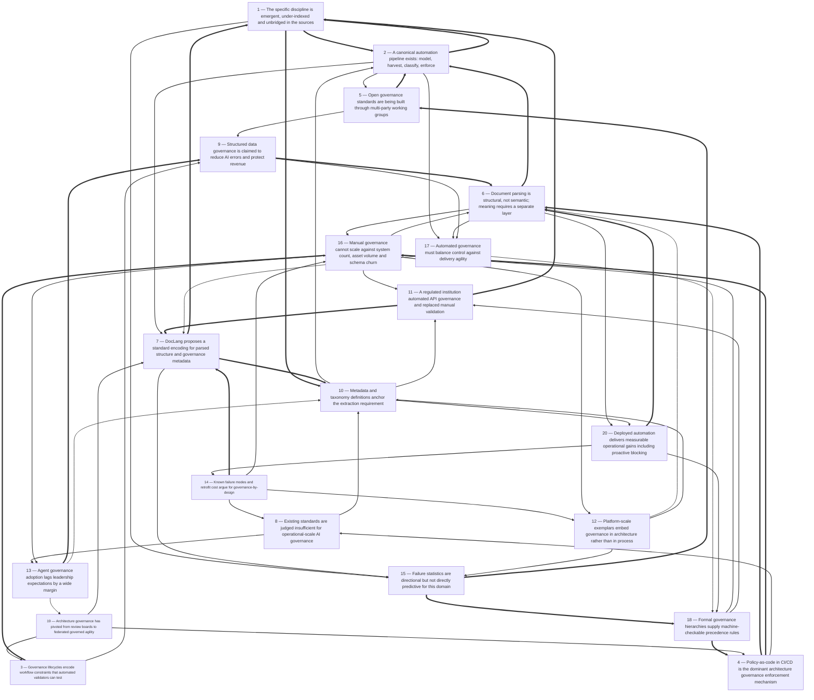

# Title: Across 27 captured sources the evidence describes a landscape that is real,…

## Corpus Quality Scoreboard

Quality: **51/100** - Grade C (Adequate)

```
[##########----------]  51/100
```

- Critic: review (coverage 80 | evidence 32 | balance 0 | tension 100)
- Sources: 27 gathered | 27 cited | 27 full text | 15 distinct domains | 5.4/8 average relevance
- Cited date span: 2025-2026 (22 undated)

## Topic

Determine what the landscape is for automated systems architecture govenance documentation parsing and validation is. The intent is to create standardised governance documentation from documents that may be incomplete or in the wrong format, and to extract standard metadata such as project and solution taxonomy

## Search Queries

- automated systems architecture governance documentation parsing validation
- standardized governance documentation from incomplete documents
- extract project solution taxonomy metadata from documents
- automated governance document validation and standardization
- systems architecture governance documentation metadata extraction
- parsing wrong format governance documents
- tools for automated governance documentation parsing
- systems architecture governance documentation automation

### Search Engine Summary

| Engine | Pages | PDFs | Videos | Total |
|--------|-------|------|--------|-------|
| langsearch | 8 | 0 | 0 | 8 |
| serper | 8 | 0 | 0 | 8 |
| wikipedia | 11 | 0 | 0 | 11 |

### Search Provider Requests

| Search Provider | Requests |
|-----------------|----------|
| mf_search | 8 |

## Executive Summary

Across 27 captured sources the evidence describes a landscape that is real, commercially active and adjacent to the research question, but not yet consolidated around it: automated governance is repeatedly justified by the argument that manual review cannot keep pace with system counts, asset volumes and daily schema change under regimes such as GDPR, BCBS 239, HIPAA and LGPD [#8][#19][#26], and the dominant enforcement mechanism described is policy-as-code embedded in CI/CD and delivery pipelines [#4][#6][#25], demonstrated in a regulated financial institution that replaced manual API validation with real-time rules-based enforcement, a versioned single source of truth and design-first validation [#27]. Document parsing itself is defined as a structural rather than semantic operation — decomposing headers, paragraphs, tables, form fields and lists into a machine-readable model [#13] — with DocLang, an LF AI & Data Foundation format, proposed to standardise encoding of parsed structure, layout, semantic meaning and governance metadata for interoperability [#13]. Formal governance document corpora do already exist with machine-checkable properties: Southern Cross University's rule defines an explicit precedence hierarchy (Australian Laws, By-Laws, Rules, Policies, Procedures, Guidelines) with triennial review, delegated amendment authority, waivable consultation and a 10-working-day publication window [#11][#12]. Standards coverage is contested at the operational layer, with SS&C arguing NIST and ISO 42001 do not fully address enterprise-scale AI agent deployment and publishing an open AI Governance Ledger built on portability, auditability by design, runtime observability, data sovereignty and operational resilience [#24]. Critically, no source in the corpus describes an end-to-end system that ingests incomplete or wrong-format *architecture governance* documents, validates them and emits standardised project/solution taxonomy metadata; the evidence is assembled from four non-citing literatures (document parsing, data governance automation, architecture governance practice, AI governance standards), and several retrieved sources (Roman Empire, border control, the World Wide Web) are noise, indicating an emergent and under-indexed discipline.

## Top 10 Implications

1. **Separate structural parsing from semantic validation.** ABBYY defines parsing as answering "what elements exist and where," not what they mean [#13], so a validator cannot be a parser; the architecture must include an explicit semantic rule layer or the system will produce structure without governance outcomes.
2. **Adopt the model → harvest → classify → enforce sequence.** ER/Studio, OvalEdge and Workday independently describe the same pipeline order and warn that automation only works on a foundation of accurate structural metadata [#8][#19][#26], so policy-as-code should be the last phase, not the first.
3. **Model exceptions, waivers and delegated authority as first-class rules.** SCU's procedure allows consultation to be waived by named roles and permits minor amendments by the Director, Governance Services [#11][#12], meaning simple required-field completeness checks will produce false failures.
4. **Expose validation as a CI/CD gate and fitness function.** Policy-as-code in CI/CD, domain ownership and guardrails are the described enforcement pattern [#6][#25], and the SmartBear case shows the approach working in a regulated institution [#27]; documentation validation must therefore emit machine-consumable pass/fail and scores.
5. **Extract a controlled-vocabulary taxonomy with stable identifiers and lineage.** Metadata is defined by its function in describing, locating, retrieving and managing other data [#9], and taxonomic databases are built on stable identifiers and hierarchical grouping [#10]; free-text tagging will not satisfy project/solution taxonomy needs.
6. **Budget for governance overhead and build provenance, human checkpoints and rollback into v1.** KORIX estimates governance adds 20–30% engineering effort but is roughly 3x harder to retrofit later [#7], and governed systems are defined as observable, auditable, human-supervised and rollback-ready [#7].
7. **Expect and mitigate false positives as a primary risk.** Translation of policy into executable logic, integration friction, cultural resistance and false positives are named challenges [#21], and a wrongly rejected governance artefact erodes delivery-team trust faster than a missed check.
8. **Design for schema versioning and multi-party consensus.** SS&C is forming a working group toward a v0.2 of its AI Governance Ledger for broader comment including regulators [#24], and standardisation is by definition consensus-based across firms, users and interest groups [#20]; a single-vendor schema will carry adoption risk.
9. **Treat the failure statistics as directional, not predictive.** The 85% AI-project non-production figure [#7], the 60% AI value failure by 2027 and sub-10% insights-driven maturity [#19], and the 80% data-governance strategy failure prediction [#26] come from different studies and units and are relayed by vendors; use KORIX's retrofit multiplier [#7] as the actionable business-case number instead.
10. **Commission primary evidence before committing to a platform.** No corpus source describes an end-to-end architecture-governance document validator, retrieval returned Roman history and border control as top-ranked summaries [#17][#18], and several sources are truncated [#3][#22]; the landscape is emergent and any build decision rests on extrapolation from adjacent domains.

## Open Questions

- Does any end-to-end system exist that ingests incomplete or wrong-format *architecture governance* documents, validates them and emits standardised project/solution taxonomy metadata? No source in the corpus describes one.
- What is DocLang's actual version, governance model, adoption and reference implementation, and is its governance-metadata dimension capable of carrying rule conformance or only description?
- Can the AI Governance Ledger, designed for AI governance, be transposed to architecture governance documentation, and what does its v0.2 working group produce?
- What false-positive and false-negative rates do deployed governance validators exhibit? Acceldata names false positives as a challenge but no source quantifies them [#21].
- How should precedence and tier rules from a legalistic hierarchy such as SCU's [#12] be generalised to corporate architecture governance, which typically lacks an equivalent rule instrument?
- Is there measurable evidence that governance automation improves or degrades delivery velocity, given that AWS [#25], Enov8 [#4] and Gadkari [#6] all assert a balance without reporting outcomes?
- What proportion of architecture governance documents are genuinely unstructured (prose, PDF, wiki) versus semi-structured (ADRs, reference architecture templates), and does that proportion make the ingestion problem tractable?
- Do the AI and data governance failure statistics (85%, 60%, 80%, sub-10%) transfer at all to architecture governance documentation, or are they being used outside their units of analysis [#7][#19][#26]?
- What schema should a project/solution taxonomy use — what are the identifier scheme, hierarchy depth, controlled vocabulary governance and change-management process? No source specifies one.
- How much of the 20–30% governance-effort estimate and the 3x retrofit multiplier [#7] holds for documentation governance specifically rather than for governed AI systems?
- What causes the 70-point gap between expected agent integration and 11% governance adoption [#5] — tooling absence, standards immaturity, or organisational prioritisation?
- Several captured sources were truncated mid-sentence [#3][#22]; does completing them change any conclusion, and what additional domain-specific sources exist that the retrieval did not surface?

## Data Quality & Consistency

**Overall verdict:** Proceed — the synthesis passes the deterministic 4-critic audit.

| Metric | Value | Detail |
|--------|-------|--------|
| Corpus critic | 51/100 (review) | coverage 80 · evidence 32 · balance 0 · tension 100 |
| Contradictions | 0 edge(s) | no edges |
| Source tensions | 10 tension(s) | 0 contradiction · 6 shallow · 4 isolated |
| Cross-locus reconcile | 3 pair(s) | 0 conflicting edge(s) |
| Synthesis audit | 100/100 (proceed) | 27 source(s) cited |

**Key concerns:**
- Corpus: Dimension 'Scalability' has only moderate support (3 source(s))
- Corpus: Dimension 'Adoption' has only surface-level support (1 source(s))
- Tension (shallow evidence): Adoption [#5] — surface evidence: only 1 source(s) mention this dimension.
- Tension (shallow evidence): Benefit [#23] — surface evidence: only 1 source(s) mention this dimension.
- Audit: Synthesis audit for 'Determine what the landscape is for automated systems architecture govenance documentation parsing and validation is. The intent is to create standardised governance documentation from documents that may be incomplete or in the wrong format, and to extract standard metadata such as project and solution taxonomy' scored 100/100 across critics [coverage=100 logic=100 evidence=100 readability=100]; 27/27 sources cited.

## Concepts

### 1. Metadata and Standards

**Definition:** Metadata, structured document models, and consensus-based standards provide the descriptive foundations and interoperability needed for governance, automation, and AI systems.

**Key Evidence:**
- Metadata is data that defines and describes other data, such as a book’s title, author, and publication date [#9]; document parsing turns documents into structural models of headers, paragraphs, tables, and spatial relationships [#13].
- DocLang aims to standardize parsed structure, layout, semantic meaning, and governance metadata for AI interoperability [#13]; standardization is the consensus-based development of technical standards [#20], and SmartBear API Hub replaced manual API validation with real-time rules-based compliance and centralized API definitions [#27].

### 2. AI Governance

**Definition:** AI governance creates controls and oversight so AI models and agents are observable, auditable, human-supervised, rollback-ready, and operationally resilient, especially in regulated environments.

**Key Evidence:**
- Governed AI is organized into five pillars—data governance, decision ownership, human-in-loop checkpoints, observability, and rollback architecture—and Gartner found roughly 85% of enterprise AI projects never reach production, largely due to neglected governance [#7].
- SS&C published the AI Governance Ledger as an open standard built on portability, auditability by design, runtime observability, data sovereignty/control, and operational resilience [#24].

### 3. Enterprise AI Architecture

**Definition:** Enterprise AI architecture is the technical framework and platform layer that enables autonomous AI agents to access data, make decisions, execute actions, and integrate across workflows within security and compliance boundaries.

**Key Evidence:**
- JPMorgan Chase’s AI operating system rests on three internally built platforms—OmniAI, JADE, and the model-agnostic LLM Suite—and supports 450+ production GenAI use cases [#2].
- AI agent architecture includes seven building blocks, such as environmental awareness/data ingestion, decision-making intelligence, planning, contextual memory, platform connectivity/action execution, workflow coordination, and RAG-based knowledge access [#5].

### 4. Governance Frameworks

**Definition:** Governance frameworks are structured decision-making and oversight systems that define how architecture, documents, and IT operations are approved, enforced, and aligned with strategy, standards, and compliance.

**Key Evidence:**
- Enterprise architecture governance is a decision-making framework built on decision, standards, and compliance governance, with components such as an Architecture Review Board and a seven-step continuous process [#4].
- SCU’s Governance Document Hierarchy places Australian Laws, By-Laws, Rules, Policies, Procedures, then Guidelines, with higher documents prevailing and Rules/Policies reviewed at least every three years [#12].

### 5. Automated Data Governance

**Definition:** Automated data governance uses AI-driven tools and code-driven workflows to continuously discover, classify, monitor, and enforce data policies directly within data infrastructure and pipelines, replacing manual periodic oversight.

**Key Evidence:**
- Workday defines data governance automation as code-driven workflows for continuous policy enforcement, metadata management, and lineage tracking, organized around data quality, stewardship, protection/compliance, and data management [#26].
- IBM’s 2023 report found organizations using AI and automation in security and compliance reduce breach lifecycle by 108 days on average, while Acceldata cites real-time PCI DSS validation and dynamic masking of sensitive fields [#21].

## Findings


### **Finding 1** — The specific discipline is emergent, under-indexed and unbridged in the sources

**Observation:**
Of 27 captured sources, several are encyclopedic entries with no bearing on governance documentation — Roman Empire [#17], Border control [#18], World Wide Web [#15], Qt (software) [#1], List of free and open-source software packages [#3], Artificial intelligence in healthcare [#16] and E-government [#22] — several of which are truncated mid-sentence [#3][#22]; no source describes an end-to-end system that ingests incomplete or wrong-format architecture governance documents, validates them and emits standardised project/solution taxonomy metadata.

**Analysis:**
The composition of the retrieved set is itself a finding about the landscape.

When a query on automated architecture governance documentation parsing returns engine-ranked summaries of Roman history, border control and the World Wide Web [#15][#17][#18], two explanations are available: the topic lacks a stable vocabulary and is therefore poorly indexed, or the retrieval matched on generic terms and the corpus overstates coverage.

Truncated captures [#3][#22] further limit what can be concluded and suggest corpus quality issues independent of topic.

More substantively, the relevant evidence is assembled from at least four literatures that do not cite one another: document parsing and representation [#13], automated data governance [#8][#19][#21][#23][#26], architecture governance practice [#4][#6], and AI governance standards [#7][#24].

None bridges parsing to architecture governance documents; the closest bridge is the API governance case, and it operates on already-structured inputs [#27].

This gap is simultaneously the principal research opportunity and the principal risk to any claim that a mature landscape exists.

The practical consequence is that a system built today would be synthesising from adjacent domains rather than conforming to an established design.

**Cross-reference / Dependencies:**
Qualifies every finding, particularly Finding 1 and Finding 2; builds on Finding 10 and Finding 15.

**Implication:**
Treat the landscape as emergent; commission primary evidence, including a domain-specific corpus inventory, before committing to a platform.

**Sources:**
- [1] Qt (software) — [https://en.wikipedia.org/wiki/Qt_(software)](https://en.wikipedia.org/wiki/Qt_(software))
- [3] List of free and open-source software packages — [https://en.wikipedia.org/wiki/List_of_free_and_open-source_software_packages](https://en.wikipedia.org/wiki/List_of_free_and_open-source_software_packages)
- [4] What Is Enterprise Architecture Governance? A Complete Guide [Enov8, @enov8inc] — [https://www.enov8.com/blog/enterprise-architecture-governance](https://www.enov8.com/blog/enterprise-architecture-governance)
- [6] Architecting for Agility: Architecture Governance in Modern Software Development [Swapnil Gadkari] — [https://www.linkedin.com/pulse/architecting-agility-architecture-governance-modern-software-gadkari-ykiwe](https://www.linkedin.com/pulse/architecting-agility-architecture-governance-modern-software-gadkari-ykiwe) (published 2025-06-02)
- [7] What Governed AI Actually Means (Before Your Audit Team Asks) [@] — [https://dev.to/korix/what-governed-ai-actually-means-before-your-audit-team-asks-233p](https://dev.to/korix/what-governed-ai-actually-means-before-your-audit-team-asks-233p) (published 2026-05-19)
- [8] Why Automated Data Governance Is No Longer Optional [Ryan Hirsch] — [https://erstudio.com/blog/automated-data-governance](https://erstudio.com/blog/automated-data-governance)
- [13] Document parsing: Structure for AI Extraction | ABBYY — [https://www.abbyy.com/glossary/what-is-document-parsing](https://www.abbyy.com/glossary/what-is-document-parsing)
- [15] World Wide Web — [https://en.wikipedia.org/wiki/World_Wide_Web](https://en.wikipedia.org/wiki/World_Wide_Web)
- [16] Artificial intelligence in healthcare — [https://en.wikipedia.org/wiki/Artificial_intelligence_in_healthcare](https://en.wikipedia.org/wiki/Artificial_intelligence_in_healthcare)
- [17] Roman Empire — [https://en.wikipedia.org/wiki/Roman_Empire](https://en.wikipedia.org/wiki/Roman_Empire)
- [18] Border control — [https://en.wikipedia.org/wiki/Border_control](https://en.wikipedia.org/wiki/Border_control)
- [19] Automated Data Governance: Benefits &amp; Practices - OvalEdge — [https://www.ovaledge.com/blog/automated-data-governance](https://www.ovaledge.com/blog/automated-data-governance)
- [21] In What Ways Does Automation Change the Effectiveness of Data Governance Programs? [Shivaram P R] — [https://www.acceldata.io/blog/why-automated-data-governance-actually-works](https://www.acceldata.io/blog/why-automated-data-governance-actually-works) (published 2026-05-19)
- [22] E-government — [https://en.wikipedia.org/wiki/E-government](https://en.wikipedia.org/wiki/E-government)
- [23] What is Data Governance Automation? Definition, Process &amp; Key Metrics — [https://www.hyperbots.com/glossary/data-governance-automation](https://www.hyperbots.com/glossary/data-governance-automation)
- [24] Why Enterprise AI Needs Open Governance Standards Now [Rob Stone] — [https://www.ssctech.com/blog/why-enterprise-ai-needs-open-governance-standards-now](https://www.ssctech.com/blog/why-enterprise-ai-needs-open-governance-standards-now) (published 2026-04-15)
- [26] Data Governance Automation: Benefits and Use Cases [@Workday] — [https://www.workday.com/en-us/perspectives/ai/benefits-of-data-governance-automation.html](https://www.workday.com/en-us/perspectives/ai/benefits-of-data-governance-automation.html)
- [27] Financial Institution Automates API Governance and Improves Standardization with API Hub for Design — [https://smartbear.com/resources/case-studies/financial-institution-automates-api-governance](https://smartbear.com/resources/case-studies/financial-institution-automates-api-governance)

**Source date range:** 2025-06-02..2026-05-19 (4 of 18 cited web sources dated)


### **Finding 2** — A canonical automation pipeline exists: model, harvest, classify, enforce

**Observation:**
ER/Studio recommends a phased approach — establish accurate models, automate metadata harvesting and catalog publishing, add classification and schema monitoring, then implement policy-as-code for high-risk domains — and reports reverse-engineering production databases such as Oracle, SQL Server, PostgreSQL and Snowflake into models in hours rather than weeks, publishing metadata to catalogs including Microsoft Purview, Collibra and Alation [#8]. OvalEdge organises automation around discovery/classification, metadata management, lineage/provenance, policy-as-code enforcement, stewardship and integrated platforms [#19]. Workday proposes four pillars — data quality, stewardship, protection/compliance, data management — and a unified platform with centralised metadata, a uniform policy engine, live lineage visualisation and an elastic integration layer [#26].

**Analysis:**
Three independent vendors converge on essentially the same pipeline shape and the same ordering, which is meaningful corroboration even accounting for the fact that all three sell into the same category and read the same analyst research.

The transferable insight for this research is the sequencing rule: authoritative models and metadata first, classification and monitoring second, enforcement third.

Applied to architecture governance documents, that implies establishing a canonical document schema and metadata model before attempting content validation, since a validator with no stable field model cannot distinguish non-conformance from non-parsing.

The phasing also addresses a specific failure mode — Acceldata names false positives as a challenge [#21] — which typically arises when enforcement runs ahead of classification quality.

Lineage/provenance appears in two of the three formulations [#19][#26] and connects to DocLang's inclusion of governance metadata in a standard representation [#13], suggesting provenance should be captured at parse time rather than reconstructed later.

The caveat is that each vendor positions its own product as the integration layer, so unanimity on pipeline shape coexists with disagreement about ownership.

**Cross-reference / Dependencies:**
Builds on Finding 1 and Finding 5; feeds Finding 7 and Finding 17.

**Implication:**
Adopt the model → harvest → classify → enforce sequence; starting with policy-as-code will amplify false positives.

**Sources:**
- [8] Why Automated Data Governance Is No Longer Optional [Ryan Hirsch] — [https://erstudio.com/blog/automated-data-governance](https://erstudio.com/blog/automated-data-governance)
- [13] Document parsing: Structure for AI Extraction | ABBYY — [https://www.abbyy.com/glossary/what-is-document-parsing](https://www.abbyy.com/glossary/what-is-document-parsing)
- [19] Automated Data Governance: Benefits &amp; Practices - OvalEdge — [https://www.ovaledge.com/blog/automated-data-governance](https://www.ovaledge.com/blog/automated-data-governance)
- [21] In What Ways Does Automation Change the Effectiveness of Data Governance Programs? [Shivaram P R] — [https://www.acceldata.io/blog/why-automated-data-governance-actually-works](https://www.acceldata.io/blog/why-automated-data-governance-actually-works) (published 2026-05-19)
- [26] Data Governance Automation: Benefits and Use Cases [@Workday] — [https://www.workday.com/en-us/perspectives/ai/benefits-of-data-governance-automation.html](https://www.workday.com/en-us/perspectives/ai/benefits-of-data-governance-automation.html)

**Source date range:** 2026-05-19 (1 of 5 cited web sources dated)


### **Finding 3** — Governance lifecycles encode workflow constraints that automated validators can test

**Observation:**
SCU's Procedure sets minimum drafting standards, stakeholder consultation waivable by an Executive or the Chair of the Academic Board, Policy Advisor assessment for Rules/Policies excluding HR Policy, endorsement by the relevant Executive, Academic Board or Director, approval by a Delegated Authority under the Delegations Rule, publication to the SCU Policy Library within 10 working days, and a prohibition on Work Units duplicating original RPPG files [#11].

**Analysis:**
These are completeness and workflow constraints of a kind software can evaluate without human judgement: presence or absence of a consultation record with an explicit waiver escape hatch, identity of the approver checked against a delegation register, and an elapsed-time test against a 10-working-day publication service level.

The waiver mechanism is analytically the most interesting element, because it forecloses a naive implementation — validation cannot be a required-field check when a named role can legitimately omit a field, so the engine must accept a documented exception, attribute it to an authorised role, and record it as a valid outcome.

That is the same exception-handling shape that policy-as-code practice anticipates in CI/CD enforcement [#6] and that ER/Studio implies when it stages policy-as-code last, after classification and monitoring are in place [#8].

The prohibition on Work Units duplicating original RPPG files [#11] additionally encodes a single-source-of-truth requirement that mirrors the API governance case study's centralisation of API definitions and version control [#27].

The evidence supports the conclusion that the difficult engineering in governance document automation lies in modelling exceptions, roles, delegation and duplication — not in text extraction.

**Cross-reference / Dependencies:**
Builds on Finding 3; parallels Finding 16 and Finding 9.

**Implication:**
Build a delegation- and waiver-aware rules engine; document-level completeness checks alone will generate false failures.

**Sources:**
- [6] Architecting for Agility: Architecture Governance in Modern Software Development [Swapnil Gadkari] — [https://www.linkedin.com/pulse/architecting-agility-architecture-governance-modern-software-gadkari-ykiwe](https://www.linkedin.com/pulse/architecting-agility-architecture-governance-modern-software-gadkari-ykiwe) (published 2025-06-02)
- [8] Why Automated Data Governance Is No Longer Optional [Ryan Hirsch] — [https://erstudio.com/blog/automated-data-governance](https://erstudio.com/blog/automated-data-governance)
- [11] Governance Documents Procedure / Document / Policy Library — [https://policies.scu.edu.au/document/view-current.php?id=190](https://policies.scu.edu.au/document/view-current.php?id=190)
- [27] Financial Institution Automates API Governance and Improves Standardization with API Hub for Design — [https://smartbear.com/resources/case-studies/financial-institution-automates-api-governance](https://smartbear.com/resources/case-studies/financial-institution-automates-api-governance)

**Source date range:** 2025-06-02 (1 of 4 cited web sources dated)


### **Finding 4** — Policy-as-code in CI/CD is the dominant architecture governance enforcement mechanism

**Observation:**
Enov8 lists embedding governance in delivery and CI-CD among best practices, alongside lightweight standards, decision velocity and updated artifacts [#4]; Gadkari describes modern governance embedding policy-as-code in CI/CD, using federated models for microservices, platform engineering and internal developer platforms, infrastructure as code, AI bill of materials, runtime behavioural policies, shift-left security and data mesh contracts [#6]; AWS defines automated governance as the strategic implementation of policies, processes and tools to manage and control IT operations, reducing manual intervention while improving scalability [#25].

**Analysis:**
Policy-as-code is the clearest existing enforcement mechanism in the corpus and the most probable integration point for a documentation validator: a validator running as a CI/CD gate can block a change that violates a standard, mirroring how API compliance was enforced in the SmartBear case where manual validation was replaced with real-time, rules-based enforcement [#27].

Gadkari's inclusion of architecture fitness functions and metrics such as deployment frequency and MTTR [#6] suggests validation output should be expressed as measurable fitness criteria rather than pass/fail prose review, enabling trend analysis and threshold tuning.

There is, however, an unresolved impedance mismatch at the heart of the research question: CI/CD enforcement presumes machine-readable inputs produced by engineering tooling, whereas governance documents are typically prose, PDFs or unstructured wiki pages.

The sources describe the enforcement half of the problem well and the ingestion half almost not at all, so a documentation validator inserted into CI/CD would need its own normalisation stage upstream — the problem Finding 1 identifies.

A secondary limitation is that none of these sources reports measured delivery-velocity outcomes, so enforcement benefit is asserted rather than demonstrated.

**Cross-reference / Dependencies:**
Builds on Finding 6; connects to Finding 16 and Finding 8.

**Implication:**
Expose validation as a CI/CD gate emitting fitness-function scores, with a normalisation stage upstream of the gate.

**Sources:**
- [4] What Is Enterprise Architecture Governance? A Complete Guide [Enov8, @enov8inc] — [https://www.enov8.com/blog/enterprise-architecture-governance](https://www.enov8.com/blog/enterprise-architecture-governance)
- [6] Architecting for Agility: Architecture Governance in Modern Software Development [Swapnil Gadkari] — [https://www.linkedin.com/pulse/architecting-agility-architecture-governance-modern-software-gadkari-ykiwe](https://www.linkedin.com/pulse/architecting-agility-architecture-governance-modern-software-gadkari-ykiwe) (published 2025-06-02)
- [25] Automated governance - DevOps Guidance — [https://docs.aws.amazon.com/wellarchitected/latest/devops-guidance/automated-governance.html](https://docs.aws.amazon.com/wellarchitected/latest/devops-guidance/automated-governance.html)
- [27] Financial Institution Automates API Governance and Improves Standardization with API Hub for Design — [https://smartbear.com/resources/case-studies/financial-institution-automates-api-governance](https://smartbear.com/resources/case-studies/financial-institution-automates-api-governance)

**Source date range:** 2025-06-02 (1 of 4 cited web sources dated)


### **Finding 5** — Open governance standards are being built through multi-party working groups

**Observation:**
SS&C published the AI Governance Ledger as an open standard built on five principles — portability, auditability by design, runtime observability, data sovereignty and control, and operational resilience — and is forming a working group of large enterprise firms across segments and regions to build consensus toward a v0.2 for broader industry comment, including regulators [#24]. Standardization is defined as developing technical standards based on consensus among firms, users, interest groups and standards organizations [#20], and ISO is characterised as an independent, non-governmental federation of the national standards organizations of its member countries [#14].

**Analysis:**
The AGL case shows the actual mechanism by which a governance documentation standard would come into being: not unilateral publication, but a draft circulated to large enterprises across segments and regions, iterated from version to version, with regulators invited into the comment process [#24].

This has a concrete planning consequence.

Any standardisation effort for architecture governance documentation must budget for consensus-building elapsed time and for multiple schema versions, and must therefore design for portability and version negotiation from v0.

1 rather than retrofitting them, since a corpus parsed into v0.

1 fields will need migration when v0.

2 lands.

The five principles also function as an assessment checklist for any proposed schema; "auditability by design" in particular implies that provenance — who approved an assertion, against which rule version — must be encoded in the artefact itself, which connects directly to DocLang's governance-metadata dimension [#13].

Two limitations apply: AGL is at v0.

2 stage with no adoption data in the corpus, and its scope is AI governance rather than architecture governance documents, making transposition analogical.

Standardisation theory [#20] nonetheless confirms that a single-vendor format faces a structurally different adoption path than a consensus one.

**Cross-reference / Dependencies:**
Builds on Finding 2 and Finding 9.

**Implication:**
Mirror or join a working-group process; make schema versioning and provenance explicit from the first release.

**Sources:**
- [13] Document parsing: Structure for AI Extraction | ABBYY — [https://www.abbyy.com/glossary/what-is-document-parsing](https://www.abbyy.com/glossary/what-is-document-parsing)
- [14] International Organization for Standardization — [https://en.wikipedia.org/wiki/International_Organization_for_Standardization](https://en.wikipedia.org/wiki/International_Organization_for_Standardization)
- [20] Standardization — [https://en.wikipedia.org/wiki/Standardization](https://en.wikipedia.org/wiki/Standardization)
- [24] Why Enterprise AI Needs Open Governance Standards Now [Rob Stone] — [https://www.ssctech.com/blog/why-enterprise-ai-needs-open-governance-standards-now](https://www.ssctech.com/blog/why-enterprise-ai-needs-open-governance-standards-now) (published 2026-04-15)

**Source date range:** 2026-04-15 (1 of 4 cited web sources dated)


### **Finding 6** — Document parsing is structural, not semantic; meaning requires a separate layer

**Observation:**
ABBYY defines document parsing as decomposing a document into structural components — headers, paragraphs, tables, form fields, lists — and their spatial relationships to create a machine-readable representation of document organisation, describing it as "structural rather than semantic, answering what elements exist and where," yielding a structured document model for downstream extraction [#13].

**Analysis:**
This definitional boundary is the single most consequential constraint on the research question.

If parsing is by construction limited to structure, then a parsing-only pipeline cannot determine whether a governance document satisfies a rule or which solution taxonomy a described system belongs to — those are semantic judgements requiring a separate validation and classification stage.

The evidence therefore implies at minimum a three-stage architecture: structural parse, semantic validation, standardised emission.

ABBYY notes that advanced parsers handle multi-column text, nested tables and embedded images with captions [#13], all of which matter because governance documents routinely embed decision tables, review schedules and role matrices.

A countervailing consideration is that the structural/semantic split may be vendor framing that supports a two-product sales motion rather than a fundamental law; nonetheless it is corroborated indirectly by ER/Studio's insistence that automation pays off "only on a foundation of accurate structural metadata" [#8], which treats structure as prerequisite rather than substitute.

Testing against the SCU corpus is instructive: the operative content of the Procedure — a 10-working-day publication window, waivable consultation, Policy Advisor assessment — is prose rather than tabular [#11], so structural parsing alone recovers very little of what a validator must check.

The limitation is that no source demonstrates a measured parse-to-validation pipeline, so the three-stage claim is inferred from definitions rather than observed.

**Cross-reference / Dependencies:**
Prerequisite to Finding 2, Finding 6, Finding 16 and Finding 17; qualified by Finding 20.

**Implication:**
Architect the system with an explicit semantic layer; do not expect a parser to deliver validated governance outcomes or taxonomy assignments.

**Sources:**
- [8] Why Automated Data Governance Is No Longer Optional [Ryan Hirsch] — [https://erstudio.com/blog/automated-data-governance](https://erstudio.com/blog/automated-data-governance)
- [11] Governance Documents Procedure / Document / Policy Library — [https://policies.scu.edu.au/document/view-current.php?id=190](https://policies.scu.edu.au/document/view-current.php?id=190)
- [13] Document parsing: Structure for AI Extraction | ABBYY — [https://www.abbyy.com/glossary/what-is-document-parsing](https://www.abbyy.com/glossary/what-is-document-parsing)

**Source date range:** — (cited web sources did not expose a publication date)


### **Finding 7** — DocLang proposes a standard encoding for parsed structure and governance metadata

**Observation:**
DocLang, an AI-native document representation format under the LF AI & Data Foundation, aims to standardize encoding of parsed structure, layout, semantic meaning and governance metadata for interoperability across AI models, platforms and agentic workflows [#13].

**Analysis:**
This is the most directly on-topic artefact in the entire corpus, because it targets precisely the output format implied by "standardised governance documentation": a portable representation that carries governance metadata alongside parsed structure.

Three implications follow.

First, the target state may be conformance to an external schema rather than a bespoke internal format, which changes build-versus-adopt economics.

Second, its hosting under a foundation rather than a single vendor aligns with standardisation theory that standards develop by consensus among firms, users, interest groups and standards organisations [#20], and with ISO's character as an independent non-governmental federation of national standards bodies [#14] — a signal of legitimacy that a corporate proprietary schema would lack.

Third, listing "governance metadata" as one of four encoded dimensions suggests the drafters expect governance assertions to be first-class content rather than annotation, which would allow validation rules to operate over the format itself.

The evidence limitation is severe: the source provides no version, adoption figures, governance model or reference implementation, and no other source in the corpus mentions DocLang, so claims of maturity would be unsupported.

Its inclusion nonetheless reframes the research question from "how do we standardise governance documents" to "which emerging standard do we conform to."

**Cross-reference / Dependencies:**
Builds on Finding 1; relates to Finding 10 and Finding 15.

**Implication:**
Track DocLang as the likeliest external schema target, but treat it as unproven until adoption or implementation evidence appears.

**Sources:**
- [13] Document parsing: Structure for AI Extraction | ABBYY — [https://www.abbyy.com/glossary/what-is-document-parsing](https://www.abbyy.com/glossary/what-is-document-parsing)
- [14] International Organization for Standardization — [https://en.wikipedia.org/wiki/International_Organization_for_Standardization](https://en.wikipedia.org/wiki/International_Organization_for_Standardization)
- [20] Standardization — [https://en.wikipedia.org/wiki/Standardization](https://en.wikipedia.org/wiki/Standardization)

**Source date range:** — (cited web sources did not expose a publication date)


### **Finding 8** — Existing standards are judged insufficient for operational-scale AI governance

**Observation:**
SS&C argues that existing standards such as NIST and ISO 42001 do not fully address the operational complexity of deploying AI agents at enterprise scale, in a context of operating thousands of automated processes across fund administration, reconciliation, regulatory reporting and client communications in regulated environments requiring consistent, explainable, auditable outcomes [#24]; Gadkari identifies AI bill of materials and runtime behavioural policies as emerging practice [#6].

**Analysis:**
This is a direct claim from an operator that the standards landscape has a gap at the operational layer — the same layer this research targets for architecture governance documentation.

If a firm running thousands of automated processes in regulated fund administration judges NIST and ISO 42001 coverage incomplete, then a generic document-standardisation approach is unlikely to be sufficient; the output schema would need to carry runtime-observability and auditability semantics, not merely project and solution taxonomy.

That materially expands the requirements from classification to evidence-of-control.

The claim carries an obvious incentive: the author simultaneously proposes its own standard, so there is a reason to find the gap wide.

Corroboration in the corpus is indirect — monday.com cites Gartner that AI-agent governance adoption stands at only 11% [#5], consistent with immature standards and low coverage.

There is also a plausible alternative reading: the gap may lie in adoption and interpretation of existing standards rather than in their content, in which case tooling that improves conformance checking would close it.

The safest inference for design is that any schema adopted now should be extensible to control requirements that are still in motion.

**Cross-reference / Dependencies:**
Feeds Finding 10; connects to Finding 13.

**Implication:**
Design an extensible, versioned control schema and plan for periodic schema revision rather than a fixed field set.

**Sources:**
- [5] AI agent architecture: the blueprint for autonomous AI that works across your organization [Naama Oren] — [https://monday.com/blog/ai-agents/ai-agent-architecture](https://monday.com/blog/ai-agents/ai-agent-architecture)
- [6] Architecting for Agility: Architecture Governance in Modern Software Development [Swapnil Gadkari] — [https://www.linkedin.com/pulse/architecting-agility-architecture-governance-modern-software-gadkari-ykiwe](https://www.linkedin.com/pulse/architecting-agility-architecture-governance-modern-software-gadkari-ykiwe) (published 2025-06-02)
- [24] Why Enterprise AI Needs Open Governance Standards Now [Rob Stone] — [https://www.ssctech.com/blog/why-enterprise-ai-needs-open-governance-standards-now](https://www.ssctech.com/blog/why-enterprise-ai-needs-open-governance-standards-now) (published 2026-04-15)

**Source date range:** 2025-06-02..2026-04-15 (2 of 3 cited web sources dated)


### **Finding 9** — Structured data governance is claimed to reduce AI errors and protect revenue

**Observation:**
monday.com cites MIT that poor data quality causes 15–25% revenue loss and that structured data governance can reduce AI errors by up to 80% [#5]; OvalEdge's Bayview Financial Services case reports auto-monitoring and error resolution within minutes instead of hours following automation of data quality rule execution, issue ticketing, real-time error detection and routing, and metadata/compliance workflows [#19].

**Analysis:**
These figures quantify the payoff for the structured-data prerequisite that both monday.com and ER/Studio identify [#5][#8], and they matter here because governance documents are themselves a data source for downstream AI systems.

The mechanism is worth stating precisely: structured, governed data improves AI outcomes because retrieval and reasoning operate over consistent, typed fields rather than inferred or ambiguous ones — so a governance document parsed into validated typed metadata (document type, owner, review status, solution taxonomy, control reference) should improve the reliability of any retrieval or agent that consumes it.

The 80% error-reduction figure is a claim about AI error rates rather than document-processing accuracy, so applying it to this domain requires an assumption that document-derived metadata behaves like governed operational data, which the sources do not establish.

Bayview's minutes-versus-hours result is the more directly transferable operational metric, drawn from a named institution migrating from on-premise infrastructure to a Snowflake cloud data warehouse using OvalEdge with Matillion [#19], though it is a vendor-authored case without disclosed methodology, baseline or measurement period.

The two data points together support a KPI-driven approach to justification.

**Cross-reference / Dependencies:**
Builds on Finding 6 and Finding 17.

**Implication:**
Adopt metadata completeness, accuracy and freshness as primary KPIs, and instrument remediation latency as a secondary metric.

**Sources:**
- [5] AI agent architecture: the blueprint for autonomous AI that works across your organization [Naama Oren] — [https://monday.com/blog/ai-agents/ai-agent-architecture](https://monday.com/blog/ai-agents/ai-agent-architecture)
- [8] Why Automated Data Governance Is No Longer Optional [Ryan Hirsch] — [https://erstudio.com/blog/automated-data-governance](https://erstudio.com/blog/automated-data-governance)
- [19] Automated Data Governance: Benefits &amp; Practices - OvalEdge — [https://www.ovaledge.com/blog/automated-data-governance](https://www.ovaledge.com/blog/automated-data-governance)

**Source date range:** — (cited web sources did not expose a publication date)


### **Finding 10** — Metadata and taxonomy definitions anchor the extraction requirement

**Observation:**
Metadata is defined as data that defines and describes the characteristics of other data, helping to describe, explain, locate, retrieve, use or manage it, with a book's title, author and publication date as illustrative examples [#9]; a taxonomic database is defined as a database created to hold information on biological taxa to support efficient data management and information retrieval [#10]; JPMorgan's JADE data mesh is described as managing 500+ petabytes with embedded lineage, discovery, access controls and model lifecycle management [#2].

**Analysis:**
These simple definitions carry disproportionate weight because they anchor the second half of the research question — extracting standard metadata such as project and solution taxonomy — in established function rather than convenience.

The metadata definition establishes that extracted fields must serve description, location, retrieval, use and management [#9], which argues for controlled vocabularies over free-text tags: a free-text "solution type" field cannot reliably support retrieval or aggregation, whereas a governed value set can.

The taxonomic database definition contributes two structural properties that map cleanly onto project/solution taxonomy: a stable identifier per classified entity, and hierarchical grouping that permits both broad and narrow queries [#10].

A solution should therefore receive a durable identifier plus a position in a hierarchy, enabling assignment, cross-reference and rollback when taxonomy revisions occur.

JADE's embedded lineage, discovery and access controls at 500+ petabyte scale [#2] demonstrates the industrial form of the same idea, where metadata is not a by-product of the platform but the mechanism through which control is exercised.

The limitation is that the taxonomic database source concerns biological taxa, so the analogy is structural rather than domain-validated, and no source in the corpus specifies a project or solution taxonomy schema.

**Cross-reference / Dependencies:**
Underpins Finding 2, Finding 11 and Finding 20.

**Implication:**
Define a controlled-vocabulary taxonomy with stable identifiers, hierarchy and lineage fields before building extraction.

**Sources:**
- [2] JPMorgan&amp;#39;s AI Operating System Boosts Efficiency and Value | Dhanasekhar D. posted on the topic | LinkedIn [Dhanasekhar D.] — [https://www.linkedin.com/posts/1dhana_inside-jpmcs-ai-operating-system-a-fully-activity-7472098142189060096-JPnQ](https://www.linkedin.com/posts/1dhana_inside-jpmcs-ai-operating-system-a-fully-activity-7472098142189060096-JPnQ) (published 2026-06-15)
- [9] Metadata — [https://en.wikipedia.org/wiki/Metadata](https://en.wikipedia.org/wiki/Metadata)
- [10] Taxonomic database — [https://en.wikipedia.org/wiki/Taxonomic_database](https://en.wikipedia.org/wiki/Taxonomic_database)

**Source date range:** 2026-06-15 (1 of 3 cited web sources dated)


### **Finding 11** — A regulated institution automated API governance and replaced manual validation

**Observation:**
A leading financial institution adopted SmartBear's API Hub for Design to improve API governance and meet internal and industry compliance requirements, replacing manual API validation with real-time, rules-based compliance enforcement, centralising API definitions and version control as a single source of truth, and using API mocking to enable earlier frontend-backend collaboration and design-first validation; the institution reported reduced errors, faster API approvals, improved alignment between teams and stakeholders, and shorter development cycle times [#27].

**Analysis:**
This is the closest analogue in the corpus to the target system, and unusually it is a deployment case in a regulated financial institution rather than a vendor guidance article.

Four design choices transfer.

First, rules-based real-time enforcement replaced periodic manual review, which addresses the latency problem that Finding 5 identifies as the core scaling failure.

Second, a versioned single source of truth for definitions prevents the duplication problem SCU's procedure explicitly prohibits [#11].

Third, design-first validation checks artefacts before implementation, which for governance documents corresponds to validating a proposed architecture document or standard before the architecture is built, matching policy-as-code's shift-left orientation [#6].

Fourth, mocking enabled parallel collaboration, for which a stub or draft governance document is a weaker but plausible analogue.

The critical caveat is the input type: API specifications are already machine-readable contracts, whereas the documents in this research question are frequently prose, PDFs or inconsistently structured pages.

The case therefore proves automation works where inputs are structured and says nothing about the harder ingestion and normalisation problem.

It is also a vendor-authored single-institution study with no baseline metrics or measurement period disclosed.

**Cross-reference / Dependencies:**
Builds on Finding 7; contrasted with Finding 1.

**Implication:**
Adopt rules-based design-first validation with a versioned single source of truth, but scope a separate normalisation component for unstructured inputs.

**Sources:**
- [6] Architecting for Agility: Architecture Governance in Modern Software Development [Swapnil Gadkari] — [https://www.linkedin.com/pulse/architecting-agility-architecture-governance-modern-software-gadkari-ykiwe](https://www.linkedin.com/pulse/architecting-agility-architecture-governance-modern-software-gadkari-ykiwe) (published 2025-06-02)
- [11] Governance Documents Procedure / Document / Policy Library — [https://policies.scu.edu.au/document/view-current.php?id=190](https://policies.scu.edu.au/document/view-current.php?id=190)
- [27] Financial Institution Automates API Governance and Improves Standardization with API Hub for Design — [https://smartbear.com/resources/case-studies/financial-institution-automates-api-governance](https://smartbear.com/resources/case-studies/financial-institution-automates-api-governance)

**Source date range:** 2025-06-02 (1 of 3 cited web sources dated)


### **Finding 12** — Platform-scale exemplars embed governance in architecture rather than in process

**Observation:**
JPMorgan Chase's "AI operating system" rests on three internally built platforms: OmniAI ML factory for standardized data access, model training/testing/deployment and governance; JADE, an AWS/Databricks/Snowflake/MongoDB data mesh managing 500+ petabytes with embedded lineage, discovery, access controls and model lifecycle management; and the model-agnostic LLM Suite GenAI portal, connecting internal databases to OpenAI and Anthropic models and updating connections every eight weeks, with GPT-4o primary and Claude secondary and the architecture designed to swap or upgrade models without re-platforming [#2].

**Analysis:**
This is the mature end state described in the corpus: governance operating as platform capability rather than as a review process, at a scale — 91 million customers, 373 billion annual digital interactions, 450+ production GenAI use cases, 200,000+ daily LLM Suite users, 40,000+ engineers with AI coding tools, 2,000+ AI/ML specialists — where manual review of documentation is inconceivable [#2].

Two design lessons transfer directly.

First, model-agnosticism with an eight-week connection refresh cycle means the governance documentation layer must outlive the model and parser layer, so schemas, metadata and rule definitions must not be coupled to a specific model vendor or parsing engine; this is the same portability principle SS&C names first among its five AGL principles [#24].

Second, embedding lineage and access controls within the data mesh rather than in a separate register suggests governance metadata belongs alongside the artefact it describes, supporting the parse-time provenance capture that DocLang's format envisions [#13].

The evidence quality is weak — a single LinkedIn post summarising second-hand figures, with the $1.

3 billion AI investment and $1.

5–2.

0 billion annual business value unverified — so this should be read as an illustrative architecture pattern, not a benchmark.

It remains the only corpus source showing integrated governance at genuine scale.

**Cross-reference / Dependencies:**
Relates to Finding 6, Finding 10 and Finding 15.

**Implication:**
Decouple the governance schema from any single model or parser vendor, and store governance metadata with the artefact it governs.

**Sources:**
- [2] JPMorgan&amp;#39;s AI Operating System Boosts Efficiency and Value | Dhanasekhar D. posted on the topic | LinkedIn [Dhanasekhar D.] — [https://www.linkedin.com/posts/1dhana_inside-jpmcs-ai-operating-system-a-fully-activity-7472098142189060096-JPnQ](https://www.linkedin.com/posts/1dhana_inside-jpmcs-ai-operating-system-a-fully-activity-7472098142189060096-JPnQ) (published 2026-06-15)
- [13] Document parsing: Structure for AI Extraction | ABBYY — [https://www.abbyy.com/glossary/what-is-document-parsing](https://www.abbyy.com/glossary/what-is-document-parsing)
- [24] Why Enterprise AI Needs Open Governance Standards Now [Rob Stone] — [https://www.ssctech.com/blog/why-enterprise-ai-needs-open-governance-standards-now](https://www.ssctech.com/blog/why-enterprise-ai-needs-open-governance-standards-now) (published 2026-04-15)

**Source date range:** 2026-04-15..2026-06-15 (2 of 3 cited web sources dated)


### **Finding 13** — Agent governance adoption lags leadership expectations by a wide margin

**Observation:**
monday.com cites Gartner that AI agent governance adoption is 11%, alongside Microsoft's 2025 Work Trend Index finding that 81% of leaders expect moderate-to-extensive agent integration within 12–18 months [#5].

**Analysis:**
The roughly 70-point gap between expectation and governance adoption is the clearest evidence in the corpus of an implementation lag that documentation automation could plausibly narrow.

If agents are integrated into workflows faster than governance instruments are established, the governance artefacts — policies, standards, architecture decisions, control registers — must be produced and validated at a rate matching deployment, which is precisely the bottleneck manual drafting and review impose.

It also implies demand will be concentrated in a near-term window rather than spread evenly, which affects prioritisation for anyone building capability now.

Two cautions temper the inference.

First, adoption statistics measure whether governance exists, not whether it functions, so an increase in nominal adoption could coexist with unchanged risk.

Second, the figures are relayed second-hand by a vendor citing Gartner and Microsoft without describing survey populations or question wording, so precision should not be assumed.

Even heavily discounted, the direction is consistent with SS&C's claim that standards have not kept pace with operational deployment [#24], and with the corpus-wide absence of any source describing a deployed architecture-governance document validator.

The gap therefore describes both a market opening and an evidence vacuum.

**Cross-reference / Dependencies:**
Builds on Finding 9 and Finding 10; relates to Finding 19.

**Implication:**
Target the near-term window but commission primary research to verify the adoption gap in the specific sector being addressed.

**Sources:**
- [5] AI agent architecture: the blueprint for autonomous AI that works across your organization [Naama Oren] — [https://monday.com/blog/ai-agents/ai-agent-architecture](https://monday.com/blog/ai-agents/ai-agent-architecture)
- [24] Why Enterprise AI Needs Open Governance Standards Now [Rob Stone] — [https://www.ssctech.com/blog/why-enterprise-ai-needs-open-governance-standards-now](https://www.ssctech.com/blog/why-enterprise-ai-needs-open-governance-standards-now) (published 2026-04-15)

**Source date range:** 2026-04-15 (1 of 2 cited web sources dated)


### **Finding 14** — Known failure modes and retrofit cost argue for governance-by-design

**Observation:**
Acceldata names challenges including translating policy into executable logic, tool integration friction, cultural resistance and false positives [#21]; KORIX estimates governance adds 20–30% engineering effort but is about 3x harder to retrofit later, and defines governed AI as observable, auditable, human-supervised, rollback-ready and owned by the team across five pillars: data governance, decision ownership, human-in-loop checkpoints, observability and rollback architecture [#7].

**Analysis:**
The named failure modes are the strongest available argument for treating validation as a design-time rather than audit-time concern.

Policy translation is the crux, and the SCU sources demonstrate both the difficulty and its tractability: a rule written as prose ("consultation may be waived by an Executive or the Chair, Academic Board") must become an executable predicate with a defined exception path and an authorised-role binding [#11][#12], which is achievable in principle but for which no source in the corpus offers automating tooling.

Integration friction and cultural resistance are organisational rather than technical and would apply to any validator imposed on delivery teams, connecting directly to Gadkari's call for psychological safety and shared responsibility alongside automated compliance [#6].

False positives deserve particular attention because in a document validator a wrongly rejected artefact erodes delivery-team trust faster than a missed check, and once trust is lost the gate is circumvented; Acceldata names the problem but quantifies nothing [#21], so threshold calibration will be empirical.

The 3x retrofit multiplier [#7] is the most actionable figure in the corpus: it argues for building provenance, human checkpoints and rollback semantics into the metadata schema at version one rather than adding them after an audit or incident.

**Cross-reference / Dependencies:**
Builds on Finding 7 and Finding 16; qualified by Finding 8; informs Finding 12.

**Implication:**
Budget 20–30% overhead and include rollback, provenance and human checkpoints in the initial schema rather than as later additions.

**Sources:**
- [6] Architecting for Agility: Architecture Governance in Modern Software Development [Swapnil Gadkari] — [https://www.linkedin.com/pulse/architecting-agility-architecture-governance-modern-software-gadkari-ykiwe](https://www.linkedin.com/pulse/architecting-agility-architecture-governance-modern-software-gadkari-ykiwe) (published 2025-06-02)
- [7] What Governed AI Actually Means (Before Your Audit Team Asks) [@] — [https://dev.to/korix/what-governed-ai-actually-means-before-your-audit-team-asks-233p](https://dev.to/korix/what-governed-ai-actually-means-before-your-audit-team-asks-233p) (published 2026-05-19)
- [11] Governance Documents Procedure / Document / Policy Library — [https://policies.scu.edu.au/document/view-current.php?id=190](https://policies.scu.edu.au/document/view-current.php?id=190)
- [12] Governance Documents Rule / Document / Policy Library — [https://policies.scu.edu.au/document/view-current.php?id=159](https://policies.scu.edu.au/document/view-current.php?id=159)
- [21] In What Ways Does Automation Change the Effectiveness of Data Governance Programs? [Shivaram P R] — [https://www.acceldata.io/blog/why-automated-data-governance-actually-works](https://www.acceldata.io/blog/why-automated-data-governance-actually-works) (published 2026-05-19)

**Source date range:** 2025-06-02..2026-05-19 (3 of 5 cited web sources dated)


### **Finding 15** — Failure statistics are directional but not directly predictive for this domain

**Observation:**
Gartner (2022) is cited that roughly 85% of enterprise AI projects never reach production, attributed mainly to neglecting governance systems around models [#7]; OvalEdge cites Gartner's 2024 prediction that by 2027 60% of organizations will fail to realize the anticipated value of their AI use cases due to incohesive data governance frameworks [#19]; Workday cites Gartner that 80% of data governance strategies will fail by 2027 without a catalyst for change [#26].

**Analysis:**
These figures function in the corpus as urgency devices, and they should be handled with matching scepticism.

They originate in different Gartner studies across different years, use different units of analysis — AI projects, AI business value, data governance strategies — and are all relayed by vendors with a direct commercial interest in the pessimistic conclusion, which is a classic pathway for statistic drift.

Their analytic value for this research is diagnostic rather than predictive: the recurring attributed cause is governance around systems rather than model capability, which is structurally the same class of problem as governance documentation that is incomplete, stale or in the wrong format.

If the root cause is governance, then tooling that renders governance artefacts machine-checkable addresses a named cause.

A plausible counter-reading is that non-production reflects prioritisation, funding and organisational factors that documentation automation cannot remediate, and no source offers a controlled comparison or a mechanism-level account.

The more defensible number in the corpus is KORIX's estimate that governance adds 20–30% engineering effort but is roughly 3x harder to retrofit later [#7], because it is framed as a cost trade-off between two design timings rather than as a population failure rate.

**Cross-reference / Dependencies:**
Builds on Finding 5; informs Finding 18.

**Implication:**
Build the business case on the retrofit multiplier and internal metrics, not on published failure rates.

**Sources:**
- [7] What Governed AI Actually Means (Before Your Audit Team Asks) [@] — [https://dev.to/korix/what-governed-ai-actually-means-before-your-audit-team-asks-233p](https://dev.to/korix/what-governed-ai-actually-means-before-your-audit-team-asks-233p) (published 2026-05-19)
- [19] Automated Data Governance: Benefits &amp; Practices - OvalEdge — [https://www.ovaledge.com/blog/automated-data-governance](https://www.ovaledge.com/blog/automated-data-governance)
- [26] Data Governance Automation: Benefits and Use Cases [@Workday] — [https://www.workday.com/en-us/perspectives/ai/benefits-of-data-governance-automation.html](https://www.workday.com/en-us/perspectives/ai/benefits-of-data-governance-automation.html)

**Source date range:** 2026-05-19 (1 of 3 cited web sources dated)


### **Finding 16** — Manual governance cannot scale against system count, asset volume and schema churn

**Observation:**
ER/Studio argues manual governance cannot keep up with enterprises running hundreds of systems, thousands of assets and daily schema changes under GDPR, BCBS 239, HIPAA and Brazil's LGPD [#8]; Workday cites Gartner predicting 80% of data governance strategies will fail by 2027 without a catalyst for change [#26]; OvalEdge cites Gartner that by 2027 60% of organizations will fail to realize anticipated AI value due to incohesive data governance frameworks, and Forrester's 2023 finding that fewer than 10% of enterprises are advanced in insights-driven capabilities [#19].

**Analysis:**
The volume-and-velocity argument is the strongest justification in the corpus for automating governance documentation handling, because it is structural rather than rhetorical: if asset counts and change rates exceed human review capacity, then documentation artefacts describing those systems will drift out of alignment unless they are parsed, validated and refreshed by machine, and drift is precisely the failure that governance documents exist to prevent.

The three statistics require careful handling.

They come from different studies, different years and different units of analysis — AI projects that never reach production, AI business value not realised, data governance strategies failing, insights-driven maturity — so they cannot be aggregated into a single failure rate, and each is relayed by a vendor with a commercial interest in the pessimistic conclusion.

Their directional agreement is nevertheless consistent: governance investment lags technology investment.

More importantly, all three concern data and AI governance rather than architecture governance documentation, so applying them to this research question is an extrapolation rather than a finding.

That extrapolation is plausible because architecture documents describe the same systems, but it is unevidenced and should be tested institution-specifically rather than assumed.

**Cross-reference / Dependencies:**
Motivates Finding 6, Finding 11 and Finding 13; qualified by Finding 12.

**Implication:**
Use the scale argument to justify automation budget, but validate volumes and change rates against the adopting organisation's own corpus.

**Sources:**
- [8] Why Automated Data Governance Is No Longer Optional [Ryan Hirsch] — [https://erstudio.com/blog/automated-data-governance](https://erstudio.com/blog/automated-data-governance)
- [19] Automated Data Governance: Benefits &amp; Practices - OvalEdge — [https://www.ovaledge.com/blog/automated-data-governance](https://www.ovaledge.com/blog/automated-data-governance)
- [26] Data Governance Automation: Benefits and Use Cases [@Workday] — [https://www.workday.com/en-us/perspectives/ai/benefits-of-data-governance-automation.html](https://www.workday.com/en-us/perspectives/ai/benefits-of-data-governance-automation.html)

**Source date range:** — (cited web sources did not expose a publication date)


### **Finding 17** — Automated governance must balance control against delivery agility

**Observation:**
AWS's DevOps Guidance defines automated governance as balancing agility and control, providing assurance and accountability while enabling innovation and rapid deployment [#25]; Gadkari reports the shift from waterfall-era bureaucratic oversight rooted in TOGAF and Zachman toward "governed agility," notes that decentralisation following agile and domain-driven design caused fragmentation and technical debt including one application rearchitected within three years, and cites Gartner that over 75% of enterprises are restarting or reinventing architecture programs [#6]; Enov8 lists "lightweight standards" and decision velocity among best practices [#4].

**Analysis:**
This framing is not merely positioning — it defines the design constraint that determines whether a document validator is adopted or bypassed.

Architecture governance earned a reputation for bureaucratic delay during the waterfall era, and Gadkari's account documents a genuine oscillation: centralised oversight gave way to decentralised decisions, which produced fragmentation and debt, which is now driving more than three-quarters of enterprises to restart architecture programmes [#6].

An automated validator can reproduce either failure mode.

If it imposes mandatory full-document review with blocking severity on all findings, it recreates the bottleneck at machine speed; if it applies graded severity, routes only exceptions to humans and defers non-critical findings, it can deliver assurance without the delay.

AWS's definition explicitly couples assurance and accountability with innovation and rapid deployment in the same sentence [#25], and Enov8's emphasis on lightweight standards and decision velocity [#4] reinforces the constraint.

The evidence limitation is that these are vendor guidance documents; none reports measured delivery-velocity outcomes attributable to governance automation, so the balance claim is normative rather than empirically established.

**Cross-reference / Dependencies:**
Contradicts a strict-enforcement reading of Finding 7; connects to Finding 18.

**Implication:**
Tune severity thresholds and route only exceptions to human reviewers; blocking defaults will drive workarounds.

**Sources:**
- [4] What Is Enterprise Architecture Governance? A Complete Guide [Enov8, @enov8inc] — [https://www.enov8.com/blog/enterprise-architecture-governance](https://www.enov8.com/blog/enterprise-architecture-governance)
- [6] Architecting for Agility: Architecture Governance in Modern Software Development [Swapnil Gadkari] — [https://www.linkedin.com/pulse/architecting-agility-architecture-governance-modern-software-gadkari-ykiwe](https://www.linkedin.com/pulse/architecting-agility-architecture-governance-modern-software-gadkari-ykiwe) (published 2025-06-02)
- [25] Automated governance - DevOps Guidance — [https://docs.aws.amazon.com/wellarchitected/latest/devops-guidance/automated-governance.html](https://docs.aws.amazon.com/wellarchitected/latest/devops-guidance/automated-governance.html)

**Source date range:** 2025-06-02 (1 of 3 cited web sources dated)


### **Finding 18** — Formal governance hierarchies supply machine-checkable precedence rules

**Observation:**
Southern Cross University's Governance Documents Rule defines a Governance Document Hierarchy — Australian Laws, By-Laws, Rules, Policies, Procedures, then Guidelines — with higher documents prevailing, requires Rules/Policies to be reviewed at least every three years, and permits the Director, Governance Services to approve minor amendments that do not change content or meaning [#12].

**Analysis:**
This is a rare concrete instance of a real governance documentation corpus whose inter-document relationships are stated as explicit precedence rather than left to convention, which is exactly the property an automated validator requires.

Precedence is machine-checkable: a rule engine can flag a Procedure whose content contradicts a Policy, detect a document that has passed its triennial review date without renewal, and refuse to register a lower-tier document as authoritative for a matter governed at a higher tier.

The minor-amendment provision is equally tractable, because it defines a conditional permission — change permitted only if content and meaning are unaltered — which is testable via diffing against a baseline version.

Compared with enterprise architecture governance literature that describes principles, architecture review boards and reference architectures without specifying document precedence [#4], the university corpus is unusually formal, suggesting regulated and hierarchy-driven institutions are the earliest viable adopters.

The key limitation is transferability: the hierarchy is legalistic, institution-specific and grounded in NSW law [#12], and corporate architecture governance generally lacks an equivalent rule instrument.

The finding therefore establishes feasibility and rule shape rather than a generalisable model.

**Cross-reference / Dependencies:**
Prerequisite to Finding 4 and Finding 16; connects to Finding 11.

**Implication:**
Represent precedence tiers, review intervals and amendment scopes as first-class validation rules in the schema.

**Sources:**
- [4] What Is Enterprise Architecture Governance? A Complete Guide [Enov8, @enov8inc] — [https://www.enov8.com/blog/enterprise-architecture-governance](https://www.enov8.com/blog/enterprise-architecture-governance)
- [12] Governance Documents Rule / Document / Policy Library — [https://policies.scu.edu.au/document/view-current.php?id=159](https://policies.scu.edu.au/document/view-current.php?id=159)

**Source date range:** — (cited web sources did not expose a publication date)


### **Finding 19** — Architecture governance has pivoted from review boards to federated governed agility

**Observation:**
Enov8 describes four core components — principles, structures/roles including an Architecture Review Board, decision rights/escalation paths, and artifacts such as reference architectures and capability maps — plus a seven-step continuous process covering principles, current-state visibility, target architecture and roadmap, change evaluation, review, delivery enforcement and feedback loops [#4]; Gadkari describes federated models, domain ownership, strategic guardrails, architecture decision records and architecture fitness function compliance [#6].

**Analysis:**
Enov8's four components effectively enumerate what an architecture governance documentation corpus contains: principles, roles and decision rights, and reference architecture artefacts [#4].

That is a strong indication of the taxonomy a parser should extract — document type, owning role, decision right exercised, and referenced architecture artefact — and of which validation rules are meaningful, such as whether every principle has an assigned owner, whether every standard traces to a review board decision, and whether every capability map is current against the roadmap.

Gadkari's emphasis on architecture decision records [#6] adds a distinct, semi-structured artefact type that is far more tractable to parse and validate than prose policy, and may be the sensible pilot scope.

There is also an unresolved tension: Enov8's model is centrally governed through a review board with escalation paths, while Gadkari's is federated with domain ownership and guardrails [#4][#6].

A validator must support both structures, maintaining a central approver and standards registry while permitting domain-level ownership with defined escalation, since adopting only one pattern will exclude a large share of enterprises.

The limitation is that both sources describe recommended or observed practice without reporting measured outcomes.

**Cross-reference / Dependencies:**
Connects to Finding 3, Finding 4 and Finding 7.

**Implication:**
Extract document type, owner, decision right and referenced artefacts as core taxonomy fields; support both central and federated models.

**Sources:**
- [4] What Is Enterprise Architecture Governance? A Complete Guide [Enov8, @enov8inc] — [https://www.enov8.com/blog/enterprise-architecture-governance](https://www.enov8.com/blog/enterprise-architecture-governance)
- [6] Architecting for Agility: Architecture Governance in Modern Software Development [Swapnil Gadkari] — [https://www.linkedin.com/pulse/architecting-agility-architecture-governance-modern-software-gadkari-ykiwe](https://www.linkedin.com/pulse/architecting-agility-architecture-governance-modern-software-gadkari-ykiwe) (published 2025-06-02)

**Source date range:** 2025-06-02 (1 of 2 cited web sources dated)


### **Finding 20** — Deployed automation delivers measurable operational gains including proactive blocking

**Observation:**
Bayview Financial Services used OvalEdge with Matillion during migration to a Snowflake cloud data warehouse to automate data quality rule execution, issue ticketing, real-time error detection and routing, and metadata and compliance workflows, achieving improved data accuracy and confidence, auto-monitoring and error resolution within minutes instead of hours, reduced manual data handling and faster issue escalation [#19]. Acceldata reports real-time PCI DSS validation during Black Friday, halting a billing pipeline after a 40% revenue deviation, and dynamic masking of Social_Security_Number fields, and cites IBM's 2023 Cost of a Data Breach Report that organizations using AI and automation in security and compliance reduce breach lifecycle by 108 days on average [#21].

**Analysis:**
Together these supply the operational evidence layer that the guidance sources lack: detection latency, automated routing, and enforcement actions initiated without human trigger.

The 108-day breach-lifecycle reduction [#21] is the largest quantified effect in the corpus, but its evidentiary status warrants care — it concerns security and compliance automation broadly rather than documentation, and IBM's study compares organisations that use automation, which introduces selection effects, since better-resourced organisations may both automate more and respond to breaches faster.

The billing-pipeline halt after a 40% revenue deviation and the dynamic-masking example matter specifically for this research because they show automated governance taking a blocking or transforming action rather than merely producing a report; a document validator refusing to register a non-conformant artefact or automatically redacting sensitive fields would be the analogous capability.

Bayview's minutes-instead-of-hours result [#19] is the most conservative and most transferable benchmark, describing the same institution class the API governance case study covers.

Neither source reports false-positive rates, which Acceldata names as a challenge but does not quantify — leaving an important uncertainty unaddressed.

**Cross-reference / Dependencies:**
Builds on Finding 6 and Finding 14; connects to Finding 18.

**Implication:**
Set detection-latency and remediation-time targets, and instrument false-positive rates from first deployment.

**Sources:**
- [19] Automated Data Governance: Benefits &amp; Practices - OvalEdge — [https://www.ovaledge.com/blog/automated-data-governance](https://www.ovaledge.com/blog/automated-data-governance)
- [21] In What Ways Does Automation Change the Effectiveness of Data Governance Programs? [Shivaram P R] — [https://www.acceldata.io/blog/why-automated-data-governance-actually-works](https://www.acceldata.io/blog/why-automated-data-governance-actually-works) (published 2026-05-19)

**Source date range:** 2026-05-19 (1 of 2 cited web sources dated)


## Findings Relationship Diagram


## In-Project Cross-References

| Path | Relevance |
|------|-----------|
| `No local repository files are referenced anywhere in the 27 captured sources; every path in the corpus is an external URL. The closest equivalents to in-project references are the high-relevance sources below.` |  |
| `https://www.abbyy.com/glossary/what-is-document-parsing` | definitional source for document parsing as structural decomposition and for the DocLang standardisation effort [#13]. |
| `https://policies.scu.edu.au/document/view-current.php?id=159` | explicit governance document hierarchy, precedence and triennial review rule [#12]. |
| `https://policies.scu.edu.au/document/view-current.php?id=190` | drafting, consultation, waiver, approval and 10-working-day publication constraints [#11]. |
| `https://www.enov8.com/blog/enterprise-architecture-governance` | four governance components, seven-step process and CI/CD embedding practices [#4]. |
| `https://www.linkedin.com/pulse/architecting-agility-architecture-governance-modern-software-gadkari-ykiwe` | governed agility, policy-as-code, ADRs and fitness functions [#6]. |
| `https://www.ssctech.com/blog/why-enterprise-ai-needs-open-governance-standards-now` | AI Governance Ledger open standard and working-group formation [#24]. |
| `https://smartbear.com/resources/case-studies/financial-institution-automates-api-governance` | deployed rules-based, design-first governance automation case [#27]. |
| `https://erstudio.com/blog/automated-data-governance` | phased automation pipeline and structural-metadata prerequisite [#8]. |
| `https://www.ovaledge.com/blog/automated-data-governance` | automation coverage areas, governance failure statistics and Bayview case [#19]. |
| `https://www.acceldata.io/blog/why-automated-data-governance-actually-works` | continuous enforcement examples and named failure modes [#21]. |
| `https://monday.com/blog/ai-agents/ai-agent-architecture` | agent building blocks, governance adoption statistics and structured-data error claim [#5]. |
| `https://docs.aws.amazon.com/wellarchitected/latest/devops-guidance/automated-governance.html` | definition of automated governance as balanced agility and control [#25]. |

## References Index

| # | Type | Media | Language | Path/URL | Title | Author | Published | Relevance | Search tool | Engine | Captured |
|---|------|-------|----------|----------|-------|--------|-----------|-----------|-------------|--------|----------|
| 1 | web | page | English | [https://en.wikipedia.org/wiki/Qt_(software)](https://en.wikipedia.org/wiki/Qt_(software)) | Qt (software) | — | — | Encyclopedia — engine-ranked summary | mf_search | wikipedia | 2026-09-16T11:48:02.336021182+00:00 |
| 2 | web | page | English | [https://www.linkedin.com/posts/1dhana_inside-jpmcs-ai-operating-system-a-fully-activity-7472098142189060096-JPnQ](https://www.linkedin.com/posts/1dhana_inside-jpmcs-ai-operating-system-a-fully-activity-7472098142189060096-JPnQ) | JPMorgan&amp;#39;s AI Operating System Boosts Efficiency and Value \| Dhanasekhar D. posted on the topic \| LinkedIn | [Dhanasekhar D.] | 2026-06-15 | High — title + snippet match query | mf_search | langsearch | 2026-09-16T11:48:24.523945728+00:00 |
| 3 | web | page | English | [https://en.wikipedia.org/wiki/List_of_free_and_open-source_software_packages](https://en.wikipedia.org/wiki/List_of_free_and_open-source_software_packages) | List of free and open-source software packages | — | — | Encyclopedia — engine-ranked summary | mf_search | wikipedia | 2026-09-16T11:48:04.069868451+00:00 |
| 4 | web | page | English | [https://www.enov8.com/blog/enterprise-architecture-governance](https://www.enov8.com/blog/enterprise-architecture-governance) | What Is Enterprise Architecture Governance? A Complete Guide | [Enov8, @enov8inc] | — | Medium — multiple title terms match query | mf_search | serper | 2026-09-16T11:48:42.406770217+00:00 |
| 5 | web | page | English | [https://monday.com/blog/ai-agents/ai-agent-architecture](https://monday.com/blog/ai-agents/ai-agent-architecture) | AI agent architecture: the blueprint for autonomous AI that works across your organization | [Naama Oren] | — | High — title matches query | mf_search | langsearch | 2026-09-16T11:48:30.737699661+00:00 |
| 6 | web | page | English | [https://www.linkedin.com/pulse/architecting-agility-architecture-governance-modern-software-gadkari-ykiwe](https://www.linkedin.com/pulse/architecting-agility-architecture-governance-modern-software-gadkari-ykiwe) | Architecting for Agility: Architecture Governance in Modern Software Development | [Swapnil Gadkari] | 2025-06-02 | Medium — multiple title terms match query | mf_search | serper | 2026-09-16T11:48:20.243071665+00:00 |
| 7 | web | page | English | [https://dev.to/korix/what-governed-ai-actually-means-before-your-audit-team-asks-233p](https://dev.to/korix/what-governed-ai-actually-means-before-your-audit-team-asks-233p) | What Governed AI Actually Means (Before Your Audit Team Asks) | [@] | 2026-05-19 | Medium-high — snippet matches query | mf_search | langsearch | 2026-09-16T11:48:15.641630025+00:00 |
| 8 | web | page | English | [https://erstudio.com/blog/automated-data-governance](https://erstudio.com/blog/automated-data-governance) | Why Automated Data Governance Is No Longer Optional | [Ryan Hirsch] | — | Medium — multiple title terms match query | mf_search | serper | 2026-09-16T11:48:47.196408963+00:00 |
| 9 | web | page | English | [https://en.wikipedia.org/wiki/Metadata](https://en.wikipedia.org/wiki/Metadata) | Metadata | — | — | Encyclopedia — engine-ranked summary | mf_search | wikipedia | 2026-09-16T11:48:11.160092624+00:00 |
| 10 | web | page | English | [https://en.wikipedia.org/wiki/Taxonomic_database](https://en.wikipedia.org/wiki/Taxonomic_database) | Taxonomic database | — | — | Encyclopedia — engine-ranked summary | mf_search | wikipedia | 2026-09-16T11:48:12.770547220+00:00 |
| 11 | web | page | English | [https://policies.scu.edu.au/document/view-current.php?id=190](https://policies.scu.edu.au/document/view-current.php?id=190) | Governance Documents Procedure / Document / Policy Library | — | — | Medium — multiple title terms match query | mf_search | langsearch | 2026-09-16T11:49:03.852648715+00:00 |
| 12 | web | page | English | [https://policies.scu.edu.au/document/view-current.php?id=159](https://policies.scu.edu.au/document/view-current.php?id=159) | Governance Documents Rule / Document / Policy Library | — | — | Medium — multiple title terms match query | mf_search | langsearch | 2026-09-16T11:49:18.587099858+00:00 |
| 13 | web | page | English | [https://www.abbyy.com/glossary/what-is-document-parsing](https://www.abbyy.com/glossary/what-is-document-parsing) | Document parsing: Structure for AI Extraction \| ABBYY | — | — | High — title matches query | mf_search | langsearch | 2026-09-16T11:49:15.116231363+00:00 |
| 14 | web | page | English | [https://en.wikipedia.org/wiki/International_Organization_for_Standardization](https://en.wikipedia.org/wiki/International_Organization_for_Standardization) | International Organization for Standardization | — | — | Encyclopedia — engine-ranked summary | mf_search | wikipedia | 2026-09-16T11:48:53.570265785+00:00 |
| 15 | web | page | English | [https://en.wikipedia.org/wiki/World_Wide_Web](https://en.wikipedia.org/wiki/World_Wide_Web) | World Wide Web | — | — | Encyclopedia — engine-ranked summary | mf_search | wikipedia | 2026-09-16T11:48:55.519875382+00:00 |
| 16 | web | page | English | [https://en.wikipedia.org/wiki/Artificial_intelligence_in_healthcare](https://en.wikipedia.org/wiki/Artificial_intelligence_in_healthcare) | Artificial intelligence in healthcare | — | — | Encyclopedia — engine-ranked summary | mf_search | wikipedia | 2026-09-16T11:48:57.214882851+00:00 |
| 17 | web | page | English | [https://en.wikipedia.org/wiki/Roman_Empire](https://en.wikipedia.org/wiki/Roman_Empire) | Roman Empire | — | — | Encyclopedia — engine-ranked summary | mf_search | wikipedia | 2026-09-16T11:49:01.124365284+00:00 |
| 18 | web | page | English | [https://en.wikipedia.org/wiki/Border_control](https://en.wikipedia.org/wiki/Border_control) | Border control | — | — | Encyclopedia — engine-ranked summary | mf_search | wikipedia | 2026-09-16T11:49:10.885924576+00:00 |
| 19 | web | page | English | [https://www.ovaledge.com/blog/automated-data-governance](https://www.ovaledge.com/blog/automated-data-governance) | Automated Data Governance: Benefits &amp; Practices - OvalEdge | — | — | Medium — multiple title terms match query | mf_search | serper | 2026-09-16T11:49:41.187835871+00:00 |
| 20 | web | page | English | [https://en.wikipedia.org/wiki/Standardization](https://en.wikipedia.org/wiki/Standardization) | Standardization | — | — | Encyclopedia — engine-ranked summary | mf_search | wikipedia | 2026-09-16T11:49:12.203146080+00:00 |
| 21 | web | page | English | [https://www.acceldata.io/blog/why-automated-data-governance-actually-works](https://www.acceldata.io/blog/why-automated-data-governance-actually-works) | In What Ways Does Automation Change the Effectiveness of Data Governance Programs? | [Shivaram P R] | 2026-05-19 | Medium — multiple title terms match query | mf_search | serper | 2026-09-16T11:49:36.745737303+00:00 |
| 22 | web | page | English | [https://en.wikipedia.org/wiki/E-government](https://en.wikipedia.org/wiki/E-government) | E-government | — | — | Encyclopedia — engine-ranked summary | mf_search | wikipedia | 2026-09-16T11:49:21.834919651+00:00 |
| 23 | web | page | English | [https://www.hyperbots.com/glossary/data-governance-automation](https://www.hyperbots.com/glossary/data-governance-automation) | What is Data Governance Automation? Definition, Process &amp; Key Metrics | — | — | Medium — multiple title terms match query | mf_search | serper | 2026-09-16T11:49:44.949442272+00:00 |
| 24 | web | page | English | [https://www.ssctech.com/blog/why-enterprise-ai-needs-open-governance-standards-now](https://www.ssctech.com/blog/why-enterprise-ai-needs-open-governance-standards-now) | Why Enterprise AI Needs Open Governance Standards Now | [Rob Stone] | 2026-04-15 | High — title + snippet match query | mf_search | langsearch | 2026-09-16T11:49:34.330415687+00:00 |
| 25 | web | page | English | [https://docs.aws.amazon.com/wellarchitected/latest/devops-guidance/automated-governance.html](https://docs.aws.amazon.com/wellarchitected/latest/devops-guidance/automated-governance.html) | Automated governance - DevOps Guidance | — | — | Medium — multiple title terms match query | mf_search | serper | 2026-09-16T11:49:26.821085490+00:00 |
| 26 | web | page | English | [https://www.workday.com/en-us/perspectives/ai/benefits-of-data-governance-automation.html](https://www.workday.com/en-us/perspectives/ai/benefits-of-data-governance-automation.html) | Data Governance Automation: Benefits and Use Cases | [@Workday] | — | Medium — multiple title terms match query | mf_search | serper | 2026-09-16T11:49:29.342211406+00:00 |
| 27 | web | page | English | [https://smartbear.com/resources/case-studies/financial-institution-automates-api-governance](https://smartbear.com/resources/case-studies/financial-institution-automates-api-governance) | Financial Institution Automates API Governance and Improves Standardization with API Hub for Design | — | — | High — title + snippet match query | mf_search | langsearch | 2026-09-16T11:49:47.478591112+00:00 |
