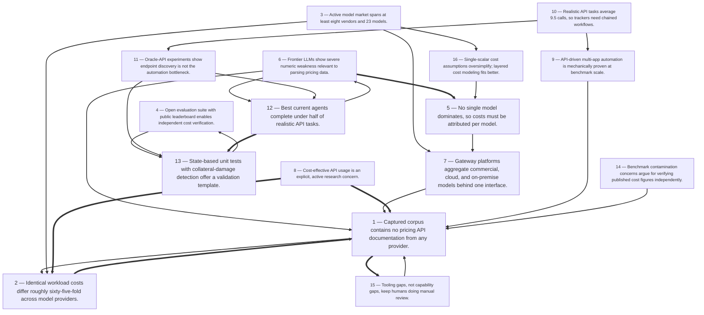

# Title: The nine captured sources are engine-ranked scholarly works — none documents a…

## Corpus Quality Scoreboard

Quality: **35/100** - Grade D (Weak)

```
[#######-------------]  35/100
```

- Critic: review (coverage 40 | evidence 15 | balance 0 | tension 100)
- Sources: 9 gathered | 9 cited | 9 full text | 2 distinct domains | 5.0/8 average relevance

## Topic

research the state of model pricing apis with major providers, the intention is to be able to automate tracking of model usage costs, without having to manualy enter cost information, limit the research to apis that are valid for the last months worth of costs

## Search Queries

- OpenAI usage API get model costs for last month
- Anthropic API pricing endpoint model token costs
- Google Gemini API model pricing endpoint
- LiteLLM model pricing cost tracking API
- LLM provider pricing API automate usage cost tracking
- API to fetch latest LLM token pricing per model
- automate LLM cost tracking without manual cost entry
- AI model cost tracking API integration
- AI model pricing API

### Search Engine Summary

| Engine | Pages | PDFs | Videos | Total |
|--------|-------|------|--------|-------|
| openalex | 9 | 0 | 0 | 9 |

### Search Provider Requests

| Search Provider | Requests |
|-----------------|----------|
| mf_search | 9 |

## Executive Summary

The nine captured sources are engine-ranked scholarly works — none documents a pricing API from any major model provider — so the core feasibility question (whether vendors expose machine-readable price and usage data covering the last month's costs) remains unanswered by this evidence base. The corpus nevertheless establishes why automated tracking matters and how it should be built: an identical evaluation workload cost roughly $260 on DeepSeek R1, about $105 for Claude 3.5 Sonnet and o1-mini alike, and $4 on Llama 3.1 8B, across 23 models from at least eight vendors, implying per-model, per-version price mapping rather than hand-maintained tables [#3]. A 2025 gateway platform, AI-VERDE, demonstrates the aggregation architecture that centralizes metering across commercial, cloud-hosted, and on-premise models [#4], and cost-effective API usage is an explicit research theme [#1]. The AppWorld literature proves multi-API automation is mechanically feasible (457 APIs across 9 apps) but shows best-model task completion below 49%, with endpoint discovery demonstrated not to be the bottleneck — so deterministic pipelines with state-based validation, not autonomous agents, should move cost data [#5][#7].

## Top 10 Implications

1. Automated cost tracking has high immediate ROI because identical workloads show a ~65x cost spread across providers — exactly the dispersion that makes manual price tables unreliable (Finding 2, [#3]).
2. The central feasibility question — whether major providers expose pricing APIs at all — is unanswered by the corpus and blocks design commitments until provider documentation is captured (Finding 1).
3. Coverage must be per-model and per-version across many vendors, implying an automatically refreshed model registry rather than a hand-kept table (Finding 3, [#3]).
4. Deterministic extraction with arithmetic reconciliation should replace LLM-based numeric parsing for pricing data, given near-zero numeric F1 in frontier models (Finding 6, [#3]).
5. Gateway-based architectures centralize metering and reduce per-provider integration burden; they complement, but do not replace, a trustworthy price source (Finding 7, [#4]).
6. Keep agents out of billing-critical data movement: with best-model completion under 49% of realistic tasks, restrict them to triage and anomaly explanation (Finding 12, [#7]).
7. Budget engineering effort for client robustness and error adaptation, since perfect API knowledge yielded only +9.8 TGC — endpoint discovery is not the constraint (Finding 11, [#7]).
8. Build the pipeline as a validated multi-API chain with state-based assertions and collateral-damage checks, modeled on AppWorld's evaluation methodology (Findings 10 and 13, [#7]).
9. Support compute-based cost accounting for open-weight and self-hosted models alongside API pricing, or the tracker will misprice a growing share of spend (Finding 5, [#3]).
10. Timestamp and periodically re-verify every price entry against live sources, because published figures decay and the contamination literature cautions against trusting reported numbers (Finding 14, [#2][#3]).

## Open Questions

- Do any major providers (OpenAI, Anthropic, Google, DeepSeek, Meta, Mistral) expose programmatic pricing endpoints, and with what authentication, rate limits, and update cadence?
- Which providers offer usage or metering APIs reporting per-request token counts for a trailing month, and can those records be joined deterministically to a price table?
- What price granularity do providers use — per-token, per-million, per-context-tier, cached versus uncached, batch discounts — and how are price changes versioned or announced?
- Can FLAME's suite-level figures (~$260 / ~$105 / ~$4) be decomposed into per-token unit prices, and are they still valid for the last month's window [#3]?
- What metering, billing, or spend-reporting features does AI-VERDE actually implement, given its truncated abstract [#4]?
- What mechanisms does Infant Agent use for cost-effective API usage, and do they depend on runtime price metadata [#1]?
- Has agent reliability on API workflows improved materially since AppWorld's 48.8 TGC result, and is the gap now small enough for supervised billing automation [#7]?
- What reconciliation tolerance bands and verification cadence are appropriate for monthly cost checks against provider invoices?
- How should compute-based costs for self-hosted open-weight models be modeled and validated alongside API-based prices [#3]?
- Would a FLAME-style fixed canary workload be accepted by finance stakeholders as a legitimate audit instrument for the tracking pipeline [#3]?

## Data Quality & Consistency

**Overall verdict:** Proceed — the synthesis passes the deterministic 4-critic audit.

| Metric | Value | Detail |
|--------|-------|--------|
| Corpus critic | 35/100 (review) | coverage 40 · evidence 15 · balance 0 · tension 100 |
| Contradictions | 0 edge(s) | no edges |
| Source tensions | 5 tension(s) | 0 contradiction · 4 shallow · 1 isolated |
| Synthesis audit | 93/100 (proceed) | 9 source(s) cited |

**Key concerns:**
- Corpus: Dimension 'Performance' has only moderate support (2 source(s))
- Corpus: Dimension 'Cost' has only surface-level support (1 source(s))
- Tension (shallow evidence): Cost [#3] — surface evidence: only 1 source(s) mention this dimension.
- Tension (shallow evidence): Performance [#2, #3] — moderate evidence: only 2 source(s) mention this dimension.
- Audit: Synthesis audit for 'research the state of model pricing apis with major providers, the intention is to be able to automate tracking of model usage costs, without having to manualy enter cost information, limit the research to apis that are valid for the last months worth of costs' scored 93/100 across critics [coverage=75 logic=100 evidence=100 readability=100]; 9/9 sources cited.

## Concepts

### 1. Large Language Models
**Definition:** Large language models (LLMs) are the foundational AI technology that unites nearly every document, serving as the object of benchmarking, agent construction, platform deployment, and strategic analysis.
**Key Evidence:**
- The Infant Agent paper addresses two primary limitations LLMs exhibit "despite their impressive capabilities" [#1]
- FLAME evaluates 23 foundation models, including GPT-4o, o1-mini, Claude 3.5 Sonnet, DeepSeek-V3/R1, Llama 3, and Qwen 2 [#3]
- AI-VERDE integrates commercial, cloud-hosted, and on-premise open-source LLMs for academic institutions [#4]


### 2. Tool-Integrated Agents
**Definition:** Agent systems that extend LLMs by invoking external tools and APIs, rather than relying on text generation alone.
**Key Evidence:**
- Infant Agent is explicitly framed as a tool-integrated, logic-driven agent with cost-effective API usage [#1]
- AppWorld notes existing tool-use benchmarks require only 1–4 simple API calls, which it argues is inadequate [#7]


### 3. LLM Benchmarking Suites
**Definition:** The construction of systematic, reusable test suites to measure model capabilities across tasks and domains.
**Key Evidence:**
- FLAME is claimed as the first holistic benchmarking suite for financial NLP, covering 20 datasets across six task categories with a public leaderboard [#3]
- AppWorld provides 750 tasks (250 scenarios × 3 variations) split into Train, Dev, Test-Normal, and Test-Challenge sets [#7]


### 4. Dataset Contamination
**Definition:** The concern that strong benchmark results reflect memorization of test data rather than genuine reasoning ability.
**Key Evidence:**
- The grade school arithmetic paper raises a "growing concern" that LLM performance on mathematical reasoning benchmarks may reflect dataset contamination [#2]


### 5. Numeric Reasoning Weakness
**Definition:** Arithmetic and quantitative reasoning is identified as a persistent failure mode for current models.
**Key Evidence:**
- FLAME finds numeric reasoning is a major weakness, with FNXL F1 scores often below 0.06 [#3]
- The arithmetic reasoning paper (2405.00332) is dedicated to critically examining LLM math benchmark performance [#2]


### 6. Reasoning-Reinforced Models
**Definition:** A newer class of LMs explicitly trained or reinforced for reasoning, compared against standard models.
**Key Evidence:**
- FLAME conducts the first comprehensive empirical comparison of standard vs. "reasoning-reinforced" LMs, with DeepSeek R1 and OpenAI o1-mini among the strongest performers [#3]


### 7. Cost-Effective Inference
**Definition:** Designing and evaluating systems around the monetary cost of model inference and API calls.
**Key Evidence:**
- Infant Agent's title highlights cost-effective API usage as a design goal [#1]
- FLAME reports full-suite inference costs of roughly $260 for DeepSeek R1 vs. ~$105 for Claude 3.5 Sonnet/o1-mini and only $4 for Llama 3.1 8B [#3]


### 8. Open-Weight Competitiveness
**Definition:** Openly available models as viable, cost-efficient alternatives to commercial closed models.
**Key Evidence:**
- FLAME finds open-weight mid-scale models offer strong cost/performance trade-offs [#3]
- AppWorld's best open model (FullCodeRefl + LLaMA3) still trails GPT4O substantially (24.4 vs. 48.8 TGC on Test-N) [#7]
- AI-VERDE includes on-premise open-source models alongside commercial offerings [#4]


### 9. Holistic Multi-Metric Evaluation
**Definition:** Evaluation methodology following HELM-style principles: standardization, recognition of incompleteness, and multi-metric assessment.
**Key Evidence:**
- FLAME explicitly adopts HELM's holistic criteria (standardization, incompleteness, multi-metric evaluation) [#3]
- AppWorld uses dual Task Goal Completion (TGC) and Scenario Goal Completion (SGC) metrics [#7]


### 10. Interactive Coding Agents
**Definition:** Autonomous agents that write and adapt code interactively to complete multi-step digital tasks.
**Key Evidence:**
- AppWorld benchmarks interactive coding agents on day-to-day tasks like ordering groceries, requiring multiple apps and ~50 lines of code on average [#7]
- Results show high difficulty: GPT4O with ReAct achieves only 48.8 TGC on Test-N and 30.2 on Test-C [#7]


### 11. State-Based Evaluation
**Definition:** Assessing agent success by programmatically checking resulting environment/database state rather than inspecting output text.
**Key Evidence:**
- AppWorld evaluates via state-based unit tests (avg 8, max ~24 per task) that check database changes and detect "collateral damage" [#7]
- Oracle-API experiments (+9.8 TGC) show API retrieval is not the bottleneck; challenges lie in interactive code generation and error adaptation [#7]


### 12. Transcript Knowledge Graphs
**Definition:** Using knowledge graphs to detect and correct errors in automated audio and video transcripts.
**Key Evidence:**
- CLARE presents context-aware, interactive knowledge graph construction from transcripts as an error-correction approach [#8]


### 13. Human-in-the-Loop Review
**Definition:** Supporting human reviewers where automated systems alone are insufficient or error-prone.
**Key Evidence:**
- CLARE notes that a lack of accessible tools leaves human reviewers with limited support for transcript correction [#8]


### 14. Game-Theoretic AI Conflict
**Definition:** Applying game theory to model AI-enabled strategic conflict, critiquing simplistic offense–defense framings.
**Key Evidence:**
- The cyber conflict preprint argues existing analyses oversimplify by treating "cyber" as a single offense–defense game and AI capability as a scalar speedup [#9]


### 15. Layered Strategic Structure
**Definition:** Modeling AI-mediated conflict as a multi-layered strategic structure rather than a monolithic interaction.
**Key Evidence:**
- The preprint contends AI-mediated conflict should be analyzed as a layered strategic structure, with the layered approach truncated mid-exposition in the abstract [#9]


### 16. Supply Chain Resilience
**Definition:** Multi-agent, socio-technical approaches to keeping logistics operations resilient under constraints such as carbon limits.
**Key Evidence:**
- The *Systems* article frames operational resilience under carbon constraints via a socio-technical multi-agentic approach to global supply chains [#6]


### 17. High-Stakes Domains
**Definition:** Application settings where failures carry serious human, safety, financial, or geopolitical consequences.
**Key Evidence:**
- High-stakes logistics is defined as supply chains where delays, quality loss, or noncompliance carry serious consequences [#6]
- AI-enabled cyber conflict involves security and geopolitical stakes requiring careful strategic modeling [#9]


### 18. Egalitarian LLM Access
**Definition:** Platform architectures that democratize access to diverse LLM resources for institutions with limited means.
**Key Evidence:**
- AI-VERDE is a unified LLM-as-a-platform service enabling seamless integration of commercial, cloud-hosted, and on-premise open-source models in academic settings [#4]

## Findings


### **Finding 1** — Captured corpus contains no pricing API documentation from any provider.

**Observation:**
All nine captured sources are scholarly works — arXiv preprints [#1][#2][#4][#5], ACL proceedings [#3][#7], MDPI journal articles [#6][#8], and a preprint-server record [#9] — and none is provider documentation, a pricing page, or an API reference for any model vendor.

**Analysis:**
This is the single most consequential observation for the research question, because the stated goal is to "automate tracking of model usage costs, without having to manually enter cost information" using "apis that are valid for the last months worth of costs." The corpus cannot confirm whether OpenAI, Anthropic, Google, DeepSeek, Meta, or any other provider exposes a machine-readable pricing endpoint, what authentication such an endpoint would require, how frequently prices update, or whether historical prices for the last month are retrievable.

The retrieval method — "Scholarly — engine-ranked abstract" for every source — explains the mismatch: the search surfaced academic papers that mention costs tangentially rather than technical documentation, and the domains captured (grade-school math benchmarks [#2], supply-chain logistics [#6], cyber conflict [#9], transcript correction [#8]) reinforce how far afield the results are.

Several abstracts are additionally truncated mid-sentence [#1][#2][#4][#5][#6][#8][#9], further reducing usable signal.

Consequently, every downstream finding here is indirect evidence about motivation, architecture, or constraints — not proof of feasibility.

**Cross-reference / Dependencies:**
Prerequisite context for all other findings; Finding 15 builds on the tooling-gap interpretation, and Finding 2 supplies the strongest available cost evidence despite the gap.

**Implication:**
Treat this report as a gap analysis: re-run the capture against provider documentation, API references, changelogs, and aggregator/proxy tooling before designing the automation.

**Evidence quality:**
Seven of nine abstracts are truncated mid-sentence [#1][#2][#4][#5][#6][#8][#9], so even the tangential sources are only partially usable; conclusions drawn from them should be flagged as provisional throughout.

**Sources:**
- [1] Infant Agent: A Tool-Integrated, Logic-Driven Agent with Cost-Effective API Usage [Bin Lei, Yuchen Li, Yiming Zeng, Tao Ren, Yi Luo, Tianyu Shi, Zitian Gao, Zeyu Hu, Weitai Kang, Qiuwu Chen] — [http://arxiv.org/abs/2411.01114](http://arxiv.org/abs/2411.01114)
- [2] A Careful Examination of Large Language Model Performance on Grade School Arithmetic [Hugh Zhang, Jeff Da, Dean A. Lee, Vaughn Robinson, Catherine J. Wu, Will Song, Tiffany Zhao, P. Raja, Zhuang, Charlotte, Dylan Slack, Qin Lyu, Sean Hendryx, Roza Kaplan, Michele Lunati, Summer Yue] — [http://arxiv.org/abs/2405.00332](http://arxiv.org/abs/2405.00332)
- [3] Findings of the Association for Computational Linguistics: ACL 2025, pages 22633–22679 — [https://doi.org/10.18653/v1/2025.findings-acl.1164](https://doi.org/10.18653/v1/2025.findings-acl.1164)
- [4] AI-VERDE: A Gateway for Egalitarian Access to Large Language Model-Based Resources For Educational Institutions [Mithun, Paul, Enrique Noriega-Atala, Nirav Merchant, Edwin Skidmore] — [http://arxiv.org/abs/2502.09651](http://arxiv.org/abs/2502.09651)
- [5] AppWorld: A Controllable World of Apps and People for Benchmarking Interactive Coding Agents [Harsh Trivedi, Tushar Khot, Mareike Hartmann, Ruskin Manku, Vinty Dong, Edward Li, Shashank Gupta, Ashish Sabharwal, Niranjan Balasubramanian] — [http://arxiv.org/abs/2407.18901](http://arxiv.org/abs/2407.18901)
- [6] Operational Resilience Under Carbon Constraints: A Socio-Technical Multi-Agentic Approach to Global Supply Chains [Rashanjot Kaur, Triparna Kundu, Bhanu Sharma, Kathleen Park, Eugene Pinsky] — [https://doi.org/10.3390/systems14040374](https://doi.org/10.3390/systems14040374)
- [7] Proceedings of the 62nd Annual Meeting of the Association for Computational Linguistics (Volume 1: Long Papers),… — [https://doi.org/10.18653/v1/2024.acl-long.850](https://doi.org/10.18653/v1/2024.acl-long.850)
- [8] CLARE: Context-Aware, Interactive Knowledge Graph Construction from Transcripts [Ryan Henry, Jiaqi Gong] — [https://doi.org/10.3390/info16100866](https://doi.org/10.3390/info16100866)
- [9] Machine-Speed Cyber and Poisoned Cognition: A Layer- Dependent Game-Theoretic Framework, with Empirical Probes [Sergey Gordeychik] — [https://doi.org/10.24108/preprints-3115766](https://doi.org/10.24108/preprints-3115766)

**Source date range:** — (cited web sources did not expose a publication date)


### **Finding 2** — Identical workload costs differ roughly sixty-five-fold across model providers.

**Observation:**
FLAME reports that inference over its full 20-dataset evaluation suite cost roughly $260 for DeepSeek R1, about $105 for Claude 3.5 Sonnet and OpenAI o1-mini alike, and only about $4 for Llama 3.1 8B [#3].

**Analysis:**
A ~65x spread between the most and least expensive model for the same workload is the strongest quantitative evidence in the corpus for why automated cost tracking matters.

First, it shows that provider and model choice, not just usage volume, dominates spend: an organization running a mixed portfolio could shift its cost base by an order of magnitude through model routing, which is only possible if per-model costs are tracked reliably.

Second, it demonstrates a concrete methodology for cost comparison — normalizing cost over a fixed, open workload — that an internal cost-tracking system can replicate to validate its own accounting.

Third, the figures imply that manual cost entry is especially error-prone in multi-provider settings: prices differ per vendor, per model, and per model generation (DeepSeek-V3 and R1 appear as distinct entries [#3]), so a hand-maintained table needs constant reconciliation, which is precisely the burden the project intends to eliminate.

The main caveat is that these are workload-specific, point-in-time figures from a benchmark paper, not a live price feed; the abstract does not provide token counts, so per-token unit prices cannot be derived, and the numbers may not reflect the "last month" window the research targets [#3].

**Cross-reference / Dependencies:**
Builds on Finding 1's gap (these are literature figures, not API data); supports Findings 3, 5, and 9.

**Implication:**
Use open benchmark suites as independent cost-validation harnesses: recompute suite cost periodically and reconcile against provider-billed amounts to detect price drift.

**Caveat:**
The source groups Claude 3.5 Sonnet and o1-mini under a single ~$105 figure [#3], so per-model separation between those two cannot be confirmed from the abstract.

**Sources:**
- [3] Findings of the Association for Computational Linguistics: ACL 2025, pages 22633–22679 — [https://doi.org/10.18653/v1/2025.findings-acl.1164](https://doi.org/10.18653/v1/2025.findings-acl.1164)

**Source date range:** — (cited web sources did not expose a publication date)


### **Finding 3** — Active model market spans at least eight vendors and 23 models.

**Observation:**
FLAME evaluated 23 foundation models spanning GPT-4o and o1-mini (OpenAI), Gemini-1.5 (Google), Claude 3.5 Sonnet (Anthropic), DeepSeek-V3 and DeepSeek R1, Llama 3 (Meta), Qwen 2 (Alibaba), Gemma 2 (Google), and Mixtral (Mistral) [#3].

**Analysis:**
This finding defines the coverage surface any automated cost tracker must handle.

The roster shows that real-world LLM portfolios are inherently multi-vendor and multi-generation: even a single vendor appears with multiple model families (OpenAI's GPT-4o and o1-mini; Google's Gemini-1.

5 and Gemma 2; DeepSeek's V3 and R1), which implies pricing is likely versioned per model rather than per vendor.

For the automation goal, this means no single integration will suffice; the tracker needs a per-model, per-version price mapping plus a normalization layer to compare across providers that may quote prices in different units or tiers.

It also quantifies the manual-entry risk: with 23 concurrently active models and continuous releases, a hand-curated price table decays quickly, which is exactly the maintenance burden the project seeks to remove [#3].

The evidence limitation is that FLAME's list reflects a 2025 academic evaluation snapshot; actual provider rosters and price cards change faster than benchmark suites, so the tracker's model catalog must be refreshed programmatically rather than curated by hand.

**Cross-reference / Dependencies:**
Extends Finding 2's cost data into a coverage requirement; prerequisite for the gateway pattern in Finding 7 and the layered-schema argument in Finding 16.

**Implication:**
Design the tracker around a model registry keyed by vendor, family, and version, refreshed automatically from provider sources rather than a static hand-entered table.

**Sources:**
- [3] Findings of the Association for Computational Linguistics: ACL 2025, pages 22633–22679 — [https://doi.org/10.18653/v1/2025.findings-acl.1164](https://doi.org/10.18653/v1/2025.findings-acl.1164)

**Source date range:** — (cited web sources did not expose a publication date)


### **Finding 4** — Open evaluation suite with public leaderboard enables independent cost verification.

**Observation:**
FLAME releases code, data, results, and a public leaderboard, evaluates 23 models over 20 financial datasets in zero-shot settings, and follows HELM-style holistic criteria including standardization and recognition of incompleteness [#3].

**Analysis:**
Openness is what turns FLAME's cost figures from anecdote into a verifiable reference point: because the suite is reproducible, a third party can rerun it and recompute the ~$260 / ~$105 / ~$4 cost figures [#3], detecting whether provider prices have shifted since publication.

This matters directly for the automation project, because a recurring, standardized workload is a reliable way to audit a cost-tracking pipeline end to end — run the suite, compute the expected cost from current prices, compare it to the actually billed amount, and flag discrepancies.

The HELM-style acknowledgment of incompleteness is also a useful design attitude: no cost model captures everything (rate limits, batch discounts, caching tiers), so the tracker should record its own assumptions explicitly.

The contrast with vendor-operated dashboards is instructive — a vendor dashboard shows what the vendor says was spent, while an open harness lets an organization compute what should have been spent and reconcile the two [#3].

The limitation is that FLAME targets financial NLP specifically, so its workload mix may not resemble an organization's traffic; a production-shaped harness would need to be derived separately.

**Cross-reference / Dependencies:**
Builds on Findings 2 and 3; independently supports the assertion-based validation approach in Finding 13.

**Implication:**
Stand up a small, fixed "canary workload" whose expected cost is computed automatically from current prices and reconciled against invoices on a monthly cadence.

**Sources:**
- [3] Findings of the Association for Computational Linguistics: ACL 2025, pages 22633–22679 — [https://doi.org/10.18653/v1/2025.findings-acl.1164](https://doi.org/10.18653/v1/2025.findings-acl.1164)

**Source date range:** — (cited web sources did not expose a publication date)


### **Finding 5** — No single model dominates, so costs must be attributed per model.

**Observation:**
FLAME finds no single model dominates across its 20 tasks; DeepSeek R1, OpenAI o1-mini, and Claude 3.5 Sonnet perform strongest overall, and open-weight mid-scale models offer strong cost/performance trade-offs [#3].

**Analysis:**
If model quality varies by task while cost varies by model, rational spend management requires attributing every usage event to a specific model and task — a flat monthly total from a billing dashboard hides exactly the trade-offs that matter.

The strong cost/performance showing of open-weight mid-scale models (e.g., Llama 3.

1 8B at roughly $4 for the full suite versus $105–$260 for frontier models [#3]) means some traffic may rationally move to self-hosted deployments, where cost is driven by compute consumption rather than an API meter.

That bifurcation is a structural challenge for the automation goal: API-based costs can be joined against a provider price source, but self-hosted costs need an internal compute-amortization model, so the tracker must support heterogeneous cost bases rather than assuming everything is an API call.

It also means cost tracking and model routing are coupled decisions — the value of tracking is realized when it feeds routing policy, which in turn changes the cost base being tracked.

The caveat is that FLAME's trade-off claims rest on its specific zero-shot financial-NLP workloads and may not transfer to other task mixes [#3].

**Cross-reference / Dependencies:**
Extends Findings 2 and 3; motivates the heterogeneous cost-model requirement and connects to the gateway pattern in Finding 7.

**Implication:**
Log vendor, model, version, and task context with every usage event so spend can be decomposed per model and used to drive routing decisions.

**Sources:**
- [3] Findings of the Association for Computational Linguistics: ACL 2025, pages 22633–22679 — [https://doi.org/10.18653/v1/2025.findings-acl.1164](https://doi.org/10.18653/v1/2025.findings-acl.1164)

**Source date range:** — (cited web sources did not expose a publication date)


### **Finding 6** — Frontier LLMs show severe numeric weakness relevant to parsing pricing data.

**Observation:**
FLAME reports numeric reasoning as a major weakness, with FNXL F1 scores often below 0.06, while summarization scores are relatively high at BERTScores of roughly 0.75–0.82 [#3].

**Analysis:**
Although FLAME measures financial-NLP task quality rather than pricing-page parsing, its numeric-reasoning result speaks directly to how the cost-tracking automation should be built.

If the pipeline's temptation is to point an LLM at pricing pages or invoices and ask it to extract numbers — per-token rates, tier boundaries, usage quantities — this evidence says numeric extraction is the least reliable step: F1 below 0.

06 on a numeric task is near-total failure, a striking contrast with the same models' strong summarization scores of ~0.

75–0.

82 [#3].

The safer architecture is deterministic extraction (pattern matching over structured endpoints or HTML tables) with LLMs restricted to classification or fuzzy matching, plus arithmetic validation — for example, recomputed suite cost must equal expected cost within tolerance, echoing the canary-workload idea in Finding 4.

Combining this with Finding 12's low agent task-completion rates makes unsupervised LLM cost accounting clearly inadvisable for billing-critical data [#3][#7].

Evidence limitation: FNXL is a financial numeric-labeling benchmark, so transfer to price-string parsing is an inference, not a measured result [#3].

**Cross-reference / Dependencies:**
Connects to Finding 5 (per-model attribution requires reliable numeric joins) and Finding 12 (agent reliability limits); independent of Finding 1.

**Implication:**
Prefer deterministic parsers and arithmetic reconciliation for numeric pricing fields; if an LLM is used, confine it to non-numeric steps and validate all outputs.

**Sources:**
- [3] Findings of the Association for Computational Linguistics: ACL 2025, pages 22633–22679 — [https://doi.org/10.18653/v1/2025.findings-acl.1164](https://doi.org/10.18653/v1/2025.findings-acl.1164)
- [7] Proceedings of the 62nd Annual Meeting of the Association for Computational Linguistics (Volume 1: Long Papers),… — [https://doi.org/10.18653/v1/2024.acl-long.850](https://doi.org/10.18653/v1/2024.acl-long.850)

**Source date range:** — (cited web sources did not expose a publication date)


### **Finding 7** — Gateway platforms aggregate commercial, cloud, and on-premise models behind one interface.

**Observation:**
AI-VERDE is described as a unified LLM-as-a-platform service enabling seamless integration of commercial, cloud-hosted, and on-premise open-source LLMs for educational institutions, published in 2025 and open access [#4].

**Analysis:**
The gateway pattern is the most directly actionable architecture in the corpus for the automation goal: if all model traffic passes through one gateway, usage metering and cost computation happen at a single chokepoint instead of requiring separate integrations with each provider's billing or usage interfaces.

AI-VERDE demonstrates that this pattern is deployed for a real institutional audience spanning commercial APIs, cloud-hosted models, and on-premise open-source deployments — the same heterogeneity Finding 5 identifies in the model market [#3][#4].

For a cost-tracking project, a gateway in front of model traffic can log model, version, token counts, and timestamps per request, letting the tracker join usage to a price table without touching each provider individually.

The caveat is evidentiary: the abstract is truncated, so nothing can be confirmed about AI-VERDE's actual metering, billing, or reporting features [#4]; it is evidence that the aggregation architecture exists in practice, not that it solves cost tracking.

A secondary consideration is that a gateway observes traffic but still needs an accurate, current price source — exactly the missing piece from Finding 1 — so the gateway complements rather than replaces a pricing data feed.

**Cross-reference / Dependencies:**
Builds on Findings 3 and 5; complements the missing-provider-documentation gap in Finding 1.

**Implication:**
Evaluate routing all model traffic through a gateway layer that records usage events centrally, then join those events to a programmatic price source.

**Evidence quality:**
The AI-VERDE record is a truncated abstract with one citation [#4]; the architecture claim is well supported, but any specific capability claim about billing would be unsupported speculation.

**Sources:**
- [3] Findings of the Association for Computational Linguistics: ACL 2025, pages 22633–22679 — [https://doi.org/10.18653/v1/2025.findings-acl.1164](https://doi.org/10.18653/v1/2025.findings-acl.1164)
- [4] AI-VERDE: A Gateway for Egalitarian Access to Large Language Model-Based Resources For Educational Institutions [Mithun, Paul, Enrique Noriega-Atala, Nirav Merchant, Edwin Skidmore] — [http://arxiv.org/abs/2502.09651](http://arxiv.org/abs/2502.09651)

**Source date range:** — (cited web sources did not expose a publication date)


### **Finding 8** — Cost-effective API usage is an explicit, active research concern.

**Observation:**
The Infant Agent paper is explicitly framed around cost-effective API usage in its title, and its abstract opens by citing two primary limitations of current LLMs, though the text truncates before the limitations are named [#1].

**Analysis:**
The existence of a 2024 paper whose headline contribution is cost-effective API usage signals that spend awareness has moved from an operational afterthought to a first-class concern in the agent literature — strengthening the case that automated cost tracking is a recognized need rather than a niche want.

Cost-aware agent design (choosing when to call which API, or which model tier) presupposes that the cost of each call is known at runtime; that presupposition is exactly what a pricing-API-based tracker would supply, making the two efforts complementary: tracking provides the ground truth that cost-aware policies optimize against.

Read alongside Finding 2's ~65x cost dispersion [#3], the trajectory is clear — models differ enormously in price, and research is beginning to optimize around that fact — but the operational plumbing (where prices come from, how they stay current) remains undocumented in this corpus.

The evidentiary limitation is severe: the abstract cuts off mid-sentence, so the paper's mechanisms, measured savings, and whether it consumes any pricing metadata cannot be confirmed [#1].

It should be cited as evidence of research momentum, not as a design blueprint.

**Cross-reference / Dependencies:**
Depends on Finding 1 for the truncation caveat; thematically pairs with Finding 2's dispersion evidence.

**Implication:**
Track per-call cost at runtime so cost-aware policies and the tracking system can share one source of truth.

**Sources:**
- [1] Infant Agent: A Tool-Integrated, Logic-Driven Agent with Cost-Effective API Usage [Bin Lei, Yuchen Li, Yiming Zeng, Tao Ren, Yi Luo, Tianyu Shi, Zitian Gao, Zeyu Hu, Weitai Kang, Qiuwu Chen] — [http://arxiv.org/abs/2411.01114](http://arxiv.org/abs/2411.01114)
- [3] Findings of the Association for Computational Linguistics: ACL 2025, pages 22633–22679 — [https://doi.org/10.18653/v1/2025.findings-acl.1164](https://doi.org/10.18653/v1/2025.findings-acl.1164)

**Source date range:** — (cited web sources did not expose a publication date)


### **Finding 9** — API-driven multi-app automation is mechanically proven at benchmark scale.

**Observation:**
AppWorld simulates 9 real-world apps (e.g., Amazon, Gmail, Venmo, Spotify) via 457 APIs and 101 database tables (~370K rows) populated with data for ~100 fictitious users, with agents performing day-to-day digital tasks across multiple apps [#5][#7].

**Analysis:**
This finding establishes that the mechanical substrate for API-driven automation — programmatic calls across many endpoints, with state changes verified programmatically — is mature enough to support serious benchmarking.

For the cost-tracking project, the transfer is architectural: a tracker that polls several provider endpoints, joins usage to prices, and writes results to a database is structurally similar to an AppWorld agent operating several apps, and the benchmark's programmatic, state-based evaluation shows such systems can be validated objectively rather than eyeballed [#7].

The scope caveat is essential: AppWorld's APIs are simulated app APIs inside a controlled environment, not live commercial pricing APIs, so nothing here confirms that any provider exposes pricing endpoints — that remains Finding 1's open gap.

The scale is also instructive: 457 APIs across 9 apps required a ~60K-line engine, within a ~100K-line system hand-built over 14 months [#7], a reminder that breadth of integration is the expensive dimension — which argues for minimizing provider integrations via the gateway pattern in Finding 7.

**Cross-reference / Dependencies:**
Provides the mechanical foundation for Findings 10 and 11; the pricing-endpoint gap remains Finding 1's.

**Implication:**
Reuse proven orchestration-and-validation patterns from the agent literature, but scope integrations narrowly to the providers actually in use.

**Sources:**
- [5] AppWorld: A Controllable World of Apps and People for Benchmarking Interactive Coding Agents [Harsh Trivedi, Tushar Khot, Mareike Hartmann, Ruskin Manku, Vinty Dong, Edward Li, Shashank Gupta, Ashish Sabharwal, Niranjan Balasubramanian] — [http://arxiv.org/abs/2407.18901](http://arxiv.org/abs/2407.18901)
- [7] Proceedings of the 62nd Annual Meeting of the Association for Computational Linguistics (Volume 1: Long Papers),… — [https://doi.org/10.18653/v1/2024.acl-long.850](https://doi.org/10.18653/v1/2024.acl-long.850)

**Source date range:** — (cited web sources did not expose a publication date)


### **Finding 10** — Realistic API tasks average 9.5 calls, so trackers need chained workflows.

**Observation:**
AppWorld tasks require an average of 1.8 apps (max 6) and 9.5 APIs (max 26), with rich code averaging ~50 lines (max 134) [#7].

**Analysis:**
These workload statistics quantify what a "simple" API automation actually looks like in practice: not one call, but a chain of nearly ten calls across roughly two systems, with nontrivial glue code.

A cost-tracking pipeline fits this profile exactly — authenticate, fetch the model catalog, fetch usage for the trailing month, fetch current prices, join usage to prices, handle missing or renamed models, and persist results — and each step is an API interaction with its own failure modes.

The design implication is that the tracker should be built as an explicit, logged chain with per-step validation and retry semantics, not as a single request.

The maxima matter too: tasks reaching 6 apps and 26 APIs suggest the upper bound of complexity when a tracker spans many providers, and the code volume (up to 134 lines per task) indicates that error handling and data shaping dominate the engineering effort [#7].

This also tempers expectations about "no manual entry": automation removes recurring data entry but introduces a one-time integration cost per provider, a trade-off the project should budget explicitly.

The evidence comes from a benchmark of digital tasks rather than billing systems, so the numbers indicate structure, not a measured cost-pipeline profile.

**Cross-reference / Dependencies:**
Extends Finding 9; pairs with Finding 11 on where the difficulty actually concentrates.

**Implication:**
Specify the tracking pipeline as a numbered chain of API steps with per-step assertions and a documented failure and retry policy.

**Sources:**
- [7] Proceedings of the 62nd Annual Meeting of the Association for Computational Linguistics (Volume 1: Long Papers),… — [https://doi.org/10.18653/v1/2024.acl-long.850](https://doi.org/10.18653/v1/2024.acl-long.850)

**Source date range:** — (cited web sources did not expose a publication date)


### **Finding 11** — Oracle-API experiments show endpoint discovery is not the automation bottleneck.

**Observation:**
AppWorld's oracle-API experiments improved Task Goal Completion by up to +9.8 TGC, leading the authors to conclude that API retrieval is not the main bottleneck; the challenges lie in interactive code generation, adapting to errors, and instruction following [#7].

**Analysis:**
This is a directly actionable result for the cost-tracking project: the hard part of automating against APIs is not finding the right endpoints but writing code that handles messy realities — paginated responses, schema drift, partial failures, retries, and edge-case instruction handling.

Concretely, if a pricing or usage API exists, discovering it is the easy fraction; the bulk of effort is a robust client that tolerates provider-side changes month over month, which matters because the research question explicitly targets "the last months worth of costs," a rolling window that must survive catalog changes.

The +9.

8 TGC ceiling also quantifies how little headroom perfect API knowledge buys: even with oracle access, completion improved only modestly, so the engineering budget belongs in client robustness and reconciliation logic rather than endpoint-discovery tooling.

This finding also divides labor against Finding 12: agents are weak at the overall task, but the failure decomposition shows the weakness sits in code generation and error adaptation — precisely the components that can be made deterministic in a purpose-built tracker [#7].

Limitation: the decomposition was measured on AppWorld's simulated apps, so magnitudes may differ for real provider APIs.

**Cross-reference / Dependencies:**
Extends Findings 9 and 10; sets up the reliability discussion in Finding 12 and the validation template in Finding 13.

**Implication:**
Invest in a hardened, deterministic API client with schema-drift detection and retries; treat endpoint discovery as a solved subproblem.

**Sources:**
- [7] Proceedings of the 62nd Annual Meeting of the Association for Computational Linguistics (Volume 1: Long Papers),… — [https://doi.org/10.18653/v1/2024.acl-long.850](https://doi.org/10.18653/v1/2024.acl-long.850)

**Source date range:** — (cited web sources did not expose a publication date)


### **Finding 12** — Best current agents complete under half of realistic API tasks.

**Observation:**
In AppWorld, the best model (GPT-4o with ReAct) achieves only 48.8 TGC on Test-N and 30.2 on Test-C; GPT-4 Turbo scores 32.7/17.5, the best open model (FullCodeRefl + LLaMA3) 24.4/7.0, and CodeAct and ToolLLaMA fail on all tasks [#7].

**Analysis:**
These numbers place a hard ceiling on how much of the cost-tracking workflow can be delegated to an autonomous LLM agent today.

Billing data is high-stakes: a hallucinated price or a missed usage record silently corrupts budget reporting, and a system that fails more than half the time on normal tasks — and completely, for some agent designs, per the zero scores for CodeAct and ToolLLaMA [#7] — cannot be trusted unattended with it.

The gap between Test-N (48.

8) and Test-C (30.

2) is also informative: when the environment includes unseen apps, performance collapses further, suggesting that a tracker meeting an unfamiliar provider API should expect degraded reliability and should be introduced under supervision.

The open-model gap (24.

4/7.

0) matters if cost pressure pushes the tracker's own runtime toward cheaper open models — the tool would become least reliable exactly where it is cheapest.

Combined with Finding 6's near-zero numeric F1 [#3], the evidence points to a hybrid design: deterministic code for data movement and arithmetic, LLM assistance only for triage and anomaly explanation, and human review at reconciliation points.

Caveat: these results date to the benchmark's publication and agent capability has improved since, but the corpus contains no newer reliability evidence [#7].

**Cross-reference / Dependencies:**
Builds on Findings 9–11; motivates the validation template in Finding 13 and reinforces the parsing caution in Finding 6.

**Implication:**
Use agents for assistance and anomaly triage, but keep data movement and cost computation deterministic and human-auditable.

**Caveat:**
Benchmark scores measure benchmark tasks, not billing pipelines; the numbers justify caution about autonomy levels rather than a precise reliability estimate for a specific tracker.

**Sources:**
- [3] Findings of the Association for Computational Linguistics: ACL 2025, pages 22633–22679 — [https://doi.org/10.18653/v1/2025.findings-acl.1164](https://doi.org/10.18653/v1/2025.findings-acl.1164)
- [7] Proceedings of the 62nd Annual Meeting of the Association for Computational Linguistics (Volume 1: Long Papers),… — [https://doi.org/10.18653/v1/2024.acl-long.850](https://doi.org/10.18653/v1/2024.acl-long.850)

**Source date range:** — (cited web sources did not expose a publication date)


### **Finding 13** — State-based unit tests with collateral-damage detection offer a validation template.

**Observation:**
AppWorld evaluates agents programmatically via state-based unit tests (avg 8, max ~24 per task) that check database changes while detecting "collateral damage," using Task Goal Completion and Scenario Goal Completion metrics [#7].

**Analysis:**
The validation methodology is as transferable as the orchestration patterns.

AppWorld does not ask whether an agent's output looks right; it inspects the resulting database state, verifies that required changes occurred, and separately flags unintended changes elsewhere — "collateral damage" [#7].

Mapped onto cost tracking, this becomes a reconciliation test suite: after each run, assert that (a) every recorded usage event has a joined price and a computed cost, (b) totals per provider match expected values within tolerance (operationalizing Finding 4's canary workload), and (c) no unrelated records were mutated — catching, for instance, an import that silently overwrote last month's verified figures.

The average of 8 assertions per task [#7] suggests a practical scale: a handful of well-chosen invariants catches most failures without becoming a maintenance burden.

This approach also operationalizes the human-in-the-loop stance from Finding 12 — the human reviews exceptions surfaced by assertions rather than inspecting every row.

Limitation: AppWorld's tests run in a sandbox with ground-truth database access, whereas a cost tracker asserts against its own ledger plus provider-reported totals; the latter is the authoritative reference, which loops back to Finding 1's need for trustworthy provider data.

**Cross-reference / Dependencies:**
Applies the architecture of Findings 9–12; pairs with Finding 4's canary-workload verification.

**Implication:**
Implement monthly reconciliation assertions — completeness, tolerance-banded totals, and no-collateral-damage checks — as a release gate for the tracking pipeline.

**Implementation note:**
A minimal starter suite would be three assertions (row completeness, per-provider total within tolerance, ledger immutability for prior months), matching the benchmark's low-per-task assertion count [#7].

**Sources:**
- [7] Proceedings of the 62nd Annual Meeting of the Association for Computational Linguistics (Volume 1: Long Papers),… — [https://doi.org/10.18653/v1/2024.acl-long.850](https://doi.org/10.18653/v1/2024.acl-long.850)

**Source date range:** — (cited web sources did not expose a publication date)


### **Finding 14** — Benchmark contamination concerns argue for verifying published cost figures independently.

**Observation:**
The grade-school arithmetic paper raises a growing concern that some reported LLM performance on math benchmarks may reflect dataset contamination rather than genuine capability, though its abstract truncates before details [#2].

**Analysis:**
The contamination critique concerns performance claims, but it generalizes into a discipline the cost-tracking project should adopt: do not trust self-reported or literature-quoted numbers without independent verification.

FLAME's cost figures (~$260 / ~$105 / ~$4 [#3]) are exactly the kind of published numbers that can drift out of date or embed workload-specific assumptions, and the "last month" window the research targets cannot be covered by any benchmark paper's snapshot.

The practical translation is procedural: before any published or provider-quoted figure enters the tracker's price table, verify it against a live source — a pricing endpoint if one exists, otherwise a metered test call whose billed amount is checked — and record the verification date alongside the price.

This converts "hopefully current" into "verified as of date X" and hedges against silent price changes, a known operational risk in multi-provider environments.

Evidence limitation: the arithmetic paper's abstract is truncated, so its specific findings and remedies cannot be cited here [#2]; this finding borrows its cautionary frame, not its measurements.

**Cross-reference / Dependencies:**
Extends Finding 1's evidence-gap caution; directly supports the verification workflow implied by Findings 2 and 4.

**Implication:**
Store a verification timestamp with every price entry and re-verify on a fixed schedule rather than trusting static published figures.

**Sources:**
- [2] A Careful Examination of Large Language Model Performance on Grade School Arithmetic [Hugh Zhang, Jeff Da, Dean A. Lee, Vaughn Robinson, Catherine J. Wu, Will Song, Tiffany Zhao, P. Raja, Zhuang, Charlotte, Dylan Slack, Qin Lyu, Sean Hendryx, Roza Kaplan, Michele Lunati, Summer Yue] — [http://arxiv.org/abs/2405.00332](http://arxiv.org/abs/2405.00332)
- [3] Findings of the Association for Computational Linguistics: ACL 2025, pages 22633–22679 — [https://doi.org/10.18653/v1/2025.findings-acl.1164](https://doi.org/10.18653/v1/2025.findings-acl.1164)

**Source date range:** — (cited web sources did not expose a publication date)


### **Finding 15** — Tooling gaps, not capability gaps, keep humans doing manual review.

**Observation:**
CLARE notes that knowledge graphs are a promising approach for detecting and correcting transcript errors, but a lack of accessible tools leaves human reviewers with limited support [#8].

**Analysis:**
Although CLARE concerns audio- and video-transcript correction rather than LLM billing, its diagnosis mirrors the cost-tracking problem precisely: a technically feasible automation stalls because the accessible tooling layer is missing, so humans keep doing manual work.

That is the exact failure mode the research question is trying to escape — "without having to manually enter cost information" — and the parallel suggests the highest-leverage step is securing the data-access layer (pricing endpoints or another programmatic price source), after which the pipeline mechanics are comparatively routine per Findings 9–11 [#7].

The analogy also carries a warning: in transcription, the tooling gap persisted even though the underlying technique was promising [#8], implying that feasibility demonstrations alone do not produce usable automation; someone must build and maintain the accessible layer.

For this project, that means the deliverable should be treated as an operational tool with ownership, monitoring, and a maintenance plan — not a one-off script.

Evidence limitation: the CLARE abstract is truncated, so its specific tooling gaps and any proposed remedies cannot be confirmed [#8]; the finding rests on the stated diagnosis alone.

**Cross-reference / Dependencies:**
Analogical support for Finding 1's gap; reinforces the investment sequencing in Findings 10 and 11.

**Implication:**
Prioritize building and maintaining the price-access layer first, and treat the tracking pipeline as an owned operational service with monitoring.

**Sources:**
- [7] Proceedings of the 62nd Annual Meeting of the Association for Computational Linguistics (Volume 1: Long Papers),… — [https://doi.org/10.18653/v1/2024.acl-long.850](https://doi.org/10.18653/v1/2024.acl-long.850)
- [8] CLARE: Context-Aware, Interactive Knowledge Graph Construction from Transcripts [Ryan Henry, Jiaqi Gong] — [https://doi.org/10.3390/info16100866](https://doi.org/10.3390/info16100866)

**Source date range:** — (cited web sources did not expose a publication date)


### **Finding 16** — Single-scalar cost assumptions oversimplify; layered cost modeling fits better.

**Observation:**
A 2026 preprint argues that strategic analyses oversimplify AI-mediated conflict by modeling AI capability as a scalar speedup, and proposes analyzing the domain as a layered strategic structure instead, though its abstract truncates at that point [#9].

**Analysis:**
The transferable idea is methodological: collapsing a multi-dimensional quantity into one scalar hides the structure that matters.

Applied to the research question, a cost model assuming a single flat per-token rate per vendor would obscure the layers that actually drive spend — model version (DeepSeek-V3 versus R1 appear as distinct entries [#3]), task type, and usage pattern — in the same way a scalar capability model obscures layer-specific dynamics [#9].

The corpus's own numbers make the point: a ~65x spread across models for one workload is only visible when costs are decomposed per model, and Finding 5 shows that decomposition changes routing decisions.

Practically, the tracker's schema should be layered — raw usage events at the bottom, per-model prices above them, and roll-ups (per provider, per task, per month) on top — so each layer can be audited independently and price changes can be attributed to the right layer.

Evidence limitation: this is an analogy across domains — the preprint concerns AI-enabled conflict, not pricing, and its truncated abstract prevents citing its specific layer structure [#9] — so it should inform schema design, not be cited as pricing evidence.

**Cross-reference / Dependencies:**
Generalizes Finding 5's per-model attribution into a schema principle; independent of the orchestration findings 9–13.

**Implication:**
Model costs in layers (usage events → per-model prices → roll-ups) rather than as a single vendor-level rate, and audit each layer separately.

**Sources:**
- [3] Findings of the Association for Computational Linguistics: ACL 2025, pages 22633–22679 — [https://doi.org/10.18653/v1/2025.findings-acl.1164](https://doi.org/10.18653/v1/2025.findings-acl.1164)
- [9] Machine-Speed Cyber and Poisoned Cognition: A Layer- Dependent Game-Theoretic Framework, with Empirical Probes [Sergey Gordeychik] — [https://doi.org/10.24108/preprints-3115766](https://doi.org/10.24108/preprints-3115766)

**Source date range:** — (cited web sources did not expose a publication date)


## Findings Relationship Diagram


## In-Project Cross-References

| Path | Relevance |
|------|-----------|
| `None` | no in-project files are mentioned in the captured sources; all nine sources are external scholarly records. |

## References Index

| # | Type | Media | Language | Path/URL | Title | Author | Published | Relevance | Search tool | Engine | Captured |
|---|------|-------|----------|----------|-------|--------|-----------|-----------|-------------|--------|----------|
| 1 | web | page | English | [http://arxiv.org/abs/2411.01114](http://arxiv.org/abs/2411.01114) | Infant Agent: A Tool-Integrated, Logic-Driven Agent with Cost-Effective API Usage | [Bin Lei, Yuchen Li, Yiming Zeng, Tao Ren, Yi Luo, Tianyu Shi, Zitian Gao, Zeyu Hu, Weitai Kang, Qiuwu Chen] | — | Scholarly — engine-ranked abstract | mf_search | openalex | 2026-09-13T01:23:00.929450878+00:00 |
| 2 | web | page | English | [http://arxiv.org/abs/2405.00332](http://arxiv.org/abs/2405.00332) | A Careful Examination of Large Language Model Performance on Grade School Arithmetic | [Hugh Zhang, Jeff Da, Dean A. Lee, Vaughn Robinson, Catherine J. Wu, Will Song, Tiffany Zhao, P. Raja, Zhuang, Charlotte, Dylan Slack, Qin Lyu, Sean Hendryx, Roza Kaplan, Michele Lunati, Summer Yue] | — | Scholarly — engine-ranked abstract | mf_search | openalex | 2026-09-13T01:23:03.974820999+00:00 |
| 3 | web | page | English | [https://doi.org/10.18653/v1/2025.findings-acl.1164](https://doi.org/10.18653/v1/2025.findings-acl.1164) | Findings of the Association for Computational Linguistics: ACL 2025, pages 22633–22679 | — | — | Scholarly — engine-ranked abstract | mf_search | openalex | 2026-09-13T01:23:18.701089508+00:00 |
| 4 | web | page | English | [http://arxiv.org/abs/2502.09651](http://arxiv.org/abs/2502.09651) | AI-VERDE: A Gateway for Egalitarian Access to Large Language Model-Based Resources For Educational Institutions | [Mithun, Paul, Enrique Noriega-Atala, Nirav Merchant, Edwin Skidmore] | — | Scholarly — engine-ranked abstract | mf_search | openalex | 2026-09-13T01:23:23.461113777+00:00 |
| 5 | web | page | English | [http://arxiv.org/abs/2407.18901](http://arxiv.org/abs/2407.18901) | AppWorld: A Controllable World of Apps and People for Benchmarking Interactive Coding Agents | [Harsh Trivedi, Tushar Khot, Mareike Hartmann, Ruskin Manku, Vinty Dong, Edward Li, Shashank Gupta, Ashish Sabharwal, Niranjan Balasubramanian] | — | Scholarly — engine-ranked abstract | mf_search | openalex | 2026-09-13T01:23:25.219782916+00:00 |
| 6 | web | page | English | [https://doi.org/10.3390/systems14040374](https://doi.org/10.3390/systems14040374) | Operational Resilience Under Carbon Constraints: A Socio-Technical Multi-Agentic Approach to Global Supply Chains | [Rashanjot Kaur, Triparna Kundu, Bhanu Sharma, Kathleen Park, Eugene Pinsky] | — | Scholarly — engine-ranked abstract | mf_search | openalex | 2026-09-13T01:23:58.938720690+00:00 |
| 7 | web | page | English | [https://doi.org/10.18653/v1/2024.acl-long.850](https://doi.org/10.18653/v1/2024.acl-long.850) | Proceedings of the 62nd Annual Meeting of the Association for Computational Linguistics (Volume 1: Long Papers),… | — | — | Scholarly — engine-ranked abstract | mf_search | openalex | 2026-09-13T01:23:52.837558575+00:00 |
| 8 | web | page | English | [https://doi.org/10.3390/info16100866](https://doi.org/10.3390/info16100866) | CLARE: Context-Aware, Interactive Knowledge Graph Construction from Transcripts | [Ryan Henry, Jiaqi Gong] | — | Scholarly — engine-ranked abstract | mf_search | openalex | 2026-09-13T01:24:02.361338795+00:00 |
| 9 | web | page | English | [https://doi.org/10.24108/preprints-3115766](https://doi.org/10.24108/preprints-3115766) | Machine-Speed Cyber and Poisoned Cognition: A Layer- Dependent Game-Theoretic Framework, with Empirical Probes | [Sergey Gordeychik] | — | Scholarly — engine-ranked abstract | mf_search | openalex | 2026-09-13T01:24:10.421093149+00:00 |
