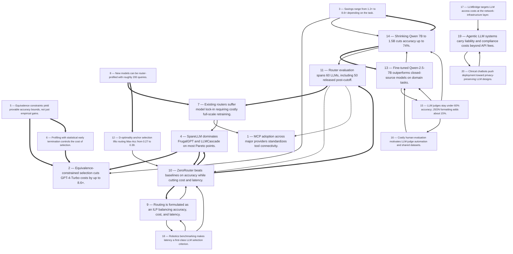

# Title: The captured sources contain no vendor price lists or per-token dollar rates…

## Corpus Quality Scoreboard

Quality: **39/100** - Grade D (Weak)

```
[########------------]  39/100
```

- Critic: review (coverage 50 | evidence 20 | balance 0 | tension 100)
- Sources: 9 gathered | 8 cited | 9 full text | 2 distinct domains | 5.0/8 average relevance

## Topic

LLM API pricing comparison 2025

## Search Queries

- OpenAI vs Anthropic vs Google LLM API pricing comparison 2025
- GPT-4o vs Claude vs Gemini API cost per million tokens 2025
- LLM API pricing comparison table 2025
- cheapest LLM API providers 2025
- OpenAI API pricing 2025
- Anthropic Claude API pricing 2025
- Google Gemini API pricing 2025
- LLM API price changes 2025
- open source LLM API hosting costs vs proprietary 2025
- large language model API pricing

### Search Engine Summary

| Engine | Pages | PDFs | Videos | Total |
|--------|-------|------|--------|-------|
| openalex | 9 | 0 | 0 | 9 |

### Search Provider Requests

| Search Provider | Requests |
|-----------------|----------|
| mf_search | 10 |

## Executive Summary

The captured sources contain no vendor price lists or per-token dollar rates for 2025; instead, they collectively show how effective LLM pricing is actually determined in practice: through workload-specific equivalence testing, intelligent routing, and fine-tuning rather than sticker-price comparison. SpareLLM (SIGMOD 2025) reports up to 8.6× cost savings versus GPT-4-Turbo under a ≥90% output-equivalence guarantee, with savings varying 1.2×–8.6× by task and dominating FrugalGPT/LLMCascade on most Pareto points [#6]. ZeroRouter (AAAI-26) attacks "model lock-in" by profiling new models with ~200 queries and jointly optimizing accuracy, cost, and latency across 60 LLMs, including 50 released after its training cutoff [#5]. Biomedical evaluation work shows that cheap and small models can substitute for expensive options only with safeguards: JSON-structured output adds ~15% judge accuracy, a fine-tuned Qwen-2.5-7B outperforms closed-source models, yet raw 7B→1.5B shrinking cuts accuracy up to 74% [#1]. Infrastructure-level cost reduction (LLMBridge), latency-aware benchmarking (ROS 2 robotics), MCP interoperability across major providers, and hidden compliance, liability, and privacy overheads complete a picture in which any 2025 pricing comparison must be dynamic, multi-dimensional, and workload-specific [#4][#8][#7][#3][#2].

## Top 10 Implications

1. Reframe price as cost-per-equivalent-output rather than per-token list price: SpareLLM's ≥90% equivalence constraint delivered up to 8.6× savings versus GPT-4-Turbo, meaning sticker-price comparisons systematically overstate flagship value (Finding 1, [#6]).
2. Benchmark per workload before choosing a model: per-dataset savings spanned 1.2×–8.6×, so a catalog winner on MMLU is not a winner on classification-style tasks (Finding 2, [#6]).
3. Treat model churn as a budget line: router lock-in forces costly retraining when new models arrive, but ~200-query zero-shot onboarding makes continuous re-evaluation affordable as the catalog grows (Findings 6, 7, 10; [#5]).
4. Shift spend from recurring inference premiums to one-time fine-tuning where domain data exists — a fine-tuned 7B open model outperformed closed-source judges on KD-DTI (Finding 12, [#1]).
5. Gate every model downgrade with statistics: provable accuracy bounds within 100·δ% of the reference turn cheap-model substitution into an auditable SLA rather than a gamble (Finding 4, [#6]).
6. Prefer current-generation selection and routing tools: SpareLLM dominated FrugalGPT/LLMCascade on 91.1% of Pareto points, and ZeroRouter beat its baselines on accuracy, cost, and latency simultaneously (Findings 3, 9; [#6][#5]).
7. If using cheap models for evaluation or extraction, enforce structured output: JSON formatting recovered ~15% judge accuracy where free text fell below 50% exact-match (Finding 14, [#1]).
8. Price latency as a first-class axis for interactive and embodied systems, using latency-weighted routing and domain-specific benchmarks rather than token cost alone (Findings 8, 17; [#5][#8]).
9. Budget for selection overhead and actively minimize it — statistical early termination, MILP allocation, and D-optimality anchor design keep profiling cost far below retraining cost (Findings 5, 7, 11; [#6][#5]).
10. Add compliance, liability, privacy, and infrastructure overhead to total-cost comparisons, especially for agentic and clinical deployments where the cheapest non-compliant option is not actually usable (Findings 19, 20, 16; [#3][#2][#4]).

## Open Questions

- No source provides actual 2025 per-token dollar prices for any vendor; all cost evidence is relative (multipliers, normalized deltas) — a primary price-table capture is needed to anchor the comparison.
- How do SpareLLM's savings translate into dollar budgets at realistic token volumes, and does the ≥90% equivalence threshold hold under model version updates or vendor repricing?
- What is the absolute profiling cost (queries and dollars) of SpareLLM and ZeroRouter onboarding in production, and at what traffic volume does selection break even against simply calling a mid-tier model?
- Does the fine-tuned small-model advantage (Qwen-2.5-7B over closed-source judges) generalize beyond biomedical relation extraction to open-ended generation tasks?
- Does the ~15% JSON-formatting accuracy gain for LLM judges hold outside exact-match string metrics and outside the biomedical domain?
- What mechanism does LLMBridge actually propose for cost reduction (the abstract truncates at "We envisi…"), and what savings does it quantify?
- What latency–price tradeoffs does the ROS 2 benchmark measure, and which models were compared (the excerpt truncates the contribution)?
- What token and latency overhead do MCP tool calls add per task, and how does that overhead vary across models and providers under the shared protocol?
- How should GDPR/CCPA exposure and product-versus-service liability be priced into multi-provider agentic architectures, and does joint-and-several liability risk materially change the multi-vendor calculus?
- How sensitive are ZeroRouter's ILP routing outcomes to the user-specified accuracy/cost/latency weights, and what weight settings do representative workloads require?
- What were the actual human-evaluation costs that motivated the LLM-judge substitution, in dollars per judgment, and how do they compare to judge inference costs?
- Can latent-space routers handle pricing changes (not just new model releases) without retraining, given that price changes alter the cost objective but not model capability?

## Data Quality & Consistency

**Overall verdict:** Proceed — the synthesis passes the deterministic 4-critic audit.

| Metric | Value | Detail |
|--------|-------|--------|
| Corpus critic | 39/100 (review) | coverage 50 · evidence 20 · balance 0 · tension 100 |
| Contradictions | 0 edge(s) | no edges |
| Source tensions | 10 tension(s) | 0 contradiction · 4 shallow · 6 isolated |
| Synthesis audit | 100/100 (proceed) | 8 source(s) cited |

**Key concerns:**
- Corpus: Dimension 'Accessibility' has only surface-level support (1 source(s))
- Corpus: Dimension 'Adoption' has only surface-level support (1 source(s))
- Tension (shallow evidence): Accessibility [#8] — surface evidence: only 1 source(s) mention this dimension.
- Tension (shallow evidence): Adoption [#7] — surface evidence: only 1 source(s) mention this dimension.
- Audit: Synthesis audit for 'LLM API pricing comparison 2025' scored 100/100 across critics [coverage=100 logic=100 evidence=100 readability=100]; 8/9 sources cited.

## Concepts

### 1. LLM-as-a-Judge Evaluation
**Definition:** Using large language models themselves as automated evaluators of other LLMs' outputs, proposed as a cheaper alternative to human evaluation. Empirical results show judges often perform poorly on tasks requiring precise answer matching.

**Key Evidence:**
- 8 LLM judges (e.g., GPT-4o-Mini, Gemini-1.5-Flash, Claude-3-Haiku) evaluated outputs from 5 generator LLMs, typically scoring below 50% exact-match accuracy; only GPT-4o-Mini exceeded 50% [#1].
- Judges struggled with unstructured, synonym-laden responses (e.g., "dexamethasone" vs. gold "dex") that defeat string-matching metrics [#1].


### 2. Biomedical Relation Extraction
**Definition:** The NLP task of extracting clinically meaningful relations (chemical–disease, drug–target, drug–drug) from biomedical text, used as the testbed for evaluating LLM judges.

**Key Evidence:**
- Benchmarks included BC5CDR (chemical–disease, 500 samples), KD-DTI (drug–target interaction, 1159), and DDI (drug–drug interaction, 191) [#1].
- Gold answers use abbreviations/short forms that LLM generators fail to reproduce exactly, harming judge accuracy [#1].


### 3. Structured Output Formatting
**Definition:** Constraining LLM outputs to machine-readable formats such as JSON so automated evaluation can parse and match answers reliably.

**Key Evidence:**
- Requiring JSON output improved judge accuracy by about 15% on average, with statistically significant gains (p < 0.05) [#1].


### 4. Domain Adaptation via Fine-Tuning
**Definition:** A transfer-learning technique that fine-tunes (open-source) LLM judges on limited human-annotated out-of-domain judgment data to boost evaluation performance.

**Key Evidence:**
- Fine-tuned Qwen-2.5-7B reached 75.75% on KD-DTI (+13.97), outperforming closed-source models [#1].
- A fine-tuned 3B model could outperform the zero-shot 7B judge [#1].


### 5. Human vs. Automated Evaluation
**Definition:** The trade-off between costly human annotation and scalable LLM-based judging; current LLM judges still underperform human evaluators despite improvements.

**Key Evidence:**
- The work is motivated by the cost of human evaluation, yet concludes LLM judges still fall short of human evaluators [#1].
- The released resource mixes 4k human-annotated with 32k LLM-annotated judgment samples [#1].


### 6. LLM Inference Cost Efficiency
**Definition:** Reducing the monetary cost of using LLMs at scale via cheaper model access, routing, or automated selection of low-cost models.

**Key Evidence:**
- LLMBridge targets reducing costs to access LLMs in a prompt-centric Internet, noting middleboxes like HTTP proxies are crucial for cost-effectiveness [#4].
- SpareLLM achieved up to 8.6× cost savings vs. GPT-4-Turbo and dominated 91.1% of Pareto points against FrugalGPT/LLMCascade for OpenAI models [#6].
- ZeroRouter achieved lower cost (−0.17) alongside higher accuracy relative to baselines [#5].


### 7. LLM Routing and Model Selection
**Definition:** Dynamically choosing which LLM among many should serve each query or task to balance accuracy, cost, and latency.

**Key Evidence:**
- ZeroRouter routes queries across 60 LLMs using DistilBERT semantic embeddings plus structural linguistic features [#5].
- SpareLLM selects task-specific minimum-cost LLMs guaranteed to be equivalent to a reference model [#6].


### 8. Model Lock-In and Zero-Shot Routing
**Definition:** The limitation of existing routers that require costly full-scale retraining whenever a new model is added; zero-shot routing profiles new models cheaply without retraining.

**Key Evidence:**
- Routers like HybridLLM, RouteLLM, MixLLM, GraphRouter, and FORC suffer model lock-in; ZeroRouter profiles new models with only ~200 queries [#5].
- ZeroRouter beat baselines on 3 out-of-distribution datasets (ARC-C, TruthfulQA, HumanEval), including on 50 models released after the router's training cutoff [#5].


### 9. Universal Latent Space via Item Response Theory
**Definition:** A shared embedding space, built on a multidimensional 2PL IRT model, that decouples query characterization from model profiling so any new model can be positioned without retraining the router.

**Key Evidence:**
- Latent dimension D=20, trained on Open LLM Leaderboard data from 200 models; coordinates predicted from DistilBERT embeddings plus 11 structural linguistic features [#5].
- D-optimality (Fisher information) anchor-set selection lifted Max-Acc from 0.27 (random sampling) to 0.39 [#5].


### 10. Equivalence Constraints and Statistical Confidence
**Definition:** Guaranteeing that a cheaper model's outputs are equivalent to a reference model with user-defined probability and confidence thresholds, using formal statistical estimation.

**Key Evidence:**
- SpareLLM profiles cheap LLMs with Bernoulli trials and Clopper-Pearson binomial confidence intervals, terminating early when further profiling is wasteful [#6].
- Its equivalence guarantees yield a provable accuracy bound within 100·δ% of the reference model's accuracy [#6].


### 11. Optimization-Based Model Allocation
**Definition:** Formulating model selection or routing as integer (linear) programming problems that balance multiple objectives under constraints.

**Key Evidence:**
- ZeroRouter formulates routing as an Integer Linear Program over accuracy, cost, and latency with user-specified weights [#5].
- SpareLLM allocates remaining items across multiple LLMs via a mixed integer linear program [#6].


### 12. Real-World LLM Benchmarking
**Definition:** Evaluating LLMs on realistic tasks and out-of-distribution settings rather than narrow or synthetic benchmarks.

**Key Evidence:**
- ZeroRouter was evaluated on 9 datasets (6 in-distribution, e.g., MATH, GPQA, MMLU-PRO; 3 OOD) over 60 LLMs [#5].
- MCP-Universe benchmarks LLMs with real-world Model Context Protocol servers [#7]; the ROS 2 work benchmarks LLMs for robot navigation under latency constraints [#8].


### 13. Model Context Protocol (MCP)
**Definition:** A standardized interface for connecting LLMs to external data sources and tools, rapidly adopted across major AI providers and developers.

**Key Evidence:**
- MCP is characterized as a transformative standard for connecting LLMs to external data sources and tools, with rapid adoption across major AI providers [#7].


### 14. Privacy-Preserving Clinical Chatbots
**Definition:** LLM-based medical chatbots designed to protect patient data while supporting self-management of chronic conditions such as hypertension.

**Key Evidence:**
- The article addresses privacy-preserving LLM chatbots for hypertensive patient self-management, noting medical chatbots are becoming a basic component of telemedicine [#2].
- The agentic-systems paper flags information-sharing risks such as GDPR/CCPA violations arising from task misdelegation [#3].


### 15. Model Scaling and Size Effects
**Definition:** How LLM parameter count affects accuracy and cost, including whether fine-tuning smaller models can substitute for larger ones.

**Key Evidence:**
- Shrinking Qwen from 7B to 1.5B cut judge accuracy by 58.70%/45.12%/74.44% on BC5CDR/DDI/KD-DTI [#1].
- ZeroRouter's evaluation spans 10 core models from 1B–235B parameters plus 50 newer models [#5].


### 16. Liability in Agentic LLM Systems
**Definition:** Legal responsibility questions for LLM-based agents, analyzed through principal-agent theory using US frameworks such as the Restatement of Torts and Restatement of Law.

**Key Evidence:**
- Single-agent liability stems from flawed artificial agency (instability, inconsistency, ephemerality, planning-limitedness) and task misdelegation (underspecification, negligent selection/hiring) [#3].
- Legal treatment may fall under product liability (strict liability) or service-based negligence, with vicarious liability and joint-and-several liability when causes cannot be disentangled [#3].


### 17. Multiagent System Risks
**Definition:** Emergent liability and operational issues arising when multiple LLM agents interact, beyond single-agent failure modes.

**Key Evidence:**
- Multiagent issues include role and agency allocation, operational uncertainty such as failure cascades and agent collusion, and platform integration [#3].
- Proposed remedies include credit/trust scoring systems and arbitration protocols for reward and conflict management [#3].


### 18. Misalignment Behaviors and Oversight
**Definition:** Problematic agent behaviors—sycophancy, manipulation, deception, scheming—that compromise human oversight, together with technical countermeasures.

**Key Evidence:**
- Compromised oversight is attributed to behaviors such as sycophancy, manipulation, deception, and scheming [#3].
- Proposed mitigations include detection, behavior steering, and "warden" agents, supporting transparency, auditing, and liability attribution [#3].


### 19. Latency-Aware LLM Deployment
**Definition:** Designing and benchmarking LLM systems that meet real-time response constraints, whether in routing decisions or embodied applications.

**Key Evidence:**
- ZeroRouter explicitly balances latency (−0.25 vs. baselines) alongside accuracy and cost in its routing objective [#5].
- The ROS 2 work introduces a latency-aware approach to benchmarking LLMs for natural-language robot navigation [#8].


### 20. Citizen Science for Ecological Conservation
**Definition:** Public participation in ecological data collection—including passive, social-media-derived observations—to support conservation decision-making.

**Key Evidence:**
- Effective conservation depends on comprehensive ecological data, including species occurrence records for tracking distribution shifts, detecting invasive species, and assessing wildlife–human interactions [#9].
- The article examines challenges of passive citizen science in ecology within a shifting social media landscape [#9].

## Findings


### **Finding 1** — MCP adoption across major providers standardizes tool connectivity.

**Observation:**
The 2025 arXiv paper MCP-Universe characterizes the Model Context Protocol as a transformative standard for connecting LLMs to external data sources and tools, noting its rapid adoption across major AI providers and developers, and benchmarks models against real-world MCP servers; the abstract text is truncated beyond this description [#7].

**Analysis:**
Interoperability standards change pricing dynamics indirectly but powerfully.

If the same MCP integration works across multiple providers — the source reports adoption across major AI providers — then the marginal cost of switching or multi-homing between APIs falls, strengthening buyers' negotiating position and weakening vendor lock-in on the integration side.

This complements the routing-side attack on lock-in in Findings 6–7: ZeroRouter removes the retraining cost of adding models to a router, while MCP removes the integration cost of pointing an application at a different provider.

The benchmarking angle matters too: MCP-Universe evaluates models against real-world MCP servers, meaning tool-use overhead (schema tokens, multi-turn tool calls) becomes a measurable component of effective cost, since agentic calls consume more tokens per task than single-shot queries.

Caveats are structural: the abstract is truncated, so no quantitative findings on model performance or token overhead can be cited, and the source makes no pricing claims at all.

What is safely inferable is directional: as MCP-standardized tool use spreads, comparisons of API pricing must account for the token and latency overhead of tool-augmented calls, which can differ across models even under a shared protocol and can dominate per-task cost in agentic workloads.

**Cross-reference / Dependencies:**
No direct dependencies; pairs with the lock-in analysis of Findings 6 and 7 and feeds the total-cost framing of Findings 16 and 19.

**Implication:**
Prefer MCP-compatible stacks to keep switching costs low, and benchmark tool-augmented workloads specifically, since tool-call token overhead can dominate per-task cost.

**Limitation:**
The truncated abstract reports adoption and benchmarking intent but no results; claims here are limited to the standard's spread and its directional effect on switching costs.

**Sources:**
- [7] MCP-Universe: Benchmarking Large Language Models with Real-World Model Context Protocol Servers [Luo, Ziyang, Zhiqi Shen, Wenzhuo Yang, Zirui Zhao, Prathyusha Jwalapuram, Amrita Saha, Doyen Sahoo, Silvio Savarese, Caiming Xiong, Junnan Li] — [http://arxiv.org/abs/2508.14704](http://arxiv.org/abs/2508.14704)

**Source date range:** — (cited web sources did not expose a publication date)


### **Finding 2** — Equivalence-constrained selection cuts GPT-4-Turbo costs by up to 8.6×.

**Observation:**
SpareLLM (Selecting Passable And Resource-Efficient LLMs), a SIGMOD 2025 framework from Cornell, minimizes inference costs for large-scale NLP tasks while guaranteeing outputs equivalent to a reference LLM — typically the most powerful model — at user-defined probability and confidence thresholds; on OpenAI models it achieved cost savings up to 8.6× versus GPT-4-Turbo at a ≥90% equivalence constraint [#6].

**Analysis:**
This reframes what an "LLM API pricing comparison" should measure.

The sticker price per token is only meaningful relative to the quality a task actually requires; SpareLLM prices the cheaper model in units of "acceptable output," verified statistically against a reference model rather than assumed.

The 8.

6× figure is not a vendor discount but an arbitrage between GPT-4-Turbo's list cost and true task difficulty, discovered empirically via Bernoulli-trial profiling with Clopper-Pearson confidence intervals [#6].

That mechanism matters because 2025 catalogs span wide price gaps between flagship and small models, and this source shows a large share of that gap can be captured without sacrificing task-equivalent quality.

Limitations: evidence covers five datasets and OpenAI plus Llama model families (3B–405B), with no dollar-denominated prices anywhere in the corpus, so absolute savings cannot be computed here; the ≥90% equivalence threshold is a user choice that shifts the cost–quality frontier.

Compared with Finding 3, the headline number is a best case, not a typical case.

Still, the finding establishes the central lesson for the topic: the cheapest acceptable model, not the cheapest listed model, defines real price performance.

**Cross-reference / Dependencies:**
Prerequisite for Findings 2, 3, 4, and 5, which decompose the savings variability, tooling dominance, guarantee structure, and profiling overhead behind this headline result.

**Implication:**
Procurement should pilot equivalence-based selection on its own workloads before committing to any flagship model, treating the flagship as a validated fallback reference rather than the default.

**Caveat:**
The source reports savings as multipliers relative to GPT-4-Turbo, not dollars; converting to budget impact requires token volumes and current list prices, neither of which the captured sources provide.

**Sources:**
- [6] SpareLLM: Automatically Selecting Task-Specific Minimum-Cost Large Language Models under Equivalence Constraint — [https://doi.org/10.1145/3725356](https://doi.org/10.1145/3725356)

**Source date range:** — (cited web sources did not expose a publication date)


### **Finding 3** — Savings range from 1.2× to 8.6× depending on the task.

**Observation:**
Per-dataset cost savings for SpareLLM against GPT-4-Turbo were 1.2× on MMLU, 8.6× on IMDB, 4.5× on SMS-Spam, 7.2× on AgNews, and 1.4× on HellaSwag, all under a ≥90% equivalence constraint [#6].

**Analysis:**
The dispersion is itself the finding: the same selection framework, the same reference model, and the same equivalence threshold produced savings differing by more than 7× across tasks.

Tasks where cheap models closely track the reference (sentiment on IMDB, topic classification on AgNews, spam detection) yield large headroom, while knowledge- and reasoning-heavy benchmarks (MMLU, HellaSwag) compress savings to 1.

2×–1.

4×, implying flagship capacity is genuinely load-bearing there.

For a 2025 pricing comparison, this means any single "price-performance winner" is an artifact of benchmark choice: a chat or extraction workload and a reasoning workload would rank the same catalog differently.

The pattern also anticipates Finding 14, where shrinking Qwen 7B to 1.

5B cut accuracy sharply on biomedical tasks — downgrade headroom is neither free nor uniform.

Methodologically, the numbers come from only five datasets, all classification- or benchmark-style, so open-ended generative tasks are untested in this source.

The practical rule implied is that savings claims must always be quoted with their task, threshold, and reference model attached; averaged or decontextualized multipliers, common in vendor marketing, are analytically meaningless.

**Cross-reference / Dependencies:**
Builds directly on Finding 2; the task-dependence pattern is consistent with the downgrade risks quantified in Finding 14.

**Implication:**
Budget planning should be per-workload: run the equivalence profiler on each production task class and price the catalog task by task instead of adopting one global model choice.

**Sources:**
- [6] SpareLLM: Automatically Selecting Task-Specific Minimum-Cost Large Language Models under Equivalence Constraint — [https://doi.org/10.1145/3725356](https://doi.org/10.1145/3725356)

**Source date range:** — (cited web sources did not expose a publication date)


### **Finding 4** — SpareLLM dominates FrugalGPT and LLMCascade on most Pareto points.

**Observation:**
Evaluated against the cost-saving baselines LLMCascade and FrugalGPT, SpareLLM dominated 91.1% of Pareto curve points for OpenAI models and 83.8% for Llama models spanning 3B, 8B, 70B, and 405B parameters, across MMLU, IMDB, SMS-Spam, AgNews, and HellaSwag [#6].

**Analysis:**
This finding locates SpareLLM within a lineage of cost-reduction methods: FrugalGPT popularized model cascades as the standard way to cut LLM spend, and LLMCascade is a direct competitor, yet SpareLLM's equivalence-guaranteed selection beats both on the overwhelming majority of cost–quality tradeoff points.

Two readings follow for the pricing topic.

First, tooling generation matters as much as model generation: a team that adopted cascade routing in earlier years may be systematically leaving savings on the table relative to 2025-era selection frameworks.

Second, the Llama-family result (3B–405B) shows the approach is not an OpenAI-specific artifact, which matters because open-weight catalogs change the price calculus entirely by removing per-token fees for self-hosted capacity.

The residual 8–16% of non-dominated points is a genuine caveat: cascades remain preferable somewhere, so replacement rather than blanket adoption is the right posture.

Together with Finding 10, where ZeroRouter also beats its routing baselines on every objective, the evidence converges on 2025 being a year in which the state of the art in cost optimization moved decisively, and comparisons built on older methods understate achievable savings.

**Cross-reference / Dependencies:**
Builds on Finding 2; converges with Finding 10's evidence that newer routing methods beat their baselines across all objectives.

**Implication:**
Audit existing cost-optimization stacks against current frameworks; if production still uses cascade heuristics, a Pareto re-evaluation is likely to find recoverable spend.

**Sources:**
- [6] SpareLLM: Automatically Selecting Task-Specific Minimum-Cost Large Language Models under Equivalence Constraint — [https://doi.org/10.1145/3725356](https://doi.org/10.1145/3725356)

**Source date range:** — (cited web sources did not expose a publication date)


### **Finding 5** — Equivalence constraints yield provable accuracy bounds, not just empirical gains.

**Observation:**
SpareLLM's equivalence guarantees also yield a provable accuracy bound within 100·δ% of the reference model's accuracy, derived from its Bernoulli-trial profiling with Clopper-Pearson binomial confidence intervals [#6].

**Analysis:**
Most cost-saving advice in the LLM market is empirical — benchmark scores and cherry-picked evaluations — but this finding shows a statistical contract is achievable: choose a confidence threshold, and the framework guarantees the selected cheaper model's accuracy stays within a user-defined distance of the reference.

For pricing comparison, this converts model substitution from a judgment call into a risk-parameterized decision, analogous to an SLA, which is exactly what regulated or high-volume deployments need before downgrading from premium APIs.

The bound's structure carries two caveats worth weighing.

It is relative to the reference model, so if the reference (typically the most powerful model) is itself wrong on a task, the guarantee inherits those errors — it certifies parity, not correctness [#6].

And the bound is only as tight as the profiling sample, which is why the early-termination machinery in Finding 6 matters: stopping profiling early saves money but widens the intervals.

The δ parameter effectively becomes a dial linking price to guaranteed quality, something no static price table can express.

This is the strongest form of evidence in the corpus that "cheaper model at a discount" can be made safe rather than merely probable.

**Cross-reference / Dependencies:**
Builds on Finding 2 and depends on the profiling mechanics described in Finding 6.

**Implication:**
Adopt δ-style equivalence thresholds as contractual quality gates in model procurement, and document the reference model and confidence level alongside any cost-savings claim.

**Sources:**
- [6] SpareLLM: Automatically Selecting Task-Specific Minimum-Cost Large Language Models under Equivalence Constraint — [https://doi.org/10.1145/3725356](https://doi.org/10.1145/3725356)

**Source date range:** — (cited web sources did not expose a publication date)


### **Finding 6** — Profiling with statistical early termination controls the cost of selection.

**Observation:**
SpareLLM works in two phases: a profiling phase comparing cheaper LLMs' outputs to the reference using Bernoulli trials and Clopper-Pearson binomial confidence intervals, with early termination when further profiling is estimated to be wasteful, and an application phase allocating remaining items across multiple LLMs via a mixed integer linear program; it ships as three incremental variants — ProfileAll, ProfileSmart, and ModelMix [#6].

**Analysis:**
Selection itself consumes paid API calls, so any honest pricing comparison must charge the selection mechanism against its own savings — a meta-cost that price tables ignore entirely.

This source is explicit about the problem and its remedies: early termination stops profiling when additional samples are estimated to be wasteful, and the three variants offer a dial between profiling breadth and realized savings, presumably with ProfileAll spending the most upfront and ModelMix blending strategies.

The MILP allocation phase extends the logic from "pick one cheap model" to "split traffic across several models," which mirrors how real deployments amortize heterogeneous query difficulty.

The parallel with ZeroRouter is striking: its ~200-query D-optimality anchor profiling (Findings 7 and 11) attacks the same onboarding-cost problem from the routing side, suggesting that by 2025 the field treats profiling overhead as a first-class cost line, not a footnote.

What the sources do not provide is any dollar quantification of profiling cost, so the traffic volume at which selection pays for itself remains unknown from this evidence.

The takeaway for the topic is that selection frameworks have internal economics that must appear in any total-cost model of API usage.

**Cross-reference / Dependencies:**
Builds on Finding 2; parallels the profiling-cost approach of ZeroRouter in Findings 7 and 11.

**Implication:**
When comparing pricing strategies, include profiling/query overhead in the model and choose the SpareLLM variant (or ZeroRouter onboarding) matching traffic volume and tolerance for upfront spend.

**Sources:**
- [6] SpareLLM: Automatically Selecting Task-Specific Minimum-Cost Large Language Models under Equivalence Constraint — [https://doi.org/10.1145/3725356](https://doi.org/10.1145/3725356)

**Source date range:** — (cited web sources did not expose a publication date)


### **Finding 7** — Existing routers suffer model lock-in requiring costly full-scale retraining.

**Observation:**
The AAAI-26 ZeroRouter paper identifies "model lock-in" as the need for costly full-scale retraining when adding new models to established routing systems, naming HybridLLM, RouteLLM, MixLLM, GraphRouter, and FORC as affected frameworks [#5].

**Analysis:**
Lock-in is a switching cost, and switching costs are pricing variables even though they never appear on a price list.

If every new model release forces retraining of the routing layer, the effective cost of staying current rises with catalog velocity — and 2025's velocity is demonstrably high, as evidenced by ZeroRouter's own evaluation over 50 models released after its training cutoff (Finding 11).

The named baselines span the main routing paradigms (hybrid cascade routers, graph-based routers, learned mixtures), so the lock-in problem is systemic rather than a flaw of one design.

For a pricing-comparison topic, this reframes vendor and model selection as a portfolio problem: the cheapest model this quarter may not be cheapest once retraining amortization is included, and conversely a slightly pricier but stable setup may win over a planning horizon.

ZeroRouter's response — decoupling query characterization from model profiling via a universal latent space — is one architectural answer, and its ~200-query onboarding (Finding 8) quantifies how small the marginal cost of adding a model can become.

The evidence stops short of quantifying retraining cost in dollars or GPU-hours for the baselines, which is a gap, but the claim that retraining is "costly" is explicit in the source [#5].

**Cross-reference / Dependencies:**
Prerequisite for Findings 7 and 10; connects to the interoperability angle of Finding 1 and the tooling-generation logic of Finding 4.

**Implication:**
Evaluate routing and selection infrastructure on marginal cost per newly added model, not just steady-state accuracy, and prefer architectures that amortize across releases.

**Sources:**
- [5] Breaking Model Lock-in: Cost-Efficient Zero-Shot LLM Routing via a Universal Latent Space — [https://doi.org/10.1609/aaai.v40i43.40970](https://doi.org/10.1609/aaai.v40i43.40970)

**Source date range:** — (cited web sources did not expose a publication date)


### **Finding 8** — New models can be router-profiled with roughly 200 queries.

**Observation:**
ZeroRouter selects an informative anchor set using D-optimality (Fisher information) to profile a new model cheaply — approximately 200 queries — and predicts the model's latent coordinates from DistilBERT semantic embeddings plus 11 structural linguistic features [#5].

**Analysis:**
Two hundred queries is a rounding error against full-scale retraining, so this finding converts model onboarding from a project into a chore that can run every time a vendor ships a release.

The mechanism matters as much as the number: by anchoring profiling on the most informative queries (D-optimality over Fisher information) rather than sampling randomly, information per paid query is maximized, and Finding 12 shows this design choice is worth real accuracy (Max-Acc 0.

27 random → 0.

39).

The latent coordinates are predicted rather than measured exhaustively, meaning even the 200 queries function partly as a calibration set.

For the pricing-comparison topic, cheap onboarding has a direct consequence: re-benchmarking the catalog after every price or model change becomes economically rational, which keeps comparisons current in a market where Finding 11 documents 50 post-cutoff model releases.

Limitations: the figure is measured on the paper's benchmark stack (9 datasets, 60 LLMs) and presumes access to the Open LLM Leaderboard-derived latent space (D=20, trained on 200 models); a model far outside that distribution may need more queries.

Even with that hedge, the order-of-magnitude claim — onboarding costs orders of magnitude less than retraining — is the key pricing-relevant fact.

**Cross-reference / Dependencies:**
Builds on the lock-in framing of Finding 7; the anchor-set quality question is quantified in Finding 12.

**Implication:**
Stand up a pipeline that profiles every newly released model with a few hundred probe queries so pricing and routing decisions refresh continuously rather than annually.

**Sources:**
- [5] Breaking Model Lock-in: Cost-Efficient Zero-Shot LLM Routing via a Universal Latent Space — [https://doi.org/10.1609/aaai.v40i43.40970](https://doi.org/10.1609/aaai.v40i43.40970)

**Source date range:** — (cited web sources did not expose a publication date)


### **Finding 9** — Routing is formulated as an ILP balancing accuracy, cost, and latency.

**Observation:**
ZeroRouter formulates routing as an Integer Linear Program balancing accuracy, cost, and latency with user-specified weights, built on a universal latent space trained via a multidimensional 2PL Item Response Theory model (latent dimension D=20, using Open LLM Leaderboard data from 200 models) [#5].

**Analysis:**
A price comparison implicitly assumes a single objective — minimize spend — but production systems juggle at least three: answer quality, dollars, and response time.

Casting routing as an ILP over a latent model-quality space makes the tradeoff explicit and tunable: a batch analytics pipeline can weight cost heavily while a user-facing assistant weights latency, all on the same infrastructure.

The IRT-based latent space is the enabling component — it decouples query characterization from model profiling (Finding 7), so objectives can be optimized over the model catalog without per-model retraining.

This formalization also explains the multi-objective wins in Finding 10: when accuracy, cost, and latency are separate constraints in one optimization, improvements need not come at each other's expense the way single-objective greedy selection implies.

The robotics evidence in Finding 18 shows latency entering the objective function is not academic — embodied and interactive applications fail on latency before they fail on price.

One caveat: results depend on user-specified weights, and the source does not report sensitivity analyses over weight choices, leaving an open question for practitioners adopting the framework about how stable the optimal routing policy is under different preference settings.

**Cross-reference / Dependencies:**
Prerequisite for interpreting Finding 10's multi-objective results; thematically aligned with the latency-first benchmarking in Finding 18.

**Implication:**
Expose accuracy/cost/latency weights as configuration to application owners, and treat "cheapest model" as one point on a tunable frontier rather than a fixed answer.

**Sources:**
- [5] Breaking Model Lock-in: Cost-Efficient Zero-Shot LLM Routing via a Universal Latent Space — [https://doi.org/10.1609/aaai.v40i43.40970](https://doi.org/10.1609/aaai.v40i43.40970)

**Source date range:** — (cited web sources did not expose a publication date)


### **Finding 10** — ZeroRouter beats baselines on accuracy while cutting cost and latency.

**Observation:**
Across 9 datasets (in-distribution: IFEval, BBH, MATH, GPQA, MuSR, MMLU-PRO; out-of-distribution: ARC-C, TruthfulQA, HumanEval), ZeroRouter consistently beat baselines on all objectives — higher Max-Acc (0.45 for small-model in-distribution; 0.68 vs 0.62 OOD for large models) alongside lower cost (−0.17) and latency (−0.25) [#5].

**Analysis:**
The striking element is simultaneity: cost and latency improvements usually purchase accuracy losses, yet here the router dominates on all three axes, which implies the baselines were leaving savings unclaimed by over-provisioning queries to stronger models than needed.

The cost and latency figures are normalized deltas (−0.

17, −0.

25) rather than dollars or milliseconds, so translating them into budget impact requires an anchor the sources do not supply — a recurring limitation across this corpus, where relative improvements abound and absolute prices are absent.

The out-of-distribution margin (0.

68 vs 0.

62) is arguably the more decision-relevant number because production traffic is always out-of-distribution relative to any training set; it suggests the latent-space approach generalizes rather than overfits the benchmark stack.

Combined with Finding 4, where SpareLLM dominates cascade baselines on 91.

1% of Pareto points, the 2025 evidence consistently shows incumbent cost-optimization methods being beaten on their own turf.

For the pricing topic, the actionable conclusion is that a naive "pick the cheapest model" or "pick one mid-tier model" policy is measurably inferior to optimized routing on every dimension a pricing comparison cares about.

**Cross-reference / Dependencies:**
Builds on the ILP formulation of Finding 9; complements the Pareto-dominance evidence of Finding 4; evaluation breadth is detailed in Finding 11.

**Implication:**
Treat routing quality as a pricing lever: upgrading the routing layer can yield savings comparable to changing model tiers, without sacrificing accuracy or latency.

**Metric note:**
Cost and latency results are normalized objective values, not monetary or temporal units; absolute savings require price anchors the sources do not contain.

**Sources:**
- [5] Breaking Model Lock-in: Cost-Efficient Zero-Shot LLM Routing via a Universal Latent Space — [https://doi.org/10.1609/aaai.v40i43.40970](https://doi.org/10.1609/aaai.v40i43.40970)

**Source date range:** — (cited web sources did not expose a publication date)


### **Finding 11** — Router evaluation spans 60 LLMs, including 50 released post-cutoff.

**Observation:**
ZeroRouter was evaluated over 60 LLMs — 10 core models spanning 1B to 235B parameters plus 50 models released after the router's training cutoff — across its 9-dataset suite [#5].

**Analysis:**
This is direct evidence about catalog churn, the force that makes any static 2025 price comparison stale within months.

Half the evaluated models did not exist when the router's latent space was trained, yet the system still routed them well enough to beat baselines (Finding 10), which is precisely the property needed in a market where vendors ship flagship and budget models on rapid cadences.

The 1B–235B parameter span plausibly maps onto the price hierarchy of API catalogs — from cheap small-model tiers to flagship tiers — so the result covers the full pricing spectrum rather than a single band.

Two cautions temper the conclusion.

The latent space was built from Open LLM Leaderboard data on 200 models, so "post-cutoff" still means models within a benchmark-covered ecosystem; radically different families or modalities might profile less accurately.

And leaderboard ability is a proxy for the task quality buyers actually experience.

Even so, for the pricing-comparison question the finding implies that continuous, cheap re-evaluation (Finding 8) is feasible at the scale the market actually moves, and that comparisons locked to a fixed model snapshot systematically miss newer, often cheaper entrants.

**Cross-reference / Dependencies:**
Builds on the lock-in framing of Finding 7 and supports the generalization claims of Finding 10; relates to the churn-driven switching-cost discussion in Finding 1.

**Implication:**
Build model-comparison processes that automatically incorporate newly released models within days, since half the relevant catalog in a fast-moving year will postdate any fixed benchmark snapshot.

**Sources:**
- [5] Breaking Model Lock-in: Cost-Efficient Zero-Shot LLM Routing via a Universal Latent Space — [https://doi.org/10.1609/aaai.v40i43.40970](https://doi.org/10.1609/aaai.v40i43.40970)

**Source date range:** — (cited web sources did not expose a publication date)


### **Finding 12** — D-optimality anchor selection lifts routing Max-Acc from 0.27 to 0.39.

**Observation:**
An ablation replacing D-optimality anchor selection with random sampling dropped ZeroRouter's Max-Acc from 0.39 to 0.27; the router itself was trained on a single NVIDIA A800 (80GB) GPU [#5].

**Analysis:**
Two cost-relevant facts sit in this finding.

First, anchor quality is not a nicety: nearly half the routing accuracy (0.

27→0.

39) depends on choosing informative probe queries rather than random ones, so teams implementing the cheap ~200-query onboarding of Finding 8 must invest in experimental design or forfeit much of the benefit.

Fisher-information-based selection concentrates the same query budget on the probes that best discriminate model capabilities, which is exactly what makes the small profiling budget viable.

Second, the training footprint — one A800 80GB — indicates the infrastructure cost of building the router is modest by LLM-era standards; this is not a foundation-model training run.

That matters for the pricing comparison because the capex side of a routing strategy faces a low amortization hurdle against the recurring savings reported in Finding 10.

Limitation: the ablation is a single-factor study on one component; interactions with the latent-space dimension (D=20) or the DistilBERT-plus-features predictor are not decomposed in the available evidence.

The overall message is that the overhead side of smart selection is controllable on both the query budget and the compute side, making the total cost of ownership of routing infrastructure small relative to inference spend.

**Cross-reference / Dependencies:**
Builds on the profiling designs of Findings 5 and 7; supports the low-overhead assumption underlying Finding 10's cost results.

**Implication:**
If adopting profile-based routing, budget for principled anchor selection — probe-query design determines whether the ~200-query onboarding actually delivers.

**Sources:**
- [5] Breaking Model Lock-in: Cost-Efficient Zero-Shot LLM Routing via a Universal Latent Space — [https://doi.org/10.1609/aaai.v40i43.40970](https://doi.org/10.1609/aaai.v40i43.40970)

**Source date range:** — (cited web sources did not expose a publication date)


### **Finding 13** — Fine-tuned Qwen-2.5-7B outperforms closed-source models on domain tasks.

**Observation:**
In the ACL 2025 biomedical relation-extraction study, a domain adaptation/transfer learning technique — fine-tuning on limited human-annotated out-of-domain judgment data — boosted open-source judges, with fine-tuned Qwen-2.5-7B reaching 75.75% on KD-DTI (+13.97) and outperforming closed-source models [#1].

**Analysis:**
This is the corpus's clearest demonstration that the sticker-price hierarchy is not the capability hierarchy once customization enters.

Closed-source judges (GPT-4o-Mini, Gemini-1.

5-Flash, Claude-3-Haiku) led in zero-shot conditions — GPT-4o-Mini was the only judge above 50% exact-match (Finding 15) — yet a 7B open-weight model, tuned on a small volume of human-annotated data, surpassed them on KD-DTI.

Economically, this trades a recurring per-token premium for a one-time data-collection and training cost, a trade whose break-even depends on query volume; the released 36k judgment samples (4k human-annotated, 32k LLM-annotated) suggest the annotation burden is manageable and partly automatable (Finding 16).

The caveats are scope limits: the result is demonstrated for biomedical relation-extraction judgments, a narrow, well-defined task with reference data available, and the authors themselves note LLM judges still fall short of human evaluators.

Extrapolation to open-ended generation is plausible but unproven in this source.

For the pricing-comparison topic, the finding shifts the axis of comparison from "which API is cheapest" to "which spend mix — inference premium versus fine-tuning capex — minimizes cost per correct output," a question Finding 14 sharpens by showing fine-tuning also rescues smaller parameter counts.

**Cross-reference / Dependencies:**
Connects to Finding 14, where fine-tuning compensates for reduced model size; supplies the context for the structured-output safeguard in Finding 15.

**Implication:**
For narrow, high-volume domain tasks, benchmark a fine-tuned small open model against flagship API pricing before assuming the closed-source tier is required.

**Sources:**
- [1] Proceedings of the 63rd Annual Meeting of the Association for Computational Linguistics (Volume 1: Long Papers),… — [https://doi.org/10.18653/v1/2025.acl-long.1238](https://doi.org/10.18653/v1/2025.acl-long.1238)

**Source date range:** — (cited web sources did not expose a publication date)


### **Finding 14** — Shrinking Qwen 7B to 1.5B cuts accuracy up to 74%.

**Observation:**
Scaling analysis in the ACL 2025 study showed shrinking Qwen from 7B to 1.5B cut accuracy by 58.70% (BC5CDR), 45.12% (DDI), and 74.44% (KD-DTI), though a fine-tuned 3B model could outperform the zero-shot 7B [#1].

**Analysis:**
If Finding 13 is the opportunity side of small models, this is the risk side, quantified.

The magnitudes matter: on KD-DTI the 1.

5B model lost nearly three-quarters of the 7B's accuracy, so a cost-driven downgrade of that size would be catastrophic for output quality, and even the mildest case (DDI, 45.

12%) far exceeds any tolerable production quality dip.

The rescue path is instructive: fine-tuning a 3B model lifted it above the zero-shot 7B, meaning parameter count and price tier are poor proxies for task capability once task-specific training is applied.

Read against Finding 3 — where SpareLLM's task-dependent savings were obtained under a statistical equivalence guarantee — the contrast is one of discipline: SpareLLM's downgrades were validated per task, while raw parameter-shrinking is unvalidated and here demonstrably destructive.

The evidence is again confined to biomedical relation extraction under exact-match scoring, a harsh metric (Finding 15), so absolute percentages likely overstate the gap under lenient matching; the ordering, however, is robust.

For 2025 pricing comparisons, the practical rule is that the small-model price tier is not automatically usable — capability must be verified on the target task, and fine-tuning is the demonstrated equalizer.

**Cross-reference / Dependencies:**
Builds on Finding 13's fine-tuning evidence; the task-dependence theme echoes Finding 3 and the catalog-sizing considerations of Finding 11.

**Implication:**
Never map model size or price tier directly to assumed capability; run task-level validation before downgrading, and prefer fine-tuned small models over raw small models.

**Sources:**
- [1] Proceedings of the 63rd Annual Meeting of the Association for Computational Linguistics (Volume 1: Long Papers),… — [https://doi.org/10.18653/v1/2025.acl-long.1238](https://doi.org/10.18653/v1/2025.acl-long.1238)

**Source date range:** — (cited web sources did not expose a publication date)


### **Finding 15** — LLM judges stay under 60% accuracy; JSON formatting adds about 15%.

**Observation:**
Across 8 LLM judges and 3 biomedical datasets, judges typically scored below 50% exact-match accuracy — only GPT-4o-Mini exceeded 50%, and it remained under 60% per dataset — largely because unstructured, synonym-laden responses (e.g., "dexamethasone" vs gold "dex") defeated string matching; requiring structured JSON output improved judge accuracy by about 15% on average, with statistically significant gains (p < 0.05) [#1].

**Analysis:**
For anyone considering cheap models as evaluation or extraction substitutes, this finding quantifies both the failure mode and the cheapest fix.

The failure is not reasoning collapse but format collapse — free-text responses full of synonyms and abbreviations break downstream matching — which is why a pure output-format constraint recovers roughly 15 points on average at essentially zero marginal cost, a better price-performance lever than most model upgrades.

Two caveats bound the enthusiasm: the metric is exact-match string comparison, arguably the harshest scoring for natural-language output, so absolute accuracy understates semantic adequacy; and even post-fix, the authors note judges fall short of human evaluators.

The judge roster is itself a pricing-relevant datum: it spans lighter-weight closed tiers (GPT-4o-Mini, Gemini-1.

5-Flash, Claude-3-Haiku, per their model naming) and small open models (LLaMA-3.

1-8B, Qwen-2.

5-7B, Phi-3.

5-Mini, DeepSeek-R1-Distill variants), i.e., the economical end of both worlds, and none cleared 60% zero-shot.

Read with Finding 13, the sequence is: cheap models are weak zero-shot, format constraints buy cheap gains, and fine-tuning buys the largest gains.

Evaluation automation is thus a real cost line where the cheapest option fails without engineering, and that engineering must be priced in.

**Cross-reference / Dependencies:**
Motivated by the human-evaluation cost pressure of Finding 16; complements Finding 13's fine-tuning gains and Finding 14's downgrade risks.

**Implication:**
When substituting cheap models for humans or flagships in evaluation pipelines, mandate structured (JSON) output schemas and validate accuracy before booking the cost savings.

**Sources:**
- [1] Proceedings of the 63rd Annual Meeting of the Association for Computational Linguistics (Volume 1: Long Papers),… — [https://doi.org/10.18653/v1/2025.acl-long.1238](https://doi.org/10.18653/v1/2025.acl-long.1238)

**Source date range:** — (cited web sources did not expose a publication date)


### **Finding 16** — Costly human evaluation motivates LLM-judge automation and shared datasets.

**Observation:**
The ACL 2025 study explicitly frames LLMs-as-the-Judge as an alternative to costly human evaluation for biomedical relation extraction, benchmarking 8 judges over 5 generators and 3 datasets from more than 100 experiments, and released 36k judgment samples (4k human-annotated, 32k LLM-annotated) at github.com/tahmedge/llm_judge_biomedical_re [#1].

**Analysis:**
The framing sentence is a pricing datum in itself: human evaluation is expensive enough that an entire research program exists to replace it with model calls, and the replacement is imperfect (Findings 12–14).

The released dataset changes the economics for follow-on work — 4k human-annotated judgments can seed fine-tuning (the very technique behind Finding 13's 75.

75% result), and 32k LLM-annotated samples extend coverage at near-zero marginal cost, effectively socializing the annotation expense each team would otherwise bear privately.

From a 2025 pricing-comparison standpoint, evaluation spend is an often-hidden line item: teams comparing API prices rarely count the human-review budget that quality assurance requires, yet this source treats it as the primary cost driver motivating the entire methodology.

The strategic implication is a two-tier cost structure — model inference plus evaluation overhead — where savings on one tier can be erased by the other.

Limitations: the dataset is domain-specific (biomedical RE), so transfer value outside that domain is unquantified, and the per-sample annotation cost is not stated.

Even so, the finding establishes that comparing "API prices" is incomplete without pricing the evaluation function that keeps outputs trustworthy.

**Cross-reference / Dependencies:**
Provides the cost motivation for Findings 12, 13, and 14; the released data is the substrate for Finding 13's fine-tuning result.

**Implication:**
Fold evaluation and annotation budgets into total-cost models of LLM usage, and reuse public judgment datasets to reduce the human-annotation line item.

**Sources:**
- [1] Proceedings of the 63rd Annual Meeting of the Association for Computational Linguistics (Volume 1: Long Papers),… — [https://doi.org/10.18653/v1/2025.acl-long.1238](https://doi.org/10.18653/v1/2025.acl-long.1238)

**Source date range:** — (cited web sources did not expose a publication date)


### **Finding 17** — LLMBridge targets LLM access costs at the network-infrastructure layer.

**Observation:**
The arXiv preprint "LLMBridge: Reducing Costs to Access LLMs in a Prompt-Centric Internet" (arXiv:2410.11857) situates LLM access within today's HTTP-centered Internet, noting that middleboxes such as HTTP proxies play a crucial role in performance, security, and cost-effectiveness; the available abstract is truncated before the full contribution statement [#4].

**Analysis:**
This source widens the pricing-comparison lens from model choice to delivery infrastructure.

If LLM interactions become a dominant traffic class (a "prompt-centric Internet"), then the same levers middleboxes historically provided for web traffic — caching, connection management, shared infrastructure — become cost levers for LLM access, orthogonal to which vendor or model is called.

The explicit triple of performance, security, and cost-effectiveness signals that the authors see cost as inseparable from the security and latency functions proxies already serve.

For the topic, the implication is that two organizations calling the identical API at the identical list price can realize different effective costs depending on network path and middleware: response caching for repeated prompts, request aggregation, or regional proxying can all shift realized spend without touching the model catalog.

The evidence here is admittedly thin — the abstract cuts off at "We envisi…", so the specific mechanism (caching, aggregation, protocol changes?) cannot be confirmed from the captured text, and no quantitative savings are reported.

What survives is the architectural claim that meaningful cost reduction need not happen at the model layer at all.

Read alongside Finding 9's latency axis and Finding 19's compliance costs, infrastructure is one more layer where total cost of LLM usage is determined above the sticker price.

**Cross-reference / Dependencies:**
No direct dependencies; complements the latency dimension of Findings 8 and 17 and the hidden-cost theme of Finding 19.

**Implication:**
When comparing effective LLM costs, audit the serving path — proxying, caching, and middleware choices can change realized cost independently of the model catalog.

**Limitation:**
The abstract truncates before LLMBridge's concrete mechanism and any quantitative results; treat this finding as architectural direction only, pending the full paper.

**Sources:**
- [4] LLMBridge: Reducing Costs to Access LLMs in a Prompt-Centric Internet [Noah Martin, Abdullah Bin Faisal, Hiba Eltigani, Rukhshan Haroon, Swaminathan Lamelas, Fahad R. Dogar] — [http://arxiv.org/abs/2410.11857](http://arxiv.org/abs/2410.11857)

**Source date range:** — (cited web sources did not expose a publication date)


### **Finding 18** — Robotics benchmarking makes latency a first-class LLM selection criterion.

**Observation:**
A 2026 Sensors article introduces a latency-aware approach to benchmarking LLMs for natural-language robot navigation in ROS 2, motivated by the accessibility limits of complex graphical interfaces and rigid control pipelines for non-expert users; the available excerpt truncates the full contribution [#8].

**Analysis:**
Latency's status in a pricing comparison depends on the application, and this source represents the end of the spectrum where it is dispositive: a robot waiting for navigation instructions fails functionally, not merely unpleasantly, when response time slips.

The setting — natural-language interfaces replacing rigid control pipelines for non-experts — implies interactive, safety-relevant loops where the cheapest API tier may be unusable if its latency profile is worse, regardless of token price.

This is the empirical counterpart to ZeroRouter's inclusion of latency as a weighted objective in its ILP (Finding 9) and its measured latency improvement (−0.

25, Finding 10): routing frameworks now treat latency as an optimizable dimension, and domain benchmarking in robotics validates that it must be.

The truncation of the abstract is a real limitation — the source promises latency-aware benchmarking, but the captured text includes neither the method, the models compared, nor any latency figures, so no quantitative latency-versus-price curve can be extracted here.

Even in truncated form, the existence of domain-specific latency benchmarks in the 2025–2026 literature confirms that single-axis price tables mislead for interactive systems.

Any credible LLM price-performance comparison must therefore condition on an application latency budget, not just on cost per token.

**Cross-reference / Dependencies:**
No direct dependencies; operationalizes the latency objective formalized in Finding 9 and measured in Finding 10.

**Implication:**
Segment model selection by latency class — interactive, embodied, or real-time workloads need latency-aware benchmarks and cannot be priced on token cost alone.

**Limitation:**
The excerpt truncates before the method and results, so no latency magnitudes or latency–price tradeoffs can be cited; the finding establishes the criterion's existence, not its magnitude.

**Sources:**
- [8] Latency-Aware Benchmarking of Large Language Models for Natural-Language Robot Navigation in ROS 2 [Manjulika Das, Zawar Hussain, Muhammad Nawaz] — [https://doi.org/10.3390/s26020608](https://doi.org/10.3390/s26020608)

**Source date range:** — (cited web sources did not expose a publication date)


### **Finding 19** — Agentic LLM systems carry liability and compliance costs beyond API fees.

**Observation:**
The REALM 2025 analysis of LLM-based agentic systems through principal-agent theory identifies information-sharing risks such as GDPR/CCPA violations, task misdelegation, and compromised oversight (sycophancy, manipulation, deception, scheming), and notes legal treatment may fall under product liability (strict liability) or service-based negligence with potential vicarious liability, with courts possibly resorting to joint and several liability when causes cannot be disentangled [#3].

**Analysis:**
A pricing comparison that stops at per-token rates misses the risk-adjusted cost of deployment, and for agentic systems this source shows those costs are substantive.

Compliance exposure (GDPR/CCPA) translates directly into spend on auditing, data governance, and incident response; liability doctrine determines who pays when an agent errs, with the authors flagging that multi-agent failure cascades and collusion can make attribution so tangled that courts impose joint and several liability — the worst-case allocation for any participant.

The paper's proposed mitigations (interpretability and behavior evaluation, credit/trust scoring systems, arbitration protocols, "warden" agents) are, economically, additional cost centers that agentic deployments must fund.

Two consequences follow for the pricing topic.

First, identical model choices carry different effective costs depending on deployment architecture: a multi-agent pipeline spread across several providers inherits murkier attribution than a single-vendor setup, a hidden penalty on the multi-vendor optimization that Findings 6–10 enable.

Second, jurisdiction matters — the analysis is US-focused via the Restatement of Torts and Restatement of Law, so exposure varies by legal regime.

The evidence is doctrinal analysis rather than measured cost, so no dollar figures exist here; the direction, however, is unambiguous and belongs in any total-cost comparison.

**Cross-reference / Dependencies:**
No direct dependencies; extends the hidden-cost theme of Findings 16 and 18 and connects to the regulated-sector constraints of Finding 20.

**Implication:**
Include compliance, auditing, and liability-mitigation costs in total-cost comparisons of LLM options, and document attribution trails when orchestrating multi-agent or multi-provider systems.

**Sources:**
- [3] Proceedings of the 1st Workshop for Research on Agent Language Models (REALM 2025), pages 109–130 — [https://doi.org/10.18653/v1/2025.realm-1.9](https://doi.org/10.18653/v1/2025.realm-1.9)

**Source date range:** — (cited web sources did not expose a publication date)


### **Finding 20** — Clinical chatbots push deployment toward privacy-preserving LLM designs.

**Observation:**
A 2025 open-access Smart Health article (cited 24 times) on privacy-preserving LLM-based chatbots for hypertensive patient self-management reports that medical chatbots are becoming a basic component of telemedicine driven by LLM advancements, while noting that LLM integration into clinical settings comes with several issues; the available text is truncated before detailing them [#2].

**Analysis:**
Healthcare is the sector where the gap between list price and usable price is widest, because patient data typically cannot flow to general-purpose commercial APIs without additional legal and technical scaffolding.

The source's title and framing — privacy-preserving chatbots — indicate the design constraint is taken as given, and its citation count (24) suggests active engagement with the problem.

Economically, privacy constraints reshape the comparison: per-token API prices for flagship models compete against self-hosted or privacy-preserving architectures whose costs are dominated by infrastructure and operations rather than tokens, a fundamentally different cost curve than the API market's.

The truncation is a genuine limitation — the specific clinical-integration issues (likely including data protection, reliability, and safety) are asserted but not enumerated in the captured text, so no specific requirement can be quoted.

Even in truncated form, the source establishes that sector-specific regulation narrows the menu of price-comparable options: in telemedicine, the cheapest compliant option, not the cheapest option, is the relevant baseline.

This operationalizes Finding 19's compliance-cost argument for a concrete regulated domain and argues that any 2025 pricing comparison should be segmented by data-sensitivity class rather than presented as a single universal table.

**Cross-reference / Dependencies:**
No direct dependencies; operationalizes the compliance-cost theme of Finding 19 for a specific regulated sector.

**Implication:**
Segment pricing comparisons by data-sensitivity tier — for health and similar regulated workloads, evaluate privacy-preserving or self-hosted options against API prices including compliance overhead.

**Limitation:**
The truncated text prevents enumeration of the clinical-integration issues; the privacy constraint is evidenced by the article's title and framing rather than quoted requirements.

**Sources:**
- [2] Privacy-preserving LLM-based chatbots for hypertensive patient self-management [Sara Montagna, Stefano Ferretti, Lorenz Cuno Klopfenstein, Michelangelo Ungolo, Martino F. Pengo, Gianluca Aguzzi, Matteo Magnini] — [https://doi.org/10.1016/j.smhl.2025.100552](https://doi.org/10.1016/j.smhl.2025.100552)

**Source date range:** — (cited web sources did not expose a publication date)


## Findings Relationship Diagram


## In-Project Cross-References

| Path | Relevance |
|------|-----------|
| `https://doi.org/10.18653/v1/2025.acl-long.1238` | Source [#1]: ACL 2025 LLM-judge biomedical RE study; fine-tuning, scaling, and judge-accuracy evidence. |
| `https://doi.org/10.1016/j.smhl.2025.100552` | Source [#2]: privacy-preserving LLM chatbots for hypertensive patients (abstract truncated). |
| `https://doi.org/10.18653/v1/2025.realm-1.9` | Source [#3]: REALM 2025 principal-agent liability analysis of agentic LLM systems. |
| `http://arxiv.org/abs/2410.11857` | Source [#4]: LLMBridge preprint on network-layer LLM access cost reduction (abstract truncated). |
| `https://doi.org/10.1609/aaai.v40i43.40970` | Source [#5]: ZeroRouter AAAI-26 paper on cost-efficient zero-shot LLM routing. |
| `https://doi.org/10.1145/3725356` | Source [#6]: SpareLLM SIGMOD 2025 paper on equivalence-constrained minimum-cost model selection. |
| `http://arxiv.org/abs/2508.14704` | Source [#7]: MCP-Universe arXiv paper benchmarking models on real-world MCP servers (abstract truncated). |
| `https://doi.org/10.3390/s26020608` | Source [#8]: Sensors article on latency-aware LLM benchmarking for ROS 2 robot navigation (excerpt truncated). |
| `https://doi.org/10.1016/j.ecoinf.2025.103278` | Source [#9]: citizen-science ecology article; captured but not pricing-relevant. |
| `github.com/tahmedge/llm_judge_biomedical_re` | 36k judgment-sample dataset repository released with Source [#1]. |
| `github.com/Codeffun3/ZeroRouter` | code repository released with Source [#5]. |

## References Index

| # | Type | Media | Language | Path/URL | Title | Author | Published | Relevance | Search tool | Engine | Captured |
|---|------|-------|----------|----------|-------|--------|-----------|-----------|-------------|--------|----------|
| 1 | web | page | English | [https://doi.org/10.18653/v1/2025.acl-long.1238](https://doi.org/10.18653/v1/2025.acl-long.1238) | Proceedings of the 63rd Annual Meeting of the Association for Computational Linguistics (Volume 1: Long Papers),… | — | — | Scholarly — engine-ranked abstract | mf_search | openalex | 2026-09-13T01:37:34.898097403+00:00 |
| 2 | web | page | English | [https://doi.org/10.1016/j.smhl.2025.100552](https://doi.org/10.1016/j.smhl.2025.100552) | Privacy-preserving LLM-based chatbots for hypertensive patient self-management | [Sara Montagna, Stefano Ferretti, Lorenz Cuno Klopfenstein, Michelangelo Ungolo, Martino F. Pengo, Gianluca Aguzzi, Matteo Magnini] | — | Scholarly — engine-ranked abstract | mf_search | openalex | 2026-09-13T01:37:49.146422292+00:00 |
| 3 | web | page | English | [https://doi.org/10.18653/v1/2025.realm-1.9](https://doi.org/10.18653/v1/2025.realm-1.9) | Proceedings of the 1st Workshop for Research on Agent Language Models (REALM 2025), pages 109–130 | — | — | Scholarly — engine-ranked abstract | mf_search | openalex | 2026-09-13T01:37:58.347681121+00:00 |
| 4 | web | page | English | [http://arxiv.org/abs/2410.11857](http://arxiv.org/abs/2410.11857) | LLMBridge: Reducing Costs to Access LLMs in a Prompt-Centric Internet | [Noah Martin, Abdullah Bin Faisal, Hiba Eltigani, Rukhshan Haroon, Swaminathan Lamelas, Fahad R. Dogar] | — | Scholarly — engine-ranked abstract | mf_search | openalex | 2026-09-13T01:38:02.920766880+00:00 |
| 5 | web | page | English | [https://doi.org/10.1609/aaai.v40i43.40970](https://doi.org/10.1609/aaai.v40i43.40970) | Breaking Model Lock-in: Cost-Efficient Zero-Shot LLM Routing via a Universal Latent Space | — | — | Scholarly — engine-ranked abstract | mf_search | openalex | 2026-09-13T01:38:16.267730487+00:00 |
| 6 | web | page | English | [https://doi.org/10.1145/3725356](https://doi.org/10.1145/3725356) | SpareLLM: Automatically Selecting Task-Specific Minimum-Cost Large Language Models under Equivalence Constraint | — | — | Scholarly — engine-ranked abstract | mf_search | openalex | 2026-09-13T01:38:27.944893800+00:00 |
| 7 | web | page | English | [http://arxiv.org/abs/2508.14704](http://arxiv.org/abs/2508.14704) | MCP-Universe: Benchmarking Large Language Models with Real-World Model Context Protocol Servers | [Luo, Ziyang, Zhiqi Shen, Wenzhuo Yang, Zirui Zhao, Prathyusha Jwalapuram, Amrita Saha, Doyen Sahoo, Silvio Savarese, Caiming Xiong, Junnan Li] | — | Scholarly — engine-ranked abstract | mf_search | openalex | 2026-09-13T01:38:30.381252986+00:00 |
| 8 | web | page | English | [https://doi.org/10.3390/s26020608](https://doi.org/10.3390/s26020608) | Latency-Aware Benchmarking of Large Language Models for Natural-Language Robot Navigation in ROS 2 | [Manjulika Das, Zawar Hussain, Muhammad Nawaz] | — | Scholarly — engine-ranked abstract | mf_search | openalex | 2026-09-13T01:38:33.938567779+00:00 |
| 9 | web | page | English | [https://doi.org/10.1016/j.ecoinf.2025.103278](https://doi.org/10.1016/j.ecoinf.2025.103278) | Challenges of passive citizen science in ecology within a shifting social media landscape | [Pablo Otero, Javier Menéndez‐Blázquez, David March] | — | Scholarly — engine-ranked abstract | mf_search | openalex | 2026-09-13T01:38:38.414320678+00:00 |
