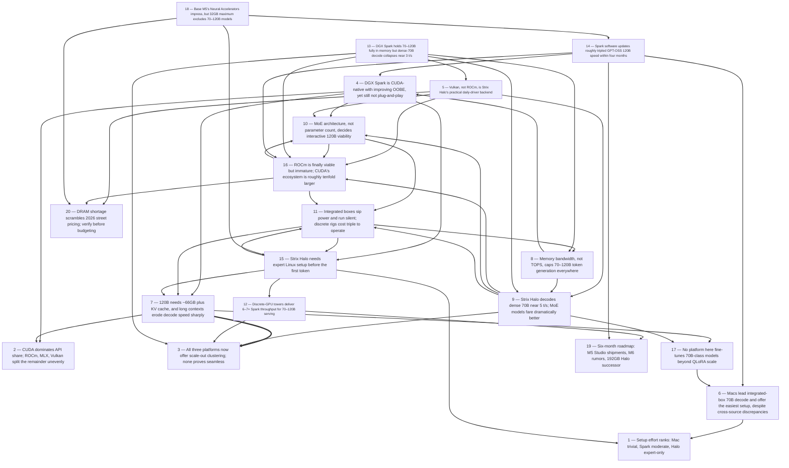

# Title: The 59 sources (spanning October 2025 to September 2026) collectively show that…

## Corpus Quality Scoreboard

Quality: **46/100** - Grade D (Weak)

```
[#########-----------]  46/100
```

- Critic: review (coverage 80 | evidence 52 | balance 0 | tension 40)
- Sources: 59 gathered | 39 cited | 59 full text | 27 distinct domains | 5.8/8 average relevance
- Cited date span: 2025-2026 (16 undated)
- Contradictions: 30 edges (strongest 50/100)

## Topic

review the options for running 70 to 120 B parameter LLM models localy, consider the nVidia Spark DGX, Stryx halo devices and Mackintosh M5, M6 devices. Consider the practicality, the performance provided and the ease or lack of it of setting up. Consider newly announced platform upgrades that will be available within the next 6 months. Consider the relative marketshare for solutions compatible with CUDA, ROCM, MLX and Vulkan APIs

## Search Queries

- NVIDIA DGX Spark 70B LLM inference benchmark
- AMD Strix Halo Ryzen AI Max 395 120B LLM performance
- Apple Mac M5 MLX 70B LLM inference benchmark
- DGX Spark vs Strix Halo vs Mac M5 local LLM comparison
- 120B parameter LLM local hardware memory requirements
- DGX Spark local LLM setup difficulty review
- Strix Halo ROCm LLM setup guide ease of use
- Mac M5 MLX LLM setup experience
- llama.cpp Vulkan Strix Halo 70B model performance
- NVIDIA DGX Spark successor upgrade announcement 2026
- AMD Strix Halo next generation announcement 2026
- Apple M6 Mac announcement rumors 2026
- CUDA ROCm MLX Vulkan market share local LLM inference
- 70B 120B quantized GGUF LLM VRAM requirements
- best hardware for running 70B LLM locally 2025
- running large language models locally hardware options

### Search Engine Summary

| Engine | Pages | PDFs | Videos | Total |
|--------|-------|------|--------|-------|
| langsearch | 26 | 0 | 0 | 26 |
| serper | 25 | 0 | 0 | 25 |
| wikipedia | 9 | 0 | 0 | 9 |

### Search Provider Requests

| Search Provider | Requests |
|-----------------|----------|
| mf_search | 16 |

## Executive Summary

The 59 sources (spanning October 2025 to September 2026) collectively show that running 70–120B-parameter LLMs locally on compact integrated systems is now feasible but strictly memory-bandwidth-bound: NVIDIA's DGX Spark and AMD Strix Halo mini-PCs (128GB, ~215–273 GB/s) hold dense 70B models fully in memory yet decode at only ~2.7–5 tokens/sec, while Apple's higher-bandwidth silicon (M4 Max 546 GB/s → M5 Max ~614 GB/s, M3 Ultra 819 GB/s) leads the integrated class at roughly 12–30 tokens/sec for the same models; critically, MoE-architecture 120B models (GPT-OSS 120B) run 5–10× faster than dense 70B on every platform, and discrete workstations (RTX PRO 6000, 1,792 GB/s) outperform the DGX Spark 6–7× overall. Setup difficulty ranks from trivial on Macs (Ollama auto-selects Apple's MLX backend) to moderate on the Spark (CUDA-native DGX OS with painful CUDA 13/ARM64 teething that monthly NVIDIA updates are steadily fixing — GPT-OSS 120B tripled from ~12 to ~59 t/s in four months) to expert-only on Strix Halo (BIOS/kernel-parameter/container surgery, where vendor-neutral Vulkan — not ROCm — is the pragmatic backend). Within six months the market shifts again: Mac Studio M5 Max/M5 Ultra (up to 512GB, 1.2 TB/s) ship September–October 2026, M6 (2nm) rumors circulate, a ~192GB Strix Halo successor and RTX Spark laptops are slated for late 2026, and a DRAM shortage is scrambling street prices. On API market share, CUDA dominates (~88% of datacenter AI GPUs, an ecosystem ~10× ROCm's, and exclusive vLLM/TensorRT paths), ROCm is viable but Linux-only and immature on gfx1151, MLX is the default on Apple Silicon by box-population, and Vulkan serves as the cross-platform safety net — with no hard share data for the latter two.

## Top 10 Implications

1. **For dense 70B interactive use, none of the three integrated platforms is fast today** — Spark and Strix Halo sit at ~2.7–5 t/s and even Apple tops out near 12–30 t/s (Findings 2, 7, 13), so interactive users should budget for a discrete GPU (RTX PRO 6000, ~32 t/s on 70B, 6–7× Spark [#2, #53]) or switch model class.
2. **Choose MoE models, not dense, on unified-memory hardware**: GPT-OSS 120B and 35B-A3B-class MoEs deliver 40–60+ t/s where dense 70B crawls at ~5 t/s (Finding 15, [#9, #23, #28]), making model architecture selection as important as the hardware purchase.
3. **Strix Halo offers Spark-comparable capability at roughly half the price, but you pay in engineering time** — BIOS, kernel, container, and driver surgery are mandatory (Findings 7–8, [#11, #22–25]), so budget at least a day of expert setup and prefer maintained community guides.
4. **Buy the DGX Spark for CUDA-stack fidelity and NVIDIA's update cadence, not for price/performance**: reviewers uniformly frame it as a datacenter-stack developer kit (Finding 4, [#3]), and its monthly software releases delivered ~5× improvement on GPT-OSS 120B in four months (Finding 3, [#3, #9]).
5. **If the 70–120B Mac path is chosen, wait for Mac Studio M5 Max/M5 Ultra independent benchmarks** — the 128GB/614 GB/s and 512GB/1.2 TB/s machines ship Sept 22 and late Oct 2026 but currently rest on MacBook-derived estimates only (Findings 12–13, [#14]).
6. **Quarter-old benchmarks are already stale**: software updates moved Spark GPT-OSS 120B from 11.66 → 58.72 t/s (Finding 3) and Strix Halo prompt processing +50% in three months (Finding 8, [#18]) — any procurement decision should use measurements <90 days old.
7. **Ecosystem risk is asymmetric**: CUDA's ~88% datacenter share, ~10× larger ecosystem and vLLM exclusivity [#45, #46] de-risk the NVIDIA path, while ROCm on gfx1151 still suffers kernel regressions (Finding 10, [#17]) and Vulkan — not ROCm — is the dependable AMD fallback (Finding 9, [#22]).
8. **Plan for 128GB minimum and treat long context as a first-order constraint**: 120B needs ~66GB plus KV cache that scales per user [#22, #47], and full-context decode degrades 27–64% on Spark/Halo stacks (Finding 14, [#9, #26]).
9. **Verify street prices under the DRAM shortage before budgeting** — Apple pulled 512GB tiers and raised Mac prices in 2026, and the RTX PRO 6000 trades at ~$12–14.5k vs. $8,565 MSRP (Finding 19, [#53]), which can invert headline "half the price" comparisons [#11].
10. **Fine-tuning 70–120B models is out of scope for all three platforms** — full FT needs ~1.1TB and only QLoRA (~40–45GB, single 48GB card) is locally practical (Finding 22, [#49]); plan cloud or workstation hybrids for adaptation workloads.

## Open Questions

- No independent, reproducible M5 Max/Ultra Mac Studio benchmarks exist [#9, #14] — will shipping silicon confirm the 12–18 t/s estimate for 70B, and why do M5 Max estimates (12–18 t/s [#14, #53]) sit below M4 Max measurements (20–28 t/s [#52]) despite higher bandwidth?
- What are actual local-inference market-share figures for MLX and Vulkan backends? Sources quantify CUDA (~88% datacenter, ~10× ROCm ecosystem [#45]) but give no share data for Apple MLX or Vulkan deployments.
- Will AMD's vendor-run claims (4–14% over Spark [#9]; 3.05× RTX 5080 on DeepSeek R1 [#16]) reproduce under controlled third-party conditions?
- Is NVIDIA's claim that two DGX Sparks can serve 405B-parameter models at FP4 real in practice? It was flagged as untested by the only hands-on reviewer to mention it [#4].
- What are the specifications, pricing, and shipping dates of the rumored late-2026 "Gorgon Halo" successor (up to 192GB) and NVIDIA RTX Spark laptops [#52]?
- Will M6 (2nm) actually launch in an LLM-relevant form factor within 12 months, or do M6 Pro/Max variants slip to 2027 as Gurman allows [#39, #40]?
- Do Spark's mid-2026 releases (improved OOM handling [#33]) fully resolve the CUDA 13/ARM64 FP16 and memory-fragmentation failures documented in October 2025 [#6]?
- How do the M5 Ultra's 512GB machines behave at 128K+ contexts on 120B-class models — is decode-vs-context decay on Apple's MLX stack closer to Vulkan's mild (~10%) or ROCm's severe (64% [#26]) profile?
- When, if ever, does vLLM reach functional parity on ROCm/gfx1151, given its current CUDA requirement [#46] and the pioneering-but-fragile Halo vLLM build [#10]?
- How durable are shortage-era street prices, and what is the real street price of the M5 Ultra 512GB configuration beyond "well above $10,000" [#14, #53]?

## Data Quality & Consistency

**Overall verdict:** Proceed — the synthesis passes the deterministic 4-critic audit.

| Metric | Value | Detail |
|--------|-------|--------|
| Corpus critic | 46/100 (review) | coverage 80 · evidence 52 · balance 0 · tension 40 |
| Contradictions | 30 edge(s) | strongest = 50/100 |
| Source tensions | 54 tension(s) | 30 contradiction · 5 shallow · 19 isolated |
| Cross-locus reconcile | 4 pair(s) | 0 conflicting edge(s) |
| Synthesis audit | 90/100 (proceed) | 39 source(s) cited |

**Key concerns:**
- Corpus: Dimension 'Benefit' has only moderate support (2 source(s))
- Corpus: Dimension 'Safety' has only moderate support (2 source(s))
- Contradiction: 15 vs 4 — Source #15 and source #4 make opposing claims about performance.
- Contradiction: 32 vs 45 — Source #32 and source #45 make opposing claims about performance.
- Tension (contradiction): performance [#2, #4] — Source #2 and source #4 make opposing claims about performance.
- Tension (contradiction): performance [#2, #10] — Source #2 and source #10 make opposing claims about performance.
- Audit: Synthesis audit for 'review the options for running 70 to 120 B parameter LLM models localy, consider the nVidia Spark DGX, Stryx halo devices and Mackintosh M5, M6 devices. Consider the practicality, the performance provided and the ease or lack of it of setting up. Consider newly announced platform upgrades that will be available within the next 6 months. Consider the relative marketshare for solutions compatible with CUDA, ROCM, MLX and Vulkan APIs' scored 90/100 across critics [coverage=62 logic=100 evidence=100 readability=100]; 39/59 sources cited.

## Concepts

### 1. Software Stack Maturity

**Definition:** Reported hardware performance is highly sensitive to framework, driver, and backend maturity—new platforms ship with bugs and kernel regressions, while updates and optimized backends deliver multi-x gains, making benchmarks unstable over time.

**Key Evidence:**
- DGX Spark FP16 inference produced inf/nan errors and memory-fragmentation freezes, later traced to CUDA version mismatches whose fixes yielded 3.6x speedups; the stack was judged "powerful but not plug-and-play" [#6], and a single CES 2026 update reportedly delivered 2.5x improvements [#7].
- On AMD Strix Halo, gfx1151 rocBLAS paths ran 2.5–6x slower than gfx1100 equivalents and official ROCm 7.0.1 badly regressed, leading testers to favor Vulkan ("just works") over crash-prone ROCm for Ollama [#17][#22]; Spark benchmarks can vary up to 10x by framework (Ollama/llama.cpp vs TensorRT-LLM NVFP4) [#53].

### 2. Memory Bandwidth Bottleneck

**Definition:** Local LLM inference—especially token generation (decode)—is bound by memory bandwidth rather than compute, so throughput scales roughly linearly with bandwidth. This explains why the 1-petaFLOP DGX Spark (273 GB/s) underperforms higher-bandwidth GPUs despite its raw compute specs.

**Key Evidence:**
- The RTX Pro 6000's 6–7x inference speedup over the DGX Spark closely matches its 6.57x memory-bandwidth advantage (1,792 GB/s GDDR7 vs 273 GB/s LPDDR5X) [#2]; the Spark's "273 GB/s LPDDR5X bus starves its tensor cores," yielding only 2.7 tok/s on a 70B model [#52].
- Buyer's guides formalize the rule: the batch-1 tokens/sec ceiling ≈ memory bandwidth ÷ model size, with TOPS mattering mainly for compute-bound prefill [#53]; Apple M5's 19–27% generation gains over M4 likewise track its 28% bandwidth increase (153 vs 120 GB/s) [#12].

### 3. Memory Capacity Governs Fit

**Definition:** Total VRAM or unified memory determines which model sizes can run at all, with ~0.5–0.6 GB per billion parameters at 4-bit quantization plus KV-cache overhead; spilling to CPU RAM causes a severe performance cliff.

**Key Evidence:**
- At Q4_K_M, models need ~0.56 GB per billion parameters, mapping 8 GB VRAM to ~7–8B models and 48–64 GB to 70B models; even partial CPU offload drops a 7B model from ~45 tok/s to ~8 tok/s [#19].
- VRAM is "the single most critical constraint" in the component hierarchy—if the model can't fit on the GPU, no CPU or SSD speed compensates [#55]; the KV cache grows linearly with context length and multiplies per concurrent user, causing unexpected OOM crashes [#47].

### 4. Quantization Sweet Spot

**Definition:** Weight quantization (Q4_K_M, NVFP4, MXFP4, IQ4_XS) is the central lever for fitting large models into limited memory and raising throughput, with ~4-bit precision emerging as the quality-per-size sweet spot across the corpus.

**Key Evidence:**
- Measured rankings put Q4_K_M at ~96.5% quality versus ~99.5% for Q8_0, with early-2026 research finding an arithmetic-reasoning "quality cliff" below 4 bits [#51]; Q4_K_M also showed "no noticeable quality loss" in DGX Spark LoRA fine-tuning runs [#6].
- Quantization also boosts speed: NVFP4 delivered 2.6x throughput gains on the Spark, and EAGLE3 speculative decoding plus software updates compounded the effect [#7].

### 5. Local Inference Economics

**Definition:** The case for running LLMs locally rests on two pillars: cost break-even versus cloud APIs only at sustained high volumes, and privacy/data sovereignty for regulated or sensitive workloads, reinforced by low per-node power draw.

**Key Evidence:**
- DGX Spark's 12-month TCO of $8,219 far exceeds cloud ($648–720) at low volume, with break-even at 12.3 months for 1M tokens/day but just 1.4 months at 10M tokens/day; the review recommends local for >20M tokens/month or privacy-sensitive HIPAA/PII workloads [#1].
- Privacy and elimination of per-token API costs are core motivations for local deployment [#20], and running multi-agent orchestration entirely on-device is framed as a shift toward "local AI sovereignty" [#7].

## Findings


### **Finding 1** — Setup effort ranks: Mac trivial, Spark moderate, Halo expert-only

**Observation:**
Ollama offers one-command setup across CUDA, ROCm and Apple Silicon [#46], auto-selecting MLX on Macs [#14, #52], with LM Studio as a GUI alternative [#14, #13]. DGX Spark ships a CUDA-enabled appliance OS with OOBE and a playbook site [#4, #32], yet required manual llama.cpp compilation [#8], hit FP16 bugs and fragmentation freezes [#6], prompting a "wait 6–12 months for maturity" caveat from an expert reviewer [#6]. Strix Halo requires the full firmware→kernel→driver→container→build-flag stack documented across four separate guides [#22, #24, #25, #27], with the Vulkan/Ollama shortcut [#22] as the only beginner-friendly path. On tooling generally: llama.cpp is 10–20% faster than Ollama on identical hardware, and vLLM is CUDA-bound [#46].

**Analysis:**
Setup difficulty is a compounding cost that most benchmark-driven comparisons ignore.

For a solo developer, the delta is measured in hours (Mac: minutes; Spark: a day; Halo: a day-plus of expert time with ongoing maintenance at every kernel/ROCm update [#17, #27]).

For an organization, it changes TCO ordering: Halo's ~50% hardware saving versus Spark [#11] can evaporate into engineering wages within weeks, especially given documented regressions requiring version pinning [#17].

Conversely, NVIDIA's and Apple's strategies — appliance OS with monthly OTA [#32–35] and default-right backend selection [#14] — are deliberate efforts to delete this cost.

The trend across 2026 is favorable on all platforms (OOBE improvements [#32], Ollama-Vulkan integration [#22], Ollama-MLX auto-selection [#52]).

**Cross-reference / Dependencies:**
Aggregates Findings 4, 8, 9, 13; moderates the price conclusions of Findings 5, 7, 19.

**Implication:**
Include engineer-hours in platform TCO; non-specialist teams should default to Mac or Spark, reserving Halo for Linux-fluent teams.

**Sources:**
- [6] DGX Spark Benchmarks vs Reality: 82,739 tok/s on Paper [Justin Johnson] — [https://ai.rundatarun.io/practical-applications/dgx-lab-benchmarks-vs-reality-day-4](https://ai.rundatarun.io/practical-applications/dgx-lab-benchmarks-vs-reality-day-4) (published 2025-10-26)
- [8] Performance of llama.cpp on NVIDIA DGX Spark · ggml-org/llama.cpp · Discussion #16578 — [https://github.com/ggml-org/llama.cpp/discussions/16578](https://github.com/ggml-org/llama.cpp/discussions/16578)
- [11] Forget NVIDIA’s $4,000 DGX Spark, AMD’s Strix Halo Mini PC Delivers the Same Power for Half the Price [Muhammad Zuhair, Muhammad Zuhair, @mzuhair123] — [https://wccftech.com/forget-nvidia-dgx-spark-amd-strix-halo-mini-pc-delivers-the-same-power-for-half-the-price](https://wccftech.com/forget-nvidia-dgx-spark-amd-strix-halo-mini-pc-delivers-the-same-power-for-half-the-price) (published 2025-11-10)
- [14] M5 Pro vs M5 Max 2026: Bandwidth, Speed &amp; LLM Benchmarks [Hans Kuepper] — [https://www.promptquorum.com/local-llms/apple-silicon-m5-local-llm](https://www.promptquorum.com/local-llms/apple-silicon-m5-local-llm) (published 2026-05-18)
- [17] AMD Strix Halo (Ryzen AI Max+ 395) GPU LLM Performance Tests — [https://community.frame.work/t/amd-strix-halo-ryzen-ai-max-395-gpu-llm-performance-tests/72521](https://community.frame.work/t/amd-strix-halo-ryzen-ai-max-395-gpu-llm-performance-tests/72521)
- [22] Quickstart Guide: Ollama With GPU Support (No ROCM Needed) — [https://community.frame.work/t/quickstart-guide-ollama-with-gpu-support-no-rocm-needed/79186](https://community.frame.work/t/quickstart-guide-ollama-with-gpu-support-no-rocm-needed/79186) (published 2025-12-26)
- [32] DGX Spark Software Updates - June 2026 Release — [https://forums.developer.nvidia.com/t/dgx-spark-software-updates-june-2026-release/371965](https://forums.developer.nvidia.com/t/dgx-spark-software-updates-june-2026-release/371965) (published 2026-06-01)
- [46] Ollama vs llama.cpp vs vLLM: Which Should You Use in 2026? [@] — [https://dev.to/thurmon_demich/ollama-vs-llamacpp-vs-vllm-which-should-you-use-in-2026-10gp](https://dev.to/thurmon_demich/ollama-vs-llamacpp-vs-vllm-which-should-you-use-in-2026-10gp) (published 2026-05-20)
- [52] Picking the Right Hardware to Run LLMs Locally in 2026 | Pinggy Blog [Pinggy Blog] — [https://pinggy.io/blog/best_hardware_for_self_hosting_local_llms](https://pinggy.io/blog/best_hardware_for_self_hosting_local_llms)

**Source date range:** 2025-10-26..2026-06-01 (6 of 9 cited web sources dated)


### **Finding 2** — CUDA dominates API share; ROCm, MLX, Vulkan split the remainder unevenly

**Observation:**
NVIDIA holds ~88% of the datacenter AI-GPU market (Jon Peddie Research, late 2024) and CUDA's ecosystem is roughly 10× ROCm's [#45]; NVIDIA hardware is the "most widely supported" for local LLMs [#20]; vLLM requires NVIDIA CUDA with AMD support incomplete [#46]; CUDA-only tooling like TensorRT-LLM yields 27–30% gains [#1]. ROCm is stable (7.2.4) but Linux-only with narrow official GPU support [#45], and loses to Vulkan on the key consumer 128GB APU [#22, #24, #26, #28]. MLX is Apple's native framework, auto-selected by Ollama on Apple Silicon since v0.19/May 2026 [#52, #14], "often fastest" on Macs [#15], distributed via the MLX-LM project and LM Studio [#13]. Vulkan is the easiest AMD path on Windows (LM Studio) [#44] and the de-facto default on Strix Halo [#22]. No source provides quantitative local-inference market-share figures for MLX or Vulkan.

**Analysis:**
The evidence depicts a stratified market rather than a four-way race.

CUDA owns the datacenter (~88%) and the high-end local tier by virtue of exclusive production tooling (vLLM, TensorRT-LLM, NCCL).

MLX's share is effectively the Apple-silicon installed base: once Ollama and LM Studio auto-select it [#52, #13], its "share" equals Mac shipments into local-LLM use without users choosing anything.

ROCm owns the Linux+dGPU AMD niche and is closing, but its consumer-APU beachhead is being defended by Vulkan, not by ROCm itself — a remarkable position for a vendor-neutral graphics API.

Vulkan functions as the ecosystem's safety net: it is the reason AMD 128GB APUs are usable at all this year.

Ollama's dominant model pulls (Llama 3.

1 115.

9M, DeepSeek-R1 87.

7M [#19]) suggest most consumer inference is API-agnostic at the front-end layer, commuting to whatever backend the box supports.

**Cross-reference / Dependencies:**
Built from Findings 9 (Vulkan-on-Halo), 10 (ROCm maturity), 11/13 (MLX defaults); fine-tuning dimension in Finding 22.

**Implication:**
Standardize on Ollama-class front-ends to stay backend-portable; assume CUDA today, MLX on Mac, Vulkan on AMD APUs, ROCm only where officially supported.

**Sources:**
- [1] DGX Spark Inference Performance: Local LLM vs Cloud Benchmarks (2026) [@] — [https://dev.to/mrjhsn/dgx-spark-inference-performance-local-llm-vs-cloud-benchmarks-2026-59pe](https://dev.to/mrjhsn/dgx-spark-inference-performance-local-llm-vs-cloud-benchmarks-2026-59pe) (published 2026-03-19)
- [13] Apple provides more details on MLX – including the Neural Accelerator in the M5 [heise online] — [https://www.heise.de/en/news/Apple-provides-more-details-on-MLX-including-the-Neural-Accelerator-in-the-M5-11089916.html](https://www.heise.de/en/news/Apple-provides-more-details-on-MLX-including-the-Neural-Accelerator-in-the-M5-11089916.html) (published 2025-11-24)
- [15] Apple Silicon LLM Benchmarks — 248 tok/s Figures, M1 to M6 [LLM Check] — [https://llmcheck.net/benchmarks](https://llmcheck.net/benchmarks)
- [19] Local LLM Hardware Guide 2026: VRAM, GPUs, and Setup [Tested] [@] — [https://dev.to/kunal_d6a8fea2309e1571ee7/local-llm-hardware-guide-2026-vram-gpus-and-setup-tested-29hj](https://dev.to/kunal_d6a8fea2309e1571ee7/local-llm-hardware-guide-2026-vram-gpus-and-setup-tested-29hj) (published 2026-06-14)
- [20] Washington Sanctions Albanese, ICC Judges - US Terrorist-Grade Measures - Archynewsy — [https://www.archynewsy.com/washington-sanctions-albanese-icc-judges-us-terrorist-grade-measures](https://www.archynewsy.com/washington-sanctions-albanese-icc-judges-us-terrorist-grade-measures) (published 2026-02-08)
- [22] Quickstart Guide: Ollama With GPU Support (No ROCM Needed) — [https://community.frame.work/t/quickstart-guide-ollama-with-gpu-support-no-rocm-needed/79186](https://community.frame.work/t/quickstart-guide-ollama-with-gpu-support-no-rocm-needed/79186) (published 2025-12-26)
- [44] Running Local AI on AMD: ROCm, Ollama, and LM Studio Performance in 2026 [Luis Chavez-Mattos] — [https://www.mindstudio.ai/blog/running-local-ai-amd-rocm-ollama-lm-studio](https://www.mindstudio.ai/blog/running-local-ai-amd-rocm-ollama-lm-studio) (published 2026-05-28)
- [45] AMD ROCm vs CUDA for Local AI [2026 Compared] [@] — [https://dev.to/kunal_d6a8fea2309e1571ee7/amd-rocm-vs-cuda-for-local-ai-2026-compared-131](https://dev.to/kunal_d6a8fea2309e1571ee7/amd-rocm-vs-cuda-for-local-ai-2026-compared-131) (published 2026-06-14)
- [46] Ollama vs llama.cpp vs vLLM: Which Should You Use in 2026? [@] — [https://dev.to/thurmon_demich/ollama-vs-llamacpp-vs-vllm-which-should-you-use-in-2026-10gp](https://dev.to/thurmon_demich/ollama-vs-llamacpp-vs-vllm-which-should-you-use-in-2026-10gp) (published 2026-05-20)

**Source date range:** 2025-11-24..2026-06-14 (8 of 9 cited web sources dated)


### **Finding 3** — All three platforms now offer scale-out clustering; none proves seamless

**Observation:**
DGX Spark carries dual 200 Gbps ConnectX-7 InfiniBand; NVIDIA claims two units can serve models up to 405B at FP4 — explicitly untested by the reviewer [#4]; the June 2026 Sync Cluster Assistant connects up to 3 devices without a switch (4 with one), and NCCL 2.30u1 adds three-node ring support [#32]; February 2026 added ConnectX-7 hot-plug saving up to 18W idle [#34]; Spark "scales linearly to 8 nodes" in one TCO model [#1]. Apple added low-latency Thunderbolt 5 networking in macOS 26.2 and demonstrated a cluster of four 512GB Mac Studios running Kimi K2 Thinking [#13]. Strix Halo supports llama.cpp RPC clustering [#10, #18], and a two-node mixed topology (27B on a 7900 XTX foreground box + Halo as a 262k-context parallel worker) "proved more useful than one large model" [#26].

**Analysis:**
Clustering converts these boxes from single-model appliances into capacity-multiplied servers — the only route on any platform to 200B+ dense classes or multi-agent fleets.

But the evidence of maturity is thin everywhere: the marquee two-Spark 405B claim is unverified [#4]; Apple's cluster story is a vendor demonstration [#13]; Halo's path is a hobbyist-grade RPC mechanism with per-backend variance [#10].

The most credible practitioner pattern is heterogeneous role-splitting (fast foreground model + high-capacity context worker [#26]) rather than monolithic scale-out.

Also notable: clustering economics favor local (flat $15/node/month power versus $60/node cloud [#1]), and enterprise provisioning (air-gap, Cloud-Init fleets [#35]) exists only on the NVIDIA side today.

**Cross-reference / Dependencies:**
Extends Findings 4 (Spark features), 12 (Apple silicon), 8/9 (Halo mechanics); the role-splitting pattern ties to Findings 14–15.

**Implication:**
Pilot two-node configurations before fleet commitments; treat 405B/two-Spark and TB5 cluster performance as unverified until independent measurements exist.

**Sources:**
- [1] DGX Spark Inference Performance: Local LLM vs Cloud Benchmarks (2026) [@] — [https://dev.to/mrjhsn/dgx-spark-inference-performance-local-llm-vs-cloud-benchmarks-2026-59pe](https://dev.to/mrjhsn/dgx-spark-inference-performance-local-llm-vs-cloud-benchmarks-2026-59pe) (published 2026-03-19)
- [4] NVIDIA DGX Spark: A Supercomputer for Your Desk? — [https://stal.blogspot.com/2025/11/nvidia-dgx-spark-supercomputer-for-your.html](https://stal.blogspot.com/2025/11/nvidia-dgx-spark-supercomputer-for-your.html)
- [10] GitHub - lhl/strix-halo-testing — [https://github.com/lhl/strix-halo-testing/tree/main](https://github.com/lhl/strix-halo-testing/tree/main)
- [13] Apple provides more details on MLX – including the Neural Accelerator in the M5 [heise online] — [https://www.heise.de/en/news/Apple-provides-more-details-on-MLX-including-the-Neural-Accelerator-in-the-M5-11089916.html](https://www.heise.de/en/news/Apple-provides-more-details-on-MLX-including-the-Neural-Accelerator-in-the-M5-11089916.html) (published 2025-11-24)
- [26] Strix Halo LLM inference notes — [https://forum.level1techs.com/t/strix-halo-llm-inference-notes/249466](https://forum.level1techs.com/t/strix-halo-llm-inference-notes/249466) (published 2026-04-27)
- [32] DGX Spark Software Updates - June 2026 Release — [https://forums.developer.nvidia.com/t/dgx-spark-software-updates-june-2026-release/371965](https://forums.developer.nvidia.com/t/dgx-spark-software-updates-june-2026-release/371965) (published 2026-06-01)
- [34] DGX Spark Software Updates 02/2026 — [https://forums.developer.nvidia.com/t/dgx-spark-software-updates-02-2026/360362](https://forums.developer.nvidia.com/t/dgx-spark-software-updates-02-2026/360362) (published 2026-02-12)
- [35] DGX Spark Software Updates 04/2026 — [https://forums.developer.nvidia.com/t/dgx-spark-software-updates-04-2026/368114](https://forums.developer.nvidia.com/t/dgx-spark-software-updates-04-2026/368114) (published 2026-04-28)

**Source date range:** 2025-11-24..2026-06-01 (6 of 8 cited web sources dated)


### **Finding 4** — DGX Spark is CUDA-native with improving OOBE, yet still not plug-and-play

**Observation:**
Spark ships "DGX OS" (custom Ubuntu) with CUDA support and SGLang, Ollama and Open WebUI "out of the box," runs silently and thermally stable [#4]. But llama.cpp required manual compilation with CUDA flags and SSH port forwarding [#8]; FP16 inference produced inf/nan errors costing 15 hours of debugging; memory fragmentation froze the system 7.5 hours into training, requiring cache clearing and session limits; the verdict was "powerful but not plug-and-play — cautiously recommended for experts… others should wait 6–12 months for maturity" [#6]. NVIDIA's June 2026 update streamlined OOBE and agent setup (NemoClaw playbook) [#32], and July 2026 added improved OOM handling with user feedback under memory pressure [#33]; enterprise air-gap and Cloud-Init provisioning arrived in April 2026 [#35].

**Analysis:**
Spark sits between Mac and Halo on setup difficulty.

Its unique value is stack fidelity: apertus frames it as "a developer kit for replicating NVIDIA's data center stack (SGLang, DGX OS) locally before scaling to DGX servers" [#3], and production inference via TensorRT-LLM adds 27–30% throughput with 17–18% memory savings versus open-source runtimes [#1].

The July 2026 OOM-handling and OTA changes show NVIDIA sanding down exactly the rough edges early adopters hit [#6, #33].

Remaining friction is ARM64-ecosystem-related rather than LLM-specific (e.g., gaming/app compatibility [#4], CUDA 13.

0 churn [#6]).

For CUDA-based organizations this is still the lowest-risk integrated option; for plug-and-play seekers the Mac remains easier (Finding 15).

**Cross-reference / Dependencies:**
Contrasts with Finding 10 (Halo setup) and Finding 15/16 (ease ranking); feeds Finding 7 (economics) and Finding 2 (clustering features depend on these updates).

**Implication:**
Pilot Spark if your deployment target is CUDA; plan a stabilization day and subscribe to NVIDIA's monthly update notes [#32–35] as part of operations.

**Sources:**
- [1] DGX Spark Inference Performance: Local LLM vs Cloud Benchmarks (2026) [@] — [https://dev.to/mrjhsn/dgx-spark-inference-performance-local-llm-vs-cloud-benchmarks-2026-59pe](https://dev.to/mrjhsn/dgx-spark-inference-performance-local-llm-vs-cloud-benchmarks-2026-59pe) (published 2026-03-19)
- [3] Local LLMs on the NVIDIA DGX Spark: Performance Test and Alternatives | Apertus - EU-Hosted Apps & AI — [https://apertus.ai/en/blog/nvidia-dgx-spark-review-vs-ai-box](https://apertus.ai/en/blog/nvidia-dgx-spark-review-vs-ai-box) (published 2025-10-14)
- [4] NVIDIA DGX Spark: A Supercomputer for Your Desk? — [https://stal.blogspot.com/2025/11/nvidia-dgx-spark-supercomputer-for-your.html](https://stal.blogspot.com/2025/11/nvidia-dgx-spark-supercomputer-for-your.html)
- [6] DGX Spark Benchmarks vs Reality: 82,739 tok/s on Paper [Justin Johnson] — [https://ai.rundatarun.io/practical-applications/dgx-lab-benchmarks-vs-reality-day-4](https://ai.rundatarun.io/practical-applications/dgx-lab-benchmarks-vs-reality-day-4) (published 2025-10-26)
- [8] Performance of llama.cpp on NVIDIA DGX Spark · ggml-org/llama.cpp · Discussion #16578 — [https://github.com/ggml-org/llama.cpp/discussions/16578](https://github.com/ggml-org/llama.cpp/discussions/16578)
- [32] DGX Spark Software Updates - June 2026 Release — [https://forums.developer.nvidia.com/t/dgx-spark-software-updates-june-2026-release/371965](https://forums.developer.nvidia.com/t/dgx-spark-software-updates-june-2026-release/371965) (published 2026-06-01)
- [33] DGX Spark Software Updates - July 2026 Release — [https://forums.developer.nvidia.com/t/dgx-spark-software-updates-july-2026-release/376736](https://forums.developer.nvidia.com/t/dgx-spark-software-updates-july-2026-release/376736) (published 2026-07-14)
- [35] DGX Spark Software Updates 04/2026 — [https://forums.developer.nvidia.com/t/dgx-spark-software-updates-04-2026/368114](https://forums.developer.nvidia.com/t/dgx-spark-software-updates-04-2026/368114) (published 2026-04-28)

**Source date range:** 2025-10-14..2026-07-14 (6 of 8 cited web sources dated)


### **Finding 5** — Vulkan, not ROCm, is Strix Halo's practical daily-driver backend

**Observation:**
A Framework quickstart states ROCm is "unstable and crash-prone" on Strix Halo while Vulkan "just works" with equal or better performance; Ollama needs just `OLLAMA_VULKAN=1` [#22]. Benchmarks: Vulkan RADV judged "most stable, fastest token generation" (AMDVLK fastest prefill but 2GB buffer cap; ROCm best for BF16 but crash-prone) [#24]; Vulkan beat ROCm for token generation (53.5 vs 44.6 t/s on a 35B-A3B Q8, ~1049 vs ~1014 t/s prefill) [#26]; a tuned 2026 suite found Vulkan outperformed ROCm on this unified-memory chip [#28]; head-to-head, Halo's Vulkan decode essentially ties Spark's (Spark +5.6% at 2K) [#10]. AMD is discontinuing its proprietary Vulkan driver in favor of Mesa RADV [#17], and MTP was merged into llama.cpp mainline [#26].

**Analysis:**
This finding carries outsized weight for the market-share question: on the only consumer 128GB APU class, the winning everyday path is vendor-neutral Vulkan, not AMD's own compute stack.

That lowers switching barriers for users fleeing CUDA lock-in, and it means Ollama — the dominant consumer front-end (174K GitHub stars [#19]) — runs acceptably on Halo with a single environment variable.

ROCm's remaining edge is long-context prefill (Spark's ROCm edge at 32K is +117.

5% over Vulkan tg [#10]) and BF16 handling [#24], but with stability costs.

AMD's move to standardize on RADV [#17] should consolidate the ecosystem further.

The caveat: Vulkan numbers below are for llama.cpp-class engines; vLLM-class serving remains CUDA's domain [#46].

**Cross-reference / Dependencies:**
The practical resolution of Finding 10's pain; evidence base for Finding 20 (API share); backend performance data feeds Finding 9 and Finding 16.

**Implication:**
Default new Halo deployments to Ollama/llama.cpp on Vulkan (RADV); reserve ROCm for prefill-heavy or BF16 workloads with crash-mitigation kernel flags.

**Sources:**
- [10] GitHub - lhl/strix-halo-testing — [https://github.com/lhl/strix-halo-testing/tree/main](https://github.com/lhl/strix-halo-testing/tree/main)
- [17] AMD Strix Halo (Ryzen AI Max+ 395) GPU LLM Performance Tests — [https://community.frame.work/t/amd-strix-halo-ryzen-ai-max-395-gpu-llm-performance-tests/72521](https://community.frame.work/t/amd-strix-halo-ryzen-ai-max-395-gpu-llm-performance-tests/72521)
- [19] Local LLM Hardware Guide 2026: VRAM, GPUs, and Setup [Tested] [@] — [https://dev.to/kunal_d6a8fea2309e1571ee7/local-llm-hardware-guide-2026-vram-gpus-and-setup-tested-29hj](https://dev.to/kunal_d6a8fea2309e1571ee7/local-llm-hardware-guide-2026-vram-gpus-and-setup-tested-29hj) (published 2026-06-14)
- [22] Quickstart Guide: Ollama With GPU Support (No ROCM Needed) — [https://community.frame.work/t/quickstart-guide-ollama-with-gpu-support-no-rocm-needed/79186](https://community.frame.work/t/quickstart-guide-ollama-with-gpu-support-no-rocm-needed/79186) (published 2025-12-26)
- [24] AMD Strix Halo Llama.cpp Installation Guide for Fedora 42 — [https://community.frame.work/t/amd-strix-halo-llama-cpp-installation-guide-for-fedora-42/75856](https://community.frame.work/t/amd-strix-halo-llama-cpp-installation-guide-for-fedora-42/75856)
- [26] Strix Halo LLM inference notes — [https://forum.level1techs.com/t/strix-halo-llm-inference-notes/249466](https://forum.level1techs.com/t/strix-halo-llm-inference-notes/249466) (published 2026-04-27)
- [28] Frontier Logic at Local Speed: The 2026 Strix Halo Ultimate Benchmark Suite [@] — [https://dev.to/agustinsacco/frontier-logic-at-local-speed-the-2026-strix-halo-ultimate-benchmark-suite-2cdf](https://dev.to/agustinsacco/frontier-logic-at-local-speed-the-2026-strix-halo-ultimate-benchmark-suite-2cdf) (published 2026-05-31)
- [46] Ollama vs llama.cpp vs vLLM: Which Should You Use in 2026? [@] — [https://dev.to/thurmon_demich/ollama-vs-llamacpp-vs-vllm-which-should-you-use-in-2026-10gp](https://dev.to/thurmon_demich/ollama-vs-llamacpp-vs-vllm-which-should-you-use-in-2026-10gp) (published 2026-05-20)

**Source date range:** 2025-12-26..2026-06-14 (5 of 8 cited web sources dated)


### **Finding 6** — Macs lead integrated-box 70B decode and offer the easiest setup, despite cross-source discrepancies

**Observation:**
Reported 70B (Q4-class) decode: M3 Ultra (192GB, 819 GB/s) 25–30 t/s, M4 Max (128GB, 546 GB/s) 20–28 t/s [#52]; Mac Studio M4 Max ~60 t/s on GPT-OSS 120B [#3]; M5 Max 128GB estimated 12–18 t/s on Llama 3.3 70B [#14], with another guide listing MacBook Pro M5 Max at "only ~12–18 tok/s on 70B" [#53]. A MacBook Pro M4 Max beat DGX Spark 117.32 vs 84.67 t/s on gpt-oss-20b under identical server settings — while the Spark needed manual CUDA compilation and SSH forwarding [#8]. Setup: Ollama auto-uses MLX on Apple Silicon since v0.19/May 2026 with only 5–10% overhead [#52, #14]; MLX is "often fastest" on Apple [#15] and named the fastest M5 backend [#14]; LM Studio provides a GUI path [#14]. Mac Studios sustain full clocks; MacBooks throttle 10–15% after 2–3 hours [#14].

**Analysis:**
The 20–28 t/s (M4 Max) vs 12–18 t/s (M5 Max) discrepancy across [#52] and [#14, #53] — despite M5 Max's higher bandwidth (614 vs 546 GB/s) — is unexplained in the sources and likely reflects different engines (llama.cpp vs MLX/Ollama), quantization levels, prompt assumptions, or conservative estimation; it should be treated as an unresolved discrepancy, with truth probably at the high end of the M5 Max range once MLX tuning matures (Finding 13's +19–27% M5 generation gains [#12]).

Even at the low end, Macs are the fastest integrated option for 70B and the only ones that "just work" for non-specialists (Ollama one-command across CUDA/ROCm/Apple [#46]).

The genuine Mac weaknesses are elsewhere: fine-tuning, CUDA-only tooling, Stable Diffusion-class workloads and high-throughput small-model serving remain NVIDIA territory [#14, #45].

**Cross-reference / Dependencies:**
Follows from Findings 1, 11, 12; contrasts with Findings 2, 7 (integrated competitors); setup component of Finding 1; the discrepancy feeds Open Questions.

**Implication:**
For a low-friction 70–120B appliance, choose Mac Studio class hardware; verify which engine/quant a quoted t/s figure used before comparing platforms.

**Sources:**
- [3] Local LLMs on the NVIDIA DGX Spark: Performance Test and Alternatives | Apertus - EU-Hosted Apps & AI — [https://apertus.ai/en/blog/nvidia-dgx-spark-review-vs-ai-box](https://apertus.ai/en/blog/nvidia-dgx-spark-review-vs-ai-box) (published 2025-10-14)
- [8] Performance of llama.cpp on NVIDIA DGX Spark · ggml-org/llama.cpp · Discussion #16578 — [https://github.com/ggml-org/llama.cpp/discussions/16578](https://github.com/ggml-org/llama.cpp/discussions/16578)
- [12] Exploring LLMs with MLX and the Neural Accelerators in the M5 GPU — [https://machinelearning.apple.com/research/exploring-llms-mlx-m5](https://machinelearning.apple.com/research/exploring-llms-mlx-m5)
- [14] M5 Pro vs M5 Max 2026: Bandwidth, Speed &amp; LLM Benchmarks [Hans Kuepper] — [https://www.promptquorum.com/local-llms/apple-silicon-m5-local-llm](https://www.promptquorum.com/local-llms/apple-silicon-m5-local-llm) (published 2026-05-18)
- [15] Apple Silicon LLM Benchmarks — 248 tok/s Figures, M1 to M6 [LLM Check] — [https://llmcheck.net/benchmarks](https://llmcheck.net/benchmarks)
- [46] Ollama vs llama.cpp vs vLLM: Which Should You Use in 2026? [@] — [https://dev.to/thurmon_demich/ollama-vs-llamacpp-vs-vllm-which-should-you-use-in-2026-10gp](https://dev.to/thurmon_demich/ollama-vs-llamacpp-vs-vllm-which-should-you-use-in-2026-10gp) (published 2026-05-20)
- [52] Picking the Right Hardware to Run LLMs Locally in 2026 | Pinggy Blog [Pinggy Blog] — [https://pinggy.io/blog/best_hardware_for_self_hosting_local_llms](https://pinggy.io/blog/best_hardware_for_self_hosting_local_llms)
- [53] Best Hardware to Run Local AI Models in 2026: Buyer Guide [Digital Applied Team] — [https://www.digitalapplied.com/blog/best-hardware-run-local-ai-models-2026-price-brackets-guide](https://www.digitalapplied.com/blog/best-hardware-run-local-ai-models-2026-price-brackets-guide)

**Source date range:** 2025-10-14..2026-05-20 (3 of 8 cited web sources dated)


### **Finding 7** — 120B needs ~66GB plus KV cache, and long contexts erode decode speed sharply

**Observation:**
Capacity math: 70B at Q4_K_M ≈ 42GB (Llama-3.3-70B Q4_K_M = 42.52GB verified) [#50] (~35–42GB range across guides [#53, #19]); gpt-oss:120b is 66GB [#22]; Qwen3-235B Q3_K_M (~104.7GB) fits a 128GB system only up to ~131k context, not its full 262k (153.7GB needed) [#24]. KV cache scales as 2 × context × layers × hidden × 2 bytes, multiplying per concurrent user [#47]. Observed context degradation: Spark's GPT-OSS 120B decode fell 27% (58.72 → 42.76 t/s) at 32K prior context [#9]; Strix Halo ROCm decode collapsed 64% (46.2 → 16.6 t/s) at full 76k context on a 35B MoE, with MTP recovering it to 37.5; Vulkan was more stable (32.7 → 28.9, 34.3 with MTP) [#26]. MoE models require all weights resident, not just active params (109B Scout needs ~55GB at Q4) [#50]; CPU offloading costs 30–50% performance [#50] and partial offload is a "performance cliff" to ~8 t/s on even a 7B model [#19].

**Analysis:**
"128GB" is not synonymous with "120B solved." A 120B MoE plus a production-length context plus KV cache lands in the 80–120GB envelope, leaving little headroom for multi-model agent setups — which is why practitioners split roles across two nodes (27B foreground on a 7900 XTX plus Halo as a 262k-context worker [#26]) and why quantization guidance is context-aware (Q8 for 35B, Q4 for 122B; BF16 fails at full context [#26]).

The 27–64% decode decay at long context [#9, #26] is the least-advertised spec in the category and disproportionately harms RAG and agent workloads — precisely the workloads [#7] touts for Spark.

Buyers should model capacity as weights + KV(users × context) using published formulas [#47, #50] and demand full-context measurements, not empty-context headline numbers.

**Cross-reference / Dependencies:**
Depends on Finding 3 (bandwidth ÷ footprint); the capacity premise of Findings 2, 7, 12; drives the node-splitting in Finding 2; quantization tie-in with Finding 17.

**Implication:**
Size memory for weights-plus-context-per-user, not weights alone; re-test at production context lengths; prefer backends/MTP configurations with flat decode-vs-context curves.

**Sources:**
- [7] Running 70B Model Locally with NVIDIA DGX Spark | Tarun Bagga posted on the topic | LinkedIn [Tarun Bagga] — [https://www.linkedin.com/posts/tarun-bagga-866a4012_dgx-spark-activity-7456916252540903425-gFBK](https://www.linkedin.com/posts/tarun-bagga-866a4012_dgx-spark-activity-7456916252540903425-gFBK)
- [9] DGX Spark alternatives: RTX, Ryzen AI Halo and Mac Studio — [https://aimultiple.com/dgx-spark-alternatives](https://aimultiple.com/dgx-spark-alternatives)
- [19] Local LLM Hardware Guide 2026: VRAM, GPUs, and Setup [Tested] [@] — [https://dev.to/kunal_d6a8fea2309e1571ee7/local-llm-hardware-guide-2026-vram-gpus-and-setup-tested-29hj](https://dev.to/kunal_d6a8fea2309e1571ee7/local-llm-hardware-guide-2026-vram-gpus-and-setup-tested-29hj) (published 2026-06-14)
- [22] Quickstart Guide: Ollama With GPU Support (No ROCM Needed) — [https://community.frame.work/t/quickstart-guide-ollama-with-gpu-support-no-rocm-needed/79186](https://community.frame.work/t/quickstart-guide-ollama-with-gpu-support-no-rocm-needed/79186) (published 2025-12-26)
- [24] AMD Strix Halo Llama.cpp Installation Guide for Fedora 42 — [https://community.frame.work/t/amd-strix-halo-llama-cpp-installation-guide-for-fedora-42/75856](https://community.frame.work/t/amd-strix-halo-llama-cpp-installation-guide-for-fedora-42/75856)
- [26] Strix Halo LLM inference notes — [https://forum.level1techs.com/t/strix-halo-llm-inference-notes/249466](https://forum.level1techs.com/t/strix-halo-llm-inference-notes/249466) (published 2026-04-27)
- [47] The Math Behind Local LLMs: How to Calculate Exact VRAM Requirements Before You Crash Your GPU [@] — [https://dev.to/bytecalculators/the-math-behind-local-llms-how-to-calculate-exact-vram-requirements-before-you-crash-your-gpu-12n5](https://dev.to/bytecalculators/the-math-behind-local-llms-how-to-calculate-exact-vram-requirements-before-you-crash-your-gpu-12n5) (published 2026-05-02)
- [50] Local LLM VRAM: 7B=4GB, 13B=8GB, 70B=42GB (2026) [Hans Kuepper] — [https://www.promptquorum.com/local-llms/how-much-vram-local-llm](https://www.promptquorum.com/local-llms/how-much-vram-local-llm) (published 2026-04-05)

**Source date range:** 2025-12-26..2026-06-14 (5 of 8 cited web sources dated)


### **Finding 8** — Memory bandwidth, not TOPS, caps 70–120B token generation everywhere

**Observation:**
Independent analyses converge that single-user LLM decode is memory-bound: at batch size one, the tokens/sec ceiling ≈ memory bandwidth ÷ model size, with real throughput at 55–70% of that ceiling [#53]. The LMSYS October 2025 study found the RTX PRO 6000 (1,792 GB/s GDDR7) ran LLMs 6–7× faster than the DGX Spark (273 GB/s LPDDR5X) — a 6.57× bandwidth ratio "closely match[ing] the observed speedup" across all batch sizes [#2]. Reference bandwidths: Spark 273 GB/s [#4], Strix Halo ~215 GB/s measured of 256 GB/s theoretical [#17, #18], M4 Max 546 GB/s [#52], M5 Max ~614 GB/s [#53], M5 Ultra up to 1.2 TB/s [#14].

**Analysis:**
This single mechanism explains nearly every comparative result in the corpus.

NVIDIA's marketed "1 PetaFLOP sparse FP4" [#3, #5] is irrelevant to batch-1 decode; it pays off only in compute-bound prefill, where Spark is genuinely strong (~8,000 t/s on 8B, 2,443 t/s on GPT-OSS 120B 2K prompts) [#4, #9].

Arithmetic sanity checks corroborate the model: Strix Halo's 215 GB/s divided by a ~42GB Q4 70B model [#50] predicts ~5.

1 t/s, matching measured 4.

5–5 t/s [#17, #18].

Apple wins the integrated class precisely because its bandwidth is 2–3× the competitors'.

LLMCheck independently reports a "near-linear bandwidth-to-speed relationship" (M5 Max's ~600 GB/s ≈ 3× a base M3's ~200 GB/s) [#15].

The implication for buyers, stated explicitly by two guides, is to "buy bandwidth-per-dollar — not TOPS" [#53], and to be skeptical of FLOP-centric vendor marketing from both NVIDIA and AMD [#11, #16].

**Cross-reference / Dependencies:**
Foundational to Finding 4 (Spark decode), Finding 8 (discrete GPUs), Finding 9 (Halo decode), Findings 13 and 15.

**Implication:**
Rank candidate hardware by measured memory bandwidth ÷ resident model size before considering any other spec; ignore PFLOP marketing for batch-1 inference.

**Sources:**
- [2] GitHub - casualcomputer/rtx_pro_6000_vs_dgx_spark: Sglang LLM Inference: RTX Pro 6000 vs DGX Spark — [https://github.com/casualcomputer/rtx_pro_6000_vs_dgx_spark](https://github.com/casualcomputer/rtx_pro_6000_vs_dgx_spark)
- [4] NVIDIA DGX Spark: A Supercomputer for Your Desk? — [https://stal.blogspot.com/2025/11/nvidia-dgx-spark-supercomputer-for-your.html](https://stal.blogspot.com/2025/11/nvidia-dgx-spark-supercomputer-for-your.html)
- [14] M5 Pro vs M5 Max 2026: Bandwidth, Speed &amp; LLM Benchmarks [Hans Kuepper] — [https://www.promptquorum.com/local-llms/apple-silicon-m5-local-llm](https://www.promptquorum.com/local-llms/apple-silicon-m5-local-llm) (published 2026-05-18)
- [15] Apple Silicon LLM Benchmarks — 248 tok/s Figures, M1 to M6 [LLM Check] — [https://llmcheck.net/benchmarks](https://llmcheck.net/benchmarks)
- [50] Local LLM VRAM: 7B=4GB, 13B=8GB, 70B=42GB (2026) [Hans Kuepper] — [https://www.promptquorum.com/local-llms/how-much-vram-local-llm](https://www.promptquorum.com/local-llms/how-much-vram-local-llm) (published 2026-04-05)
- [52] Picking the Right Hardware to Run LLMs Locally in 2026 | Pinggy Blog [Pinggy Blog] — [https://pinggy.io/blog/best_hardware_for_self_hosting_local_llms](https://pinggy.io/blog/best_hardware_for_self_hosting_local_llms)
- [53] Best Hardware to Run Local AI Models in 2026: Buyer Guide [Digital Applied Team] — [https://www.digitalapplied.com/blog/best-hardware-run-local-ai-models-2026-price-brackets-guide](https://www.digitalapplied.com/blog/best-hardware-run-local-ai-models-2026-price-brackets-guide)

**Source date range:** 2026-04-05..2026-05-18 (2 of 7 cited web sources dated)


### **Finding 9** — Strix Halo decodes dense 70B near 5 t/s; MoE models fare dramatically better

**Observation:**
Rigorous llama.cpp testing on Ryzen AI Max+ 395/128GB systems shows dense 70B generation at ~4.5–5 t/s [#17, #18]; GMKtec's internal tests show 4.9 t/s on Llama 3.3 70B versus Spark's 4.67 [#11]. MoE results are far stronger: 17–20 t/s on 80–142B MoEs (Llama 4 Scout 109B, Hunyuan-A13B, dots1) [#17, #18], 22–24 t/s on a 122B MoE at Q4 via Vulkan [#26], and gpt-oss-120b at 44.5 [#24]–55.57 t/s [#23]. One setup guide claims 70B Q4 at 15–20 t/s [#25].

**Analysis:**
The 15–20 t/s claim [#25] conflicts with multiple measured datasets at 4.

5–5 t/s and with the bandwidth ceiling math (215 GB/s ÷ 42GB ≈ 5.

1 t/s — Finding 3), so it likely assumes MTP speculative decoding (which roughly doubled some decode rates [#26, #28]) plus aggressive quantization, or is simply unverified; the guide corpus itself (13 systems, 10 contributors, preserved negative results [#23]) is more trustworthy.

AMD vendor claims of beating Spark by 4–14% across four models [#9] and 3× an RTX 5080 on DeepSeek once VRAM overflows [#16] are plausible only in capacity-limited scenarios and were vendor-run.

Halo's genuine profile: the cheapest 128GB platform (~$1,500–3,449 depending on vendor [#52, #9]), good for MoE serving and long-context workers (<100W [#26]), but ~5 t/s ceiling on dense 70B.

**Cross-reference / Dependencies:**
Numerically predicted by Finding 3; MoE/dense split developed in Finding 17; long-context behavior in Finding 16; setup in Finding 10; backend choice in Finding 11.

**Implication:**
Position Halo as a budget MoE/long-context node, not a dense-70B interactive machine; validate any 15+ t/s dense claims against raw logs before relying on them.

**Sources:**
- [9] DGX Spark alternatives: RTX, Ryzen AI Halo and Mac Studio — [https://aimultiple.com/dgx-spark-alternatives](https://aimultiple.com/dgx-spark-alternatives)
- [11] Forget NVIDIA’s $4,000 DGX Spark, AMD’s Strix Halo Mini PC Delivers the Same Power for Half the Price [Muhammad Zuhair, Muhammad Zuhair, @mzuhair123] — [https://wccftech.com/forget-nvidia-dgx-spark-amd-strix-halo-mini-pc-delivers-the-same-power-for-half-the-price](https://wccftech.com/forget-nvidia-dgx-spark-amd-strix-halo-mini-pc-delivers-the-same-power-for-half-the-price) (published 2025-11-10)
- [16] AMD&#039;s Ryzen AI MAX+ 395 &quot;Strix Halo&quot; APU Is Over 3x Faster Than RTX 5080 In DeepSeek R1 AI Benchmarks [[https://www.facebook.com/hms1193](https://www.facebook.com/hms1193)] — [https://wccftech.com/amd-ryzen-ai-max-395-strix-halo-apu-over-3x-faster-rtx-5080-in-deepseek-benchmarks](https://wccftech.com/amd-ryzen-ai-max-395-strix-halo-apu-over-3x-faster-rtx-5080-in-deepseek-benchmarks) (published 2025-03-17)
- [23] GitHub - hogeheer499-commits/strix-halo-guide: Evidence-backed AMD Strix Halo local-AI setup and benchmarks: Qwen3.8,… — [https://github.com/hogeheer499-commits/strix-halo-guide](https://github.com/hogeheer499-commits/strix-halo-guide)
- [24] AMD Strix Halo Llama.cpp Installation Guide for Fedora 42 — [https://community.frame.work/t/amd-strix-halo-llama-cpp-installation-guide-for-fedora-42/75856](https://community.frame.work/t/amd-strix-halo-llama-cpp-installation-guide-for-fedora-42/75856)
- [25] GitHub - Gygeek/Framework-strix-halo-llm-setup: Complete guide to running large language models locally on AMD Ryzen… — [https://github.com/Gygeek/Framework-strix-halo-llm-setup](https://github.com/Gygeek/Framework-strix-halo-llm-setup)
- [26] Strix Halo LLM inference notes — [https://forum.level1techs.com/t/strix-halo-llm-inference-notes/249466](https://forum.level1techs.com/t/strix-halo-llm-inference-notes/249466) (published 2026-04-27)

**Source date range:** 2025-03-17..2026-04-27 (3 of 7 cited web sources dated)


### **Finding 10** — MoE architecture, not parameter count, decides interactive 120B viability

**Observation:**
GPT-OSS 120B — characterized as an MoE [#53] — reaches 42–59 t/s on Spark [#9], 44.5–55.57 t/s on Strix Halo [#24, #23], ~60 t/s on an M4 Max Studio [#3], ~100 t/s on a 3–4×3090 box [#3] and 163 t/s on RTX PRO 6000 [#53], while dense Llama 70B crawls at 2.7–5 t/s on the same unified-memory systems [#3, #4, #17]. Similarly, a 35B-A3B MoE activating only ~3B parameters per token runs at 51–60+ t/s on Halo [#28, #23, #26] versus 6–9 t/s for a dense 27B [#26]; DeepSeek V4 Flash (284B total, 13B active) is estimated at ~39 t/s at 2-bit on a 128GB M5 Max [#15] and demonstrated running at 13.27 t/s on Halo as a capacity proof [#23].

**Analysis:**
The research question's framing of "70 to 120B" conceals the most important variable in the corpus.

Because batch-1 decode bandwidth cost scales with active parameters per token, a 120B MoE with ~3–5B active can decode 10× faster than a dense 70B on identical silicon — a pattern consistent across all four platforms above.

The 35B-A3B MoE even delivers "GPT-4o class reasoning at 51 t/s" claims on Halo [#28].

Practically, this reframes procurement: the unified-memory boxes are MoE serving machines first and dense-model machines a distant second.

The dense frontier on these platforms is for quality-critical tasks where dense 70B is specifically required and 3–5 t/s is tolerable, or where speculative decoding (EAGLE-3, MTP, ~2× [#4, #26, #28]) lifts it to "usable."

**Cross-reference / Dependencies:**
Synthesizes Findings 1, 2, 7, 13; capacity interplay with Finding 16; speculative-decoding overlap with Finding 11 (MTP mainline).

**Implication:**
Default 120B-class local deployments to MoE models; reserve dense 70B for validated quality needs and pair it with speculative decoding.

**Sources:**
- [3] Local LLMs on the NVIDIA DGX Spark: Performance Test and Alternatives | Apertus - EU-Hosted Apps & AI — [https://apertus.ai/en/blog/nvidia-dgx-spark-review-vs-ai-box](https://apertus.ai/en/blog/nvidia-dgx-spark-review-vs-ai-box) (published 2025-10-14)
- [9] DGX Spark alternatives: RTX, Ryzen AI Halo and Mac Studio — [https://aimultiple.com/dgx-spark-alternatives](https://aimultiple.com/dgx-spark-alternatives)
- [15] Apple Silicon LLM Benchmarks — 248 tok/s Figures, M1 to M6 [LLM Check] — [https://llmcheck.net/benchmarks](https://llmcheck.net/benchmarks)
- [23] GitHub - hogeheer499-commits/strix-halo-guide: Evidence-backed AMD Strix Halo local-AI setup and benchmarks: Qwen3.8,… — [https://github.com/hogeheer499-commits/strix-halo-guide](https://github.com/hogeheer499-commits/strix-halo-guide)
- [26] Strix Halo LLM inference notes — [https://forum.level1techs.com/t/strix-halo-llm-inference-notes/249466](https://forum.level1techs.com/t/strix-halo-llm-inference-notes/249466) (published 2026-04-27)
- [28] Frontier Logic at Local Speed: The 2026 Strix Halo Ultimate Benchmark Suite [@] — [https://dev.to/agustinsacco/frontier-logic-at-local-speed-the-2026-strix-halo-ultimate-benchmark-suite-2cdf](https://dev.to/agustinsacco/frontier-logic-at-local-speed-the-2026-strix-halo-ultimate-benchmark-suite-2cdf) (published 2026-05-31)
- [53] Best Hardware to Run Local AI Models in 2026: Buyer Guide [Digital Applied Team] — [https://www.digitalapplied.com/blog/best-hardware-run-local-ai-models-2026-price-brackets-guide](https://www.digitalapplied.com/blog/best-hardware-run-local-ai-models-2026-price-brackets-guide)

**Source date range:** 2025-10-14..2026-05-31 (3 of 7 cited web sources dated)


### **Finding 11** — Integrated boxes sip power and run silent; discrete rigs cost triple to operate

**Observation:**
Spark draws under 100W at full load per one practitioner [#7] (240W system power measured elsewhere [#2]) and runs silently [#4]; Strix Halo serves a 35B MoE under 100W [#26]; Mac Studios draw 65–100W [#14]; an RTX PRO 6000 GPU alone is 600W [#2], its workstation ~920W [#53]. Annual electricity (8h/day, $0.12/kWh US): ~$28 for an M5 Max versus ~$322 for a full PRO 6000 workstation, tripling at EU rates [#53]; 24/7 Mac inference ~$8–12/month versus $40–60 on an RTX 4090 [#14]; Spark ~$15/month versus $54–60/month cloud at 1M tokens/day [#1]. MacBook Pro chassis throttle 10–15% after 2–3 hours of sustained inference; Mac Studio maintains full clocks [#14]; Spark is thermally stable [#4].

**Analysis:**
Power draws a clean line between the form-factor classes: all three integrated platforms fit under ~240W and are office-appropriate (silent, sub-40 dB by implication of "silent" reviews [#4]), while the performance-leading discrete options demand 4–9× the electricity and cooling.

For always-on agent servers — the deployment mode [#7] and [#26] both advocate — the delta compounds: annual gaps of ~$90–300+ per node (US; triple in the EU [#53]) plus noise management.

However, energy savings cannot rescue a bad utilization case: the TCO math in Finding 7 shows low-volume users still lose to cloud regardless of the integrated boxes' efficiency [#1].

Form factor also enables edge/space-constrained deployment where Spark's 150×150×50 mm chassis and 240W profile are the only viable option [#2].

**Cross-reference / Dependencies:**
Cost component of Finding 7; counterweight to Finding 8 (discrete performance); sustained-performance caveat of Finding 15 (MacBook throttling vs Studio).

**Implication:**
For 24/7 local agents in offices or EU power markets, integrated boxes' efficiency is a real — but secondary — advantage; efficiency never overrides the capacity/bandwidth fit of Findings 1 and 14.

**Sources:**
- [1] DGX Spark Inference Performance: Local LLM vs Cloud Benchmarks (2026) [@] — [https://dev.to/mrjhsn/dgx-spark-inference-performance-local-llm-vs-cloud-benchmarks-2026-59pe](https://dev.to/mrjhsn/dgx-spark-inference-performance-local-llm-vs-cloud-benchmarks-2026-59pe) (published 2026-03-19)
- [2] GitHub - casualcomputer/rtx_pro_6000_vs_dgx_spark: Sglang LLM Inference: RTX Pro 6000 vs DGX Spark — [https://github.com/casualcomputer/rtx_pro_6000_vs_dgx_spark](https://github.com/casualcomputer/rtx_pro_6000_vs_dgx_spark)
- [4] NVIDIA DGX Spark: A Supercomputer for Your Desk? — [https://stal.blogspot.com/2025/11/nvidia-dgx-spark-supercomputer-for-your.html](https://stal.blogspot.com/2025/11/nvidia-dgx-spark-supercomputer-for-your.html)
- [7] Running 70B Model Locally with NVIDIA DGX Spark | Tarun Bagga posted on the topic | LinkedIn [Tarun Bagga] — [https://www.linkedin.com/posts/tarun-bagga-866a4012_dgx-spark-activity-7456916252540903425-gFBK](https://www.linkedin.com/posts/tarun-bagga-866a4012_dgx-spark-activity-7456916252540903425-gFBK)
- [14] M5 Pro vs M5 Max 2026: Bandwidth, Speed &amp; LLM Benchmarks [Hans Kuepper] — [https://www.promptquorum.com/local-llms/apple-silicon-m5-local-llm](https://www.promptquorum.com/local-llms/apple-silicon-m5-local-llm) (published 2026-05-18)
- [26] Strix Halo LLM inference notes — [https://forum.level1techs.com/t/strix-halo-llm-inference-notes/249466](https://forum.level1techs.com/t/strix-halo-llm-inference-notes/249466) (published 2026-04-27)
- [53] Best Hardware to Run Local AI Models in 2026: Buyer Guide [Digital Applied Team] — [https://www.digitalapplied.com/blog/best-hardware-run-local-ai-models-2026-price-brackets-guide](https://www.digitalapplied.com/blog/best-hardware-run-local-ai-models-2026-price-brackets-guide)

**Source date range:** 2026-03-19..2026-05-18 (3 of 7 cited web sources dated)


### **Finding 12** — Discrete-GPU towers deliver 6–7× Spark throughput for 70–120B serving

**Observation:**
The LMSYS FP8/SGLang study found NVIDIA's RTX PRO 6000 Blackwell (96GB ECC, 1,792 GB/s) runs LLM inference "roughly 6–7× faster" than DGX Spark across six models — e.g., Llama 3.1 8B end-to-end latency 14.3s vs 100.1s at batch 1 [#2]. Independent measures: ~32 t/s on Llama 3.1/3.3 70B and 163.15 t/s on the GPT-OSS 120B MoE [#53]; apertus cites 240+ t/s on a well-optimized RTX 6000 with a 120B model [#3]; a 3–4× RTX 3090 "AI-Box" reached ~100 t/s on GPT-OSS 120B vs Spark's 11.66 [#3]; even the 32GB RTX 5090 beats Spark 3.4× on GPT-OSS 20B [#9]. Costs: RTX PRO 6000 ~$8,565 MSRP but $12,000–14,500 street [#53]; GPU alone 600W, system ~920W [#2, #53]; multi-GPU adds a 15–30% latency penalty [#19].

**Analysis:**
For organizations whose 70–120B requirement is throughput- or latency-critical serving, the evidence is lopsided: no integrated box approaches a 1,792 GB/s discrete card, and used-3090 multi-GPU builds undercut Spark's price while beating it ~9× on MoE serving [#3].

The trade-offs are physical, not computational — 600–920W power [#2, #53], noise, tower form factor, and no simple capacity path beyond 96GB per card (two cards ≈ 120GB for ~$25k street).

One contrarian note: an experienced benchmarker advises even used EPYC servers with a cheap GPU (k-transformers CPU/GPU interleaving) beat dedicated Halo hardware for very large MoE models [#18], suggesting the used-server market is the real budget alternative, not integrated APUs.

**Cross-reference / Dependencies:**
Quantifies the gap predicted by Finding 3; the benchmark against which Findings 2 and 7 are measured; pricing interacts with Finding 19; power with Finding 21.

**Implication:**
If 70B-class serving speed is the KPI, buy bandwidth (RTX PRO 6000 or used 3090/EPYC builds), accepting power/noise; integrated boxes are for capacity-constrained or appliance deployments.

**Sources:**
- [2] GitHub - casualcomputer/rtx_pro_6000_vs_dgx_spark: Sglang LLM Inference: RTX Pro 6000 vs DGX Spark — [https://github.com/casualcomputer/rtx_pro_6000_vs_dgx_spark](https://github.com/casualcomputer/rtx_pro_6000_vs_dgx_spark)
- [3] Local LLMs on the NVIDIA DGX Spark: Performance Test and Alternatives | Apertus - EU-Hosted Apps & AI — [https://apertus.ai/en/blog/nvidia-dgx-spark-review-vs-ai-box](https://apertus.ai/en/blog/nvidia-dgx-spark-review-vs-ai-box) (published 2025-10-14)
- [9] DGX Spark alternatives: RTX, Ryzen AI Halo and Mac Studio — [https://aimultiple.com/dgx-spark-alternatives](https://aimultiple.com/dgx-spark-alternatives)
- [18] Strix Halo (Ryzen AI Max+ 395) LLM Benchmark Results — [https://forum.level1techs.com/t/strix-halo-ryzen-ai-max-395-llm-benchmark-results/233796](https://forum.level1techs.com/t/strix-halo-ryzen-ai-max-395-llm-benchmark-results/233796)
- [19] Local LLM Hardware Guide 2026: VRAM, GPUs, and Setup [Tested] [@] — [https://dev.to/kunal_d6a8fea2309e1571ee7/local-llm-hardware-guide-2026-vram-gpus-and-setup-tested-29hj](https://dev.to/kunal_d6a8fea2309e1571ee7/local-llm-hardware-guide-2026-vram-gpus-and-setup-tested-29hj) (published 2026-06-14)
- [53] Best Hardware to Run Local AI Models in 2026: Buyer Guide [Digital Applied Team] — [https://www.digitalapplied.com/blog/best-hardware-run-local-ai-models-2026-price-brackets-guide](https://www.digitalapplied.com/blog/best-hardware-run-local-ai-models-2026-price-brackets-guide)

**Source date range:** 2025-10-14..2026-06-14 (2 of 6 cited web sources dated)


### **Finding 13** — DGX Spark holds 70–120B fully in memory but dense-70B decode collapses near 3 t/s

**Observation:**
Hands-on reviews measured Llama 3.1 70B decode at ~2.7 t/s on DGX Spark with SGLang and Ollama — ~800 t/s prefill but ~2.7 t/s decode, "roughly 8× slower than an RTX PRO 6000," with EAGLE-3 speculative decoding nearly doubling throughput [#4]; apertus independently found "~2.7 tokens/second" on 70B [#3]; NVIDIA's own benchmark reportedly shows 2.7 t/s on 70B [#52], rounded to ~5 t/s in one 2026 buyer guide [#53]. Against this, practitioner Tarun Bagga claims Llama 3.3 70B runs a full RAG stack at ~45 t/s using NVFP4 quantization, EAGLE3, batched agent calls, and the CES 2026 software update [#7].

**Analysis:**
The 2.

7-vs-45 t/s gulf is partly methodological and partly temporal. [#7]'s figure is aggregate server throughput across batched calls with FP4 quantization and speculative decoding — not single-stream latency, which is what interactive users experience.

Three independent sources from October–November 2025 agree on ~2.

7 t/s [#3, #4, #52], and software updates explain part of the later improvement (Finding 5).

Spark's genuine edge is capacity, not speed: an RTX 5090 "cannot load a 70B model" [#7], while Spark's 128GB holds 70B–120B plus KV cache comfortably.

The consequence: Spark with dense 70B is a prototyping/batch-offline tool ("120B+ models feasible only for prototyping" [#7]), not an interactive coding assistant, unless the user adopts NVFP4 + speculative decoding + batching and re-verifies current numbers.

**Cross-reference / Dependencies:**
Explained by Finding 3; improved by Finding 5; contrasted with Finding 8 (RTX PRO 6000) and Finding 9 (Halo roughly doubles Spark's dense-70B speed); capacity context in Finding 16.

**Implication:**
Treat Spark dense-70B as offline/prototype-grade; require NVFP4+speculative-decoding configurations and re-benchmark before any purchase justified on 70B interactivity.

**Sources:**
- [3] Local LLMs on the NVIDIA DGX Spark: Performance Test and Alternatives | Apertus - EU-Hosted Apps & AI — [https://apertus.ai/en/blog/nvidia-dgx-spark-review-vs-ai-box](https://apertus.ai/en/blog/nvidia-dgx-spark-review-vs-ai-box) (published 2025-10-14)
- [4] NVIDIA DGX Spark: A Supercomputer for Your Desk? — [https://stal.blogspot.com/2025/11/nvidia-dgx-spark-supercomputer-for-your.html](https://stal.blogspot.com/2025/11/nvidia-dgx-spark-supercomputer-for-your.html)
- [7] Running 70B Model Locally with NVIDIA DGX Spark | Tarun Bagga posted on the topic | LinkedIn [Tarun Bagga] — [https://www.linkedin.com/posts/tarun-bagga-866a4012_dgx-spark-activity-7456916252540903425-gFBK](https://www.linkedin.com/posts/tarun-bagga-866a4012_dgx-spark-activity-7456916252540903425-gFBK)
- [52] Picking the Right Hardware to Run LLMs Locally in 2026 | Pinggy Blog [Pinggy Blog] — [https://pinggy.io/blog/best_hardware_for_self_hosting_local_llms](https://pinggy.io/blog/best_hardware_for_self_hosting_local_llms)
- [53] Best Hardware to Run Local AI Models in 2026: Buyer Guide [Digital Applied Team] — [https://www.digitalapplied.com/blog/best-hardware-run-local-ai-models-2026-price-brackets-guide](https://www.digitalapplied.com/blog/best-hardware-run-local-ai-models-2026-price-brackets-guide)

**Source date range:** 2025-10-14 (1 of 5 cited web sources dated)


### **Finding 14** — Spark software updates roughly tripled GPT-OSS 120B speed within four months

**Observation:**
In October 2025 GPT-OSS 120B decode on DGX Spark measured 11.66 t/s at batch 1 [#3]; by February 2026, llama.cpp tests measured 58.72 t/s, degrading 27% to 42.76 t/s at 32,768 tokens of prior context, with 2,443.91 t/s prefill on a 2,048-token prompt [#9]. Bagga reports a single "CES 2026 update" delivered 2.5× performance [#7], and a hands-on lab found CUDA-version mismatches alone caused a 3.6× penalty until resolved [#6]. Benchmarks vary "up to 10× depending on framework (Ollama/llama.cpp vs. TensorRT-LLM NVFP4)" [#53].

**Analysis:**
A ~5× improvement across four months means every Spark benchmark carries a half-life of weeks, not years.

NVIDIA's monthly release train (February through July 2026 documented) is actively re-tuning the stack [#32, #33, #34, #35], making the Spark a moving target for both buyers and reviewers.

This cuts two ways: early reviews [#3, #4] understate current capability, and optimistic practitioner claims [#7] are at least partially credible because the software genuinely improved.

It also means methodology — quantization format, framework, speculative decoding, driver version — dominates hardware comparisons, and cross-source rankings built from different dates [#9's explicit warning that its three sources "do not form a single controlled ranking"] must be interpreted cautiously.

**Cross-reference / Dependencies:**
Updates the baseline of Finding 4; enabled by the release cadence in Finding 6; interacts with Finding 16 (context decay); a caution for Finding 19 (volatile comparisons).

**Implication:**
Recency-filter all Spark benchmarks (<90 days old); when evaluating, pin driver/framework versions and re-run locally rather than trusting published figures.

**Sources:**
- [3] Local LLMs on the NVIDIA DGX Spark: Performance Test and Alternatives | Apertus - EU-Hosted Apps & AI — [https://apertus.ai/en/blog/nvidia-dgx-spark-review-vs-ai-box](https://apertus.ai/en/blog/nvidia-dgx-spark-review-vs-ai-box) (published 2025-10-14)
- [6] DGX Spark Benchmarks vs Reality: 82,739 tok/s on Paper [Justin Johnson] — [https://ai.rundatarun.io/practical-applications/dgx-lab-benchmarks-vs-reality-day-4](https://ai.rundatarun.io/practical-applications/dgx-lab-benchmarks-vs-reality-day-4) (published 2025-10-26)
- [7] Running 70B Model Locally with NVIDIA DGX Spark | Tarun Bagga posted on the topic | LinkedIn [Tarun Bagga] — [https://www.linkedin.com/posts/tarun-bagga-866a4012_dgx-spark-activity-7456916252540903425-gFBK](https://www.linkedin.com/posts/tarun-bagga-866a4012_dgx-spark-activity-7456916252540903425-gFBK)
- [9] DGX Spark alternatives: RTX, Ryzen AI Halo and Mac Studio — [https://aimultiple.com/dgx-spark-alternatives](https://aimultiple.com/dgx-spark-alternatives)
- [53] Best Hardware to Run Local AI Models in 2026: Buyer Guide [Digital Applied Team] — [https://www.digitalapplied.com/blog/best-hardware-run-local-ai-models-2026-price-brackets-guide](https://www.digitalapplied.com/blog/best-hardware-run-local-ai-models-2026-price-brackets-guide)

**Source date range:** 2025-10-14..2025-10-26 (2 of 5 cited web sources dated)


### **Finding 15** — Strix Halo needs expert Linux setup before the first token

**Observation:**
Across setup guides, required steps include: kernel 6.15.5–6.16.9+ [#17, #25]; BIOS changes (512MB UMA frame buffer, IOMMU disabled, optional TDP tuning) [#24, #25]; GRUB parameters (`amd_iommu=off amdgpu.gttsize=… ttm.pages_limit=…`) [#24, #25]; udev rules [#25]; ROCm from AMD's repo or Podman/Distrobox containers (kyuz0 toolboxes, ROCm 6.4.4-rocwmma) [#24, #25]; llama.cpp built with `GGML_HIP=ON -DAMDGPU_TARGETS="gfx1151"` and run with `--no-mmap -ngl 99` [#25]; Ubuntu 25.10 recommended over LTS for newer kernels, BIOS updates with a known UEFI v3.04 long-boot bug, skipping full-disk encryption for load speed [#22]; ROCm 7.x segfaults if `HSA_OVERRIDE_GFX_VERSION` is wrongly set, while 6.x needs it [#27]; Fedora 43 system ROCm was "crash city" [#27].

**Analysis:**
This is the steepest setup curve of the three platforms by a wide margin — spanning firmware, kernel, driver, container, and build-flag layers, with version-specific traps (the HSA override polarity flip between ROCm 6.x and 7.x [#27] is a representative landmine).

The mitigating facts: the community is unusually rigorous (machine-readable claims, raw logs, 15+ upstream merges [#23]), progress is fast (~50% prompt-processing improvement in three months purely from software [#18]), and once configured, an Ollama-Vulkan path needs only environment variables [#22].

Still, organizations must price in expert-hours: the difference between "works" and "fast" on Halo is measured in driver archaeology that Mac and Spark buyers largely skip (Finding 1).

**Cross-reference / Dependencies:**
Motivates Finding 11 (Vulkan shortcut) and Finding 12 (ROCm immaturity); the key input to Finding 1 (setup ranking) and Finding 7-style TCO.

**Implication:**
Assign a Linux engineer, follow a maintained guide repo [#23, #25], pin known-good kernel/ROCm versions, and snapshot the working system before updating.

**Sources:**
- [18] Strix Halo (Ryzen AI Max+ 395) LLM Benchmark Results — [https://forum.level1techs.com/t/strix-halo-ryzen-ai-max-395-llm-benchmark-results/233796](https://forum.level1techs.com/t/strix-halo-ryzen-ai-max-395-llm-benchmark-results/233796)
- [22] Quickstart Guide: Ollama With GPU Support (No ROCM Needed) — [https://community.frame.work/t/quickstart-guide-ollama-with-gpu-support-no-rocm-needed/79186](https://community.frame.work/t/quickstart-guide-ollama-with-gpu-support-no-rocm-needed/79186) (published 2025-12-26)
- [23] GitHub - hogeheer499-commits/strix-halo-guide: Evidence-backed AMD Strix Halo local-AI setup and benchmarks: Qwen3.8,… — [https://github.com/hogeheer499-commits/strix-halo-guide](https://github.com/hogeheer499-commits/strix-halo-guide)
- [25] GitHub - Gygeek/Framework-strix-halo-llm-setup: Complete guide to running large language models locally on AMD Ryzen… — [https://github.com/Gygeek/Framework-strix-halo-llm-setup](https://github.com/Gygeek/Framework-strix-halo-llm-setup)
- [27] Anybody tried running image generation (e.g. Stable Diffusion XL, 3.5 or similar) on Linux? — [https://community.frame.work/t/anybody-tried-running-image-generation-e-g-stable-diffusion-xl-3-5-or-similar-on-linux/76932](https://community.frame.work/t/anybody-tried-running-image-generation-e-g-stable-diffusion-xl-3-5-or-similar-on-linux/76932) (published 2025-10-17)

**Source date range:** 2025-10-17..2025-12-26 (2 of 5 cited web sources dated)


### **Finding 16** — ROCm is finally viable but immature; CUDA's ecosystem is roughly tenfold larger

**Observation:**
ROCm reached stable 7.2.4 (May 2026); PyTorch 2.7 treats ROCm as a first-class backend; Ollama, llama.cpp, vLLM/SGLang and LM Studio all work — but the full stack is Linux-only (Windows gets just the HIP SDK) and official support covers mainly RX 7900 XTX/XT, MI300 and W7800/W7900 cards, with lower tiers needing community hacks [#45]. On gfx1151 specifically: gfx1100 rocBLAS paths ran 2.5–6× faster than gfx1151 rocBLAS; official ROCm 7.0.1 badly regressed versus TheRock/6.4.4 (Qwen3 8B BF16 pp512: ~326 vs ~1132 t/s) [#17]. CUDA-side asymmetries: vLLM "requires NVIDIA CUDA (AMD support is incomplete)" [#46]; TensorRT-LLM adds 27–30% throughput [#1]; NVIDIA holds ~88% of the datacenter AI-GPU market (Jon Peddie Research, late 2024) with an ecosystem ~10× ROCm's [#45]; NVIDIA is the "most widely supported" vendor for local LLMs [#20].

**Analysis:**
Market share and API maturity compound each other.

CUDA's incumbency means Spark owners receive first-class vLLM, SGLang, TensorRT-LLM and NCCL support on day one, while gfx1151 owners depend on nightly builds and community-patched kernels — a gap that shows up directly in the benchmark noise (2.

5–6× kernel-path penalties [#17]).

ROCm's trajectory is genuinely positive ("from 'CUDA or nothing' to 'CUDA or a bit more work'" [#45]), and an RX 7900 XTX delivers 75–85% of RTX 4090 inference at half price [#45], but for the 70–120B target class the relevant comparisons are the unified-memory boxes, where ROCm loses even to Vulkan (Finding 11).

Persistent ROCm gaps — bitsandbytes, Flash Attention forks, weaker debugging [#45] — matter for fine-tuning-adjacent workflows (Finding 22).

**Cross-reference / Dependencies:**
Explains pains in Finding 10 and the Vulkan fallback in Finding 11; provides the share numbers for Finding 20; supports the NVIDIA fine-tuning edge in Finding 22.

**Implication:**
Treat ROCm-on-gfx1151 as pre-production-grade; if ROCm is strategically required, pair it with dGPUs on official support lists rather than the APU.

**Sources:**
- [1] DGX Spark Inference Performance: Local LLM vs Cloud Benchmarks (2026) [@] — [https://dev.to/mrjhsn/dgx-spark-inference-performance-local-llm-vs-cloud-benchmarks-2026-59pe](https://dev.to/mrjhsn/dgx-spark-inference-performance-local-llm-vs-cloud-benchmarks-2026-59pe) (published 2026-03-19)
- [17] AMD Strix Halo (Ryzen AI Max+ 395) GPU LLM Performance Tests — [https://community.frame.work/t/amd-strix-halo-ryzen-ai-max-395-gpu-llm-performance-tests/72521](https://community.frame.work/t/amd-strix-halo-ryzen-ai-max-395-gpu-llm-performance-tests/72521)
- [20] Washington Sanctions Albanese, ICC Judges - US Terrorist-Grade Measures - Archynewsy — [https://www.archynewsy.com/washington-sanctions-albanese-icc-judges-us-terrorist-grade-measures](https://www.archynewsy.com/washington-sanctions-albanese-icc-judges-us-terrorist-grade-measures) (published 2026-02-08)
- [45] AMD ROCm vs CUDA for Local AI [2026 Compared] [@] — [https://dev.to/kunal_d6a8fea2309e1571ee7/amd-rocm-vs-cuda-for-local-ai-2026-compared-131](https://dev.to/kunal_d6a8fea2309e1571ee7/amd-rocm-vs-cuda-for-local-ai-2026-compared-131) (published 2026-06-14)
- [46] Ollama vs llama.cpp vs vLLM: Which Should You Use in 2026? [@] — [https://dev.to/thurmon_demich/ollama-vs-llamacpp-vs-vllm-which-should-you-use-in-2026-10gp](https://dev.to/thurmon_demich/ollama-vs-llamacpp-vs-vllm-which-should-you-use-in-2026-10gp) (published 2026-05-20)

**Source date range:** 2026-02-08..2026-06-14 (4 of 5 cited web sources dated)


### **Finding 17** — No platform here fine-tunes 70B-class models beyond QLoRA scale

**Observation:**
Fine-tuning a 70B model locally requires ~1.1TB for full fine-tuning (8× H100/A100-80GB with ZeRO-3/FSDP), ~140GB+ for LoRA with an fp16 base, and ~40–45GB for QLoRA (single 48GB card, context length the binding constraint) [#49]. Spark successfully ran eight LoRA fine-tuning runs of Gemma-3-4b (70–84% accuracy) but suffered memory-fragmentation freezes requiring checkpointing and session limits [#6]. Guides agree NVIDIA retains the training/fine-tuning edge via cuDNN and CUDA ecosystem maturity [#45, #14], with ROCm at 70–80% of RTX 4090 training throughput [#45]; MLX supports fine-tuning on Apple silicon [#12] but no source demonstrates it at 70B scale.

**Analysis:**
"Running" 70–120B models conflates two very different workloads.

For inference, the integrated boxes qualify (with the caveats of Findings 2, 7, 13).

For adaptation, all three fail at full fine-tuning by ~10× on memory, and the only tractable local path — QLoRA on a 48GB-class NVIDIA card [#49] — points right back to discrete CUDA hardware, not to any of the headline platforms.

Spark's LoRA-on-small-models experience [#6] shows the unified-memory concept works for fine-tuning sub-10B models, and its CUDA stack makes it the best-positioned integrated candidate, but a single 128GB node cannot hold even a LoRA fp16 70B base with optimizer state (~140GB [#49]).

Teams whose roadmap includes adapting 70B-class models should plan hybrid architectures: local inference on integrated boxes plus cloud or workstation QLoRA, or full fine-tuning strictly in multi-GPU datacenter environments.

**Cross-reference / Dependencies:**
Contrasts with the inference focus of Findings 2, 7, 13; supports the ecosystem argument in Findings 10/20; setup dimension in Finding 6 (Spark as dev kit [#3]).

**Implication:**
Scope these platforms to inference plus small-model LoRA; budget separately for 70B-class adaptation (QLoRA workstation ≥48GB or cloud).

**Sources:**
- [3] Local LLMs on the NVIDIA DGX Spark: Performance Test and Alternatives | Apertus - EU-Hosted Apps & AI — [https://apertus.ai/en/blog/nvidia-dgx-spark-review-vs-ai-box](https://apertus.ai/en/blog/nvidia-dgx-spark-review-vs-ai-box) (published 2025-10-14)
- [6] DGX Spark Benchmarks vs Reality: 82,739 tok/s on Paper [Justin Johnson] — [https://ai.rundatarun.io/practical-applications/dgx-lab-benchmarks-vs-reality-day-4](https://ai.rundatarun.io/practical-applications/dgx-lab-benchmarks-vs-reality-day-4) (published 2025-10-26)
- [12] Exploring LLMs with MLX and the Neural Accelerators in the M5 GPU — [https://machinelearning.apple.com/research/exploring-llms-mlx-m5](https://machinelearning.apple.com/research/exploring-llms-mlx-m5)
- [45] AMD ROCm vs CUDA for Local AI [2026 Compared] [@] — [https://dev.to/kunal_d6a8fea2309e1571ee7/amd-rocm-vs-cuda-for-local-ai-2026-compared-131](https://dev.to/kunal_d6a8fea2309e1571ee7/amd-rocm-vs-cuda-for-local-ai-2026-compared-131) (published 2026-06-14)
- [49] How much VRAM and how many GPUs to fine-tune a 70B parameter model like LLaMA 3.1 locally? — [https://discuss.huggingface.co/t/how-much-vram-and-how-many-gpus-to-fine-tune-a-70b-parameter-model-like-llama-3-1-locally/150882](https://discuss.huggingface.co/t/how-much-vram-and-how-many-gpus-to-fine-tune-a-70b-parameter-model-like-llama-3-1-locally/150882)

**Source date range:** 2025-10-14..2026-06-14 (3 of 5 cited web sources dated)


### **Finding 18** — Base M5's Neural Accelerators impress, but 32GB maximum excludes 70–120B models

**Observation:**
Apple's M5 GPU adds Neural Accelerators — dedicated matrix-multiplication units exposed via Metal 4 TensorOps — giving MLX 3.3–4.1× faster time-to-first-token and 19–27% faster generation versus M4; M5 bandwidth is 153 GB/s versus M4's 120, and all tested models (up to GPT OSS 20B) fit under 18GB on a 24GB MacBook Pro [#12]. Apple itself cautions that with "no M5 Pro, Max, or Ultra machines exist[ing] yet" and base M5 capped at 32GB, "M4 Max or M3 Ultra systems may currently be better choices" for large-model work [#13]. M5 acceleration requires macOS 26.2+ [#12], which also adds low-latency Thunderbolt 5 networking [#13].

**Analysis:**
For the 70–120B target class, the base M5 is a non-starter on capacity alone: 70B at Q4 needs ~42GB [#50], exceeding the 32GB ceiling, before KV cache.

Its real significance is directional: Apple is adding dedicated inference silicon to the GPU and co-evolving MLX to exploit it, delivering ~4× prefill gains in one generation [#12] — evidence of a serious roadmap rather than incremental marketing.

The M5 Pro/Max-tier gains (307–614 GB/s [#14]) cascade from this same design.

Buyers should therefore read base-M5 coverage as a technology preview for the M5 Studio generation (Finding 14), not as a current 70B option; today's shipping 70B Macs remain M4 Max/M3 Ultra machines at 20–30 t/s (Finding 15) [#52 #13].

**Cross-reference / Dependencies:**
Prerequisite context for Finding 14 (M5 Studio); setup-ease component of Finding 15/16 (MLX auto-selection); share implications in Finding 20.

**Implication:**
Ignore base-M5 machines for 70–120B; treat their Neural Accelerator gains as the floor for M5 Pro/Max/Ultra expectations once independent benchmarks land.

**Sources:**
- [12] Exploring LLMs with MLX and the Neural Accelerators in the M5 GPU — [https://machinelearning.apple.com/research/exploring-llms-mlx-m5](https://machinelearning.apple.com/research/exploring-llms-mlx-m5)
- [13] Apple provides more details on MLX – including the Neural Accelerator in the M5 [heise online] — [https://www.heise.de/en/news/Apple-provides-more-details-on-MLX-including-the-Neural-Accelerator-in-the-M5-11089916.html](https://www.heise.de/en/news/Apple-provides-more-details-on-MLX-including-the-Neural-Accelerator-in-the-M5-11089916.html) (published 2025-11-24)
- [14] M5 Pro vs M5 Max 2026: Bandwidth, Speed &amp; LLM Benchmarks [Hans Kuepper] — [https://www.promptquorum.com/local-llms/apple-silicon-m5-local-llm](https://www.promptquorum.com/local-llms/apple-silicon-m5-local-llm) (published 2026-05-18)
- [50] Local LLM VRAM: 7B=4GB, 13B=8GB, 70B=42GB (2026) [Hans Kuepper] — [https://www.promptquorum.com/local-llms/how-much-vram-local-llm](https://www.promptquorum.com/local-llms/how-much-vram-local-llm) (published 2026-04-05)

**Source date range:** 2025-11-24..2026-05-18 (3 of 4 cited web sources dated)


### **Finding 19** — Six-month roadmap: M5 Studio shipments, M6 rumors, 192GB Halo successor

**Observation:**
Within roughly six months of the latest sources (Aug–Sep 2026): Mac Studio M5 Max ships September 22, 2026 and M5 Ultra 512GB in late October 2026 [#14]; DGX Spark's monthly software train continues (Feb–Jul 2026 releases delivered OOM handling, clustering, enterprise/air-gap features) [#32, #33, #34, #35]; GB10-based OEM systems (ASUS Ascent GX10, Dell, Acer, GIGABYTE) broaden Spark-class supply [#9]. Slated for late 2026: a "Gorgon Halo" successor with up to 192GB and NVIDIA RTX Spark laptops [#52]. On M6: Bloomberg's Gurman calls Apple's first 2nm chip "potentially sooner than people anticipate," possibly debuting in a Mac mini or iPad Pro before redesigned OLED MacBook Pros at end of 2026, with M6 Pro/Max timing uncertain (possibly slipping to 2027) — and the sources themselves caution that Gurman "has been wrong before" [#39, #40].

**Analysis:**
A procurement decision made today sits in a moving market.

The Mac events are announced facts with dates and prices [#14]; the Halo successor and Spark laptops are single-source expectations [#52]; M6 is credible-but-caveated rumor [#39, #40].

For 70–120B use cases specifically, M6's near-term relevance is low — even if announced early, base-class chips lack the memory capacity, and M6 Pro/Max Studio-class machines are plausibly 12+ months out [#39].

The rational strategy: act on announced shipping products (M5 Studios, Spark updates), price-in obsolescence for Halo purchases (a 50%-more-memory successor within ~a year), and treat M6 as a watch item rather than a planning input.

NVIDIA's update cadence also means Spark purchased today improves over the holding period (Finding 5).

**Cross-reference / Dependencies:**
Builds on Findings 12 (M5 Studio), 3 (Spark cadence); pricing interplay with Finding 19; M6 uncertainty fed to Open Questions.

**Implication:**
Sequence purchases around the Sept–Oct 2026 Mac launches; discount Halo hardware for successor risk; track M6 announcements without blocking decisions on them.

**Sources:**
- [9] DGX Spark alternatives: RTX, Ryzen AI Halo and Mac Studio — [https://aimultiple.com/dgx-spark-alternatives](https://aimultiple.com/dgx-spark-alternatives)
- [14] M5 Pro vs M5 Max 2026: Bandwidth, Speed &amp; LLM Benchmarks [Hans Kuepper] — [https://www.promptquorum.com/local-llms/apple-silicon-m5-local-llm](https://www.promptquorum.com/local-llms/apple-silicon-m5-local-llm) (published 2026-05-18)
- [39] Leaker Reveals Apple's Mac Roadmap For 2026 With 6 New Models And Several Chips - BGR [José Adorno] — [https://www.bgr.com/2021582/apple-m6-mac-2026-roadmap-leaks](https://www.bgr.com/2021582/apple-m6-mac-2026-roadmap-leaks) (published 2025-11-10)
- [52] Picking the Right Hardware to Run LLMs Locally in 2026 | Pinggy Blog [Pinggy Blog] — [https://pinggy.io/blog/best_hardware_for_self_hosting_local_llms](https://pinggy.io/blog/best_hardware_for_self_hosting_local_llms)

**Source date range:** 2025-11-10..2026-05-18 (2 of 4 cited web sources dated)


### **Finding 20** — DRAM shortage scrambles 2026 street pricing; verify before budgeting

**Observation:**
A global DRAM/GDDR7 shortage pushed Apple to pull the 512GB and 256GB Mac Studio tiers in March and May 2026 and to raise Mac prices on June 25, 2026 [#53]; the RTX PRO 6000 trades at $12,000–14,500 street versus ~$8,565 MSRP [#53]; RTX 5090 at $3,000–5,000+ street versus ~$1,999 nominal [#53, #19]; GMKtec's EVO-X2 was promoted at $2,199 against a $2,800 actual MSRP [#11]; Spark pricing varied ~$3,000–4,699 across outlets [#9, #11, #52] while one study used $7,999 [#1]; and Apple's August 2026 M5 Studio launch reintroduces a 512GB tier "well above $10,000" [#14]. The guide's advice: "shortage-era pricing shifts quarterly" — verify current street prices [#53].

**Analysis:**
Price-based rankings in this corpus are unusually fragile.

Headline claims like "same power for half the price" [#11] rest on promo pricing against list prices, and the 88% gap between RTX PRO 6000 MSRP and street pricing [#53] can invert any GPU-vs-integrated comparison.

Apple's tier-pull/relaunch sequence (512GB pulled in spring, reintroduced at M5 Ultra in August [#53, #14]) also shows supply — not demand — dictating product availability in this segment.

For procurement, this means: (1) treat every quoted figure in the sources as a benchmark-era snapshot, (2) refresh quotes at purchase time, and (3) consider that electricity/TCO advantages (Finding 21) are stable even when hardware prices are not.

The $7,999 Spark outlier [#1] may itself reflect shortage-era enterprise pricing.

**Cross-reference / Dependencies:**
Modifies Findings 5 (Spark economics), 6 (discrete GPU costs), 12 (Mac pricing); energy counterweight in Finding 21.

**Implication:**
Lock quotes at decision time, prefer configurations with stable supply, and re-run price/performance rankings quarterly during the shortage.

**Sources:**
- [1] DGX Spark Inference Performance: Local LLM vs Cloud Benchmarks (2026) [@] — [https://dev.to/mrjhsn/dgx-spark-inference-performance-local-llm-vs-cloud-benchmarks-2026-59pe](https://dev.to/mrjhsn/dgx-spark-inference-performance-local-llm-vs-cloud-benchmarks-2026-59pe) (published 2026-03-19)
- [11] Forget NVIDIA’s $4,000 DGX Spark, AMD’s Strix Halo Mini PC Delivers the Same Power for Half the Price [Muhammad Zuhair, Muhammad Zuhair, @mzuhair123] — [https://wccftech.com/forget-nvidia-dgx-spark-amd-strix-halo-mini-pc-delivers-the-same-power-for-half-the-price](https://wccftech.com/forget-nvidia-dgx-spark-amd-strix-halo-mini-pc-delivers-the-same-power-for-half-the-price) (published 2025-11-10)
- [14] M5 Pro vs M5 Max 2026: Bandwidth, Speed &amp; LLM Benchmarks [Hans Kuepper] — [https://www.promptquorum.com/local-llms/apple-silicon-m5-local-llm](https://www.promptquorum.com/local-llms/apple-silicon-m5-local-llm) (published 2026-05-18)
- [53] Best Hardware to Run Local AI Models in 2026: Buyer Guide [Digital Applied Team] — [https://www.digitalapplied.com/blog/best-hardware-run-local-ai-models-2026-price-brackets-guide](https://www.digitalapplied.com/blog/best-hardware-run-local-ai-models-2026-price-brackets-guide)

**Source date range:** 2025-11-10..2026-05-18 (3 of 4 cited web sources dated)


## Findings Relationship Diagram


## In-Project Cross-References

| Path | Relevance |
|------|-----------|
| `github.com/casualcomputer/rtx_pro_6000_vs_dgx_spark` | SGLang benchmark code/data behind the 6–7× RTX PRO 6000 vs DGX Spark comparison [#2] |
| `github.com/lhl/strix-halo-testing` | Strix Halo hardware/LLM test repo (llm-bench sweeps, rpc-test clustering, torch-therock build script) [#10] |
| `github.com/hogeheer499-commits/strix-halo-guide` | evidence-backed Strix Halo setup and benchmark guide; ships docs/scripts/data only [#23] |
| `data/headline_claims.csv` (within `hogeheer499-commits/strix-halo-guide`)` | machine-readable headline claims linked to raw logs [#23] |
| `github.com/Gygeek/Framework-strix-halo-llm-setup` | complete Framework/Halo LLM setup guide (BIOS, GRUB, ROCm, llama.cpp flags) [#25] |
| `MLX-LM project on GitHub` | Apple's recommended entry point for MLX model variants [#13] |
| `DGX Spark playbook site / NemoClaw playbook` | promoted post-setup destination in the June 2026 OOBE [#32] |
| `"OS and Component Update Guide` | DGX Spark User Guide" — official update instructions for Spark releases [#34, #35] |
| `Enterprise Management Guide (DGX Spark)` | provisioning, update, and fleet lifecycle documentation added April 2026 [#35] |

## References Index

| # | Type | Media | Language | Path/URL | Title | Author | Published | Relevance | Search tool | Engine | Captured |
|---|------|-------|----------|----------|-------|--------|-----------|-----------|-------------|--------|----------|
| 1 | web | page | English | [https://dev.to/mrjhsn/dgx-spark-inference-performance-local-llm-vs-cloud-benchmarks-2026-59pe](https://dev.to/mrjhsn/dgx-spark-inference-performance-local-llm-vs-cloud-benchmarks-2026-59pe) | DGX Spark Inference Performance: Local LLM vs Cloud Benchmarks (2026) | [@] | 2026-03-19 | High — title + snippet match query | mf_search | langsearch | 2026-09-18T05:33:18.316500434+00:00 |
| 2 | web | page | English | [https://github.com/casualcomputer/rtx_pro_6000_vs_dgx_spark](https://github.com/casualcomputer/rtx_pro_6000_vs_dgx_spark) | GitHub - casualcomputer/rtx_pro_6000_vs_dgx_spark: Sglang LLM Inference: RTX Pro 6000 vs DGX Spark | — | — | High — title + snippet match query | mf_search | langsearch | 2026-09-18T05:33:27.931032568+00:00 |
| 3 | web | page | English | [https://apertus.ai/en/blog/nvidia-dgx-spark-review-vs-ai-box](https://apertus.ai/en/blog/nvidia-dgx-spark-review-vs-ai-box) | Local LLMs on the NVIDIA DGX Spark: Performance Test and Alternatives \| Apertus - EU-Hosted Apps & AI | — | 2025-10-14 | High — title matches query | mf_search | serper | 2026-09-18T05:33:34.826108646+00:00 |
| 4 | web | page | English | [https://stal.blogspot.com/2025/11/nvidia-dgx-spark-supercomputer-for-your.html](https://stal.blogspot.com/2025/11/nvidia-dgx-spark-supercomputer-for-your.html) | NVIDIA DGX Spark: A Supercomputer for Your Desk? | — | — | High — title + snippet match query | mf_search | langsearch | 2026-09-18T05:33:50.862286324+00:00 |
| 5 | web | page | English | [https://learn.arm.com/learning-paths/laptops-and-desktops/dgx_spark_llamacpp/1_gb10_introduction](https://learn.arm.com/learning-paths/laptops-and-desktops/dgx_spark_llamacpp/1_gb10_introduction) | Unlock quantized LLM performance on Arm-based NVIDIA DGX Spark: Explore Grace Blackwell architecture for efficient… | [Odin Shen, @ArmSoftwareDev] | — | High — title matches query | mf_search | langsearch | 2026-09-18T05:33:43.774611944+00:00 |
| 6 | web | page | English | [https://ai.rundatarun.io/practical-applications/dgx-lab-benchmarks-vs-reality-day-4](https://ai.rundatarun.io/practical-applications/dgx-lab-benchmarks-vs-reality-day-4) | DGX Spark Benchmarks vs Reality: 82,739 tok/s on Paper | [Justin Johnson] | 2025-10-26 | Medium — multiple title terms match query | mf_search | serper | 2026-09-18T05:34:00.697649186+00:00 |
| 7 | web | page | English | [https://www.linkedin.com/posts/tarun-bagga-866a4012_dgx-spark-activity-7456916252540903425-gFBK](https://www.linkedin.com/posts/tarun-bagga-866a4012_dgx-spark-activity-7456916252540903425-gFBK) | Running 70B Model Locally with NVIDIA DGX Spark \| Tarun Bagga posted on the topic \| LinkedIn | [Tarun Bagga] | — | High — title + snippet match query | mf_search | serper | 2026-09-18T05:34:11.957665036+00:00 |
| 8 | web | page | English | [https://github.com/ggml-org/llama.cpp/discussions/16578](https://github.com/ggml-org/llama.cpp/discussions/16578) | Performance of llama.cpp on NVIDIA DGX Spark · ggml-org/llama.cpp · Discussion #16578 | — | — | Medium — multiple title terms match query | mf_search | serper | 2026-09-18T05:34:20.171228201+00:00 |
| 9 | web | page | English | [https://aimultiple.com/dgx-spark-alternatives](https://aimultiple.com/dgx-spark-alternatives) | DGX Spark alternatives: RTX, Ryzen AI Halo and Mac Studio | — | — | Medium — multiple title terms match query | mf_search | serper | 2026-09-18T05:34:37.279558383+00:00 |
| 10 | web | page | English | [https://github.com/lhl/strix-halo-testing/tree/main](https://github.com/lhl/strix-halo-testing/tree/main) | GitHub - lhl/strix-halo-testing | — | — | High — title matches query | mf_search | langsearch | 2026-09-18T05:34:27.001671041+00:00 |
| 11 | web | page | English | [https://wccftech.com/forget-nvidia-dgx-spark-amd-strix-halo-mini-pc-delivers-the-same-power-for-half-the-price](https://wccftech.com/forget-nvidia-dgx-spark-amd-strix-halo-mini-pc-delivers-the-same-power-for-half-the-price) | Forget NVIDIA’s $4,000 DGX Spark, AMD’s Strix Halo Mini PC Delivers the Same Power for Half the Price | [Muhammad Zuhair, Muhammad Zuhair, @mzuhair123] | 2025-11-10 | High — title + snippet match query | mf_search | langsearch | 2026-09-18T05:34:55.870464494+00:00 |
| 12 | web | page | English | [https://machinelearning.apple.com/research/exploring-llms-mlx-m5](https://machinelearning.apple.com/research/exploring-llms-mlx-m5) | Exploring LLMs with MLX and the Neural Accelerators in the M5 GPU | — | — | High — title + snippet match query | mf_search | langsearch, serper | 2026-09-18T05:35:04.070245043+00:00 |
| 13 | web | page | English | [https://www.heise.de/en/news/Apple-provides-more-details-on-MLX-including-the-Neural-Accelerator-in-the-M5-11089916.html](https://www.heise.de/en/news/Apple-provides-more-details-on-MLX-including-the-Neural-Accelerator-in-the-M5-11089916.html) | Apple provides more details on MLX – including the Neural Accelerator in the M5 | [heise online] | 2025-11-24 | High — title + snippet match query | mf_search | langsearch | 2026-09-18T05:34:49.624171789+00:00 |
| 14 | web | page | English | [https://www.promptquorum.com/local-llms/apple-silicon-m5-local-llm](https://www.promptquorum.com/local-llms/apple-silicon-m5-local-llm) | M5 Pro vs M5 Max 2026: Bandwidth, Speed &amp; LLM Benchmarks | [Hans Kuepper] | 2026-05-18 | High — title + snippet match query | mf_search | serper | 2026-09-18T05:35:18.546791495+00:00 |
| 15 | web | page | English | [https://llmcheck.net/benchmarks](https://llmcheck.net/benchmarks) | Apple Silicon LLM Benchmarks — 248 tok/s Figures, M1 to M6 | [LLM Check] | — | Medium — multiple title terms match query | mf_search | serper | 2026-09-18T05:35:33.183150981+00:00 |
| 16 | web | page | English | [https://wccftech.com/amd-ryzen-ai-max-395-strix-halo-apu-over-3x-faster-rtx-5080-in-deepseek-benchmarks](https://wccftech.com/amd-ryzen-ai-max-395-strix-halo-apu-over-3x-faster-rtx-5080-in-deepseek-benchmarks) | AMD&#039;s Ryzen AI MAX+ 395 &quot;Strix Halo&quot; APU Is Over 3x Faster Than RTX 5080 In DeepSeek R1 AI Benchmarks | [[https://www.facebook.com/hms1193](https://www.facebook.com/hms1193)] | 2025-03-17 | Medium — multiple title terms match query | mf_search | langsearch | 2026-09-18T05:35:47.081668872+00:00 |
| 17 | web | page | English | [https://community.frame.work/t/amd-strix-halo-ryzen-ai-max-395-gpu-llm-performance-tests/72521](https://community.frame.work/t/amd-strix-halo-ryzen-ai-max-395-gpu-llm-performance-tests/72521) | AMD Strix Halo (Ryzen AI Max+ 395) GPU LLM Performance Tests | — | — | Medium — multiple title terms match query | mf_search | serper | 2026-09-18T05:36:16.247346112+00:00 |
| 18 | web | page | English | [https://forum.level1techs.com/t/strix-halo-ryzen-ai-max-395-llm-benchmark-results/233796](https://forum.level1techs.com/t/strix-halo-ryzen-ai-max-395-llm-benchmark-results/233796) | Strix Halo (Ryzen AI Max+ 395) LLM Benchmark Results | — | — | Medium — multiple title terms match query | mf_search | serper | 2026-09-18T05:36:26.341632542+00:00 |
| 19 | web | page | English | [https://dev.to/kunal_d6a8fea2309e1571ee7/local-llm-hardware-guide-2026-vram-gpus-and-setup-tested-29hj](https://dev.to/kunal_d6a8fea2309e1571ee7/local-llm-hardware-guide-2026-vram-gpus-and-setup-tested-29hj) | Local LLM Hardware Guide 2026: VRAM, GPUs, and Setup [Tested] | [@] | 2026-06-14 | High — title matches query | mf_search | langsearch | 2026-09-18T05:35:56.070600423+00:00 |
| 20 | web | page | English | [https://www.archynewsy.com/washington-sanctions-albanese-icc-judges-us-terrorist-grade-measures](https://www.archynewsy.com/washington-sanctions-albanese-icc-judges-us-terrorist-grade-measures) | Washington Sanctions Albanese, ICC Judges - US Terrorist-Grade Measures - Archynewsy | — | 2026-02-08 | Medium — partial query match | mf_search | langsearch | 2026-09-18T05:36:49.512945751+00:00 |
| 21 | web | page | English | [https://news.ycombinator.com/item?id=46907001](https://news.ycombinator.com/item?id=46907001) | Ask HN: Anyone Using a Mac Studio for Local AI&#x2F;LLM? \| Hacker News | — | — | Medium — multiple title terms match query | mf_search | langsearch | 2026-09-18T05:36:56.912896143+00:00 |
| 22 | web | page | English | [https://community.frame.work/t/quickstart-guide-ollama-with-gpu-support-no-rocm-needed/79186](https://community.frame.work/t/quickstart-guide-ollama-with-gpu-support-no-rocm-needed/79186) | Quickstart Guide: Ollama With GPU Support (No ROCM Needed) | — | 2025-12-26 | High — title + snippet match query | mf_search | langsearch | 2026-09-18T05:37:01.671458988+00:00 |
| 23 | web | page | English | [https://github.com/hogeheer499-commits/strix-halo-guide](https://github.com/hogeheer499-commits/strix-halo-guide) | GitHub - hogeheer499-commits/strix-halo-guide: Evidence-backed AMD Strix Halo local-AI setup and benchmarks: Qwen3.8,… | — | — | High — title + snippet match query | mf_search | langsearch | 2026-09-18T05:37:34.767858675+00:00 |
| 24 | web | page | English | [https://community.frame.work/t/amd-strix-halo-llama-cpp-installation-guide-for-fedora-42/75856](https://community.frame.work/t/amd-strix-halo-llama-cpp-installation-guide-for-fedora-42/75856) | AMD Strix Halo Llama.cpp Installation Guide for Fedora 42 | — | — | Medium — multiple title terms match query | mf_search | serper | 2026-09-18T05:37:25.599408903+00:00 |
| 25 | web | page | English | [https://github.com/Gygeek/Framework-strix-halo-llm-setup](https://github.com/Gygeek/Framework-strix-halo-llm-setup) | GitHub - Gygeek/Framework-strix-halo-llm-setup: Complete guide to running large language models locally on AMD Ryzen… | — | — | High — title + snippet match query | mf_search | serper | 2026-09-18T05:37:17.133622255+00:00 |
| 26 | web | page | English | [https://forum.level1techs.com/t/strix-halo-llm-inference-notes/249466](https://forum.level1techs.com/t/strix-halo-llm-inference-notes/249466) | Strix Halo LLM inference notes | — | 2026-04-27 | High — title matches query | mf_search | serper | 2026-09-18T05:37:44.643132288+00:00 |
| 27 | web | page | English | [https://community.frame.work/t/anybody-tried-running-image-generation-e-g-stable-diffusion-xl-3-5-or-similar-on-linux/76932](https://community.frame.work/t/anybody-tried-running-image-generation-e-g-stable-diffusion-xl-3-5-or-similar-on-linux/76932) | Anybody tried running image generation (e.g. Stable Diffusion XL, 3.5 or similar) on Linux? | — | 2025-10-17 | Medium-high — snippet matches query | mf_search | langsearch | 2026-09-18T05:38:10.789724211+00:00 |
| 28 | web | page | English | [https://dev.to/agustinsacco/frontier-logic-at-local-speed-the-2026-strix-halo-ultimate-benchmark-suite-2cdf](https://dev.to/agustinsacco/frontier-logic-at-local-speed-the-2026-strix-halo-ultimate-benchmark-suite-2cdf) | Frontier Logic at Local Speed: The 2026 Strix Halo Ultimate Benchmark Suite | [@] | 2026-05-31 | High — title + snippet match query | mf_search | langsearch | 2026-09-18T05:37:56.168463856+00:00 |
| 29 | web | page | English | [https://en.wikipedia.org/wiki/GeForce_RTX_50_series](https://en.wikipedia.org/wiki/GeForce_RTX_50_series) | GeForce RTX 50 series | — | — | Encyclopedia — engine-ranked summary | mf_search | wikipedia | 2026-09-18T05:38:04.155025531+00:00 |
| 30 | web | page | English | [https://en.wikipedia.org/wiki/Nvidia](https://en.wikipedia.org/wiki/Nvidia) | Nvidia | — | — | Encyclopedia — engine-ranked summary | mf_search | wikipedia | 2026-09-18T05:38:07.475181003+00:00 |
| 31 | web | page | English | [https://en.wikipedia.org/wiki/3dfx](https://en.wikipedia.org/wiki/3dfx) | 3dfx | — | — | Encyclopedia — engine-ranked summary | mf_search | wikipedia | 2026-09-18T05:38:21.476880096+00:00 |
| 32 | web | page | English | [https://forums.developer.nvidia.com/t/dgx-spark-software-updates-june-2026-release/371965](https://forums.developer.nvidia.com/t/dgx-spark-software-updates-june-2026-release/371965) | DGX Spark Software Updates - June 2026 Release | — | 2026-06-01 | Medium — multiple title terms match query | mf_search | serper | 2026-09-18T05:38:29.771849455+00:00 |
| 33 | web | page | English | [https://forums.developer.nvidia.com/t/dgx-spark-software-updates-july-2026-release/376736](https://forums.developer.nvidia.com/t/dgx-spark-software-updates-july-2026-release/376736) | DGX Spark Software Updates - July 2026 Release | — | 2026-07-14 | Medium — multiple title terms match query | mf_search | serper | 2026-09-18T05:38:40.468622442+00:00 |
| 34 | web | page | English | [https://forums.developer.nvidia.com/t/dgx-spark-software-updates-02-2026/360362](https://forums.developer.nvidia.com/t/dgx-spark-software-updates-02-2026/360362) | DGX Spark Software Updates 02/2026 | — | 2026-02-12 | Medium — multiple title terms match query | mf_search | serper | 2026-09-18T05:38:35.526132369+00:00 |
| 35 | web | page | English | [https://forums.developer.nvidia.com/t/dgx-spark-software-updates-04-2026/368114](https://forums.developer.nvidia.com/t/dgx-spark-software-updates-04-2026/368114) | DGX Spark Software Updates 04/2026 | — | 2026-04-28 | Medium — multiple title terms match query | mf_search | serper | 2026-09-18T05:38:45.804503091+00:00 |
| 36 | web | page | English | [https://en.wikipedia.org/wiki/Apple_M5](https://en.wikipedia.org/wiki/Apple_M5) | Apple M5 | — | — | Encyclopedia — engine-ranked summary | mf_search | wikipedia | 2026-09-18T05:38:51.914482780+00:00 |
| 37 | web | page | English | [https://en.wikipedia.org/wiki/Mac_(computer)](https://en.wikipedia.org/wiki/Mac_(computer)) | Mac (computer) | — | — | Encyclopedia — engine-ranked summary | mf_search | wikipedia | 2026-09-18T05:38:59.196443021+00:00 |
| 38 | web | page | English | [https://en.wikipedia.org/wiki/Xiaomi](https://en.wikipedia.org/wiki/Xiaomi) | Xiaomi | — | — | Encyclopedia — engine-ranked summary | mf_search | wikipedia | 2026-09-18T05:39:05.274925756+00:00 |
| 39 | web | page | English | [https://www.bgr.com/2021582/apple-m6-mac-2026-roadmap-leaks](https://www.bgr.com/2021582/apple-m6-mac-2026-roadmap-leaks) | Leaker Reveals Apple's Mac Roadmap For 2026 With 6 New Models And Several Chips - BGR | [José Adorno] | 2025-11-10 | Medium — partial query match | mf_search | langsearch | 2026-09-18T05:39:20.388099340+00:00 |
| 40 | web | page | English | [https://wccftech.com/apple-m6-could-be-announced-much-sooner](https://wccftech.com/apple-m6-could-be-announced-much-sooner) | Apple’s M6 Could Be Announced Much Sooner, As New Report Provides Hints That Only A 5-Month Gap Existed Between The… | [[https://www.facebook.com/omar.sohail.54](https://www.facebook.com/omar.sohail.54)] | 2026-01-26 | Medium — partial query match | mf_search | langsearch | 2026-09-18T05:40:01.024551911+00:00 |
| 41 | web | page | English | [https://en.wikipedia.org/wiki/Zen_5](https://en.wikipedia.org/wiki/Zen_5) | Zen 5 | — | — | Encyclopedia — engine-ranked summary | mf_search | wikipedia | 2026-09-18T05:39:09.367110798+00:00 |
| 42 | web | page | English | [https://en.wikipedia.org/wiki/RDNA_3](https://en.wikipedia.org/wiki/RDNA_3) | RDNA 3 | — | — | Encyclopedia — engine-ranked summary | mf_search | wikipedia | 2026-09-18T05:39:12.748674004+00:00 |
| 43 | web | page | English | [https://en.wikipedia.org/wiki/USB4](https://en.wikipedia.org/wiki/USB4) | USB4 | — | — | Encyclopedia — engine-ranked summary | mf_search | wikipedia | 2026-09-18T05:39:16.058229631+00:00 |
| 44 | web | page | English | [https://www.mindstudio.ai/blog/running-local-ai-amd-rocm-ollama-lm-studio](https://www.mindstudio.ai/blog/running-local-ai-amd-rocm-ollama-lm-studio) | Running Local AI on AMD: ROCm, Ollama, and LM Studio Performance in 2026 | [Luis Chavez-Mattos] | 2026-05-28 | Medium — multiple title terms match query | mf_search | serper | 2026-09-18T05:39:27.808852182+00:00 |
| 45 | web | page | English | [https://dev.to/kunal_d6a8fea2309e1571ee7/amd-rocm-vs-cuda-for-local-ai-2026-compared-131](https://dev.to/kunal_d6a8fea2309e1571ee7/amd-rocm-vs-cuda-for-local-ai-2026-compared-131) | AMD ROCm vs CUDA for Local AI [2026 Compared] | [@] | 2026-06-14 | Medium — multiple title terms match query | mf_search | serper | 2026-09-18T05:39:37.517486139+00:00 |
| 46 | web | page | English | [https://dev.to/thurmon_demich/ollama-vs-llamacpp-vs-vllm-which-should-you-use-in-2026-10gp](https://dev.to/thurmon_demich/ollama-vs-llamacpp-vs-vllm-which-should-you-use-in-2026-10gp) | Ollama vs llama.cpp vs vLLM: Which Should You Use in 2026? | [@] | 2026-05-20 | High — title matches query | mf_search | langsearch | 2026-09-18T05:39:50.101961511+00:00 |
| 47 | web | page | English | [https://dev.to/bytecalculators/the-math-behind-local-llms-how-to-calculate-exact-vram-requirements-before-you-crash-your-gpu-12n5](https://dev.to/bytecalculators/the-math-behind-local-llms-how-to-calculate-exact-vram-requirements-before-you-crash-your-gpu-12n5) | The Math Behind Local LLMs: How to Calculate Exact VRAM Requirements Before You Crash Your GPU | [@] | 2026-05-02 | High — title + snippet match query | mf_search | langsearch | 2026-09-18T05:40:08.388500668+00:00 |
| 48 | web | page | English | [https://dev.to/soytuber/nvidia-rtx-5070-laptop-gpu-launches-amd-preps-ai-scheduler-qwen-gguf-benchmarks-5633](https://dev.to/soytuber/nvidia-rtx-5070-laptop-gpu-launches-amd-preps-ai-scheduler-qwen-gguf-benchmarks-5633) | NVIDIA RTX 5070 Laptop GPU Launches; AMD Preps AI Scheduler; Qwen GGUF Benchmarks | [@] | — | Medium — partial query match | mf_search | langsearch | 2026-09-18T05:40:54.078619402+00:00 |
| 49 | web | page | English | [https://discuss.huggingface.co/t/how-much-vram-and-how-many-gpus-to-fine-tune-a-70b-parameter-model-like-llama-3-1-locally/150882](https://discuss.huggingface.co/t/how-much-vram-and-how-many-gpus-to-fine-tune-a-70b-parameter-model-like-llama-3-1-locally/150882) | How much VRAM and how many GPUs to fine-tune a 70B parameter model like LLaMA 3.1 locally? | — | — | Medium — multiple title terms match query | mf_search | serper | 2026-09-18T05:40:48.368418359+00:00 |
| 50 | web | page | English | [https://www.promptquorum.com/local-llms/how-much-vram-local-llm](https://www.promptquorum.com/local-llms/how-much-vram-local-llm) | Local LLM VRAM: 7B=4GB, 13B=8GB, 70B=42GB (2026) | [Hans Kuepper] | 2026-04-05 | Medium — multiple title terms match query | mf_search | serper | 2026-09-18T05:40:29.173998216+00:00 |
| 51 | web | page | English | [https://dev.to/pat9000/gguf-quantization-explained-q4km-vs-q5km-vs-q8-which-to-pick-2026-31pl](https://dev.to/pat9000/gguf-quantization-explained-q4km-vs-q5km-vs-q8-which-to-pick-2026-31pl) | GGUF Quantization Explained: Q4_K_M vs Q5_K_M vs Q8 — Which to Pick (2026) | [@] | 2026-05-13 | Medium — partial query match | mf_search | langsearch | 2026-09-18T05:40:15.667144659+00:00 |
| 52 | web | page | English | [https://pinggy.io/blog/best_hardware_for_self_hosting_local_llms](https://pinggy.io/blog/best_hardware_for_self_hosting_local_llms) | Picking the Right Hardware to Run LLMs Locally in 2026 \| Pinggy Blog | [Pinggy Blog] | — | High — title + snippet match query | mf_search | serper | 2026-09-18T05:41:00.512628477+00:00 |
| 53 | web | page | English | [https://www.digitalapplied.com/blog/best-hardware-run-local-ai-models-2026-price-brackets-guide](https://www.digitalapplied.com/blog/best-hardware-run-local-ai-models-2026-price-brackets-guide) | Best Hardware to Run Local AI Models in 2026: Buyer Guide | [Digital Applied Team] | — | High — title matches query | mf_search | serper | 2026-09-18T05:41:11.889035663+00:00 |
| 54 | web | page | English | [https://next.gr/ai/large-language-models/llms-for-hardware-aware-software-generation](https://next.gr/ai/large-language-models/llms-for-hardware-aware-software-generation) | LLMs for Hardware-Aware Software Generation \| AI Tutorial | — | — | High — title + snippet match query | mf_search | langsearch | 2026-09-18T05:42:04.880111859+00:00 |
| 55 | web | page | English | [https://www.linkedin.com/posts/vineetvashishta_dellpromax-activity-7404523787960008704-9BIG](https://www.linkedin.com/posts/vineetvashishta_dellpromax-activity-7404523787960008704-9BIG) | I got several DMs about running LLMs locally, and the most common question was about the hardware requirements. \| Vin… | [Vin Vashishta] | 2025-12-10 | Medium — multiple title terms match query | mf_search | serper | 2026-09-18T05:41:56.446914772+00:00 |
| 56 | web | page | English | [https://en.wikipedia.org/wiki/Attention_Is_All_You_Need](https://en.wikipedia.org/wiki/Attention_Is_All_You_Need) | Attention Is All You Need - Wikipedia | [Contributors to Wikimedia projects] | — | Medium — partial query match | mf_search | langsearch | 2026-09-18T05:41:42.808782385+00:00 |
| 57 | web | page | English | [https://next.gr/ai/explainable-ai/llms-for-hardware-aware-software-generation](https://next.gr/ai/explainable-ai/llms-for-hardware-aware-software-generation) | LLMs for Hardware-Aware Software Generation \| AI Tutorial | — | — | High — title + snippet match query | mf_search | langsearch | 2026-09-18T05:42:19.759335337+00:00 |
| 58 | web | page | English | [https://lambda.ai/blog/demystifying-gpt-3](https://lambda.ai/blog/demystifying-gpt-3) | OpenAI's GPT-3 Language Model: A Technical Overview | [Chuan Li] | 2020-06-03 | Medium — multiple title terms match query | mf_search | langsearch | 2026-09-18T05:41:32.213668027+00:00 |
| 59 | web | page | English | [https://www.geeksforgeeks.org/deep-learning/recommended-hardware-for-running-llms-locally](https://www.geeksforgeeks.org/deep-learning/recommended-hardware-for-running-llms-locally) | Recommended Hardware for Running LLMs Locally - GeeksforGeeks | [GeeksforGeeks] | 2024-09-24 | Medium — multiple title terms match query | mf_search | serper | 2026-09-18T05:41:50.961789788+00:00 |
