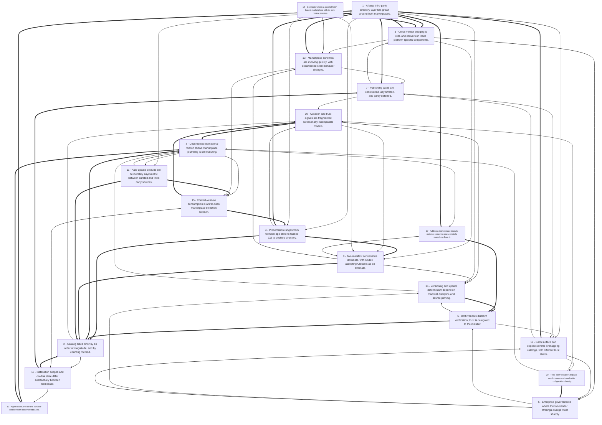

# Title: Across the captured sources, the two vendors converge on the same abstract...

## Corpus Quality Scoreboard

Quality: **64/100** - Grade C (Adequate)

```
[#############-------]  64/100
```

- Critic: review (coverage 90 | evidence 73 | balance 42 | tension 40)
- Sources: 376 gathered | 154 cited | 375 full text | 197 distinct domains | 5.8/8 average relevance
- Cited date span: 2020-2026 (108 undated)
- Contradictions: 28 edges (strongest 50/100)

## Topic

research the format of marketplaces provided by vendors (codex and Claude), that allow browsing, selection and installing of such artfacts such as plugins, agents and connectors. provide as much comparative information as can be obtained about how each marketplace operates and how it is presented to the users

## Search Queries

- OpenAI Codex vs Claude marketplace plugins agents connectors comparison
- OpenAI Codex marketplace browse install plugins agents connectors
- Claude marketplace browse install plugins agents connectors
- Claude Code plugin marketplace documentation
- OpenAI Codex plugin marketplace documentation
- How to browse and install plugins in Claude Code marketplace
- How to browse and install plugins in OpenAI Codex
- Claude Code plugin marketplace manifest format
- OpenAI Codex plugin manifest format
- Claude connectors directory browsing installation
- OpenAI Codex connectors directory browsing installation
- Claude agents marketplace selection install
- OpenAI Codex agents marketplace selection install
- MCP connector marketplace Claude Code
- MCP connector marketplace OpenAI Codex
- Claude Code marketplace UI plugin browsing
- OpenAI Codex marketplace UI extension browsing
- Anthropic Claude plugin marketplace API
- OpenAI Codex plugin marketplace API
- AI coding assistant marketplace plugins agents connectors comparison

### Search Engine Summary

| Engine | Pages | PDFs | Videos | Total |
|--------|-------|------|--------|-------|
| exa | 282 | 0 | 0 | 282 |
| langsearch | 34 | 0 | 0 | 34 |
| serper | 30 | 0 | 0 | 30 |
| tavily | 55 | 0 | 0 | 55 |
| wikipedia | 5 | 0 | 0 | 5 |

### Search Provider Requests

| Search Provider | Requests |
|-----------------|----------|
| mf_search | 20 |

## Executive Summary

Across the captured sources, the two vendors converge on the same abstract model — a marketplace is a versioned JSON catalog that a coding agent registers, browses, and installs from — while diverging sharply on file conventions, discovery surfaces, governance, and openness. Claude Code marketplaces are defined by a `.claude-plugin/marketplace.json` catalog at a repo root, are pre-seeded with Anthropic's `claude-plugins-official` marketplace on first interactive start, and are driven by `/plugin marketplace add` plus `/plugin install name@marketplace`, with a terminal "app store" Discover tab that shows scope choice and context-token cost; they bundle skills, commands, agents, hooks, MCP and LSP servers, monitors, and output styles, and they number in the hundreds officially and thousands in the community [#5][#7][#12][#32][#62]. OpenAI Codex marketplaces are JSON catalogs at `.agents/plugins/marketplace.json` (repo scope) or `~/.agents/plugins/marketplace.json` (personal), driven by `codex plugin marketplace add/list/upgrade/remove`, a CLI `/plugins` surface and a desktop app directory, with `.codex-plugin/plugin.json` retained as a compatibility fallback behind a portable root `plugin.json` Agent Plugins schema [#11][#83][#151][#173]. Both vendors warn that plugins execute arbitrary code with user privileges, both disable auto-update by default for third-party/local catalogs, both offer enterprise allow/deny controls (`strictKnownMarketplaces`; JSON policies with `INSTALLED_BY_DEFAULT`/`AVAILABLE`/`NOT_AVAILABLE`), and both currently limit or defer self-serve third-party publishing [#5][#15][#62][#81][#151]. A large third-party directory layer — registries, TUIs, web dashboards, and even signed-attestation marketplaces — has grown up around the first-party surfaces, and Claude's connectors directory (a separate MCP-based catalog with counts ranging from 522 to 3,044 depending on who is counting) is presented as a sibling artifact to plugins rather than the same thing [#54][#203][#216][#224][#228][#288].

## Top 10 Implications

1. Any user or team adopting these ecosystems must internalize a two-step model — registering a catalog installs nothing, and removing a marketplace uninstalls every plugin sourced from it — which makes marketplace hygiene a first-class operational concern [#5][#8][#84].
2. Enterprise buyers cannot treat the two vendors as interchangeable at the governance layer: Anthropic exposes organization-level marketplace APIs and `defaultInstallationPreference` states, while OpenAI exposes JSON policy files and requirement toggles, so procurement reviews must be run per vendor rather than once [#14][#81][#189][#306].
3. Because Codex's public self-serve publishing is still "coming soon," third-party authors who target Codex must distribute through repo or personal marketplaces, which means discovery, not capability, is the current bottleneck for that ecosystem [#81][#151][#194].
4. Cross-harness portability is real but partial: `SKILL.md` content travels, while app connectors, hooks, LSP servers, themes, and manifest semantics are dropped or translated, so "publish once" claims should be tested per target harness before being relied on [#91][#94][#102][#204].
5. Security responsibility sits with the installer, not the marketplace: both vendors disclaim verification of third-party content, plugins run with the user's privileges, and community scans have found structural and malicious failures at scale — so allowlists, pinning, and pre-install review are the practical controls [#5][#8][#105][#167][#320].
6. Catalog size is a context-window cost: MCP tool schemas routinely consume tens of thousands of tokens and a mid-sized stack can burn a third of a model's context before the first question, so install breadth should be treated as a performance decision, not just a capability decision [#244][#265].
7. Third-party aggregator directories (registries, TUIs, leaderboards) are now load-bearing for discovery and will shape which plugins succeed, yet their data is re-indexed, unverified, and sometimes stale — meaning install counts and "top" rankings need independent validation before they drive adoption [#30][#54][#56][#283][#288].
8. Both marketplace formats are still churning — Codex moved legacy top-level `installPolicy`/`authPolicy` into a nested `policy` object and reviewers documented silent behavior flips for existing catalogs — so catalogs and plugins should be version-pinned and validated in CI rather than trusting default resolution [#174][#177][#180][#184].
9. Auto-update defaults create a deliberate asymmetry between curated and third-party sources; teams that enable third-party auto-update to gain freshness accept unreviewed code changes into their agent's runtime, while teams that leave it off inherit staleness and manual upgrade flows [#5][#8][#62][#294].
10. Removal, rollback, and troubleshooting tooling now matters as much as installation — enabled/installed mismatches, stale marketplace caches, sparse-checkout requirements, and bundled-marketplace rebuild failures are documented, so any rollout plan should include an uninstall and recovery path [#24][#201][#292][#296].

## Open Questions

- Which catalog counts are authoritative and current? Vendor pages, first-party censuses, and community crawls disagree by an order of magnitude (341 plugins vs 2,282 community vs 11,989 indexed; 522 vs 887 vs 2,383 vs 3,044 connectors), and no source reconciles them [#5][#7][#54][#216][#224].
- Will Claude Code ever verify plugin signatures or attestations at install time, and does `anthropics/claude-code#30727` have a public resolution path? The attested marketplace treats consumer-side verification as the current workaround [#203].
- What are the final, published requirements for self-serve Codex plugin submission once the "coming soon" state ends, and will workspace publishing be the only non-curated enterprise route [#151][#194][#246]?
- How do install counts and marketplace rankings get computed and validated? Multiple syndicated pages repeat identical leaderboard numbers alongside internally inconsistent total-install figures [#56][#63][#285].
- Is there any convergence path between `.claude-plugin/` and `.agents/plugins/` conventions, or is the Codex compatibility read path a permanent one-way bridge [#178][#190]?
- What revenue or billing model, if any, applies to plugin and connector listings on the first-party marketplaces, given that browsing is free and third-party marketplaces describe 70–85% creator splits [#56][#273][#343]?
- How do marketplace policies interact with removal in managed environments — does removing a marketplace uninstall enterprise-required plugins, and how is that surfaced in `defaultInstallationPreference` states [#5][#14][#306]?
- What is the real-world incident rate from third-party plugins and connectors on the official marketplaces, as opposed to the community-scan findings (36% of skills with flaws, 76 malicious payloads) [#105]?
- Does the Codex `marketplace.json` correctness risk documented in review comments — duplicate-name bypass of restricted entries and stale local enable/install state after dropped entries [#183][#188] — have user-visible impact in shipped releases?
- How stable are the plugin/connector/app taxonomies likely to remain, given OpenAI's merge of ChatGPT apps and Codex plugins into one "Plugins" umbrella and the documented vocabulary confusion across the ecosystem [#257][#269]?
- Several captured pages contained no usable content — CAPTCHA walls, anti-scraping notices, and off-topic code — so the marketplace picture here rests on documentation, vendor repos, and third-party commentary rather than observed user telemetry [#44][#303].
- No source provides measured user funnel data (browse-to-install conversion, abandonment at scope selection, or post-install uninstall rates), so the practical usability of these marketplaces remains inferred from feature descriptions rather than observed behavior.

## Data Quality & Consistency

**Overall verdict:** Proceed - the synthesis passes the deterministic 4-critic audit.

| Metric | Value | Detail |
|--------|-------|--------|
| Corpus critic | 64/100 (review) | coverage 90 * evidence 73 * balance 42 * tension 40 |
| Contradictions | 28 edge(s) | strongest = 50/100 |
| Source tensions | 105 tension(s) | 28 contradiction * 3 shallow * 74 isolated |
| Cross-locus reconcile | 7 pair(s) | 38 conflicting edge(s) |
| Synthesis audit | 94/100 (proceed) | 152 source(s) cited |

**Key concerns:**
- Corpus: Dimension 'Reliability' has only moderate support (3 source(s))
- Corpus: Dimension 'Scalability' has only surface-level support (1 source(s))
- Contradiction: 359 vs 303 - Source #359 and source #303 make opposing claims about cost.
- Contradiction: 108 vs 303 - Source #108 and source #303 make opposing claims about cost.
- Tension (contradiction): cost [#108, #303] - Source #108 and source #303 make opposing claims about cost.
- Tension (contradiction): cost [#359, #303] - Source #359 and source #303 make opposing claims about cost.
- Reconcile: Cost <-> Quality - 13 conflicting edge(s)
- Reconcile: Risk <-> Safety - 6 conflicting edge(s)
- Audit: Synthesis audit for 'research the format of marketplaces provided by vendors (codex and Claude), that allow browsing, selection and installing of such artfacts such as plugins, agents and connectors. provide as much comparative information as can be obtained about how each marketplace operates and how it is presented to the users' scored 94/100 across critics [coverage=77 logic=100 evidence=100 readability=100]; 152/376 sources cited.

## Concepts

### 1. Manifest-Driven Plugins and Skills
**Definition:** Plugins and skills package reusable capabilities—commands, agents, hooks, MCP servers, instructions—into installable, manifest- or `SKILL.md`-defined units.

**Key Evidence:**
- Claude Code plugins use `.claude-plugin/plugin.json` and can bundle skills, agents, hooks, MCP servers, LSP servers, monitors, output styles, themes, and commands; Codex plugins use `.codex-plugin/plugin.json` and can bundle skills, app connectors, MCP servers, and hooks [#20][#19][#173][#87].
- Agent Skills are directory-based packages with a `SKILL.md` file; Anthropic published the spec Dec. 18, 2025, and it was adopted by Microsoft/VS Code, OpenAI/ChatGPT/Codex, and many tools, while Claude Code and Codex share the core `SKILL.md` format with different discovery paths [#105][#47][#100].

### 2. Claude Code vs Codex
**Definition:** The documents frame Anthropic’s Claude Code and OpenAI’s Codex as distinct agent paradigms—local terminal/synchronous vs cloud/sandboxed/asynchronous—that are often complementary rather than mutually exclusive.

**Key Evidence:**
- Claude Code is described as a local terminal/CLI agent with filesystem access; Codex is described as a cloud-sandboxed asynchronous agent that clones GitHub repos, runs tests, and opens PRs [#98][#133][#110].
- Comparisons recommend Claude Code for architecture, planning, refactoring, and deep terminal work, and Codex for delegated batch tasks, GitHub-native automation, and review/CI; many teams run both, and OpenAI shipped an official Codex plugin for Claude Code [#110][#125][#129][#103][#116].

### 3. Security, Trust, and Governance
**Definition:** Because plugins, skills, and MCP servers can execute code or access data, the ecosystem emphasizes trust, review, permissions, and enterprise controls over what can be installed and how it runs.

**Key Evidence:**
- Anthropic warns plugins can execute arbitrary code with user privileges and does not verify third-party plugin contents; Claude admins can restrict marketplaces with `strictKnownMarketplaces`, while Codex enterprise admins use JSON policies such as `INSTALLED_BY_DEFAULT`, `AVAILABLE`, and `NOT_AVAILABLE` [#5][#15][#81][#308].
- Security analyses of the skill/plugin ecosystem found structural and security failures—e.g., 22% of 673 skills failed structural validation, Snyk found 36% of 3,984 skills had security flaws, and Codex plugin risks include tool-name shadowing and `AGENTS.md` memory poisoning [#105][#167].

### 4. MCP Connector Layer
**Definition:** The Model Context Protocol (MCP) is an open standard that connects AI assistants and agents to external tools, data, and services, acting as the common transport beneath connectors, plugins, and MCP servers.

**Key Evidence:**
- MCP launched Nov. 25, 2024, became the default AI-to-tool protocol adopted by Cursor, Windsurf, ChatGPT, Gemini, and Copilot, and was donated to the Linux Foundation’s Agentic AI Foundation on Dec. 9, 2025 [#265][#221].
- Claude connectors are MCP servers, either directory-listed or custom-by-URL, with thousands tracked; Codex plugins can bundle MCP server configs, and MCP is described as the portable interop layer across Codex, Claude Code, and Cursor [#211][#221][#171][#173].

### 5. Plugin Marketplaces and Distribution
**Definition:** Plugin marketplaces are catalogs—often Git-hosted JSON registries—that let users discover, add, install, and update plugins; adding a marketplace registers the catalog but installs nothing.

**Key Evidence:**
- Claude Code marketplaces use `.claude-plugin/marketplace.json` with required `name`, `owner`, and `plugins`; users add via `/plugin marketplace add` and install with `/plugin install plugin@marketplace` [#12][#15]. Adding registers the catalog and installs nothing; removing one uninstalls its plugins [#5][#8].
- Codex marketplaces are JSON catalogs at `$REPO_ROOT/.agents/plugins/marketplace.json` or `~/.agents/plugins/marketplace.json`, managed by `codex plugin marketplace add/list/upgrade/remove` [#11][#83].

## Findings


### **Finding 1** - A large third-party directory layer has grown around both marketplaces.

**Observation:**
`claude-plugins.dev` is an open-source registry indexing "11,989 Claude Code plugins and 63,065 agent skills" with two CLIs, one of which installs skills across Claude Code, Cursor, Windsurf, VS Code, Codex, Amp Code, OpenCode, Goose, Letta, GitHub, Gemini CLI, Antigravity, Trae, Qoder, and CodeBuddy [#54]; `buildwithclaude` bundles 117 agents, 175 commands, 28 hooks, 26 skills, and 51 plugins while indexing "20k+ community plugins, 4,500+ MCP servers, and 1,100+ plugin marketplaces" [#30][#142][#145]; `claudemarketplaces.com` publishes per-marketplace plugin listings with versions [#28][#31][#287]; PluginMarketplace.ai updates daily from Claude's official marketplace and tracks install numbers, weekly growth, and trends [#39], with third-party mirrors citing a daily Top 20 where "Frontend Design (564,908 installs), Superpowers (476,245), Code Review (255,208)" lead [#56][#63][#67]. On the Codex side, `codex-marketplace.com` provides a CLI (`npx codex-marketplace`) plus community upvotes and sorting by popularity, stars, or install count [#76][#79], and `codexplugin.com` offers copyable `npx codex-marketplace add` commands and verify prompts with categories and authors [#74][#85]. Tooling such as Plum (600+ plugins across 11 marketplaces), claude-scout, claude-plugin-manager, and the `claude-code-marketplace` npm dashboard add local browsing UIs [#276][#279][#283][#288].

**Analysis:**
These directories exist because the first-party browsing surfaces, while well-designed, are not sufficient for cross-marketplace search, trust triage, or ranking — a gap that becomes larger as catalog counts grow into the thousands.

Their value proposition is aggregation and normalization: the skill-installer CLI resolves identifiers through a registry and clones from Git across fourteen clients [#54], and Claude-scout reads live from `~/.claude/plugins/` while auto-crawling GitHub Code Search for "Discovered" plugins updated twice weekly and tiering them by stars [#276].

But the same aggregation creates systematic accuracy risks.

Counting methodologies are inconsistent and sometimes compound: the same Claude plugin marketplace is described by a dozen near-identical syndicated pages as "over 114 plugins" with "5,195+ installs" while claiming Frontend Design at 564,908 installs — an internal inconsistency that suggests the headline totals and the leaderboard come from different snapshots [#56][#63][#71][#285].

Some directories are genuinely additive (they execute no plugin code and only present metadata [#288]), while others are installers that write into `~/.codex/plugins/cache` and `~/.codex/config.toml` directly [#76][#79], which means using them expands the trusted computing base beyond the vendor.

The economics are also mostly undeclared in first-party surfaces: plugin browsing is generally free and "individual plugins may have their own pricing" [#56][#86], while independent marketplaces describe revenue splits — 85% to publishers on MCPX [#273], 70% to creators via Stripe Connect on Agensi [#343] — indicating that monetized MCP/plugin marketplaces are an emerging, non-vendor category.

**Cross-reference / Dependencies:**
Builds on Finding 3 and Finding 4; related to Finding 11 (install mechanics) and Finding 19 (curation).

**Implication:**
Use aggregators for discovery, but verify the underlying catalog and artifact before install; teams should restrict which installers are allowed to modify Codex or Claude configuration files.

**Sources:**
- [28] C0ntr0lledCha0s/claude-code-plugin | Claude Code Marketplace - [https://claudemarketplaces.com/plugins/c0ntr0lledcha0s-claude-code-plugin-automations](https://claudemarketplaces.com/plugins/c0ntr0lledcha0s-claude-code-plugin-automations)
- [30] buildwithclaude — Claude Skills | Claudeers - [https://claudeers.com/buildwithclaude](https://claudeers.com/buildwithclaude)
- [31] athola/claude-night-market Plugins | Claude Code Marketplace - [https://claudemarketplaces.com/plugins/athola-claude-night-market](https://claudemarketplaces.com/plugins/athola-claude-night-market)
- [39] Claude Plugin Marketplace - Find the best plugins and connectors - [https://pluginmarketplace.ai/](https://pluginmarketplace.ai/)
- [54] GitHub - Kamalnrf/claude-plugins: Lightweight registry to discover, install, and manage all public Claude plugins... - [https://github.com/Kamalnrf/claude-plugins](https://github.com/Kamalnrf/claude-plugins)
- [56] Claude Plugin Markeplace: Directories Tool (2026) - The Core Tools [The Core Tools] - [https://thecoretools.com/tool/claude-plugin-markeplace](https://thecoretools.com/tool/claude-plugin-markeplace) (published 2026-04-27)
- [63] Claude Plugin Markeplace: Directories AI Tool (2026) - Appa List [Appa List] - [https://appalist.com/ai/claude-plugin-markeplace](https://appalist.com/ai/claude-plugin-markeplace) (published 2026-04-27)
- [67] Claude Plugin Markeplace: Directories Tool (2026) - Beam Tools [Beam Tools] - [https://beamtools.com/tool/claude-plugin-markeplace](https://beamtools.com/tool/claude-plugin-markeplace) (published 2026-04-27)
- [71] Claude Plugin Markeplace: Directories Product (2026) - SaaS Badge [SaaS Badge] - [https://saasbadge.com/products/claude-plugin-markeplace](https://saasbadge.com/products/claude-plugin-markeplace) (published 2026-05-02)
- [74] Codex Plugin Directory — Browse &amp; Install Codex Plugins [codexplugin] - [https://codexplugin.com/](https://codexplugin.com/)
- [76] Codex Plugin Marketplace - [https://www.codex-marketplace.com/](https://www.codex-marketplace.com/)
- [79] Documentation — Codex Plugin Marketplace - [https://www.codex-marketplace.com/docs](https://www.codex-marketplace.com/docs)
- [85] How to Install a Codex Plugin — Step-by-Step Guide [codexplugin] - [https://codexplugin.com/docs](https://codexplugin.com/docs)
- [86] Skills — Codex Plugin Marketplace - [https://www.codex-marketplace.com/skills](https://www.codex-marketplace.com/skills)
- [142] GitHub - dguralev/buildwithclaude: A single hub to find Claude Skills, Agents, Commands, Hooks, Plugins, and... - [https://github.com/dguralev/buildwithclaude](https://github.com/dguralev/buildwithclaude)
- [145] GitHub - chendamao93-star/buildwithclaude: A single hub to find Claude Skills, Agents, Commands, Hooks, Plugins, and... - [https://github.com/chendamao93-star/buildwithclaude](https://github.com/chendamao93-star/buildwithclaude)
- [273] GitHub - TheoryofShadows/Mcp: MCPX — where agents hire tools. Trust-scored MCP marketplace for Claude, Cursor, and... - [https://github.com/TheoryofShadows/Mcp](https://github.com/TheoryofShadows/Mcp)
- [276] GitHub - devycelabs/claude-scout: Local web UI for browsing the official Claude Code plugin marketplace - [https://github.com/devycelabs/claude-scout](https://github.com/devycelabs/claude-scout)
- [279] GitHub - DVKolm/claude-plugin-manager - [https://github.com/DVKolm/claude-plugin-manager](https://github.com/DVKolm/claude-plugin-manager)
- [283] claude-code-marketplace [NikiforovAll] - [https://npm.io/package/claude-code-marketplace](https://npm.io/package/claude-code-marketplace) (published 2026-03-28)
- [285] Claude Plugin Markeplace: Directories Product (2026) - SaaS Territory [SaaS Territory] - [https://saasterritory.com/products/claude-plugin-markeplace](https://saasterritory.com/products/claude-plugin-markeplace) (published 2026-05-02)
- [287] v1truv1us/plugin-marketplace | Claude Code Marketplace - [https://claudemarketplaces.com/plugins/v1truv1us-plugin-marketplace](https://claudemarketplaces.com/plugins/v1truv1us-plugin-marketplace)
- [288] GitHub - itsdevcoffee/plum: 🍑 Discover and manage 750+ Claude Code plugins from 12 marketplaces. Fast TUI with fuzzy... - [https://github.com/itsdevcoffee/plum](https://github.com/itsdevcoffee/plum)
- [343] AI Agent Skills Marketplace Comparison 2026: Which One to… - [https://www.agensi.io/learn/ai-agent-skills-marketplace-comparison-2026](https://www.agensi.io/learn/ai-agent-skills-marketplace-comparison-2026)

**Source date range:** 2026-03-28..2026-05-02 (6 of 24 cited web sources dated)


### **Finding 2** - Catalog sizes differ by an order of magnitude, and by counting method.

**Observation:**
As of September 24, 2026, Anthropic's `claude-plugins-official` marketplace listed 311 plugins versus 2,282 in the community marketplace and "a handful" in Anthropic's demo marketplace [#5]; claude.com's marketplace page reported 341 plugins [#7][#41][#68]. The Claude connectors page reports 887 total connectors [#216], a first-party census of a logged-in claude.ai profile counted 2,383 connectors on 2026-09-04 (up from 2,105 on 2026-08-24 and 2,031 on 2026-08-20) [#211], and a community directory tracks 3,044 MCP integrations [#224], with another index claiming 522 connectors [#225]. OpenAI launched Codex plugins in late March 2026 with "more than 20 integrations" [#77][#189], expanded to "90+" by April 2026 [#154], with one source citing a TechCrunch-reported count of 111 [#130]; a third-party Codex directory lists 27 official plugins [#295], and Codex CLI v0.117.0 shipped with "five curated plugins" in the built-in marketplace [#81].

**Analysis:**
The counts are not comparable because they measure different things: plugins versus connectors versus MCP servers versus indexed skills, and first-party catalog versus web directory versus community re-index.

ClaudePluginHub explicitly describes re-indexing GitHub-hosted collections on its own cadence [#49], `awesome-claude-connectors` describes a weekly-updated crawl of the in-app catalog including community and desktop-extension connectors [#224], and `buildwithclaude` indexes "20k+ community plugins, 4,500+ MCP servers, and 1,100+ plugin marketplaces" while bundling only 51 of its own plugin packages [#30][#142] — a gap that reveals how much of "marketplace size" is discovery surface rather than installable, vendor-supported content.

The asymmetry in vendor posture is also visible: OpenAI was described as "the last major AI coding vendor to ship plugins, trailing Anthropic's Claude Code and Google's Gemini CLI in integration count" [#189], and its growth path was enterprise-workflow oriented (role plugins, automation) rather than terminal-tool oriented [#335][#77].

The practical conclusion is that count-based comparisons are unreliable without specifying the source, the date, and whether entries are plugins, connectors, or simply indexed skills — and that the credible, recurring signal is growth rate (Anthropic adding roughly 50 connectors per day in the August–September 2026 window implied by the census figures; OpenAI going from 20 to 90+ plugins in under a month) rather than any single total.

**Cross-reference / Dependencies:**
Related to Finding 10 (third-party directories) and Finding 18 (connector catalogs).

**Implication:**
Anyone citing marketplace "size" should state the catalog, the artifact type, and the capture date; buyers should prefer vendor-published counts over aggregator totals when making coverage decisions.

**Sources:**
- [5] Claude Marketplace: How to Add a Plugin Marketplace [Lenka Vojtechova] - [https://felloai.com/claude-marketplace](https://felloai.com/claude-marketplace)
- [7] Plugins | Claude Marketplace [@claudeai] - [https://claude.com/marketplace/plugins](https://claude.com/marketplace/plugins)
- [30] buildwithclaude — Claude Skills | Claudeers - [https://claudeers.com/buildwithclaude](https://claudeers.com/buildwithclaude)
- [41] Plugins | Claude Marketplace [@claudeai] - [https://claude.com/plugins?fcdaa149_sort_date=desc&frame=0%253Frefid%253Dorganic%3Frefid%3Dorganic%3Frefid%3Dorganic](https://claude.com/plugins?fcdaa149_sort_date=desc&frame=0%253Frefid%253Dorganic%3Frefid%3Dorganic%3Frefid%3Dorganic)
- [49] Browse Claude Code Marketplaces [ClaudePluginHub Team] - [https://www.claudepluginhub.com/marketplaces](https://www.claudepluginhub.com/marketplaces)
- [68] Plugins | Claude Marketplace [@claudeai] - [https://claude.com/plugins?fcdaa149_sort_date=desc&frame=0%3Frefid%3Dorganic%3Frefid%3Dorganic%3Frefid%3Dorganic](https://claude.com/plugins?fcdaa149_sort_date=desc&frame=0%3Frefid%3Dorganic%3Frefid%3Dorganic%3Frefid%3Dorganic)
- [77] OpenAI Launches Codex Plugins With 20+ Integrations Including Figma [Jaspal Singh] - [https://savedelete.com/article/openai-codex-plugins-workflow-automation](https://savedelete.com/article/openai-codex-plugins-workflow-automation) (published 2026-03-27)
- [81] OpenAI Codex Launches Plugin Marketplace for Agents [[https://awesomeagents.ai/authors/sophie-zhang/](https://awesomeagents.ai/authors/sophie-zhang/)] - [https://awesomeagents.ai/news/openai-codex-plugin-marketplace](https://awesomeagents.ai/news/openai-codex-plugin-marketplace) (published 2026-03-27)
- [130] OpenAI Codex Desktop: Computer Use + 90+ App Plugins [Digital Applied Team] - [https://www.digitalapplied.com/blog/openai-codex-desktop-computer-use-plugins-guide](https://www.digitalapplied.com/blog/openai-codex-desktop-computer-use-plugins-guide) (published 2026-04-18)
- [142] GitHub - dguralev/buildwithclaude: A single hub to find Claude Skills, Agents, Commands, Hooks, Plugins, and... - [https://github.com/dguralev/buildwithclaude](https://github.com/dguralev/buildwithclaude)
- [154] OpenAI Codex Plugins Guide: 90+ Enterprise AI Workflow Integrations (2026) [baeseokjae] - [https://baeseokjae.github.io/posts/openai-codex-plugins-guide-2026](https://baeseokjae.github.io/posts/openai-codex-plugins-guide-2026) (published 2026-05-19)
- [189] OpenAI Launches Plugin Marketplace for Codex with Enterprise Controls - NewsBreak [@newsbreakApp, Markus Kasanmascheff] - [https://www.newsbreak.com/winbuzzer-com-302470011/4568582472696-openai-launches-plugin-marketplace-for-codex-with-enterprise-controls](https://www.newsbreak.com/winbuzzer-com-302470011/4568582472696-openai-launches-plugin-marketplace-for-codex-with-enterprise-controls) (published 2026-03-31)
- [211] Claude connectors for business: what the directory looks like from the owner's side - [https://yesmcp.com/writing/claude-connectors-for-business](https://yesmcp.com/writing/claude-connectors-for-business) (published 2026-08-25)
- [216] Connectors and plugins | Claude Marketplace [@claudeai] - [https://claude.com/connectors?cc61befa_page=12](https://claude.com/connectors?cc61befa_page=12)
- [224] GitHub - rdmgator12/awesome-claude-connectors: A comprehensive directory of Anthropic&#39;s Claude Connectors... - [https://github.com/rdmgator12/awesome-claude-connectors](https://github.com/rdmgator12/awesome-claude-connectors)
- [225] Claude connectors directory: 522 integrations and MCP apps - Page 2 - [https://mcpapp.net/claude-connectors?page=2](https://mcpapp.net/claude-connectors?page=2) (published 2026-09-19)
- [295] Codex Plugins — Browse 27 plugins | Next Week AI - [https://nextweekai.com/categories/codex](https://nextweekai.com/categories/codex)
- [335] OpenAI Codex Just Got Six New Superpowers — And They&#x27;re Not Just for Coders [Alpha Match Technology, @alphamatchtech] - [https://www.alphamatch.ai/blog/openai-codex-six-role-plugins-2026](https://www.alphamatch.ai/blog/openai-codex-six-role-plugins-2026)

**Source date range:** 2026-03-27..2026-09-19 (7 of 18 cited web sources dated)


### **Finding 3** - Cross-vendor bridging is real, and conversion loses platform-specific components.

**Observation:**
OpenAI published `codex-plugin-cc`, a Claude Code plugin that delegates via the local Codex CLI and app server, exposing `/codex:review`, `/codex:adversarial-review`, `/codex:rescue`, `/codex:transfer`, `/codex:status`, `/codex:result`, and `/codex:cancel`, requiring Node.js 18.18+ and a ChatGPT subscription (including Free) or OpenAI API key, reusing `~/.codex/config.toml` and project config [#103][#112][#116][#242]. Pi's `pi-claude-marketplace` extension installs Claude marketplace plugins and supports "Claude commands, skills, agents, hooks, and MCP servers," with `--partial` installs for components it cannot map and conversion of plugin agents into `pi-subagents` files [#51][#55][#58]. `ilderaj/agent-plugin-marketplace` syncs plugins from Codex, Claude Code, Cursor, and community ASC sources into a unified PluginIR, generating `marketplace.json`, `.github/plugin/marketplace.json`, and `.claude-plugin/marketplace.json` outputs with per-plugin commit SHA tracking [#91]; `neeltom92/agent-plugin-marketplace` authors against Agent Plugins 1.0 and generates per-client manifests, translating `${PLUGIN_ROOT}`/`${PLUGIN_DATA}` to `${CLAUDE_PLUGIN_ROOT}`/`${CLAUDE_PLUGIN_DATA}` [#204]. Conversion notes explicitly record losses: Codex `.app.json` connectors are "Codex-specific, unsupported on other platforms," so they are omitted and dropped in cross-platform conversion [#94][#95][#97]. Separately, Codex CLI 0.145.0 added a one-way `/import` from Claude Code and Cursor covering settings, MCP servers, plugins, sessions, commands, and project-scoped memories [#135].

**Analysis:**
Bridging is the clearest signal that the marketplaces are converging on a shared substrate while remaining distinct products, and the direction of support is instructive.

The AWS Labs comparison frames the ecosystem as split into "manifest-first (Codex, Claude Code), code-first (OpenCode), IDE-extension (Cursor), and package-based (Pi)" models, with MCP as "the universal portable layer" and skills "near-portable" while "hooks/manifests are tool-specific" [#102].

That is precisely what the conversion tooling demonstrates empirically: skills and MCP transfer, manifests require generation, and connectors/agents/hooks are frequently dropped or degraded.

OpenAI's own cross-plugin is a strategic as well as technical act — it targets Claude Code's dominance, described as an estimated $2.

5 billion in annualized revenue by early 2026 and roughly 135,000 daily GitHub commits, while Codex had over 2 million (elsewhere 5 million+) weekly active users [#82][#99].

The one-way nature of Codex's `/import` matters commercially: Claude Code settings can be pulled into Codex, but the article notes "because `/import` is one-directional, switching to Codex is much easier than switching away from it" [#135].

Meanwhile the marketplace layer is what makes this possible at all — a shared skill format plus per-harness manifests means a single content investment can reach multiple runtimes, which is exactly the value proposition Alison's marketplace monetizes by shipping both manifest types [#100].

The counterweight is reliability: users adopting a bridged setup inherit a second set of bug surfaces, and component-level mismatch (a plugin that "works" but silently lacks its hooks) is harder to detect than outright incompatibility.

**Cross-reference / Dependencies:**
Builds on Finding 1 and Finding 13; related to Finding 9 (publishing) and Finding 5 (scopes).

**Implication:**
When publishing or adopting cross-harness plugins, verify component-level fidelity (hooks, agents, connectors, MCP) rather than trusting a successful install, and treat one-way import paths as a migration cost to be priced in.

**Sources:**
- [51] Pi Coding Agent - [https://pi.dev/packages/pi-claude-marketplace](https://pi.dev/packages/pi-claude-marketplace)
- [55] Pi Coding Agent - [https://pi.dev/packages/pi-claude-marketplace?name=Claude](https://pi.dev/packages/pi-claude-marketplace?name=Claude)
- [58] Pi Coding Agent - [https://pi.dev/packages/pi-claude-marketplace?name=chrome](https://pi.dev/packages/pi-claude-marketplace?name=chrome)
- [82] OpenAI Ships Official Codex Plugin for Anthropic’s Claude Code - [https://rits.shanghai.nyu.edu/ai/__trashed-4](https://rits.shanghai.nyu.edu/ai/__trashed-4)
- [91] GitHub - ilderaj/agent-plugin-marketplace: A Git-hosted marketplace that syncs agent plugins from Codex, Claude... - [https://github.com/ilderaj/agent-plugin-marketplace](https://github.com/ilderaj/agent-plugin-marketplace)
- [94] agent-plugin-marketplace/plugins/codex--ranked-ai at main · ilderaj/agent-plugin-marketplace - [https://github.com/ilderaj/agent-plugin-marketplace/tree/main/plugins/codex--ranked-ai](https://github.com/ilderaj/agent-plugin-marketplace/tree/main/plugins/codex--ranked-ai)
- [95] agent-plugin-marketplace/plugins/codex--cube at main · ilderaj/agent-plugin-marketplace - [https://github.com/ilderaj/agent-plugin-marketplace/tree/main/plugins/codex--cube](https://github.com/ilderaj/agent-plugin-marketplace/tree/main/plugins/codex--cube)
- [97] agent-plugin-marketplace/plugins/codex--otter-ai at main · ilderaj/agent-plugin-marketplace - [https://github.com/ilderaj/agent-plugin-marketplace/tree/main/plugins/codex--otter-ai](https://github.com/ilderaj/agent-plugin-marketplace/tree/main/plugins/codex--otter-ai)
- [99] Codex vs Claude: Two AI Paradigms Converge | Misha Singh posted on the topic | LinkedIn [Misha Singh] - [https://www.linkedin.com/posts/mishasingh3_ai-productmanagement-aiproducts-activity-7474922102509195264-muZQ](https://www.linkedin.com/posts/mishasingh3_ai-productmanagement-aiproducts-activity-7474922102509195264-muZQ) (published 2026-06-22)
- [100] Claude Code skills vs Codex skills | Alison&#x27;s LLM Skills Marketplace - [https://llm-skills.alisonaquinas.com/claude-vs-codex](https://llm-skills.alisonaquinas.com/claude-vs-codex)
- [102] Cross-Tool Plugin Manifest Comparison - AI-DLC Workflows - [https://awslabs.github.io/aidlc-workflows/reference/research/Cross-Tool%20Plugin%20Comparison](https://awslabs.github.io/aidlc-workflows/reference/research/Cross-Tool%20Plugin%20Comparison)
- [103] OpenAI Launches Codex Plugin for Claude Code [Jaspal Singh] - [https://savedelete.com/article/openai-codex-plugin-claude-code](https://savedelete.com/article/openai-codex-plugin-claude-code)
- [112] Introducing Codex Plugin for Claude Code - [https://community.openai.com/t/introducing-codex-plugin-for-claude-code/1378186](https://community.openai.com/t/introducing-codex-plugin-for-claude-code/1378186)
- [116] GitHub - openai/codex-plugin-cc: Use Codex from Claude Code to review code or delegate tasks. - [https://github.com/openai/codex-plugin-cc](https://github.com/openai/codex-plugin-cc)
- [135] Codex vs Claude Code 2026: which coding agent to run - [https://hashnode.com/blog/codex-vs-claude-code-2026](https://hashnode.com/blog/codex-vs-claude-code-2026) (published 2026-07-25)
- [204] GitHub - neeltom92/agent-plugin-marketplace: A portable package format for reusable components that extend AI agents... - [https://github.com/neeltom92/agent-plugin-marketplace](https://github.com/neeltom92/agent-plugin-marketplace)
- [242] Codex Plugin for Claude Code — ClaudeKit - [https://claudekit.io/en/tools/codex-plugin-cc](https://claudekit.io/en/tools/codex-plugin-cc) (published 2026-05-09)

**Source date range:** 2026-05-09..2026-07-25 (3 of 17 cited web sources dated)


### **Finding 4** - Presentation ranges from terminal app store to tabbed CLI to desktop directory.

**Observation:**
Claude Code's `/plugin` opens what one guide calls "a terminal app store," with a Discover tab, a "Will install" list and context-token cost, then a scope choice followed by `/reload-plugins`; plugin skills are namespaced, e.g. `/commit-commands:commit` [#32][#8]. Codex exposes `/plugins` in the CLI, a desktop app Plugins directory, and an "Add More…" URL path in the desktop/IDE [#75][#151][#157]; PR #18222 introduced a "v2 tabbed marketplace menu" and PR #18395 added "inline enablement toggles" [#93][#158]; installed plugins can be referenced with a `plugin://<plugin-name>@<marketplace-name>` mention form and invoked via `@` [#90][#157]. Third-party front ends include Plum ("fast, fuzzy-search TUI" covering 600+ plugins across 11 marketplaces) [#288], claude-scout (a local web UI with Official/Installed/Added/Discovered tabs and star tiers) [#276], claude-plugin-manager (a visual web UI browsing 34+ installed and 43+ official plugins with SSE updates) [#279], and the `claude-code-marketplace` npm dashboard [#283].

**Analysis:**
Browsing is where the marketplaces' product philosophies become visible.

Claude Code's Discover tab exposes an unusual primitive — the estimated context-token cost of the plugin being installed — which reframes installation as a budgeted action rather than a free one, and aligns with the measured reality that MCP tool schemas can consume enormous context [#244][#265].

Codex's tabbed menu and inline toggles instead optimize for state management within a session, while the `plugin://` mention syntax solves a different problem: making installed capabilities addressable in the conversation and in plugin recommendations, which Claude approximates with namespaced slashes.

The third-party UIs fill a genuine gap in both ecosystems.

Claude-scout's Discovery tiers — Established (≥25 stars), Founding (5–24), and New & Unverified (<5) — are a community-invented trust heuristic that neither vendor provides natively [#276], and Plum's explicit stance that it "treats plugin metadata as untrusted without executing plugins or forwarding content to AI agents" [#288] is a design constraint that no first-party surface documents.

Notably, the vendor surfaces are not equivalent in coverage: Claude Code documents scopes, cost preview, and reload behavior as first-class UI concepts, whereas Codex's desktop catalog, CLI marketplace, and API-key-specific marketplaces may diverge in content and version, a discrepancy that one guide flags as a reason to verify which catalog you are browsing [#152].

**Cross-reference / Dependencies:**
Builds on Finding 1 and Finding 2; prerequisite to Finding 9 (publishing/discovery) and Finding 10 (aggregators).

**Implication:**
Teams should standardize a single browsing entry point per harness to avoid installing from divergent catalogs, and should treat third-party UI metadata (star tiers, install counts) as heuristics rather than verification.

**Sources:**
- [8] How to Install Claude Code Plugins (Marketplace Guide 2026) [Sean Weldon] - [https://www.sean-weldon.com/blog/2026-01-06-how-to-install-and-discover-claude-code-plugins-through-mark](https://www.sean-weldon.com/blog/2026-01-06-how-to-install-and-discover-claude-code-plugins-through-mark) (published 2026-01-06)
- [32] Claude Code Plugins: an App Store in Your Terminal [Evgenii Arsentev] - [https://arsentev.ai/guides/plugins-marketplace](https://arsentev.ai/guides/plugins-marketplace) (published 2026-06-12)
- [75] GitHub - hashgraph-online/awesome-codex-plugins: A curated list of awesome OpenAI Codex / ChatGPT plugins, skills,... - [https://github.com/hashgraph-online/awesome-codex-plugins](https://github.com/hashgraph-online/awesome-codex-plugins)
- [90] Codex plugins and marketplaces developer notes from source analysis [262588213843476] - [https://gist.github.com/clairernovotny/89587e4932d854b10bbab913b95ecb5c](https://gist.github.com/clairernovotny/89587e4932d854b10bbab913b95ecb5c)
- [93] /plugins: Add v2 tabbed marketplace menu by canvrno-oai · Pull Request #18222 · openai/codex - [https://github.com/openai/codex/pull/18222/files](https://github.com/openai/codex/pull/18222/files)
- [151] OpenAI Codex Plugins Guide: Directory, Local Installs, and Packaging Basics | 𝐘𝐀𝐈 - [https://xaicontrol.com/en/blog/codex-plugins-guide](https://xaicontrol.com/en/blog/codex-plugins-guide)
- [152] Which Codex Plugins Should You Install First? A Workflow-First Guide [AI Free API Team] - [https://blog.laozhang.ai/en/posts/codex-plugin-recommendations](https://blog.laozhang.ai/en/posts/codex-plugin-recommendations) (published 2026-08-03)
- [157] OpenAI Codex plugins turn Codex into a workflow market [Maya Halberg] - [https://ainewssilo.com/articles/openai-codex-plugins-workflow-marketplace-shift](https://ainewssilo.com/articles/openai-codex-plugins-workflow-marketplace-shift) (published 2026-04-02)
- [158] /plugins: Add inline enablement toggles by canvrno-oai · Pull Request #18395 · openai/codex - [https://github.com/openai/codex/pull/18395/files](https://github.com/openai/codex/pull/18395/files)
- [244] Claude-Code-MCP-Server-Selector | Ecosystem Directory | market.dev - [https://explore.market.dev/ecosystems/typescript/projects/claude-code-mcp-server-selector](https://explore.market.dev/ecosystems/typescript/projects/claude-code-mcp-server-selector)
- [265] What Are MCP Apps, Connectors, and Plugins? The Ecosystem Explained [Jenny Ouyang] - [https://buildtolaunch.substack.com/p/what-are-mcp-apps-connectors-plugins](https://buildtolaunch.substack.com/p/what-are-mcp-apps-connectors-plugins) (published 2026-05-06)
- [276] GitHub - devycelabs/claude-scout: Local web UI for browsing the official Claude Code plugin marketplace - [https://github.com/devycelabs/claude-scout](https://github.com/devycelabs/claude-scout)
- [279] GitHub - DVKolm/claude-plugin-manager - [https://github.com/DVKolm/claude-plugin-manager](https://github.com/DVKolm/claude-plugin-manager)
- [283] claude-code-marketplace [NikiforovAll] - [https://npm.io/package/claude-code-marketplace](https://npm.io/package/claude-code-marketplace) (published 2026-03-28)
- [288] GitHub - itsdevcoffee/plum: 🍑 Discover and manage 750+ Claude Code plugins from 12 marketplaces. Fast TUI with fuzzy... - [https://github.com/itsdevcoffee/plum](https://github.com/itsdevcoffee/plum)

**Source date range:** 2026-01-06..2026-08-03 (6 of 15 cited web sources dated)


### **Finding 5** - Enterprise governance is where the two vendor offerings diverge most sharply.

**Observation:**
Claude Code admins restrict sources with `strictKnownMarketplaces`, documented as "undefined = no restrictions, `[]` = complete lockdown, allowlist = exact matching," validated before network or filesystem operations [#15][#29][#199], and reserved names such as `claude-code-marketplace`, `claude-plugins-official`, `anthropic-marketplace`, `agent-skills`, and `life-sciences` are blocked for third-party use [#15]. The Claude Beta API exposes organization plugin marketplaces with a `defaultInstallationPreference` of `required`, `auto_install`, `available`, or `not_available` (null for a member's personal marketplace), plus repository and archive validation endpoints and an Enterprise-only Plugin create endpoint requiring an Admin API key with `write:plugins` scope and the `ce-plugins-2026-09-01` beta header [#14][#298][#302][#306]. Codex enterprise control is expressed as JSON policy files with states `INSTALLED_BY_DEFAULT`, `AVAILABLE`, or `NOT_AVAILABLE` and `ON_INSTALL`/`ON_FIRST_USE` authentication, resolved through official, repo-scoped, and user-level catalogs [#81][#189], with workspace sharing disableable via `features.plugin_sharing = false` in `requirements.toml` [#11][#87] and product-scoped policy via `policy.products` [#90][#180].

**Analysis:**
The governance asymmetry is substantial and consequential for procurement.

Anthropic's model is API-first and marketplace-level: an organization can set a default installation preference that applies to every plugin without its own setting — including plugins added later — validate a repository or archive before connecting it, upload and version organization-owned plugins with compliance-feed recording of each download, and constrain marketplaces by exact-match allowlist [#14][#298][#302][#319].

OpenAI's model is configuration-first and plugin-entry-level: policy lives inside the marketplace JSON on each plugin entry, which is expressive but distributes policy across catalogs, and reviewers have already flagged a regression risk where the migration from top-level `installPolicy`/`authPolicy` to a nested `policy` object meant that "legacy top-level fields are silently ignored, so existing marketplace entries can flip from `NOT_AVAILABLE`/`ON_USE` to default `AVAILABLE`/`ON_INSTALL`" [#184].

That is a governance failure mode with security implications — a policy intended to block installation silently becoming permissive — and it illustrates why schema churn matters more in enterprise settings than in personal ones.

On the other hand, Codex's `features.plugin_sharing = false` toggle and admin-only workspace publishing [#11] provide a simpler containment story for organizations that mainly want to prevent accidental sharing, and Forrester's analyst commentary framing Codex's policy files as aligning "AI agents with existing IT governance models" [#81] suggests the configuration surface is legible to enterprise buyers even if it is less centralized.

Neither vendor currently documents a shared, cross-harness governance object, so multi-tool organizations must maintain parallel policy.

**Cross-reference / Dependencies:**
Builds on Finding 5 (scopes) and Finding 6 (auto-update); related to Finding 16 (schema evolution) and Finding 19 (curation).

**Implication:**
Enterprise evaluations should test the governance path first — policy application, allowlist enforcement, and behavior on plugin/marketplace removal — because that is where vendor feature sets and failure modes differ most.

**Sources:**
- [11] Package your plugin – Plugins | OpenAI Developers - [https://developers.openai.com/plugins/build/plugins](https://developers.openai.com/plugins/build/plugins)
- [14] Plugin Marketplaces - Claude API Reference - [https://platform.claude.com/docs/en/api/php/beta/organization/plugin_marketplaces](https://platform.claude.com/docs/en/api/php/beta/organization/plugin_marketplaces)
- [15] Create and distribute a plugin marketplace - Claude Wiki - [https://claude-wiki.com/create-and-distribute-a-plugin-marketplace.html](https://claude-wiki.com/create-and-distribute-a-plugin-marketplace.html)
- [29] plugin-marketplaces.md — Spybara - [https://spybara.com/anthropic/claude-code/history/docs/en/2026-01-11-1802..2026-01-12-2102/plugin-marketplaces](https://spybara.com/anthropic/claude-code/history/docs/en/2026-01-11-1802..2026-01-12-2102/plugin-marketplaces)
- [81] OpenAI Codex Launches Plugin Marketplace for Agents [[https://awesomeagents.ai/authors/sophie-zhang/](https://awesomeagents.ai/authors/sophie-zhang/)] - [https://awesomeagents.ai/news/openai-codex-plugin-marketplace](https://awesomeagents.ai/news/openai-codex-plugin-marketplace) (published 2026-03-27)
- [87] build-plugins.md — Spybara - [https://spybara.com/openai/codex/history/docs/en/2026-07-16-2057..2026-07-17-2257/build-plugins](https://spybara.com/openai/codex/history/docs/en/2026-07-16-2057..2026-07-17-2257/build-plugins)
- [90] Codex plugins and marketplaces developer notes from source analysis [262588213843476] - [https://gist.github.com/clairernovotny/89587e4932d854b10bbab913b95ecb5c](https://gist.github.com/clairernovotny/89587e4932d854b10bbab913b95ecb5c)
- [180] feat: Add product-aware plugin policies and clean up manifest naming … · openai/codex@a5d3114 - [https://github.com/openai/codex/commit/a5d3114e97166cab28bf5806204314f9ade1dbdc](https://github.com/openai/codex/commit/a5d3114e97166cab28bf5806204314f9ade1dbdc)
- [184] feat: Add product-aware plugin policies and clean up manifest naming by xl-openai · Pull Request #14993 · openai/codex - [https://github.com/openai/codex/issues/14993](https://github.com/openai/codex/issues/14993)
- [189] OpenAI Launches Plugin Marketplace for Codex with Enterprise Controls - NewsBreak [@newsbreakApp, Markus Kasanmascheff] - [https://www.newsbreak.com/winbuzzer-com-302470011/4568582472696-openai-launches-plugin-marketplace-for-codex-with-enterprise-controls](https://www.newsbreak.com/winbuzzer-com-302470011/4568582472696-openai-launches-plugin-marketplace-for-codex-with-enterprise-controls) (published 2026-03-31)
- [199] Claude Code Plugins Complete Guide - Bundling Skills, Hooks, Agents, and MCP Servers for Team Distribution |... [[https://hidekazu-konishi.com/](https://hidekazu-konishi.com/)] - [https://hidekazu-konishi.com/entry/claude_code_plugins_complete_guide.html](https://hidekazu-konishi.com/entry/claude_code_plugins_complete_guide.html) (published 2020-05-27)
- [298] Plugin Marketplaces - Claude API Reference - [https://platform.claude.com/docs/en/api/beta/organization/plugin_marketplaces](https://platform.claude.com/docs/en/api/beta/organization/plugin_marketplaces)
- [302] Create Plugin - Claude API Reference - [https://platform.claude.com/docs/en/api/beta/organization/plugins/create](https://platform.claude.com/docs/en/api/beta/organization/plugins/create)
- [306] Get Plugin Marketplace - Claude API Reference - [https://platform.claude.com/docs/en/api/php/beta/organization/plugin_marketplaces/retrieve](https://platform.claude.com/docs/en/api/php/beta/organization/plugin_marketplaces/retrieve)
- [319] Versions - Claude API Reference - [https://platform.claude.com/docs/en/api/beta/organization/plugins/versions](https://platform.claude.com/docs/en/api/beta/organization/plugins/versions)

**Source date range:** 2020-05-27..2026-03-31 (3 of 15 cited web sources dated)


### **Finding 6** - Both vendors disclaim verification; trust is delegated to the installer.

**Observation:**
Anthropic warns that plugins "can execute arbitrary code with user privileges" [#5] and that it "does not control or verify the MCP servers, files, or other software included in plugins" and "cannot guarantee they will work as intended or remain unchanged" [#308][#320]; the connectors page repeats a similar warning about only using connectors from trusted developers [#222]. Codex makes plugin hooks "non-managed," so "Codex skips them until the user reviews and trusts them," and the manifest docs state that hooks receive `PLUGIN_ROOT` and `PLUGIN_DATA` only after that review [#11][#83][#87]. Independent evidence includes a ToxicSkills scan of 3,984 skills finding 36% with security flaws, 76 confirmed malicious payloads, and 341 hostile skills tied to the "ClawHavoc" campaign delivering the AMOS macOS infostealer, and an Agent Skill Report finding 22% of 673 skills failing structural validation [#105]; a Codex-focused security guide documents tool-name shadowing where a plugin declaring `bash`, `ls`, or `curl` can intercept invocations and return plausible results undetected [#167].

**Analysis:**
The marketplaces are distribution and discovery systems that explicitly do not carry a warranty, and the concrete attack surfaces are well documented.

The Firmis analysis of Codex plugins identifies two mechanisms that are specific to this architecture: manifest-declared tool names can shadow system commands, and `AGENTS.md` — "loaded as persistent memory into every Codex agent session" — can be written to by a plugin, injecting instructions that "survive uninstallation" [#167].

That second point is a genuinely novel risk introduced by marketplace distribution of persistent, model-readable context, and it has no analogue in conventional package managers.

Against that backdrop, the marketplaces' partial mitigations are meaningful but uneven: Anthropic gates its official directory on external partners meeting "quality and security standards" and reviewing submissions through a form [#308][#320], and the community marketplace is described as containing third-party plugins that passed automated validation and safety screening [#32]; Codex requires user trust review for hooks [#11] and community scanners impose hard score gates (one awesome-list requires a numeric score ≥80/130 with no critical or high findings before merge) [#75][#92][#296].

But the same body of evidence shows the limits: an attested marketplace notes that "Claude Code does not yet verify plugin signatures/attestations at install time," so enforcement depends on catalog admission, SHA pinning, and optional consumer verification with `gh attestation verify` and `cosign verify-blob` [#203].

In other words, the strongest available controls are user-side and third-party-side, not vendor-side, and the practical mitigation set — namespaced tool names, prohibiting plugin writes to `AGENTS.md`, secret scanning, least-privilege connectors, and reviewing `SKILL.md`/hook scripts before install [#34][#167] — is documented across many sources but enforced by none.

**Cross-reference / Dependencies:**
Builds on Finding 2 and Finding 6; related to Finding 19 (curation models) and Finding 16 (manifest correctness).

**Implication:**
Treat every marketplace entry as untrusted third-party code: review manifests and hook scripts, avoid installing from unknown catalogs, and adopt allowlists plus version pinning as the default rather than the exception.

**Sources:**
- [5] Claude Marketplace: How to Add a Plugin Marketplace [Lenka Vojtechova] - [https://felloai.com/claude-marketplace](https://felloai.com/claude-marketplace)
- [11] Package your plugin – Plugins | OpenAI Developers - [https://developers.openai.com/plugins/build/plugins](https://developers.openai.com/plugins/build/plugins)
- [32] Claude Code Plugins: an App Store in Your Terminal [Evgenii Arsentev] - [https://arsentev.ai/guides/plugins-marketplace](https://arsentev.ai/guides/plugins-marketplace) (published 2026-06-12)
- [34] How Do I Install and Publish Claude Code Plugins from the Marketplace? | Elite AI Advantage [Jake McCluskey] - [https://eliteaiadvantage.com/how-to/claude-code-plugin-marketplace](https://eliteaiadvantage.com/how-to/claude-code-plugin-marketplace) (published 2026-04-24)
- [75] GitHub - hashgraph-online/awesome-codex-plugins: A curated list of awesome OpenAI Codex / ChatGPT plugins, skills,... - [https://github.com/hashgraph-online/awesome-codex-plugins](https://github.com/hashgraph-online/awesome-codex-plugins)
- [83] Package your plugin – Plugins | OpenAI Developers - [http://developers.openai.com/codex/plugins/build](http://developers.openai.com/codex/plugins/build)
- [87] build-plugins.md — Spybara - [https://spybara.com/openai/codex/history/docs/en/2026-07-16-2057..2026-07-17-2257/build-plugins](https://spybara.com/openai/codex/history/docs/en/2026-07-16-2057..2026-07-17-2257/build-plugins)
- [92] GitHub - Nisus74/awesome-ai-plugins: A curated list of awesome plugins for AI assistants including Claude Code,... - [https://github.laiyagushi.com/Nisus74/awesome-ai-plugins](https://github.laiyagushi.com/Nisus74/awesome-ai-plugins)
- [105] Agent Skills as an Open Standard: How One Specification Conquered Every AI Coding Tool [Paperclipped] - [https://www.paperclipped.de/en/blog/agent-skills-open-standard-interoperability](https://www.paperclipped.de/en/blog/agent-skills-open-standard-interoperability) (published 2026-03-23)
- [167] Codex Plugins - Security Guide [Firmis Labs] - [https://docs.firmislabs.com/platforms/codex-plugins](https://docs.firmislabs.com/platforms/codex-plugins)
- [203] GitHub - modeled-information-format/claude-code-plugins: The modeled-information-format Claude Code plugin... - [https://github.laiyagushi.com/modeled-information-format/claude-code-plugins](https://github.laiyagushi.com/modeled-information-format/claude-code-plugins)
- [222] Filesystem connector for Claude [@claudeai] - [https://claude.com/connectors/filesystem](https://claude.com/connectors/filesystem)
- [296] awesome-codex-plugins: Curated Marketplace for OpenAI Codex Extensions - [https://dudarik.com/en/blog/awesome-codex-plugins](https://dudarik.com/en/blog/awesome-codex-plugins) (published 2026-07-03)
- [308] GitHub - youngsecurity/claude-plugins-official: Official, Anthropic-managed directory of high quality Claude Code... - [https://github.com/youngsecurity/claude-plugins-official](https://github.com/youngsecurity/claude-plugins-official)
- [320] GitHub - anthropics/claude-plugins-official: Official, Anthropic-managed directory of high quality Claude Code Plugins. - [https://github.com/anthropics/claude-plugins-public](https://github.com/anthropics/claude-plugins-public)

**Source date range:** 2026-03-23..2026-07-03 (4 of 15 cited web sources dated)


### **Finding 7** - Publishing paths are constrained, asymmetric, and partly deferred.

**Observation:**
On Claude Code, publishing typically means hosting a GitHub repository with `.claude-plugin/marketplace.json`, then either submitting to `anthropics/claude-code-plugins` or to the official directory through a form with review "typically a few days" and listing under `external_plugins/` [#34][#297][#320]; hand-curated marketplaces additionally require `.claude-plugin/plugin.json`, `CODEOWNERS`, `README.md`, `LICENSE`, and at least one component, with maintainer review for quality, documentation, and functionality [#66]. On Codex, the docs state that "public publishing to the official Plugin Directory is not fully open and is marked 'coming soon'" [#151][#153][#160], public plugins are submitted once to "the universal directory shared by ChatGPT and Codex," and workspace publishing is admin-only, restricted to the workspace, and disableable [#11][#83]. Community discussion shows authors building compliant artifacts (a plugin with `.codex-plugin/plugin.json`, `.agents/plugins/marketplace.json`, and packaged skills with `agents/openai.yaml`) and then asking whether any self-serve submission path exists [#194]; a separate thread asks whether a plugin ZIP may omit native binaries and download a SHA-256-verified binary at first run, because three platform builds of ~45 MB each exceed the 50 MB upload limit [#332]. Where review does run, MCPJam documents requirements including verified publisher identity, hostname-level domain verification at `https://<hostname>/.well-known/openai-apps-challenge`, accurate tool annotations, and "at least 5 positive plus 3 negative test cases" [#246].

**Analysis:**
Publishing friction is the mechanism that determines what a marketplace contains, and the two vendors currently sit at different points on that curve.

Anthropic operates a continuous, form-based intake with documented review and an immutable-name convention where plugin names are slugs and UI labels are handled by `displayName` or a top-level `renames` map for auto-migration [#320] — a mature catalog-management posture.

OpenAI's posture is staged: rich local and repo marketplaces exist and work today, but the public directory path is gated, with submission requirements that are demanding precisely because they are intended for a curated, verified catalog rather than an open bazaar [#246][#151].

That staging has a visible side effect: an entire third-party mirroring layer has appeared to fill the gap, including `awesome-codex-plugins`, which publishes its own `.agents/plugins/marketplace.json` pointing to mirrored installable bundles and requires a scanner score gate before merge [#75][#92][#296].

The 50 MB ZIP-limit question [#332] is a concrete example of how packaging constraints propagate into runtime behavior — if large native binaries cannot ship inside the artifact, plugins must either download at first use (introducing network, verification, and signing concerns) or not ship them.

Finally, the submission-requirements evidence suggests that "publishing" for a Codex plugin approaches the effort of listing an app rather than merging a config file, which likely explains repeated community uncertainty about the process.

**Cross-reference / Dependencies:**
Builds on Finding 1, Finding 3, and Finding 10; related to Finding 19 (curation).

**Implication:**
Authors should assume a local-first distribution path (repo or personal marketplace) is the reliable option for Codex today, and should budget for review artifacts — screenshots, privacy policy, test cases, domain verification — if they intend to pursue first-party listing.

**Sources:**
- [11] Package your plugin – Plugins | OpenAI Developers - [https://developers.openai.com/plugins/build/plugins](https://developers.openai.com/plugins/build/plugins)
- [34] How Do I Install and Publish Claude Code Plugins from the Marketplace? | Elite AI Advantage [Jake McCluskey] - [https://eliteaiadvantage.com/how-to/claude-code-plugin-marketplace](https://eliteaiadvantage.com/how-to/claude-code-plugin-marketplace) (published 2026-04-24)
- [66] GitHub - claude-market/marketplace: Open source, hand-curated marketplace for Claude Code tools, agents and skills. - [https://github.com/claude-market/marketplace](https://github.com/claude-market/marketplace)
- [75] GitHub - hashgraph-online/awesome-codex-plugins: A curated list of awesome OpenAI Codex / ChatGPT plugins, skills,... - [https://github.com/hashgraph-online/awesome-codex-plugins](https://github.com/hashgraph-online/awesome-codex-plugins)
- [83] Package your plugin – Plugins | OpenAI Developers - [http://developers.openai.com/codex/plugins/build](http://developers.openai.com/codex/plugins/build)
- [92] GitHub - Nisus74/awesome-ai-plugins: A curated list of awesome plugins for AI assistants including Claude Code,... - [https://github.laiyagushi.com/Nisus74/awesome-ai-plugins](https://github.laiyagushi.com/Nisus74/awesome-ai-plugins)
- [151] OpenAI Codex Plugins Guide: Directory, Local Installs, and Packaging Basics | 𝐘𝐀𝐈 - [https://xaicontrol.com/en/blog/codex-plugins-guide](https://xaicontrol.com/en/blog/codex-plugins-guide)
- [153] OpenAI Codex Plugins Guide: Directory, Local Installs, and Packaging Basics | 𝐗𝐀𝐈 - [https://xairouter.com/en/blog/codex-plugins-guide](https://xairouter.com/en/blog/codex-plugins-guide)
- [160] OpenAI Codex Plugins Guide: Directory, Local Installs, and Packaging Basics | 𝐙𝐀𝐈 - [https://zairouter.com/en/blog/codex-plugins-guide](https://zairouter.com/en/blog/codex-plugins-guide)
- [194] How can third-party community plugins be published to the Codex marketplace? - [https://community.openai.com/t/how-can-third-party-community-plugins-be-published-to-the-codex-marketplace/1377928/1](https://community.openai.com/t/how-can-third-party-community-plugins-be-published-to-the-codex-marketplace/1377928/1) (published 2026-03-27)
- [246] Publishing a plugin in the ChatGPT and Codex Plugins Directory [MCPJam Team] - [https://www.mcpjam.com/blog/publish-chatgpt-codex-plugin-directory](https://www.mcpjam.com/blog/publish-chatgpt-codex-plugin-directory) (published 2026-08-06)
- [296] awesome-codex-plugins: Curated Marketplace for OpenAI Codex Extensions - [https://dudarik.com/en/blog/awesome-codex-plugins](https://dudarik.com/en/blog/awesome-codex-plugins) (published 2026-07-03)
- [297] How to Publish a Claude Code Plugin to the Marketplace [systemprompt.io] - [https://systemprompt.io/guides/publish-plugin-claude-marketplace](https://systemprompt.io/guides/publish-plugin-claude-marketplace)
- [320] GitHub - anthropics/claude-plugins-official: Official, Anthropic-managed directory of high quality Claude Code Plugins. - [https://github.com/anthropics/claude-plugins-public](https://github.com/anthropics/claude-plugins-public)
- [332] Can a Codex Marketplace plugin download a platform-specific native binary from GitHub Releases? - [https://community.openai.com/t/can-a-codex-marketplace-plugin-download-a-platform-specific-native-binary-from-github-releases/1397850/1](https://community.openai.com/t/can-a-codex-marketplace-plugin-download-a-platform-specific-native-binary-from-github-releases/1397850/1) (published 2026-09-15)

**Source date range:** 2026-03-27..2026-09-15 (5 of 15 cited web sources dated)


### **Finding 8** - Documented operational friction shows marketplace plumbing is still maturing.

**Observation:**
Claude Code: URL-based marketplaces "only download `marketplace.json`, so relative plugin paths fail," and plugins are copied to a cache "so paths outside the plugin directory fail" [#15][#29][#202]; a self-hosted marketplace required a smart-HTTP git server because Alpine's git-daemon and shallow clones fail against static HTTP ["dumb http transport does not support shallow capabilities"] [#201]; git operations time out at 120 seconds unless `CLAUDE_CODE_PLUGIN_GIT_TIMEOUT_MS` is set [#207]; and a known bug (#17832) left plugins added to `~/.claude/plugins/installed_plugins.json` but not enabled in `~/.claude/settings.json` [#24]. Codex: a bundled-marketplace rebuild failed with `EBUSY` on `rmdir` of a Windows path, leaving Browser, Chrome extension integration, and Computer Use unavailable until Codex and Chrome were fully exited and restarted [#292]; PR #18704 documented that adding `https://github.com/fcoury/codex-marketplace-fixture.git` failed where the shorthand form succeeded [#84]; a reviewer noted that `is_invalid_request()` marks all Marketplace and Store failures, including I/O variants such as unreadable `marketplace.json` or copy/write failures, as client errors, so server-side faults return `INVALID_REQUEST` rather than internal errors, and that the lexical path-bounds check "does not resolve symlinks" and is not "intended as a strong security boundary" because `marketplace.json` is trusted local configuration [#331]; and a plugin submission was blocked by a 50 MB ZIP limit when three platform binaries of ~45 MB each could not fit [#332].

**Analysis:**
Taken together these incidents describe a distribution layer that works well in the common case and diagnoses poorly in the uncommon one.

The pattern across both vendors is that failures are either silent or misclassified: a missing manifest yields an empty marketplace with no load errors [#183], an unreadable file is reported as a client mistake [#331], a cache rebuild leaves a partially materialized marketplace and removes unrelated features [#292], and an installed-but-disabled plugin presents as "I installed it and nothing happened" [#24].

Each of these has an available workaround — restart the process, run `/reload-plugins`, enable the plugin explicitly, use shorthand source syntax, switch to smart-HTTP — but the user has to know which one applies.

The ecosystem has responded with diagnostics rather than fixes: a troubleshooting skill exists specifically for Claude Code plugin configuration issues using a `diagnose_plugins.py` script to check installed-versus-enabled mismatches, missing `enabledPlugins` entries, and stale marketplace cache [#24], and third-party UIs surface install state and component breakdowns [#148][#276][#279].

There is also a design tension visible in the Codex review comments: the maintainer states that `marketplace.json` is trusted local configuration, so path validation is intentionally limited to rejecting obvious traversal — a reasonable position given the threat model, but one that means a marketplace file is an execution-relevant input whose integrity depends entirely on where it came from [#331].

Maturity, in this context, means not just correct installs but predictable, well-classified failures, and the evidence shows both ecosystems are still in the process of getting there.

**Cross-reference / Dependencies:**
Builds on Finding 2, Finding 15, and Finding 17; related to Finding 11 (third-party installers).

**Implication:**
Build a documented recovery procedure for marketplace failures (refresh, re-enable, clear cache, restart) and expect to hit source-format, path-resolution, and cache-state issues during rollout.

**Sources:**
- [15] Create and distribute a plugin marketplace - Claude Wiki - [https://claude-wiki.com/create-and-distribute-a-plugin-marketplace.html](https://claude-wiki.com/create-and-distribute-a-plugin-marketplace.html)
- [24] claude-skills-troubleshooting | AI Agent Skill | SkillsCat [daymade] - [https://skills.cat/skills/daymade/claude-code-skills/daymade-claude-code-claude-skills-troubleshooting](https://skills.cat/skills/daymade/claude-code-skills/daymade-claude-code-claude-skills-troubleshooting) (published 2026-04-30)
- [29] plugin-marketplaces.md — Spybara - [https://spybara.com/anthropic/claude-code/history/docs/en/2026-01-11-1802..2026-01-12-2102/plugin-marketplaces](https://spybara.com/anthropic/claude-code/history/docs/en/2026-01-11-1802..2026-01-12-2102/plugin-marketplaces)
- [84] /plugins: add marketplace install flow by canvrno-oai · Pull Request #18704 · openai/codex - [https://github.com/openai/codex/pull/18704](https://github.com/openai/codex/pull/18704)
- [148] Handbook Discover (Grade A) - Claude Skill [Skills Directory] - [https://www.skillsdirectory.com/skills/nikiforovall-handbook-discover](https://www.skillsdirectory.com/skills/nikiforovall-handbook-discover) (published 2026-09-05)
- [183] feat: Handle alternate plugin manifest paths by xl-openai · Pull Request #18182 · openai/codex - [https://github.com/openai/codex/issues/18182](https://github.com/openai/codex/issues/18182)
- [201] Setting up a local plugin marketplace for Claude Code &#8211; jbmurphy.com - [https://www.jbmurphy.com/2026/07/09/local-claude-code-plugin-marketplace](https://www.jbmurphy.com/2026/07/09/local-claude-code-plugin-marketplace)
- [202] plugin-marketplaces.md — Spybara - [https://spybara.com/anthropic/claude-code/history/docs/en/2026-01-10-2101..2026-01-11-1802/plugin-marketplaces](https://spybara.com/anthropic/claude-code/history/docs/en/2026-01-10-2101..2026-01-11-1802/plugin-marketplaces)
- [207] plugin-marketplaces.md — Spybara - [https://spybara.com/anthropic/claude-code/history/docs/en/2026-02-24-2108..2026-02-25-0347/plugin-marketplaces](https://spybara.com/anthropic/claude-code/history/docs/en/2026-02-24-2108..2026-02-25-0347/plugin-marketplaces)
- [276] GitHub - devycelabs/claude-scout: Local web UI for browsing the official Claude Code plugin marketplace - [https://github.com/devycelabs/claude-scout](https://github.com/devycelabs/claude-scout)
- [279] GitHub - DVKolm/claude-plugin-manager - [https://github.com/DVKolm/claude-plugin-manager](https://github.com/DVKolm/claude-plugin-manager)
- [292] Codex bundled plugins became unavailable after reinstalling Chrome extension on Windows - [https://community.openai.com/t/codex-bundled-plugins-became-unavailable-after-reinstalling-chrome-extension-on-windows/1383074](https://community.openai.com/t/codex-bundled-plugins-became-unavailable-after-reinstalling-chrome-extension-on-windows/1383074) (published 2026-06-08)
- [331] plugin: support local-based marketplace.json + install endpoint. by xl-openai · Pull Request #13422 · openai/codex - [https://github.com/openai/codex/pull/13422](https://github.com/openai/codex/pull/13422)
- [332] Can a Codex Marketplace plugin download a platform-specific native binary from GitHub Releases? - [https://community.openai.com/t/can-a-codex-marketplace-plugin-download-a-platform-specific-native-binary-from-github-releases/1397850/1](https://community.openai.com/t/can-a-codex-marketplace-plugin-download-a-platform-specific-native-binary-from-github-releases/1397850/1) (published 2026-09-15)

**Source date range:** 2026-04-30..2026-09-15 (4 of 14 cited web sources dated)


### **Finding 9** - Two manifest conventions dominate, with Codex accepting Claude's as an alternate.

**Observation:**
Claude Code marketplaces are JSON catalogs defined by a `.claude-plugin/marketplace.json` file at the repository root with required `name`, `owner`, and `plugins` fields, where each plugin entry requires `name` and `source` and defaults to `strict: true` [#12][#15][#202]. Codex marketplaces are JSON catalogs at `$REPO_ROOT/.agents/plugins/marketplace.json` (repo scope) or `~/.agents/plugins/marketplace.json` (personal scope), managed with `codex plugin marketplace add/list/upgrade/remove`, and a plugin is defined by a `.codex-plugin/plugin.json` manifest that remains a compatibility fallback behind a portable root `plugin.json` using the Agent Plugins schema [#11][#83][#153][#173]. Codex read/validation paths also accept `.claude-plugin/marketplace.json` and `.claude-plugin/plugin.json` as alternates, and the SDK's `ALTERNATE_MARKETPLACE_RELATIVE_PATH`/`ALTERNATE_PLUGIN_MANIFEST_RELATIVE_PATH` constants formalize this [#178][#190][#195].

**Analysis:**
This is the structural fact from which most other differences follow.

Claude Code's manifest is lean and convention-based — the AWS Labs cross-tool comparison characterizes it as having a "leaner `.claude-plugin/plugin.json` with convention-based discovery, strict schema validation, and broader components including agents, LSP, monitors, themes, and 30+ hook events," whereas Codex is manifest-first with "explicit component pointers, a 15-field interface object, `.app.json` connectors, and lenient validation that preserves unknown keys" [#102].

That asymmetry matters because leniency plus alternate-path discovery makes Codex the more permissive consumer: a marketplace authored for Claude Code can plausibly be read by Codex, while the reverse is not documented as true.

The practical effect is that the cheapest way to reach both ecosystems is to author a portable root `plugin.json` and emit `.claude-plugin/` compatibility files, exactly the pattern used by Alison's LLM Skills Marketplace, which "publishes both `.claude-plugin/plugin.json` and `.codex-plugin/plugin.json` so the same skills can be distributed through both marketplace systems" [#100].

Caveats exist: `strict` semantics differ (with `strict: false`, the marketplace entry is complete and `plugin.json` is not required), and the AI Catalog projection notes that the marketplace owner/author metadata cannot independently establish publisher trust [#307].

The convergence is therefore at the packaging layer only — trust, policy, and component coverage still differ, which is why a single manifest does not yet imply a single distribution story.

**Cross-reference / Dependencies:**
Prerequisite to Finding 2 (installation flow), Finding 13 (Agent Skills substrate), and Finding 16 (schema evolution).

**Implication:**
Plugin authors should treat the manifest as a compatibility surface and publish both layouts where feasible; teams adopting either harness should verify which manifest path the runtime actually resolves before debugging "plugin not found" errors.

**Sources:**
- [11] Package your plugin – Plugins | OpenAI Developers - [https://developers.openai.com/plugins/build/plugins](https://developers.openai.com/plugins/build/plugins)
- [12] Claude Code Plugin Marketplaces — Claude [Claude] - [https://claude.yourdocs.dev/docs/claude-code/plugin-marketplaces](https://claude.yourdocs.dev/docs/claude-code/plugin-marketplaces)
- [15] Create and distribute a plugin marketplace - Claude Wiki - [https://claude-wiki.com/create-and-distribute-a-plugin-marketplace.html](https://claude-wiki.com/create-and-distribute-a-plugin-marketplace.html)
- [83] Package your plugin – Plugins | OpenAI Developers - [http://developers.openai.com/codex/plugins/build](http://developers.openai.com/codex/plugins/build)
- [100] Claude Code skills vs Codex skills | Alison&#x27;s LLM Skills Marketplace - [https://llm-skills.alisonaquinas.com/claude-vs-codex](https://llm-skills.alisonaquinas.com/claude-vs-codex)
- [102] Cross-Tool Plugin Manifest Comparison - AI-DLC Workflows - [https://awslabs.github.io/aidlc-workflows/reference/research/Cross-Tool%20Plugin%20Comparison](https://awslabs.github.io/aidlc-workflows/reference/research/Cross-Tool%20Plugin%20Comparison)
- [153] OpenAI Codex Plugins Guide: Directory, Local Installs, and Packaging Basics | 𝐗𝐀𝐈 - [https://xairouter.com/en/blog/codex-plugins-guide](https://xairouter.com/en/blog/codex-plugins-guide)
- [173] Codex Manifest Shape: How Codex Manages Add-ins - AI-DLC Workflows - [https://awslabs.github.io/aidlc-workflows/reference/research/Codex%20Manifest%20Shape%20Report](https://awslabs.github.io/aidlc-workflows/reference/research/Codex%20Manifest%20Shape%20Report)
- [178] feat: Handle alternate plugin manifest paths (#18182) · openai/codex@37161bc - [https://github.com/openai/codex/commit/37161bc76e4ba97026076e1fc4002434f247e73a](https://github.com/openai/codex/commit/37161bc76e4ba97026076e1fc4002434f247e73a)
- [190] Plugin Marketplaces — Codex SDK v0.21.3 - [https://codex-sdk.hexdocs.pm/14-plugin-marketplaces.html](https://codex-sdk.hexdocs.pm/14-plugin-marketplaces.html)
- [195] guides/14-plugin-marketplaces.md - codex_sdk 0.20.0 - [https://hex.pm/packages/codex_sdk/0.20.0/files/guides/14-plugin-marketplaces.md](https://hex.pm/packages/codex_sdk/0.20.0/files/guides/14-plugin-marketplaces.md)
- [202] plugin-marketplaces.md — Spybara - [https://spybara.com/anthropic/claude-code/history/docs/en/2026-01-10-2101..2026-01-11-1802/plugin-marketplaces](https://spybara.com/anthropic/claude-code/history/docs/en/2026-01-10-2101..2026-01-11-1802/plugin-marketplaces)
- [307] Claude Code Plugins - AI Catalog [Agent Card Working Group] - [https://ai-catalog.io/mappings/claude-code-plugins](https://ai-catalog.io/mappings/claude-code-plugins)

**Source date range:** - (cited web sources did not expose a publication date)


### **Finding 10** - Curation and trust signals are fragmented across many incompatible models.

**Observation:**
Anthropic's official directory separates Anthropic-maintained internal plugins under `/plugins` from third-party and community plugins under `/external_plugins`, requires external partners to meet quality and security standards, keeps plugin names immutable as slugs, supports a `renames` map for display-name migration, and allows `strict: false` entries where the marketplace declares `skills` paths for source repositories that ship `SKILL.md` without a manifest, registering each as `<plugin-name>:<skill-name>` [#320][#308]. The community marketplace is described as containing third-party plugins that "passed Anthropic's automated validation and safety screening" [#32], while hand-curated marketplaces impose their own contributor requirements (manifest, `CODEOWNERS`, `README`, `LICENSE`, at least one component) with maintainer review [#66]. At the strict end, `modeled-information-format/claude-code-plugins` signs and attests every plugin and constituent, SHA-pins external sources to 40-character commits, gates admission on CodeQL, OSV-Scanner, Trivy, ShellCheck, Semgrep, secrets scanning, OpenSSF Scorecard, and `claude plugin validate`, attaches SLSA provenance and CycloneDX SBOMs, and cosign keyless-signs the catalog — while noting enforcement is consumer-side because "Claude Code does not yet verify plugin signatures/attestations at install time" [#203]. Third-party scanning services similarly vary: PolySkill claims automated supply-chain and behavioral scanning with 30+ regex patterns on every publish [#235]; Agensi advertises an 8-point scan and 70% creator payouts [#343]; MCPX computes a 0–100 trust score from provenance, license, publisher identity, adoption, and sensitivity, and takes 15% of paid listings [#273].

**Analysis:**
There is no shared trust vocabulary across these catalogs, which means users encounter badges, star tiers, scanner scores, attestations, verified-publisher marks, and install counts that are not comparable and are sometimes self-asserted.

The strongest available model — the attested marketplace — is instructive precisely because it documents the ceiling of what is currently possible: it can make admission decisions fail-closed and give consumers verification commands (`gh attestation verify`, `cosign verify-blob`), but the install-time client does not check signatures, so the guarantee holds only for users who choose to verify manually [#203].

Most catalogs sit far below that bar, relying on curation judgment, automated scans, or nothing.

The consequence is that "listed in the official marketplace" and "listed in a community directory" are different strength claims that casual users are likely to conflate, particularly because third-party directories mirror first-party data — PluginMarketplace.ai states it updates daily from Claude's official marketplace [#39], and multiple syndicated pages present identical leaderboards, suggesting a single upstream data source amplified across sites [#56][#63][#71][#285].

There is also a market-incentive dimension: some directories monetize listing or take revenue shares [#273][#343], and editorial content promoting a scanning product naturally emphasizes scan results.

The net situation is a trust market without a clearinghouse, where the credible signals are cryptographic attestations and reproducible pins, and the weakest are unverified install counts.

**Cross-reference / Dependencies:**
Builds on Finding 8 (security) and Finding 10 (directories); related to Finding 9 (publishing) and Finding 16 (schema correctness).

**Implication:**
Define an internal trust bar — for example, signed/attested catalogs or pinned commits plus manual review — and recognize that directory badges and install counts are marketing signals rather than verification.

**Sources:**
- [32] Claude Code Plugins: an App Store in Your Terminal [Evgenii Arsentev] - [https://arsentev.ai/guides/plugins-marketplace](https://arsentev.ai/guides/plugins-marketplace) (published 2026-06-12)
- [39] Claude Plugin Marketplace - Find the best plugins and connectors - [https://pluginmarketplace.ai/](https://pluginmarketplace.ai/)
- [56] Claude Plugin Markeplace: Directories Tool (2026) - The Core Tools [The Core Tools] - [https://thecoretools.com/tool/claude-plugin-markeplace](https://thecoretools.com/tool/claude-plugin-markeplace) (published 2026-04-27)
- [63] Claude Plugin Markeplace: Directories AI Tool (2026) - Appa List [Appa List] - [https://appalist.com/ai/claude-plugin-markeplace](https://appalist.com/ai/claude-plugin-markeplace) (published 2026-04-27)
- [66] GitHub - claude-market/marketplace: Open source, hand-curated marketplace for Claude Code tools, agents and skills. - [https://github.com/claude-market/marketplace](https://github.com/claude-market/marketplace)
- [71] Claude Plugin Markeplace: Directories Product (2026) - SaaS Badge [SaaS Badge] - [https://saasbadge.com/products/claude-plugin-markeplace](https://saasbadge.com/products/claude-plugin-markeplace) (published 2026-05-02)
- [203] GitHub - modeled-information-format/claude-code-plugins: The modeled-information-format Claude Code plugin... - [https://github.laiyagushi.com/modeled-information-format/claude-code-plugins](https://github.laiyagushi.com/modeled-information-format/claude-code-plugins)
- [235] Claude Code Marketplace: Browse, Install &amp; Discover Skills in 2026 [PolySkill Team] - [https://polyskill.ai/blog/claude-code-marketplace](https://polyskill.ai/blog/claude-code-marketplace) (published 2026-02-27)
- [273] GitHub - TheoryofShadows/Mcp: MCPX — where agents hire tools. Trust-scored MCP marketplace for Claude, Cursor, and... - [https://github.com/TheoryofShadows/Mcp](https://github.com/TheoryofShadows/Mcp)
- [285] Claude Plugin Markeplace: Directories Product (2026) - SaaS Territory [SaaS Territory] - [https://saasterritory.com/products/claude-plugin-markeplace](https://saasterritory.com/products/claude-plugin-markeplace) (published 2026-05-02)
- [308] GitHub - youngsecurity/claude-plugins-official: Official, Anthropic-managed directory of high quality Claude Code... - [https://github.com/youngsecurity/claude-plugins-official](https://github.com/youngsecurity/claude-plugins-official)
- [320] GitHub - anthropics/claude-plugins-official: Official, Anthropic-managed directory of high quality Claude Code Plugins. - [https://github.com/anthropics/claude-plugins-public](https://github.com/anthropics/claude-plugins-public)
- [343] AI Agent Skills Marketplace Comparison 2026: Which One to… - [https://www.agensi.io/learn/ai-agent-skills-marketplace-comparison-2026](https://www.agensi.io/learn/ai-agent-skills-marketplace-comparison-2026)

**Source date range:** 2026-02-27..2026-06-12 (6 of 13 cited web sources dated)


### **Finding 11** - Auto-update defaults are deliberately asymmetric between curated and third-party sources.

**Observation:**
Anthropic's auto-update is "enabled by default for official/account marketplaces but disabled for most third-party and local ones" [#5], a default repeated across the installation and discovery documentation, with control via `DISABLE_AUTOUPDATER` and `FORCE_AUTOUPDATE_PLUGINS=1` [#8][#62][#139]. Teams can opt in per marketplace via `extraKnownMarketplaces` with `autoUpdate: true` in `settings.json` or through the `/plugin` Marketplaces UI [#10], and private-repo background auto-updates require tokens such as `GITHUB_TOKEN`, `GITLAB_TOKEN`, or `BITBUCKET_TOKEN` [#15][#207]. On Codex, the TUI added a "marketplace upgrade" flow whose result triggers config refresh and plugin re-fetch when `upgraded_roots` is non-empty [#294], and CLI release 0.143.0 "enables remote plugins by default (richer catalog rows, npm marketplace sources, visible remote/local versions)" [#336]. One author notes third-party marketplaces have background auto-update "disabled by default" [#25].

**Analysis:**
These defaults encode a trust boundary rather than a technical limitation.

Content that Anthropic curates or that is bound to an account is assumed safe to refresh silently; content from arbitrary GitHub repositories is not, because — as the same documentation warns — plugins can execute arbitrary code with user privileges [#5].

The consequence is that third-party marketplaces are stale by default, which creates a specific class of user confusion: a plugin that a maintainer has fixed remains broken locally until the user runs an update command or enables auto-update.

Claude Code mitigates this with explicit `claude plugin marketplace update` and `/plugin marketplace update` verbs [#12][#29], and with a 120-second git timeout adjustable through `CLAUDE_CODE_PLUGIN_GIT_TIMEOUT_MS` [#207] — a parameter that only exists because networked catalog refresh is a routine, failure-prone operation.

Codex's upgrade flow shows the same tension: the commit that added it had to refresh in-memory config from disk, refresh plugin mentions, and re-fetch the plugins list, complete with a logged failure path ("failed to refresh config after marketplace upgrade") [#294].

The trade-off is symmetric for both vendors: freshness buys bug fixes and new components, while change control buys reproducibility.

There is also a supply-chain dimension — silent refresh of a third-party marketplace is effectively a remote code update path into an agent that runs with the developer's credentials.

**Cross-reference / Dependencies:**
Builds on Finding 2; related to Finding 15 (versioning) and Finding 8 (security).

**Implication:**
Organizations should decide explicitly between auto-update and pinned versions per source tier, and should prefer SHA/ref pinning for third-party marketplaces they cannot review continuously.

**Sources:**
- [5] Claude Marketplace: How to Add a Plugin Marketplace [Lenka Vojtechova] - [https://felloai.com/claude-marketplace](https://felloai.com/claude-marketplace)
- [8] How to Install Claude Code Plugins (Marketplace Guide 2026) [Sean Weldon] - [https://www.sean-weldon.com/blog/2026-01-06-how-to-install-and-discover-claude-code-plugins-through-mark](https://www.sean-weldon.com/blog/2026-01-06-how-to-install-and-discover-claude-code-plugins-through-mark) (published 2026-01-06)
- [10] Build Your Own Claude Code Marketplace: Scaffold, Structure, and Auto-Updates [@] - [https://dev.to/nagell/build-your-own-claude-code-marketplace-scaffold-structure-and-auto-updates-4n3f](https://dev.to/nagell/build-your-own-claude-code-marketplace-scaffold-structure-and-auto-updates-4n3f) (published 2026-06-14)
- [12] Claude Code Plugin Marketplaces — Claude [Claude] - [https://claude.yourdocs.dev/docs/claude-code/plugin-marketplaces](https://claude.yourdocs.dev/docs/claude-code/plugin-marketplaces)
- [15] Create and distribute a plugin marketplace - Claude Wiki - [https://claude-wiki.com/create-and-distribute-a-plugin-marketplace.html](https://claude-wiki.com/create-and-distribute-a-plugin-marketplace.html)
- [25] How to Build a Personal Agent Marketplace for Claude Code [@teemupiirainen] - [https://dev.to/teppana88/how-to-build-a-personal-agent-marketplace-for-claude-code-17fp](https://dev.to/teppana88/how-to-build-a-personal-agent-marketplace-for-claude-code-17fp) (published 2026-09-27)
- [29] plugin-marketplaces.md — Spybara - [https://spybara.com/anthropic/claude-code/history/docs/en/2026-01-11-1802..2026-01-12-2102/plugin-marketplaces](https://spybara.com/anthropic/claude-code/history/docs/en/2026-01-11-1802..2026-01-12-2102/plugin-marketplaces)
- [62] Discover and install prebuilt plugins through marketplaces - Claude Wiki - [https://claude-wiki.com/discover-and-install-prebuilt-plugins-through-marketplaces.html](https://claude-wiki.com/discover-and-install-prebuilt-plugins-through-marketplaces.html)
- [139] discover-plugins.md — Spybara - [https://spybara.com/anthropic/claude-code/history/docs/en/2026-03-04-2106..2026-03-05-0612/discover-plugins](https://spybara.com/anthropic/claude-code/history/docs/en/2026-03-04-2106..2026-03-05-0612/discover-plugins)
- [207] plugin-marketplaces.md — Spybara - [https://spybara.com/anthropic/claude-code/history/docs/en/2026-02-24-2108..2026-02-25-0347/plugin-marketplaces](https://spybara.com/anthropic/claude-code/history/docs/en/2026-02-24-2108..2026-02-25-0347/plugin-marketplaces)
- [294] /plugins: add marketplace upgrade flow (#20478) · openai/codex@610eefb - [https://github.com/openai/codex/commit/610eefb86b206839762dd426a24b5661e72e6db3](https://github.com/openai/codex/commit/610eefb86b206839762dd426a24b5661e72e6db3)
- [336] OpenAI Codex release notes 2026-07-09: stable CLI 0.143.0 [Adam Olofsson Hammare] - [https://hammerautomation.ai/en/forge/openai-codex-release-notes-2026-07-09](https://hammerautomation.ai/en/forge/openai-codex-release-notes-2026-07-09) (published 2026-07-09)

**Source date range:** 2026-01-06..2026-09-27 (4 of 12 cited web sources dated)


### **Finding 12** - Agent Skills provide the portable unit beneath both marketplaces.

**Observation:**
Anthropic published the Agent Skills specification on December 18, 2025 — a directory-based format with `SKILL.md` YAML frontmatter and optional scripts, references, or assets, requiring no runtime, server, or build step — and within 48 hours Microsoft integrated it into VS Code via Copilot while OpenAI added it to ChatGPT and Codex CLI; by March 2026, 32 tools had adopted it [#105]. Claude Code supports skills at `skills/*/SKILL.md` inside plugins, auto-loaded or invoked as `/plugin:skill`, with a three-tier progressive-disclosure model (metadata always loaded, instructions when activated, resources on demand) [#10][#19][#42]. Codex skills live under `.agents/skills/<name>/SKILL.md` with `$skill-name` invocation and `~100 tokens` of metadata per skill at startup [#237][#240], and some marketplaces add per-skill Codex metadata via `agents/openai.yaml` [#100][#194]. Cross-platform marketplaces publish both plugin manifests over shared `SKILL.md` content [#100][#343].

**Analysis:**
Skills are the reason the marketplaces are cross-comparable at all: because a skill is just Markdown plus optional files, the cost of supporting another harness is manifest generation rather than reimplementation, and the adoption curve in the sources — 32 tools within about three months, and a GitHub repository reaching 100K stars — confirms that low-friction design drives portability [#105].

This shapes what marketplaces look like in practice: many "plugins" are thin bundles around one or a few skills, and standalone skill marketplaces (Polyskill with 1,000+ skills, Agensi, skills.sh listing 89,753 skills) operate in parallel with plugin marketplaces [#105][#235][#343].

It also concentrates risk.

The same source that documents runaway adoption documents 22% of 673 skills failing structural validation and 36% of 3,984 scanned skills having security flaws, with 76 confirmed malicious payloads [#105], and Codex's skill discovery paths include repository, user, administrator, and system-bundled locations — four write surfaces that a skill could be introduced through [#237].

Because skills are instructions loaded into the model's context rather than code, their failure mode is behavioral and hard to test: the marketplace shows a description, the model decides when to activate, and the user may never see the instruction text unless they open `SKILL.md`.

That makes the skill layer simultaneously the most portable and the least verifiable part of the marketplace model, and it explains why tooling advice repeatedly pushes users to read the description, author, and any `scripts/` folder before installing [#226][#34].

**Cross-reference / Dependencies:**
Builds on Finding 1; prerequisite to Finding 8 (security) and Finding 12 (bridging).

**Implication:**
Governance should be written at the skill level as well as the plugin level, since skills are the payload that actually reaches the model context and the component most likely to survive translation between harnesses.

**Sources:**
- [10] Build Your Own Claude Code Marketplace: Scaffold, Structure, and Auto-Updates [@] - [https://dev.to/nagell/build-your-own-claude-code-marketplace-scaffold-structure-and-auto-updates-4n3f](https://dev.to/nagell/build-your-own-claude-code-marketplace-scaffold-structure-and-auto-updates-4n3f) (published 2026-06-14)
- [19] Plugins Overview - [https://brewpirate.github.io/claude-code-docs/plugins/overview](https://brewpirate.github.io/claude-code-docs/plugins/overview)
- [34] How Do I Install and Publish Claude Code Plugins from the Marketplace? | Elite AI Advantage [Jake McCluskey] - [https://eliteaiadvantage.com/how-to/claude-code-plugin-marketplace](https://eliteaiadvantage.com/how-to/claude-code-plugin-marketplace) (published 2026-04-24)
- [42] GitHub - geoffjay/claude-plugins: Experimental Claude Code plugin marketplace - [https://github.com/geoffjay/claude-plugins](https://github.com/geoffjay/claude-plugins)
- [100] Claude Code skills vs Codex skills | Alison&#x27;s LLM Skills Marketplace - [https://llm-skills.alisonaquinas.com/claude-vs-codex](https://llm-skills.alisonaquinas.com/claude-vs-codex)
- [105] Agent Skills as an Open Standard: How One Specification Conquered Every AI Coding Tool [Paperclipped] - [https://www.paperclipped.de/en/blog/agent-skills-open-standard-interoperability](https://www.paperclipped.de/en/blog/agent-skills-open-standard-interoperability) (published 2026-03-23)
- [194] How can third-party community plugins be published to the Codex marketplace? - [https://community.openai.com/t/how-can-third-party-community-plugins-be-published-to-the-codex-marketplace/1377928/1](https://community.openai.com/t/how-can-third-party-community-plugins-be-published-to-the-codex-marketplace/1377928/1) (published 2026-03-27)
- [226] Browse Claude Skills: Find a Working Skill in 60s | Waboom AI [Leonardo Garcia-Curtis] - [https://www.waboom.ai/blog/browse-claude-skills-directory](https://www.waboom.ai/blog/browse-claude-skills-directory) (published 2026-05-14)
- [235] Claude Code Marketplace: Browse, Install &amp; Discover Skills in 2026 [PolySkill Team] - [https://polyskill.ai/blog/claude-code-marketplace](https://polyskill.ai/blog/claude-code-marketplace) (published 2026-02-27)
- [237] Codex CLI &amp; Agent Skills Guide (2026) | ITECS [ITECS Team] - [https://itecsonline.com/post/codex-cli-agent-skills-guide-install-usage-cross-platform-resources-2026](https://itecsonline.com/post/codex-cli-agent-skills-guide-install-usage-cross-platform-resources-2026) (published 2026-02-13)
- [240] How to Install Skills for OpenAI Codex - [https://agentskill.sh/codex](https://agentskill.sh/codex)
- [343] AI Agent Skills Marketplace Comparison 2026: Which One to… - [https://www.agensi.io/learn/ai-agent-skills-marketplace-comparison-2026](https://www.agensi.io/learn/ai-agent-skills-marketplace-comparison-2026)

**Source date range:** 2026-02-13..2026-06-14 (7 of 12 cited web sources dated)


### **Finding 13** - Marketplace schemas are evolving quickly, with documented silent behavior changes.

**Observation:**
Codex replaced separate `install_policy` and `auth_policy` fields with a single nested `MarketplacePluginPolicy` struct containing `installation` and `authentication`, changing `marketplace.json` serialization from top-level `"installPolicy"`/`"authPolicy"` keys to `"policy": {"installation": ..., "authentication": ...}` [#180], and a Codex review warns that because `RawMarketplaceManifestPlugin` reads only the nested object and applies defaults when it is missing, "legacy top-level `installPolicy`/`authPolicy` fields are silently ignored, so existing marketplace entries can flip from `NOT_AVAILABLE`/`ON_USE` to default `AVAILABLE`/`ON_INSTALL`" [#184]. Other schema changes include an optional `display_name`/`displayName` on marketplace entries [#197], a `skills` field accepting a string or a string array with deduplication [#174], and `keywords` propagated through `PluginSummary` and the app server [#177]. Codex manifests require a non-empty kebab-case `name`, normalize relative paths, preserve unknown keys as `extra` for forward compatibility, and cap `interface.defaultPrompt` at 3 entries of ≤128 characters [#175][#173]. Reviewers also flagged that `load_marketplace` silently skipping `InvalidPlugin` entries "can leave an empty marketplace with no `marketplaceLoadErrors`, hiding configuration bugs," and that skipping unresolved sources as `Ok(None)` "can let a restricted first duplicate be bypassed by a later same-name entry" [#183][#188].

**Analysis:**
These are not cosmetic changes; they are changes in what gets installed and under what policy, which makes schema stability a security-relevant property.

The policy-migration case is the clearest example: a well-intentioned refactor to a nested object, combined with a lenient parser that applies defaults when the object is absent, silently converts restricted entries into available ones — a fail-open outcome in a system whose stated purpose is to restrict installation [#184].

A second class of hazard is error suppression: skipping invalid plugin entries keeps a marketplace usable but can produce an empty catalog with no surfaced error, and allowing a same-name duplicate to bypass a restricted first entry defeats the allowlist logic [#183][#188].

These findings come from code review of a specific pull request rather than from end-user reports, so their real-world incidence is unknown, but they demonstrate that marketplace loaders are complex enough that correctness depends on careful error surfacing.

On the positive side, the SDK layer does enforce useful invariants: kebab-case names, `./`-relative component paths that cannot escape with `..`, deterministic JSON output with a trailing newline, and preservation of unknown keys so that catalogs written by newer clients do not break older ones [#173][#175][#190].

That last property is what makes forward compatibility possible, and it is a deliberate design choice worth noting.

For third-party tooling and mirroring pipelines, though, every schema revision is a maintenance event — which is why mirroring repos run weekly sync jobs with per-plugin SHA tracking and CI drift tests [#91][#204].

**Cross-reference / Dependencies:**
Builds on Finding 1 and Finding 7 (enterprise policy); related to Finding 15 (versioning).

**Implication:**
Validate marketplaces in CI against a pinned schema version, re-validate after client upgrades, and never assume that a previously restricted entry remains restricted after a manifest-format change.

**Sources:**
- [91] GitHub - ilderaj/agent-plugin-marketplace: A Git-hosted marketplace that syncs agent plugins from Codex, Claude... - [https://github.com/ilderaj/agent-plugin-marketplace](https://github.com/ilderaj/agent-plugin-marketplace)
- [173] Codex Manifest Shape: How Codex Manages Add-ins - AI-DLC Workflows - [https://awslabs.github.io/aidlc-workflows/reference/research/Codex%20Manifest%20Shape%20Report](https://awslabs.github.io/aidlc-workflows/reference/research/Codex%20Manifest%20Shape%20Report)
- [174] [codex] Support plugin manifest path lists (#28790) · openai/codex@e12dd73 - [https://github.com/openai/codex/commit/e12dd73b7d5a2aa2b8d0933a2053e7eb5eba6fbb](https://github.com/openai/codex/commit/e12dd73b7d5a2aa2b8d0933a2053e7eb5eba6fbb)
- [175] lib/codex/plugins/manifest.ex - codex_sdk 0.17.0 - [https://hex.pm/packages/codex_sdk/0.17.0/files/lib/codex/plugins/manifest.ex](https://hex.pm/packages/codex_sdk/0.17.0/files/lib/codex/plugins/manifest.ex)
- [177] Expose plugin manifest keywords in app server (#21271) · openai/codex@94db03d - [https://github.com/openai/codex/commit/94db03d5afc8bb0df519a76fc098aaac0cda5fa6](https://github.com/openai/codex/commit/94db03d5afc8bb0df519a76fc098aaac0cda5fa6)
- [180] feat: Add product-aware plugin policies and clean up manifest naming … · openai/codex@a5d3114 - [https://github.com/openai/codex/commit/a5d3114e97166cab28bf5806204314f9ade1dbdc](https://github.com/openai/codex/commit/a5d3114e97166cab28bf5806204314f9ade1dbdc)
- [183] feat: Handle alternate plugin manifest paths by xl-openai · Pull Request #18182 · openai/codex - [https://github.com/openai/codex/issues/18182](https://github.com/openai/codex/issues/18182)
- [184] feat: Add product-aware plugin policies and clean up manifest naming by xl-openai · Pull Request #14993 · openai/codex - [https://github.com/openai/codex/issues/14993](https://github.com/openai/codex/issues/14993)
- [188] feat: Handle alternate plugin manifest paths by xl-openai · Pull Request #18182 · openai/codex - [https://github.com/openai/codex/pull/18182](https://github.com/openai/codex/pull/18182)
- [190] Plugin Marketplaces — Codex SDK v0.21.3 - [https://codex-sdk.hexdocs.pm/14-plugin-marketplaces.html](https://codex-sdk.hexdocs.pm/14-plugin-marketplaces.html)
- [197] Add marketplace display names to plugin/list (#14861) · openai/codex@49c2b66 - [https://github.com/openai/codex/commit/49c2b66ece0d1c19245cdc78a94036313b8eaacc](https://github.com/openai/codex/commit/49c2b66ece0d1c19245cdc78a94036313b8eaacc)
- [204] GitHub - neeltom92/agent-plugin-marketplace: A portable package format for reusable components that extend AI agents... - [https://github.com/neeltom92/agent-plugin-marketplace](https://github.com/neeltom92/agent-plugin-marketplace)

**Source date range:** - (cited web sources did not expose a publication date)


### **Finding 14** - Connectors form a parallel MCP-based marketplace with its own review process.

**Observation:**
Claude's connectors directory lists 887 total connectors on the claude.com page [#216], while a first-party census counted 2,383 on 2026-09-04 [#211], a community directory tracks 3,044 MCP integrations across 30 categories [#224], and another index reports 522 connectors with previews [#225]. Publishing to the Connectors Directory requires Anthropic review checking that the server connects and tools run, that users understand data and authorization, and that tools are focused, correctly described, and annotated — `readOnlyHint: true` for read-only and `destructiveHint: true` for changes or deletes — with names limited to 64 characters; submissions need a Team/Enterprise organization with Owner or directory-management permission, a public remote MCP server, hosted privacy policy and docs links, and for MCP Apps "3–5 PNG screenshots at least 1,000 px wide (no videos/GIFs), with a ≤55-character tagline and ≤2,000-character description" [#209]. One publisher describes the submission as "a 6-page Google form" that requires auth/test-account fields even if unused, mentions a ToS link with nowhere to submit it, and says GA Date is needed even for deployed servers [#212]. Connectors work across claude.ai, Desktop, Mobile (beta), Claude Code, and Cowork, use OAuth with read/write separation, and preserve user permissions rather than granting a master key [#214][#215][#224]. OpenAI merged the ChatGPT apps directory and Codex plugins into a single "Plugins" umbrella, and a merged analysis of both directories found 2,305 ChatGPT app listings and 1,253 Claude connector listings with only 392 products on both [#228][#257].

**Analysis:**
Connectors are the enterprise-facing sibling of plugins and should not be conflated with them: a connector is a listed MCP server with an auth story and a review process, while a plugin is an installable bundle that may or may not include an MCP server.

The sources make the distinction repeatedly, distinguishing "skills (knowledge)," "plugins (installable bundles)," and "connectors (OAuth-protected MCP access)" [#35], and a terminology guide argues that the confusion itself is costly, citing a 15-person team taking six weeks to converge on vocabulary [#269].

The review process is a genuine differentiator in the presentation of these catalogs — Anthropic checks tool descriptions, annotations, and domain scoping, requires reviewer test accounts, and scans submissions automatically before they "normally become community connectors" with possible later verified review [#209] — which means the connector directory carries more verification signal than the plugin marketplaces.

The data also shows distinct publisher demographics: 97.

7% of Claude publishers list exactly one connector and 96.

2% of Claude listings publish an endpoint, with a median declared tool count of 11 and a long tail to 255, and of the endpoints called, "31% of those had a declared count that did not match the server" [#228] — direct evidence that even reviewed listings drift from their metadata.

Finally, the 392-overlap figure quantifies how little the two directories share despite both being MCP-based, which is a strong argument that connector/plugin listing is a distribution decision with real reach consequences rather than a technical necessity.

**Cross-reference / Dependencies:**
Builds on Finding 3 and Finding 4; related to Finding 9 (publishing) and Finding 13 (skills).

**Implication:**
Treat connectors and plugins as separate procurement categories with different review and auth characteristics, and re-verify connector tool metadata periodically since declared counts diverge from live servers.

**Sources:**
- [35] Claude Plugins Explained: Skills, Marketplaces &amp; How to Install (2026) - [https://sitegpt.ai/claude-plugins](https://sitegpt.ai/claude-plugins) (published 2026-07-23)
- [209] Publishing an MCP server in the Claude Connectors [MCPJam Team] - [https://www.mcpjam.com/blog/publish-mcp-server-claude-connectors-directory](https://www.mcpjam.com/blog/publish-mcp-server-claude-connectors-directory) (published 2026-08-06)
- [211] Claude connectors for business: what the directory looks like from the owner's side - [https://yesmcp.com/writing/claude-connectors-for-business](https://yesmcp.com/writing/claude-connectors-for-business) (published 2026-08-25)
- [212] Publishing to Claude Connector Directory: Tips and Requirements | Emmanuel Paraskakis posted on the topic | LinkedIn [Emmanuel Paraskakis] - [https://www.linkedin.com/posts/emmanuelparaskakis_you-think-the-hard-work-is-done-when-you-activity-7457146548444098560-bbTA](https://www.linkedin.com/posts/emmanuelparaskakis_you-think-the-hard-work-is-done-when-you-activity-7457146548444098560-bbTA) (published 2026-05-04)
- [214] Claude Connectors: What to Set Up First | Deployed AI [Poyan Karimi] - [https://getdeployed.ai/blog/claude-connectors-mcp-what-it-means-for-your-team](https://getdeployed.ai/blog/claude-connectors-mcp-what-it-means-for-your-team) (published 2026-07-14)
- [215] Claude Connectors Explained: How to Give Claude Access to Your Tools [@] - [https://dev.to/arshtechpro/claude-connectors-explained-how-to-give-claude-access-to-your-tools-471k](https://dev.to/arshtechpro/claude-connectors-explained-how-to-give-claude-access-to-your-tools-471k)
- [216] Connectors and plugins | Claude Marketplace [@claudeai] - [https://claude.com/connectors?cc61befa_page=12](https://claude.com/connectors?cc61befa_page=12)
- [224] GitHub - rdmgator12/awesome-claude-connectors: A comprehensive directory of Anthropic&#39;s Claude Connectors... - [https://github.com/rdmgator12/awesome-claude-connectors](https://github.com/rdmgator12/awesome-claude-connectors)
- [225] Claude connectors directory: 522 integrations and MCP apps - Page 2 - [https://mcpapp.net/claude-connectors?page=2](https://mcpapp.net/claude-connectors?page=2) (published 2026-09-19)
- [228] AI Connectors Directory — 3,150 ChatGPT Apps and Claude Connectors | Node8 - [https://node8.ai/ai-connectors](https://node8.ai/ai-connectors)
- [257] In ChatGPT/Codex merge, OpenAI combines Apps and plugins, all based on MCP - Alpic AI - [https://alpic.ai/blog/in-chatgpt-codex-merge-openai-combines-apps-and-plugins-all-based-on-mcp](https://alpic.ai/blog/in-chatgpt-codex-merge-openai-combines-apps-and-plugins-all-based-on-mcp)
- [269] MCP App vs MCP Server vs Connector: Definitive Terminology Guide for 2026 [@] - [https://dev.to/launchdayadvisors/mcp-app-vs-mcp-server-vs-connector-definitive-terminology-guide-for-2026-4mo7](https://dev.to/launchdayadvisors/mcp-app-vs-mcp-server-vs-connector-definitive-terminology-guide-for-2026-4mo7) (published 2026-09-18)

**Source date range:** 2026-05-04..2026-09-19 (7 of 12 cited web sources dated)


### **Finding 15** - Context-window consumption is a first-class marketplace selection criterion.

**Observation:**
An MCP server selector documents that "each tool consumes ~600–800 tokens," that average servers with 20–30 tools use 15,000–25,000 tokens, that large servers with 60–100+ tools use "50,000–85,000 tokens each," and that ten enabled servers can consume "200,000–250,000 tokens (100–125% of a 200k budget)" [#244]. A separate analysis reports that MCP tool schemas in a mid-sized stack used 66,000–67,000 tokens "before a question," roughly one-third of Claude Sonnet's context, and notes Anthropic later shipped lazy loading so Claude Chat, Cowork, and Code load MCP tools on demand [#265]. Claude Code's `/plugin` install preview shows context-token cost [#32], and the v2.1.128–136 release line added `/plugin` context-cost estimates plus dependency-aware enable/disable [#143]. Guidance caps concurrent exposure: "adding more than 5–7 at once can bloat the tool list and degrade the agent's decision quality" [#223], and one guide advises starting with only one or two plugins [#138].

**Analysis:**
Marketplace browsing has historically been framed as capability discovery, but the evidence shows it is also a budgeting exercise, and one whose costs are invisible without tooling.

The mechanism is direct: tools and skills are injected into the model's context, so every installed component reduces the space available for the actual task, and the degradation is graded rather than binary — "the agent's decision quality" worsens as the tool list grows [#223].

That is why the design decision by Anthropic to surface cost in the install preview matters more than it appears: it converts an install dialog into a resource-allocation decision, and it is a capability Codex's marketplace surfaces do not obviously replicate (though Codex does support `--partial` installs and inline enablement toggles, which let users narrow what loads) [#55][#158].

The bundling strategy of large plugin suites raises the stakes: one marketplace advertises "112 specialized AI agents, 16 multi-agent workflow orchestrators, 146 agent skills, and 79 development tools into 72 focused, single-purpose plugins," explicitly emphasizing "granular installation" and "minimal token usage" [#40] — a marketing claim that only makes sense against a backdrop of context exhaustion.

A related mitigation pattern is delegation: `codex-bridge` keeps intermediate output out of Claude's context by routing work through Codex subagents [#156], and `context-mode` claims 98% context savings [#277].

The evidence base here is thinner than for other findings because the figures come from third-party tooling vendors and a single developer audit rather than vendor telemetry, so the magnitudes should be treated as illustrative; the direction, however, is corroborated by vendor-side lazy loading and cost-preview features.

**Cross-reference / Dependencies:**
Builds on Finding 4 (browsing UX); related to Finding 10 (directory rankings) and Finding 18 (connectors).

**Implication:**
Treat plugin install lists as a context budget, prefer granular single-purpose plugins over bundles, and evaluate lazy-loading or delegation patterns before scaling up installed connectors.

**Sources:**
- [32] Claude Code Plugins: an App Store in Your Terminal [Evgenii Arsentev] - [https://arsentev.ai/guides/plugins-marketplace](https://arsentev.ai/guides/plugins-marketplace) (published 2026-06-12)
- [40] GitHub - drumcap/agents: A collection of production-ready subagents for Claude Code - [https://github.com/drumcap/agents](https://github.com/drumcap/agents)
- [55] Pi Coding Agent - [https://pi.dev/packages/pi-claude-marketplace?name=Claude](https://pi.dev/packages/pi-claude-marketplace?name=Claude)
- [138] Claude Code plugins: A guide to workflows, setup and safety [Goon Nguyen] - [https://agentkit.best/blog/claude-code-guides/claude-code-plugins-a-guide-to-workflows-setup-and-safety](https://agentkit.best/blog/claude-code-guides/claude-code-plugins-a-guide-to-workflows-setup-and-safety) (published 2026-08-10)
- [143] Claude Code Plugin Ecosystem Complete Guide | QCode.cc [QCode.cc] - [https://qcode.cc/en/claude-code-plugins-guide](https://qcode.cc/en/claude-code-plugins-guide) (published 2026-04-10)
- [156] GitHub - Sateezg/codex-bridge: Image generation (gpt-image-2) and GPT-5 subagents for Claude Code — through the... - [https://github.com/Sateezg/codex-bridge](https://github.com/Sateezg/codex-bridge)
- [158] /plugins: Add inline enablement toggles by canvrno-oai · Pull Request #18395 · openai/codex - [https://github.com/openai/codex/pull/18395/files](https://github.com/openai/codex/pull/18395/files)
- [223] Using Claude - Claude AI 종합 정보 허브 - [https://usingclaude.com/en/tools/connectors](https://usingclaude.com/en/tools/connectors)
- [244] Claude-Code-MCP-Server-Selector | Ecosystem Directory | market.dev - [https://explore.market.dev/ecosystems/typescript/projects/claude-code-mcp-server-selector](https://explore.market.dev/ecosystems/typescript/projects/claude-code-mcp-server-selector)
- [265] What Are MCP Apps, Connectors, and Plugins? The Ecosystem Explained [Jenny Ouyang] - [https://buildtolaunch.substack.com/p/what-are-mcp-apps-connectors-plugins](https://buildtolaunch.substack.com/p/what-are-mcp-apps-connectors-plugins) (published 2026-05-06)
- [277] GitHub - composio-community/awesome-claude-plugins: A curated list of Plugins that let you extend Claude Code with... - [https://github.com/composio-community/awesome-claude-plugins](https://github.com/composio-community/awesome-claude-plugins)

**Source date range:** 2026-04-10..2026-08-10 (4 of 11 cited web sources dated)


### **Finding 16** - Versioning and update determinism depend on manifest discipline and source pinning.

**Observation:**
In Claude Code, an optional `plugin.json` `version` "drives update detection, otherwise git commit SHA is used" [#199], and authors are advised to ship explicit semver that "must bump to push updates" or omit the version so the commit SHA drives updates [#23]. Marketplace plugin sources can be relative paths, GitHub repos "pinnable via 40-character `sha` or `ref`," generic `url` git repos, `git-subdir` sparse clones for monorepos, or npm packages with optional version and private registry [#15], and release channels can be created "by pointing separate marketplaces at different refs" [#15][#207]. Starter templates pre-wire GitHub Actions and Release Please to auto-version from conventional commits (`feat:` minor, `fix:` patch) while keeping `marketplace.json` synced [#10]. On the Codex side, plugins install to `~/.codex/plugins/cache/$MARKETPLACE_NAME/$PLUGIN_NAME/$VERSION/` with `$VERSION` set to `local` for local plugins [#153], remote plugins and npm marketplace sources became visible in 0.143.0 [#336], and one awesome-list requires installing via `--ref main --sparse '.agents/plugins' --sparse 'plugins'` [#296].

**Analysis:**
Versioning is the mechanism that converts a marketplace from a convenience into a reproducible dependency, and the two ecosystems implement it differently.

Claude Code's approach is explicit and flexible: version metadata in the manifest, SHA-pinned external plugins, sparse clones to avoid downloading monorepos, and separate marketplaces as release channels [#15][#199].

That flexibility is also a footgun — a catalog with unpinned external plugins plus commit-SHA-driven updates means every new commit to a third-party repository is a potential runtime change.

Codex's approach is more implicit, relying on resolved version directories in the plugin cache and on remote/local version visibility introduced in 0.

143.

0 [#336][#153].

Both ecosystems show evidence that the maintainer-side discipline is immature: the guidance that semver must be bumped to push updates, or omitted entirely, is the kind of rule that only exists because mistakes are common.

The sparse-checkout requirement imposed by at least one curated Codex marketplace [#296] and the Git smart-HTTP requirement documented for a self-hosted Claude marketplace — where dumb static HTTP fails with "dumb http transport does not support shallow capabilities" [#201] — show that the underlying distribution mechanics leak into the user experience.

There is also a correctness angle: one contributor's attested marketplace notes that "external github/git-subdir plugins are SHA-pinned to a 40-char commit, and a plugin SHA is admitted to the catalog only when all attestations verify fail-closed in CI" [#203], which demonstrates that the versioning primitives are sufficient to build a reproducible catalog when someone chooses to enforce them.

The gap is enforcement, not capability.

**Cross-reference / Dependencies:**
Builds on Finding 6 (auto-update) and Finding 1 (manifests); related to Finding 8 (security).

**Implication:**
Pin third-party plugin sources to commits, treat unpinned catalogs as a continuous-deployment channel into the agent runtime, and require automated version bumps in CI for maintained marketplaces.

**Sources:**
- [10] Build Your Own Claude Code Marketplace: Scaffold, Structure, and Auto-Updates [@] - [https://dev.to/nagell/build-your-own-claude-code-marketplace-scaffold-structure-and-auto-updates-4n3f](https://dev.to/nagell/build-your-own-claude-code-marketplace-scaffold-structure-and-auto-updates-4n3f) (published 2026-06-14)
- [15] Create and distribute a plugin marketplace - Claude Wiki - [https://claude-wiki.com/create-and-distribute-a-plugin-marketplace.html](https://claude-wiki.com/create-and-distribute-a-plugin-marketplace.html)
- [23] From skill to plugin: build your own tooling | AI Kick Start - [https://aikickstart.com.au/courses/agentic-workflows/skill-to-plugin](https://aikickstart.com.au/courses/agentic-workflows/skill-to-plugin) (published 2026-06-05)
- [153] OpenAI Codex Plugins Guide: Directory, Local Installs, and Packaging Basics | 𝐗𝐀𝐈 - [https://xairouter.com/en/blog/codex-plugins-guide](https://xairouter.com/en/blog/codex-plugins-guide)
- [199] Claude Code Plugins Complete Guide - Bundling Skills, Hooks, Agents, and MCP Servers for Team Distribution |... [[https://hidekazu-konishi.com/](https://hidekazu-konishi.com/)] - [https://hidekazu-konishi.com/entry/claude_code_plugins_complete_guide.html](https://hidekazu-konishi.com/entry/claude_code_plugins_complete_guide.html) (published 2020-05-27)
- [201] Setting up a local plugin marketplace for Claude Code &#8211; jbmurphy.com - [https://www.jbmurphy.com/2026/07/09/local-claude-code-plugin-marketplace](https://www.jbmurphy.com/2026/07/09/local-claude-code-plugin-marketplace)
- [203] GitHub - modeled-information-format/claude-code-plugins: The modeled-information-format Claude Code plugin... - [https://github.laiyagushi.com/modeled-information-format/claude-code-plugins](https://github.laiyagushi.com/modeled-information-format/claude-code-plugins)
- [207] plugin-marketplaces.md — Spybara - [https://spybara.com/anthropic/claude-code/history/docs/en/2026-02-24-2108..2026-02-25-0347/plugin-marketplaces](https://spybara.com/anthropic/claude-code/history/docs/en/2026-02-24-2108..2026-02-25-0347/plugin-marketplaces)
- [296] awesome-codex-plugins: Curated Marketplace for OpenAI Codex Extensions - [https://dudarik.com/en/blog/awesome-codex-plugins](https://dudarik.com/en/blog/awesome-codex-plugins) (published 2026-07-03)
- [336] OpenAI Codex release notes 2026-07-09: stable CLI 0.143.0 [Adam Olofsson Hammare] - [https://hammerautomation.ai/en/forge/openai-codex-release-notes-2026-07-09](https://hammerautomation.ai/en/forge/openai-codex-release-notes-2026-07-09) (published 2026-07-09)

**Source date range:** 2020-05-27..2026-07-09 (5 of 10 cited web sources dated)


### **Finding 17** - Adding a marketplace installs nothing; removing one uninstalls everything from it.

**Observation:**
Multiple Claude Code sources state that adding a marketplace "only registers a catalog and installs nothing," while "removing one uninstalls every plugin installed from it" [#5][#8]; the same removal semantics are repeated in the discovery and installation docs and in editorial guides [#32][#62][#139]. On the Codex side, PR #18704 discussion "favored not adding an 'install all' option because some marketplaces can be quite large," and marketplace uninstallation was deferred to a separate follow-up PR for reviewability, while testing with a fixture repo succeeded when added as `fcoury/codex-marketplace-fixture` but failed when added as the full `https://github.com/fcoury/codex-marketplace-fixture.git` URL [#84].

**Analysis:**
The separation of catalog registration from artifact installation is a deliberate governance choice rather than an accident of implementation, and it has three consequences.

First, browsing is cheap and non-committal, which encourages exploration but creates a discoverability gap: a user must still choose scope (user, project, or local) and accept the "Will install" preview before anything changes [#32].

Second, the removal semantics make marketplace entries a coarse blast radius — deleting a catalog is effectively an uninstall-everything operation, which is powerful for cleanup and dangerous for anyone who registered a large community catalog casually.

Claude Plugin Hub makes this explicit in its "Safe feed," which offers the most-starred plugins that "run no code of their own," excluding hooks, MCP servers, LSP servers, monitors, workflows, executables, and status-line commands [#49] — a design that only makes sense if users understand that installing a marketplace is a trust decision at the catalog level.

Third, the decision not to ship an "install all" affordance in Codex reflects a real scale property: marketplaces can be large enough that bulk installation is a token, context, and review burden, echoing guidance to start with one or two plugins [#138] and to avoid adding more than five to seven MCP servers at once [#223].

The failure of the `.git`-suffixed URL in Codex testing also shows that source-format handling is not yet uniform — a small detail with outsized debugging cost for users following documentation literally.

**Cross-reference / Dependencies:**
Builds on Finding 1 (catalog formats); related to Finding 6 (auto-update) and Finding 9 (publishing).

**Implication:**
Teams should treat marketplace registration as an inventory change, document which catalogs are trusted, and pair any marketplace removal with a re-install plan for the plugins they still need.

**Sources:**
- [5] Claude Marketplace: How to Add a Plugin Marketplace [Lenka Vojtechova] - [https://felloai.com/claude-marketplace](https://felloai.com/claude-marketplace)
- [8] How to Install Claude Code Plugins (Marketplace Guide 2026) [Sean Weldon] - [https://www.sean-weldon.com/blog/2026-01-06-how-to-install-and-discover-claude-code-plugins-through-mark](https://www.sean-weldon.com/blog/2026-01-06-how-to-install-and-discover-claude-code-plugins-through-mark) (published 2026-01-06)
- [32] Claude Code Plugins: an App Store in Your Terminal [Evgenii Arsentev] - [https://arsentev.ai/guides/plugins-marketplace](https://arsentev.ai/guides/plugins-marketplace) (published 2026-06-12)
- [49] Browse Claude Code Marketplaces [ClaudePluginHub Team] - [https://www.claudepluginhub.com/marketplaces](https://www.claudepluginhub.com/marketplaces)
- [62] Discover and install prebuilt plugins through marketplaces - Claude Wiki - [https://claude-wiki.com/discover-and-install-prebuilt-plugins-through-marketplaces.html](https://claude-wiki.com/discover-and-install-prebuilt-plugins-through-marketplaces.html)
- [84] /plugins: add marketplace install flow by canvrno-oai · Pull Request #18704 · openai/codex - [https://github.com/openai/codex/pull/18704](https://github.com/openai/codex/pull/18704)
- [138] Claude Code plugins: A guide to workflows, setup and safety [Goon Nguyen] - [https://agentkit.best/blog/claude-code-guides/claude-code-plugins-a-guide-to-workflows-setup-and-safety](https://agentkit.best/blog/claude-code-guides/claude-code-plugins-a-guide-to-workflows-setup-and-safety) (published 2026-08-10)
- [139] discover-plugins.md — Spybara - [https://spybara.com/anthropic/claude-code/history/docs/en/2026-03-04-2106..2026-03-05-0612/discover-plugins](https://spybara.com/anthropic/claude-code/history/docs/en/2026-03-04-2106..2026-03-05-0612/discover-plugins)
- [223] Using Claude - Claude AI 종합 정보 허브 - [https://usingclaude.com/en/tools/connectors](https://usingclaude.com/en/tools/connectors)

**Source date range:** 2026-01-06..2026-08-10 (3 of 9 cited web sources dated)


### **Finding 18** - Installation scopes and on-disk state differ substantially between harnesses.

**Observation:**
Claude Code installs plugins at user, project, or local scope, managed through `/plugin`, with team distribution via `.claude/settings.json` keys `extraKnownMarketplaces` and `enabledPlugins` and with plugin data under `~/.claude/plugins/` including `cache/`, `installed_plugins.json`, and `known_marketplaces.json` [#12][#136][#199]. Codex installs select project or global scope with `--project`/`--global`; project installs place skills in `$REPO/.codex/skills/<name>` and hooks in `$REPO/.codex/hooks.json` plus `$REPO/.codex/hooks/<name>`, global installs use `~/.agents/skills/<name>` and `$CODEX_HOME/hooks.json`, and plugins are provisioned to `~/.codex/plugins/cache/` with enablement recorded in `~/.codex/config.toml` [#79][#83][#153]. Pi's Claude-marketplace bridge documents a third pattern, with user-scope and project-scope declarative files where "project scope inherits user scope and user-scope plugins take precedence" [#55].

**Analysis:**
Scope semantics determine whether a plugin install is a personal preference, a repository commitment, or a machine-local override — and the three ecosystems answer differently.

Claude Code's explicit local scope, plus `.claude/settings.local.json` for machine-specific overrides [#18], supports the pattern of committing shared plugin requirements while letting individuals deviate; Codex's two-way project/global split is coarser, leaving less room for per-developer divergence without manual editing of `config.toml`.

The state-file divergence has direct operational consequences.

Because Claude Code keeps `installed_plugins.json` and `enabledPlugins` in separate places, a documented bug (GitHub #17832) left plugins added to the former but not automatically added to the latter, producing an installed-but-not-enabled mismatch that a troubleshooting skill exists specifically to diagnose [#24].

Codex's decision to record enablement in `~/.codex/config.toml` and plugin content in a versioned cache directory simplifies provenance but concentrates risk in one config file.

Pi's inheritance rule — user scope wins over project scope [#55] — is the opposite of a typical repo-overrides-user layering, showing that even among tools that read the same Claude marketplaces, the installation model is reimplemented rather than shared.

For teams, this means cross-harness policy must be re-expressed per tool: the same plugin set requires a Claude `settings.json` block, a Codex `config.toml` state, and possibly a Pi `claude-plugins.json` declaration.

**Cross-reference / Dependencies:**
Builds on Finding 2; prerequisite to Finding 7 (governance) and Finding 12 (cross-harness bridges).

**Implication:**
Document scope decisions per repository and include the relevant state files (`.claude/settings.json`, `~/.codex/config.toml`) in onboarding checklists; verify "installed" and "enabled" separately when debugging.

**Sources:**
- [12] Claude Code Plugin Marketplaces — Claude [Claude] - [https://claude.yourdocs.dev/docs/claude-code/plugin-marketplaces](https://claude.yourdocs.dev/docs/claude-code/plugin-marketplaces)
- [18] GitHub - eduardoarantes/claude-code-plugin-marketplace - [https://github.com/eduardoarantes/claude-code-plugin-marketplace](https://github.com/eduardoarantes/claude-code-plugin-marketplace)
- [24] claude-skills-troubleshooting | AI Agent Skill | SkillsCat [daymade] - [https://skills.cat/skills/daymade/claude-code-skills/daymade-claude-code-claude-skills-troubleshooting](https://skills.cat/skills/daymade/claude-code-skills/daymade-claude-code-claude-skills-troubleshooting) (published 2026-04-30)
- [55] Pi Coding Agent - [https://pi.dev/packages/pi-claude-marketplace?name=Claude](https://pi.dev/packages/pi-claude-marketplace?name=Claude)
- [79] Documentation — Codex Plugin Marketplace - [https://www.codex-marketplace.com/docs](https://www.codex-marketplace.com/docs)
- [83] Package your plugin – Plugins | OpenAI Developers - [http://developers.openai.com/codex/plugins/build](http://developers.openai.com/codex/plugins/build)
- [136] ECC/plugins at c8caf193c4a0b2d75df6587bfae892ad1ba1417f · affaan-m/ECC - [https://github.com/affaan-m/ECC/tree/c8caf193c4a0b2d75df6587bfae892ad1ba1417f/plugins](https://github.com/affaan-m/ECC/tree/c8caf193c4a0b2d75df6587bfae892ad1ba1417f/plugins)
- [153] OpenAI Codex Plugins Guide: Directory, Local Installs, and Packaging Basics | 𝐗𝐀𝐈 - [https://xairouter.com/en/blog/codex-plugins-guide](https://xairouter.com/en/blog/codex-plugins-guide)
- [199] Claude Code Plugins Complete Guide - Bundling Skills, Hooks, Agents, and MCP Servers for Team Distribution |... [[https://hidekazu-konishi.com/](https://hidekazu-konishi.com/)] - [https://hidekazu-konishi.com/entry/claude_code_plugins_complete_guide.html](https://hidekazu-konishi.com/entry/claude_code_plugins_complete_guide.html) (published 2020-05-27)

**Source date range:** 2020-05-27..2026-04-30 (2 of 9 cited web sources dated)


### **Finding 19** - Each surface can expose several overlapping catalogs, with different trust levels.

**Observation:**
Codex discovers marketplaces from `.agents/plugins/marketplace.json` and `.claude-plugin/marketplace.json`, with the official `openai-curated` marketplace mirrored under `$CODEX_HOME/.tmp/plugins` and its revision recorded in `$CODEX_HOME/.tmp/plugins.sha` [#90]; the marketplace list command prints "plugin marketplaces Codex is currently considering and their roots" and can report load issues such as "configured marketplace entry must be a table," invalid marketplace names, and missing or empty configured local sources [#326]. Marketplace loading is auth-mode-aware: a commit gates the remote global catalog on `auth_mode.is_some_and(AuthMode::uses_codex_backend)` and adds a separate `openai-api-curated` marketplace for API-key authentication, with tests asserting that API auth skips the remote openai-curated collection [#192][#327]. Plugin marketplace entries can carry a display name, with fixtures using `"display_name": "ChatGPT Official"` [#197]. Bundled marketplaces exist for first-party add-ons — an incident report describes a bundled marketplace rebuild failing with `EBUSY` and leaving "the temporary marketplace incomplete," making Browser, Chrome extension integration, and Computer Use unavailable [#292].

**Analysis:**
A Codex or Claude user is not browsing one catalog; they are browsing the union of an official remote catalog, a repo-scoped catalog, a personal catalog, legacy Claude-compatible paths, and in Codex's case bundled and API-specific catalogs — with content that can differ by authentication mode.

The implementation evidence confirms this is not incidental: the auth-gating commit exists because the global remote catalog is only valid for ChatGPT-style authentication, and API-key users receive a distinct curated catalog instead [#192][#327].

That has an easy-to-miss user-facing consequence: two developers on the same project may see different plugin lists depending on how they signed in, and one guide warns to check whether the CLI marketplace and the hosted desktop catalog are showing the same versions [#152].

The bundled-marketplace incident adds a second consequence: first-party capabilities (browser control, computer use) can be delivered through the same marketplace machinery as third-party plugins, which means a marketplace-cache failure can remove core features rather than merely hiding optional content [#292].

Claude Code's analogous multiplicity — official, community, demo, personal, and locally added catalogs, with reserved names blocking impersonation of the official ones [#15] — is at least labeled distinctly, and its `claude plugin marketplace list --json` output gives scriptable visibility [#13].

In both ecosystems the practical lesson is that "the marketplace" is not a single trust domain, and users need a way to enumerate what is in scope before reasoning about what is installed.

**Cross-reference / Dependencies:**
Builds on Finding 1, Finding 5, and Finding 7; related to Finding 20 (failure modes).

**Implication:**
Provide users a way to enumerate in-scope marketplaces and their roots per surface, and document which catalog is authoritative for a given authentication mode.

**Sources:**
- [13] ClaudeCode.Plugin.Marketplace — ClaudeCode v0.36.5 - [https://claude-code.hexdocs.pm/ClaudeCode.Plugin.Marketplace.html](https://claude-code.hexdocs.pm/ClaudeCode.Plugin.Marketplace.html)
- [15] Create and distribute a plugin marketplace - Claude Wiki - [https://claude-wiki.com/create-and-distribute-a-plugin-marketplace.html](https://claude-wiki.com/create-and-distribute-a-plugin-marketplace.html)
- [90] Codex plugins and marketplaces developer notes from source analysis [262588213843476] - [https://gist.github.com/clairernovotny/89587e4932d854b10bbab913b95ecb5c](https://gist.github.com/clairernovotny/89587e4932d854b10bbab913b95ecb5c)
- [152] Which Codex Plugins Should You Install First? A Workflow-First Guide [AI Free API Team] - [https://blog.laozhang.ai/en/posts/codex-plugin-recommendations](https://blog.laozhang.ai/en/posts/codex-plugin-recommendations) (published 2026-08-03)
- [192] [codex] Load API curated marketplace by auth (#28383) · openai/codex@02dce8e - [https://github.com/openai/codex/commit/02dce8eb8daaa7c7d83eb8f33ba34d712862dc28](https://github.com/openai/codex/commit/02dce8eb8daaa7c7d83eb8f33ba34d712862dc28)
- [197] Add marketplace display names to plugin/list (#14861) · openai/codex@49c2b66 - [https://github.com/openai/codex/commit/49c2b66ece0d1c19245cdc78a94036313b8eaacc](https://github.com/openai/codex/commit/49c2b66ece0d1c19245cdc78a94036313b8eaacc)
- [292] Codex bundled plugins became unavailable after reinstalling Chrome extension on Windows - [https://community.openai.com/t/codex-bundled-plugins-became-unavailable-after-reinstalling-chrome-extension-on-windows/1383074](https://community.openai.com/t/codex-bundled-plugins-became-unavailable-after-reinstalling-chrome-extension-on-windows/1383074) (published 2026-06-08)
- [326] [codex] List marketplaces considered by plugin discovery · openai/codex@60b45d9 - [https://github.com/openai/codex/commit/60b45d92d9fc9af8337182839f3d5989a859c333](https://github.com/openai/codex/commit/60b45d92d9fc9af8337182839f3d5989a859c333)
- [327] [codex] Gate remote plugin catalog by auth (#28625) · openai/codex@69bc064 - [https://github.com/openai/codex/commit/69bc0645acc474452e28f31a227b14b3a3f302cc](https://github.com/openai/codex/commit/69bc0645acc474452e28f31a227b14b3a3f302cc)

**Source date range:** 2026-06-08..2026-08-03 (2 of 9 cited web sources dated)


### **Finding 20** - Third-party installers bypass vendor commands and write configuration directly.

**Observation:**
`npx codex-marketplace` installs one artifact class at a time — plugins, standalone skills, or hook packages — using `--plugins`/`--skills`/`--hooks` with `--project`/`--global` scope, validates the artifact, writes marketplace metadata, installs into `~/.codex/plugins/cache`, and enables the plugin in `~/.codex/config.toml` [#76][#79]. Project installs place skills in `$REPO/.codex/skills/<name>` and hooks in `$REPO/.codex/hooks.json`, while global installs use `~/.agents/skills/<name>` and `$CODEX_HOME/hooks.json` [#79]. For Claude Code, `npx claude-plugins install <identifier>` plus `enable`/`disable` automates marketplace and plugin installation in one command and requires Claude Code v2.0.12+ [#64], and skills can be installed with `npx -y skills add <repo> --skill <name> --agent claude-code` into `.claude/skills` [#148][#232].

**Analysis:**
These tools exist because the vendor commands, while scriptable, are not one-shot: Claude Code requires registering a marketplace before installing from it, and Codex requires a marketplace entry or a known source.

The third-party CLI collapses that into a single command with a scope flag, which is a real productivity gain for onboarding and CI.

It also relocates trust.

When a user runs `claude plugin install`, the vendor CLI performs the resolution, validation, and config writes; when a user runs an npx installer, an npm-distributed third-party package performs those writes into the same files — including `~/.codex/config.toml`, which governs enablement, and hook locations that Codex treats as requiring explicit user trust when installed through its own path [#11].

Pi's marketplace implementation is a documented, structured instance of the same pattern: it maintains desired-state configuration in `claude-plugins.json` and writes generated `pi-subagents` files [#55].

There is a defensible argument that these tools improve discoverability at modest risk, and one of them (Plum) explicitly avoids executing plugin code or forwarding content to AI agents [#288].

But the risk is asymmetric: a bug or compromise in an installer that writes into agent configuration and hook paths has effects at agent runtime, not just at install time, and the Codex documentation itself notes that plugins provision `~/.codex/plugins/cache/` and `~/.codex/config.toml` [#79] — the same files a third-party CLI edits.

**Cross-reference / Dependencies:**
Builds on Finding 5 (state files) and Finding 10 (directories); related to Finding 8 (security).

**Implication:**
Prefer vendor commands in managed environments, and if third-party installers are permitted, pin their versions and review what configuration paths they are allowed to write.

**Sources:**
- [11] Package your plugin – Plugins | OpenAI Developers - [https://developers.openai.com/plugins/build/plugins](https://developers.openai.com/plugins/build/plugins)
- [55] Pi Coding Agent - [https://pi.dev/packages/pi-claude-marketplace?name=Claude](https://pi.dev/packages/pi-claude-marketplace?name=Claude)
- [64] Claude Code Plugins &#38; Agent Skills - Community Registry with CLI [Claude Plugins Community] - [https://claude-plugins.dev/](https://claude-plugins.dev/)
- [76] Codex Plugin Marketplace - [https://www.codex-marketplace.com/](https://www.codex-marketplace.com/)
- [79] Documentation — Codex Plugin Marketplace - [https://www.codex-marketplace.com/docs](https://www.codex-marketplace.com/docs)
- [148] Handbook Discover (Grade A) - Claude Skill [Skills Directory] - [https://www.skillsdirectory.com/skills/nikiforovall-handbook-discover](https://www.skillsdirectory.com/skills/nikiforovall-handbook-discover) (published 2026-09-05)
- [232] Backend Api (Grade A) - Claude Skill [Skills Directory] - [https://www.skillsdirectory.com/skills/vectorspacelab-backend-api](https://www.skillsdirectory.com/skills/vectorspacelab-backend-api) (published 2026-09-08)
- [288] GitHub - itsdevcoffee/plum: 🍑 Discover and manage 750+ Claude Code plugins from 12 marketplaces. Fast TUI with fuzzy... - [https://github.com/itsdevcoffee/plum](https://github.com/itsdevcoffee/plum)

**Source date range:** 2026-09-05..2026-09-08 (2 of 8 cited web sources dated)


## Findings Relationship Diagram


## In-Project Cross-References

| Path | Relevance |
|------|-----------|
| `.claude-plugin/marketplace.json` | Claude Code marketplace catalog; required `name`, `owner`, `plugins`, with per-plugin `name` and `source` [#12][#15]. |
| `.claude-plugin/plugin.json` | Claude plugin manifest; only `name` strictly required, version drives update detection [#199][#320]. |
| `.codex-plugin/plugin.json` | Codex plugin manifest; retained as a compatibility fallback behind the portable root `plugin.json` [#11][#83]. |
| `plugin.json` | portable root manifest using the Agent Plugins schema with `extensions.com.openai` for OpenAI-specific metadata [#11][#83]. |
| `.agents/plugins/marketplace.json` | Codex repo-scoped marketplace catalog; `api_marketplace.json` is the variant for API-key login users [#11][#323]. |
| `~/.agents/plugins/marketplace.json` | Codex personal-scope marketplace; the implicit default target for `@plugin-creator` scaffolds [#87][#329]. |
| `~/.codex/plugins/cache/$MARKETPLACE_NAME/$PLUGIN_NAME/$VERSION/` | Codex install location; `$VERSION` is `local` for local plugins [#11][#153]. |
| `~/.codex/config.toml` | stores Codex plugin enable/disable state and MCP configuration; also reused by the Claude Code Codex bridge plugin [#83][#116][#250]. |
| `~/.claude/plugins/` | Claude plugin data root containing `cache/`, `installed_plugins.json`, and `known_marketplaces.json` [#136][#276]. |
| `~/.claude/plugins/installed_plugins.json` | installed-plugin registry implicated in the enabled/installed mismatch bug [#24][#136]. |
| `~/.claude/settings.json` | user-scope Claude settings holding `enabledPlugins`; also referenced for user-global plugin installs [#18][#24]. |
| `.claude/settings.json` | project-scope settings carrying `extraKnownMarketplaces` and `enabledPlugins` for team distribution [#12][#282]. |
| `.claude/settings.local.json` | machine-specific overrides for plugin configuration [#18]. |
| `.github/plugin/marketplace.json` | GitHub Copilot marketplace registry format, including cross-tool conversion outputs [#47][#91]. |
| `.github/plugin.json` | GitHub Copilot plugin manifest, with `.claude-plugin/plugin.json` accepted for Claude Code compatibility [#47]. |
| `SKILL.md` | the shared Agent Skills file format; discovered under `skills/`, `.agents/skills/`, and `.claude/skills/` [#105][#237]. |
| `agents/openai.yaml` | optional per-skill Codex metadata used in some cross-platform skill packages [#100][#194]. |
| `analytics.yaml` | per-plugin Codex metrics manifest (max 64 KiB, version 1) declaring trusted script operations [#187]. |
| `.mcp.json` / `mcp.json` | bundled MCP server configuration inside plugins; portable format requires a transport type per server [#11][#83]. |
| `.app.json` | Codex-specific app connector metadata; dropped when converting to other platforms [#87][#94]. |
| `hooks.json` | Codex hook declarations under `$REPO/.codex/hooks.json` or `$CODEX_HOME/hooks.json`; hooks require user trust review [#79][#11]. |
| `requirements.toml` | Codex workspace file where `features.plugin_sharing = false` disables plugin sharing [#11][#87]. |
| `AGENTS.md` | persistent Codex agent memory loaded into every session; identified as a poisoning target because edits survive uninstallation [#167]. |
| `CLAUDE.md` | Claude Code project instruction file; ignored at plugin level and importable into Codex's `AGENTS.md` [#10][#119]. |

## References Index

| # | Type | Media | Language | Path/URL | Title | Author | Published | Relevance | Search tool | Engine | Captured |
|---|------|-------|----------|----------|-------|--------|-----------|-----------|-------------|--------|----------|
| 1 | web | page | English | [https://en.wikipedia.org/wiki/OpenAI_Codex](https://en.wikipedia.org/wiki/OpenAI_Codex) | OpenAI Codex | - | - | Encyclopedia - engine-ranked summary | mf_search | wikipedia | 2026-10-02T14:07:45.129012711+00:00 |
| 2 | web | page | English | [https://en.wikipedia.org/wiki/GitHub_Copilot](https://en.wikipedia.org/wiki/GitHub_Copilot) | GitHub Copilot | - | - | Encyclopedia - engine-ranked summary | mf_search | wikipedia | 2026-10-02T14:07:46.917603202+00:00 |
| 3 | web | page | English | [https://mcpmarket.com/tools/skills/marketplace-plugin-integration](https://mcpmarket.com/tools/skills/marketplace-plugin-integration) | Marketplace Integration Claude Code Skill \| Documentation | [cadrianmae] | - | Medium - multiple title terms match query | mf_search | tavily | 2026-10-02T14:07:53.592216949+00:00 |
| 4 | web | page | English | [https://github.com/Ven0m0/claude-config](https://github.com/Ven0m0/claude-config) | GitHub - Ven0m0/claude-config | - | - | Medium - partial query match | mf_search | langsearch | 2026-10-02T14:07:56.303010296+00:00 |
| 5 | web | page | English | [https://felloai.com/claude-marketplace](https://felloai.com/claude-marketplace) | Claude Marketplace: How to Add a Plugin Marketplace | [Lenka Vojtechova] | - | Medium - multiple title terms match query | mf_search | serper, tavily | 2026-10-02T14:08:02.208495696+00:00 |
| 6 | web | page | English | [https://en.wikipedia.org/wiki/Tor_(network)](https://en.wikipedia.org/wiki/Tor_(network)) | Tor (network) | - | - | Encyclopedia - engine-ranked summary | mf_search | wikipedia | 2026-10-02T14:07:49.156520281+00:00 |
| 7 | web | page | English | [https://claude.com/marketplace/plugins](https://claude.com/marketplace/plugins) | Plugins \| Claude Marketplace | [@claudeai] | - | Medium - multiple title terms match query | mf_search | exa, serper, tavily | 2026-10-02T14:08:12.152199355+00:00 |
| 8 | web | page | English | [https://www.sean-weldon.com/blog/2026-01-06-how-to-install-and-discover-claude-code-plugins-through-mark](https://www.sean-weldon.com/blog/2026-01-06-how-to-install-and-discover-claude-code-plugins-through-mark) | How to Install Claude Code Plugins (Marketplace Guide 2026) | [Sean Weldon] | 2026-01-06 | Medium - multiple title terms match query | mf_search | exa, tavily | 2026-10-02T14:07:58.007500874+00:00 |
| 9 | web | page | English | [https://github.com/krmcbride/claude-plugins](https://github.com/krmcbride/claude-plugins) | GitHub - krmcbride/claude-plugins: Claude Code plugin marketplace | - | - | Medium - multiple title terms match query | mf_search | langsearch | 2026-10-02T14:08:07.156932330+00:00 |
| 10 | web | page | English | [https://dev.to/nagell/build-your-own-claude-code-marketplace-scaffold-structure-and-auto-updates-4n3f](https://dev.to/nagell/build-your-own-claude-code-marketplace-scaffold-structure-and-auto-updates-4n3f) | Build Your Own Claude Code Marketplace: Scaffold, Structure, and Auto-Updates | [@] | 2026-06-14 | Medium - multiple title terms match query | mf_search | tavily | 2026-10-02T14:08:14.431213005+00:00 |
| 11 | web | page | English | [https://developers.openai.com/plugins/build/plugins](https://developers.openai.com/plugins/build/plugins) | Package your plugin – Plugins \| OpenAI Developers | - | - | Medium - multiple title terms match query | mf_search | serper | 2026-10-02T14:08:17.696804380+00:00 |
| 12 | web | page | English | [https://claude.yourdocs.dev/docs/claude-code/plugin-marketplaces](https://claude.yourdocs.dev/docs/claude-code/plugin-marketplaces) | Claude Code Plugin Marketplaces — Claude | [Claude] | - | Medium - multiple title terms match query | mf_search | exa | 2026-10-02T14:08:29.584346969+00:00 |
| 13 | web | page | English | [https://claude-code.hexdocs.pm/ClaudeCode.Plugin.Marketplace.html](https://claude-code.hexdocs.pm/ClaudeCode.Plugin.Marketplace.html) | ClaudeCode.Plugin.Marketplace — ClaudeCode v0.36.5 | - | - | Medium - multiple title terms match query | mf_search | exa | 2026-10-02T14:08:25.299443169+00:00 |
| 14 | web | page | English | [https://platform.claude.com/docs/en/api/php/beta/organization/plugin_marketplaces](https://platform.claude.com/docs/en/api/php/beta/organization/plugin_marketplaces) | Plugin Marketplaces - Claude API Reference | - | - | Medium - multiple title terms match query | mf_search | tavily | 2026-10-02T14:08:34.440803965+00:00 |
| 15 | web | page | English | [https://claude-wiki.com/create-and-distribute-a-plugin-marketplace.html](https://claude-wiki.com/create-and-distribute-a-plugin-marketplace.html) | Create and distribute a plugin marketplace - Claude Wiki | - | - | Medium - multiple title terms match query | mf_search | exa | 2026-10-02T14:08:27.077919093+00:00 |
| 16 | web | page | English | [https://github.com/xmtp/claude-plugins](https://github.com/xmtp/claude-plugins) | GitHub - xmtp/claude-plugins: Official Claude Code plugin marketplace for XMTP | - | - | Medium - multiple title terms match query | mf_search | exa | 2026-10-02T14:08:43.071861702+00:00 |
| 17 | web | page | English | [https://claude.yourdocs.dev/docs/claude-code/plugins](https://claude.yourdocs.dev/docs/claude-code/plugins) | Claude Code Plugins — Claude | [Claude] | - | Medium - multiple title terms match query | mf_search | exa | 2026-10-02T14:08:39.482601699+00:00 |
| 18 | web | page | English | [https://github.com/eduardoarantes/claude-code-plugin-marketplace](https://github.com/eduardoarantes/claude-code-plugin-marketplace) | GitHub - eduardoarantes/claude-code-plugin-marketplace | - | - | Medium - multiple title terms match query | mf_search | exa | 2026-10-02T14:08:47.379565243+00:00 |
| 19 | web | page | English | [https://brewpirate.github.io/claude-code-docs/plugins/overview](https://brewpirate.github.io/claude-code-docs/plugins/overview) | Plugins Overview | - | - | Medium - partial query match | mf_search | exa | 2026-10-02T14:08:58.455248359+00:00 |
| 20 | web | page | English | [https://implexa.ai/blog/claude-code-plugins](https://implexa.ai/blog/claude-code-plugins) | Claude Code plugins: what they are and how to use them | - | 2026-06-25 | Medium - multiple title terms match query | mf_search | exa | 2026-10-02T14:08:52.480535711+00:00 |
| 21 | web | page | English | [https://docs.ability.ai/guides/abilities-marketplace](https://docs.ability.ai/guides/abilities-marketplace) | Trinity — Autonomous Agent Orchestration and Infrastructure | - | - | Medium - partial query match | mf_search | exa | 2026-10-02T14:09:08.265428443+00:00 |
| 22 | web | page | English | [https://blogs.novita.ai/claude-marketplace](https://blogs.novita.ai/claude-marketplace) | Claude Marketplace: How Claude Code Plugin Marketplaces Work - Novita | [@novita_labs] | 2026-08-03 | Medium - multiple title terms match query | mf_search | exa | 2026-10-02T14:09:04.554757431+00:00 |
| 23 | web | page | English | [https://aikickstart.com.au/courses/agentic-workflows/skill-to-plugin](https://aikickstart.com.au/courses/agentic-workflows/skill-to-plugin) | From skill to plugin: build your own tooling \| AI Kick Start | - | 2026-06-05 | Medium - partial query match | mf_search | exa | 2026-10-02T14:09:15.501339150+00:00 |
| 24 | web | page | English | [https://skills.cat/skills/daymade/claude-code-skills/daymade-claude-code-claude-skills-troubleshooting](https://skills.cat/skills/daymade/claude-code-skills/daymade-claude-code-claude-skills-troubleshooting) | claude-skills-troubleshooting \| AI Agent Skill \| SkillsCat | [daymade] | 2026-04-30 | Medium - multiple title terms match query | mf_search | exa | 2026-10-02T14:09:23.117992821+00:00 |
| 25 | web | page | English | [https://dev.to/teppana88/how-to-build-a-personal-agent-marketplace-for-claude-code-17fp](https://dev.to/teppana88/how-to-build-a-personal-agent-marketplace-for-claude-code-17fp) | How to Build a Personal Agent Marketplace for Claude Code | [@teemupiirainen] | 2026-09-27 | Medium - multiple title terms match query | mf_search | exa | 2026-10-02T14:09:25.957294056+00:00 |
| 26 | web | page | English | [https://claudebazaar.com/listings/plugins/oraseslabs-orases-claude-code-marketplace](https://claudebazaar.com/listings/plugins/oraseslabs-orases-claude-code-marketplace) | Orases Claude Code Marketplace — Claude Code Plugin \| Claude Bazaar | [OrasesLabs] | - | Medium - multiple title terms match query | mf_search | exa | 2026-10-02T14:09:37.345439200+00:00 |
| 27 | web | page | English | [https://dev.to/nguyen_jesse_8602dc05abd6/making-claude-code-concise-without-making-it-dumber-the-engineering-behind-two-open-source-plugins-3ll9](https://dev.to/nguyen_jesse_8602dc05abd6/making-claude-code-concise-without-making-it-dumber-the-engineering-behind-two-open-source-plugins-3ll9) | Making Claude Code concise without making it dumber: the engineering behind two open-source plugins | [@] | - | Medium - multiple title terms match query | mf_search | exa | 2026-10-02T14:09:28.800356277+00:00 |
| 28 | web | page | English | [https://claudemarketplaces.com/plugins/c0ntr0lledcha0s-claude-code-plugin-automations](https://claudemarketplaces.com/plugins/c0ntr0lledcha0s-claude-code-plugin-automations) | C0ntr0lledCha0s/claude-code-plugin \| Claude Code Marketplace | - | - | Medium - multiple title terms match query | mf_search | exa | 2026-10-02T14:09:41.042727991+00:00 |
| 29 | web | page | English | [https://spybara.com/anthropic/claude-code/history/docs/en/2026-01-11-1802..2026-01-12-2102/plugin-marketplaces](https://spybara.com/anthropic/claude-code/history/docs/en/2026-01-11-1802..2026-01-12-2102/plugin-marketplaces) | plugin-marketplaces.md — Spybara | - | - | Medium - multiple title terms match query | mf_search | exa | 2026-10-02T14:10:02.570575786+00:00 |
| 30 | web | page | English | [https://claudeers.com/buildwithclaude](https://claudeers.com/buildwithclaude) | buildwithclaude — Claude Skills \| Claudeers | - | - | Medium - partial query match | mf_search | exa | 2026-10-02T14:09:50.066822624+00:00 |
| 31 | web | page | English | [https://claudemarketplaces.com/plugins/athola-claude-night-market](https://claudemarketplaces.com/plugins/athola-claude-night-market) | athola/claude-night-market Plugins \| Claude Code Marketplace | - | - | Medium - multiple title terms match query | mf_search | exa | 2026-10-02T14:09:46.894990507+00:00 |
| 32 | web | page | English | [https://arsentev.ai/guides/plugins-marketplace](https://arsentev.ai/guides/plugins-marketplace) | Claude Code Plugins: an App Store in Your Terminal | [Evgenii Arsentev] | 2026-06-12 | Medium - multiple title terms match query | mf_search | exa | 2026-10-02T14:09:57.320269659+00:00 |
| 33 | web | page | English | [https://docs.agentdm.ai/docs/claude-code](https://docs.agentdm.ai/docs/claude-code) | Claude Code Plugin \| AgentDM Docs | - | - | Medium - multiple title terms match query | mf_search | exa | 2026-10-02T14:09:52.704328051+00:00 |
| 34 | web | page | English | [https://eliteaiadvantage.com/how-to/claude-code-plugin-marketplace](https://eliteaiadvantage.com/how-to/claude-code-plugin-marketplace) | How Do I Install and Publish Claude Code Plugins from the Marketplace? \| Elite AI Advantage | [Jake McCluskey] | 2026-04-24 | Medium - multiple title terms match query | mf_search | exa | 2026-10-02T14:10:08.539102900+00:00 |
| 35 | web | page | English | [https://sitegpt.ai/claude-plugins](https://sitegpt.ai/claude-plugins) | Claude Plugins Explained: Skills, Marketplaces &amp; How to Install (2026) | - | 2026-07-23 | Medium - multiple title terms match query | mf_search | exa, serper, tavily | 2026-10-02T14:10:05.812189791+00:00 |
| 36 | web | page | English | [https://en.wikipedia.org/wiki/Visual_Studio_Code](https://en.wikipedia.org/wiki/Visual_Studio_Code) | Visual Studio Code | - | - | Encyclopedia - engine-ranked summary | mf_search | wikipedia | 2026-10-02T14:09:45.097883221+00:00 |
| 37 | web | page | English | [https://en.wikipedia.org/wiki/Google_Antigravity](https://en.wikipedia.org/wiki/Google_Antigravity) | Google Antigravity | - | - | Encyclopedia - engine-ranked summary | mf_search | wikipedia | 2026-10-02T14:09:55.221756613+00:00 |
| 38 | web | page | English | [https://github.com/awanawana/airbyte-agent-connectors](https://github.com/awanawana/airbyte-agent-connectors) | GitHub - awanawana/airbyte-agent-connectors: 🐙 Drop-in tools that give AI agents reliable, permission-aware access... | - | - | High - title matches query | mf_search | langsearch | 2026-10-02T14:10:15.833919322+00:00 |
| 39 | web | page | English | [https://pluginmarketplace.ai/](https://pluginmarketplace.ai/) | Claude Plugin Marketplace - Find the best plugins and connectors | - | - | Medium - multiple title terms match query | mf_search | exa, serper | 2026-10-02T14:10:24.127991154+00:00 |
| 40 | web | page | English | [https://github.com/drumcap/agents](https://github.com/drumcap/agents) | GitHub - drumcap/agents: A collection of production-ready subagents for Claude Code | - | - | Medium - partial query match | mf_search | langsearch | 2026-10-02T14:10:19.226485949+00:00 |
| 41 | web | page | English | [https://claude.com/plugins?fcdaa149_sort_date=desc&frame=0%253Frefid%253Dorganic%3Frefid%3Dorganic%3Frefid%3Dorganic](https://claude.com/plugins?fcdaa149_sort_date=desc&frame=0%253Frefid%253Dorganic%3Frefid%3Dorganic%3Frefid%3Dorganic) | Plugins \| Claude Marketplace | [@claudeai] | - | Medium - multiple title terms match query | mf_search | exa | 2026-10-02T14:10:29.461379766+00:00 |
| 42 | web | page | English | [https://github.com/geoffjay/claude-plugins](https://github.com/geoffjay/claude-plugins) | GitHub - geoffjay/claude-plugins: Experimental Claude Code plugin marketplace | - | - | High - title matches query | mf_search | langsearch | 2026-10-02T14:10:26.426073338+00:00 |
| 43 | web | page | English | [https://claude.com/marketplace/agents-products](https://claude.com/marketplace/agents-products) | Agents and products \| Claude Marketplace | [@claudeai] | - | Medium - multiple title terms match query | mf_search | exa | 2026-10-02T14:10:33.811361095+00:00 |
| 44 | web | page | English | [https://archive.ph/rsPJC](https://archive.ph/rsPJC) | archive.ph | - | - | Medium-high - snippet matches query | mf_search | exa | 2026-10-02T14:11:02.940040007+00:00 |
| 45 | web | page | English | [https://www.mongodb.com/company/blog/product-release-announcements/introducing-mongodb-agent-skills](https://www.mongodb.com/company/blog/product-release-announcements/introducing-mongodb-agent-skills) | Introducing MongoDB Agent Skills and Plugins for Coding Agents | - | 2026-03-31 | Medium - multiple title terms match query | mf_search | tavily | 2026-10-02T14:10:38.620223592+00:00 |
| 46 | web | page | English | [https://usingclaude.com/en/guides/features/claude-plugins-guide](https://usingclaude.com/en/guides/features/claude-plugins-guide) | Claude Plugins Guide (2026): How to Install Them and Which Ones to Use | [Using Claude Editorial Team] | 2026-07-04 | Medium - multiple title terms match query | mf_search | exa | 2026-10-02T14:10:55.728080291+00:00 |
| 47 | web | page | English | [https://chris-ayers.com/posts/agent-skills-plugins-marketplace](https://chris-ayers.com/posts/agent-skills-plugins-marketplace) | Agent Skills, Plugins and Marketplace: The Complete Guide | [Chris Ayers] | 2026-03-26 | Medium - multiple title terms match query | mf_search | tavily | 2026-10-02T14:10:44.788666653+00:00 |
| 48 | web | page | English | [https://cindyzhu.com.au/guides/24-things-install-claude](https://cindyzhu.com.au/guides/24-things-install-claude) | 24 things to install in Claude: the power-user setup guide | [Cindy Zhu] | - | Medium - partial query match | mf_search | exa | 2026-10-02T14:10:50.158977178+00:00 |
| 49 | web | page | English | [https://www.claudepluginhub.com/marketplaces](https://www.claudepluginhub.com/marketplaces) | Browse Claude Code Marketplaces | [ClaudePluginHub Team] | - | Medium - multiple title terms match query | mf_search | exa | 2026-10-02T14:10:53.342202687+00:00 |
| 50 | web | page | English | [https://www.claudeai.directory/plugins](https://www.claudeai.directory/plugins) | Claude Code Plugins: Browse and Install Plugins | [ClaudeAI Directory] | - | Medium - multiple title terms match query | mf_search | exa | 2026-10-02T14:11:07.330741977+00:00 |
| 51 | web | page | English | [https://pi.dev/packages/pi-claude-marketplace](https://pi.dev/packages/pi-claude-marketplace) | Pi Coding Agent | - | - | Medium - partial query match | mf_search | exa | 2026-10-02T14:11:04.897402561+00:00 |
| 52 | web | page | English | [https://www.ghacks.net/2026/09/27/anthropic-launches-claude-marketplace-with-more-than-2000-connectors-and-plugins](https://www.ghacks.net/2026/09/27/anthropic-launches-claude-marketplace-with-more-than-2000-connectors-and-plugins) | Anthropic Launches Claude Marketplace With More Than 2,000 Connectors and Plugins - gHacks Tech News | [Arthur Kay, @ghacks] | - | Medium - multiple title terms match query | mf_search | exa | 2026-10-02T14:11:19.014118890+00:00 |
| 53 | web | page | English | [https://www.claudepluginhub.com/components](https://www.claudepluginhub.com/components) | Browse Claude Code Components | [ClaudePluginHub Team] | - | Medium - partial query match | mf_search | exa | 2026-10-02T14:11:12.199296556+00:00 |
| 54 | web | page | English | [https://github.com/Kamalnrf/claude-plugins](https://github.com/Kamalnrf/claude-plugins) | GitHub - Kamalnrf/claude-plugins: Lightweight registry to discover, install, and manage all public Claude plugins... | - | - | Medium - multiple title terms match query | mf_search | exa | 2026-10-02T14:11:13.616001275+00:00 |
| 55 | web | page | English | [https://pi.dev/packages/pi-claude-marketplace?name=Claude](https://pi.dev/packages/pi-claude-marketplace?name=Claude) | Pi Coding Agent | - | - | Medium - partial query match | mf_search | exa | 2026-10-02T14:11:23.423398310+00:00 |
| 56 | web | page | English | [https://thecoretools.com/tool/claude-plugin-markeplace](https://thecoretools.com/tool/claude-plugin-markeplace) | Claude Plugin Markeplace: Directories Tool (2026) - The Core Tools | [The Core Tools] | 2026-04-27 | Medium - partial query match | mf_search | exa | 2026-10-02T14:11:51.487636893+00:00 |
| 57 | web | page | English | [https://acidtools.com/ai/claude-plugin-markeplace](https://acidtools.com/ai/claude-plugin-markeplace) | Claude Plugin Markeplace: Directories AI Tool (2026) - Acid Tools | [Acid Tools] | 2026-04-27 | Medium - partial query match | mf_search | exa | 2026-10-02T14:11:58.124419652+00:00 |
| 58 | web | page | English | [https://pi.dev/packages/pi-claude-marketplace?name=chrome](https://pi.dev/packages/pi-claude-marketplace?name=chrome) | Pi Coding Agent | - | - | Medium - partial query match | mf_search | exa | 2026-10-02T14:11:31.734848860+00:00 |
| 59 | web | page | English | [https://appnetworker.com/products/claude-plugin-markeplace](https://appnetworker.com/products/claude-plugin-markeplace) | Claude Plugin Markeplace: Directories Product (2026) - App Networker | [App Networker] | 2026-05-02 | Medium - partial query match | mf_search | exa | 2026-10-02T14:11:41.997567710+00:00 |
| 60 | web | page | English | [https://launchscroll.com/product/claude-plugin-markeplace](https://launchscroll.com/product/claude-plugin-markeplace) | Claude Plugin Markeplace: Directories Product (2026) - Launch Scroll | [Launch Scroll] | 2026-04-27 | Medium - partial query match | mf_search | exa | 2026-10-02T14:11:46.145023389+00:00 |
| 61 | web | page | English | [https://pi.dev/packages/pi-claude-marketplace?name=kanban](https://pi.dev/packages/pi-claude-marketplace?name=kanban) | Pi Coding Agent | - | - | Medium - partial query match | mf_search | exa | 2026-10-02T14:11:54.779108850+00:00 |
| 62 | web | page | English | [https://claude-wiki.com/discover-and-install-prebuilt-plugins-through-marketplaces.html](https://claude-wiki.com/discover-and-install-prebuilt-plugins-through-marketplaces.html) | Discover and install prebuilt plugins through marketplaces - Claude Wiki | - | - | Medium - multiple title terms match query | mf_search | exa | 2026-10-02T14:11:25.219349460+00:00 |
| 63 | web | page | English | [https://appalist.com/ai/claude-plugin-markeplace](https://appalist.com/ai/claude-plugin-markeplace) | Claude Plugin Markeplace: Directories AI Tool (2026) - Appa List | [Appa List] | 2026-04-27 | Medium - partial query match | mf_search | exa | 2026-10-02T14:12:01.758922429+00:00 |
| 64 | web | page | English | [https://claude-plugins.dev/](https://claude-plugins.dev/) | Claude Code Plugins &#38; Agent Skills - Community Registry with CLI | [Claude Plugins Community] | - | Medium - multiple title terms match query | mf_search | exa | 2026-10-02T14:11:35.758715909+00:00 |
| 65 | web | page | English | [https://pi.dev/packages/pi-claude-marketplace?name=web](https://pi.dev/packages/pi-claude-marketplace?name=web) | Pi Coding Agent | - | - | Medium - partial query match | mf_search | exa | 2026-10-02T14:12:06.645272860+00:00 |
| 66 | web | page | English | [https://github.com/claude-market/marketplace](https://github.com/claude-market/marketplace) | GitHub - claude-market/marketplace: Open source, hand-curated marketplace for Claude Code tools, agents and skills. | - | - | Medium - multiple title terms match query | mf_search | exa | 2026-10-02T14:12:11.825033613+00:00 |
| 67 | web | page | English | [https://beamtools.com/tool/claude-plugin-markeplace](https://beamtools.com/tool/claude-plugin-markeplace) | Claude Plugin Markeplace: Directories Tool (2026) - Beam Tools | [Beam Tools] | 2026-04-27 | Medium - partial query match | mf_search | exa | 2026-10-02T14:12:24.573988351+00:00 |
| 68 | web | page | English | [https://claude.com/plugins?fcdaa149_sort_date=desc&frame=0%3Frefid%3Dorganic%3Frefid%3Dorganic%3Frefid%3Dorganic](https://claude.com/plugins?fcdaa149_sort_date=desc&frame=0%3Frefid%3Dorganic%3Frefid%3Dorganic%3Frefid%3Dorganic) | Plugins \| Claude Marketplace | [@claudeai] | - | Medium - multiple title terms match query | mf_search | exa | 2026-10-02T14:12:10.631720191+00:00 |
| 69 | web | page | English | [https://saascrawler.com/products/claude-plugin-markeplace](https://saascrawler.com/products/claude-plugin-markeplace) | Claude Plugin Markeplace: Directories Product (2026) - SaaS Crawler | [SaaS Crawler] | 2026-05-02 | Medium - partial query match | mf_search | exa | 2026-10-02T14:12:28.368524619+00:00 |
| 70 | web | page | English | [https://saasnetworker.com/products/claude-plugin-markeplace](https://saasnetworker.com/products/claude-plugin-markeplace) | Claude Plugin Markeplace: Directories Product (2026) - SaaS Networker | [SaaS Networker] | 2026-05-02 | Medium - partial query match | mf_search | exa | 2026-10-02T14:12:20.789665324+00:00 |
| 71 | web | page | English | [https://saasbadge.com/products/claude-plugin-markeplace](https://saasbadge.com/products/claude-plugin-markeplace) | Claude Plugin Markeplace: Directories Product (2026) - SaaS Badge | [SaaS Badge] | 2026-05-02 | Medium - partial query match | mf_search | exa | 2026-10-02T14:12:19.101396623+00:00 |
| 72 | web | page | English | [https://github.com/franzos/claude-plugins](https://github.com/franzos/claude-plugins) | GitHub - franzos/claude-plugins: Claude Code plugin marketplace: a set of domain experts (subagents) grouped into... | - | - | Medium - multiple title terms match query | mf_search | exa | 2026-10-02T14:12:14.287088227+00:00 |
| 73 | web | page | English | [https://startupbenchmarks.com/product/claude-plugin-markeplace](https://startupbenchmarks.com/product/claude-plugin-markeplace) | Claude Plugin Markeplace: Directories Product (2026) - Startup Benchmarks | [Startup Benchmarks] | 2026-04-27 | Medium - partial query match | mf_search | exa | 2026-10-02T14:12:31.513969885+00:00 |
| 74 | web | page | English | [https://codexplugin.com/](https://codexplugin.com/) | Codex Plugin Directory — Browse &amp; Install Codex Plugins | [codexplugin] | - | Medium - multiple title terms match query | mf_search | exa, tavily | 2026-10-02T14:12:37.872559698+00:00 |
| 75 | web | page | English | [https://github.com/hashgraph-online/awesome-codex-plugins](https://github.com/hashgraph-online/awesome-codex-plugins) | GitHub - hashgraph-online/awesome-codex-plugins: A curated list of awesome OpenAI Codex / ChatGPT plugins, skills,... | - | - | High - title matches query | mf_search | exa, serper, tavily | 2026-10-02T14:12:40.198790247+00:00 |
| 76 | web | page | English | [https://www.codex-marketplace.com/](https://www.codex-marketplace.com/) | Codex Plugin Marketplace | - | - | Medium - multiple title terms match query | mf_search | exa, serper | 2026-10-02T14:12:47.136426101+00:00 |
| 77 | web | page | English | [https://savedelete.com/article/openai-codex-plugins-workflow-automation](https://savedelete.com/article/openai-codex-plugins-workflow-automation) | OpenAI Launches Codex Plugins With 20+ Integrations Including Figma | [Jaspal Singh] | 2026-03-27 | High - title matches query | mf_search | langsearch | 2026-10-02T14:12:49.825747165+00:00 |
| 78 | web | page | English | [https://developers.openai.com/learn/developers-codex-plugin](https://developers.openai.com/learn/developers-codex-plugin) | OpenAI Developers plugin | - | - | Medium - partial query match | mf_search | exa, serper | 2026-10-02T14:12:44.276467667+00:00 |
| 79 | web | page | English | [https://www.codex-marketplace.com/docs](https://www.codex-marketplace.com/docs) | Documentation — Codex Plugin Marketplace | - | - | Medium - multiple title terms match query | mf_search | exa | 2026-10-02T14:12:56.360365027+00:00 |
| 80 | web | page | English | [https://github.com/webmaxru/ai-native-dev](https://github.com/webmaxru/ai-native-dev) | GitHub - webmaxru/ai-native-dev: Plugin marketplace for AI-native development agent skills | - | - | High - title matches query | mf_search | langsearch | 2026-10-02T14:12:52.636106726+00:00 |
| 81 | web | page | English | [https://awesomeagents.ai/news/openai-codex-plugin-marketplace](https://awesomeagents.ai/news/openai-codex-plugin-marketplace) | OpenAI Codex Launches Plugin Marketplace for Agents | [[https://awesomeagents.ai/authors/sophie-zhang/](https://awesomeagents.ai/authors/sophie-zhang/)] | 2026-03-27 | Medium - multiple title terms match query | mf_search | tavily | 2026-10-02T14:13:12.163617172+00:00 |
| 82 | web | page | English | [https://rits.shanghai.nyu.edu/ai/__trashed-4](https://rits.shanghai.nyu.edu/ai/__trashed-4) | OpenAI Ships Official Codex Plugin for Anthropic’s Claude Code | - | - | High - title matches query | mf_search | langsearch | 2026-10-02T14:13:17.472814014+00:00 |
| 83 | web | page | English | [http://developers.openai.com/codex/plugins/build](http://developers.openai.com/codex/plugins/build) | Package your plugin – Plugins \| OpenAI Developers | - | - | Medium - partial query match | mf_search | tavily | 2026-10-02T14:13:07.977582307+00:00 |
| 84 | web | page | English | [https://github.com/openai/codex/pull/18704](https://github.com/openai/codex/pull/18704) | /plugins: add marketplace install flow by canvrno-oai · Pull Request #18704 · openai/codex | - | - | Medium - multiple title terms match query | mf_search | exa | 2026-10-02T14:13:05.186910401+00:00 |
| 85 | web | page | English | [https://codexplugin.com/docs](https://codexplugin.com/docs) | How to Install a Codex Plugin — Step-by-Step Guide | [codexplugin] | - | Medium - multiple title terms match query | mf_search | exa | 2026-10-02T14:13:01.431972162+00:00 |
| 86 | web | page | English | [https://www.codex-marketplace.com/skills](https://www.codex-marketplace.com/skills) | Skills — Codex Plugin Marketplace | - | - | Medium - multiple title terms match query | mf_search | exa | 2026-10-02T14:13:23.174814569+00:00 |
| 87 | web | page | English | [https://spybara.com/openai/codex/history/docs/en/2026-07-16-2057..2026-07-17-2257/build-plugins](https://spybara.com/openai/codex/history/docs/en/2026-07-16-2057..2026-07-17-2257/build-plugins) | build-plugins.md — Spybara | - | - | Medium - partial query match | mf_search | exa | 2026-10-02T14:13:40.929260843+00:00 |
| 88 | web | page | English | [https://www.codex-marketplace.com/hooks](https://www.codex-marketplace.com/hooks) | Hooks — Codex Plugin Marketplace | - | - | High - title matches query | mf_search | exa | 2026-10-02T14:13:27.819189579+00:00 |
| 89 | web | page | English | [https://github.com/openai/codex/commit/66b0781502be5de3b1909525c987643b9e5e407d](https://github.com/openai/codex/commit/66b0781502be5de3b1909525c987643b9e5e407d) | /plugins: add marketplace install flow (#18704) · openai/codex@66b0781 | - | - | Medium - multiple title terms match query | mf_search | exa | 2026-10-02T14:13:25.728461257+00:00 |
| 90 | web | page | English | [https://gist.github.com/clairernovotny/89587e4932d854b10bbab913b95ecb5c](https://gist.github.com/clairernovotny/89587e4932d854b10bbab913b95ecb5c) | Codex plugins and marketplaces developer notes from source analysis | [262588213843476] | - | Medium - multiple title terms match query | mf_search | exa | 2026-10-02T14:13:34.090300184+00:00 |
| 91 | web | page | English | [https://github.com/ilderaj/agent-plugin-marketplace](https://github.com/ilderaj/agent-plugin-marketplace) | GitHub - ilderaj/agent-plugin-marketplace: A Git-hosted marketplace that syncs agent plugins from Codex, Claude... | - | - | Medium - multiple title terms match query | mf_search | exa | 2026-10-02T14:13:29.259962471+00:00 |
| 92 | web | page | English | [https://github.laiyagushi.com/Nisus74/awesome-ai-plugins](https://github.laiyagushi.com/Nisus74/awesome-ai-plugins) | GitHub - Nisus74/awesome-ai-plugins: A curated list of awesome plugins for AI assistants including Claude Code,... | - | - | Medium - multiple title terms match query | mf_search | exa | 2026-10-02T14:13:48.619349840+00:00 |
| 93 | web | page | English | [https://github.com/openai/codex/pull/18222/files](https://github.com/openai/codex/pull/18222/files) | /plugins: Add v2 tabbed marketplace menu by canvrno-oai · Pull Request #18222 · openai/codex | - | - | Medium - multiple title terms match query | mf_search | exa | 2026-10-02T14:13:38.405709720+00:00 |
| 94 | web | page | English | [https://github.com/ilderaj/agent-plugin-marketplace/tree/main/plugins/codex--ranked-ai](https://github.com/ilderaj/agent-plugin-marketplace/tree/main/plugins/codex--ranked-ai) | agent-plugin-marketplace/plugins/codex--ranked-ai at main · ilderaj/agent-plugin-marketplace | - | - | Medium - multiple title terms match query | mf_search | exa | 2026-10-02T14:13:46.616159916+00:00 |
| 95 | web | page | English | [https://github.com/ilderaj/agent-plugin-marketplace/tree/main/plugins/codex--cube](https://github.com/ilderaj/agent-plugin-marketplace/tree/main/plugins/codex--cube) | agent-plugin-marketplace/plugins/codex--cube at main · ilderaj/agent-plugin-marketplace | - | - | Medium - multiple title terms match query | mf_search | exa | 2026-10-02T14:13:45.561094310+00:00 |
| 96 | web | page | English | [https://hex.pm/packages/codex_sdk/0.18.1/files/guides/14-plugin-marketplaces.md](https://hex.pm/packages/codex_sdk/0.18.1/files/guides/14-plugin-marketplaces.md) | guides/14-plugin-marketplaces.md - codex_sdk 0.18.1 | - | - | Medium - multiple title terms match query | mf_search | exa | 2026-10-02T14:13:52.437459935+00:00 |
| 97 | web | page | English | [https://github.com/ilderaj/agent-plugin-marketplace/tree/main/plugins/codex--otter-ai](https://github.com/ilderaj/agent-plugin-marketplace/tree/main/plugins/codex--otter-ai) | agent-plugin-marketplace/plugins/codex--otter-ai at main · ilderaj/agent-plugin-marketplace | - | - | Medium - multiple title terms match query | mf_search | exa | 2026-10-02T14:13:55.692660761+00:00 |
| 98 | web | page | English | [https://www.mindstudio.ai/blog/claude-code-vs-openai-codex-comparison](https://www.mindstudio.ai/blog/claude-code-vs-openai-codex-comparison) | Claude Code vs OpenAI Codex: Which AI Coding Agent Is Better? | [Luis Chavez-Mattos] | 2026-04-29 | High - title matches query | mf_search | exa, tavily | 2026-10-02T14:13:57.806530532+00:00 |
| 99 | web | page | English | [https://www.linkedin.com/posts/mishasingh3_ai-productmanagement-aiproducts-activity-7474922102509195264-muZQ](https://www.linkedin.com/posts/mishasingh3_ai-productmanagement-aiproducts-activity-7474922102509195264-muZQ) | Codex vs Claude: Two AI Paradigms Converge \| Misha Singh posted on the topic \| LinkedIn | [Misha Singh] | 2026-06-22 | High - title matches query | mf_search | serper | 2026-10-02T14:14:02.262645702+00:00 |
| 100 | web | page | English | [https://llm-skills.alisonaquinas.com/claude-vs-codex](https://llm-skills.alisonaquinas.com/claude-vs-codex) | Claude Code skills vs Codex skills \| Alison&#x27;s LLM Skills Marketplace | - | - | High - title + snippet match query | mf_search | exa | 2026-10-02T14:14:06.005696641+00:00 |
| 101 | web | page | English | [https://www.ibm.com/think/podcasts/mixture-of-experts/anthropic-vs-openai-claude-opus-4-6-gpt-5-3-codex](https://www.ibm.com/think/podcasts/mixture-of-experts/anthropic-vs-openai-claude-opus-4-6-gpt-5-3-codex) | Listen to Mixture of Experts | [IBM] | 2026-02-06 | Medium - partial query match | mf_search | serper | 2026-10-02T14:14:11.013501365+00:00 |
| 102 | web | page | English | [https://awslabs.github.io/aidlc-workflows/reference/research/Cross-Tool%20Plugin%20Comparison](https://awslabs.github.io/aidlc-workflows/reference/research/Cross-Tool%20Plugin%20Comparison) | Cross-Tool Plugin Manifest Comparison - AI-DLC Workflows | - | - | High - title matches query | mf_search | exa | 2026-10-02T14:14:22.576668491+00:00 |
| 103 | web | page | English | [https://savedelete.com/article/openai-codex-plugin-claude-code](https://savedelete.com/article/openai-codex-plugin-claude-code) | OpenAI Launches Codex Plugin for Claude Code | [Jaspal Singh] | - | High - title matches query | mf_search | langsearch | 2026-10-02T14:14:32.648702223+00:00 |
| 104 | web | page | English | [https://cryptorank.io/news/feed/0cbf8-openai-codex-desktop-agents-anthropic](https://cryptorank.io/news/feed/0cbf8-openai-codex-desktop-agents-anthropic) | OpenAI Codex Unleashes Powerful Desktop Agents in Strategic Counterattack Against Anthropic \| AI News artificial... | [@CryptoRank_io] | 2026-04-16 | Medium - partial query match | mf_search | tavily | 2026-10-02T14:14:54.420000554+00:00 |
| 105 | web | page | English | [https://www.paperclipped.de/en/blog/agent-skills-open-standard-interoperability](https://www.paperclipped.de/en/blog/agent-skills-open-standard-interoperability) | Agent Skills as an Open Standard: How One Specification Conquered Every AI Coding Tool | [Paperclipped] | 2026-03-23 | Medium - partial query match | mf_search | serper | 2026-10-02T14:14:37.356960570+00:00 |
| 106 | web | page | English | [https://www.contextstudios.ai/comparisons/claude-code-vs-openai-codex-cli](https://www.contextstudios.ai/comparisons/claude-code-vs-openai-codex-cli) | Claude Code vs OpenAI Codex CLI: Agent Runtime Governance in 2026 | [Context Studios, @_contextstudios] | 2026-02-13 | High - title matches query | mf_search | exa | 2026-10-02T14:14:49.597719416+00:00 |
| 107 | web | page | English | [https://aimaker.substack.com/p/codex-claude-code-workflow](https://aimaker.substack.com/p/codex-claude-code-workflow) | Why I’m Moving Some of My Work From Claude Code to Codex | [Wyndo] | 2026-06-02 | Medium - multiple title terms match query | mf_search | tavily | 2026-10-02T14:14:44.326786151+00:00 |
| 108 | web | page | English | [https://ai.rundatarun.io/ai-development-agents/codex-vs-claude-code-vs-opencode](https://ai.rundatarun.io/ai-development-agents/codex-vs-claude-code-vs-opencode) | Codex vs Claude Code vs OpenCode: From Inside the Harness | [Justin Johnson] | 2026-05-12 | Medium - multiple title terms match query | mf_search | exa | 2026-10-02T14:14:57.692918993+00:00 |
| 109 | web | page | English | [https://genaiunplugged.substack.com/p/claude-code-channels-vs-openclaw](https://genaiunplugged.substack.com/p/claude-code-channels-vs-openclaw) | Claude Code Channels vs OpenClaw: Did Anthropic Really Kill Its Top Competitor? | [Dheeraj Sharma] | 2026-04-14 | High - title matches query | mf_search | langsearch | 2026-10-02T14:15:06.598746768+00:00 |
| 110 | web | page | English | [https://awesomeagents.ai/tools/codex-vs-claude-code](https://awesomeagents.ai/tools/codex-vs-claude-code) | Codex vs Claude Code: Agentic Coding Tools Compared | [[https://awesomeagents.ai/authors/james-kowalski/](https://awesomeagents.ai/authors/james-kowalski/)] | 2026-03-13 | Medium - multiple title terms match query | mf_search | exa | 2026-10-02T14:15:23.267116674+00:00 |
| 111 | web | page | English | [https://www.aieatingtheworld.com/articles/claude-code-vs-codex-comparison-2026](https://www.aieatingtheworld.com/articles/claude-code-vs-codex-comparison-2026) | Claude Code vs Codex: The Full 2026 Comparison | [Brian Weerasinghe] | 2026-07-02 | High - title matches query | mf_search | exa | 2026-10-02T14:15:17.200934993+00:00 |
| 112 | web | page | English | [https://community.openai.com/t/introducing-codex-plugin-for-claude-code/1378186](https://community.openai.com/t/introducing-codex-plugin-for-claude-code/1378186) | Introducing Codex Plugin for Claude Code | - | - | High - title matches query | mf_search | tavily | 2026-10-02T14:15:26.624494860+00:00 |
| 113 | web | page | English | [https://dev.to/kenimo49/claude-code-vs-chatgpt-codex-two-official-agents-one-choice-you-dont-have-to-make-3fh4](https://dev.to/kenimo49/claude-code-vs-chatgpt-codex-two-official-agents-one-choice-you-dont-have-to-make-3fh4) | Claude Code vs ChatGPT Codex: Two Official Agents, One Choice You Don&#39;t Have to Make | [@kenimo49] | 2026-05-14 | Medium - multiple title terms match query | mf_search | tavily | 2026-10-02T14:15:29.240368828+00:00 |
| 114 | web | page | English | [https://cephalochromoscope.net/bd425fc7-c357-44fe-84d0-076049f653dd](https://cephalochromoscope.net/bd425fc7-c357-44fe-84d0-076049f653dd) | The content below is some of the most incredible code we've ever had the | - | 2026-10-01 | Medium - partial query match | mf_search | exa | 2026-10-02T14:15:40.456456119+00:00 |
| 115 | web | page | English | [https://www.stork.ai/blog/the-ai-super-app-has-finally-arrived](https://www.stork.ai/blog/the-ai-super-app-has-finally-arrived) | OpenAI Codex vs Claude Code: The Ultimate AI Super App Showdown | [Stork.AI] | 2026-04-27 | Medium - multiple title terms match query | mf_search | exa | 2026-10-02T14:15:34.683090875+00:00 |
| 116 | web | page | English | [https://github.com/openai/codex-plugin-cc](https://github.com/openai/codex-plugin-cc) | GitHub - openai/codex-plugin-cc: Use Codex from Claude Code to review code or delegate tasks. | - | - | High - title matches query | mf_search | tavily | 2026-10-02T14:15:57.742061313+00:00 |
| 117 | web | page | English | [https://www.askglitch.com/blog/claude-code-vs-codex](https://www.askglitch.com/blog/claude-code-vs-codex) | Codex vs Claude Code in 2026: Which Agent Do You Actually Hire? \| Professor Glitch | [Professor Glitch] | 2026-07-08 | Medium - multiple title terms match query | mf_search | exa | 2026-10-02T14:15:44.926870850+00:00 |
| 118 | web | page | English | [https://andrew.ooo/answers/codex-2026-vs-claude-code-april-2026](https://andrew.ooo/answers/codex-2026-vs-claude-code-april-2026) | Codex 2026 vs Claude Code: Which Wins in April 2026? — andrew.ooo | [Andrew] | - | Medium - multiple title terms match query | mf_search | exa | 2026-10-02T14:16:06.834864678+00:00 |
| 119 | web | page | English | [https://aimaker.substack.com/p/claude-code-vs-codex](https://aimaker.substack.com/p/claude-code-vs-codex) | I Used Claude Code And Codex Together, Here’s What Surprised Me | [Wyndo] | 2026-06-14 | Medium - multiple title terms match query | mf_search | exa | 2026-10-02T14:16:00.915154115+00:00 |
| 120 | web | page | English | [https://openagents.org/blog/posts/2026-09-28-codex-vs-claude-code](https://openagents.org/blog/posts/2026-09-28-codex-vs-claude-code) | Codex vs Claude Code (2026): Which Terminal Coding Agent Should You Use? | [@OpenAgentsAI] | 2026-09-28 | Medium - multiple title terms match query | mf_search | exa | 2026-10-02T14:16:11.064691334+00:00 |
| 121 | web | page | English | [https://kingy.ai/news/openai-codex-vs-anthropic-claude-code-2026-the-definitive-agentic-coding-comparison](https://kingy.ai/news/openai-codex-vs-anthropic-claude-code-2026-the-definitive-agentic-coding-comparison) | Codex vs Claude Code: Current Models, Costs &amp; Tests | [Curtis Pyke] | 2026-04-17 | Medium - multiple title terms match query | mf_search | exa | 2026-10-02T14:16:29.419563195+00:00 |
| 122 | web | page | English | [https://aidenapp.org/claude-code-vs-codex](https://aidenapp.org/claude-code-vs-codex) | Claude Code vs Codex (2026): From a Team Running Both | [Kylian Migot] | 2025-01-01 | Medium - multiple title terms match query | mf_search | exa | 2026-10-02T14:16:23.887919440+00:00 |
| 123 | web | page | English | [https://devcxl.cn/en-us/blog/opencode-claude-codex-comparison](https://devcxl.cn/en-us/blog/opencode-claude-codex-comparison) | OpenCode, Claude vs Codex: A Deep Comparison of Three Major AI Coding Agents | - | 2026-03-12 | Medium - multiple title terms match query | mf_search | exa | 2026-10-02T14:16:36.995204127+00:00 |
| 124 | web | page | English | [https://kendr.org/blog/claude-code-vs-codex-vs-opencode-vs-kendr-code.html](https://kendr.org/blog/claude-code-vs-codex-vs-opencode-vs-kendr-code.html) | Claude Code vs Codex vs OpenCode vs Kendr Code (2026) \| Kendr Research | [Kendr Research] | - | Medium - multiple title terms match query | mf_search | exa | 2026-10-02T14:16:53.355785570+00:00 |
| 125 | web | page | English | [https://www.builder.io/blog/codex-vs-claude-code](https://www.builder.io/blog/codex-vs-claude-code) | Codex vs Claude Code: which is the better AI coding agent? | [@builderio] | 2025-09-28 | Medium - multiple title terms match query | mf_search | exa | 2026-10-02T14:16:17.249078371+00:00 |
| 126 | web | page | English | [https://www.contextstudios.ai/blog/ai-coding-agents-showdown-claude-code-vs-cursor-vs-codex-2026](https://www.contextstudios.ai/blog/ai-coding-agents-showdown-claude-code-vs-cursor-vs-codex-2026) | AI Coding Agents Showdown: Claude Code vs Cursor vs Codex (2026) | [Michael Kerkhoff] | - | Medium - multiple title terms match query | mf_search | exa | 2026-10-02T14:17:01.123010048+00:00 |
| 127 | web | page | English | [https://www.developersdigest.tech/blog/claude-code-vs-codex-vs-cursor-vs-opencode](https://www.developersdigest.tech/blog/claude-code-vs-codex-vs-cursor-vs-opencode) | Claude Code vs Codex vs Cursor vs OpenCode: Which Agent Ships More Code? | [Developers Digest] | - | Medium - multiple title terms match query | mf_search | exa | 2026-10-02T14:17:07.950340867+00:00 |
| 128 | web | page | English | [https://kingy.ai/news/best-ai-coding-agent-2026-codex-claude-code-cursor-opencode](https://kingy.ai/news/best-ai-coding-agent-2026-codex-claude-code-cursor-opencode) | Best AI Coding Agent in 2026: Codex vs Claude Code | [Curtis Pyke] | - | Medium - multiple title terms match query | mf_search | exa | 2026-10-02T14:17:13.658135901+00:00 |
| 129 | web | page | English | [https://dev.to/jamilxt/claude-code-vs-codex-stop-picking-a-side-start-picking-a-task-4hep](https://dev.to/jamilxt/claude-code-vs-codex-stop-picking-a-side-start-picking-a-task-4hep) | Claude Code vs Codex: Stop Picking a Side, Start Picking a Task | [@jamil_xt] | 2026-10-02 | Medium - multiple title terms match query | mf_search | exa | 2026-10-02T14:17:21.698010379+00:00 |
| 130 | web | page | English | [https://www.digitalapplied.com/blog/openai-codex-desktop-computer-use-plugins-guide](https://www.digitalapplied.com/blog/openai-codex-desktop-computer-use-plugins-guide) | OpenAI Codex Desktop: Computer Use + 90+ App Plugins | [Digital Applied Team] | 2026-04-18 | High - title matches query | mf_search | exa | 2026-10-02T14:17:35.881950276+00:00 |
| 131 | web | page | English | [https://www.mindstudio.ai/blog/openai-codex-vs-claude-co-work-2026-knowledge-workers](https://www.mindstudio.ai/blog/openai-codex-vs-claude-co-work-2026-knowledge-workers) | OpenAI Codex vs Claude Co-work in 2026 — Which AI Agent Platform Wins for Knowledge Workers? | [Luis Chavez-Mattos] | 2026-05-03 | Medium - multiple title terms match query | mf_search | exa | 2026-10-02T14:17:44.316769648+00:00 |
| 132 | web | page | English | [https://kemalcodes.com/posts/opencode-vs-claude-code](https://kemalcodes.com/posts/opencode-vs-claude-code) | OpenCode vs Claude Code vs Codex: The AI Agent War Nobody Planned | - | - | High - title matches query | mf_search | exa | 2026-10-02T14:18:19.688461250+00:00 |
| 133 | web | page | English | [https://runaicode.ai/codex-vs-claude-code](https://runaicode.ai/codex-vs-claude-code) | OpenAI Codex vs Claude Code 2026: Which AI Coding Agent Is Better? - RunAICode | - | - | Medium - multiple title terms match query | mf_search | exa | 2026-10-02T14:18:25.579303781+00:00 |
| 134 | web | page | English | [https://orkas.ai/compare/claude-code-vs-codex-vs-opencode](https://orkas.ai/compare/claude-code-vs-codex-vs-opencode) | Claude Code vs Codex vs OpenCode (2026): Which to Pick \| Orkas | - | - | Medium - multiple title terms match query | mf_search | exa | 2026-10-02T14:17:54.934400755+00:00 |
| 135 | web | page | English | [https://hashnode.com/blog/codex-vs-claude-code-2026](https://hashnode.com/blog/codex-vs-claude-code-2026) | Codex vs Claude Code 2026: which coding agent to run | - | 2026-07-25 | Medium - multiple title terms match query | mf_search | exa | 2026-10-02T14:18:12.787052333+00:00 |
| 136 | web | page | English | [https://github.com/affaan-m/ECC/tree/c8caf193c4a0b2d75df6587bfae892ad1ba1417f/plugins](https://github.com/affaan-m/ECC/tree/c8caf193c4a0b2d75df6587bfae892ad1ba1417f/plugins) | ECC/plugins at c8caf193c4a0b2d75df6587bfae892ad1ba1417f · affaan-m/ECC | - | - | Medium - partial query match | mf_search | langsearch | 2026-10-02T14:17:50.054293552+00:00 |
| 137 | web | page | English | [https://mcsaguru.com/install-claude-code-plugins-marketplace-guide](https://mcsaguru.com/install-claude-code-plugins-marketplace-guide) | Install Claude Code Plugins + Add a Marketplace (2026) \| MCSA Guru | [MCSA Guru Team] | 2026-08-07 | Medium - multiple title terms match query | mf_search | exa | 2026-10-02T14:18:40.396628536+00:00 |
| 138 | web | page | English | [https://agentkit.best/blog/claude-code-guides/claude-code-plugins-a-guide-to-workflows-setup-and-safety](https://agentkit.best/blog/claude-code-guides/claude-code-plugins-a-guide-to-workflows-setup-and-safety) | Claude Code plugins: A guide to workflows, setup and safety | [Goon Nguyen] | 2026-08-10 | Medium - partial query match | mf_search | exa | 2026-10-02T14:18:31.134781037+00:00 |
| 139 | web | page | English | [https://spybara.com/anthropic/claude-code/history/docs/en/2026-03-04-2106..2026-03-05-0612/discover-plugins](https://spybara.com/anthropic/claude-code/history/docs/en/2026-03-04-2106..2026-03-05-0612/discover-plugins) | discover-plugins.md — Spybara | - | - | Medium - partial query match | mf_search | exa | 2026-10-02T14:18:44.445754133+00:00 |
| 140 | web | page | English | [https://awesomeclaude.ai/code-cheatsheet](https://awesomeclaude.ai/code-cheatsheet) | Claude Code 2.1 Cheatsheet - Commands, Config & Workflows (2026) | [Awesome Claude] | 2025-01-01 | Medium - partial query match | mf_search | exa | 2026-10-02T14:18:36.906859001+00:00 |
| 141 | web | page | English | [https://app.therundown.ai/guides/make-claude-an-expert-at-anything-with-this-skills-repo](https://app.therundown.ai/guides/make-claude-an-expert-at-anything-with-this-skills-repo) | Teach Claude New Skills With a GitHub Repo | [Billy Howell] | 2026-01-21 | Medium - partial query match | mf_search | exa | 2026-10-02T14:18:51.701907486+00:00 |
| 142 | web | page | English | [https://github.com/dguralev/buildwithclaude](https://github.com/dguralev/buildwithclaude) | GitHub - dguralev/buildwithclaude: A single hub to find Claude Skills, Agents, Commands, Hooks, Plugins, and... | - | - | Medium - partial query match | mf_search | exa | 2026-10-02T14:18:56.377840237+00:00 |
| 143 | web | page | English | [https://qcode.cc/en/claude-code-plugins-guide](https://qcode.cc/en/claude-code-plugins-guide) | Claude Code Plugin Ecosystem Complete Guide \| QCode.cc | [QCode.cc] | 2026-04-10 | Medium - partial query match | mf_search | exa | 2026-10-02T14:19:08.222933590+00:00 |
| 144 | web | page | English | [https://github.com/tomevault-io/claude-code-plugins](https://github.com/tomevault-io/claude-code-plugins) | GitHub - tomevault-io/claude-code-plugins: Claude Code instruction files (CLAUDE.md), graded against the public Tome... | - | - | Medium - partial query match | mf_search | exa | 2026-10-02T14:19:00.088257449+00:00 |
| 145 | web | page | English | [https://github.com/chendamao93-star/buildwithclaude](https://github.com/chendamao93-star/buildwithclaude) | GitHub - chendamao93-star/buildwithclaude: A single hub to find Claude Skills, Agents, Commands, Hooks, Plugins, and... | - | - | Medium - partial query match | mf_search | exa | 2026-10-02T14:19:01.663144858+00:00 |
| 146 | web | page | English | [https://github.com/polnikale/dist-buildwithclaude](https://github.com/polnikale/dist-buildwithclaude) | GitHub - polnikale/dist-buildwithclaude: A single hub to find Claude Skills, Agents, Commands, Hooks, Plugins, and... | - | - | Medium - partial query match | mf_search | exa | 2026-10-02T14:19:05.994525684+00:00 |
| 147 | web | page | English | [https://github.com/bap-jorkim/buildwithclaude](https://github.com/bap-jorkim/buildwithclaude) | GitHub - bap-jorkim/buildwithclaude: A single hub to find Claude Skills, Agents, Commands, Hooks, Plugins, and... | - | - | Medium - partial query match | mf_search | exa | 2026-10-02T14:19:13.036088424+00:00 |
| 148 | web | page | English | [https://www.skillsdirectory.com/skills/nikiforovall-handbook-discover](https://www.skillsdirectory.com/skills/nikiforovall-handbook-discover) | Handbook Discover (Grade A) - Claude Skill | [Skills Directory] | 2026-09-05 | Medium - partial query match | mf_search | exa | 2026-10-02T14:19:16.521974902+00:00 |
| 149 | web | page | English | [https://claudemarketplaces.com/plugins/melodic-software-claude-code-plugins](https://claudemarketplaces.com/plugins/melodic-software-claude-code-plugins) | melodic-software/claude-code-plugi \| Claude Code Marketplace | - | - | High - title matches query | mf_search | exa | 2026-10-02T14:19:19.458869279+00:00 |
| 150 | web | page | English | [https://claudecodeguides.com/claude-code-plugin-marketplace-guide-2026](https://claudecodeguides.com/claude-code-plugin-marketplace-guide-2026) | Claude Code Plugin Marketplace Guide (2026) | [Michael Lip, @Michael Lip] | 2026-04-20 | Medium - multiple title terms match query | mf_search | exa | 2026-10-02T14:19:34.128076936+00:00 |
| 151 | web | page | English | [https://xaicontrol.com/en/blog/codex-plugins-guide](https://xaicontrol.com/en/blog/codex-plugins-guide) | OpenAI Codex Plugins Guide: Directory, Local Installs, and Packaging Basics \| 𝐘𝐀𝐈 | - | - | Medium - multiple title terms match query | mf_search | exa, serper | 2026-10-02T14:19:31.252798386+00:00 |
| 152 | web | page | English | [https://blog.laozhang.ai/en/posts/codex-plugin-recommendations](https://blog.laozhang.ai/en/posts/codex-plugin-recommendations) | Which Codex Plugins Should You Install First? A Workflow-First Guide | [AI Free API Team] | 2026-08-03 | Medium - multiple title terms match query | mf_search | exa, tavily | 2026-10-02T14:19:37.543752820+00:00 |
| 153 | web | page | English | [https://xairouter.com/en/blog/codex-plugins-guide](https://xairouter.com/en/blog/codex-plugins-guide) | OpenAI Codex Plugins Guide: Directory, Local Installs, and Packaging Basics \| 𝐗𝐀𝐈 | - | - | High - title matches query | mf_search | exa, tavily | 2026-10-02T14:19:45.176560656+00:00 |
| 154 | web | page | English | [https://baeseokjae.github.io/posts/openai-codex-plugins-guide-2026](https://baeseokjae.github.io/posts/openai-codex-plugins-guide-2026) | OpenAI Codex Plugins Guide: 90+ Enterprise AI Workflow Integrations (2026) | [baeseokjae] | 2026-05-19 | Medium - multiple title terms match query | mf_search | serper | 2026-10-02T14:19:49.191983819+00:00 |
| 155 | web | page | English | [https://www.ghacks.net/2026/03/29/openai-adds-codex-plugins-to-automate-workflows-and-expand-beyond-coding](https://www.ghacks.net/2026/03/29/openai-adds-codex-plugins-to-automate-workflows-and-expand-beyond-coding) | OpenAI Adds Codex Plugins to Automate Workflows and Expand Beyond Coding - gHacks Tech News | [Arthur Kay, @ghacks] | 2026-03-29 | Medium - multiple title terms match query | mf_search | langsearch | 2026-10-02T14:19:55.743937699+00:00 |
| 156 | web | page | English | [https://github.com/Sateezg/codex-bridge](https://github.com/Sateezg/codex-bridge) | GitHub - Sateezg/codex-bridge: Image generation (gpt-image-2) and GPT-5 subagents for Claude Code — through the... | - | - | Medium - multiple title terms match query | mf_search | tavily | 2026-10-02T14:20:02.758327074+00:00 |
| 157 | web | page | English | [https://ainewssilo.com/articles/openai-codex-plugins-workflow-marketplace-shift](https://ainewssilo.com/articles/openai-codex-plugins-workflow-marketplace-shift) | OpenAI Codex plugins turn Codex into a workflow market | [Maya Halberg] | 2026-04-02 | High - title + snippet match query | mf_search | exa | 2026-10-02T14:19:58.882147199+00:00 |
| 158 | web | page | English | [https://github.com/openai/codex/pull/18395/files](https://github.com/openai/codex/pull/18395/files) | /plugins: Add inline enablement toggles by canvrno-oai · Pull Request #18395 · openai/codex | - | - | High - title matches query | mf_search | exa | 2026-10-02T14:20:21.520577354+00:00 |
| 159 | web | page | English | [https://vuink.com/post/qrirybcref-d-dbcranv-d-dpbz/codex/plugins](https://vuink.com/post/qrirybcref-d-dbcranv-d-dpbz/codex/plugins) | Plugins – Codex \| OpenAI Developers | [Style Pass] | 2026-03-27 | Medium - multiple title terms match query | mf_search | exa | 2026-10-02T14:20:07.783606684+00:00 |
| 160 | web | page | English | [https://zairouter.com/en/blog/codex-plugins-guide](https://zairouter.com/en/blog/codex-plugins-guide) | OpenAI Codex Plugins Guide: Directory, Local Installs, and Packaging Basics \| 𝐙𝐀𝐈 | - | - | Medium - multiple title terms match query | mf_search | exa | 2026-10-02T14:20:18.060548560+00:00 |
| 161 | web | page | English | [https://getknack.ai/blog/codex-windows](https://getknack.ai/blog/codex-windows) | OpenAI Codex on Windows: Native Setup and App · Knack | [jordan] | 2026-06-02 | Medium - partial query match | mf_search | exa | 2026-10-02T14:20:10.793305401+00:00 |
| 162 | web | page | English | [https://claudecodexplugins.com/codex-plugins](https://claudecodexplugins.com/codex-plugins) | Claude Code &amp; Codex Plugins | [claudecodexplugins.com] | - | High - title + snippet match query | mf_search | exa | 2026-10-02T14:20:25.158663199+00:00 |
| 163 | web | page | English | [https://nextweekai.com/plugins/codex/hugging-face](https://nextweekai.com/plugins/codex/hugging-face) | Hugging Face — Codex Plugin \| Next Week AI | - | - | Medium - multiple title terms match query | mf_search | exa | 2026-10-02T14:20:38.091311430+00:00 |
| 164 | web | page | English | [https://www.firecrawl.dev/blog/best-codex-plugins](https://www.firecrawl.dev/blog/best-codex-plugins) | What Are the Best Codex Plugins to Install in 2026 | [Eric Ciarla, @firecrawl] | 2026-06-11 | Medium - multiple title terms match query | mf_search | exa | 2026-10-02T14:20:53.518798488+00:00 |
| 165 | web | page | English | [https://kingy.ai/news/openai-codex-command-guide](https://kingy.ai/news/openai-codex-command-guide) | OpenAI Codex Commands: CLI, App &amp; IDE Cheat Sheet | [Curtis Pyke] | 2026-05-12 | Medium - partial query match | mf_search | exa | 2026-10-02T14:20:42.806337276+00:00 |
| 166 | web | page | English | [https://github.com/openai/codex/pull/22448/commits/9613308a0eaf117c9d312e52d873db5d267f9c49](https://github.com/openai/codex/pull/22448/commits/9613308a0eaf117c9d312e52d873db5d267f9c49) | [codex] Add installed-plugin mention API by xli-oai · Pull Request #22448 · openai/codex | - | - | High - title + snippet match query | mf_search | langsearch | 2026-10-02T14:20:41.114570782+00:00 |
| 167 | web | page | English | [https://docs.firmislabs.com/platforms/codex-plugins](https://docs.firmislabs.com/platforms/codex-plugins) | Codex Plugins - Security Guide | [Firmis Labs] | - | High - title matches query | mf_search | tavily | 2026-10-02T14:21:13.390512179+00:00 |
| 168 | web | page | English | [https://codex-sdk.hexdocs.pm/13-plugin-authoring.html](https://codex-sdk.hexdocs.pm/13-plugin-authoring.html) | Plugin Authoring — Codex SDK v0.21.3 | - | - | Medium - multiple title terms match query | mf_search | exa | 2026-10-02T14:20:48.069931797+00:00 |
| 169 | web | page | English | [https://github.com/openai/codex/pull/22448/files/22e42ee5a7c00f79546bf978c65ea6b4cdcb37c7](https://github.com/openai/codex/pull/22448/files/22e42ee5a7c00f79546bf978c65ea6b4cdcb37c7) | [codex] Add installed-plugin mention API by xli-oai · Pull Request #22448 · openai/codex | - | - | High - title + snippet match query | mf_search | langsearch | 2026-10-02T14:21:01.085733573+00:00 |
| 170 | web | page | English | [https://docs.openclaw.ai/plugins/manifest](https://docs.openclaw.ai/plugins/manifest) | Plugin manifest · OpenClaw | - | - | Medium - partial query match | mf_search | tavily | 2026-10-02T14:21:19.560176876+00:00 |
| 171 | web | page | English | [https://developers.openai.com/api/docs/guides/agents-api/tools/plugins](https://developers.openai.com/api/docs/guides/agents-api/tools/plugins) | Plugins \| OpenAI API | - | - | High - title matches query | mf_search | exa | 2026-10-02T14:21:04.775023154+00:00 |
| 172 | web | page | English | [https://github.com/openai/codex/pull/28580](https://github.com/openai/codex/pull/28580) | [codex] Support object-valued plugin MCP manifests by charlesgong-openai · Pull Request #28580 · openai/codex | - | - | High - title matches query | mf_search | exa | 2026-10-02T14:21:25.276123813+00:00 |
| 173 | web | page | English | [https://awslabs.github.io/aidlc-workflows/reference/research/Codex%20Manifest%20Shape%20Report](https://awslabs.github.io/aidlc-workflows/reference/research/Codex%20Manifest%20Shape%20Report) | Codex Manifest Shape: How Codex Manages Add-ins - AI-DLC Workflows | - | - | High - title matches query | mf_search | exa | 2026-10-02T14:21:33.043911499+00:00 |
| 174 | web | page | English | [https://github.com/openai/codex/commit/e12dd73b7d5a2aa2b8d0933a2053e7eb5eba6fbb](https://github.com/openai/codex/commit/e12dd73b7d5a2aa2b8d0933a2053e7eb5eba6fbb) | [codex] Support plugin manifest path lists (#28790) · openai/codex@e12dd73 | - | - | High - title matches query | mf_search | exa | 2026-10-02T14:21:30.524243112+00:00 |
| 175 | web | page | English | [https://hex.pm/packages/codex_sdk/0.17.0/files/lib/codex/plugins/manifest.ex](https://hex.pm/packages/codex_sdk/0.17.0/files/lib/codex/plugins/manifest.ex) | lib/codex/plugins/manifest.ex - codex_sdk 0.17.0 | - | - | Medium - multiple title terms match query | mf_search | exa | 2026-10-02T14:21:38.409154747+00:00 |
| 176 | web | page | English | [https://github.com/openai/codex/pull/18182/files](https://github.com/openai/codex/pull/18182/files) | feat: Handle alternate plugin manifest paths by xl-openai · Pull Request #18182 · openai/codex | - | - | High - title + snippet match query | mf_search | exa | 2026-10-02T14:21:36.919864335+00:00 |
| 177 | web | page | English | [https://github.com/openai/codex/commit/94db03d5afc8bb0df519a76fc098aaac0cda5fa6](https://github.com/openai/codex/commit/94db03d5afc8bb0df519a76fc098aaac0cda5fa6) | Expose plugin manifest keywords in app server (#21271) · openai/codex@94db03d | - | - | High - title matches query | mf_search | exa | 2026-10-02T14:21:47.273578501+00:00 |
| 178 | web | page | English | [https://github.com/openai/codex/commit/37161bc76e4ba97026076e1fc4002434f247e73a](https://github.com/openai/codex/commit/37161bc76e4ba97026076e1fc4002434f247e73a) | feat: Handle alternate plugin manifest paths (#18182) · openai/codex@37161bc | - | - | High - title + snippet match query | mf_search | exa | 2026-10-02T14:21:49.770024429+00:00 |
| 179 | web | page | English | [https://github.com/openai/codex/pull/17885/files](https://github.com/openai/codex/pull/17885/files) | feat: Support alternate marketplace manifests and local string by xl-openai · Pull Request #17885 · openai/codex | - | - | High - title matches query | mf_search | exa | 2026-10-02T14:21:44.057665715+00:00 |
| 180 | web | page | English | [https://github.com/openai/codex/commit/a5d3114e97166cab28bf5806204314f9ade1dbdc](https://github.com/openai/codex/commit/a5d3114e97166cab28bf5806204314f9ade1dbdc) | feat: Add product-aware plugin policies and clean up manifest naming … · openai/codex@a5d3114 | - | - | High - title matches query | mf_search | exa | 2026-10-02T14:21:53.859062589+00:00 |
| 181 | web | page | English | [https://hex.pm/packages/codex_sdk/0.17.0/files/lib/codex/plugins.ex](https://hex.pm/packages/codex_sdk/0.17.0/files/lib/codex/plugins.ex) | lib/codex/plugins.ex - codex_sdk 0.17.0 | - | - | Medium - multiple title terms match query | mf_search | exa | 2026-10-02T14:22:06.795128995+00:00 |
| 182 | web | page | English | [https://github.com/openai/codex/pull/14993/files](https://github.com/openai/codex/pull/14993/files) | feat: Add product-aware plugin policies and clean up manifest naming by xl-openai · Pull Request #14993 · openai/codex | - | - | High - title matches query | mf_search | exa | 2026-10-02T14:22:11.990774269+00:00 |
| 183 | web | page | English | [https://github.com/openai/codex/issues/18182](https://github.com/openai/codex/issues/18182) | feat: Handle alternate plugin manifest paths by xl-openai · Pull Request #18182 · openai/codex | - | - | High - title + snippet match query | mf_search | exa | 2026-10-02T14:22:15.657781978+00:00 |
| 184 | web | page | English | [https://github.com/openai/codex/issues/14993](https://github.com/openai/codex/issues/14993) | feat: Add product-aware plugin policies and clean up manifest naming by xl-openai · Pull Request #14993 · openai/codex | - | - | High - title matches query | mf_search | exa | 2026-10-02T14:22:23.308041650+00:00 |
| 185 | web | page | English | [https://github.com/openai/codex/commit/d32cb2c6aca2626d1b1d05c4537a5b6c2eec20f2](https://github.com/openai/codex/commit/d32cb2c6aca2626d1b1d05c4537a5b6c2eec20f2) | fix: harden plugin creator sharing validation (#22893) · openai/codex@d32cb2c | - | - | High - title matches query | mf_search | exa | 2026-10-02T14:22:25.301900562+00:00 |
| 186 | web | page | English | [https://hex.pm/packages/codex_sdk/0.20.0/files/lib/codex/plugins.ex](https://hex.pm/packages/codex_sdk/0.20.0/files/lib/codex/plugins.ex) | lib/codex/plugins.ex - codex_sdk 0.20.0 | - | - | Medium - multiple title terms match query | mf_search | exa | 2026-10-02T14:22:34.648058986+00:00 |
| 187 | web | page | English | [https://github.com/openai/codex/commit/dc8562d67244c419ef6d16e1f5c2362e7b7baf7d](https://github.com/openai/codex/commit/dc8562d67244c419ef6d16e1f5c2362e7b7baf7d) | Add manifest-defined metrics for trusted plugin scripts (#38238) · openai/codex@dc8562d | - | - | High - title matches query | mf_search | exa | 2026-10-02T14:22:21.048673013+00:00 |
| 188 | web | page | English | [https://github.com/openai/codex/pull/18182](https://github.com/openai/codex/pull/18182) | feat: Handle alternate plugin manifest paths by xl-openai · Pull Request #18182 · openai/codex | - | - | High - title + snippet match query | mf_search | exa | 2026-10-02T14:22:31.652361475+00:00 |
| 189 | web | page | English | [https://www.newsbreak.com/winbuzzer-com-302470011/4568582472696-openai-launches-plugin-marketplace-for-codex-with-enterprise-controls](https://www.newsbreak.com/winbuzzer-com-302470011/4568582472696-openai-launches-plugin-marketplace-for-codex-with-enterprise-controls) | OpenAI Launches Plugin Marketplace for Codex with Enterprise Controls - NewsBreak | [@newsbreakApp, Markus Kasanmascheff] | 2026-03-31 | Medium - multiple title terms match query | mf_search | tavily | 2026-10-02T14:22:44.803077271+00:00 |
| 190 | web | page | English | [https://codex-sdk.hexdocs.pm/14-plugin-marketplaces.html](https://codex-sdk.hexdocs.pm/14-plugin-marketplaces.html) | Plugin Marketplaces — Codex SDK v0.21.3 | - | - | Medium - multiple title terms match query | mf_search | exa | 2026-10-02T14:22:39.986176778+00:00 |
| 191 | web | page | English | [https://github.com/openai/codex/pull/21419/files](https://github.com/openai/codex/pull/21419/files) | feat: Add marketplace source filtering and plugin share context by xl-openai · Pull Request #21419 · openai/codex | - | - | Medium - multiple title terms match query | mf_search | exa | 2026-10-02T14:22:48.798607829+00:00 |
| 192 | web | page | English | [https://github.com/openai/codex/commit/02dce8eb8daaa7c7d83eb8f33ba34d712862dc28](https://github.com/openai/codex/commit/02dce8eb8daaa7c7d83eb8f33ba34d712862dc28) | [codex] Load API curated marketplace by auth (#28383) · openai/codex@02dce8e | - | - | Medium - multiple title terms match query | mf_search | exa | 2026-10-02T14:22:52.219472333+00:00 |
| 193 | web | page | English | [https://hex.pm/packages/codex_sdk/0.17.0/files/lib/codex/plugins/marketplace.ex](https://hex.pm/packages/codex_sdk/0.17.0/files/lib/codex/plugins/marketplace.ex) | lib/codex/plugins/marketplace.ex - codex_sdk 0.17.0 | - | - | Medium - multiple title terms match query | mf_search | exa | 2026-10-02T14:23:04.131244634+00:00 |
| 194 | web | page | English | [https://community.openai.com/t/how-can-third-party-community-plugins-be-published-to-the-codex-marketplace/1377928/1](https://community.openai.com/t/how-can-third-party-community-plugins-be-published-to-the-codex-marketplace/1377928/1) | How can third-party community plugins be published to the Codex marketplace? | - | 2026-03-27 | Medium - multiple title terms match query | mf_search | exa | 2026-10-02T14:23:07.635673314+00:00 |
| 195 | web | page | English | [https://hex.pm/packages/codex_sdk/0.20.0/files/guides/14-plugin-marketplaces.md](https://hex.pm/packages/codex_sdk/0.20.0/files/guides/14-plugin-marketplaces.md) | guides/14-plugin-marketplaces.md - codex_sdk 0.20.0 | - | - | Medium - multiple title terms match query | mf_search | exa | 2026-10-02T14:22:59.890399361+00:00 |
| 196 | web | page | English | [https://docs.withwillow.ai/docs/admin/install-marketplace/codex](https://docs.withwillow.ai/docs/admin/install-marketplace/codex) | Codex \| willow | - | - | Medium - partial query match | mf_search | exa | 2026-10-02T14:23:09.946391032+00:00 |
| 197 | web | page | English | [https://github.com/openai/codex/commit/49c2b66ece0d1c19245cdc78a94036313b8eaacc](https://github.com/openai/codex/commit/49c2b66ece0d1c19245cdc78a94036313b8eaacc) | Add marketplace display names to plugin/list (#14861) · openai/codex@49c2b66 | - | - | Medium - multiple title terms match query | mf_search | exa | 2026-10-02T14:23:12.119443459+00:00 |
| 198 | web | page | English | [https://github.com/ZenterFlow/claude-priority](https://github.com/ZenterFlow/claude-priority) | GitHub - ZenterFlow/claude-priority: Create priotisation capabilities for claude coders | - | - | Medium - partial query match | mf_search | langsearch | 2026-10-02T14:23:14.133524249+00:00 |
| 199 | web | page | English | [https://hidekazu-konishi.com/entry/claude_code_plugins_complete_guide.html](https://hidekazu-konishi.com/entry/claude_code_plugins_complete_guide.html) | Claude Code Plugins Complete Guide - Bundling Skills, Hooks, Agents, and MCP Servers for Team Distribution \|... | [[https://hidekazu-konishi.com/](https://hidekazu-konishi.com/)] | 2020-05-27 | Medium - partial query match | mf_search | tavily | 2026-10-02T14:23:22.588066188+00:00 |
| 200 | web | page | English | [https://github.com/majesticlabs-dev/majestic-marketplace](https://github.com/majesticlabs-dev/majestic-marketplace) | GitHub - majesticlabs-dev/majestic-marketplace | - | - | Medium-high - snippet matches query | mf_search | langsearch | 2026-10-02T14:23:18.512919545+00:00 |
| 201 | web | page | English | [https://www.jbmurphy.com/2026/07/09/local-claude-code-plugin-marketplace](https://www.jbmurphy.com/2026/07/09/local-claude-code-plugin-marketplace) | Setting up a local plugin marketplace for Claude Code &#8211; jbmurphy.com | - | - | Medium - partial query match | mf_search | tavily | 2026-10-02T14:23:35.862569713+00:00 |
| 202 | web | page | English | [https://spybara.com/anthropic/claude-code/history/docs/en/2026-01-10-2101..2026-01-11-1802/plugin-marketplaces](https://spybara.com/anthropic/claude-code/history/docs/en/2026-01-10-2101..2026-01-11-1802/plugin-marketplaces) | plugin-marketplaces.md — Spybara | - | - | Medium - partial query match | mf_search | exa | 2026-10-02T14:23:26.432208370+00:00 |
| 203 | web | page | English | [https://github.laiyagushi.com/modeled-information-format/claude-code-plugins](https://github.laiyagushi.com/modeled-information-format/claude-code-plugins) | GitHub - modeled-information-format/claude-code-plugins: The modeled-information-format Claude Code plugin... | - | - | Medium - multiple title terms match query | mf_search | exa | 2026-10-02T14:23:47.916996976+00:00 |
| 204 | web | page | English | [https://github.com/neeltom92/agent-plugin-marketplace](https://github.com/neeltom92/agent-plugin-marketplace) | GitHub - neeltom92/agent-plugin-marketplace: A portable package format for reusable components that extend AI agents... | - | - | High - title matches query | mf_search | exa | 2026-10-02T14:23:31.524776479+00:00 |
| 205 | web | page | English | [https://cephalochromoscope.net/786915fc-91de-4cb4-8215-f3195d53104b](https://cephalochromoscope.net/786915fc-91de-4cb4-8215-f3195d53104b) | The content below is some of the most incredible code we've ever had the | - | - | Medium - partial query match | mf_search | exa | 2026-10-02T14:23:40.053741438+00:00 |
| 206 | web | page | English | [https://cephalochromoscope.net/3a4c4a7b-2e9f-4f19-98d4-96950e43cb80](https://cephalochromoscope.net/3a4c4a7b-2e9f-4f19-98d4-96950e43cb80) | The content below is some of the most incredible code we've ever had the | - | - | Medium - partial query match | mf_search | exa | 2026-10-02T14:23:42.277804457+00:00 |
| 207 | web | page | English | [https://spybara.com/anthropic/claude-code/history/docs/en/2026-02-24-2108..2026-02-25-0347/plugin-marketplaces](https://spybara.com/anthropic/claude-code/history/docs/en/2026-02-24-2108..2026-02-25-0347/plugin-marketplaces) | plugin-marketplaces.md — Spybara | - | - | Medium - partial query match | mf_search | exa | 2026-10-02T14:24:03.588713884+00:00 |
| 208 | web | page | English | [https://dev.to/therabbithole/extending-claudes-capabilities-a-guide-to-integrating-external-tools-1ona](https://dev.to/therabbithole/extending-claudes-capabilities-a-guide-to-integrating-external-tools-1ona) | Extending Claude&#39;s Capabilities: A Guide to Integrating External Tools | [@] | 2025-12-29 | High - title + snippet match query | mf_search | langsearch | 2026-10-02T14:23:55.605332005+00:00 |
| 209 | web | page | English | [https://www.mcpjam.com/blog/publish-mcp-server-claude-connectors-directory](https://www.mcpjam.com/blog/publish-mcp-server-claude-connectors-directory) | Publishing an MCP server in the Claude Connectors | [MCPJam Team] | 2026-08-06 | High - title + snippet match query | mf_search | exa, serper, tavily | 2026-10-02T14:24:21.296888301+00:00 |
| 210 | web | page | English | [https://arrows-to.webflow.io/resources/every-sales-tool-that-connects-to-claude-2026](https://arrows-to.webflow.io/resources/every-sales-tool-that-connects-to-claude-2026) | Claude connectors for sales: every tool that connects to Claude (2026) – Arrows | - | - | High - title + snippet match query | mf_search | langsearch | 2026-10-02T14:23:59.106228368+00:00 |
| 211 | web | page | English | [https://yesmcp.com/writing/claude-connectors-for-business](https://yesmcp.com/writing/claude-connectors-for-business) | Claude connectors for business: what the directory looks like from the owner's side | - | 2026-08-25 | High - title matches query | mf_search | tavily | 2026-10-02T14:24:07.070754951+00:00 |
| 212 | web | page | English | [https://www.linkedin.com/posts/emmanuelparaskakis_you-think-the-hard-work-is-done-when-you-activity-7457146548444098560-bbTA](https://www.linkedin.com/posts/emmanuelparaskakis_you-think-the-hard-work-is-done-when-you-activity-7457146548444098560-bbTA) | Publishing to Claude Connector Directory: Tips and Requirements \| Emmanuel Paraskakis posted on the topic \| LinkedIn | [Emmanuel Paraskakis] | 2026-05-04 | High - title matches query | mf_search | exa, serper | 2026-10-02T14:24:26.941500782+00:00 |
| 213 | web | page | English | [https://au.lifehacker.com/ai/118361/i-tried-claudes-new-app-integrations-with-mixed-results](https://au.lifehacker.com/ai/118361/i-tried-claudes-new-app-integrations-with-mixed-results) | I Tried Claude&#x27;s New App Integrations, With Mixed Results | [David Nield] | 2026-04-28 | High - title + snippet match query | mf_search | langsearch | 2026-10-02T14:24:33.068584467+00:00 |
| 214 | web | page | English | [https://getdeployed.ai/blog/claude-connectors-mcp-what-it-means-for-your-team](https://getdeployed.ai/blog/claude-connectors-mcp-what-it-means-for-your-team) | Claude Connectors: What to Set Up First \| Deployed AI | [Poyan Karimi] | 2026-07-14 | High - title + snippet match query | mf_search | tavily | 2026-10-02T14:24:38.204460124+00:00 |
| 215 | web | page | English | [https://dev.to/arshtechpro/claude-connectors-explained-how-to-give-claude-access-to-your-tools-471k](https://dev.to/arshtechpro/claude-connectors-explained-how-to-give-claude-access-to-your-tools-471k) | Claude Connectors Explained: How to Give Claude Access to Your Tools | [@] | - | High - title + snippet match query | mf_search | tavily | 2026-10-02T14:24:30.196012739+00:00 |
| 216 | web | page | English | [https://claude.com/connectors?cc61befa_page=12](https://claude.com/connectors?cc61befa_page=12) | Connectors and plugins \| Claude Marketplace | [@claudeai] | - | Medium - multiple title terms match query | mf_search | exa | 2026-10-02T14:24:35.797070870+00:00 |
| 217 | web | page | English | [https://claude.com/connectors?cc61befa_page=2](https://claude.com/connectors?cc61befa_page=2) | Connectors and plugins \| Claude Marketplace | [@claudeai] | - | Medium - multiple title terms match query | mf_search | exa | 2026-10-02T14:24:40.353314003+00:00 |
| 218 | web | page | English | [https://www.usecarly.com/blog/claude-google-meet-integration](https://www.usecarly.com/blog/claude-google-meet-integration) | Claude + Google Meet: What the Integration Can (and Can't) Do in 2026 | [Carly Team] | 2026-06-26 | High - title matches query | mf_search | tavily | 2026-10-02T14:24:42.686758976+00:00 |
| 219 | web | page | English | [https://mcp.eulerapp.com/public/connect-claude](https://mcp.eulerapp.com/public/connect-claude) | Connect EULER MCP to Claude — Step-by-Step Guide | - | - | High - title matches query | mf_search | exa | 2026-10-02T14:24:45.113521367+00:00 |
| 220 | web | page | English | [https://usingclaude.com/en/library/mcps/claude-connectors-mcp-catalog](https://usingclaude.com/en/library/mcps/claude-connectors-mcp-catalog) | Claude Connectors &amp; MCP by Category: The Full Catalog (2026) | [Using Claude Editorial Team] | 2026-06-24 | High - title matches query | mf_search | exa | 2026-10-02T14:24:55.817414203+00:00 |
| 221 | web | page | English | [https://easymcpai.com/blog/claude-connectors-complete-guide](https://easymcpai.com/blog/claude-connectors-complete-guide) | Claude Connectors Explained: Setup, Plans and WordPress | - | 2026-05-23 | High - title matches query | mf_search | exa | 2026-10-02T14:24:48.062388032+00:00 |
| 222 | web | page | English | [https://claude.com/connectors/filesystem](https://claude.com/connectors/filesystem) | Filesystem connector for Claude | [@claudeai] | - | Medium - multiple title terms match query | mf_search | exa | 2026-10-02T14:24:53.397318883+00:00 |
| 223 | web | page | English | [https://usingclaude.com/en/tools/connectors](https://usingclaude.com/en/tools/connectors) | Using Claude - Claude AI 종합 정보 허브 | - | - | High - title + snippet match query | mf_search | exa | 2026-10-02T14:25:01.601937669+00:00 |
| 224 | web | page | English | [https://github.com/rdmgator12/awesome-claude-connectors](https://github.com/rdmgator12/awesome-claude-connectors) | GitHub - rdmgator12/awesome-claude-connectors: A comprehensive directory of Anthropic&#39;s Claude Connectors... | - | - | High - title matches query | mf_search | exa | 2026-10-02T14:25:03.259601243+00:00 |
| 225 | web | page | English | [https://mcpapp.net/claude-connectors?page=2](https://mcpapp.net/claude-connectors?page=2) | Claude connectors directory: 522 integrations and MCP apps - Page 2 | - | 2026-09-19 | High - title matches query | mf_search | exa | 2026-10-02T14:25:16.787365253+00:00 |
| 226 | web | page | English | [https://www.waboom.ai/blog/browse-claude-skills-directory](https://www.waboom.ai/blog/browse-claude-skills-directory) | Browse Claude Skills: Find a Working Skill in 60s \| Waboom AI | [Leonardo Garcia-Curtis] | 2026-05-14 | High - title matches query | mf_search | exa | 2026-10-02T14:25:18.493746465+00:00 |
| 227 | web | page | English | [https://docs.cotal.ai/connect-claude](https://docs.cotal.ai/connect-claude) | Connect Claude | - | - | Medium - partial query match | mf_search | exa | 2026-10-02T14:25:10.856381062+00:00 |
| 228 | web | page | English | [https://node8.ai/ai-connectors](https://node8.ai/ai-connectors) | AI Connectors Directory — 3,150 ChatGPT Apps and Claude Connectors \| Node8 | - | - | High - title matches query | mf_search | exa | 2026-10-02T14:25:21.301397770+00:00 |
| 229 | web | page | English | [https://creatorstoolbox.com/resources/claude-connectors](https://creatorstoolbox.com/resources/claude-connectors) | Claude Connectors \| Resource \| Creators Toolbox | - | - | High - title + snippet match query | mf_search | exa | 2026-10-02T14:25:37.487759600+00:00 |
| 230 | web | page | English | [https://claude.com/connectors?cc61befa_page=9](https://claude.com/connectors?cc61befa_page=9) | Connectors and plugins \| Claude Marketplace | [@claudeai] | - | Medium - multiple title terms match query | mf_search | exa | 2026-10-02T14:25:26.220646647+00:00 |
| 231 | web | page | English | [https://agent-connector.ai/docs/guides/host-hooks](https://agent-connector.ai/docs/guides/host-hooks) | Host hooks by CLI — agent-connector docs | - | - | Medium - partial query match | mf_search | exa | 2026-10-02T14:25:28.195953734+00:00 |
| 232 | web | page | English | [https://www.skillsdirectory.com/skills/vectorspacelab-backend-api](https://www.skillsdirectory.com/skills/vectorspacelab-backend-api) | Backend Api (Grade A) - Claude Skill | [Skills Directory] | 2026-09-08 | High - title matches query | mf_search | exa | 2026-10-02T14:25:31.546222296+00:00 |
| 233 | web | page | English | [https://blog.admin365.ai/connect-and-use-claude-ai-with-microsoft-365-connector](https://blog.admin365.ai/connect-and-use-claude-ai-with-microsoft-365-connector) | How to Integrate Claude AI with Microsoft 365 Connector | [Aima] | 2026-04-14 | Medium - multiple title terms match query | mf_search | exa | 2026-10-02T14:25:49.108311781+00:00 |
| 234 | web | page | English | [https://ankimcp.ai/docs/how-to/connect-claude](https://ankimcp.ai/docs/how-to/connect-claude) | How to Connect Claude to Anki (Web, Desktop & Claude Code) | - | - | Medium - partial query match | mf_search | exa | 2026-10-02T14:25:45.864123884+00:00 |
| 235 | web | page | English | [https://polyskill.ai/blog/claude-code-marketplace](https://polyskill.ai/blog/claude-code-marketplace) | Claude Code Marketplace: Browse, Install &amp; Discover Skills in 2026 | [PolySkill Team] | 2026-02-27 | Medium - multiple title terms match query | mf_search | exa | 2026-10-02T14:25:42.309243417+00:00 |
| 236 | web | page | English | [https://docs.github.com/en/enterprise-cloud@latest/copilot/concepts/agents/openai-codex](https://docs.github.com/en/enterprise-cloud@latest/copilot/concepts/agents/openai-codex) | OpenAI Codex - GitHub Enterprise Cloud Docs | - | - | Medium - partial query match | mf_search | langsearch | 2026-10-02T14:25:39.885536309+00:00 |
| 237 | web | page | English | [https://itecsonline.com/post/codex-cli-agent-skills-guide-install-usage-cross-platform-resources-2026](https://itecsonline.com/post/codex-cli-agent-skills-guide-install-usage-cross-platform-resources-2026) | Codex CLI &amp; Agent Skills Guide (2026) \| ITECS | [ITECS Team] | 2026-02-13 | Medium - partial query match | mf_search | serper | 2026-10-02T14:26:03.905337532+00:00 |
| 238 | web | page | English | [https://github.com/open-agent-ai-security/praxen/pull/134](https://github.com/open-agent-ai-security/praxen/pull/134) | docs: OpenAI Codex plugin-marketplace install + install/usage cleanup by virtualsteve-exa · Pull Request #134 ·... | - | - | High - title matches query | mf_search | exa | 2026-10-02T14:26:12.958767381+00:00 |
| 239 | web | page | English | [https://github.com/openai/codex?sc_ref=oVuLjXnh32P7Rgry&type=annual](https://github.com/openai/codex?sc_ref=oVuLjXnh32P7Rgry&type=annual) | GitHub - openai/codex: Lightweight coding agent that runs in your terminal | - | - | Medium - partial query match | mf_search | exa | 2026-10-02T14:26:08.747707655+00:00 |
| 240 | web | page | English | [https://agentskill.sh/codex](https://agentskill.sh/codex) | How to Install Skills for OpenAI Codex | - | - | Medium - partial query match | mf_search | exa | 2026-10-02T14:26:19.920834627+00:00 |
| 241 | web | page | English | [https://crazyrouter.com/en/blog/codex-cli-installation-guide](https://crazyrouter.com/en/blog/codex-cli-installation-guide) | Codex CLI Installation Guide: Setup OpenAI&#x27;s AI Coding Agent in Minutes | [Crazyrouter Team] | 2026-02-20 | Medium - multiple title terms match query | mf_search | exa | 2026-10-02T14:26:14.447941066+00:00 |
| 242 | web | page | English | [https://claudekit.io/en/tools/codex-plugin-cc](https://claudekit.io/en/tools/codex-plugin-cc) | Codex Plugin for Claude Code — ClaudeKit | - | 2026-05-09 | High - title matches query | mf_search | exa | 2026-10-02T14:26:37.748379185+00:00 |
| 243 | web | page | English | [https://mcp-marketplace.io/](https://mcp-marketplace.io/) | MCP Marketplace \| Discover &amp; Install AI Tools | - | - | Medium - multiple title terms match query | mf_search | exa | 2026-10-02T14:26:29.265071561+00:00 |
| 244 | web | page | English | [https://explore.market.dev/ecosystems/typescript/projects/claude-code-mcp-server-selector](https://explore.market.dev/ecosystems/typescript/projects/claude-code-mcp-server-selector) | Claude-Code-MCP-Server-Selector \| Ecosystem Directory \| market.dev | - | - | Medium - partial query match | mf_search | exa | 2026-10-02T14:26:42.944532024+00:00 |
| 245 | web | page | English | [https://brightdata.com/blog/ai/codex-cli-with-web-mcp](https://brightdata.com/blog/ai/codex-cli-with-web-mcp) | Guide to OpenAI Codex CLI with Bright Data&#039;s Web MCP Server | - | 2025-08-14 | Medium - multiple title terms match query | mf_search | tavily | 2026-10-02T14:26:55.468559110+00:00 |
| 246 | web | page | English | [https://www.mcpjam.com/blog/publish-chatgpt-codex-plugin-directory](https://www.mcpjam.com/blog/publish-chatgpt-codex-plugin-directory) | Publishing a plugin in the ChatGPT and Codex Plugins Directory | [MCPJam Team] | 2026-08-06 | Medium - partial query match | mf_search | tavily | 2026-10-02T14:26:50.360060939+00:00 |
| 247 | web | page | English | [https://github.com/openai/codex/commit/2f3a2d7a86cdfe082ed5c6efba0021162a75ffcf](https://github.com/openai/codex/commit/2f3a2d7a86cdfe082ed5c6efba0021162a75ffcf) | Using cached connector directory for discoverable tools list (#21497) · openai/codex@2f3a2d7 | - | - | Medium - multiple title terms match query | mf_search | exa | 2026-10-02T14:27:00.440308602+00:00 |
| 248 | web | page | English | [https://github.com/just-every/code/commit/2f3a2d7a86cdfe082ed5c6efba0021162a75ffcf](https://github.com/just-every/code/commit/2f3a2d7a86cdfe082ed5c6efba0021162a75ffcf) | Using cached connector directory for discoverable tools list (#21497) · just-every/code@2f3a2d7 | - | - | Medium - multiple title terms match query | mf_search | exa | 2026-10-02T14:27:09.688852671+00:00 |
| 249 | web | page | English | [https://explore.market.dev/ecosystems/python/projects/role-based-plugins](https://explore.market.dev/ecosystems/python/projects/role-based-plugins) | role-specific-plugins \| Ecosystem Directory \| market.dev | - | - | Medium - partial query match | mf_search | exa | 2026-10-02T14:27:14.753115363+00:00 |
| 250 | web | page | English | [https://www.verdent.ai/guides/codex-cli-mcp-setup-guide](https://www.verdent.ai/guides/codex-cli-mcp-setup-guide) | Codex CLI MCP: Tool Connectivity | [Rui Dai] | 2026-05-15 | Medium - multiple title terms match query | mf_search | exa, serper, tavily | 2026-10-02T14:27:52.147821204+00:00 |
| 251 | web | page | English | [https://marketxls.com/blog/stock-market-data-mcp-connector-excel](https://marketxls.com/blog/stock-market-data-mcp-connector-excel) | Stock Market Data MCP Connector: Live Prices in Excel and AI | [MarketXLS Team] | 2026-07-09 | Medium - multiple title terms match query | mf_search | langsearch | 2026-10-02T14:27:47.856015291+00:00 |
| 252 | web | page | English | [https://www.usecarly.com/blog/chatgpt-mcp-servers](https://www.usecarly.com/blog/chatgpt-mcp-servers) | ChatGPT MCP Servers: The Complete List (2026) | [Carly Team] | 2026-07-19 | High - title matches query | mf_search | serper, tavily | 2026-10-02T14:27:39.124744624+00:00 |
| 253 | web | page | English | [https://developers.openai.com/api/docs/guides/agents-api/tools/mcp](https://developers.openai.com/api/docs/guides/agents-api/tools/mcp) | MCP connections \| OpenAI API | - | - | Medium - multiple title terms match query | mf_search | exa | 2026-10-02T14:27:35.758015210+00:00 |
| 254 | web | page | English | [https://miro.com/marketplace/miro-mcp-for-openai-codex?previous_category=mcp-clients](https://miro.com/marketplace/miro-mcp-for-openai-codex?previous_category=mcp-clients) | Miro MCP for OpenAI Codex | - | - | High - title + snippet match query | mf_search | langsearch | 2026-10-02T14:28:00.038610909+00:00 |
| 255 | web | page | English | [https://miro.com/marketplace/miro-mcp-for-openai-codex](https://miro.com/marketplace/miro-mcp-for-openai-codex) | Miro MCP for OpenAI Codex | - | - | High - title + snippet match query | mf_search | exa | 2026-10-02T14:28:06.903604843+00:00 |
| 256 | web | page | English | [https://mcp-marketplace.io/faq](https://mcp-marketplace.io/faq) | Frequently Asked Questions About MCP Plugins | - | - | Medium - partial query match | mf_search | tavily | 2026-10-02T14:27:56.215992558+00:00 |
| 257 | web | page | English | [https://alpic.ai/blog/in-chatgpt-codex-merge-openai-combines-apps-and-plugins-all-based-on-mcp](https://alpic.ai/blog/in-chatgpt-codex-merge-openai-combines-apps-and-plugins-all-based-on-mcp) | In ChatGPT/Codex merge, OpenAI combines Apps and plugins, all based on MCP - Alpic AI | - | - | High - title matches query | mf_search | exa | 2026-10-02T14:28:17.281106545+00:00 |
| 258 | web | page | English | [https://github.com/Within-AI/within-mcp](https://github.com/Within-AI/within-mcp) | GitHub - Within-AI/within-mcp: Within (formerly Klarity) MCP Plugin Details for AI Marketplaces (Anthropic, OpenAI,... | - | - | High - title matches query | mf_search | exa | 2026-10-02T14:28:09.909866352+00:00 |
| 259 | web | page | English | [https://github.com/bidule995/dext-codex-connector](https://github.com/bidule995/dext-codex-connector) | GitHub - bidule995/dext-codex-connector: Unofficial, tenant-safe MCP connector for Dext Data Health and Codex | - | - | High - title + snippet match query | mf_search | exa | 2026-10-02T14:28:02.526976748+00:00 |
| 260 | web | page | English | [https://mcpmarket.com/tools/skills/codex-review-integration-1](https://mcpmarket.com/tools/skills/codex-review-integration-1) | Codex Review Integration - Claude Code Skill | [Chachamaru127] | - | High - title matches query | mf_search | exa | 2026-10-02T14:28:15.708813864+00:00 |
| 261 | web | page | English | [https://mcpplaygroundonline.com/blog/test-mcp-server-with-chatgpt-and-openai](https://mcpplaygroundonline.com/blog/test-mcp-server-with-chatgpt-and-openai) | How to Test Your MCP Server with ChatGPT and the OpenAI MCP Tool (2026 Guide) | [Nikhil Tiwari] | 2026-05-07 | High - title matches query | mf_search | exa | 2026-10-02T14:28:30.084726684+00:00 |
| 262 | web | page | English | [https://github.com/tuannvm/codex-mcp-server](https://github.com/tuannvm/codex-mcp-server) | GitHub - tuannvm/codex-mcp-server: MCP server wrapper for OpenAI Codex CLI that enables Claude Code to leverage... | - | - | High - title matches query | mf_search | exa | 2026-10-02T14:28:24.961429178+00:00 |
| 263 | web | page | English | [https://www.explainx.ai/mcp](https://www.explainx.ai/mcp) | explainx.ai MCP Server for Claude and ChatGPT \| explainx.ai | - | 2026-07-26 | Medium - partial query match | mf_search | exa | 2026-10-02T14:28:20.909532152+00:00 |
| 264 | web | page | English | [https://github.com/akeyless-community/codex-akeyless-mcp](https://github.com/akeyless-community/codex-akeyless-mcp) | GitHub - akeyless-community/codex-akeyless-mcp: Akeyless Trusted Access Layer MCP server for OpenAI Codex | - | - | High - title matches query | mf_search | exa | 2026-10-02T14:28:37.377166623+00:00 |
| 265 | web | page | English | [https://buildtolaunch.substack.com/p/what-are-mcp-apps-connectors-plugins](https://buildtolaunch.substack.com/p/what-are-mcp-apps-connectors-plugins) | What Are MCP Apps, Connectors, and Plugins? The Ecosystem Explained | [Jenny Ouyang] | 2026-05-06 | Medium - multiple title terms match query | mf_search | exa | 2026-10-02T14:28:41.325047256+00:00 |
| 266 | web | page | English | [https://learn.microsoft.com/en-us/azure/connector-namespace/connector-namespace-hosted-mcp](https://learn.microsoft.com/en-us/azure/connector-namespace/connector-namespace-hosted-mcp) | Hosted MCP Servers in Connector Namespace | [lilyjma] | - | Medium - multiple title terms match query | mf_search | exa | 2026-10-02T14:28:27.875597097+00:00 |
| 267 | web | page | English | [https://www.shadcn.io/mcp](https://www.shadcn.io/mcp) | Your AI editor just learned shadcn/ui — Shadcn MCP Server | [shadcn.io, @shadcnio] | - | Medium - partial query match | mf_search | exa | 2026-10-02T14:28:33.232117200+00:00 |
| 268 | web | page | English | [https://www.claudemarketplace.net/mcp/open-connector](https://www.claudemarketplace.net/mcp/open-connector) | open-connector — Claude MCP Server | - | - | High - title matches query | mf_search | exa | 2026-10-02T14:28:50.092869729+00:00 |
| 269 | web | page | English | [https://dev.to/launchdayadvisors/mcp-app-vs-mcp-server-vs-connector-definitive-terminology-guide-for-2026-4mo7](https://dev.to/launchdayadvisors/mcp-app-vs-mcp-server-vs-connector-definitive-terminology-guide-for-2026-4mo7) | MCP App vs MCP Server vs Connector: Definitive Terminology Guide for 2026 | [@] | 2026-09-18 | Medium - multiple title terms match query | mf_search | exa | 2026-10-02T14:28:58.586921927+00:00 |
| 270 | web | page | English | [https://github.com/teodormcp/universal-connector-mcp](https://github.com/teodormcp/universal-connector-mcp) | GitHub - TeodorMCP/universal-connector-mcp: Universal MCP server: connect any OpenAPI/Swagger, GraphQL, gRPC or SOAP... | - | - | Medium - multiple title terms match query | mf_search | exa | 2026-10-02T14:28:53.635432555+00:00 |
| 271 | web | page | English | [https://learn.microsoft.com/en-us/microsoft-365/copilot/connectors/federated-connectors-overview](https://learn.microsoft.com/en-us/microsoft-365/copilot/connectors/federated-connectors-overview) | Federated connectors overview - Microsoft 365 Copilot connectors | [jasonjoh] | - | Medium - partial query match | mf_search | exa | 2026-10-02T14:29:26.467290031+00:00 |
| 272 | web | page | English | [https://node8.ai/ai-connectors/developer-tools/openai-developers](https://node8.ai/ai-connectors/developer-tools/openai-developers) | OpenAI Developers — AI Connector \| Node8 | - | - | High - title matches query | mf_search | exa | 2026-10-02T14:29:03.175488068+00:00 |
| 273 | web | page | English | [https://github.com/TheoryofShadows/Mcp](https://github.com/TheoryofShadows/Mcp) | GitHub - TheoryofShadows/Mcp: MCPX — where agents hire tools. Trust-scored MCP marketplace for Claude, Cursor, and... | - | - | Medium - multiple title terms match query | mf_search | exa | 2026-10-02T14:29:33.081971335+00:00 |
| 274 | web | page | English | [https://github.com/marcioaltoe/claude-craftkit](https://github.com/marcioaltoe/claude-craftkit) | GitHub - marcioaltoe/claude-craftkit: Archived Claude Code plugin marketplace with reusable commands and skills for... | - | - | High - title + snippet match query | mf_search | langsearch | 2026-10-02T14:29:21.788335093+00:00 |
| 275 | web | page | English | [https://buildtolaunch.substack.com/p/best-claude-code-plugins-tested-review](https://buildtolaunch.substack.com/p/best-claude-code-plugins-tested-review) | Best Claude Code Plugins 2026: 11 Tested, 4 Worth Keeping | [Jenny Ouyang] | 2026-03-23 | High - title matches query | mf_search | serper, tavily | 2026-10-02T14:29:41.829912798+00:00 |
| 276 | web | page | English | [https://github.com/devycelabs/claude-scout](https://github.com/devycelabs/claude-scout) | GitHub - devycelabs/claude-scout: Local web UI for browsing the official Claude Code plugin marketplace | - | - | High - title + snippet match query | mf_search | exa | 2026-10-02T14:29:38.847420490+00:00 |
| 277 | web | page | English | [https://github.com/composio-community/awesome-claude-plugins](https://github.com/composio-community/awesome-claude-plugins) | GitHub - composio-community/awesome-claude-plugins: A curated list of Plugins that let you extend Claude Code with... | - | - | Medium - multiple title terms match query | mf_search | serper | 2026-10-02T14:29:50.543510951+00:00 |
| 278 | web | page | English | [https://github.com/tuist/claude-marketplace](https://github.com/tuist/claude-marketplace) | GitHub - tuist/claude-marketplace: A Tuist-tailored marketplace for Claude | - | - | High - title + snippet match query | mf_search | langsearch | 2026-10-02T14:29:56.515916135+00:00 |
| 279 | web | page | English | [https://github.com/DVKolm/claude-plugin-manager](https://github.com/DVKolm/claude-plugin-manager) | GitHub - DVKolm/claude-plugin-manager | - | - | High - title + snippet match query | mf_search | exa | 2026-10-02T14:29:58.918860371+00:00 |
| 280 | web | page | English | [https://github.com/doodledood/claude-code-plugins](https://github.com/doodledood/claude-code-plugins) | GitHub - doodledood/claude-code-plugins: A curated marketplace of Claude Code plugins for agentic development... | - | - | High - title + snippet match query | mf_search | langsearch | 2026-10-02T14:30:05.726783223+00:00 |
| 281 | web | page | English | [https://markets.businessinsider.com/news/stocks/prismatic-launches-skills-for-claude-code-to-help-developers-ship-integrations-faster-1036100624](https://markets.businessinsider.com/news/stocks/prismatic-launches-skills-for-claude-code-to-help-developers-ship-integrations-faster-1036100624) | Prismatic Launches Skills for Claude Code to Help Developers Ship Integrations Faster | [markets.businessinsider.com] | - | Medium - multiple title terms match query | mf_search | tavily | 2026-10-02T14:30:19.555699643+00:00 |
| 282 | web | page | English | [https://claudeskills.info/plugins/anthropics/claude-plugins-community/plugin-manager](https://claudeskills.info/plugins/anthropics/claude-plugins-community/plugin-manager) | plugin-manager Plugin for Claude Code by anthropics | - | - | High - title + snippet match query | mf_search | exa | 2026-10-02T14:30:10.906910206+00:00 |
| 283 | web | page | English | [https://npm.io/package/claude-code-marketplace](https://npm.io/package/claude-code-marketplace) | claude-code-marketplace | [NikiforovAll] | 2026-03-28 | High - title + snippet match query | mf_search | exa | 2026-10-02T14:30:17.272400381+00:00 |
| 284 | web | page | English | [https://github.com/weixiaospace/vscode-claude-copilot/tree/65c9f30e9c8934b849892f6be3fe0e5a170f8098](https://github.com/weixiaospace/vscode-claude-copilot/tree/65c9f30e9c8934b849892f6be3fe0e5a170f8098) | GitHub - weixiaospace/vscode-claude-copilot at 65c9f30e9c8934b849892f6be3fe0e5a170f8098 | - | - | Medium - multiple title terms match query | mf_search | exa | 2026-10-02T14:30:22.905223639+00:00 |
| 285 | web | page | English | [https://saasterritory.com/products/claude-plugin-markeplace](https://saasterritory.com/products/claude-plugin-markeplace) | Claude Plugin Markeplace: Directories Product (2026) - SaaS Territory | [SaaS Territory] | 2026-05-02 | High - title matches query | mf_search | exa | 2026-10-02T14:30:45.486721512+00:00 |
| 286 | web | page | English | [https://toolcosmos.com/tool/claude-plugin-markeplace](https://toolcosmos.com/tool/claude-plugin-markeplace) | Claude Plugin Markeplace: Directories Tool (2026) - Tool Cosmos | [Tool Cosmos] | 2026-04-27 | High - title matches query | mf_search | exa | 2026-10-02T14:30:40.061306365+00:00 |
| 287 | web | page | English | [https://claudemarketplaces.com/plugins/v1truv1us-plugin-marketplace](https://claudemarketplaces.com/plugins/v1truv1us-plugin-marketplace) | v1truv1us/plugin-marketplace \| Claude Code Marketplace | - | - | High - title matches query | mf_search | exa | 2026-10-02T14:30:26.860308496+00:00 |
| 288 | web | page | English | [https://github.com/itsdevcoffee/plum](https://github.com/itsdevcoffee/plum) | GitHub - itsdevcoffee/plum: 🍑 Discover and manage 750+ Claude Code plugins from 12 marketplaces. Fast TUI with fuzzy... | - | - | High - title + snippet match query | mf_search | exa | 2026-10-02T14:30:30.499603813+00:00 |
| 289 | web | page | English | [https://toolparade.com/tools/claude-plugin-markeplace](https://toolparade.com/tools/claude-plugin-markeplace) | Claude Plugin Markeplace: Directories Tool (2026) - Tool Parade | [Tool Parade] | 2026-05-02 | High - title matches query | mf_search | exa | 2026-10-02T14:30:43.093917472+00:00 |
| 290 | web | page | English | [https://utilengine.com/blog/codex-chrome-extension](https://utilengine.com/blog/codex-chrome-extension) | The Codex Chrome extension, explained \| UtilEngine | [@hmnshumishra] | 2026-09-11 | High - title matches query | mf_search | exa, tavily | 2026-10-02T14:30:52.050172456+00:00 |
| 291 | web | page | English | [https://www.engadget.com/2167480/openai-debuts-a-codex-plugin-for-chrome](https://www.engadget.com/2167480/openai-debuts-a-codex-plugin-for-chrome) | OpenAI debuts a Codex plugin for Chrome - Engadget | [Anna Washenko] | 2026-05-07 | High - title + snippet match query | mf_search | langsearch | 2026-10-02T14:30:38.174290674+00:00 |
| 292 | web | page | English | [https://community.openai.com/t/codex-bundled-plugins-became-unavailable-after-reinstalling-chrome-extension-on-windows/1383074](https://community.openai.com/t/codex-bundled-plugins-became-unavailable-after-reinstalling-chrome-extension-on-windows/1383074) | Codex bundled plugins became unavailable after reinstalling Chrome extension on Windows | - | 2026-06-08 | High - title + snippet match query | mf_search | serper, tavily | 2026-10-02T14:30:49.921674139+00:00 |
| 293 | web | page | English | [https://analyticsvidhya.com/blog/2025/05/openai-codex](https://analyticsvidhya.com/blog/2025/05/openai-codex) | How to Access and Use OpenAI Codex? | [Nitika Sharma, @analyticsvidhya] | 2025-05-17 | Medium - multiple title terms match query | mf_search | langsearch | 2026-10-02T14:31:00.446567320+00:00 |
| 294 | web | page | English | [https://github.com/openai/codex/commit/610eefb86b206839762dd426a24b5661e72e6db3](https://github.com/openai/codex/commit/610eefb86b206839762dd426a24b5661e72e6db3) | /plugins: add marketplace upgrade flow (#20478) · openai/codex@610eefb | - | - | Medium - multiple title terms match query | mf_search | exa | 2026-10-02T14:30:57.773788860+00:00 |
| 295 | web | page | English | [https://nextweekai.com/categories/codex](https://nextweekai.com/categories/codex) | Codex Plugins — Browse 27 plugins \| Next Week AI | - | - | High - title matches query | mf_search | exa | 2026-10-02T14:31:03.943965470+00:00 |
| 296 | web | page | English | [https://dudarik.com/en/blog/awesome-codex-plugins](https://dudarik.com/en/blog/awesome-codex-plugins) | awesome-codex-plugins: Curated Marketplace for OpenAI Codex Extensions | - | 2026-07-03 | High - title + snippet match query | mf_search | exa | 2026-10-02T14:31:09.022766278+00:00 |
| 297 | web | page | English | [https://systemprompt.io/guides/publish-plugin-claude-marketplace](https://systemprompt.io/guides/publish-plugin-claude-marketplace) | How to Publish a Claude Code Plugin to the Marketplace | [systemprompt.io] | - | High - title matches query | mf_search | exa, serper, tavily | 2026-10-02T14:32:00.575935960+00:00 |
| 298 | web | page | English | [https://platform.claude.com/docs/en/api/beta/organization/plugin_marketplaces](https://platform.claude.com/docs/en/api/beta/organization/plugin_marketplaces) | Plugin Marketplaces - Claude API Reference | - | - | High - title + snippet match query | mf_search | exa | 2026-10-02T14:31:55.674221445+00:00 |
| 299 | web | page | English | [https://platform.claude.com/docs/en/api/beta/organization/plugin_marketplaces/retrieve](https://platform.claude.com/docs/en/api/beta/organization/plugin_marketplaces/retrieve) | Get Plugin Marketplace - Claude API Reference | - | - | High - title + snippet match query | mf_search | exa | 2026-10-02T14:31:50.452505204+00:00 |
| 300 | web | page | English | [https://aiforautomation.io/news/2026-03-16-claude-code-plugins-marketplace](https://aiforautomation.io/news/2026-03-16-claude-code-plugins-marketplace) | Claude Code Plugin Marketplace Launches — 43 Official Extensions, One-Line Install | - | 2026-03-16 | High - title + snippet match query | mf_search | tavily | 2026-10-02T14:32:17.727878868+00:00 |
| 301 | web | page | English | [https://platform.claude.com/docs/en/api/beta/organization/plugin_marketplaces/validate_repository](https://platform.claude.com/docs/en/api/beta/organization/plugin_marketplaces/validate_repository) | Validate Plugin Marketplace Repository - Claude API Reference | - | - | High - title + snippet match query | mf_search | exa | 2026-10-02T14:32:11.191021313+00:00 |
| 302 | web | page | English | [https://platform.claude.com/docs/en/api/beta/organization/plugins/create](https://platform.claude.com/docs/en/api/beta/organization/plugins/create) | Create Plugin - Claude API Reference | - | - | High - title + snippet match query | mf_search | exa | 2026-10-02T14:32:07.459860825+00:00 |
| 303 | web | page | English | [https://digi.ub.uni-heidelberg.de/diglit/muenchner_kunsttechnische_blaetter1906_1907/0080](https://digi.ub.uni-heidelberg.de/diglit/muenchner_kunsttechnische_blaetter1906_1907/0080) | Making sure you&#39;re not a bot! | - | - | Medium - partial query match | mf_search | langsearch | 2026-10-02T14:32:09.742398223+00:00 |
| 304 | web | page | English | [https://platform.claude.com/docs/en/api/beta/organization/plugin_marketplaces/validate_archive](https://platform.claude.com/docs/en/api/beta/organization/plugin_marketplaces/validate_archive) | Validate Plugin Marketplace Archive - Claude API Reference | - | - | High - title + snippet match query | mf_search | exa | 2026-10-02T14:32:12.402732812+00:00 |
| 305 | web | page | English | [https://www.ghacks.net/2026/02/25/anthropic-expands-claude-with-enterprise-plugins-and-marketplace](https://www.ghacks.net/2026/02/25/anthropic-expands-claude-with-enterprise-plugins-and-marketplace) | Anthropic Expands Claude With Enterprise Plugins and Marketplace - gHacks Tech News | [Arthur Kay, @ghacks] | 2026-02-25 | High - title + snippet match query | mf_search | langsearch | 2026-10-02T14:32:25.627826555+00:00 |
| 306 | web | page | English | [https://platform.claude.com/docs/en/api/php/beta/organization/plugin_marketplaces/retrieve](https://platform.claude.com/docs/en/api/php/beta/organization/plugin_marketplaces/retrieve) | Get Plugin Marketplace - Claude API Reference | - | - | High - title + snippet match query | mf_search | exa | 2026-10-02T14:32:34.336765496+00:00 |
| 307 | web | page | English | [https://ai-catalog.io/mappings/claude-code-plugins](https://ai-catalog.io/mappings/claude-code-plugins) | Claude Code Plugins - AI Catalog | [Agent Card Working Group] | - | High - title matches query | mf_search | tavily | 2026-10-02T14:32:21.175103761+00:00 |
| 308 | web | page | English | [https://github.com/youngsecurity/claude-plugins-official](https://github.com/youngsecurity/claude-plugins-official) | GitHub - youngsecurity/claude-plugins-official: Official, Anthropic-managed directory of high quality Claude Code... | - | - | High - title + snippet match query | mf_search | langsearch | 2026-10-02T14:32:30.312714377+00:00 |
| 309 | web | page | English | [https://platform.claude.com/docs/en/api/beta/organization/plugins/update](https://platform.claude.com/docs/en/api/beta/organization/plugins/update) | Update Plugin - Claude API Reference | - | - | High - title matches query | mf_search | exa | 2026-10-02T14:32:41.424244495+00:00 |
| 310 | web | page | English | [https://cryptorank.io/news/feed/147c3-anthropic-restricts-claude-api](https://cryptorank.io/news/feed/147c3-anthropic-restricts-claude-api) | Anthropic restricts Claude API access for OpenAI \| Tech anthropic \| CryptoRank.io | [@CryptoRank_io] | 2025-08-02 | High - title matches query | mf_search | tavily | 2026-10-02T14:32:47.627084465+00:00 |
| 311 | web | page | English | [https://developers.frontegg.com/agen-for-work/connectors/marketplace/anthropic](https://developers.frontegg.com/agen-for-work/connectors/marketplace/anthropic) | Anthropic integration | - | - | High - title + snippet match query | mf_search | tavily | 2026-10-02T14:32:43.225966959+00:00 |
| 312 | web | page | English | [https://www.cnbc.com/amp/2026/04/15/anthropic-outage-elevated-errors-claude-chatbot-code-api.html](https://www.cnbc.com/amp/2026/04/15/anthropic-outage-elevated-errors-claude-chatbot-code-api.html) | Anthropic products are operational after brief outage, status page says | [[https://www.facebook.com/CNBC](https://www.facebook.com/CNBC)] | - | High - title matches query | mf_search | tavily | 2026-10-02T14:32:39.531987464+00:00 |
| 313 | web | page | English | [https://www.cnbc.com/2026/04/15/anthropic-outage-elevated-errors-claude-chatbot-code-api.html](https://www.cnbc.com/2026/04/15/anthropic-outage-elevated-errors-claude-chatbot-code-api.html) | Anthropic products are operational after brief outage, status page says | [[https://www.facebook.com/CNBC](https://www.facebook.com/CNBC)] | - | High - title matches query | mf_search | tavily | 2026-10-02T14:32:57.131297819+00:00 |
| 314 | web | page | English | [https://www.cnbc.com/2026/04/15/anthropic-outage-elevated-errors-claude-chatbot-code-api.html#MainContent](https://www.cnbc.com/2026/04/15/anthropic-outage-elevated-errors-claude-chatbot-code-api.html#MainContent) | Anthropic products are operational after brief outage, status page says | [[https://www.facebook.com/CNBC](https://www.facebook.com/CNBC)] | - | High - title matches query | mf_search | tavily | 2026-10-02T14:32:53.749907903+00:00 |
| 315 | web | page | English | [https://claudeskills.info/plugins/anthropics/claude-plugins-community/medusa-dev](https://claudeskills.info/plugins/anthropics/claude-plugins-community/medusa-dev) | medusa-dev Plugin for Claude Code by anthropics | - | - | High - title + snippet match query | mf_search | exa | 2026-10-02T14:33:04.698209657+00:00 |
| 316 | web | page | English | [https://claudemarketplaces.com/plugins/anthropics-skills](https://claudemarketplaces.com/plugins/anthropics-skills) | anthropics/skills Plugins \| Claude Code Marketplace | - | - | High - title + snippet match query | mf_search | exa | 2026-10-02T14:33:00.677846713+00:00 |
| 317 | web | page | English | [https://claudeskills.info/plugins/anthropics/claude-plugins-official/hostinger](https://claudeskills.info/plugins/anthropics/claude-plugins-official/hostinger) | hostinger Plugin for Claude Code by anthropics | - | - | High - title + snippet match query | mf_search | exa | 2026-10-02T14:33:02.401065619+00:00 |
| 318 | web | page | English | [https://marketplace.moodle.com/plugins/3662](https://marketplace.moodle.com/plugins/3662) | Anthropic API provider – Moodle Marketplace | - | - | High - title + snippet match query | mf_search | exa | 2026-10-02T14:33:07.857771358+00:00 |
| 319 | web | page | English | [https://platform.claude.com/docs/en/api/beta/organization/plugins/versions](https://platform.claude.com/docs/en/api/beta/organization/plugins/versions) | Versions - Claude API Reference | - | - | High - title matches query | mf_search | exa | 2026-10-02T14:33:10.254192111+00:00 |
| 320 | web | page | English | [https://github.com/anthropics/claude-plugins-public](https://github.com/anthropics/claude-plugins-public) | GitHub - anthropics/claude-plugins-official: Official, Anthropic-managed directory of high quality Claude Code Plugins. | - | - | High - title matches query | mf_search | exa | 2026-10-02T14:33:19.260451243+00:00 |
| 321 | web | page | English | [https://claudeskills.info/ja/plugins/anthropics/claude-plugins-community/shopify-plugin](https://claudeskills.info/ja/plugins/anthropics/claude-plugins-community/shopify-plugin) | anthropics による shopify-plugin — Claude Codeプラグイン | - | - | High - title + snippet match query | mf_search | exa | 2026-10-02T14:33:16.037250750+00:00 |
| 322 | web | page | English | [https://github.com/stbenjam/claude-marketplace-template](https://github.com/stbenjam/claude-marketplace-template) | GitHub - stbenjam/claude-marketplace-template: Makes it easy to deploy a new marketplace | - | - | High - title matches query | mf_search | exa | 2026-10-02T14:33:12.977304137+00:00 |
| 323 | web | page | English | [https://github.com/openai/plugins](https://github.com/openai/plugins) | GitHub - openai/plugins: OpenAI Plugins | - | - | High - title + snippet match query | mf_search | exa, serper, tavily | 2026-10-02T14:33:21.954736046+00:00 |
| 324 | web | page | English | [https://www.linkedin.com/posts/dkundel_i-built-a-new-plugin-you-can-now-trigger-activity-7444436856475320320-g6KT](https://www.linkedin.com/posts/dkundel_i-built-a-new-plugin-you-can-now-trigger-activity-7444436856475320320-g6KT) | Introducing Codex Plugin for Claude Code \| Dominik Kundel posted on the topic \| LinkedIn | - | 2026-03-30 | Medium - multiple title terms match query | mf_search | serper | 2026-10-02T14:33:24.941771150+00:00 |
| 325 | web | page | English | [https://agentcrunch.ai/article/sateezg-codex-bridge-ai-access](https://agentcrunch.ai/article/sateezg-codex-bridge-ai-access) | Sateezg Codex-Bridge GPT-5 &amp; Image AI No API — AgentCrunch | [AgentCrunch] | - | Medium - multiple title terms match query | mf_search | tavily | 2026-10-02T14:34:02.448594799+00:00 |
| 326 | web | page | English | [https://github.com/openai/codex/commit/60b45d92d9fc9af8337182839f3d5989a859c333](https://github.com/openai/codex/commit/60b45d92d9fc9af8337182839f3d5989a859c333) | [codex] List marketplaces considered by plugin discovery · openai/codex@60b45d9 | - | - | High - title + snippet match query | mf_search | exa | 2026-10-02T14:33:33.319727147+00:00 |
| 327 | web | page | English | [https://github.com/openai/codex/commit/69bc0645acc474452e28f31a227b14b3a3f302cc](https://github.com/openai/codex/commit/69bc0645acc474452e28f31a227b14b3a3f302cc) | [codex] Gate remote plugin catalog by auth (#28625) · openai/codex@69bc064 | - | - | High - title matches query | mf_search | exa | 2026-10-02T14:33:50.822561114+00:00 |
| 328 | web | page | English | [https://hex.pm/packages/codex_sdk/0.20.0/files/lib/codex/plugins/marketplace.ex](https://hex.pm/packages/codex_sdk/0.20.0/files/lib/codex/plugins/marketplace.ex) | lib/codex/plugins/marketplace.ex - codex_sdk 0.20.0 | - | - | High - title matches query | mf_search | exa | 2026-10-02T14:34:08.229413602+00:00 |
| 329 | web | page | English | [https://omgskills.com/skills/openai/codex/plugin-creator](https://omgskills.com/skills/openai/codex/plugin-creator) | plugin-creator — Claude skill by openai \| omgskills | [openai] | - | High - title + snippet match query | mf_search | exa | 2026-10-02T14:33:47.758509382+00:00 |
| 330 | web | page | English | [https://github.com/openai/codex/commit/4f655bc3b740bb1fec3744df4851f7eb1b95fbe9](https://github.com/openai/codex/commit/4f655bc3b740bb1fec3744df4851f7eb1b95fbe9) | [codex] Remove legacy remote plugin startup sync (#25936) · openai/codex@4f655bc | - | - | High - title + snippet match query | mf_search | exa | 2026-10-02T14:34:05.590726699+00:00 |
| 331 | web | page | English | [https://github.com/openai/codex/pull/13422](https://github.com/openai/codex/pull/13422) | plugin: support local-based marketplace.json + install endpoint. by xl-openai · Pull Request #13422 · openai/codex | - | - | High - title + snippet match query | mf_search | exa | 2026-10-02T14:34:28.098530131+00:00 |
| 332 | web | page | English | [https://community.openai.com/t/can-a-codex-marketplace-plugin-download-a-platform-specific-native-binary-from-github-releases/1397850/1](https://community.openai.com/t/can-a-codex-marketplace-plugin-download-a-platform-specific-native-binary-from-github-releases/1397850/1) | Can a Codex Marketplace plugin download a platform-specific native binary from GitHub Releases? | - | 2026-09-15 | High - title + snippet match query | mf_search | exa | 2026-10-02T14:34:23.906740432+00:00 |
| 333 | web | page | English | [https://codexplugin.com/plugins/notion](https://codexplugin.com/plugins/notion) | Notion Codex plugin — Install, Verify &amp; Guide | [codexplugin] | - | High - title + snippet match query | mf_search | exa | 2026-10-02T14:34:13.942112457+00:00 |
| 334 | web | page | English | [https://indieseek.co/blogs/codex-cli-0-146-agent-plugins-workspace-rollout-checklist](https://indieseek.co/blogs/codex-cli-0-146-agent-plugins-workspace-rollout-checklist) | Codex CLI 0.146 Agent Plugins: migrate manifests and publish safely \| IndieSeek | - | 2026-07-29 | High - title + snippet match query | mf_search | exa | 2026-10-02T14:34:20.274357412+00:00 |
| 335 | web | page | English | [https://www.alphamatch.ai/blog/openai-codex-six-role-plugins-2026](https://www.alphamatch.ai/blog/openai-codex-six-role-plugins-2026) | OpenAI Codex Just Got Six New Superpowers — And They&#x27;re Not Just for Coders | [Alpha Match Technology, @alphamatchtech] | - | High - title matches query | mf_search | exa | 2026-10-02T14:34:17.181403991+00:00 |
| 336 | web | page | English | [https://hammerautomation.ai/en/forge/openai-codex-release-notes-2026-07-09](https://hammerautomation.ai/en/forge/openai-codex-release-notes-2026-07-09) | OpenAI Codex release notes 2026-07-09: stable CLI 0.143.0 | [Adam Olofsson Hammare] | 2026-07-09 | High - title + snippet match query | mf_search | exa | 2026-10-02T14:34:30.903554137+00:00 |
| 337 | web | page | English | [https://github.com/Jay-ssr/plugins](https://github.com/Jay-ssr/plugins) | GitHub - Jay-ssr/plugins: OpenAI Plugins | - | - | High - title matches query | mf_search | exa | 2026-10-02T14:34:25.436779273+00:00 |
| 338 | web | page | English | [https://techjournal.org/best-ai-coding-assistants-2026](https://techjournal.org/best-ai-coding-assistants-2026) | Best AI Coding Assistants 2026: Copilot, Cursor, Claude | [@techjournal] | 2026-05-18 | High - title matches query | mf_search | serper | 2026-10-02T14:34:42.147611832+00:00 |
| 339 | web | page | English | [https://docs.railway.com/ai/plugins-and-connectors](https://docs.railway.com/ai/plugins-and-connectors) | Plugins and connectors \| Railway Docs | [@Railway] | - | Medium - multiple title terms match query | mf_search | tavily | 2026-10-02T14:34:35.702777710+00:00 |
| 340 | web | page | English | [https://junie.jetbrains.com/blog/best-ai-coding-agents](https://junie.jetbrains.com/blog/best-ai-coding-agents) | Best AI Coding Agents for Developers (2026) \| Junie Blog | - | 2026-09-29 | Medium - multiple title terms match query | mf_search | exa, serper | 2026-10-02T14:34:37.832565171+00:00 |
| 341 | web | page | English | [https://www.buildmvpfast.com/blog/best-ai-coding-assistants-2026](https://www.buildmvpfast.com/blog/best-ai-coding-assistants-2026) | Top AI Coding Assistants 2026: IDE Plugins, Agents &amp; Pricing | [BuildMVPFast] | 2026-02-12 | High - title + snippet match query | mf_search | serper | 2026-10-02T14:34:56.303306631+00:00 |
| 342 | web | page | English | [https://dev-web-tools.vercel.app/blog/ai-coding-agents-2026](https://dev-web-tools.vercel.app/blog/ai-coding-agents-2026) | Best AI Coding Agents in 2026: Claude Code vs Cursor vs the Rest | [Kitsy AI] | 2026-06-09 | High - title matches query | mf_search | langsearch | 2026-10-02T14:34:49.732811796+00:00 |
| 343 | web | page | English | [https://www.agensi.io/learn/ai-agent-skills-marketplace-comparison-2026](https://www.agensi.io/learn/ai-agent-skills-marketplace-comparison-2026) | AI Agent Skills Marketplace Comparison 2026: Which One to… | - | - | Medium - multiple title terms match query | mf_search | exa | 2026-10-02T14:35:04.602742064+00:00 |
| 344 | web | page | English | [https://awesomeagents.ai/tools/best-ai-coding-assistants-2026](https://awesomeagents.ai/tools/best-ai-coding-assistants-2026) | Best AI Coding Assistants in 2026: Complete Comparison | [[https://awesomeagents.ai/authors/james-kowalski/](https://awesomeagents.ai/authors/james-kowalski/)] | 2026-02-16 | High - title matches query | mf_search | serper | 2026-10-02T14:35:25.393279438+00:00 |
| 345 | web | page | English | [https://theaiagentindex.com/ai-coding-agents](https://theaiagentindex.com/ai-coding-agents) | Best AI Coding Agents (2026): IDEs, Terminals, Autonomous | - | 2026-09-24 | High - title matches query | mf_search | serper | 2026-10-02T14:35:18.223577162+00:00 |
| 346 | web | page | English | [https://dev.to/linou518/the-2026-ai-coding-assistant-showdown-cursor-vs-copilot-vs-windsurf-vs-cline-vs-claude-code-64e](https://dev.to/linou518/the-2026-ai-coding-assistant-showdown-cursor-vs-copilot-vs-windsurf-vs-cline-vs-claude-code-64e) | The 2026 AI Coding Assistant Showdown: Cursor vs Copilot vs Windsurf vs Cline vs Claude Code | [@] | 2026-03-17 | High - title + snippet match query | mf_search | langsearch | 2026-10-02T14:35:13.317224077+00:00 |
| 347 | web | page | English | [https://www.simular.ai/alternatives/best-ai-coding-assistants](https://www.simular.ai/alternatives/best-ai-coding-assistants) | 11 Best AI Coding Assistants in 2026: From Autocomplete to Autonomous Agents | [Simular Inc.] | 2026-07-25 | High - title matches query | mf_search | serper | 2026-10-02T14:35:10.853585932+00:00 |
| 348 | web | page | English | [https://artificialanalysis.ai/agents/coding](https://artificialanalysis.ai/agents/coding) | AI Coding Agent Benchmarks &amp; Leaderboard \| Artificial Analysis | - | - | Medium - multiple title terms match query | mf_search | exa | 2026-10-02T14:35:31.789481925+00:00 |
| 349 | web | page | English | [https://savedelete.com/article/best-ai-coding-assistants](https://savedelete.com/article/best-ai-coding-assistants) | Best AI Coding Assistants 2026: Top Dev Tools | [Jaspal Singh] | 2026-05-30 | High - title matches query | mf_search | langsearch | 2026-10-02T14:35:35.709046173+00:00 |
| 350 | web | page | English | [https://patmcguinness.substack.com/p/ai-for-coding-ai-coding-assistants](https://patmcguinness.substack.com/p/ai-for-coding-ai-coding-assistants) | AI for Coding – AI Coding Assistants | [Patrick McGuinness] | 2024-09-12 | Medium - multiple title terms match query | mf_search | langsearch | 2026-10-02T14:35:41.195827179+00:00 |
| 351 | web | page | English | [https://baeseokjae.github.io/posts/ai-coding-agent-capability-matrix-2026](https://baeseokjae.github.io/posts/ai-coding-agent-capability-matrix-2026) | AI Coding Agent Capability Matrix 2026: MCP, HTTP Transport, Rules, Hooks, and Sandboxes Compared | [baeseokjae] | 2026-04-13 | Medium - multiple title terms match query | mf_search | exa | 2026-10-02T14:35:52.300385770+00:00 |
| 352 | web | page | English | [https://kilo.ai/articles/coding-agents-for-jetbrains](https://kilo.ai/articles/coding-agents-for-jetbrains) | Best AI Coding Agents for JetBrains IDEs 2026 | [Arkadiy Kondrashov] | 2026-06-12 | Medium - multiple title terms match query | mf_search | tavily | 2026-10-02T14:35:45.323263353+00:00 |
| 353 | web | page | English | [https://www.besthub.dev/articles/top-ai-coding-plugins-for-intellij-idea-features-use-cases-and-comparison-f3e9c4eaf7bd](https://www.besthub.dev/articles/top-ai-coding-plugins-for-intellij-idea-features-use-cases-and-comparison-f3e9c4eaf7bd) | Top AI Coding Plugins for IntelliJ IDEA: Features, Us… \| BestHub | [SpringMeng] | - | High - title matches query | mf_search | tavily | 2026-10-02T14:35:57.856814998+00:00 |
| 354 | web | page | English | [https://www.aat.ee/alternatives/claude-plugin-markeplace-alternatives](https://www.aat.ee/alternatives/claude-plugin-markeplace-alternatives) | Top 4 Claude Plugin Marketplace Alternatives &amp; Competitors 2025 | - | - | Medium - multiple title terms match query | mf_search | exa | 2026-10-02T14:36:02.563509332+00:00 |
| 355 | web | page | English | [https://tracxn.com/d/trending-business-models/startups-in-ai-coding-assistant/__HjY_VNoIKJnYYgKvDf1KsDT8Q1UHj5F_iwzr9X6bBOI](https://tracxn.com/d/trending-business-models/startups-in-ai-coding-assistant/__HjY_VNoIKJnYYgKvDf1KsDT8Q1UHj5F_iwzr9X6bBOI) | AI Coding Assistant - 2026 Market &amp; Investments Trends - Tracxn | - | - | Medium - multiple title terms match query | mf_search | tavily | 2026-10-02T14:36:32.111337697+00:00 |
| 356 | web | page | English | [https://lukejbyrne.com/tools/claude-comparison](https://lukejbyrne.com/tools/claude-comparison) | Claude · Cowork · Code — Product Comparison | - | - | Medium - multiple title terms match query | mf_search | exa | 2026-10-02T14:36:12.731506575+00:00 |
| 357 | web | page | English | [https://forge.useacceda.com/compare](https://forge.useacceda.com/compare) | I Compared Every AI Coding Agent in March 2026 | [Hodge Luke Digital Intelligence Agency] | - | Medium - multiple title terms match query | mf_search | exa | 2026-10-02T14:36:42.468212607+00:00 |
| 358 | web | page | English | [https://github.com/packmindhub/coding-agents-matrix](https://github.com/packmindhub/coding-agents-matrix) | GitHub - PackmindHub/coding-agents-matrix: A curated comparison matrix of ai coding agents | - | - | Medium - multiple title terms match query | mf_search | exa | 2026-10-02T14:36:07.054676563+00:00 |
| 359 | web | page | English | [https://sourcegraph.com/blog/best-ai-coding-assistant](https://sourcegraph.com/blog/best-ai-coding-assistant) | The Best AI Coding Assistants in 2026, Compared | - | - | Medium - multiple title terms match query | mf_search | exa | 2026-10-02T14:36:21.004042352+00:00 |
| 360 | web | page | English | [https://winder.ai/ai-agent-harness-comparison](https://winder.ai/ai-agent-harness-comparison) | A Comparison of AI Agent Harnesses in 2026 | [Phil Winder, @DrPhilWinder] | 2026-08-20 | Medium - multiple title terms match query | mf_search | exa | 2026-10-02T14:36:26.060810179+00:00 |
| 361 | web | page | English | [https://agenticcodehub.com/compare](https://agenticcodehub.com/compare) | Compare Agentic Coding and AI Software Tools — Agentic Code Hub | - | - | Medium - multiple title terms match query | mf_search | exa | 2026-10-02T14:36:35.276827586+00:00 |
| 362 | web | page | English | [https://ai-coding-tools-guide.vercel.app/ai-coding-agent](https://ai-coding-tools-guide.vercel.app/ai-coding-agent) | AI Coding Agent Comparison 2026: IDE, Terminal &amp; PR Workflows | [AI Coding Tools Guide] | 2026-08-04 | Medium - multiple title terms match query | mf_search | exa | 2026-10-02T14:36:38.258251101+00:00 |
| 363 | web | page | English | [https://rightaichoice.com/compare/coderabbit-vs-greptile](https://rightaichoice.com/compare/coderabbit-vs-greptile) | CodeRabbit vs Greptile — RightAIChoice | [RightAIChoice Editorial] | 2026-05-12 | Medium - multiple title terms match query | mf_search | exa | 2026-10-02T14:36:49.311391984+00:00 |
| 364 | web | page | English | [https://yixscout.com/resources/columns/best-ai-coding-agents](https://yixscout.com/resources/columns/best-ai-coding-agents) | AI Coding Agents Ranked: Codex vs Claude Code vs Copilot vs Cursor (2026) | [YixScout editorial team] | 2026-05-26 | Medium - multiple title terms match query | mf_search | exa | 2026-10-02T14:37:03.056331853+00:00 |
| 365 | web | page | English | [https://www.zoeticai.com/guides/best-ai-coding-agents-2026](https://www.zoeticai.com/guides/best-ai-coding-agents-2026) | Best AI Coding Agents 2026: Cursor vs Claude Code · AI Directory | - | - | Medium - multiple title terms match query | mf_search | exa | 2026-10-02T14:37:11.111194587+00:00 |
| 366 | web | page | English | [https://labhub.hopto.org/blog/culture/2026-05-14-ai-coding-agent-comparison-2026-claude-code-cursor-codex-copilot-openclaw-deep-dive-guide-2026?lang=en](https://labhub.hopto.org/blog/culture/2026-05-14-ai-coding-agent-comparison-2026-claude-code-cursor-codex-copilot-openclaw-deep-dive-guide-2026?lang=en) | 2026 AI Coding Agent Head-to-Head — Claude Code vs Cursor vs GitHub Copilot vs OpenAI Codex vs Aider vs OpenClaw: A... | [Youngju Kim] | 2026-05-14 | Medium - multiple title terms match query | mf_search | exa | 2026-10-02T14:36:59.891641395+00:00 |
| 367 | web | page | English | [https://www.sideguysolutions.com/shareables/ai-coding-tools-vendors-operator-honest-ratings-quality-support-codebase-context-ai-velocity-2026.html](https://www.sideguysolutions.com/shareables/ai-coding-tools-vendors-operator-honest-ratings-quality-support-codebase-context-ai-velocity-2026.html) | AI Coding Tools / AI Pair-Programming Vendors · Operator-Honest Ratings (Quality of Support · Codebase Context Depth... | [PJ Zonis] | 2026-05-11 | Medium - multiple title terms match query | mf_search | exa | 2026-10-02T14:37:16.336738722+00:00 |
| 368 | web | page | English | [https://dev.to/saeedjt/ai-coding-assistant-comparison-copilot-vs-cursor-vs-codeium-2026-2h4n](https://dev.to/saeedjt/ai-coding-assistant-comparison-copilot-vs-cursor-vs-codeium-2026-2h4n) | AI Coding Assistant Comparison: Copilot vs. Cursor vs. Codeium 2026 | [@] | 2026-09-26 | Medium - multiple title terms match query | mf_search | exa | 2026-10-02T14:37:20.999438184+00:00 |
| 369 | web | page | English | [https://www.simular.ai/alternatives/github-copilot-vs-cursor-vs-claude-code](https://www.simular.ai/alternatives/github-copilot-vs-cursor-vs-claude-code) | GitHub Copilot vs Cursor vs Claude Code: Which AI Coding Tool Should You Use? | [Simular Inc.] | 2026-08-02 | Medium - multiple title terms match query | mf_search | exa | 2026-10-02T14:37:25.283807064+00:00 |
| 370 | web | page | English | [https://replitreview.com/best-ai-coding-agents-ranked](https://replitreview.com/best-ai-coding-agents-ranked) | The 10 Best AI Coding Agents, Ranked and Reviewed - ReplitReview.com - The Ultimate AI Coding Assistant That... | [Zubair Ahmed] | - | Medium - multiple title terms match query | mf_search | exa | 2026-10-02T14:38:17.146972168+00:00 |
| 371 | web | page | English | [https://bestaiagenttools.com/coding-ai-agents](https://bestaiagenttools.com/coding-ai-agents) | Best Coding AI Agents 2026: Cursor vs Claude Code vs Copilot | [Best AI Agent Tools Editorial Team] | 2026-07-17 | Medium - multiple title terms match query | mf_search | exa | 2026-10-02T14:37:33.049159+00:00 |
| 372 | web | page | English | [https://glama.ai/mcp/servers/renfei-design/fify-plugin](https://glama.ai/mcp/servers/renfei-design/fify-plugin) | fify by renfei-design | - | - | Medium - partial query match | mf_search | exa | 2026-10-02T14:37:28.791376656+00:00 |
| 373 | web | page | English | [https://adtools.org/buyers-guide/replit-agent-4-vs-cursor-which-is-best-for-ai-app-building-in-2026](https://adtools.org/buyers-guide/replit-agent-4-vs-cursor-which-is-best-for-ai-app-building-in-2026) | Replit Agent 4 vs Cursor: Which Is Best for AI App Building in 2026? \| AdTools.org | [Ian Sherk] | - | Medium - multiple title terms match query | mf_search | exa | 2026-10-02T14:37:35.949718605+00:00 |
| 374 | web | page | English | [https://awesomeagents.ai/news/xai-grok-build-plugin-marketplace](https://awesomeagents.ai/news/xai-grok-build-plugin-marketplace) | Grok Build Plugin Marketplace Launches With Six Tools | [[https://awesomeagents.ai/authors/sophie-zhang/](https://awesomeagents.ai/authors/sophie-zhang/)] | - | Medium - multiple title terms match query | mf_search | exa | 2026-10-02T14:38:11.923108140+00:00 |
| 375 | web | page | English | [https://devtoolsreview.com/compare](https://devtoolsreview.com/compare) | AI Coding Tools Compared: Full 2026 Feature &#38; Pricing Matrix | - | - | Medium - multiple title terms match query | mf_search | exa | 2026-10-02T14:37:44.701619742+00:00 |
| 376 | web | page | English | [https://penchan.co/en/ai/coding](https://penchan.co/en/ai/coding) | AI Coding Tools Guide (2026): How to Choose Cursor, Claude Code, Copilot, and Codex \| Penchan | [Penchan 小企鵝, @p3nchan] | - | Medium - multiple title terms match query | mf_search | exa | 2026-10-02T14:37:56.840605282+00:00 |
