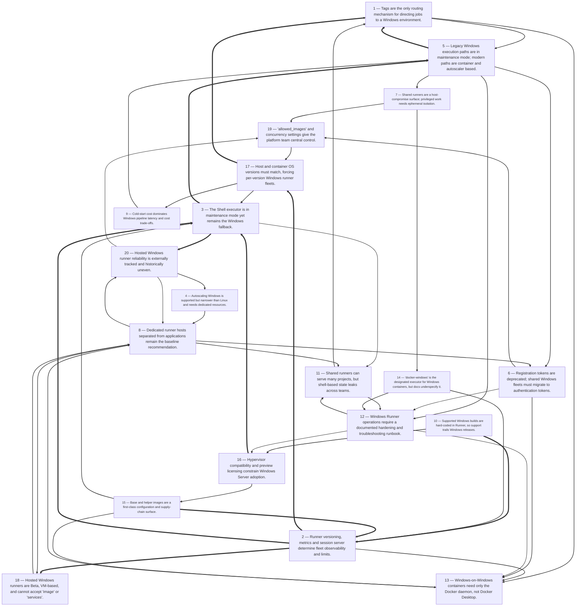

# Title: Across the captured sources, support for Windows on GitLab's latest shared…

## Corpus Quality Scoreboard

Quality: **58/100** - Grade C (Adequate)

```
[############--------]  58/100
```

- Critic: review (coverage 50 | evidence 24 | balance 89 | tension 100)
- Sources: 49 gathered | 32 cited | 49 full text | 12 distinct domains | 5.7/8 average relevance
- Cited date span: 2016-2026 (27 undated)

## Topic

research all the stratergies for supporting windows shared runners on Gitlab latest. environment need to support build environs that differ between teams, review all literature that describes how to support windows native containers on shared CI/CD gitlab runners

## Search Queries

- GitLab shared Windows runners Windows native containers
- GitLab Runner Windows container executor shared runners
- GitLab CI Windows native containers on shared runners
- GitLab Runner Windows Docker executor shared runner configuration
- GitLab shared runners Windows container isolation Hyper-V process
- GitLab Windows shared runners per-team build environments
- multi-tenant Windows containers GitLab shared runners
- strategies supporting Windows shared runners GitLab latest
- GitLab Windows runner autoscaler container support
- GitLab CI/CD Windows container executor limitations shared runners
- GitLab Runner Windows shell executor vs container executor
- GitLab Windows native container build CI/CD literature
- GitLab shared runner Windows container support documentation
- GitLab CI Windows containers Kubernetes shared runners
- GitLab shared runners build environment isolation between teams
- review GitLab Windows shared CI/CD runners native containers
- GitLab Windows shared runners best practices
- GitLab Windows shared runners native containers support
- GitLab shared runners Windows containers CI/CD

### Search Engine Summary

| Engine | Pages | PDFs | Videos | Total |
|--------|-------|------|--------|-------|
| langsearch | 19 | 0 | 0 | 19 |
| serper | 18 | 0 | 0 | 18 |
| wikipedia | 12 | 0 | 0 | 12 |

### Search Provider Requests

| Search Provider | Requests |
|-----------------|----------|
| mf_search | 19 |

## Executive Summary

Across the captured sources, support for Windows on GitLab's latest shared CI/CD runners resolves into two very different paths. GitLab.com's hosted Windows runners are the managed "shared runner" answer, but they are in Beta, run each job on a throwaway Google Cloud VM through a custom autoscaling driver rather than the Docker executor, so pipelines cannot specify `image` or `services`, must use PowerShell, and run as an elevated admin process with roughly five-minute VM provisioning and documented pending/availability issues [#5][#14][#49]. Native Windows containers on shared runners therefore depend on self-managed runners using the `docker-windows` executor, where the binding constraint is that host and container OS versions must match and the helper image must be built on that Windows version, which is why GitLab publishes per-version base/helper images and hard-codes supported builds in Runner code — a map that lagged Windows Server 2025 badly enough that a practitioner had to patch it in source [#2][#9]. Supporting build environments that differ between teams is achieved not by one shared Windows pool but by a combination of tags as the only job-routing mechanism, per-runner or per-fleet image selection constrained by `allowed_images`, internal registry mirrors, dedicated and preferably ephemeral hosts, and autoscaling through the Docker Autoscaler or Instance executor (which support Windows), while the legacy Shell, VirtualBox and Parallels paths that historically served Windows are in maintenance mode and explicitly unsafe for mixed-trust sharing [#19][#22][#17][#36][#35][#25].

## Top 10 Implications

1. Windows native containers on shared runners are a self-managed capability, not a GitLab.com hosted capability: hosted Windows runners cannot accept `image` or `services`, so teams needing container-defined build environments must run their own `docker-windows` executors [#5][#13].
2. Windows OS version becomes a first-class fleet dimension: because helper and base images must match the host build, every Windows Server version (and later, ARM64 variant) implies its own runner pool, image pipeline and upgrade cycle [#2].
3. Upgrade timing must follow GitLab Runner, not Windows releases: supported Windows builds are compiled into Runner code (`supportedWindowsBuilds`, `knownWinVersions`), so adopting a new Windows Server before Runner supports it forces source patches or blocks adoption [#2][#9].
4. Different team build environments should be expressed as a governed image catalogue plus a tag taxonomy, not as one mutable shared shell host, because tagging is the only supported job-routing mechanism and shared shell runners retain SDKs and logins between jobs [#19][#22][#25].
5. Central platform teams must enforce image allowlists and mirror base/helper images internally, using `allowed_images`/`allowed_services` and `helper_image` overrides, otherwise teams must be trusted with arbitrary image pulls on a shared host [#17][#10].
6. Security posture must assume any Developer-role user can compromise a shared runner host, so privileged or Windows-container jobs belong on ephemeral, isolated VMs rather than long-lived shared hosts, with `FF_ENABLE_JOB_CLEANUP` and restricted pull policies [#35].
7. Autoscaling Windows is now feasible via the Instance executor and Docker Autoscaler (both support Windows), but each runner configuration needs its own dedicated autoscaling resource, and the older `docker+machine` route to Windows VMs historically failed on SSH detection [#32][#28][#33].
8. Cold-start cost will dominate Windows pipeline latency: a representative Windows build image was 12.1 GB, hosted VM provisioning averages about five minutes, and generic VM provisioning adds 15+ seconds before image pulls and clones [#9][#5][#38].
9. Treat GitLab.com hosted Windows runners as burst capacity with a fallback: they are Beta, can be unavailable for maintenance, queue longer than Linux runners, and may introduce breaking changes requiring pipeline edits [#5][#49].
10. Plan the registration-token migration now, since registration tokens are deprecated with removal slated for GitLab 20.0 and authentication tokens (15.10+) are the replacement for registering shared Windows fleets [#16][#45].

## Open Questions

- What behavioural differences actually distinguish the `docker` and `docker-windows` executors, and why do both exist? GitLab's documentation reportedly does not explain this, and a forum thread requests clarification [#13].
- Is `docker-windows` covered by GitLab's executor feature matrix? It appears in the executor list and Windows guidance but not in the matrix that enumerates `image`, `services` and interactive web terminal support [#17][#36][#13].
- Does process isolation constitute an adequate security boundary for multi-team shared Windows container runners, or is Hyper-V isolation required? The captured sources describe process isolation only as a compatibility constraint, not as a security model [#2].
- What is the measured end-to-end startup latency for a Windows `docker-windows` job with a multi-gigabyte image on a warm versus cold autoscaled instance? The available figures are for hosted VMs and generic topologies, not Windows containers [#5][#38][#9].
- How exactly should a shared Windows service be partitioned so that teams with genuinely different toolchains are isolated without provisioning a dedicated autoscaling resource per team, given that resources must not be shared across runner managers or `[[runners]]` entries [#28][#31]?
- What is the supported path for Windows ARM64 runners, given that LTSC2025 helper and base images include ARM64 variants and a native ARM64 helper build was added [#2]?
- Which `[runners.docker]` options (privileged, `allowed_images`, `cpus`, `devices`, `cache_dir`) behave identically under `docker-windows` on Windows hosts, and which require different handling?
- How should cache storage be isolated across teams on a shared Windows runner so that `cache_dir` volumes do not expose one team's build outputs to another, and when should a remote cache backend be preferred over the local filesystem cache [#40][#16]?
- Does the deprecation of registration tokens in GitLab 20.0 require re-registration of self-managed Windows runners, and is any executor-specific behaviour involved in migrating to authentication tokens [#16][#45]?
- How reliable are GitLab.com hosted Windows runners in practice, beyond anecdotal report aggregations and the documented Beta known issues [#49][#5]?
- What is the current production-recommended autoscaling path for Windows, given that Docker Autoscaler was described as Beta and not recommended for production in Runner 17.0 but appears as a standard documented executor in later docs [#29][#28][#34]?
- Which Windows workloads genuinely cannot be containerized and therefore require the Instance executor or a Shell fallback, and how should those be isolated given that the Shell executor is in maintenance mode and documented as unsafe for shared use [#36][#37][#48]?

## Data Quality & Consistency

**Overall verdict:** Proceed — the synthesis passes the deterministic 4-critic audit.

| Metric | Value | Detail |
|--------|-------|--------|
| Corpus critic | 58/100 (review) | coverage 50 · evidence 24 · balance 89 · tension 100 |
| Contradictions | 0 edge(s) | no edges |
| Source tensions | 12 tension(s) | 0 contradiction · 5 shallow · 7 isolated |
| Synthesis audit | 95/100 (proceed) | 32 source(s) cited |

**Key concerns:**
- Corpus: Dimension 'Cost' has only moderate support (3 source(s))
- Corpus: Dimension 'Performance' has only moderate support (3 source(s))
- Tension (shallow evidence): Benefit [#13] — surface evidence: only 1 source(s) mention this dimension.
- Tension (shallow evidence): Cost [#12, #28, #38] — moderate evidence: only 3 source(s) mention this dimension.
- Audit: Synthesis audit for 'research all the stratergies for supporting windows shared runners on Gitlab latest. environment need to support build environs that differ between teams, review all literature that describes how to support windows native containers on shared CI/CD gitlab runners' scored 95/100 across critics [coverage=80 logic=100 evidence=100 readability=100]; 32/49 sources cited.

## Concepts

### 1. Autoscaling Cloud Runners
**Definition:** GitLab Runner autoscaling dynamically creates cloud instances on demand using Docker Autoscaler, Instance executor, Taskscaler/Fleeting, and cloud provider plugins.

**Key Evidence:**
- Docker Autoscaler wraps the Docker executor and uses fleeting plugins for AWS, GCP, and Azure; Instance Group Autoscaler comprises Taskscaler, Fleeting, and a cloud plugin, supporting AWS EC2, Google Compute Engine, and Azure VMs [#28][#32].
- Example configs use `capacity_per_instance=1`, `max_use_count=1`, `max_instances=10`, `idle_count=5`, `idle_time=20m`, and `concurrent=10`, and each configuration requires a dedicated autoscaling resource with provider autoscaling disabled or manual [#29][#30][#34].

### 2. GitLab Runner Lifecycle
**Definition:** GitLab Runner is a Go-based, single-binary agent that executes CI/CD jobs defined in `.gitlab-ci.yml`, and its lifecycle covers installation, registration, configuration, and scaling.

**Key Evidence:**
- `.gitlab-ci.yml` defines ordered stages and jobs, with pipelines triggered by commits, merge requests, schedules, or manually and executed by runners [#43].
- Administrators install Runner on Linux, Windows, macOS, or z/OS, register it using authentication tokens and instance/group/project scopes, and configure `config.toml` for concurrency, logging, cache, CPU, and executor-specific settings [#19][#20][#17].

### 3. Windows Container and Hosted Windows Runners
**Definition:** GitLab supports Windows CI/CD through hosted Windows runners and self-managed Windows container workloads, with constraints around OS version matching, executor choice, and helper images.

**Key Evidence:**
- GitLab.com hosted Windows runners are Beta, autoscale GCP VMs, do not use the GitLab Docker executor, use PowerShell, and discard each VM after a job [#5].
- Windows container support requires host and container OS versions to match; Windows Server 2025 could reuse 2022 helper images, but Windows Server 2022 needed a new image because the 2019 helper was incompatible with process isolation [#2].
- The `docker-windows` executor is documented for Windows containers, though users have also run the plain `docker` executor with Windows containers and questioned the difference [#10][#13].

### 4. Executor Selection and Tradeoffs
**Definition:** Executors determine where and how CI/CD jobs run, with different isolation, capability, performance, and maintenance tradeoffs.

**Key Evidence:**
- GitLab Runner includes Shell, Docker, Docker Autoscaler, Instance, Kubernetes, SSH, VirtualBox, Parallels, and Custom executors; Docker Autoscaler and Instance use Fleeting plugins and are recommended for full capabilities [#36].
- Shell and Docker on single servers deliver the fastest jobs, with Shell being fastest and Docker adding isolation; shared SaaS and autoscaling runners suffer cold starts, while feature support varies by executor, such as `image` and `services` support [#36][#38].

### 5. Runner Security and Sharing Risks
**Definition:** Runner security addresses the risk that CI/CD jobs execute arbitrary code, especially on non-ephemeral self-managed or shared runners, and requires isolation, hardening, and careful sharing practices.

**Key Evidence:**
- Any user with the Developer role on a project can compromise the runner host or network, and malicious jobs can steal `CI_JOB_TOKEN` and access submodule contents via the parent repo’s reflog [#35].
- Shared runners can conflict if jobs permanently set variables or install software; Docker-based runners reset filesystem, packages, and logins per job, while shell-based runners retain SDKs and logins and may interfere across projects or parallel jobs [#25].
- Hardening steps include running privileged jobs only on isolated ephemeral VMs or dedicated protected-branch runners, network segmentation, securing or removing host SSH keys, and enabling `FF_ENABLE_JOB_CLEANUP` [#35].

## Findings


### **Finding 1** — Tags are the only routing mechanism for directing jobs to a Windows environment.

**Observation:**
The GitLab Runner getting-started documentation states that tags referenced in `.gitlab-ci.yml` are the only way to route or filter jobs to suitable runners [#19][#20]. The runners overview explains that when pipelines trigger, matching runners pick up queued jobs — one job per runner — based on tags, runner type, status and capacity, and capabilities, then report results in real time [#22]. Community guidance recommends using tags (or enabling untagged jobs when tags are not used) and notes that different operating systems or hardware require different runners [#25]. Feature support varies by executor, with `image` supported by Docker, Docker Autoscaler, Kubernetes, VirtualBox, Parallels and Custom, and `services` by Docker, Docker Autoscaler, Kubernetes and Custom [#36].

**Analysis:**
If tags are the only routing primitive, then a shared Windows service that must serve differing team environments is, architecturally, a tag taxonomy plus a set of pools.

Each distinguishable environment dimension — Windows Server version, container versus VM execution, toolchain family, ARM64 versus x64 — has to be expressed either as a separate runner pool with its own tag or, where the executor supports it, as a per-job `image` selected inside the allowlist.

The feature matrix reveals the constraint that makes this non-trivial on Windows: `image` is a Docker-family capability, so the VM-based hosted Windows runner [#5] cannot participate in per-job image selection at all, and only self-managed Docker or Docker Autoscaler runners can.

The sources also expose an ambiguity that a platform team should resolve empirically: the feature matrix lists "Docker" but not "docker-windows" as a distinct row [#36], even though `docker-windows` appears as a configurable executor in the advanced configuration reference [#17] and is the documented choice for Windows containers [#13].

The community evidence adds a nuance about tag discipline: enabling untagged jobs on a shared runner is convenient but removes the routing guarantee that keeps a Linux job off a Windows host or a trusted job off a mixed-trust pool [#25].

Overall the routing model is adequate but coarse, and it places the burden of consistent tagging on every consuming team.

**Cross-reference / Dependencies:**
Depends on Finding 1 and Finding 5; prerequisite for the governance model in Finding 13.

**Implication:**
Publish a mandatory tag taxonomy (Windows version, execution model, architecture, trust level) and require teams to target runners explicitly rather than enabling untagged job pickup on shared Windows pools.

**Sources:**
- [5] Hosted runners on Windows | GitLab Docs — `hxxps://docs[.]gitlab[.]com/ci/runners/hosted_runners/windows`
- [13] GitLab Runner on Windows with Windows containers: docker vs docker-windows executor — `hxxps://forum[.]gitlab[.]com/t/gitlab-runner-on-windows-with-windows-containers-docker-vs-docker-windows-executor/115489`
- [17] Advanced configuration | GitLab Docs — `hxxps://docs[.]gitlab[.]com/runner/configuration/advanced-configuration`
- [19] Get started with GitLab Runner | GitLab Docs — `hxxps://docs[.]gitlab[.]com/18[.]7/user/get_started/get_started_runner`
- [20] Get started with GitLab Runner | GitLab Docs — `hxxps://docs[.]gitlab[.]com/user/get_started/get_started_runner`
- [22] Runners | GitLab Docs — `hxxps://docs[.]gitlab[.]com/ci/runners`
- [25] How does a shared runner work? — `hxxps://forum[.]gitlab[.]com/t/how-does-a-shared-runner-work/103603` (published 2024-04-27)
- [36] Executors | GitLab Docs — `hxxps://docs[.]gitlab[.]com/runner/executors`

**Source date range:** 2024-04-27 (1 of 8 cited web sources dated)


### **Finding 2** — Runner versioning, metrics and session server determine fleet observability and limits.

**Observation:**
GitLab Runner is described as a Go-based, single-binary application supporting concurrent jobs, multiple tokens and servers, Bash, PowerShell Core and Windows PowerShell, GNU/Linux, macOS and Windows, caching and Prometheus metrics, with a compatibility rule that Runner major.minor must stay in sync with GitLab and backward compatibility between minor updates [#45]. A configuration guide notes Prometheus metrics on `:9252` and a session server on `:8093`, and the advanced configuration reference documents `[session_server]` with `session_timeout` of 1800 seconds [#16][#17]. The runners-in-containers documentation notes that Docker Engine and Runner image versions need not match and are backward and forward compatible, but that isolation guarantees break if the Runner container shares a Docker daemon with other payloads, and lists images of about 470 MB (Ubuntu) and 270 MB (Alpine) [#18]. The feature matrix indicates the interactive web terminal is supported by Docker, Kubernetes and Shell, and does not list `docker-windows` [#36].

**Analysis:**
These details matter for running a shared Windows fleet as a service rather than as a collection of machines.

Prometheus metrics give the platform team the data needed to size pools and diagnose the queueing that hosted Windows runners are documented to experience [#5], and the version-sync rule constrains upgrade sequencing so that Windows pools cannot be left behind for OS-support reasons without risking incompatibility with the GitLab server [#45].

The session server enables interactive web terminals, but the feature matrix suggests they are not available for `docker-windows`, which is an operational limitation worth confirming and communicating to teams who rely on debugging through the web terminal — the older executor documentation classifies debugging difficulty as easy for Shell and SSH, medium for Docker, Docker-SSH and Kubernetes, and hard for VirtualBox and Parallels [#12].

The container-mode isolation caveat is a reminder that hosting the runner itself in a container alongside other workloads undermines isolation guarantees, which is relevant if any part of the Windows fleet is containerized (the instance group autoscaler documentation notes the runner manager can be containerized) [#32][#18].

The evidence is largely from generic documentation rather than Windows-specific guidance, so Windows behaviour of these features should be treated as requiring verification.

**Cross-reference / Dependencies:**
Supports Finding 13 (performance tuning) and Finding 18 (reliability monitoring); depends on Finding 17's versioning rule being satisfied by Finding 3's upgrade timing.

**Implication:**
Enable and scrape Prometheus metrics for the Windows fleet, keep Runner major.minor aligned with the GitLab server, and verify whether the interactive web terminal and session server work with `docker-windows` before promising them to teams.

**Sources:**
- [5] Hosted runners on Windows | GitLab Docs — `hxxps://docs[.]gitlab[.]com/ci/runners/hosted_runners/windows`
- [12] gitlab-ci-multi-runner/docs/executors at master · ayufan/gitlab-ci-multi-runner — `hxxps://github[.]com/ayufan/gitlab-ci-multi-runner/tree/master/docs/executors`
- [16] blog/posts/2026-01-07-ubuntu-gitlab-runner at master · OneUptime/blog — `hxxps://github[.]com/oneuptime/blog/tree/master/posts/2026-01-07-ubuntu-gitlab-runner`
- [17] Advanced configuration | GitLab Docs — `hxxps://docs[.]gitlab[.]com/runner/configuration/advanced-configuration`
- [18] Run GitLab Runner in a container | GitLab Docs — `hxxps://docs[.]gitlab[.]com/runner/install/docker`
- [32] GitLab Runner instance group autoscaler | GitLab Docs — `hxxps://docs[.]gitlab[.]com/runner/runner_autoscale/gitlab-runner-autoscaler`
- [36] Executors | GitLab Docs — `hxxps://docs[.]gitlab[.]com/runner/executors`
- [45] GitLab Runner | GitLab Docs — `hxxps://docs[.]gitlab[.]com/runner`

**Source date range:** — (cited web sources did not expose a publication date)


### **Finding 3** — The Shell executor is in maintenance mode yet remains the Windows fallback.

**Observation:**
GitLab documents the Shell executor as being in maintenance mode, receiving critical security updates only and no new features, with new projects directed to actively developed executors, while noting it runs builds locally on the Runner host, requires dependencies on that machine, supports Bash, PowerShell Core, Windows PowerShell and deprecated Windows Batch, and provides limited isolation [#37]. The same documentation and its archived equivalents state that Shell executor jobs are generally unsafe because they run with the `gitlab-runner` user's permissions, may steal code from other projects, and may execute arbitrary privileged commands, so they should be used only with trusted users and servers [#37][#39][#40]. A forum answer nevertheless advises that Docker executors are preferred for flexibility while shell runners may be used when Docker cannot run, "such as Windows Server builds" [#48].

**Analysis:**
The Shell executor is the bridge between legacy Windows CI and the container-based future, and the sources simultaneously endorse it as pragmatic and condemn it as unsafe.

The mechanism of risk is permission inheritance: because jobs run as the runner user on the host, a job from one project can read another project's checkout or cache under `<working-directory>/builds/...`, and on Windows an elevated service account magnifies the blast radius.

That aligns with the security guidance that any user with Developer role can compromise a shared non-ephemeral runner host [#35].

The practitioner case study is instructive: the author explicitly replaced a shell executor used since 2017 with Windows OS containers to "avoid maintaining multiple host software versions" [#9], which is exactly the divergence problem this research question is about — each team's needed toolchain version multiplied the maintenance load on the host.

Two tensions should be noted.

First, several Windows workloads genuinely cannot run in a container (drivers, device access, installer testing), and for those the Instance executor with full host/OS/device access is the better modern answer than Shell, though it too requires isolation discipline [#36].

Second, because Shell is maintenance mode, any platform team building a new shared Windows service on it is building on a path with no new features and only security fixes.

**Cross-reference / Dependencies:**
Contradicts the "one shared host" model implied by Finding 5; depends on Finding 20 (executor consolidation) and relates to Finding 11 (security).

**Implication:**
Keep Shell only for trusted, isolated, single-team Windows hosts, and plan a migration to `docker-windows`, Docker Autoscaler or the Instance executor for anything shared.

**Sources:**
- [9] Windows containers with GitLab CI [aixxe] — `hxxps://aixxe[.]net/2024/04/windows-ci-docker`
- [35] Security for self-managed runners | GitLab Docs — `hxxps://docs[.]gitlab[.]com/runner/security`
- [36] Executors | GitLab Docs — `hxxps://docs[.]gitlab[.]com/runner/executors`
- [37] The Shell executor | GitLab Docs — `hxxps://docs[.]gitlab[.]com/runner/executors/shell`
- [39] The Shell executor | GitLab — `hxxps://archives[.]docs[.]gitlab[.]com/17[.]2/runner/executors/shell[.]html`
- [40] The Shell executor | GitLab — `hxxps://archives[.]docs[.]gitlab[.]com/16[.]1/runner/executors/shell[.]html`
- [48] Where should you install gitlab-runner? — `hxxps://forum[.]gitlab[.]com/t/where-should-you-install-gitlab-runner/99147` (published 2024-01-31)

**Source date range:** 2024-01-31 (1 of 7 cited web sources dated)


### **Finding 4** — Autoscaling Windows is supported but narrower than Linux and needs dedicated resources.

**Observation:**
GitLab's instance group autoscaler documentation states that the Instance executor supports Linux, macOS and Windows, while the Docker Autoscaler executor supports Linux and Windows but not macOS, and describes the architecture as Taskscaler (autoscaling logic and fleets), Fleeting (cloud VM abstraction) and a cloud provider plugin, with the runner manager polling GitLab, creating cloud instances and distributing jobs; the manager must run on a non-spot instance, hold cloud provider credentials, and may be containerized [#32]. Docker Autoscaler documentation adds that each runner configuration requires its own dedicated autoscaling resource — AWS Auto Scaling group, GCP instance group or Azure scale set — which must not be shared across runner managers or `[[runners]]` entries, with example values `capacity_per_instance=1`, `max_use_count=1`, `max_instances=10`, `idle_count=5`, `idle_time=20m`, `concurrent=10`, and prerequisites including Docker Engine images that do not register as GitLab runners [#28][#31][#34]. An earlier Runner 17.0 version of the same page described the executor as Beta and not recommended for production, directing users to the Docker Machine executor instead [#29], and a forum report of a GCP autoscaled Windows runner configured through `docker+machine` failed with "Error creating machine: Error detecting OS: Too many retries waiting for SSH to be available… Maximum number of retries (60) exceeded" [#33].

**Analysis:**
The trajectory across sources is the important signal: the Windows-capable autoscaling path moved from Beta with a Docker Machine recommendation [#29] to a documented, generally described executor wrapping the Docker executor [#28][#30][#34], while the legacy Docker Machine route demonstrably struggled to provision Windows hosts [#33].

For a shared multi-team Windows service, the Fleeting-based Docker Autoscaler is the mechanism that reconciles "differing team build environments" with "shared capacity": each job gets a secure ephemeral instance that is deleted after completion, while idle instances are retained for warmth, and jobs select images per configuration or per job within the allowlist.

The dedicated-resource rule is the sharpest operational constraint — it means a Windows autoscaling pool cannot be trivially subdivided across teams without provisioning separate Auto Scaling groups, instance groups or scale sets, and the sources warn that sharing them causes "unpredictable behavior, job failures, and higher costs" [#28][#31].

Prerequisites also matter for Windows specifically: the instance image must have Docker Engine but must not itself register as a GitLab runner, GCP must be single-zone with autoscaling disabled, and Azure scale sets need `overprovision=false` [#28][#31][#34].

The counter-evidence to a smooth story is the troubleshooting list (`ssh tunnel: EOF` from externally removed instances, AWS `context deadline exceeded` tied to AZRebalance, Azure overprovisioning job failures), which suggests operational tuning is required before a Windows autoscaled pool is stable for many teams [#28][#34].

**Cross-reference / Dependencies:**
Depends on Findings 1, 2 and 9 (executor, version matching, images) and interacts with Finding 8 (cold-start cost).

**Implication:**
Pilot Docker Autoscaler with a dedicated per-team (or per-environment) Windows autoscaling resource, verify the instance image meets the "Docker Engine but not a registered runner" rule, and budget tuning time for AZRebalance and overprovisioning issues.

**Sources:**
- [28] Docker Autoscaler executor | GitLab Docs — `hxxps://docs[.]gitlab[.]com/runner/executors/docker_autoscaler`
- [29] Docker Autoscaler executor | GitLab — `hxxps://archives[.]docs[.]gitlab[.]com/17[.]0/runner/executors/docker_autoscaler[.]html`
- [30] Docker Autoscaler executor | GitLab — `hxxps://archives[.]docs[.]gitlab[.]com/17[.]2/runner/executors/docker_autoscaler[.]html`
- [31] Docker Autoscaler executor | GitLab Docs — `hxxps://docs[.]gitlab[.]com/18[.]0/runner/executors/docker_autoscaler`
- [32] GitLab Runner instance group autoscaler | GitLab Docs — `hxxps://docs[.]gitlab[.]com/runner/runner_autoscale/gitlab-runner-autoscaler`
- [33] Google Cloud: AutoScale Windows runner with GitLab — `hxxps://forum[.]gitlab[.]com/t/google-cloud-autoscale-windows-runner-with-gitlab/39407` (published 2020-06-30)
- [34] Docker Autoscaler executor | GitLab Docs — `hxxps://docs[.]gitlab[.]com/runner/executors/docker_autoscaler[.]html`

**Source date range:** 2020-06-30 (1 of 7 cited web sources dated)


### **Finding 5** — Legacy Windows execution paths are in maintenance mode; modern paths are container and autoscaler based.

**Observation:**
GitLab's executors documentation states that SSH, Shell, VirtualBox, Parallels and Custom are in maintenance mode, receiving only critical security updates and no new features, while Docker Autoscaler and Instance use Fleeting plugins for autoscaling and are recommended for full capabilities; it also gives a feature matrix in which `image` is supported by Docker, Docker Autoscaler, Kubernetes, VirtualBox, Parallels and Custom, `services` by Docker, Docker Autoscaler, Kubernetes and Custom, and the interactive web terminal by Docker, Kubernetes and Shell [#36]. Older executor documentation describes Docker, Docker-SSH, VirtualBox, Parallels and Kubernetes as providing clean build environments while Shell and SSH do not, and notes that VirtualBox and Parallels clone existing VMs to run builds on Windows, Linux, OSX or FreeBSD and can reduce infrastructure cost, with debugging rated hard for those executors [#12]. The advanced configuration reference lists `instance` and `docker-autoscaler` among configurable executors [#17].

**Analysis:**
This finding maps the available strategies onto a maturity spectrum and shows that the historically natural Windows strategies are the ones being retired.

VirtualBox and Parallels were the documented way to get a clean Windows build environment by cloning a VM, which solves environment divergence by giving each team a snapshot; both are now maintenance mode, so that strategy is a dead end for new shared services even though it remains technically functional.

Docker-SSH, another legacy option for containerized builds, is described in earlier documentation as generally discouraged [#12].

What replaces them is the Docker executor family with autoscaling: Docker Autoscaler wraps all Docker executor options and features while creating ephemeral instances on demand [#28][#34], and the Instance executor covers workloads needing full host, OS or device access across Linux, macOS and Windows [#32][#36].

For Windows specifically, the practical implication is that new shared capacity should be built as `docker-windows` runners with Docker Autoscaler for elasticity, with Instance executor reserved for workloads that cannot be containerized.

A caveat running through the sources is the absence of `docker-windows` from the feature matrix [#36] even as it appears in the executor list [#17] and the Windows-container guidance [#13], so capabilities such as `image` and the interactive web terminal should be verified rather than assumed on Windows.

Because maintenance-mode executors still receive security updates, existing Windows pools do not need emergency replacement, which gives a reasonable migration window.

**Cross-reference / Dependencies:**
Depends on Finding 1 and Finding 7; supersedes the historical approach described in Finding 6 and connects to Finding 12 (feature-based routing).

**Implication:**
Plan migration away from VirtualBox, Parallels and Shell for shared Windows capacity toward `docker-windows` with Docker Autoscaler, reserving the Instance executor for host-level Windows workloads.

**Sources:**
- [12] gitlab-ci-multi-runner/docs/executors at master · ayufan/gitlab-ci-multi-runner — `hxxps://github[.]com/ayufan/gitlab-ci-multi-runner/tree/master/docs/executors`
- [13] GitLab Runner on Windows with Windows containers: docker vs docker-windows executor — `hxxps://forum[.]gitlab[.]com/t/gitlab-runner-on-windows-with-windows-containers-docker-vs-docker-windows-executor/115489`
- [17] Advanced configuration | GitLab Docs — `hxxps://docs[.]gitlab[.]com/runner/configuration/advanced-configuration`
- [28] Docker Autoscaler executor | GitLab Docs — `hxxps://docs[.]gitlab[.]com/runner/executors/docker_autoscaler`
- [32] GitLab Runner instance group autoscaler | GitLab Docs — `hxxps://docs[.]gitlab[.]com/runner/runner_autoscale/gitlab-runner-autoscaler`
- [34] Docker Autoscaler executor | GitLab Docs — `hxxps://docs[.]gitlab[.]com/runner/executors/docker_autoscaler[.]html`
- [36] Executors | GitLab Docs — `hxxps://docs[.]gitlab[.]com/runner/executors`

**Source date range:** — (cited web sources did not expose a publication date)


### **Finding 6** — Registration tokens are deprecated; shared Windows fleets must migrate to authentication tokens.

**Observation:**
A GitLab Runner installation guide states that registration tokens are deprecated and scheduled for removal in GitLab 20.0, while authentication tokens were introduced in GitLab 15.10 and later [#16]. GitLab's runner overview distinguishes three token types: registration uses a `registration_token`, job requests use a `runner_token`, and job execution uses a `job_token` [#45]. The getting-started documentation describes registering runners with authentication tokens and setting access scope as an instance, group or project runner, with tags in `.gitlab-ci.yml` determining which runners receive which jobs [#19][#20].

**Analysis:**
Any design for shared Windows runners is also a design for how those runners are registered and scoped, and the sources make clear that the registration mechanism is mid-migration.

For a multi-team Windows service the access-scope decision is the substantive one: instance-level registration gives one fleet to the whole GitLab instance, group-level registration scopes a pool to a division, and project-level registration isolates a single team — each with a different blast radius if a runner host is compromised, as the security guidance about Developer-role users describes [#35].

The deprecation deadline adds a forcing function: a fleet registered with legacy tokens will need re-registration before GitLab 20.

0, and re-registration of many Windows runners is exactly the maintenance burden community advice warns about when it suggests centralizing shared runners instead of running one per project [#25].

Because Runner version compatibility requires major.minor alignment with GitLab while allowing minor-version drift [#45], the token migration and the runner-version upgrade can be sequenced together, which reduces the operational risk of doing each separately.

The evidence does not describe a Windows-specific migration path or any incompatibility between authentication tokens and the `docker-windows` executor, so the reasonable inference is that the migration is executor-neutral and can be planned as part of normal fleet maintenance.

**Cross-reference / Dependencies:**
Relates to Finding 12 (routing) and Finding 19 (host placement), and supports the governance model in Finding 13.

**Implication:**
Audit existing Windows runner registrations for legacy registration tokens and plan re-registration with authentication tokens at instance or group scope well before GitLab 20.0.

**Sources:**
- [16] blog/posts/2026-01-07-ubuntu-gitlab-runner at master · OneUptime/blog — `hxxps://github[.]com/oneuptime/blog/tree/master/posts/2026-01-07-ubuntu-gitlab-runner`
- [19] Get started with GitLab Runner | GitLab Docs — `hxxps://docs[.]gitlab[.]com/18[.]7/user/get_started/get_started_runner`
- [20] Get started with GitLab Runner | GitLab Docs — `hxxps://docs[.]gitlab[.]com/user/get_started/get_started_runner`
- [25] How does a shared runner work? — `hxxps://forum[.]gitlab[.]com/t/how-does-a-shared-runner-work/103603` (published 2024-04-27)
- [35] Security for self-managed runners | GitLab Docs — `hxxps://docs[.]gitlab[.]com/runner/security`
- [45] GitLab Runner | GitLab Docs — `hxxps://docs[.]gitlab[.]com/runner`

**Source date range:** 2024-04-27 (1 of 6 cited web sources dated)


### **Finding 7** — Shared runners are a host-compromise surface; privileged work needs ephemeral isolation.

**Observation:**
GitLab's security guidance for self-managed runners states that any user with the Developer role on a project can compromise the runner host and network, especially with non-ephemeral self-managed runners shared across projects, and that malicious jobs can steal secrets such as `CI_JOB_TOKEN` and access submodule contents via the parent repository's reflog [#35]. Executor-specific risks listed include Shell (high risk, runs as the Runner user), Docker (safer when non-privileged, but privileged mode or `--pid=host` enables root and container breakout, with Docker Machine advised to use `MaxBuilds = 1`), Docker credential helpers executing on the runner manager, and SSH MITM due to missing `StrictHostKeyChecking` [#35]. Hardening recommendations include running privileged jobs only on isolated ephemeral VMs or dedicated protected-branch runners, network segmentation, securing or removing host SSH keys, avoiding `if-not-present` for private Docker images on mixed-access runners, using `GIT_STRATEGY: fetch` only when all shared-environment users are trusted, and enabling `FF_ENABLE_JOB_CLEANUP` to clean build directories after each build [#35].

**Analysis:**
For a shared Windows service serving teams with different build needs, this guidance inverts the usual design instinct.

The natural approach — one powerful Windows host with MSVC, SDKs and Docker installed, shared by everyone to amortize cost — is the exact configuration the security documentation warns about, because Shell executor jobs run with the runner user's permissions and can read other projects' code, and a privileged Docker container can escape to the host.

The sources do not explicitly discuss Windows container isolation modes (process versus Hyper-V) as a security boundary, which is a notable gap given that process isolation shares the host kernel and is the default that the version-matching rules assume [#2].

The strongest mitigation available within the sources is ephemerality: GitLab's hosted Windows runners discard a fresh VM after every job and run the job as an elevated admin process inside it [#5], which shows that elevation is acceptable when the surrounding isolation is strong enough.

Self-managed teams can approximate this with Docker Autoscaler's ephemeral instances deleted after completion [#28][#29] or the Instance executor with proper isolation [#36].

Two caveats temper the picture: the guidance is generic to all executors rather than Windows-specific, and the `FF_ENABLE_JOB_CLEANUP` feature is described as a hardening step rather than a default, so it must be consciously enabled across the fleet.

**Cross-reference / Dependencies:**
Constrains Findings 5, 6 and 7; reinforces Finding 19 (network and host separation) and interacts with Finding 14 (host hardening).

**Implication:**
Run privileged or Windows-container jobs only on ephemeral or single-team isolated hosts, enable `FF_ENABLE_JOB_CLEANUP`, avoid `if-not-present` image pulls on mixed-trust runners, and segment the runner network from production.

**Sources:**
- [2] Add Docker executor support for a Windows version | GitLab Docs — `hxxps://docs[.]gitlab[.]com/runner/development/add-windows-version`
- [5] Hosted runners on Windows | GitLab Docs — `hxxps://docs[.]gitlab[.]com/ci/runners/hosted_runners/windows`
- [28] Docker Autoscaler executor | GitLab Docs — `hxxps://docs[.]gitlab[.]com/runner/executors/docker_autoscaler`
- [29] Docker Autoscaler executor | GitLab — `hxxps://archives[.]docs[.]gitlab[.]com/17[.]0/runner/executors/docker_autoscaler[.]html`
- [35] Security for self-managed runners | GitLab Docs — `hxxps://docs[.]gitlab[.]com/runner/security`
- [36] Executors | GitLab Docs — `hxxps://docs[.]gitlab[.]com/runner/executors`

**Source date range:** — (cited web sources did not expose a publication date)


### **Finding 8** — Dedicated runner hosts separated from applications remain the baseline recommendation.

**Observation:**
A GitLab forum answer states that for performance GitLab recommends a dedicated VM separate from GitLab and application environments, that one runner can serve multiple environments although shell runners are limiting and generally not recommended, and that runners communicate with GitLab via its HTTP API so proper SSL and standard security practices matter; Docker executors are preferred for flexibility (for example SSH/SCP deploy jobs), while shell runners may be used when Docker cannot run, such as Windows Server builds [#48]. GitLab's container-installation documentation adds that Docker Engine and Runner image versions are backward and forward compatible but that isolation guarantees break if the Runner container shares a Docker daemon with other payloads [#18]. The security guidance recommends network segmentation and securing or removing host SSH keys [#35].

**Analysis:**
Placement is a design decision that shapes both performance and risk for a shared Windows service.

Keeping runners on dedicated hosts separate from application servers means that a compromised job cannot trivially pivot into production, which is the mitigation the security documentation points to when it says job code can compromise the host and network [#35].

It also improves performance predictability, since CI workloads competing with application workloads on the same VM would distort both, and the topology comparison recommends well-provisioned single servers for the fastest job execution [#38].

The Windows-specific wrinkle is that the same forum answer acknowledges shell runners are used when Docker cannot run for Windows Server builds [#48], which is precisely the maintenance-mode path that GitLab elsewhere discourages [#37][#36]; this creates a real tension for teams with device-dependent or installer-heavy Windows builds, where the better modern answer is the Instance executor that can give jobs full host, OS and device access [#36].

The evidence for the dedicated-host recommendation is community-level advice relaying GitLab guidance rather than a normative specification, so it should be treated as strong practice rather than a hard requirement, but it aligns with the security guidance's isolation model.

Notably, the sources do not quantify the performance penalty of colocating runners with applications, so the argument rests mainly on security and predictability.

**Cross-reference / Dependencies:**
Supports Finding 11 (security isolation) and Finding 18 (fallback capacity); interacts with Finding 6 (shell fallback) and Finding 20 (modern executor choice).

**Implication:**
Provision dedicated, network-segmented Windows runner manager hosts and avoid sharing the Docker daemon or the host with application workloads.

**Sources:**
- [18] Run GitLab Runner in a container | GitLab Docs — `hxxps://docs[.]gitlab[.]com/runner/install/docker`
- [35] Security for self-managed runners | GitLab Docs — `hxxps://docs[.]gitlab[.]com/runner/security`
- [36] Executors | GitLab Docs — `hxxps://docs[.]gitlab[.]com/runner/executors`
- [37] The Shell executor | GitLab Docs — `hxxps://docs[.]gitlab[.]com/runner/executors/shell`
- [38] 🦊 GitLab Runners: Which Topology for Fastest Job Execution? [@] — `hxxps://dev[.]to/zenika/gitlab-runners-which-topology-for-fastest-job-execution-5bma` (published 2026-01-30)
- [48] Where should you install gitlab-runner? — `hxxps://forum[.]gitlab[.]com/t/where-should-you-install-gitlab-runner/99147` (published 2024-01-31)

**Source date range:** 2024-01-31..2026-01-30 (2 of 6 cited web sources dated)


### **Finding 9** — Cold-start cost dominates Windows pipeline latency and cost trade-offs.

**Observation:**
GitLab's hosted Windows runner documentation cites an average VM provisioning time of about five minutes during Beta [#5], and a topology comparison article reports that autoscaling Kubernetes node provisioning takes 30 seconds to 2 minutes, VM provisioning adds 15+ seconds, and that autoscaled topologies additionally incur full image pulls and git clones, whereas Shell and Docker executors on single servers deliver the fastest jobs [#38]. A practitioner's Windows build image based on `mcr.microsoft.com/windows/servercore:ltsc2022` with Visual Studio 2022 Build Tools, CMake, Meson, Ninja, PowerShell and Git was 12.1 GB [#9]. Advanced configuration exposes `prepare_timeout`, `get_sources_timeout` and `output_limit` (4096 KB) as tunables, and Docker Autoscaler examples keep `idle_count=5` for at least `idle_time=20m` [#17][#28].

**Analysis:**
Windows container images are an order of magnitude larger than typical Linux base images, and the sources never quantify this directly — the 12.

1 GB figure appears only in a third-party blog — so the cost model must be inferred from the combination of image size, provisioning latency and the autoscaler warm-pool defaults.

The practical effect is that a shared Windows service optimized purely for isolation and elasticity can make every job slower than a warm, well-provisioned single server, which is precisely the conclusion the topology article reaches: it recommends vertical scaling of well-provisioned single servers (SSD, dozens of concurrent jobs, predictable costs, low maintenance) for fastest execution, and rates GitLab's shared SaaS runners as slowest due to multi-tenancy [#38].

The tension with Finding 5 is real: warm single servers are fast but carry the state-leak and cross-team interference risks, whereas ephemeral instances are clean but cold.

The reconciliation implied by the sources is a tiered model — pre-baked images, warm idle pools sized to demand, aggressive caching, and a documented expectation that Windows jobs start slower than Linux ones.

The evidence has weaknesses: the five-minute figure is explicitly a Beta-time measurement [#5], the topology comparison is a vendor-neutral blog rather than GitLab guidance [#38], and neither source measures a Windows container job specifically, so the latency claims should be treated as directional and re-measured internally.

**Cross-reference / Dependencies:**
Depends on Findings 4, 7 and 9; informs the capacity and cost design implied by Finding 5.

**Implication:**
Pre-bake Windows images, size idle pools against observed demand, and set explicit service-level expectations that Windows jobs will queue and start more slowly than Linux jobs.

**Sources:**
- [5] Hosted runners on Windows | GitLab Docs — `hxxps://docs[.]gitlab[.]com/ci/runners/hosted_runners/windows`
- [9] Windows containers with GitLab CI [aixxe] — `hxxps://aixxe[.]net/2024/04/windows-ci-docker`
- [17] Advanced configuration | GitLab Docs — `hxxps://docs[.]gitlab[.]com/runner/configuration/advanced-configuration`
- [28] Docker Autoscaler executor | GitLab Docs — `hxxps://docs[.]gitlab[.]com/runner/executors/docker_autoscaler`
- [38] 🦊 GitLab Runners: Which Topology for Fastest Job Execution? [@] — `hxxps://dev[.]to/zenika/gitlab-runners-which-topology-for-fastest-job-execution-5bma` (published 2026-01-30)

**Source date range:** 2026-01-30 (1 of 5 cited web sources dated)


### **Finding 10** — Supported Windows builds are hard-coded in Runner, so support trails Windows releases.

**Observation:**
A practitioner installing Runner v16.9.1 on Windows Server 2025 had to patch the `supportedWindowsBuilds` map in the source because the runner did not yet support that Windows version [#9]. GitLab's own workflow for adding a Windows version enumerates the code artifacts that must change: `supportedWindowsBuilds`, the `ltsc` map, `docker-bake.hcl`, `helper-images.json`, `knownWinVersions`, CI jobs, and docs, plus updates to Ansible, the autoscaler and the liveness image [#2]. Historical support additions for LTSC2025 arrived through a sequence of merge requests (88 added `ltsc2025`/`ltsc2025-arm64`/`servercore`/`nanoserver` base images; 6033 built `servercore:ltsc2025` helper images; 6697 and 6716 added native ARM64 helper builds and bundling; 6717 built `nanoserver:ltsc2025` images) [#2].

**Analysis:**
The practical consequence for a shared Windows service is that the platform team's upgrade clock is set by GitLab Runner releases, not by Microsoft's release calendar, and that running ahead of support means maintaining a forked or patched runner binary — a maintenance liability that is hard to justify for a shared multi-team service.

The troubleshooting guidance reinforces how this surfaces in production: GitLab documents "unsupported Windows versions" as a distinct failure class for the Docker and Kubernetes executors, with examples such as Docker 17.

06.

2 and the `node.kubernetes.io/windows-build` nodeSelector for Kubernetes [#11].

Since Runner version compatibility itself requires major.minor alignment with GitLab with backward compatibility only between minor updates [#45], a Windows fleet pinned to an older runner for OS-support reasons can fall behind the GitLab server version and create a second, compounding constraint.

The evidence therefore describes a two-sided pin: the Runner version must be new enough to know the Windows build and matched to the GitLab server's major.minor.

The countervailing evidence is the reuse pattern for Server 2025 [#2], which shows the pain is not uniform across releases and that newer hosts sometimes ride on existing helper images, so a disciplined "adopt the LTSC after GitLab ships support" policy is realistic.

**Cross-reference / Dependencies:**
Depends on Finding 2 (version matching) and constrains Finding 16 (host platform and hypervisor choices).

**Implication:**
Adopt new Windows Server LTSC releases only after GitLab Runner ships support; if a preview is required for evaluation, isolate it to a non-production runner and track the patch burden explicitly.

**Sources:**
- [2] Add Docker executor support for a Windows version | GitLab Docs — `hxxps://docs[.]gitlab[.]com/runner/development/add-windows-version`
- [9] Windows containers with GitLab CI [aixxe] — `hxxps://aixxe[.]net/2024/04/windows-ci-docker`
- [11] Install GitLab Runner on Windows | GitLab — `hxxps://archives[.]docs[.]gitlab[.]com/17[.]2/runner/install/windows[.]html`
- [45] GitLab Runner | GitLab Docs — `hxxps://docs[.]gitlab[.]com/runner`

**Source date range:** — (cited web sources did not expose a publication date)


### **Finding 11** — Shared runners can serve many projects, but shell-based state leaks across teams.

**Observation:**
A GitLab forum thread explains that shared runners can serve multiple projects, that the "Enable for this project" button attaches an already-registered shared or group runner rather than creating a new one, and that commenters consider per-project runners excessive — "20 Python projects may need only one or two runners" — while updating many runners is burdensome [#25]. The same thread warns that sharing runners can cause conflicts if jobs permanently set variables or install software, recommends tags (or enabling untagged jobs), and notes that Docker-based runners reset filesystem, packages and logins per job whereas shell-based runners retain SDKs and logins and may interfere across projects or parallel jobs; different OS or hardware requires different runners, and a custom Docker image stored in the local GitLab registry can preserve needed packages and logins [#25].

**Analysis:**
This is the most direct evidence on the "build environments differ between teams" requirement, and it frames the trade-off cleanly: sharing is an efficiency win only when the environment is reset per job.

On Windows, the historical default was the opposite — a long-lived host with installed toolchains — so the migration to containers described by one practitioner (replacing a shell executor used since 2017 to avoid maintaining multiple host software versions) is a move from a shared mutable environment to a shared immutable one [#9].

The forum guidance also supplies the escape hatch for genuine environment divergence: separate runners per OS/hardware combined with a local-registry image that captures the required packages, which maps onto GitLab's own `allowed_images` control [#25][#17].

The counter-argument implicit in the thread is operational: a proliferation of runners is itself a maintenance burden, so the recommended shape is a small number of well-provisioned pools differentiated by tag rather than one runner per team.

The evidence limitation is that the thread is community advice, not vendor documentation, and it predates the current autoscaler-centric executor guidance, so it should be read as evidence of recurring operator experience rather than as normative design.

**Cross-reference / Dependencies:**
Connected to Finding 1 and Finding 12 (routing by tag) and to Finding 11 (security of mixed-trust sharing).

**Implication:**
Design shared Windows capacity as a small number of container-based pools with per-team image variants, and prohibit stateful installation patterns on shared shell hosts.

**Sources:**
- [9] Windows containers with GitLab CI [aixxe] — `hxxps://aixxe[.]net/2024/04/windows-ci-docker`
- [17] Advanced configuration | GitLab Docs — `hxxps://docs[.]gitlab[.]com/runner/configuration/advanced-configuration`
- [25] How does a shared runner work? — `hxxps://forum[.]gitlab[.]com/t/how-does-a-shared-runner-work/103603` (published 2024-04-27)

**Source date range:** 2024-04-27 (1 of 3 cited web sources dated)


### **Finding 12** — Windows Runner operations require a documented hardening and troubleshooting runbook.

**Observation:**
GitLab's Windows installation documentation states that GitLab Runner on Windows requires Git and, if run under a user account rather than the Built-in System Account, a valid user password; that since GitLab Runner 10 the executable is `gitlab-runner`, installed by placing a 32/64-bit binary in a folder such as `C:\GitLab-Runner`, restricting Write permissions to prevent privilege escalation, registering the runner, and installing and starting it as a service via `gitlab-runner install`/`start` (optionally with `--user` and `--password`) [#11]. It recommends the Built-in System Account, notes that concurrent jobs can be set in `C:\GitLab-Runner\config.toml`, that logs appear in the Windows Event Log under provider `gitlab-runner`, that upgrades require stopping the service and replacing the binary, and that uninstalling uses `stop`, `uninstall` and `rmdir /s` [#11]. Documented troubleshooting includes logon failures requiring `SeServiceLogonRight`, `PathTooLongException` fixes via `git config --system core.longpaths true` or NTFSSecurity's `Remove-Item2`, Batch scripts needing `call`, ANSI color output, robocopy exit-code handling, unsupported Windows versions in Docker and Kubernetes executors, mapped drives needing UNC paths, Docker-Windows permission errors for `C:\ProgramData\Docker`, and WSL blank STDOUT lines fixed with `WSL_UTF8=1` [#11].

**Analysis:**
Much of the risk in a shared Windows runner service is mundane operational drift rather than architecture, and this documentation is the most concrete evidence of what that drift looks like.

Permission restrictions on the install directory are explicitly framed as privilege-escalation prevention, which connects directly to the shared-host risk model: a writable runner binary directory on a multi-team host is a privilege-escalation path.

The service account choice (Built-in System Account versus a named user with `SeServiceLogonRight`) determines both the privilege level of every job and the breadth of the operational failure modes, and the recommendation favours the system account, which is consistent with the observation that hosted Windows runners execute jobs as elevated admin processes inside disposable VMs [#5].

The troubleshooting list is a strong indicator of recurring Windows-specific friction in production: long paths, batch semantics, mapped drives, Docker data directory permissions, and WSL output encoding are all environment-specific issues that a platform team will hit repeatedly at fleet scale and should pre-empt in the base image and runbook.

An additional detail from operator notes is that `config.toml` changes require a service restart to take effect, and that `pwsh` may be unavailable on Windows Server 2022 so `powershell` should be the configured shell [#10].

**Cross-reference / Dependencies:**
Enables the security posture in Finding 11 and the registry controls in Finding 13; relates to Finding 16 (host platform choices).

**Implication:**
Codify a Windows runner hardening checklist (binary directory permissions, service account, log location, long-path setting, shell selection) and include the documented failure modes in the team's operational runbook.

**Sources:**
- [5] Hosted runners on Windows | GitLab Docs — `hxxps://docs[.]gitlab[.]com/ci/runners/hosted_runners/windows`
- [10] Set up GitLab Runner for Windows containers — `hxxps://notes[.]runtimeterror[.]dev/CICD/Set-up-Gitlab-Runner-for-Windows-containers[.]html`
- [11] Install GitLab Runner on Windows | GitLab — `hxxps://archives[.]docs[.]gitlab[.]com/17[.]2/runner/install/windows[.]html`

**Source date range:** — (cited web sources did not expose a publication date)


### **Finding 13** — Windows-on-Windows containers need only the Docker daemon, not Docker Desktop.

**Observation:**
A practitioner's guide to Windows containers with GitLab CI describes enabling built-in OpenSSH, fixing a non-working TCP/22 firewall rule by recreating `OpenSSH-Server-In-TCP`, installing Docker via Microsoft's `install-docker-ce.ps1`, and building a 12.1 GB `mcr.microsoft.com/windows/servercore:ltsc2022`-based image with Visual Studio 2022 Build Tools and C++ (`cl 19.39.33521`), CMake, Meson, Ninja, PowerShell and Git, then testing compilation and `docker cp` [#9]. Operator notes add that Docker CE is installed by downloading and running `install-docker-ce.ps1` via `Invoke-WebRequest`, rebooting and verifying with `docker run --rm hello-world`, and that "Docker Desktop/Hyper-V is needed for Linux containers, but the Docker daemon is enough for Windows-on-Windows," with an example job image of `mcr.microsoft.com/windows/nanoserver:ltsc2022` and `VcVars.ps1` used to set up the MSVC environment for the registered `docker-windows` runner [#10][#9].

**Analysis:**
This finding is the practical proof that shared Windows container runners are achievable on ordinary Windows Server hosts without the licensing and nesting overhead that Docker Desktop implies, which is significant for cost and for the hypervisor constraints described elsewhere.

The toolchain pattern is instructive: the image bakes in a compiler suite, and `VcVars.ps1` is used to activate the MSVC environment inside the job, which is a reusable recipe for teams whose builds need specific compiler versions rather than whatever the host has installed.

The image size (12.

1 GB) is the main cost of this approach and connects to the cold-start economics in Finding 8, since every ephemeral instance must pull that image unless it is cached in the instance image or a local registry. `nanoserver` versus `servercore` is a real decision: the operator example uses `nanoserver:ltsc2022` for the job image while the case study builds on `servercore:ltsc2022`, and since `nanoserver` is far smaller but lacks many components, teams needing Build Tools will need `servercore`-class images.

The evidence base here is community-authored and version-specific (Runner 16.

9.

1 and 17.x, Windows Server 2022/2025 preview), so the exact steps should be re-validated against current GitLab Runner releases, but the architecture it demonstrates is consistent with GitLab's own version-matching and helper-image rules [#2].

**Cross-reference / Dependencies:**
Depends on Findings 1, 2 and 9; feeds Finding 8 (image size and latency) and Finding 13 (image governance).

**Implication:**
Standardize a `servercore`-class Windows build image with the required toolchain and a `VcVars`-style activation step, and confirm that no Docker Desktop or Hyper-V dependency is introduced on shared hosts.

**Sources:**
- [2] Add Docker executor support for a Windows version | GitLab Docs — `hxxps://docs[.]gitlab[.]com/runner/development/add-windows-version`
- [9] Windows containers with GitLab CI [aixxe] — `hxxps://aixxe[.]net/2024/04/windows-ci-docker`
- [10] Set up GitLab Runner for Windows containers — `hxxps://notes[.]runtimeterror[.]dev/CICD/Set-up-Gitlab-Runner-for-Windows-containers[.]html`

**Source date range:** — (cited web sources did not expose a publication date)


### **Finding 14** — `docker-windows` is the designated executor for Windows containers, but docs underspecify it.

**Observation:**
GitLab Runner documentation states that the `docker-windows` executor, not `docker`, should be used for Windows containers, yet a GitLab Forum poster notes the documentation does not explain the difference between the two executors or why both exist, despite having successfully run Runner 17.3.1 with `nanoserver` and `servercore` images using the plain `docker` executor with Docker Desktop in Windows Containers mode [#13]. The advanced configuration reference lists `docker-windows` alongside `shell`, `docker`, `ssh`, `parallels`, `virtualbox`, `docker+machine`, `kubernetes`, `docker-autoscaler` and `instance` as configurable executors [#17].

**Analysis:**
This finding is the entry point for the whole research question, because the executor choice determines whether a shared Windows runner can honour a per-job `image`.

The forum evidence shows a real divergence between documented policy and observed practice: a practitioner ran the unsupported combination successfully and then asked for clarification rather than changing behaviour, which suggests the distinction is not operationally obvious and will be misconfigured in multi-team environments.

Because the docs do not articulate the difference, a platform team can neither justify a mandate nor explain the failure modes if they choose `docker` on a Windows host.

The consequence is governance risk rather than an immediate functional break: teams may build working pipelines on an undocumented configuration that upstream does not test or guarantee, and support for such configurations is unclear.

It also matters for the "differing build environments" requirement, since per-job image selection is precisely the mechanism teams would use to differentiate their compilers, SDKs and toolchains on a shared pool, and the executor determines whether that mechanism is available.

The sources give no authoritative list of behavioural differences, so the only safe inference is that executor selection on Windows should be standardized centrally and validated by the platform team rather than left to individual teams.

**Cross-reference / Dependencies:**
Prerequisite for Finding 2 (version matching is only enforceable on the supported executor) and Finding 12 (tag and image routing assumes a container-capable executor).

**Implication:**
Standardize `docker-windows` in all shared Windows runner configurations, and record the rationale internally since upstream documentation does not supply it; raise a docs issue as the forum poster contemplated [#13].

**Sources:**
- [13] GitLab Runner on Windows with Windows containers: docker vs docker-windows executor — `hxxps://forum[.]gitlab[.]com/t/gitlab-runner-on-windows-with-windows-containers-docker-vs-docker-windows-executor/115489`
- [17] Advanced configuration | GitLab Docs — `hxxps://docs[.]gitlab[.]com/runner/configuration/advanced-configuration`

**Source date range:** — (cited web sources did not expose a publication date)


### **Finding 15** — Base and helper images are a first-class configuration and supply-chain surface.

**Observation:**
GitLab's Windows version workflow states that base images are published by `runner-tools/base-images` and configured via the `windows` target in `dockerfiles/runner-helper/docker-bake.hcl`, with helper images built on the matching Windows version [#2]. Operator notes show `helper_image` in `C:\GitLab-Runner\config.toml` can be replaced with an internally hosted image, using the example `harbor.example.com/dockerhub/gitlab/gitlab-runner-helper:x86_64-v${CI_RUNNER_VERSION}-servercore21H2` alongside an image of `harbor.example.com/mcr/windows/nanoserver:ltsc2022`, `tls_verify = true`, `privileged = false`, and shell `powershell` because `pwsh` may not be available on Windows Server 2022 [#10]. The same community guidance notes that `config.toml` edits require a service restart to take effect [#10].

**Analysis:**
This finding turns the version-matching constraint into an actionable platform requirement.

Because the helper image must match the host Windows build and is referenced by the runner configuration, a shared Windows service effectively ships a versioned software artifact — the helper — to every job, whether or not the platform team thinks of it that way.

Replacing the default with an internally hosted mirror is therefore not optional for regulated, air-gapped, or rate-limited environments, and the naming convention in the example (mirroring `mcr/` and `dockerhub/` paths under a private Harbor) shows how teams keep upstream structure while controlling provenance.

The `${CI_RUNNER_VERSION}` variable in the helper tag is a subtle coupling: upgrading the runner binary automatically changes the helper tag the configuration resolves, so a fleet upgrade and an image availability check must happen together or jobs will fail to pull the helper.

The base-image pipeline is equally significant as an upstream dependency: GitLab's own merge-request history shows the LTSC2025 work spanning base images, helper images for `servercore` and `nanoserver`, and native ARM64 variants [#2], meaning a Windows ARM64 runner pool is now conceivable and would require its own mirrored images.

The evidence limitation is that these details are split between GitLab development documentation and third-party operator notes, so the platform team must synthesize the supply-chain model rather than adopt a documented one.

**Cross-reference / Dependencies:**
Depends on Finding 2 (version matching) and Finding 3 (supported builds); enables Finding 13 (allowlists and registry control).

**Implication:**
Build a per-Windows-version, per-architecture image pipeline that mirrors base and helper images internally, and pin helper tags deliberately rather than relying on implicit `${CI_RUNNER_VERSION}` resolution.

**Sources:**
- [2] Add Docker executor support for a Windows version | GitLab Docs — `hxxps://docs[.]gitlab[.]com/runner/development/add-windows-version`
- [10] Set up GitLab Runner for Windows containers — `hxxps://notes[.]runtimeterror[.]dev/CICD/Set-up-Gitlab-Runner-for-Windows-containers[.]html`

**Source date range:** — (cited web sources did not expose a publication date)


### **Finding 16** — Hypervisor compatibility and preview licensing constrain Windows Server adoption.

**Observation:**
A practitioner attempting Windows Server 2025 preview reported that a VMware ESXi default Server 2025 VM failed to boot beyond the DVD prompt, so they installed as Server 2022 with ESXi 7.0 compatibility and upgraded, using timed evaluations obtained through the Windows Insider Program or uupdump.net [#9]. GitLab's own version-support workflow records the multi-merge-request sequence required before LTSC2025 images, including ARM64 variants, were available [#2].

**Analysis:**
This finding adds a layer that is easy to overlook when planning a Windows container fleet: the virtualisation platform itself can be the blocker, independent of GitLab support.

The practitioner's workaround — install an older Server release and upgrade — is a reasonable pattern but adds steps and risk to provisioning automation, and the evaluation licensing used for a preview build is time-limited, which is acceptable for a lab and unacceptable for a shared service.

Combined with the source-code gating described in Finding 3, the practical sequencing for a platform team is: confirm GitLab Runner supports the Windows build, confirm the hypervisor supports the guest, confirm helper and base images exist for that build, and only then add the pool.

The evidence for ESXi's behaviour comes from a single anecdote on a preview release, so it should not be generalized into a claim about ESXi and Server 2025 generally; it is better read as a warning that host virtualisation compatibility must be validated per Windows release rather than assumed.

The countervailing evidence is that Windows Server 2025 support on GitLab's side was ultimately delivered across base images, helper images and ARM64 variants [#2], so the platform constraint is temporal rather than permanent.

**Cross-reference / Dependencies:**
Depends on Finding 3 (upstream support gating) and interacts with Finding 15 (host build choices).

**Implication:**
Validate hypervisor guest support as an explicit gate before standardizing on a new Windows Server release, and avoid time-limited evaluation builds in any shared production fleet.

**Sources:**
- [2] Add Docker executor support for a Windows version | GitLab Docs — `hxxps://docs[.]gitlab[.]com/runner/development/add-windows-version`
- [9] Windows containers with GitLab CI [aixxe] — `hxxps://aixxe[.]net/2024/04/windows-ci-docker`

**Source date range:** — (cited web sources did not expose a publication date)


### **Finding 17** — Host and container OS versions must match, forcing per-version Windows runner fleets.

**Observation:**
Adding Docker executor support for a Windows version requires GitLab to release a matching helper image "built with GitLab Runner on that Windows version because host and container OS versions must match," with base images published by `runner-tools/base-images` and configured via the `windows` target in `dockerfiles/runner-helper/docker-bake.hcl` [#2]. The same source records that Windows Server 2022 needed a new helper image because the 2019 helper was incompatible with process isolation, while Windows Server 2025 could reuse 2022 helper images under backward compatibility [#2].

**Analysis:**
This is the single constraint that most directly shapes a shared Windows runner architecture, because it forbids the "one big pool serves everyone" model that works reasonably well on Linux.

The mechanism is OS-level: Windows containers run in process isolation by default, sharing the host kernel, so a container built against one Server build cannot reliably start on another, and the helper container that prepares the job must satisfy the same rule.

The compatibility evidence is asymmetric and important: newer hosts may reuse older helper images (2025 reusing 2022), but older hosts cannot run newer helpers, so upgrade planning has a direction.

For teams with differing build environments this means the shared service must expose "Windows version" as a selectable dimension implemented as distinct runner pools, each registered with tags, each with its own mirrored helper and base image, and each validated independently.

The cost of getting this wrong is not a warning but a hard failure: jobs will not start, or will start and behave inconsistently under incompatible isolation modes.

The limitation of the evidence is that it comes from GitLab's own development documentation [#2] rather than from an operator-facing guide, so the operational implications (pool naming, image mirroring, tag conventions) must be derived rather than followed.

**Cross-reference / Dependencies:**
Builds on Finding 1 (executor choice) and is a prerequisite for Finding 3 (supported-build gating) and Finding 9 (image supply chain).

**Implication:**
Maintain an explicit matrix of host Windows version to helper/base image version, mirror both per version, and expose Windows version as a tag dimension on the shared service.

**Sources:**
- [2] Add Docker executor support for a Windows version | GitLab Docs — `hxxps://docs[.]gitlab[.]com/runner/development/add-windows-version`

**Source date range:** — (cited web sources did not expose a publication date)


### **Finding 18** — Hosted Windows runners are Beta, VM-based, and cannot accept `image` or `services`.

**Observation:**
GitLab.com hosted runners on Windows are in Beta for Free, Premium and Ultimate, autoscale by launching Google Cloud Platform VMs via a GitLab-developed autoscaling driver for the custom executor, use a single machine type `saas-windows-medium-amd64` (2 vCPUs, 7.5 GB memory, 75 GB storage), and Windows 2022 is GA [#5]. The same documentation states these runners do not use the GitLab Docker executor, so pipelines cannot specify `image` or `services`, use PowerShell as the shell, install the latest Docker version at image build, and run jobs as an elevated admin process in a new VM that is discarded after each job; .NET Framework is 4.8.04161 [#5]. GitLab.com-specific help pages corroborate the machine profile as an `n1-standard-2`-class instance with 2 vCPU and 7.5 GB RAM and about five-minute VM provisioning [#14][#15].

**Analysis:**
This is the crux for teams expecting GitLab's shared Windows runners to behave like Linux shared runners.

The architecture is fundamentally different — a full VM per job rather than a container per job — which delivers strong isolation and a clean environment but removes the image-selection mechanism that most teams use to define their build environment.

Practically, a team needing Visual Studio Build Tools, a specific CMake version, or a particular SDK cannot declare it in `.gitlab-ci.yml`; they must install it during the job or maintain their own runner.

The elevated admin process is a notable security posture: it means job code runs with administrator rights inside a VM that is destroyed afterwards, which is the isolation model that makes the elevation tolerable, and contrasts sharply with long-lived shared shell hosts discussed elsewhere.

The Beta status plus documented issues — about five minutes of VM provisioning, occasional fleet unavailability for maintenance, longer pending than Linux runners, and possible breaking changes requiring pipeline updates — argue against making hosted Windows the only path for critical pipelines [#5].

The evidence is also fairly consistent across sources on capacity: the hosted Windows machine type is larger than the baseline Linux shared runner (n1-standard-1, 3.

75 GB RAM, 1 vCPU, 25 GB HDD), which has cost and quota implications for heavy Windows workloads [#14].

**Cross-reference / Dependencies:**
Contrasts with Findings 1, 2 and 9, which describe the self-managed container path; supports Finding 18 (reliability) and Finding 8 (latency).

**Implication:**
Treat hosted Windows runners as a convenience for simple, toolchain-light Windows jobs; anything requiring a declared container environment must move to self-managed `docker-windows` runners.

**Sources:**
- [5] Hosted runners on Windows | GitLab Docs — `hxxps://docs[.]gitlab[.]com/ci/runners/hosted_runners/windows`
- [14] Index · Gitlab com · User · Help — `hxxps://gitlab[.]musictribe[.]com/help/user/gitlab_com/index[.]md`
- [15] Index · Gitlab com · User · Help — `hxxps://git[.]cs[.]hofstra[.]edu/help/user/gitlab_com/index[.]md`

**Source date range:** — (cited web sources did not expose a publication date)


### **Finding 19** — `allowed_images` and concurrency settings give the platform team central control.

**Observation:**
GitLab Runner's advanced configuration documents `[runners.docker]` settings including `allowed_images` and `allowed_services`, privileged mode, `cache_dir`, `cap_add`/`cap_drop`, `cpus`/`cpuset_cpus`, `devices` and `disable_cache`, alongside `[[runners]]` settings such as `limit`, `executor`, `request_concurrency`, `strict_check_interval`, `output_limit` (4096 KB), `prepare_timeout` and `get_sources_timeout`, and global settings `concurrent`, `check_interval` (default 3s), `connection_max_age` (15m) and `shutdown_timeout` (30s) [#17]. The same page warns about long polling, citing GitLab Workhorse's `-apiCiLongPollingDuration` default of 50 seconds and `request_concurrency` default of 1, and recommends higher `concurrent` and `request_concurrency` values together with `FF_USE_ADAPTIVE_REQUEST_CONCURRENCY` [#17]. Community guidance recommends storing a custom Docker image with the required packages in the local GitLab registry so teams keep their environment without host-level installations [#25].

**Analysis:**
This finding describes the actual control surface for "support build environments that differ between teams" on a self-managed Windows runner. `allowed_images` and `allowed_services` mean a platform team can let teams choose their own toolchain image without letting them choose an arbitrary or untrusted one, which is the governance counterpart to the internal registry mirroring described in the helper-image finding. `cache_dir`, `cpus`/`cpuset_cpus`, `devices` and `cap_add`/`cap_drop` extend that control to resource limits and Windows device access, which matters because some Windows build environments genuinely need full host or device access, and the Instance executor is documented as the way to grant that while the Docker executor remains the isolated default [#36].

The concurrency guidance is the other half of the story: on a shared fleet serving many teams, defaults that assume a single runner manager with one request in flight will produce queueing, and the recommended response is raising `concurrent` and `request_concurrency` and enabling adaptive request concurrency rather than adding runners.

The tuning parameters `prepare_timeout` and `get_sources_timeout` are directly relevant to Windows, where large images and slow clones make timeouts a likely failure mode.

The limitation is that the documentation is executor-generic and does not state which of these settings behave identically under `docker-windows` on a Windows host, so a platform team should validate the settings it depends on.

**Cross-reference / Dependencies:**
Depends on Findings 5, 9 and 12; complements Finding 17 (observability and versioning).

**Implication:**
Enforce an image allowlist, mirror the approved images locally, and tune `concurrent`, `request_concurrency` and timeouts explicitly for Windows fleet workload rather than relying on defaults.

**Sources:**
- [17] Advanced configuration | GitLab Docs — `hxxps://docs[.]gitlab[.]com/runner/configuration/advanced-configuration`
- [25] How does a shared runner work? — `hxxps://forum[.]gitlab[.]com/t/how-does-a-shared-runner-work/103603` (published 2024-04-27)
- [36] Executors | GitLab Docs — `hxxps://docs[.]gitlab[.]com/runner/executors`

**Source date range:** 2024-04-27 (1 of 3 cited web sources dated)


### **Finding 20** — Hosted Windows runner reliability is externally tracked and historically uneven.

**Observation:**
StatusGator reports it has monitored GitLab CI/CD hosted runners on Windows since 22 December 2016, logging more than 2,645 outages across 24 components and 5 groups, with over 600 users monitoring the service and more than 58,500 notifications sent; at the time captured, GitLab was experiencing a partial outage with 7 user-submitted reports in 24 hours, confirmed issues with Google Compute Engine Git Operations and Website, and 500 errors when accessing projects, while other components were operational [#49]. GitLab's own documentation lists known issues for hosted Windows runners: average VM provisioning time of about five minutes during beta, occasional fleet unavailability for maintenance, jobs pending longer than on Linux runners, and possible breaking changes requiring pipeline updates [#5].

**Analysis:**
This evidence should be used carefully because StatusGator aggregates user-submitted reports and its "2,645 outages" figure spans 24 components over nearly a decade, so it does not isolate Windows runner reliability; the monitored-since date and the count are best read as evidence of sustained community attention rather than as a Windows-specific failure rate.

What it does support is the broader argument that hosted Windows capacity should not be a single point of failure for a team's pipeline.

That argument is independently corroborated by GitLab's own known-issues list, which explicitly warns of fleet unavailability for maintenance and longer pending times than Linux [#5], and by the architecture — a custom executor driving ephemeral GCP VMs is inherently more exposed to cloud provider incidents and capacity limits than a self-managed host.

The practical design response implied across the sources is a hybrid: use hosted Windows runners for simple or overflow workloads where a queue delay is tolerable, and maintain self-managed Windows capacity with tags that pipelines can target when the hosted path is degraded.

The limitation is that the sources contain no measured availability figures for GitLab's hosted Windows service, so claims about its reliability remain qualitative.

**Cross-reference / Dependencies:**
Supports Finding 4 (hosted runner constraints) and Finding 19 (dedicated self-managed capacity); relates to Finding 8 (queue latency).

**Implication:**
Maintain a tagged self-managed Windows fallback and make pipeline routing tolerant of a degraded hosted runner, rather than treating the hosted service as the only Windows execution path.

**Sources:**
- [5] Hosted runners on Windows | GitLab Docs — `hxxps://docs[.]gitlab[.]com/ci/runners/hosted_runners/windows`
- [49] GitLab CI/CD - Hosted runners on Windows Status. Check if GitLab CI/CD - Hosted runners on Windows is down or having… [@statusgator] — `hxxps://statusgator[.]com/services/gitlab/cicd---hosted-runners-on-windows` (published 2016-12-22)

**Source date range:** 2016-12-22 (1 of 2 cited web sources dated)


## Findings Relationship Diagram


## In-Project Cross-References

| Path | Relevance |
|------|-----------|
| `dockerfiles/runner-helper/docker-bake.hcl` | contains the `windows` build target that defines base/helper image variants; the file must be updated when adding a Windows version [#2]. |
| `helper-images.json` | artifact that must be updated when GitLab adds support for a Windows version [#2]. |
| `config.toml` (`C:\GitLab-Runner\config.toml`, `/etc/gitlab-runner/config.toml`)` | primary runner configuration file holding executor selection, `shell`, `tls_verify`, `privileged`, `image`, `helper_image`, `allowed_images`, `cache_dir`, concurrency and timeout settings; changes generally require a restart for Windows runners [#10][#17]. |
| `.gitlab-ci.yml` | project pipeline definition where job tags select the Windows runner and where `image`/`services` would be declared, though those keywords are unavailable on hosted Windows runners [#5][#19][#22]. |
| `install-docker-ce.ps1` | Microsoft installation script used to install Docker CE on Windows Server hosts for Windows container workloads [#9][#10]. |
| `VcVars.ps1` | script used to activate the MSVC/Visual Studio build environment inside Windows container jobs, especially for x86 and x64 runners [#9]. |
| `ci/manifest.yml` and `ci/containers/` | libvirt-ci manifest and generated Dockerfiles used by a project to build and cache CI container images, illustrating a reproducible cross-platform image pipeline pattern [#41][#42]. |
| `ci/build.sh` | the script that drives CI checks inside those generated containers [#41][#42]. |
| `.cirrus.yml` | minimal file required to trigger Cirrus CI from GitLab CI where GitLab lacks shared runners for a platform, using masked `CIRRUS_GITHUB_REPO` and `CIRRUS_API_TOKEN` variables [#41][#42]. |

## References Index

| # | Type | Media | Language | Path/URL | Title | Author | Published | Relevance | Search tool | Engine | Captured |
|---|------|-------|----------|----------|-------|--------|-----------|-----------|-------------|--------|----------|
| 1 | web | page | English | `hxxps://en[.]wikipedia[.]org/wiki/Wine_(software)` | Wine (software) | — | — | Encyclopedia — engine-ranked summary | mf_search | wikipedia | 2026-09-24T14:09:44.960131012+00:00 |
| 2 | web | page | English | `hxxps://docs[.]gitlab[.]com/runner/development/add-windows-version` | Add Docker executor support for a Windows version \| GitLab Docs | — | — | High — title matches query | mf_search | serper | 2026-09-24T14:10:25.586484786+00:00 |
| 3 | web | page | English | `hxxps://en[.]wikipedia[.]org/wiki/Google_Chrome` | Google Chrome | — | — | Encyclopedia — engine-ranked summary | mf_search | wikipedia | 2026-09-24T14:09:46.667421192+00:00 |
| 4 | web | page | English | `hxxps://en[.]wikipedia[.]org/wiki/List_of_TCP_and_UDP_port_numbers` | List of TCP and UDP port numbers | — | — | Encyclopedia — engine-ranked summary | mf_search | wikipedia | 2026-09-24T14:09:50.553446688+00:00 |
| 5 | web | page | English | `hxxps://docs[.]gitlab[.]com/ci/runners/hosted_runners/windows` | Hosted runners on Windows \| GitLab Docs | — | — | Medium — multiple title terms match query | mf_search | serper | 2026-09-24T14:10:14.460450597+00:00 |
| 6 | web | page | English | `hxxps://en[.]wikipedia[.]org/wiki/Adobe_Flash` | Adobe Flash | — | — | Encyclopedia — engine-ranked summary | mf_search | wikipedia | 2026-09-24T14:09:54.281127010+00:00 |
| 7 | web | page | English | `hxxps://en[.]wikipedia[.]org/wiki/List_of_unit_testing_frameworks` | List of unit testing frameworks | — | — | Encyclopedia — engine-ranked summary | mf_search | wikipedia | 2026-09-24T14:09:56.367799254+00:00 |
| 8 | web | page | English | `hxxps://en[.]wikipedia[.]org/wiki/Vertica` | Vertica | — | — | Encyclopedia — engine-ranked summary | mf_search | wikipedia | 2026-09-24T14:09:58.720645138+00:00 |
| 9 | web | page | English | `hxxps://aixxe[.]net/2024/04/windows-ci-docker` | Windows containers with GitLab CI | [aixxe] | — | High — title matches query | mf_search | serper | 2026-09-24T14:10:38.764099433+00:00 |
| 10 | web | page | English | `hxxps://notes[.]runtimeterror[.]dev/CICD/Set-up-Gitlab-Runner-for-Windows-containers[.]html` | Set up GitLab Runner for Windows containers | — | — | High — title matches query | mf_search | serper | 2026-09-24T14:10:01.715873904+00:00 |
| 11 | web | page | English | `hxxps://archives[.]docs[.]gitlab[.]com/17[.]2/runner/install/windows[.]html` | Install GitLab Runner on Windows \| GitLab | — | — | High — title matches query | mf_search | langsearch | 2026-09-24T14:10:32.323560357+00:00 |
| 12 | web | page | English | `hxxps://github[.]com/ayufan/gitlab-ci-multi-runner/tree/master/docs/executors` | gitlab-ci-multi-runner/docs/executors at master · ayufan/gitlab-ci-multi-runner | — | — | High — title + snippet match query | mf_search | langsearch | 2026-09-24T14:10:18.132368344+00:00 |
| 13 | web | page | English | `hxxps://forum[.]gitlab[.]com/t/gitlab-runner-on-windows-with-windows-containers-docker-vs-docker-windows-executor/115489` | GitLab Runner on Windows with Windows containers: docker vs docker-windows executor | — | — | High — title + snippet match query | mf_search | serper | 2026-09-24T14:10:45.806567943+00:00 |
| 14 | web | page | English | `hxxps://gitlab[.]musictribe[.]com/help/user/gitlab_com/index[.]md` | Index · Gitlab com · User · Help | — | — | Medium — partial query match | mf_search | langsearch | 2026-09-24T14:11:04.526084542+00:00 |
| 15 | web | page | English | `hxxps://git[.]cs[.]hofstra[.]edu/help/user/gitlab_com/index[.]md` | Index · Gitlab com · User · Help | — | — | Medium — partial query match | mf_search | langsearch | 2026-09-24T14:11:19.580735293+00:00 |
| 16 | web | page | English | `hxxps://github[.]com/oneuptime/blog/tree/master/posts/2026-01-07-ubuntu-gitlab-runner` | blog/posts/2026-01-07-ubuntu-gitlab-runner at master · OneUptime/blog | — | — | Medium — multiple title terms match query | mf_search | langsearch | 2026-09-24T14:10:56.677539332+00:00 |
| 17 | web | page | English | `hxxps://docs[.]gitlab[.]com/runner/configuration/advanced-configuration` | Advanced configuration \| GitLab Docs | — | — | Medium — partial query match | mf_search | serper | 2026-09-24T14:11:42.891392913+00:00 |
| 18 | web | page | English | `hxxps://docs[.]gitlab[.]com/runner/install/docker` | Run GitLab Runner in a container \| GitLab Docs | — | — | Medium — multiple title terms match query | mf_search | serper | 2026-09-24T14:11:28.049582411+00:00 |
| 19 | web | page | English | `hxxps://docs[.]gitlab[.]com/18[.]7/user/get_started/get_started_runner` | Get started with GitLab Runner \| GitLab Docs | — | — | High — title matches query | mf_search | langsearch | 2026-09-24T14:10:48.224419273+00:00 |
| 20 | web | page | English | `hxxps://docs[.]gitlab[.]com/user/get_started/get_started_runner` | Get started with GitLab Runner \| GitLab Docs | — | — | High — title matches query | mf_search | langsearch | 2026-09-24T14:11:16.647441597+00:00 |
| 21 | web | page | English | `hxxps://en[.]wikipedia[.]org/wiki/GitHub` | GitHub | — | — | Encyclopedia — engine-ranked summary | mf_search | wikipedia | 2026-09-24T14:10:54.166322127+00:00 |
| 22 | web | page | English | `hxxps://docs[.]gitlab[.]com/ci/runners` | Runners \| GitLab Docs | — | — | Medium — multiple title terms match query | mf_search | serper | 2026-09-24T14:11:38.422975432+00:00 |
| 23 | web | page | English | `hxxps://en[.]wikipedia[.]org/wiki/Unity_(game_engine)` | Unity (game engine) | — | — | Encyclopedia — engine-ranked summary | mf_search | wikipedia | 2026-09-24T14:11:12.939714454+00:00 |
| 24 | web | page | English | `hxxps://en[.]wikipedia[.]org/wiki/List_of_commercial_video_games_with_later_released_source_code` | List of commercial video games with later released source code | — | — | Encyclopedia — engine-ranked summary | mf_search | wikipedia | 2026-09-24T14:11:36.861321966+00:00 |
| 25 | web | page | English | `hxxps://forum[.]gitlab[.]com/t/how-does-a-shared-runner-work/103603` | How does a shared runner work? | — | 2024-04-27 | Medium — multiple title terms match query | mf_search | serper | 2026-09-24T14:11:51.727751118+00:00 |
| 26 | web | page | English | `hxxps://en[.]wikipedia[.]org/wiki/List_of_commercial_video_games_with_available_source_code` | List of commercial video games with available source code | — | — | Encyclopedia — engine-ranked summary | mf_search | wikipedia | 2026-09-24T14:11:49.119541374+00:00 |
| 27 | web | page | English | `hxxps://www[.]warp2search[.]net/story/powertoys-preview-v010126520-ships-with-command-palette-and-window-hopper-fixes` | PowerToys Preview v0.101.2652.0 Ships with Command Palette and Window Hopper Fixes | [Xaren Lysander Valtor] | 2026-09-23 | Medium — partial query match | mf_search | langsearch | 2026-09-24T14:12:28.460317752+00:00 |
| 28 | web | page | English | `hxxps://docs[.]gitlab[.]com/runner/executors/docker_autoscaler` | Docker Autoscaler executor \| GitLab Docs | — | — | Medium — multiple title terms match query | mf_search | serper | 2026-09-24T14:12:01.290156875+00:00 |
| 29 | web | page | English | `hxxps://archives[.]docs[.]gitlab[.]com/17[.]0/runner/executors/docker_autoscaler[.]html` | Docker Autoscaler executor \| GitLab | — | — | High — title matches query | mf_search | langsearch | 2026-09-24T14:11:56.507376199+00:00 |
| 30 | web | page | English | `hxxps://archives[.]docs[.]gitlab[.]com/17[.]2/runner/executors/docker_autoscaler[.]html` | Docker Autoscaler executor \| GitLab | — | — | High — title matches query | mf_search | langsearch | 2026-09-24T14:12:08.215439411+00:00 |
| 31 | web | page | English | `hxxps://docs[.]gitlab[.]com/18[.]0/runner/executors/docker_autoscaler` | Docker Autoscaler executor \| GitLab Docs | — | — | High — title + snippet match query | mf_search | langsearch | 2026-09-24T14:12:15.955625428+00:00 |
| 32 | web | page | English | `hxxps://docs[.]gitlab[.]com/runner/runner_autoscale/gitlab-runner-autoscaler` | GitLab Runner instance group autoscaler \| GitLab Docs | — | — | High — title matches query | mf_search | serper | 2026-09-24T14:12:31.247119935+00:00 |
| 33 | web | page | English | `hxxps://forum[.]gitlab[.]com/t/google-cloud-autoscale-windows-runner-with-gitlab/39407` | Google Cloud: AutoScale Windows runner with GitLab | — | 2020-06-30 | High — title matches query | mf_search | langsearch | 2026-09-24T14:12:12.563818302+00:00 |
| 34 | web | page | English | `hxxps://docs[.]gitlab[.]com/runner/executors/docker_autoscaler[.]html` | Docker Autoscaler executor \| GitLab Docs | — | — | High — title + snippet match query | mf_search | langsearch | 2026-09-24T14:12:23.198664793+00:00 |
| 35 | web | page | English | `hxxps://docs[.]gitlab[.]com/runner/security` | Security for self-managed runners \| GitLab Docs | — | — | Medium — multiple title terms match query | mf_search | serper | 2026-09-24T14:12:36.744956354+00:00 |
| 36 | web | page | English | `hxxps://docs[.]gitlab[.]com/runner/executors` | Executors \| GitLab Docs | — | — | Medium — multiple title terms match query | mf_search | serper | 2026-09-24T14:12:46.129654441+00:00 |
| 37 | web | page | English | `hxxps://docs[.]gitlab[.]com/runner/executors/shell` | The Shell executor \| GitLab Docs | — | — | Medium — multiple title terms match query | mf_search | serper | 2026-09-24T14:13:01.011529730+00:00 |
| 38 | web | page | English | `hxxps://dev[.]to/zenika/gitlab-runners-which-topology-for-fastest-job-execution-5bma` | 🦊 GitLab Runners: Which Topology for Fastest Job Execution? | [@] | 2026-01-30 | High — title matches query | mf_search | serper | 2026-09-24T14:13:07.931736866+00:00 |
| 39 | web | page | English | `hxxps://archives[.]docs[.]gitlab[.]com/17[.]2/runner/executors/shell[.]html` | The Shell executor \| GitLab | — | — | High — title matches query | mf_search | langsearch | 2026-09-24T14:13:33.521781558+00:00 |
| 40 | web | page | English | `hxxps://archives[.]docs[.]gitlab[.]com/16[.]1/runner/executors/shell[.]html` | The Shell executor \| GitLab | — | — | High — title matches query | mf_search | langsearch | 2026-09-24T14:13:22.888893387+00:00 |
| 41 | web | page | English | `hxxps://github[.]com/libguestfs/nbdkit/tree/380c559696b88349200e37e7e9a10107c84e4abc/ci` | nbdkit/ci at 380c559696b88349200e37e7e9a10107c84e4abc · libguestfs/nbdkit | — | — | Medium — partial query match | mf_search | langsearch | 2026-09-24T14:13:18.833382351+00:00 |
| 42 | web | page | English | `hxxps://github[.]com/libguestfs/nbdkit/tree/1965e89b5fc2d815ca238adf14742e87261d462e/ci` | nbdkit/ci at 1965e89b5fc2d815ca238adf14742e87261d462e · libguestfs/nbdkit | — | — | Medium — partial query match | mf_search | langsearch | 2026-09-24T14:13:27.513060762+00:00 |
| 43 | web | page | English | `hxxps://docs[.]gitlab[.]com/ci` | Get started with GitLab CI/CD \| GitLab Docs | — | — | Medium — multiple title terms match query | mf_search | serper | 2026-09-24T14:13:13.756583172+00:00 |
| 44 | web | page | English | `hxxps://forum[.]gitlab[.]com/t/recently-evaluating-gitlab-ci-is-my-setup-ideal/3863` | Recently evaluating Gitlab-CI...is my setup ideal? | — | 2016-08-06 | Medium — partial query match | mf_search | langsearch | 2026-09-24T14:13:53.614056612+00:00 |
| 45 | web | page | English | `hxxps://docs[.]gitlab[.]com/runner` | GitLab Runner \| GitLab Docs | — | — | Medium — multiple title terms match query | mf_search | serper | 2026-09-24T14:13:47.470317794+00:00 |
| 46 | web | page | English | `hxxps://en[.]wikipedia[.]org/wiki/Yale_University` | Yale University | — | — | Encyclopedia — engine-ranked summary | mf_search | wikipedia | 2026-09-24T14:13:43.820306453+00:00 |
| 47 | web | page | English | `hxxps://en[.]wikipedia[.]org/wiki/List_of_security_hacking_incidents` | List of security hacking incidents | — | — | Encyclopedia — engine-ranked summary | mf_search | wikipedia | 2026-09-24T14:13:45.264087489+00:00 |
| 48 | web | page | English | `hxxps://forum[.]gitlab[.]com/t/where-should-you-install-gitlab-runner/99147` | Where should you install gitlab-runner? | — | 2024-01-31 | Medium — multiple title terms match query | mf_search | serper | 2026-09-24T14:13:58.137873272+00:00 |
| 49 | web | page | English | `hxxps://statusgator[.]com/services/gitlab/cicd---hosted-runners-on-windows` | GitLab CI/CD - Hosted runners on Windows Status. Check if GitLab CI/CD - Hosted runners on Windows is down or having… | [@statusgator] | 2016-12-22 | Medium — multiple title terms match query | mf_search | langsearch | 2026-09-24T14:14:01.838160963+00:00 |
