# Title: Rust stabilized async/.await in version 1.39 but ships no async runtime in its…

## Corpus Quality Scoreboard

Quality: **54/100** - Grade C (Adequate)

```
[###########---------]  54/100
```

- Critic: review (coverage 60 | evidence 16 | balance 67 | tension 100)
- Sources: 7 gathered | 7 cited | 7 full text | 7 distinct domains | 5.9/8 average relevance
- Cited date span: 2025-2026 (4 undated)

## Topic

Comparison of Rust async runtimes tokio vs async-std --no-tui --yes --depth shallow

## Search Queries

- tokio vs async-std comparison
- tokio vs async-std performance benchmarks
- Rust async runtime benchmark tokio async-std
- tokio vs async-std API differences
- Rust async runtime comparison

### Search Engine Summary

| Engine | Pages | PDFs | Videos | Total |
|--------|-------|------|--------|-------|
| langsearch | 5 | 0 | 0 | 5 |
| openalex | 1 | 0 | 0 | 1 |
| wikipedia | 1 | 0 | 0 | 1 |

### Search Provider Requests

| Search Provider | Requests |
|-----------------|----------|
| mf_search | 5 |

## Executive Summary

Rust stabilized async/.await in version 1.39 but ships no async runtime in its standard library, leaving execution to ecosystem crates — most prominently Tokio and async-std [#1][#2][#3]. Across four independent comparisons published in 2025–2026, the evidence converges decisively: Tokio dominates adoption (~50M+ versus ~10M+ monthly downloads), ecosystem support (Axum, Hyper, Reqwest, SQLx, Tonic, tracing and more, versus async-std's Tide and Surf), and maintenance velocity, and is battle-tested at Discord, Cloudflare, and AWS [#3][#4][#5]. Performance differences are real but modest and workload-dependent — both runtimes use work-stealing multithreaded schedulers, with Tokio ahead in HTTP (85,000 vs 72,000 QPS) and TCP echo (~950K vs ~850K msg/s) tests, while async-std's own 1.0-era microbenchmarks claimed up to 2x wins on Mutex contention and task spawning [#2][#3][#4][#5]. async-std retains genuine value as a std-like, low-learning-cost runtime for teaching and simple projects, but slowed maintenance, an unmerged Go-inspired scheduler proposal, and features stuck behind an unstable gate make it a risky production default [#2][#3]. The corpus's practical synthesis: standardize on Tokio at the application layer, keep libraries runtime-agnostic via futures abstractions, never block inside async contexts, and treat published benchmarks as directional rather than decisive [#4][#5][#6].

## Top 10 Implications

1. Default to Tokio for new projects — all three dedicated comparisons independently recommend it, citing ecosystem dominance, active maintenance, and production hardening at Discord, Cloudflare, and AWS [#3][#4][#5].
2. Weight ecosystem compatibility above benchmark deltas: hyper, reqwest, sqlx, and tonic are Tokio-native while async-std support is flag-based or absent, and 74% of developers rank compatibility as the top library criterion [#3][#4][#6].
3. Expect only modest, workload-dependent performance gaps: both runtimes use work-stealing schedulers, and measured differences (~12–18%) are negligible for most applications [#3][#4][#5].
4. Never mix runtimes in one application and never block inside async contexts — mixing causes deadlocks or panics, and blocking the executor can cut throughput by 50% [#4][#6].
5. Write libraries against runtime-agnostic abstractions (futures 0.3, async-trait) and confine the runtime choice to the application layer, per the stated 2026 best practice [#4][#5].
6. Treat async-std adoption as carrying freeze risk: maintenance has slowed, its adaptive scheduler proposal was never merged, and spawn_blocking and MPMC channels remain behind an unstable gate [#2][#3].
7. Restrict async-std to teaching, std-style-API preference, and small/medium projects — its legitimate niche — and plan migration to Tokio before production scaling [#4][#5].
8. Use async-compat 0.2 only as a transitional bridge; it adds complexity and subtle issues and should not become a permanent architecture [#3][#5].
9. Reproduce benchmarks on your own hardware before deciding: published TCP echo figures differ in units, hardware, and methodology across sources, and async-std's 2x microbenchmark claims predate years of subsequent Tokio development [#2][#3][#4].
10. For narrow, resource-constrained profiles (network proxies, embedded, pure TCP+timers), evaluate lightweight runtimes like smol, which beat both majors on memory and latency in those tests — the binary tokio-vs-async-std framing is not the whole performance frontier [#4].

## Open Questions

- Why do the TCP echo results differ so sharply across sources (~950K msg/s [#3] versus 120K QPS [#4]) — which units, hardware, payload, and methodology choices account for the gap, and can a standardized cross-runtime benchmark be defined?
- What is async-std's maintenance status after these articles — did the unstable-gated features (`spawn_blocking`, fast bounded MPMC channels, `yield_now`) ever stabilize, and did the Go-inspired scheduler work resurface in another project [#2]?
- Are async-std's 1.0-era microbenchmark advantages (Mutex ≥2x under contention, task spawn up to x1.95) reproducible against current Tokio versions, given years of subsequent Tokio development [#2][#3]?
- How large is Tokio's io_uring advantage on Linux 5.1+ in I/O-heavy services, and does it widen the gap that the work-stealing-scheduler equivalence implies [#5]?
- Which Tokio versions, features, and workload profiles underlie the Discord, Cloudflare, and AWS production deployments cited by Rust Brasil [#3]?
- What methodology underlies MoldStud's statistics (30% responsiveness gain, 50% blocking degradation, 60%/40% bug figures, Gartner's 25% annual demand growth), and are any of them independently replicable [#6]?
- Does smol's strong showing in narrow TCP+timer and memory tests change the decision calculus for teams that assumed a binary tokio-vs-async-std choice [#4]?
- How do runtime-agnostic or flag-based integrations (sqlx 0.7 dual support, reqwest feature flags) perform relative to Tokio-native paths in production [#4][#5]?
- What does the documentation-alignment literature (Cogo et al. [#7], abstract truncated in this corpus) reveal about tokio versus async-std documentation quality against real developer information needs?
- If async-std is recommended for teaching [#4][#5], what is the measured cost of the later transition to Tokio, and do the near-identical APIs make that transition negligible in practice [#5]?

## Data Quality & Consistency

**Overall verdict:** Proceed — the synthesis passes the deterministic 4-critic audit.

| Metric | Value | Detail |
|--------|-------|--------|
| Corpus critic | 54/100 (review) | coverage 60 · evidence 16 · balance 67 · tension 100 |
| Contradictions | 0 edge(s) | no edges |
| Source tensions | 7 tension(s) | 0 contradiction · 5 shallow · 2 isolated |
| Synthesis audit | 95/100 (proceed) | 7 source(s) cited |

**Key concerns:**
- Corpus: Dimension 'Accessibility' has only surface-level support (1 source(s))
- Corpus: Dimension 'Cost' has only surface-level support (1 source(s))
- Tension (shallow evidence): Accessibility [#2] — surface evidence: only 1 source(s) mention this dimension.
- Tension (shallow evidence): Cost [#5] — surface evidence: only 1 source(s) mention this dimension.
- Audit: Synthesis audit for 'Comparison of Rust async runtimes tokio vs async-std --no-tui --yes --depth shallow' scored 95/100 across critics [coverage=83 logic=100 evidence=100 readability=100]; 7/7 sources cited.

## Concepts

### 1. Rust Language Foundations
**Definition:** Rust is a general-purpose programming language whose stated design priorities — performance, type safety, concurrency, and memory safety — form the foundation upon which the async ecosystem discussed throughout the corpus is built.
**Key Evidence:**
- Wikipedia characterizes Rust as emphasizing "performance, type safety, concurrency, and memory safety" [#1]
- The language's built-in concurrency support is the premise for the third-party async runtime ecosystem examined in the other documents [#1]


### 2. Async/Await Stabilization
**Definition:** Rust stabilized native async/.await syntax in version 1.39 but deliberately ships no async runtime in its standard library, making runtime selection a user decision and enabling a market of third-party runtimes.
**Key Evidence:**
- async-std 1.0 was released alongside Rust 1.39, the version that stabilized async/.await [#2]
- Rust Brasil notes that "Rust ships no async runtime in its standard library," framing Tokio vs. async-std as a necessary choice [#3]


### 3. Async Runtime Landscape
**Definition:** The Rust ecosystem offers several third-party async runtimes — primarily Tokio, async-std, and smol — that differ in features, code size, and design philosophy, with demand for async Rust projected to keep growing.
**Key Evidence:**
- A 2026 comparison profiles Tokio (~80K lines of code, work-stealing), async-std (~30K lines, epoll + thread pool), and smol (~5K lines, "polling" crate abstraction, single-threaded by default) [#4]
- A cited Gartner (2026) projection expects demand for asynchronous Rust programming to grow 25% annually [#6]


### 4. Tokio's Ecosystem Dominance
**Definition:** Tokio is the most widely adopted Rust async runtime, leading in downloads, production deployments, and the breadth of crates built on it.
**Key Evidence:**
- Tokio has ~50M+ monthly downloads and is battle-tested at Discord, Cloudflare, and AWS [#3]
- It powers Axum, Actix Web, Warp, Reqwest, Hyper, SQLx, SeaORM, Tonic, rdkafka, lapin, and tracing, and new crates typically support it first [#3][#5]


### 5. Std-Like API Design
**Definition:** async-std's defining philosophy is mirroring Rust's standard library API to deliver ergonomic, familiar async programming with a low learning cost, making it suitable for teaching and small-to-medium projects.
**Key Evidence:**
- async-std is described as "a stable port of Rust's standard library to the async/await world," built on values of stability, ergonomics, and accessibility [#2]
- Comparisons highlight its std-style API and simplicity, recommending it for teaching and medium projects [#4][#5]


### 6. smol's Lightweight Minimalism
**Definition:** smol is an ultra-lightweight async runtime (~5K lines of code) built on the "polling" crate abstraction and single-threaded by default, optimized for minimal memory and focused workloads.
**Key Evidence:**
- In HTTP benchmarks smol used only 3MB memory with the best P50 latency (0.42ms); in TCP echo it led with 135,000 QPS at 1.8KB per connection and the tightest timer precision (±30μs) [#4]
- smol is recommended for pure TCP+timer workloads, embedded/library development, and network proxies [#4]


### 7. Work-Stealing Schedulers
**Definition:** Runtime performance and behavior hinge on scheduler architecture; the major runtimes converge on multi-threaded work-stealing schedulers, with async-std also proposing Go-inspired innovations such as automatic blocking detection.
**Key Evidence:**
- Both Tokio and async-std use work-stealing multi-threaded schedulers, making performance differences negligible for most applications [#3][#5]
- async-std's proposed scheduler adapted Go runtime ideas to auto-detect blocking and shift between single- and multi-threaded execution, but was ultimately not merged [#2]


### 8. Task Spawning & Management
**Definition:** Spawning concurrent tasks is the core runtime operation, and both ecosystems compete on ergonomics and allocation efficiency — from JoinHandle-based task creation to `#[tokio::main]` and `tokio::spawn()`.
**Key Evidence:**
- async-std 1.0 highlights JoinHandle-based single-allocation tasks, with task benchmarks up to ~2x faster than tokio (yield_many x1.95, spawn_many x1.69) [#2]
- Tokio integration relies on the `#[tokio::main]` attribute and `tokio::spawn()` for task management [#6]


### 9. Performance Benchmarking
**Definition:** The comparisons rely heavily on synthetic benchmarks (HTTP QPS, TCP echo, latency percentiles, memory footprint) to differentiate runtimes, generally finding modest gaps that depend on workload type.
**Key Evidence:**
- JSON HTTP API benchmarks: Tokio 85,000 QPS (12MB), async-std 72,000 QPS (10MB), smol 78,000 QPS with 3MB and best latency [#4]
- TCP echo at 10,000 concurrent connections showed Tokio ~950K msg/s vs. async-std ~850K msg/s, while another comparison claims Tokio is roughly 30% faster than async-std overall [#3][#6]


### 10. Ecosystem Crate Compatibility
**Definition:** A project's crate dependencies frequently dictate runtime choice, because core libraries such as hyper, reqwest, sqlx, and tonic are Tokio-native and only partially support other runtimes via feature flags.
**Key Evidence:**
- reqwest and sqlx support async-std only through feature flags, and smol lacks support for hyper, reqwest, sqlx, and tonic entirely [#4]
- Developers are advised to check which runtime their required crates depend on before choosing [#5]


### 11. Cross-Runtime Interoperability
**Definition:** Utilities like async-compat and runtime-agnostic abstractions (futures 0.3, async-trait) let code run across different runtimes, though interop introduces added complexity and subtle issues.
**Key Evidence:**
- async-compat 0.2 can run async-std code under tokio, but cross-runtime interop "adds complexity and subtle issues" [#3][#5]
- Runtime-agnostic crates (futures 0.3, async-trait) and sqlx 0.7, which supports both runtimes, ease portability [#5]


### 12. Runtime Selection Guidance
**Definition:** All comparison articles converge on practical selection advice: Tokio as the sensible default for most projects, with alternatives justified only by specific workloads or API preferences.
**Key Evidence:**
- Recommended pairings: Tokio for web APIs (axum/actix) and gRPC microservices; smol for pure TCP+timer, embedded, and proxies; async-std for teaching and medium projects [#4]
- Both the 2025 and 2026 comparisons conclude Tokio should be the default unless you specifically prefer std-style APIs, tide/surf, or simplicity [#3][#5]


### 13. Concurrency Primitives & Channels
**Definition:** Runtimes supply async-aware synchronization and channel primitives — Mutex, mpsc, broadcast, watch, oneshot, select! — whose implementation quality measurably affects performance and ergonomics.
**Key Evidence:**
- `async_std::sync::Mutex` benchmarked at least 2x faster under contention than futures-intrusive, tokio, and futures alternatives (893,650 ns/iter vs. 1,747,920–2,614,997) [#2]
- Tokio offers richer tooling: mpsc, broadcast, watch, and oneshot channels, interval timers, and `select!`; async-std planned fast bounded MPMC channels with backpressure behind its `unstable` gate [#3][#2]


### 14. Blocking in Async Contexts
**Definition:** Executing blocking operations on async worker threads is a recurring hazard, mitigated through `spawn_blocking`, automatic blocking detection, or strict discipline against blocking calls in async code.
**Key Evidence:**
- async-std's proposed scheduler aimed to auto-detect blocking (eliminating the need for `spawn_blocking`), and `spawn_blocking` later shipped behind the `unstable` feature gate [#2]
- Pitfalls include using `std::sync::Mutex` in async code and blocking the async thread (a cited 50% performance degradation); the stated best practice is to never call blocking operations inside async contexts [#4][#6]


### 15. Pitfalls & Best Practices
**Definition:** Beyond blocking, documented anti-patterns include mixing multiple runtimes (deadlock/panic), neglecting error handling, ignoring lifetimes/ownership, and forgetting `.detach()` on smol tasks, alongside architectural best practices like separating runtime choice by layer.
**Key Evidence:**
- Mixing multiple runtimes can cause deadlock or panic, and forgetting `.detach()` on smol tasks is a common mistake; the 2026 best practice is one runtime at the application layer and futures abstractions at the library layer [#4]
- Neglecting error handling correlates with 60% more bugs, and ignoring lifetimes/ownership with 40% more runtime errors [#6]


### 16. Maintenance & Funding
**Definition:** Long-term runtime viability depends on active maintenance and sustainable funding; async-std's slowed maintenance contrasts with Tokio's very active development, even though async-std itself has institutional and community backing.
**Key Evidence:**
- async-std (2019, ~10M+ downloads) "has slowed maintenance," while Tokio (2018) shows very active development [#3]
- async-std has 59 contributors and is funded by Ferrous Systems and Yoshua Wuyts, with an OpenCollective page for support [#2]


### 17. Documentation & Onboarding
**Definition:** Documentation — both language-level documents describing high-level concepts and library documentation — is treated as essential to developers and directly affects onboarding time and library adoption decisions.
**Key Evidence:**
- A 2022 arXiv study defines programming language documentation as technical documents describing a language's high-level concepts and calls it essential to application developers [#7]
- Good documentation cuts onboarding time by 30%, and documentation quality is listed as a key library selection criterion [#6]


### 18. Scalability & Profiling
**Definition:** Application-level async performance depends on scalability planning and profiling practices — such as using `cargo flamegraph`, reducing context switches, and optimizing task management and data structures — rather than runtime choice alone.
**Key Evidence:**
- Profiling with `cargo flamegraph` can reveal 70% of performance issues, and reducing context switches yields roughly a 20% gain [#6]
- Scalability guidance cites efficient data structures (30% memory reduction), concurrency-oriented designs (50% throughput improvement), and task-management optimization (30% boost) [#6]

## Findings


### **Finding 1** — Independent sources converge: default to Tokio.

**Observation:**
Rust Brasil: "use Tokio for most projects, including new ones," noting async-std's ideas influenced Tokio [#3]; Qiita: as of 2025, tokio should be the default choice unless you specifically prefer std-style APIs, tide/surf, or simplicity, and you should check which runtime your required crates depend on [#5]; ToolsKu: Tokio for web APIs (axum/actix), gRPC microservices, and anything needing FS/Signal/Process [#4].

**Analysis:**
Convergence across independently produced analyses — different language communities (Brazilian, Japanese, English), different years (2025–2026), different benchmark suites — is the strongest form of recommendation this corpus can offer, and all three still carve out explicit exceptions (teaching, std-style preference, narrow workloads; Findings 13, 18).

The acknowledgment that async-std's ideas influenced Tokio [#3] is historiographically important: the ecosystem absorbed async-std's ergonomics innovations even as adoption consolidated elsewhere, so choosing Tokio does not forfeit async-std's contributions — it inherits them.

The uniform "default, not always" framing also disciplines the conclusion against overreach: it leaves room for the documented exceptions rather than claiming Tokio dominance in every dimension, which the microbenchmark and smol evidence (Findings 8, 18) would contradict.

**Cross-reference / Dependencies:**
Synthesizes Findings 2, 3, 4, 6, 13, 15, and 18.

**Implication:**
Adopt Tokio as the organizational default with a documented exception process; require crates-dependency checks for any deviation [#5].

**Sources:**
- [3] Tokio vs Async-std: Qual Runtime Rust Usar? | Rust Brasil [Equipe Rust Brasil] — [https://rustlang.com.br/artigos/tokio-vs-async-std](https://rustlang.com.br/artigos/tokio-vs-async-std) (published 2026-02-23)
- [4] Rust Async Runtime Comparison in 2026: Tokio vs… | Tools Ku [David Liu] — [https://www.toolsku.com/en/blog/rust-async-runtime-comparison-2026](https://www.toolsku.com/en/blog/rust-async-runtime-comparison-2026) (published 2026-04-30)
- [5] tokio vs async-std、どっちを選ぶべきか本気で考えた - Qiita [@aqua_developer] — [https://qiita.com/Aqua-218/items/b953029e6f1095f53c17](https://qiita.com/Aqua-218/items/b953029e6f1095f53c17) (published 2025-12-10)

**Source date range:** 2025-12-10..2026-04-30 (3 of 3 cited web sources dated)


### **Finding 2** — Documentation and community support shape runtime economics.

**Observation:**
74% of developers prioritize library compatibility, strong community support yields 50% faster bug resolution, and good documentation cuts onboarding time by 30% [#6]; async-std 1.0 shipped full documentation and an accompanying book [#2]; Tokio has very active development [#3].

**Analysis:**
These survey-style statistics — however methodologically undisclosed — align with the corpus's structural facts, which strengthens their face validity.

Compatibility-first priorities rationalize the ecosystem-driven conclusions of [#3][#4][#5] (Findings 3, 19): developers behave as though integration friction dominates.

The community-support statistic maps onto maintenance velocity: Tokio's "very active development" [#3] predicts faster bug resolution than a project whose flagship scheduler never merged and whose features sit behind an unstable gate [#2] (Findings 4, 10).

Documentation cuts both ways over time: async-std's launch with full docs and a book [#2] was an early advantage consistent with its accessibility values, but documentation decays when maintenance slows, while the dominant runtime's examples, books, and community answers compound [#5].

The scholarly record [#7] confirms that aligning documentation with developer information needs is a recognized, measurable concern, though its truncated abstract precludes applying specific findings here.

**Cross-reference / Dependencies:**
Builds on Findings 2, 4, and 13; relates to Finding 1.

**Implication:**
Weight maintenance activity and documentation freshness heavily in runtime selection; audit current doc quality rather than relying on launch-era reputations.

**Sources:**
- [2] async-std - Blog — [https://async.rs/blog](https://async.rs/blog)
- [3] Tokio vs Async-std: Qual Runtime Rust Usar? | Rust Brasil [Equipe Rust Brasil] — [https://rustlang.com.br/artigos/tokio-vs-async-std](https://rustlang.com.br/artigos/tokio-vs-async-std) (published 2026-02-23)
- [4] Rust Async Runtime Comparison in 2026: Tokio vs… | Tools Ku [David Liu] — [https://www.toolsku.com/en/blog/rust-async-runtime-comparison-2026](https://www.toolsku.com/en/blog/rust-async-runtime-comparison-2026) (published 2026-04-30)
- [5] tokio vs async-std、どっちを選ぶべきか本気で考えた - Qiita [@aqua_developer] — [https://qiita.com/Aqua-218/items/b953029e6f1095f53c17](https://qiita.com/Aqua-218/items/b953029e6f1095f53c17) (published 2025-12-10)
- [6] Rust Asynchronous Programming - Comparing Tokio with Other Libraries [Ana Crudu] — [https://moldstud.com/articles/p-rust-asynchronous-programming-comparing-tokio-with-other-libraries](https://moldstud.com/articles/p-rust-asynchronous-programming-comparing-tokio-with-other-libraries)
- [7] Assessing the alignment between the information needs of developers and the documentation of programming languages: A… [Filipe R. Cogo, Xin Xia, Ahmed E. Hassan] — [http://arxiv.org/abs/2202.04431](http://arxiv.org/abs/2202.04431)

**Source date range:** 2025-12-10..2026-04-30 (3 of 6 cited web sources dated)


### **Finding 3** — Rust ships async/await without a built-in runtime.

**Observation:**
Rust the language emphasizes performance, type safety, concurrency, and memory safety [#1], but Rust "ships no async runtime in its standard library," per the Rust Brasil comparison [#3]; Qiita likewise frames tokio and async-std as the two major community-provided runtimes [#5], and async-std itself launched as "a stable port of Rust's standard library to the async/await world" when Rust 1.39 stabilized async/.await [#2].

**Analysis:**
The stabilization of async/.await in Rust 1.

39 [#2] without a standard runtime means the language provides the syntax and the Future abstraction while delegating execution to community crates.

This explains why the research question exists at all: unlike platforms where a scheduler ships with the language, Rust developers must choose between tokio, async-std, smol, and others, and that choice gates which libraries they can use.

Wikipedia [#1] frames concurrency as a core language-design goal, but its realization here is ecosystem-level rather than language-level.

The consequence is that runtime selection becomes an architectural decision rather than an implementation detail, and library authors face a compatibility burden that motivates runtime-agnostic crates like futures 0.

3 and async-trait [#5] (see Finding 16).

It also means scheduler design, I/O driver maturity, and feature breadth become genuine differentiators that no standard library normalizes away.

**Cross-reference / Dependencies:**
Prerequisite context for Findings 2, 3, and 14.

**Implication:**
Teams must explicitly select and document a runtime decision; it cannot be deferred the way it can on platforms with built-in schedulers.

**Sources:**
- [1] Rust (programming language) — [https://en.wikipedia.org/wiki/Rust_(programming_language)](https://en.wikipedia.org/wiki/Rust_(programming_language))
- [2] async-std - Blog — [https://async.rs/blog](https://async.rs/blog)
- [3] Tokio vs Async-std: Qual Runtime Rust Usar? | Rust Brasil [Equipe Rust Brasil] — [https://rustlang.com.br/artigos/tokio-vs-async-std](https://rustlang.com.br/artigos/tokio-vs-async-std) (published 2026-02-23)
- [5] tokio vs async-std、どっちを選ぶべきか本気で考えた - Qiita [@aqua_developer] — [https://qiita.com/Aqua-218/items/b953029e6f1095f53c17](https://qiita.com/Aqua-218/items/b953029e6f1095f53c17) (published 2025-12-10)

**Source date range:** 2025-12-10..2026-02-23 (2 of 4 cited web sources dated)


### **Finding 4** — Tokio dwarfs async-std in adoption and momentum.

**Observation:**
Tokio has ~50M+ monthly downloads with very active development, while async-std has ~10M+ downloads and slowed maintenance [#3]; Qiita independently describes tokio as the most popular runtime with an "overwhelming" lead in crates.io downloads [#5], and the 2026 ToolsKu comparison is structured around Tokio's ecosystem dominance [#4].

**Analysis:**
A roughly 5:1 download ratio [#3] is the clearest quantitative signal in the corpus, directionally corroborated by two other sources — Qiita calls tokio's download lead overwhelming [#5], and ToolsKu builds its entire ecosystem analysis around Tokio's position [#4].

Download share compounds for a runtime: the most-used runtime attracts new crates first [#5], which attracts more users, which attracts maintainers and the corporate-adjacent Tokio Team's very active development [#3].

Limitations deserve note: download counts conflate direct and transitive dependencies, and async-std's 10M+ is still substantial by any normal standard.

But three independent sources, published in three languages across 2025–2026, agree on the direction, making this the most robust single fact in the comparison and the foundation for the ecosystem findings below.

**Cross-reference / Dependencies:**
Builds on Finding 3; supports Findings 3 and 19.

**Implication:**
Defaulting to Tokio minimizes integration friction, community-support depth, and onboarding costs; choosing async-std requires affirmative justification.

**Sources:**
- [3] Tokio vs Async-std: Qual Runtime Rust Usar? | Rust Brasil [Equipe Rust Brasil] — [https://rustlang.com.br/artigos/tokio-vs-async-std](https://rustlang.com.br/artigos/tokio-vs-async-std) (published 2026-02-23)
- [4] Rust Async Runtime Comparison in 2026: Tokio vs… | Tools Ku [David Liu] — [https://www.toolsku.com/en/blog/rust-async-runtime-comparison-2026](https://www.toolsku.com/en/blog/rust-async-runtime-comparison-2026) (published 2026-04-30)
- [5] tokio vs async-std、どっちを選ぶべきか本気で考えた - Qiita [@aqua_developer] — [https://qiita.com/Aqua-218/items/b953029e6f1095f53c17](https://qiita.com/Aqua-218/items/b953029e6f1095f53c17) (published 2025-12-10)

**Source date range:** 2025-12-10..2026-04-30 (3 of 3 cited web sources dated)


### **Finding 5** — Ecosystem asymmetry: Tokio-native crates versus async-std's narrow support.

**Observation:**
Rust Brasil lists Axum, Actix Web, Warp, Reqwest, Hyper, SQLx, SeaORM, Tonic, rdkafka, lapin, and tracing as Tokio-powered while scoping async-std's ecosystem to "Tide and Surf" [#3]; ToolsKu classifies hyper, reqwest, sqlx, and tonic as Tokio-native, with reqwest/sqlx supporting async-std "only via feature flags" and smol lacking support entirely [#4]; Qiita adds tower on the Tokio side and async-tungstenite on the async-std side [#5].

**Analysis:**
Three sources converge on the same ecosystem picture from different angles and languages.

The asymmetry spans every layer of a realistic service — HTTP servers, HTTP clients, database drivers, gRPC, message brokers, and observability — so choosing async-std means either confining oneself to niche frameworks or maintaining flag-based, second-class integrations.

Critically, even where async-std support exists (reqwest, sqlx via feature flags [#4][#5]), it is a compatibility mode rather than a primary target, which typically implies later fixes and less testing.

This makes ecosystem compatibility, not raw performance, the decisive axis of the tokio-vs-async-std question, and it explains why the practical recommendations of all three sources land on Tokio (Finding 1) despite their differing benchmark methodologies (Findings 6, 7).

**Cross-reference / Dependencies:**
Builds on Finding 4; supports Findings 11, 14, and 19.

**Implication:**
For anything beyond teaching or toy projects, inventory your required crates' runtime support before choosing; ecosystem pull will usually decide the question.

**Sources:**
- [3] Tokio vs Async-std: Qual Runtime Rust Usar? | Rust Brasil [Equipe Rust Brasil] — [https://rustlang.com.br/artigos/tokio-vs-async-std](https://rustlang.com.br/artigos/tokio-vs-async-std) (published 2026-02-23)
- [4] Rust Async Runtime Comparison in 2026: Tokio vs… | Tools Ku [David Liu] — [https://www.toolsku.com/en/blog/rust-async-runtime-comparison-2026](https://www.toolsku.com/en/blog/rust-async-runtime-comparison-2026) (published 2026-04-30)
- [5] tokio vs async-std、どっちを選ぶべきか本気で考えた - Qiita [@aqua_developer] — [https://qiita.com/Aqua-218/items/b953029e6f1095f53c17](https://qiita.com/Aqua-218/items/b953029e6f1095f53c17) (published 2025-12-10)

**Source date range:** 2025-12-10..2026-04-30 (3 of 3 cited web sources dated)


### **Finding 6** — Maintenance trajectories diverged: Tokio active, async-std slowed.

**Observation:**
Tokio (first released 2018, Tokio Team including Alice Ryhl) has "very active development," while async-std (2019, async-rs community) "has slowed maintenance" [#3]; ToolsKu sizes Tokio at ~80K lines with a multi-threaded work-stealing scheduler versus async-std's ~30K lines on epoll plus a thread pool [#4]; async-std's own blog shows its flagship scheduler proposal was never merged and key features remain unstable-gated [#2].

**Analysis:**
Maintenance trajectory is a leading indicator that outlives any single benchmark.

The LOC comparison suggests the projects diverged not only in velocity but in scope — Tokio is a much larger feature surface [#4].

The async-std blog corroborates the stall from the inside: a benchmarked, ambitious scheduler "was ultimately not merged" [#2] (Finding 12).

A counter-interpretation exists: async-std 1.

0 was explicitly built around stability as a core value [#2], so a quiet 1.x line could reflect maturity rather than abandonment.

But combined with the ecosystem freeze (Finding 5) and Tokio's continued modernization work such as io_uring support [#5], the risk calculus favors the actively developed runtime for new commitments — a stalled runtime accumulates security debt, platform gaps, and edition-compatibility risk over time.

**Cross-reference / Dependencies:**
Builds on Findings 2 and 10; supports Findings 19 and 20.

**Implication:**
Prefer actively maintained runtimes for production; if adopting async-std, treat its current API surface as frozen and plan an exit path.

**Sources:**
- [2] async-std - Blog — [https://async.rs/blog](https://async.rs/blog)
- [3] Tokio vs Async-std: Qual Runtime Rust Usar? | Rust Brasil [Equipe Rust Brasil] — [https://rustlang.com.br/artigos/tokio-vs-async-std](https://rustlang.com.br/artigos/tokio-vs-async-std) (published 2026-02-23)
- [4] Rust Async Runtime Comparison in 2026: Tokio vs… | Tools Ku [David Liu] — [https://www.toolsku.com/en/blog/rust-async-runtime-comparison-2026](https://www.toolsku.com/en/blog/rust-async-runtime-comparison-2026) (published 2026-04-30)
- [5] tokio vs async-std、どっちを選ぶべきか本気で考えた - Qiita [@aqua_developer] — [https://qiita.com/Aqua-218/items/b953029e6f1095f53c17](https://qiita.com/Aqua-218/items/b953029e6f1095f53c17) (published 2025-12-10)

**Source date range:** 2025-12-10..2026-04-30 (3 of 4 cited web sources dated)


### **Finding 7** — Both runtimes use work-stealing multithreaded schedulers.

**Observation:**
"Both use work-stealing multi-threaded schedulers, making performance differences negligible for most apps" [#3]; Qiita confirms tokio uses a work-stealing scheduler and reports benchmarks indicating "no significant performance difference overall" [#5].

**Analysis:**
Architectural convergence reframes the entire comparison: if the schedulers are functionally equivalent, decisions should hinge on the dimensions where the runtimes actually differ — ecosystem (Finding 5), feature surface (Finding 13), and maintenance (Finding 6).

The qualifier "for most apps" is doing real work, though: the same sources that call the gap negligible report measurable differences at scale (~950K vs ~850K msg/s at 10,000 connections [#3]; 85,000 vs 72,000 QPS on HTTP [#4]) and workload-specific flips (Finding 21).

The one recorded architectural divergence — async-std's adaptive blocking-detection scheduler — was never merged [#2], so convergence persists by default rather than by ongoing design parity.

This finding is the analytical bridge that reconciles "Tokio wins the benchmarks" with "the difference rarely matters": both can be true because the shared architecture bounds the achievable spread.

**Cross-reference / Dependencies:**
Supports Findings 6, 7, and 21; contextualizes Finding 12.

**Implication:**
Choose on ecosystem and tooling grounds; reserve benchmarking for extreme connection counts or strict latency SLOs.

**Sources:**
- [2] async-std - Blog — [https://async.rs/blog](https://async.rs/blog)
- [3] Tokio vs Async-std: Qual Runtime Rust Usar? | Rust Brasil [Equipe Rust Brasil] — [https://rustlang.com.br/artigos/tokio-vs-async-std](https://rustlang.com.br/artigos/tokio-vs-async-std) (published 2026-02-23)
- [4] Rust Async Runtime Comparison in 2026: Tokio vs… | Tools Ku [David Liu] — [https://www.toolsku.com/en/blog/rust-async-runtime-comparison-2026](https://www.toolsku.com/en/blog/rust-async-runtime-comparison-2026) (published 2026-04-30)
- [5] tokio vs async-std、どっちを選ぶべきか本気で考えた - Qiita [@aqua_developer] — [https://qiita.com/Aqua-218/items/b953029e6f1095f53c17](https://qiita.com/Aqua-218/items/b953029e6f1095f53c17) (published 2025-12-10)

**Source date range:** 2025-12-10..2026-04-30 (3 of 4 cited web sources dated)


### **Finding 8** — Head-to-head HTTP benchmark: Tokio roughly 18% ahead of async-std.

**Observation:**
On a 4-core/8GB machine with wrk against a JSON HTTP API, Tokio's multi-threaded runtime achieved 85,000 QPS (P50 0.45ms, P99 1.8ms, 12MB memory) versus async-std's 72,000 QPS (10MB memory) [#4]; MoldStud separately claims Tokio shows "roughly 30% better benchmark performance than async-std" [#6].

**Analysis:**
Two sources agree on direction while disagreeing on magnitude (~18% versus ~30%).

The discrepancy matters analytically: ToolsKu publishes its hardware, tool, and latency figures [#4], whereas MoldStud's 30% figure arrives without methodology alongside several other unexplained percentages [#6], making the ~18% number the more defensible one.

An edge of this size is real but rarely architectural for typical services — consistent with the "negligible for most apps" framing [#3] — though the P99 tail (1.

8ms) and memory figures become decision-relevant under strict SLOs or dense container packing.

Note also that async-std was slightly leaner in memory (10MB vs 12MB) [#4], a nuance that aggregate QPS headlines obscure.

The synthesis: a modest, reproducible-looking Tokio advantage under HTTP load, not a knockout.

**Cross-reference / Dependencies:**
Builds on Finding 7; contrasts with Finding 10 (async-std's microbenchmark claims).

**Implication:**
Budget for a modest Tokio advantage in web workloads, but validate latency tails and memory on your own hardware before committing.

**Sources:**
- [3] Tokio vs Async-std: Qual Runtime Rust Usar? | Rust Brasil [Equipe Rust Brasil] — [https://rustlang.com.br/artigos/tokio-vs-async-std](https://rustlang.com.br/artigos/tokio-vs-async-std) (published 2026-02-23)
- [4] Rust Async Runtime Comparison in 2026: Tokio vs… | Tools Ku [David Liu] — [https://www.toolsku.com/en/blog/rust-async-runtime-comparison-2026](https://www.toolsku.com/en/blog/rust-async-runtime-comparison-2026) (published 2026-04-30)
- [6] Rust Asynchronous Programming - Comparing Tokio with Other Libraries [Ana Crudu] — [https://moldstud.com/articles/p-rust-asynchronous-programming-comparing-tokio-with-other-libraries](https://moldstud.com/articles/p-rust-asynchronous-programming-comparing-tokio-with-other-libraries)

**Source date range:** 2026-02-23..2026-04-30 (2 of 3 cited web sources dated)


### **Finding 9** — TCP echo results vary widely across benchmark sources.

**Observation:**
Rust Brasil reports TCP echo at 10,000 concurrent connections with Tokio at ~950,000 msg/s versus async-std's ~850,000 msg/s [#3]; ToolsKu's TCP echo test reports Tokio at 120,000 QPS and 2.4KB per connection — and does not report async-std at all, instead showcasing smol at 135,000 QPS and 1.8KB per connection [#4].

**Analysis:**
The two tests cannot be reconciled: units differ (messages/second versus queries/second), hardware differs, and per-connection accounting appears only in [#4].

This variance is itself a finding about the evidence base for runtime comparisons.

The only consistent signal across sources is direction — Tokio ahead of async-std in TCP throughput by ~12% where both were measured [#3] — while ToolsKu uses the TCP slot to elevate smol (Finding 20) rather than to extend the tokio/async-std comparison.

Analytically, this demonstrates that "TCP echo benchmark" is not a standardized measure, and that single-number transplanting across environments is invalid.

It reinforces the case for treating all published figures as directional hypotheses to be replicated on target hardware, and it partially neutralizes the precision of the magnitude debates in Findings 6 and 8.

**Cross-reference / Dependencies:**
Complements Findings 6 and 18; builds on Finding 7.

**Implication:**
Never adopt a runtime on the strength of someone else's echo benchmark; reproduce the test with your connection counts, payload sizes, and hardware.

**Sources:**
- [3] Tokio vs Async-std: Qual Runtime Rust Usar? | Rust Brasil [Equipe Rust Brasil] — [https://rustlang.com.br/artigos/tokio-vs-async-std](https://rustlang.com.br/artigos/tokio-vs-async-std) (published 2026-02-23)
- [4] Rust Async Runtime Comparison in 2026: Tokio vs… | Tools Ku [David Liu] — [https://www.toolsku.com/en/blog/rust-async-runtime-comparison-2026](https://www.toolsku.com/en/blog/rust-async-runtime-comparison-2026) (published 2026-04-30)

**Source date range:** 2026-02-23..2026-04-30 (2 of 2 cited web sources dated)


### **Finding 10** — async-std 1.0 microbenchmarks claimed up to 2x over tokio.

**Observation:**
The async-std blog reported `async_std::sync::Mutex` at least 2x faster under contention than futures-intrusive, tokio, and futures alternatives (893,650 ns/iter against 1,747,920–2,614,997), and task benchmarks ahead of tokio at x1.95 (yield_many), x1.69 (spawn_many), x1.39 (ping_pong), and x1.04 (chained_spawn) [#2].

**Analysis:**
Three caveats temper these numbers.

First, they are self-reported in the project's own 1.

0 announcement — a genre with obvious selection bias toward favorable comparisons.

Second, they date from the Rust 1.

39 era [#2], before the "very active development" [#3] Tokio subsequently underwent, so they cannot describe current versions; the corpus contains no updated measurements.

Third, the internal pattern shows the advantage compressing as work becomes realistic: x1.

95 for pure yielding collapses to x1.

04 for chained spawning.

The correct reading is not that async-std is faster, but that specific primitives (contended Mutex, task lifecycle) can decisively favor one implementation — which is why end-to-end results like Findings 6 and 7 diverge from microbenchmarks.

The Mutex result is the most durable-sounding claim, since sync primitives are less affected by I/O driver evolution, but it still requires revalidation against current crates.

**Cross-reference / Dependencies:**
Contrasts with Findings 6 and 7; contextualized by Finding 11.

**Implication:**
Do not cite 2019-era microbenchmarks for current decisions; if Mutex contention dominates your workload, benchmark that primitive on current versions of both runtimes.

**Sources:**
- [2] async-std - Blog — [https://async.rs/blog](https://async.rs/blog)
- [3] Tokio vs Async-std: Qual Runtime Rust Usar? | Rust Brasil [Equipe Rust Brasil] — [https://rustlang.com.br/artigos/tokio-vs-async-std](https://rustlang.com.br/artigos/tokio-vs-async-std) (published 2026-02-23)

**Source date range:** 2026-02-23 (1 of 2 cited web sources dated)


### **Finding 11** — async-std 1.0 launched alongside Rust 1.39's async/await stabilization.

**Observation:**
async-std 1.0 was released alongside Rust 1.39 (which stabilized async/.await), built on five values — stability, ergonomics, accessibility, integration, and speed — with highlights including JoinHandle-based single-allocation tasks, a futures-aware sync module, full documentation, and an accompanying book; the project had 59 contributors and funding from Ferrous Systems and Yoshua Wuyts with an OpenCollective page [#2].

**Analysis:**
This launch context defines what async-std was optimized for: not feature breadth but minimizing the conceptual distance between std and async Rust — the origin of the "std-like API" identity that later sources cite as its enduring strength [#3][#4][#5] (Finding 15).

JoinHandle-based single-allocation task spawning is a concrete efficiency design that plausibly underpins the startup-time and spawn advantages noted later [#5] (Finding 21).

The governance data — 59 contributors, sponsor funding, OpenCollective [#2] — describes a community-sponsored project with a materially different resource base from the Tokio Team's model implied by [#3], a plausible causal factor in the later maintenance divergence (Finding 6).

Recognizing the strength of the 1.

0-era start matters analytically: async-std's current position should be read as a trajectory from a serious, well-documented contender, not as a strawman.

**Cross-reference / Dependencies:**
Context for Findings 8, 10, 12, and 13.

**Implication:**
async-std's ergonomics and documentation claims were real at launch; evaluate whether they persist today before relying on them in an adoption decision.

**Sources:**
- [2] async-std - Blog — [https://async.rs/blog](https://async.rs/blog)
- [3] Tokio vs Async-std: Qual Runtime Rust Usar? | Rust Brasil [Equipe Rust Brasil] — [https://rustlang.com.br/artigos/tokio-vs-async-std](https://rustlang.com.br/artigos/tokio-vs-async-std) (published 2026-02-23)
- [4] Rust Async Runtime Comparison in 2026: Tokio vs… | Tools Ku [David Liu] — [https://www.toolsku.com/en/blog/rust-async-runtime-comparison-2026](https://www.toolsku.com/en/blog/rust-async-runtime-comparison-2026) (published 2026-04-30)
- [5] tokio vs async-std、どっちを選ぶべきか本気で考えた - Qiita [@aqua_developer] — [https://qiita.com/Aqua-218/items/b953029e6f1095f53c17](https://qiita.com/Aqua-218/items/b953029e6f1095f53c17) (published 2025-12-10)

**Source date range:** 2025-12-10..2026-04-30 (3 of 4 cited web sources dated)


### **Finding 12** — Proposed Go-inspired async-std scheduler was never merged.

**Observation:**
The async.rs blog describes a proposed new runtime/scheduler adapting ideas from the Go runtime that would auto-detect blocking (eliminating the need for `spawn_blocking`), adapt between single- and multi-threaded execution on demand, remove unsafe code, and outperform the old scheduler in benchmarks on EC2 instances (m5a.8xlarge server, m5a.16xlarge wrk client); the note states this scheduler was "ultimately not merged" [#2].

**Analysis:**
This is the strongest internal evidence that async-std's innovation stalled: a benchmarked, architecturally ambitious improvement failed to land in the project's own repository.

Its non-merger has durable consequences for the comparison.

Automatic blocking detection would have addressed the single most damaging async pitfall — blocking the executor, quantified at 50% performance degradation [#6] (Finding 18) — a problem Tokio instead mitigates through explicit `spawn_blocking`.

Ironically, the same blog shows `spawn_blocking` itself remained behind async-std's unstable gate [#2], so the runtime lacks even the conventional mitigation by default.

Meanwhile Tokio shipped io_uring support and runtime customization [#5].

The causal chain runs: roadmap stall → slowed maintenance [#3] → ecosystem freeze [#3][#4].

Teams adopting async-std today are effectively adopting the 1.

0-era architecture indefinitely.

**Cross-reference / Dependencies:**
Builds on Finding 11; supports Finding 6; motivates Finding 18.

**Implication:**
Do not expect blocking-detection or adaptive-scheduling innovations from async-std; if executor-blocking is a core concern, Tokio's spawn_blocking path is the supported route.

**Sources:**
- [2] async-std - Blog — [https://async.rs/blog](https://async.rs/blog)
- [3] Tokio vs Async-std: Qual Runtime Rust Usar? | Rust Brasil [Equipe Rust Brasil] — [https://rustlang.com.br/artigos/tokio-vs-async-std](https://rustlang.com.br/artigos/tokio-vs-async-std) (published 2026-02-23)
- [4] Rust Async Runtime Comparison in 2026: Tokio vs… | Tools Ku [David Liu] — [https://www.toolsku.com/en/blog/rust-async-runtime-comparison-2026](https://www.toolsku.com/en/blog/rust-async-runtime-comparison-2026) (published 2026-04-30)
- [5] tokio vs async-std、どっちを選ぶべきか本気で考えた - Qiita [@aqua_developer] — [https://qiita.com/Aqua-218/items/b953029e6f1095f53c17](https://qiita.com/Aqua-218/items/b953029e6f1095f53c17) (published 2025-12-10)
- [6] Rust Asynchronous Programming - Comparing Tokio with Other Libraries [Ana Crudu] — [https://moldstud.com/articles/p-rust-asynchronous-programming-comparing-tokio-with-other-libraries](https://moldstud.com/articles/p-rust-asynchronous-programming-comparing-tokio-with-other-libraries)

**Source date range:** 2025-12-10..2026-04-30 (3 of 5 cited web sources dated)


### **Finding 13** — Tokio offers a far richer runtime feature surface.

**Observation:**
Tokio provides mpsc, broadcast, watch, and oneshot channels, interval timers, and select! [#3]; file I/O, timers, synchronization primitives, runtime customization, and io_uring support on Linux 5.1+ [#5]; and file-system, signal, and process handling [#4]. async-std's counterparts include a futures-aware sync module [#2], with fast bounded MPMC channels, spawn_blocking, and yield_now still behind the `unstable` gate [#2].

**Analysis:**
Feature breadth is a decisive practical advantage because real applications need timers, signal handling, file I/O, process spawning, and inter-task communication — not just network I/O.

The corpus's feature record for async-std is strikingly thinner, and several of its headline features were never stabilized [#2].

The io_uring point deserves emphasis: it represents a forward-looking Linux I/O path that keeps Tokio's driver current [#5], deepening the maintenance gap documented in Finding 6 rather than merely reflecting it.

ToolsKu operationalizes the gap into a decision rule — recommend Tokio for "anything needing FS/Signal/Process" [#4] — which converts an abstract feature list into a concrete selection criterion.

For async-std projects, filling these gaps means unstable features, external crates, or std fallbacks, each adding risk and complexity.

**Cross-reference / Dependencies:**
Builds on Finding 5; supports Findings 4 and 19.

**Implication:**
If your application needs timers, signals, file I/O, or processes, the feature comparison effectively decides for Tokio unless you accept unstable-gated or workaround paths.

**Sources:**
- [2] async-std - Blog — [https://async.rs/blog](https://async.rs/blog)
- [3] Tokio vs Async-std: Qual Runtime Rust Usar? | Rust Brasil [Equipe Rust Brasil] — [https://rustlang.com.br/artigos/tokio-vs-async-std](https://rustlang.com.br/artigos/tokio-vs-async-std) (published 2026-02-23)
- [4] Rust Async Runtime Comparison in 2026: Tokio vs… | Tools Ku [David Liu] — [https://www.toolsku.com/en/blog/rust-async-runtime-comparison-2026](https://www.toolsku.com/en/blog/rust-async-runtime-comparison-2026) (published 2026-04-30)
- [5] tokio vs async-std、どっちを選ぶべきか本気で考えた - Qiita [@aqua_developer] — [https://qiita.com/Aqua-218/items/b953029e6f1095f53c17](https://qiita.com/Aqua-218/items/b953029e6f1095f53c17) (published 2025-12-10)

**Source date range:** 2025-12-10..2026-04-30 (3 of 4 cited web sources dated)


### **Finding 14** — The two runtimes expose nearly identical, std-like APIs.

**Observation:**
Side-by-side code examples for file reading, sleep, task spawning, Mutex, and channels show the two APIs are "nearly identical" [#5]; async-std "offers an API mirroring Rust's std library" [#3] and is repeatedly characterized as std-style [#4].

**Analysis:**
API similarity cuts both ways.

It lowers switching and learning costs: code written against one runtime's primitives maps nearly line-for-line to the other, and std knowledge transfers directly — the foundation of async-std's pedagogical value (Finding 15) and of low-cost migration between the runtimes.

But identical shapes are not interoperability: the types belong to distinct crates, so mixing them across runtimes is precisely the deadlock/panic scenario ToolsKu warns about [#4] (Finding 18).

Nor does API parity imply behavioral parity — the same-named Mutex benchmarked roughly 2x apart under contention in async-std's favor [#2] (Finding 10), while Tokio's implementations benefit from ongoing maintenance [#3].

The disciplined conclusion: treat the resemblance as a migration and learning aid, never as license to mix crates from both runtimes in one dependency tree.

**Cross-reference / Dependencies:**
Supports Findings 13 and 16; underpins the migration path in Finding 16.

**Implication:**
Migration between runtimes is cheaper than the ecosystem asymmetry suggests, but enforce single-runtime imports to avoid mixed-runtime hazards.

**Sources:**
- [2] async-std - Blog — [https://async.rs/blog](https://async.rs/blog)
- [3] Tokio vs Async-std: Qual Runtime Rust Usar? | Rust Brasil [Equipe Rust Brasil] — [https://rustlang.com.br/artigos/tokio-vs-async-std](https://rustlang.com.br/artigos/tokio-vs-async-std) (published 2026-02-23)
- [4] Rust Async Runtime Comparison in 2026: Tokio vs… | Tools Ku [David Liu] — [https://www.toolsku.com/en/blog/rust-async-runtime-comparison-2026](https://www.toolsku.com/en/blog/rust-async-runtime-comparison-2026) (published 2026-04-30)
- [5] tokio vs async-std、どっちを選ぶべきか本気で考えた - Qiita [@aqua_developer] — [https://qiita.com/Aqua-218/items/b953029e6f1095f53c17](https://qiita.com/Aqua-218/items/b953029e6f1095f53c17) (published 2025-12-10)

**Source date range:** 2025-12-10..2026-04-30 (3 of 4 cited web sources dated)


### **Finding 15** — async-std retains a teaching and simplicity niche.

**Observation:**
ToolsKu recommends async-std "for teaching and medium projects due to its std-like API" [#4]; Qiita concludes tokio should be the default "unless you specifically prefer std-style APIs, tide/surf, or simplicity" [#5]; accessibility and ergonomics were among async-std's five founding values [#2].

**Analysis:**
Both dedicated comparisons carve out a durable, intentional niche for async-std even while recommending Tokio — this is a nuanced verdict, not a winner-take-all one.

The niche is real but structurally narrowing.

Teaching with async-std risks training students on an ecosystem they will not use professionally, since industry consolidates on Tokio-powered frameworks [#3] (Finding 5).

Medium projects on async-std face feature gaps in FS/Signal/Process [#4] (Finding 13) and the maintenance freeze (Finding 6).

The honest framing is that async-std optimizes onboarding while Tokio optimizes production surface — two legitimate goals that rarely co-locate in the same project.

Given the near-identical APIs (Finding 14), a pragmatic pattern emerges: learn on std-like ergonomics, then carry the code into Tokio at low translation cost.

**Cross-reference / Dependencies:**
Builds on Findings 4, 11, and 12; feeds Finding 1.

**Implication:**
Use async-std where learning cost dominates (education, prototypes), and schedule the Tokio migration before scaling to production dependencies.

**Sources:**
- [2] async-std - Blog — [https://async.rs/blog](https://async.rs/blog)
- [3] Tokio vs Async-std: Qual Runtime Rust Usar? | Rust Brasil [Equipe Rust Brasil] — [https://rustlang.com.br/artigos/tokio-vs-async-std](https://rustlang.com.br/artigos/tokio-vs-async-std) (published 2026-02-23)
- [4] Rust Async Runtime Comparison in 2026: Tokio vs… | Tools Ku [David Liu] — [https://www.toolsku.com/en/blog/rust-async-runtime-comparison-2026](https://www.toolsku.com/en/blog/rust-async-runtime-comparison-2026) (published 2026-04-30)
- [5] tokio vs async-std、どっちを選ぶべきか本気で考えた - Qiita [@aqua_developer] — [https://qiita.com/Aqua-218/items/b953029e6f1095f53c17](https://qiita.com/Aqua-218/items/b953029e6f1095f53c17) (published 2025-12-10)

**Source date range:** 2025-12-10..2026-04-30 (3 of 4 cited web sources dated)


### **Finding 16** — Cross-runtime interop exists but adds complexity and subtlety.

**Observation:**
async-compat 0.2 can run async-std code under tokio [#5], but Rust Brasil warns it "adds complexity and subtle issues" [#3]; sqlx 0.7 supports both runtimes [#5]; reqwest and sqlx expose async-std support "only via feature flags" [#4]; futures 0.3 and async-trait provide runtime-agnostic foundations [#5].

**Analysis:**
These mechanisms form a spectrum of coupling costs: native Tokio integration (cheapest, ecosystem-rich), feature-flagged dual support (functional but second-class, per Finding 5), bridge crates like async-compat (workable but with "subtle issues" [#3]), and agnostic abstractions like futures 0.

3/async-trait (most portable, least featureful) [#5].

The 2026 best practice — "use futures abstractions at the library layer for compatibility" [#4] (Finding 19) — selects the last rung as the durable strategy, demoting async-compat to migration scaffolding rather than architecture.

For the tokio-vs-async-std question specifically, interop means the decision is not irreversible: an async-std codebase can be bridged or migrated incrementally.

But every interop layer adds overhead and debugging surface, which is itself an argument for standardizing early rather than paying a permanent compatibility tax.

**Cross-reference / Dependencies:**
Builds on Findings 3, 11, and 12; connects to Findings 16 and 17.

**Implication:**
Prefer runtime-agnostic libraries and, where bridging is unavoidable, treat async-compat as a temporary migration tool with an explicit removal date.

**Sources:**
- [3] Tokio vs Async-std: Qual Runtime Rust Usar? | Rust Brasil [Equipe Rust Brasil] — [https://rustlang.com.br/artigos/tokio-vs-async-std](https://rustlang.com.br/artigos/tokio-vs-async-std) (published 2026-02-23)
- [4] Rust Async Runtime Comparison in 2026: Tokio vs… | Tools Ku [David Liu] — [https://www.toolsku.com/en/blog/rust-async-runtime-comparison-2026](https://www.toolsku.com/en/blog/rust-async-runtime-comparison-2026) (published 2026-04-30)
- [5] tokio vs async-std、どっちを選ぶべきか本気で考えた - Qiita [@aqua_developer] — [https://qiita.com/Aqua-218/items/b953029e6f1095f53c17](https://qiita.com/Aqua-218/items/b953029e6f1095f53c17) (published 2025-12-10)

**Source date range:** 2025-12-10..2026-04-30 (3 of 3 cited web sources dated)


### **Finding 17** — Tokio is battle-tested at Discord, Cloudflare, and AWS.

**Observation:**
"Tokio's scheduler is battle-tested at Discord, Cloudflare, and AWS" [#3]; Tokio also carries ~50M+ monthly downloads and very active development [#3].

**Analysis:**
Hyperscale production deployment validates properties that synthetic benchmarks cannot: behavior under millions of concurrent tasks, long-tail latency under real traffic mixes, memory behavior over weeks of uptime, and interactions with production kernels and networks.

Combined with the download base and maintenance velocity [#3] (Findings 2, 4), production pedigree forms the reliability half of Tokio's case, complementing the performance half (Findings 6, 7).

The evidence has limits — the source names organizations without detailing versions, workload shapes, or which Tokio features they exercise, and corporate usage does not transfer guarantees to smaller deployments.

Notably, no source in this corpus cites comparable production deployments for async-std; its support evidence consists of contributor and sponsor counts [#2].

For risk-sensitive infrastructure, this asymmetry is a legitimate and weighty tie-breaker.

**Cross-reference / Dependencies:**
Supports Findings 2 and 19; complements Finding 7's scheduler equivalence.

**Implication:**
For high-stakes services, production pedigree is a valid primary criterion — and it currently points only one way in this corpus.

**Sources:**
- [2] async-std - Blog — [https://async.rs/blog](https://async.rs/blog)
- [3] Tokio vs Async-std: Qual Runtime Rust Usar? | Rust Brasil [Equipe Rust Brasil] — [https://rustlang.com.br/artigos/tokio-vs-async-std](https://rustlang.com.br/artigos/tokio-vs-async-std) (published 2026-02-23)

**Source date range:** 2026-02-23 (1 of 2 cited web sources dated)


### **Finding 18** — Runtime misuse pitfalls: mixing runtimes, std Mutex, blocking.

**Observation:**
ToolsKu highlights mixing multiple runtimes (deadlock/panic), using std::sync::Mutex in async code, and forgetting `.detach()` on smol tasks as common pitfalls [#4]; MoldStud quantifies adjacent failures — blocking the async thread causes 50% performance degradation, neglected error handling yields 60% more bugs, ignored lifetimes/ownership 40% more runtime errors [#6].

**Analysis:**
The mechanisms are technically coherent and mutually reinforcing.

Blocking calls starve a shared work-stealing pool [#3][#5] — precisely the problem async-std's unmerged scheduler aimed to auto-detect [#2] (Finding 12) and that Tokio addresses via spawn_blocking.

Mixed-runtime dependency trees silently import a second reactor whose timers and I/O the primary runtime cannot poll, producing the deadlocks and panics [#4] warns of; this hazard grows directly out of the ecosystem asymmetry (Finding 5), since feature flags and bridges make accidental mixing easy.

The MoldStud percentages arrive without disclosed methodology and should be treated as directional, but they align with the mechanism-level account in [#4] and with async-std's own design motivations [#2].

Scope note: most hazards are runtime-agnostic in kind — the runtime choice changes which mitigation knobs you get, not whether discipline is required.

**Cross-reference / Dependencies:**
Connects to Findings 3, 10, 12, and 14; presupposes Finding 3.

**Implication:**
Enforce single-runtime discipline per binary and route blocking work through spawn_blocking-style mechanisms; audit dependency trees for accidental second runtimes.

**Sources:**
- [2] async-std - Blog — [https://async.rs/blog](https://async.rs/blog)
- [3] Tokio vs Async-std: Qual Runtime Rust Usar? | Rust Brasil [Equipe Rust Brasil] — [https://rustlang.com.br/artigos/tokio-vs-async-std](https://rustlang.com.br/artigos/tokio-vs-async-std) (published 2026-02-23)
- [4] Rust Async Runtime Comparison in 2026: Tokio vs… | Tools Ku [David Liu] — [https://www.toolsku.com/en/blog/rust-async-runtime-comparison-2026](https://www.toolsku.com/en/blog/rust-async-runtime-comparison-2026) (published 2026-04-30)
- [5] tokio vs async-std、どっちを選ぶべきか本気で考えた - Qiita [@aqua_developer] — [https://qiita.com/Aqua-218/items/b953029e6f1095f53c17](https://qiita.com/Aqua-218/items/b953029e6f1095f53c17) (published 2025-12-10)
- [6] Rust Asynchronous Programming - Comparing Tokio with Other Libraries [Ana Crudu] — [https://moldstud.com/articles/p-rust-asynchronous-programming-comparing-tokio-with-other-libraries](https://moldstud.com/articles/p-rust-asynchronous-programming-comparing-tokio-with-other-libraries)

**Source date range:** 2025-12-10..2026-04-30 (3 of 5 cited web sources dated)


### **Finding 19** — 2026 best practice: runtime at app layer, futures in libraries.

**Observation:**
The stated 2026 best practice is to "choose one runtime at the application layer, use futures abstractions at the library layer for compatibility, and never call blocking operations inside async contexts" [#4].

**Analysis:**
Each clause maps to a documented failure or cost elsewhere in the corpus.

One runtime per application prevents the mixed-runtime deadlock/panic mode [#4] (Finding 18).

Futures abstractions in libraries resolve the dependency dilemma that would otherwise force every crate to pick a side — the root cause of the ecosystem fragmentation in Finding 5 — and the pattern is already embodied by futures 0.

3, async-trait, and dual-runtime sqlx 0.

7 [#5] (Finding 16).

The blocking prohibition encodes the 50% degradation risk [#6] and is served asymmetrically: Tokio exposes spawn_blocking as a stable feature, while async-std's remains unstable-gated [#2] (Finding 12).

The rule effectively dissolves part of the research question: for libraries the answer is "neither runtime," and the tokio-vs-async-std choice matters only at the application boundary, where it should be made once and enforced.

**Cross-reference / Dependencies:**
Synthesizes Findings 10, 11, 14, and 16.

**Implication:**
Adopt this as written team policy: pin one runtime per application, require agnostic abstractions in shared libraries, and lint against blocking calls in async contexts.

**Sources:**
- [2] async-std - Blog — [https://async.rs/blog](https://async.rs/blog)
- [4] Rust Async Runtime Comparison in 2026: Tokio vs… | Tools Ku [David Liu] — [https://www.toolsku.com/en/blog/rust-async-runtime-comparison-2026](https://www.toolsku.com/en/blog/rust-async-runtime-comparison-2026) (published 2026-04-30)
- [5] tokio vs async-std、どっちを選ぶべきか本気で考えた - Qiita [@aqua_developer] — [https://qiita.com/Aqua-218/items/b953029e6f1095f53c17](https://qiita.com/Aqua-218/items/b953029e6f1095f53c17) (published 2025-12-10)
- [6] Rust Asynchronous Programming - Comparing Tokio with Other Libraries [Ana Crudu] — [https://moldstud.com/articles/p-rust-asynchronous-programming-comparing-tokio-with-other-libraries](https://moldstud.com/articles/p-rust-asynchronous-programming-comparing-tokio-with-other-libraries)

**Source date range:** 2025-12-10..2026-04-30 (2 of 4 cited web sources dated)


### **Finding 20** — Lightweight smol beats both majors in narrow TCP and timer workloads.

**Observation:**
smol (~5K lines, "polling" crate abstraction, single-threaded by default) achieved the best HTTP latency (P50 0.42ms, 3MB memory), won TCP echo with 135,000 QPS at 1.8KB per connection versus Tokio's 120,000 QPS at 2.4KB, and showed tighter timer precision (±30μs at 1ms versus Tokio's ±50μs); ToolsKu claims ~30% faster and 50% less memory than Tokio in TCP+timer scenarios and recommends smol for proxies, embedded, and library work [#4].

**Analysis:**
Including smol calibrates the two-runtime comparison: the tokio/async-std pair is not the performance frontier in every dimension.

A 5K-LOC runtime wins on footprint, per-connection memory, and timer precision because it does less — a classic scope-versus-capability trade.

But the same source shows smol "lacks support" for hyper, reqwest, sqlx, and tonic [#4], an even harsher ecosystem penalty than async-std's (Finding 5), so smol's wins are confined to workloads that need only TCP and timers.

The lesson for tokio-vs-async-std is calibration, not substitution: Tokio's headline benchmark wins (Findings 6, 7) should not be overgeneralized to claims of universal superiority, and resource-constrained projects have a third option worth measuring.

Unless a project fits smol's narrow profile, however, the ecosystem logic still terminates at Tokio.

**Cross-reference / Dependencies:**
Contextualizes Findings 3, 6, and 7.

**Implication:**
For proxies, embedded targets, or pure TCP+timer services, benchmark smol before defaulting to the majors; otherwise let ecosystem needs decide.

**Sources:**
- [4] Rust Async Runtime Comparison in 2026: Tokio vs… | Tools Ku [David Liu] — [https://www.toolsku.com/en/blog/rust-async-runtime-comparison-2026](https://www.toolsku.com/en/blog/rust-async-runtime-comparison-2026) (published 2026-04-30)

**Source date range:** 2026-04-30 (1 of 1 cited web sources dated)


### **Finding 21** — Workload shape shifts the balance between the two runtimes.

**Observation:**
Benchmarks indicate tokio is better at many short-lived tasks while async-std is better at startup time [#5]; async-std used 10MB versus Tokio's 12MB in the HTTP benchmark [#4]; async-std's task spawning is JoinHandle-based and single-allocation [#2].

**Analysis:**
Aggregate QPS numbers hide distributional differences that matter for specific workload shapes.

Spawn-heavy pipelines favor Tokio, while startup-time-sensitive scenarios — CLI tools, serverless cold starts — favor async-std [#5].

Mechanistically, async-std's single-allocation task design [#2] plausibly reduces per-task allocation cost and cold-start work, while Tokio's work-stealing pool is tuned for sustained throughput under load [#3][#5].

Memory data points the same direction: async-std was leaner than Tokio in ToolsKu's HTTP test (10 vs 12MB), though both trail smol's 3MB [#4] (Finding 20).

The evidence here is thin — one source asserts the split without publishing its benchmark — so it should inform hypotheses (profile your startup and spawn paths) rather than decide alone.

Still, it demonstrates that "which runtime is faster" is ill-posed without specifying workload shape, echoing the "negligible for most apps" caveat [#3].

**Cross-reference / Dependencies:**
Builds on Findings 5, 6, 8, and 18.

**Implication:**
If cold-start latency or spawn density dominates your workload (serverless, agents, proxies), benchmark startup and task-spawn paths explicitly before choosing.

**Sources:**
- [2] async-std - Blog — [https://async.rs/blog](https://async.rs/blog)
- [3] Tokio vs Async-std: Qual Runtime Rust Usar? | Rust Brasil [Equipe Rust Brasil] — [https://rustlang.com.br/artigos/tokio-vs-async-std](https://rustlang.com.br/artigos/tokio-vs-async-std) (published 2026-02-23)
- [4] Rust Async Runtime Comparison in 2026: Tokio vs… | Tools Ku [David Liu] — [https://www.toolsku.com/en/blog/rust-async-runtime-comparison-2026](https://www.toolsku.com/en/blog/rust-async-runtime-comparison-2026) (published 2026-04-30)
- [5] tokio vs async-std、どっちを選ぶべきか本気で考えた - Qiita [@aqua_developer] — [https://qiita.com/Aqua-218/items/b953029e6f1095f53c17](https://qiita.com/Aqua-218/items/b953029e6f1095f53c17) (published 2025-12-10)

**Source date range:** 2025-12-10..2026-04-30 (3 of 4 cited web sources dated)


## Findings Relationship Diagram

```mermaid
flowchart TD
    F1["1 — Independent sources converge: default to Tokio."]
    F2["2 — Documentation and community support shape runtime economics."]
    F3["3 — Rust ships async/await without a built-in runtime."]
    F4["4 — Tokio dwarfs async-std in adoption and momentum."]
    F5["5 — Ecosystem asymmetry: Tokio-native crates versus async-std's narrow support."]
    F6["6 — Maintenance trajectories diverged: Tokio active, async-std slowed."]
    F7["7 — Both runtimes use work-stealing multithreaded schedulers."]
    F8["8 — Head-to-head HTTP benchmark: Tokio roughly 18% ahead of async-std."]
    F9["9 — TCP echo results vary widely across benchmark sources."]
    F10["10 — async-std 1.0 microbenchmarks claimed up to 2x over tokio."]
    F11["11 — async-std 1.0 launched alongside Rust 1.39's async/await stabilization."]
    F12["12 — Proposed Go-inspired async-std scheduler was never merged."]
    F13["13 — Tokio offers a far richer runtime feature surface."]
    F14["14 — The two runtimes expose nearly identical, std-like APIs."]
    F15["15 — async-std retains a teaching and simplicity niche."]
    F16["16 — Cross-runtime interop exists but adds complexity and subtlety."]
    F17["17 — Tokio is battle-tested at Discord, Cloudflare, and AWS."]
    F18["18 — Runtime misuse pitfalls: mixing runtimes, std Mutex, blocking."]
    F19["19 — 2026 best practice: runtime at app layer, futures in libraries."]
    F20["20 — Lightweight smol beats both majors in narrow TCP and timer workloads."]
    F21["21 — Workload shape shifts the balance between the two runtimes."]

    F2 --> F1
    linkStyle 0 stroke-width:1.5px
    F4 --> F3
    linkStyle 1 stroke-width:4px
    F5 --> F4
    linkStyle 2 stroke-width:4px
    F7 --> F12
    linkStyle 3 stroke-width:2px
    F8 --> F7
    linkStyle 4 stroke-width:4px
    F8 --> F10
    linkStyle 5 stroke-width:4px
    F9 --> F7
    linkStyle 6 stroke-width:4px
    F10 --> F11
    linkStyle 7 stroke-width:2px
    F12 --> F11
    linkStyle 8 stroke-width:4px
    F12 --> F6
    linkStyle 9 stroke-width:4px
    F12 --> F18
    linkStyle 10 stroke-width:4px
    F13 --> F5
    linkStyle 11 stroke-width:4px
    F14 --> F16
    linkStyle 12 stroke-width:2px
    F15 --> F1
    linkStyle 13 stroke-width:2px
    F17 --> F7
    linkStyle 14 stroke-width:2px
    F18 --> F3
    linkStyle 15 stroke-width:2px

    classDef central font-size:15px;
    classDef normal font-size:12px;
    class F1 central;
    class F2 normal;
    class F3 central;
    class F4 normal;
    class F5 normal;
    class F6 normal;
    class F7 central;
    class F8 normal;
    class F9 normal;
    class F10 normal;
    class F11 central;
    class F12 normal;
    class F13 normal;
    class F14 normal;
    class F15 normal;
    class F16 normal;
    class F17 normal;
    class F18 normal;
    class F19 normal;
    class F20 normal;
    class F21 normal;
```


## In-Project Cross-References

| Path | Relevance |
|------|-----------|
| `No source references local project files (e.g., Cargo.toml or source trees); the captured research corpus consists of the following documents:` |  |
| `https://en.wikipedia.org/wiki/Rust_(programming_language)` | Language background establishing Rust's concurrency, safety, and performance focus [#1]. |
| `https://async.rs/blog` | async-std project blog: 1.0 launch details, microbenchmarks, and the unmerged Go-inspired scheduler proposal [#2]. |
| `https://rustlang.com.br/artigos/tokio-vs-async-std` | Primary head-to-head comparison: download counts, TCP echo benchmark, ecosystem lists, production usage [#3]. |
| `https://www.toolsku.com/en/blog/rust-async-runtime-comparison-2026` | 2026 three-runtime benchmark (Tokio/async-std/smol), pitfalls, and layered best practices [#4]. |
| `https://qiita.com/Aqua-218/items/b953029e6f1095f53c17` | Japanese-language comparison with near-identical API examples and crate-dependency guidance [#5]. |
| `https://moldstud.com/articles/p-rust-asynchronous-programming-comparing-tokio-with-other-libraries` | Survey statistics, integration guidance, and quantified pitfalls [#6]. |
| `http://arxiv.org/abs/2202.04431` | Scholarly preprint on language documentation and developer information needs (abstract truncated) [#7]. |

## References Index

| # | Type | Media | Language | Path/URL | Title | Author | Published | Relevance | Search tool | Engine | Captured |
|---|------|-------|----------|----------|-------|--------|-----------|-----------|-------------|--------|----------|
| 1 | web | page | English | [https://en.wikipedia.org/wiki/Rust_(programming_language)](https://en.wikipedia.org/wiki/Rust_(programming_language)) | Rust (programming language) | — | — | Encyclopedia — engine-ranked summary | mf_search | wikipedia | 2026-09-07T01:06:56.665031836+00:00 |
| 2 | web | page | English | [https://async.rs/blog](https://async.rs/blog) | async-std - Blog | — | — | Medium — partial query match | mf_search | langsearch | 2026-09-07T01:07:18.984248958+00:00 |
| 3 | web | page | Portuguese | [https://rustlang.com.br/artigos/tokio-vs-async-std](https://rustlang.com.br/artigos/tokio-vs-async-std) | Tokio vs Async-std: Qual Runtime Rust Usar? \| Rust Brasil | [Equipe Rust Brasil] | 2026-02-23 | High — title + snippet match query | mf_search | langsearch | 2026-09-07T01:07:07.005067848+00:00 |
| 4 | web | page | English | [https://www.toolsku.com/en/blog/rust-async-runtime-comparison-2026](https://www.toolsku.com/en/blog/rust-async-runtime-comparison-2026) | Rust Async Runtime Comparison in 2026: Tokio vs… \| Tools Ku | [David Liu] | 2026-04-30 | High — title + snippet match query | mf_search | langsearch | 2026-09-07T01:07:11.570251482+00:00 |
| 5 | web | page | Japanese | [https://qiita.com/Aqua-218/items/b953029e6f1095f53c17](https://qiita.com/Aqua-218/items/b953029e6f1095f53c17) | tokio vs async-std、どっちを選ぶべきか本気で考えた - Qiita | [@aqua_developer] | 2025-12-10 | High — title + snippet match query | mf_search | langsearch | 2026-09-07T01:07:03.287817815+00:00 |
| 6 | web | page | English | [https://moldstud.com/articles/p-rust-asynchronous-programming-comparing-tokio-with-other-libraries](https://moldstud.com/articles/p-rust-asynchronous-programming-comparing-tokio-with-other-libraries) | Rust Asynchronous Programming - Comparing Tokio with Other Libraries | [Ana Crudu] | — | Medium — partial query match | mf_search | langsearch | 2026-09-07T01:07:26.763230981+00:00 |
| 7 | web | page | English | [http://arxiv.org/abs/2202.04431](http://arxiv.org/abs/2202.04431) | Assessing the alignment between the information needs of developers and the documentation of programming languages: A… | [Filipe R. Cogo, Xin Xia, Ahmed E. Hassan] | — | Scholarly — engine-ranked abstract | mf_search | openalex | 2026-09-07T01:06:58.299551068+00:00 |
