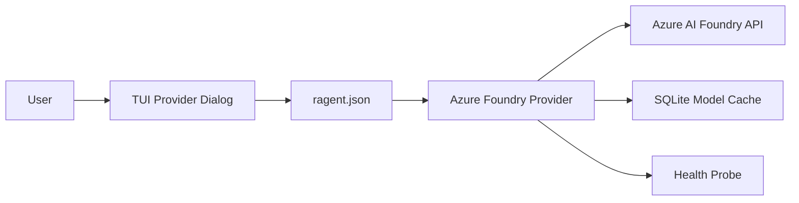

# Microsoft AI Foundry Provider

## SPEC ID: AIFoundaryProv

## Overview

Microsoft AI Foundry is a unified platform for building, deploying, and managing AI applications on Azure. It provides access to frontier models (GPT-4o, GPT-4o-mini, o1, o3-mini, Phi-4, Llama-3, Mistral) through a single OpenAI-compatible REST API endpoint. This specification defines the integration of Microsoft AI Foundry as a first-class LLM provider within ragent, enabling users to connect to models hosted on their Azure AI Foundry projects.

## Requirements

### Functional Requirements

**FR-001** The ragent provider system shall support a new provider type identified as `azure_foundry`.

**FR-002** When the user selects the `azure_foundry` provider in the provider setup dialog, the system shall prompt for the Azure AI Foundry endpoint URL and API key.

**FR-003** The `azure_foundry` provider shall authenticate API requests using a Bearer token with the `api-key` header (Azure OpenAI convention) or `Authorization: Bearer` header.

**FR-004** The `azure_foundry` provider shall support dynamic model discovery by querying the Azure AI Foundry `/models` or `/openai/models` endpoint.

**FR-005** When model discovery succeeds, the system shall cache model metadata (id, context window, capabilities) in the SQLite provider cache.

**FR-006** The `azure_foundry` provider shall implement streaming chat completions via Server-Sent Events (SSE).

**FR-007** The `azure_foundry` provider shall support tool calling (function calling) for models that advertise `tool_use` capability.

**FR-008** The `azure_foundry` provider shall support vision (image input) for models that advertise `vision` capability.

**FR-009** The `azure_foundry` provider shall support reasoning/thinking levels (`low`, `medium`, `high`) for o-series models.

**FR-010** When a model does not advertise capabilities, the system shall apply safe defaults: `streaming: true`, `tool_use: false`, `vision: false`.

**FR-011** The `azure_foundry` provider shall be configurable via `ragent.json` under the `provider.azure_foundry` key with `api_key_env`, `base_url`, `thinking`, and `models` fields.

**FR-012** When the `AZURE_AI_FOUNDRY_API_KEY` environment variable is present, the provider setup dialog shall auto-detect and pre-fill the API key.

**FR-013** The `azure_foundry` provider shall report health status via a lightweight `GET /health` or `GET /models` probe with a 5-second timeout.

**FR-014** When a request to `azure_foundry` returns HTTP 401, the system shall surface an error message indicating invalid credentials.

**FR-015** When a request to `azure_foundry` returns HTTP 429, the system shall surface an error message indicating rate limiting and suggest retry.

**FR-016** The `azure_foundry` provider shall appear in the `/provider` setup wizard, the `/model` picker, and the `/models` CLI command.

**FR-017** The `azure_foundry` provider shall support the standard ragent provider features: streaming, tool use, vision, reasoning, context window display, and usage tracking.

### Non-Functional Requirements

**NFR-001** The `azure_foundry` provider implementation shall reuse the existing HTTP client infrastructure (reqwest with rustls) used by other providers.

**NFR-002** The `azure_foundry` provider code shall be isolated in `crates/ragent-llm/src/providers/azure_foundry.rs`.

**NFR-003** The `azure_foundry` provider shall be covered by unit tests for request serialization, response parsing, and error handling.

## Constraints

- Azure AI Foundry uses OpenAI-compatible API endpoints but may have Azure-specific rate limits, authentication headers, and endpoint paths.
- Some models on Azure AI Foundry may not support all OpenAI features (e.g., streaming, tools).
- Model IDs on Azure AI Foundry may differ from OpenAI canonical names (e.g., `gpt-4o` vs `azure-gpt-4o`).

## References

- [Azure AI Foundry Documentation](https://learn.microsoft.com/en-us/azure/ai-foundry/)
- [Azure OpenAI Service REST API](https://learn.microsoft.com/en-us/azure/ai-services/openai/reference)
- ragent Generic OpenAI Provider (`crates/ragent-llm/src/providers/generic_openai.rs`)

## Diagrams

### Provider Integration

## Acceptance Criteria

1. User can run `ragent provider`, select "Azure AI Foundry", enter endpoint and API key, and successfully chat with a model.
2. `ragent models --provider azure_foundry` lists available models from the Azure AI Foundry endpoint.
3. Streaming, tool use, and vision work for compatible models.
4. Configuration persists in `ragent.json` and survives restart.
5. All new code has tests with ≥80% line coverage.

## Version History

| Version | Date | Author | Changes |
|---------|------|--------|---------|
| 1.0 | 2026-04-21 | Tim Hawkins | Initial draft |
