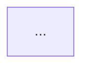

# Specification: Research Findings Relationship Diagram

## Overview

The `/research create` command produces a self-contained `RESEARCH.md`
document from gathered evidence. Each finding already carries a
**Cross-reference / Dependencies** paragraph that names other findings it
builds on, contradicts, or is prerequisite to (using `Finding N` references).
The dependency graph is also used internally by `reorder_findings_by_dependency`
to topologically sort findings before they are written.

This specification adds a **findings relationship diagram** to every
`RESEARCH.md` produced by `/research create`. The diagram is rendered in
[Mermaid.js](https://mermaid.js.org/) `flowchart` syntax, embedded directly in
the markdown inside a fenced code block, and placed in a new
`## Findings Relationship Diagram` section that sits between the existing
`## Findings` and `## In-Project Cross-References` sections.

The diagram visualises each finding as a node and each dependency as a
directed edge. The **relevance** of each link is conveyed through two visual
channels:

1. **Edge thickness** — Mermaid `linkStyle` stroke-width. A link that a
   finding explicitly depends on (the `Finding N` reference appears in the
   **Cross-reference / Dependencies** paragraph) is rendered with a thicker
   stroke than a link that is merely a passing mention.
2. **Node label font size** — Mermaid node text size. Findings with more
   incoming dependency edges (i.e. findings that other findings build upon)
   are rendered with a larger font, signalling their centrality to the
   research narrative.

The diagram is generated deterministically from the parsed findings — no
additional LLM call is required.

## Background

### Current document structure

`assemble_document` in `crates/ragent-research/src/document.rs` renders the
following sections in order (FR-010):

1. `# Title: <title>`
2. `## Topic`
3. `## Search Queries`
4. `## Summary`
5. `## Findings` — numbered findings, each with Headline, Observation,
   Analysis, Cross-reference / Dependencies, Implication paragraphs
6. `## In-Project Cross-References`
7. `## Open Questions`
8. `## References Index`

### Existing dependency data

Each finding's **Cross-reference / Dependencies** paragraph already contains
`Finding N` references. The function `reorder_findings_by_dependency` in
`analysis.rs` parses these with the regex `\bfinding\s+(\d+)\b` and builds a
directed adjacency list (dependant → dependency). The same parsing logic can
be reused to extract edges for the diagram.

### Mermaid flowchart syntax

A minimal Mermaid flowchart:

```text
flowchart TD
    F1["Finding 1 — Rust async runtime"]
    F2["Finding 2 — Tokio dominance"]
    F1 --> F2
    linkStyle 0 stroke-width:4px
```

- Nodes are declared with `F1["label"]` syntax.
- Edges are declared with `F1 --> F2`.
- `linkStyle <index> stroke-width:<N>px` styles individual edges (0-based
  index in declaration order).
- Node font size is controlled via inline HTML-style class or via the
  `classDef` keyword: `classDef central font-size:16px;` then
  `class F1 central;`.

## Requirements

### FR-001 — Diagram section presence (ubiquitous)

The `RESEARCH.md` document **shall** contain a `## Findings Relationship
Diagram` section.

> *Ubiquitous requirement — applies to every `RESEARCH.md` produced by
> `/research create`, regardless of finding count or output format.*

### FR-002 — Section ordering (state-driven)

When the `## Findings` section has been rendered, the document assembler
**shall** emit the `## Findings Relationship Diagram` section immediately
after it and before the `## In-Project Cross-References` section.

> *State-driven requirement — triggered by the assembler reaching the
> post-findings state in the fixed section sequence.*

### FR-003 — Mermaid flowchart format (ubiquitous)

The diagram **shall** be rendered as a Mermaid `flowchart TD` graph embedded
in a fenced code block annotated with the `mermaid` info string.

```markdown
## Findings Relationship Diagram


```

### FR-004 — Node per finding (event-driven)

When one or more findings are present in the `ResearchDocument`, the diagram
**shall** contain one node per finding, labelled `F<n>` where `<n>` is the
1-based finding number, with the node text set to `Finding <n> — <headline>`.

> *Event-driven requirement — triggered by the presence of findings in the
> assembled document.*

### FR-005 — Empty findings placeholder (event-driven)

When the `ResearchDocument` contains zero findings, the diagram section
**shall** display the placeholder text `_(no findings yet — the gathering
pass will populate this section)_` and **shall not** emit a Mermaid code
block.

> *Event-driven requirement — triggered by the absence of findings.*

### FR-006 — Edge per dependency (event-driven)

When a finding's **Cross-reference / Dependencies** paragraph references
`Finding N`, the diagram **shall** include a directed edge from the
referencing finding's node to the referenced finding's node
(`F<referer> --> F<referenced>`).

> *Event-driven requirement — triggered by the detection of a `Finding N`
> reference in a dependency paragraph.*

### FR-007 — Edge relevance via stroke-width (state-driven)

When an edge represents a dependency that appears in the **Cross-reference /
Dependencies** paragraph, the diagram **shall** assign that edge a
`linkStyle` stroke-width that is proportionally thicker for edges whose
dependency phrasing indicates a strong relationship (e.g. "builds on",
"depends on", "prerequisite to") and thinner for edges whose phrasing
indicates a weak relationship (e.g. "contradicts", "relates to", "see
also"). Strong edges use `stroke-width:4px`; weak edges use
`stroke-width:1.5px`; default edges use `stroke-width:2px`.

> *State-driven requirement — the link strength classification is derived
> from the dependency paragraph wording.*

### FR-008 — Node relevance via font size (state-driven)

When a finding has two or more incoming dependency edges, the diagram
**shall** apply a `classDef` with a larger font size (`font-size:15px`) to
that finding's node. Findings with zero or one incoming edge use the default
font size (`font-size:12px`).

> *State-driven requirement — the node prominence is derived from the
> computed in-degree of the dependency graph.*

### FR-009 — Self-loops and duplicate edges (unwanted)

The diagram **shall not** render self-loop edges (a finding referencing
itself) or duplicate edges between the same pair of nodes. If a finding
references itself or references the same finding multiple times, only the
first valid edge is retained.

> *Unwanted requirement — prevents degenerate graph artifacts.*

### FR-010 — Out-of-range references (unwanted)

The diagram **shall not** render edges for `Finding N` references where `N`
exceeds the total number of findings or is zero. Such references are silently
ignored.

> *Unwanted requirement — prevents edges to non-existent nodes.*

### FR-011 — Deterministic generation (optional)

The diagram **may** be generated entirely from the parsed finding bodies and
their dependency paragraphs without any additional LLM call, ensuring the
output is deterministic and reproducible.

> *Optional requirement — the implementation is encouraged to avoid extra
> LLM cost, but a future enhancement could ask the LLM to enrich edge
> labels.*

### FR-012 — Existing section count unchanged (ubiquitous)

The addition of the `## Findings Relationship Diagram` section **shall not**
remove or reorder any of the existing eight sections defined by FR-010 in
`document.rs`. The new section is inserted between `## Findings` and
`## In-Project Cross-References` only.

### FR-013 — Skeleton document (state-driven)

When `render_skeleton` is called (no findings yet), the skeleton document
**shall** include the `## Findings Relationship Diagram` section with the
zero-findings placeholder text, so the section is present from the moment
the file lands on disk.

> *State-driven requirement — triggered by the skeleton-creation state
> (empty findings).*

### FR-014 — Output format agnostic (ubiquitous)

The diagram **shall** be generated for all `OutputFormat` variants
(`Report`, `ExecutiveSummary`, `ComparisonTable`, `SourceBibliography`) as
long as the document contains findings.

### FR-015 — Mermaid syntax validity (ubiquitous)

The generated Mermaid graph **shall** be syntactically valid Mermaid
`flowchart` syntax such that it renders without error in standard Mermaid
renderers (e.g. GitHub's native Mermaid support, mermaid.live). Node labels
containing special characters (`"`, `|`, `[`, `]`) **shall** be escaped or
truncated to avoid breaking the diagram.

### FR-016 — Single-finding document (state-driven)

When the `ResearchDocument` contains exactly one finding and that finding has
no dependency references, the diagram **shall** render a single node with no
edges, and the section **shall not** be omitted.

> *State-driven requirement — triggered by the single-finding state.*

## Non-functional requirements

### NFR-001 — Performance

The diagram generation **shall** complete in under 10 ms for a document with
up to 50 findings, measured on a standard development machine. The
generation is a pure in-memory string operation with no I/O.

### NFR-002 — No new dependencies

The implementation **shall not** add any new third-party crate dependencies
to `ragent-research`. Mermaid rendering is textual; no Mermaid parser or
rendering library is required.

### NFR-003 — Testability

The diagram generation logic **shall** be exposed as a pure function
accepting `&[String]` (findings) and returning a `String` (Mermaid block),
so it can be unit-tested without constructing a full `ResearchDocument`.

## Scope

### In scope

- New `## Findings Relationship Diagram` section in `RESEARCH.md`.
- Mermaid `flowchart TD` diagram with nodes per finding and edges per
  dependency.
- Edge thickness based on dependency phrasing strength.
- Node font size based on in-degree centrality.
- Integration into `assemble_document` in `document.rs`.
- Unit tests for the diagram generation function.
- Integration test verifying the section appears in an assembled document.

### Out of scope

- Rendering Mermaid diagrams in the TUI (`/research open` viewer).
- Interactive diagram features (click-through, collapse/expand).
- LLM-enriched edge labels.
- Diagrams for cross-references to in-project files (only finding-to-finding
  relationships are diagrammed).
- Changing the existing `reorder_findings_by_dependency` topological sort
  logic (the diagram reuses the same parsing regex but does not alter
  ordering).